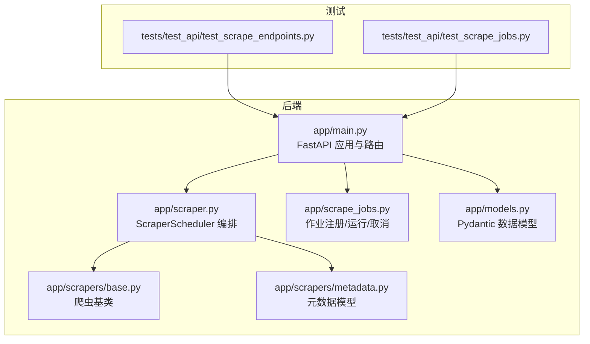
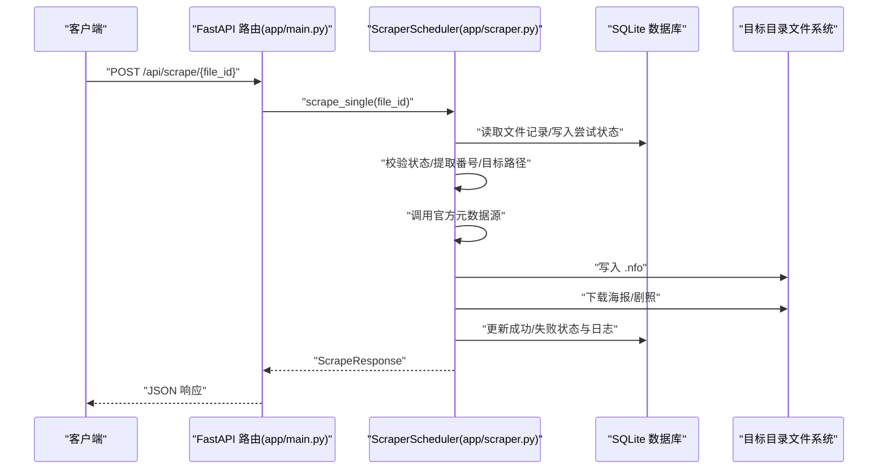
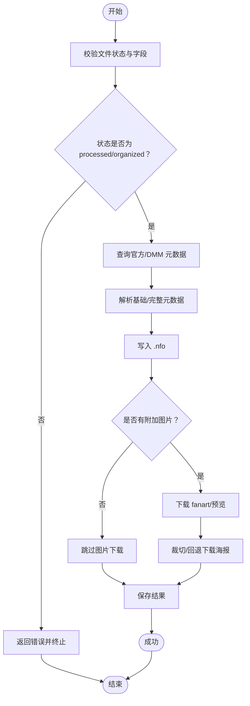
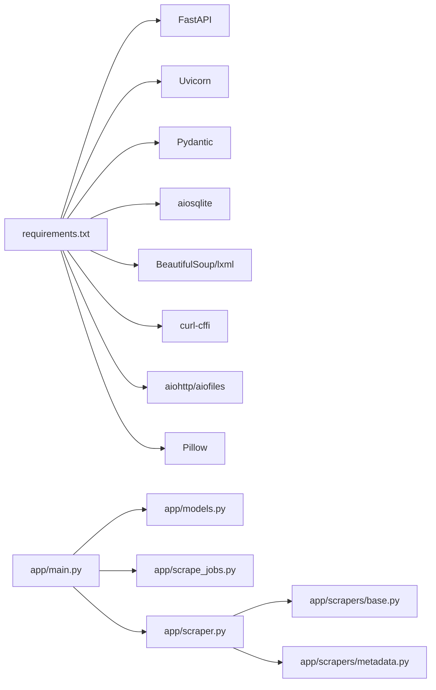
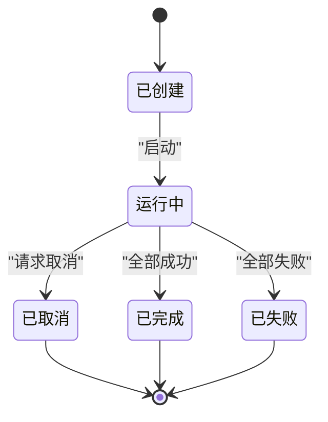

# API参考

<cite>
**本文引用的文件**
- [app/main.py](file://app/main.py)
- [app/scrape_jobs.py](file://app/scrape_jobs.py)
- [app/models.py](file://app/models.py)
- [app/scraper.py](file://app/scraper.py)
- [app/scrapers/base.py](file://app/scrapers/base.py)
- [app/scrapers/metadata.py](file://app/scrapers/metadata.py)
- [tests/test_api/test_scrape_endpoints.py](file://tests/test_api/test_scrape_endpoints.py)
- [tests/test_api/test_scrape_jobs.py](file://tests/test_api/test_scrape_jobs.py)
- [requirements.txt](file://requirements.txt)
- [README.en.md](file://README.en.md)
</cite>

## 目录
1. [简介](#简介)
2. [项目结构](#项目结构)
3. [核心组件](#核心组件)
4. [架构总览](#架构总览)
5. [详细组件分析](#详细组件分析)
6. [依赖关系分析](#依赖关系分析)
7. [性能与并发特性](#性能与并发特性)
8. [故障排查与错误处理](#故障排查与错误处理)
9. [结论](#结论)
10. [附录](#附录)

## 简介
本文件为 Noctra 的完整 API 参考文档，覆盖所有 RESTful 端点、请求/响应模型、认证方式、错误处理策略、状态码说明、刮削作业流程、参数规范与返回值格式，并提供实际使用示例与客户端实现建议。Noctra 后端基于 FastAPI + SQLite，提供本地与 NAS 部署能力，前端为静态 SPA。

## 项目结构
- 后端入口与路由：app/main.py
- 刮削作业调度：app/scrape_jobs.py
- 数据模型与 Pydantic 模型：app/models.py
- 刮削编排与日志：app/scraper.py
- 爬虫基类与元数据模型：app/scrapers/base.py、app/scrapers/metadata.py
- API 行为测试：tests/test_api/test_scrape_endpoints.py、tests/test_api/test_scrape_jobs.py
- 依赖声明：requirements.txt
- 快速入门与工作流：README.en.md

图表来源
- [app/main.py:1-1384](file://app/main.py#L1-L1384)
- [app/scraper.py:1-453](file://app/scraper.py#L1-L453)
- [app/scrape_jobs.py:1-256](file://app/scrape_jobs.py#L1-L256)
- [app/models.py:1-216](file://app/models.py#L1-L216)
- [app/scrapers/base.py:1-204](file://app/scrapers/base.py#L1-L204)
- [app/scrapers/metadata.py:1-60](file://app/scrapers/metadata.py#L1-L60)
- [tests/test_api/test_scrape_endpoints.py:1-715](file://tests/test_api/test_scrape_endpoints.py#L1-L715)
- [tests/test_api/test_scrape_jobs.py:1-312](file://tests/test_api/test_scrape_jobs.py#L1-L312)

章节来源
- [app/main.py:1-1384](file://app/main.py#L1-L1384)
- [README.en.md:1-87](file://README.en.md#L1-L87)

## 核心组件
- FastAPI 应用与路由：提供扫描、整理、刮削、历史、健康检查等端点，响应类型由 Pydantic 模型定义。
- ScraperScheduler：负责单文件刮削全流程编排（校验 → 查询元数据 → 写入 NFO → 下载图片 → 更新数据库），并维护进度与日志。
- 刮削作业系统：支持创建、轮询、取消批量刮削作业，作业内逐项推进并持久化进度与日志。
- 数据模型：统一定义请求/响应结构，确保前后端契约稳定。

章节来源
- [app/main.py:58-1384](file://app/main.py#L58-L1384)
- [app/scraper.py:82-453](file://app/scraper.py#L82-L453)
- [app/scrape_jobs.py:73-256](file://app/scrape_jobs.py#L73-L256)
- [app/models.py:1-216](file://app/models.py#L1-L216)

## 架构总览

图表来源
- [app/main.py:1356-1370](file://app/main.py#L1356-L1370)
- [app/scraper.py:89-410](file://app/scraper.py#L89-L410)

## 详细组件分析

### 通用约定
- 版本与标题：应用标题为“Noctra JAV Organizer”，版本在应用初始化处声明。
- 认证：未发现任何认证中间件或鉴权逻辑，所有端点均为公开访问。
- 健康检查：/api/health 返回运行环境与存储诊断信息。
- 错误处理：端点抛出 HTTPException 或返回 500/4xx，错误消息包含明确提示。

章节来源
- [app/main.py:58](file://app/main.py#L58)
- [app/main.py:1372-1383](file://app/main.py#L1372-L1383)

### 扫描与整理相关端点
- 扫描目录
  - 方法与路径：GET /api/scan
  - 查询参数：
    - force_rescan: 是否强制重新扫描（布尔，默认 false）
  - 成功响应：ScanResult（包含统计与文件列表）
  - 业务逻辑：扫描源目录，识别番号，计算目标路径，判定状态，去重与历史处理，批量插入/更新记录，返回统计与文件明细。
  - 状态码：200；数据库错误返回 500。
  
  章节来源
  - [app/main.py:739-885](file://app/main.py#L739-L885)

- 批量整理
  - 方法与路径：POST /api/organize
  - 请求体：OrganizeRequest（file_ids: 数组）
  - 成功响应：OrganizeResult（成功/失败计数与每项结果）
  - 业务逻辑：筛选可整理文件，按优先级排序，调用组织器移动文件，更新数据库状态，标记同类已存在。
  - 状态码：200；无可整理文件返回 200（空结果）；状态不符返回 400。
  
  章节来源
  - [app/main.py:888-954](file://app/main.py#L888-L954)

- 创建批任务
  - 方法与路径：POST /api/batches
  - 请求体：BatchCreateRequest（file_ids: 数组）
  - 成功响应：BatchJob（任务快照）
  - 业务逻辑：校验文件状态，创建批任务，后台串行执行，支持取消。
  - 状态码：200；无有效文件返回 400；状态变更返回 409；任务不存在返回 404。
  
  章节来源
  - [app/main.py:957-990](file://app/main.py#L957-L990)

- 获取批任务
  - 方法与路径：GET /api/batches/{batch_id}
  - 成功响应：BatchJob
  - 状态码：200；404。
  
  章节来源
  - [app/main.py:992-998](file://app/main.py#L992-L998)

- 取消批任务
  - 方法与路径：POST /api/batches/{batch_id}/cancel
  - 成功响应：BatchCancelResult
  - 状态码：200；404；不可取消返回 200 并提示。
  
  章节来源
  - [app/main.py:1001-1022](file://app/main.py#L1001-L1022)

- 删除文件记录
  - 方法与路径：POST /api/files/{file_id}/delete
  - 请求体：DeleteFileRequest（action: ignore_scan/delete_source）
  - 成功响应：DeleteFileResult
  - 状态码：200；404；400。
  
  章节来源
  - [app/main.py:1025-1055](file://app/main.py#L1025-L1055)

- 历史记录
  - 方法与路径：GET /api/history
  - 成功响应：HistoryResult（统计与文件列表）
  - 状态码：200。
  
  章节来源
  - [app/main.py:1058-1094](file://app/main.py#L1058-L1094)

### 刮削相关端点
- 刮削列表
  - 方法与路径：GET /api/scrape
  - 查询参数：
    - page: 页码（>=1，默认 1）
    - per_page: 每页数量（1~200，默认 50）
    - filter: all/pending/success/failed（默认 all）
    - sort: code/scrape_time（默认 code）
  - 成功响应：对象（total: 整数，items: 列表，stats: 统计，active_job: 作业快照或 null）
  - 业务逻辑：按状态过滤（processed/organized），支持分页与排序，聚合统计，解析 scrape_logs。
  - 状态码：200；400（无效 filter/sort）；500（数据库错误）。
  
  章节来源
  - [app/main.py:1097-1221](file://app/main.py#L1097-L1221)

- 单文件刮削
  - 方法与路径：POST /api/scrape/{file_id}
  - 成功响应：ScrapeResponse（success/code/error/user_message/stage/source/logs）
  - 异常：内部异常返回 500。
  
  章节来源
  - [app/main.py:1356-1370](file://app/main.py#L1356-L1370)

- 批量刮削
  - 方法与路径：POST /api/scrape/batch
  - 请求体：OrganizeRequest（file_ids: 数组）
  - 成功响应：ScrapeBatchResult（success_count/failed_count/results）
  - 状态码：200。
  
  章节来源
  - [app/main.py:1314-1353](file://app/main.py#L1314-L1353)

- 刮削详情
  - 方法与路径：GET /api/scrape/{file_id}/detail
  - 成功响应：ScrapeDetailResponse（file_id/code/poster_url/files/ metadata）
  - 业务逻辑：解析输出目录，收集产物文件，读取 NFO 元数据，定位海报。
  - 状态码：200；404（文件或产物不存在）。
  
  章节来源
  - [app/main.py:1224-1255](file://app/main.py#L1224-L1255)

- 刮削产物文件
  - 方法与路径：GET /api/scrape/{file_id}/artifacts/{filename}
  - 成功响应：文件流（FileResponse）
  - 状态码：200；404。
  
  章节来源
  - [app/main.py:1258-1268](file://app/main.py#L1258-L1268)

- 刮削作业
  - 创建作业
    - 方法与路径：POST /api/scrape/jobs
    - 请求体：ScrapeJobCreateRequest（file_ids: 数组）
    - 成功响应：ScrapeJobSnapshot
    - 状态码：200；409（已有运行中作业）；400（无可刮削文件）；404（任务不存在）。
  - 获取作业
    - 方法与路径：GET /api/scrape/jobs/{job_id}
    - 成功响应：ScrapeJobSnapshot
    - 状态码：200；404。
  - 取消作业
    - 方法与路径：POST /api/scrape/jobs/{job_id}/cancel
    - 成功响应：ScrapeJobCancelResult
    - 状态码：200；404。
  
  章节来源
  - [app/main.py:1271-1312](file://app/main.py#L1271-L1312)
  - [app/scrape_jobs.py:73-128](file://app/scrape_jobs.py#L73-L128)

### 数据模型与响应结构
- 文件记录与统计
  - FileRecord：id/original_path/identified_code/target_path/status/file_size/file_mtime/created_at/updated_at
  - StatsSummary/ScanResult/HistoryResult：包含 total_files/identified/unidentified/pending/processed/scraped/scrape_failed 与 files 列表
- 刮削相关
  - ScrapeListItem：file_id/code/target_path/original_path/status/scrape_status/时间戳/阶段/来源/错误/日志
  - ScrapeJobItem/ScrapeJobSnapshot：任务项与快照，含进度百分比、最近日志、当前文件与阶段
  - ScrapeResponse：单次刮削结果（success/code/error/user_message/stage/source/logs）
  - ScrapeDetailResponse：详情页聚合（poster_url/files/metadata）
  - ScrapeBatchResult：批量刮削汇总
- 日志与诊断
  - ScrapeLogEntry：at/level/stage/source/message/progress_percent

章节来源
- [app/models.py:7-216](file://app/models.py#L7-L216)

### 刮削流程与进度映射

图表来源
- [app/scraper.py:89-410](file://app/scraper.py#L89-L410)

章节来源
- [app/scraper.py:24-39](file://app/scraper.py#L24-L39)

### 爬虫与元数据
- BaseCrawler：提供浏览器指纹伪装、Cloudflare 挑战检测、重试与诊断记录。
- ScrapingMetadata：标准化元数据结构（基础信息、制作信息、媒体资源）。

章节来源
- [app/scrapers/base.py:15-204](file://app/scrapers/base.py#L15-L204)
- [app/scrapers/metadata.py:6-60](file://app/scrapers/metadata.py#L6-L60)

### API 使用示例与客户端实现建议
- 健康检查
  - curl http://host:port/api/health
- 扫描目录
  - curl "http://host:port/api/scan?force_rescan=false"
- 批量整理
  - curl -X POST http://host:port/api/organize -H "Content-Type: application/json" -d '{"file_ids":[1,2,3]}'
- 创建批任务
  - curl -X POST http://host:port/api/batches -H "Content-Type: application/json" -d '{"file_ids":[1,2,3]}'
- 获取批任务
  - curl http://host:port/api/batches/{batch_id}
- 取消批任务
  - curl -X POST http://host:port/api/batches/{batch_id}/cancel
- 刮削列表
  - curl "http://host:port/api/scrape?page=1&per_page=50&filter=all&sort=code"
- 单文件刮削
  - curl -X POST http://host:port/api/scrape/{file_id}
- 批量刮削
  - curl -X POST http://host:port/api/scrape/batch -H "Content-Type: application/json" -d '{"file_ids":[1,2,3]}'
- 刮削详情
  - curl http://host:port/api/scrape/{file_id}/detail
- 获取产物文件
  - curl http://host:port/api/scrape/{file_id}/artifacts/{filename}

章节来源
- [README.en.md:74-79](file://README.en.md#L74-L79)
- [app/main.py:1372-1383](file://app/main.py#L1372-L1383)

## 依赖关系分析
- 运行时依赖：FastAPI、Uvicorn、Pydantic、aiosqlite、BeautifulSoup、lxml、curl-cffi、aiohttp、aiofiles、Pillow。
- 关键耦合点：
  - app/main.py 依赖 app/models.py 的数据模型与 app/scrape_jobs.py 的作业管理。
  - app/scraper.py 依赖 app/scrapers/base.py 与 app/scrapers/metadata.py 的爬取与元数据结构。
  - 作业系统与单文件刮削共享同一调度器，保证进度与日志一致性。

图表来源
- [requirements.txt:1-12](file://requirements.txt#L1-L12)
- [app/main.py:18-49](file://app/main.py#L18-L49)
- [app/scraper.py:13-18](file://app/scraper.py#L13-L18)

章节来源
- [requirements.txt:1-12](file://requirements.txt#L1-L12)

## 性能与并发特性
- 异步数据库：使用 aiosqlite，I/O 密集场景下提升吞吐。
- 并发执行：批任务与作业系统采用 asyncio 锁与异步任务，避免竞争条件。
- 刮削进度：阶段进度百分比单调递增，防止回退。
- 爬虫重试：多浏览器指纹与 Cloudflare 挑战检测，提高成功率。
- 前端交互：SPA 通过轮询作业快照与列表接口更新 UI。

章节来源
- [app/main.py:70-73](file://app/main.py#L70-L73)
- [app/scrape_jobs.py:22-23](file://app/scrape_jobs.py#L22-L23)
- [app/scraper.py:24-39](file://app/scraper.py#L24-L39)
- [app/scrapers/base.py:124-204](file://app/scrapers/base.py#L124-L204)

## 故障排查与错误处理
- 常见错误与状态码
  - 400：参数非法（如 filter/sort 不合法）、缺少可整理文件、删除动作不支持。
  - 404：资源不存在（文件/批任务/作业）。
  - 409：冲突（已有运行中的刮削作业）。
  - 500：服务器内部错误（数据库异常、调度器异常）。
- 用户友好提示
  - 失败映射：根据阶段与技术错误生成用户可理解的消息（如 Cloudflare 拦截、未找到番号、写入失败等）。
- 日志与诊断
  - ScrapeLogEntry 提供 at/level/stage/source/message/progress_percent，便于前端展示与问题定位。
  - 爬虫基类记录诊断信息与最后错误，辅助排障。

章节来源
- [app/main.py:1114-1121](file://app/main.py#L1114-L1121)
- [app/main.py:1188-1189](file://app/main.py#L1188-L1189)
- [app/scraper.py:59-80](file://app/scraper.py#L59-L80)
- [app/scraper.py:102-150](file://app/scraper.py#L102-L150)
- [app/scrapers/base.py:72-87](file://app/scrapers/base.py#L72-L87)

## 结论
Noctra 提供清晰的 REST API 与一致的数据模型，覆盖从扫描、整理到刮削的完整工作流。API 设计遵循 REST 原则，错误处理明确，前端可通过轮询作业快照与列表接口实现良好交互体验。当前版本未内置认证机制，部署时建议结合反向代理或网关进行访问控制与 TLS 终止。

## 附录

### 端点一览与参数规范
- GET /api/scan
  - 查询参数：force_rescan: bool
  - 响应：ScanResult
- POST /api/organize
  - 请求体：OrganizeRequest
  - 响应：OrganizeResult
- POST /api/batches
  - 请求体：BatchCreateRequest
  - 响应：BatchJob
- GET /api/batches/{batch_id}
  - 响应：BatchJob
- POST /api/batches/{batch_id}/cancel
  - 响应：BatchCancelResult
- POST /api/files/{file_id}/delete
  - 请求体：DeleteFileRequest
  - 响应：DeleteFileResult
- GET /api/history
  - 响应：HistoryResult
- GET /api/scrape
  - 查询参数：page:int, per_page:int, filter:str, sort:str
  - 响应：对象（total/items/stats/active_job）
- POST /api/scrape/{file_id}
  - 响应：ScrapeResponse
- POST /api/scrape/batch
  - 请求体：OrganizeRequest
  - 响应：ScrapeBatchResult
- GET /api/scrape/{file_id}/detail
  - 响应：ScrapeDetailResponse
- GET /api/scrape/{file_id}/artifacts/{filename}
  - 响应：文件流
- POST /api/scrape/jobs
  - 请求体：ScrapeJobCreateRequest
  - 响应：ScrapeJobSnapshot
- GET /api/scrape/jobs/{job_id}
  - 响应：ScrapeJobSnapshot
- POST /api/scrape/jobs/{job_id}/cancel
  - 响应：ScrapeJobCancelResult
- GET /api/health
  - 响应：运行状态与诊断信息

章节来源
- [app/main.py:739-1383](file://app/main.py#L739-L1383)

### 错误处理与状态码对照
- 400：参数非法、缺少可整理文件、删除动作不支持
- 404：文件/批任务/作业不存在
- 409：已有运行中的刮削作业
- 500：服务器内部错误

章节来源
- [app/main.py:1114-1121](file://app/main.py#L1114-L1121)
- [app/main.py:1188-1189](file://app/main.py#L1188-L1189)

### 刮削作业生命周期

图表来源
- [app/scrape_jobs.py:130-144](file://app/scrape_jobs.py#L130-L144)