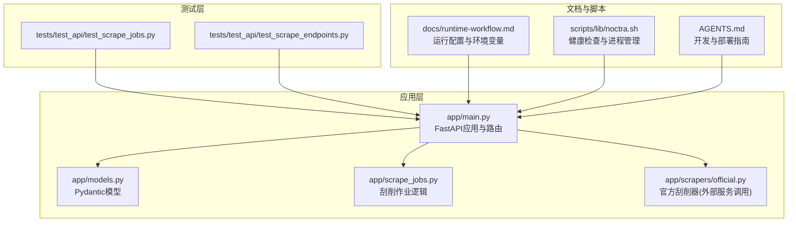
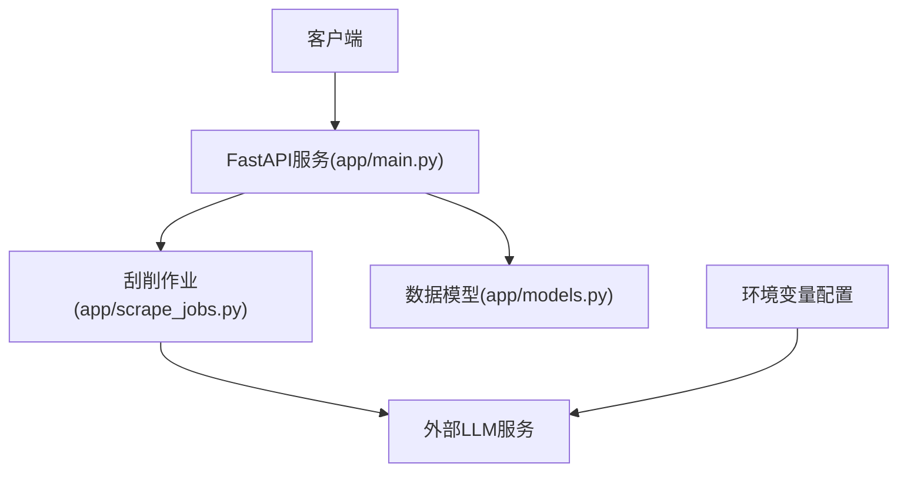
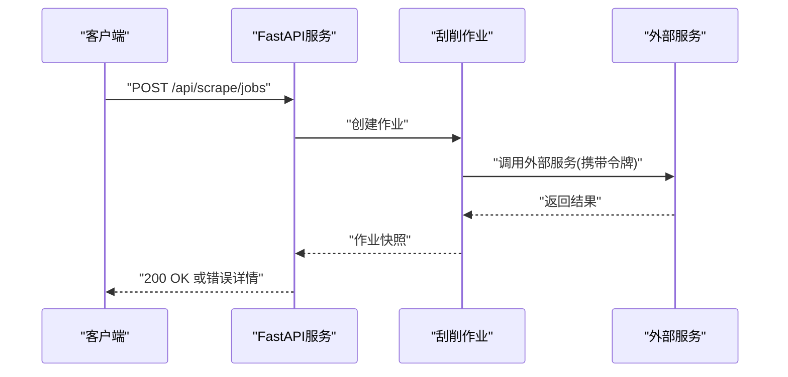
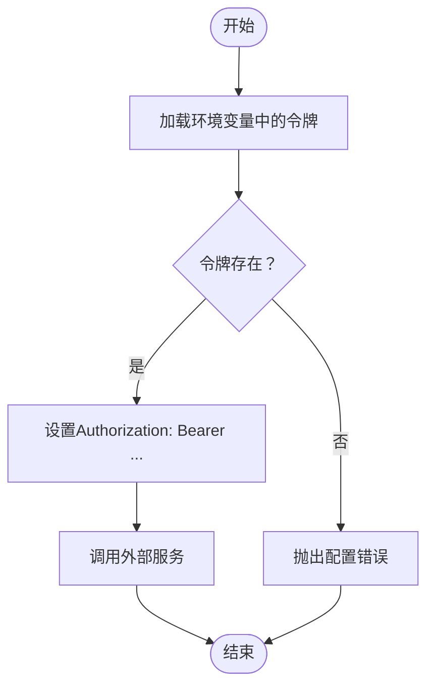
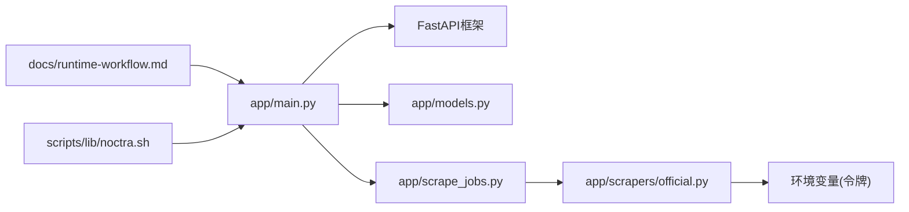
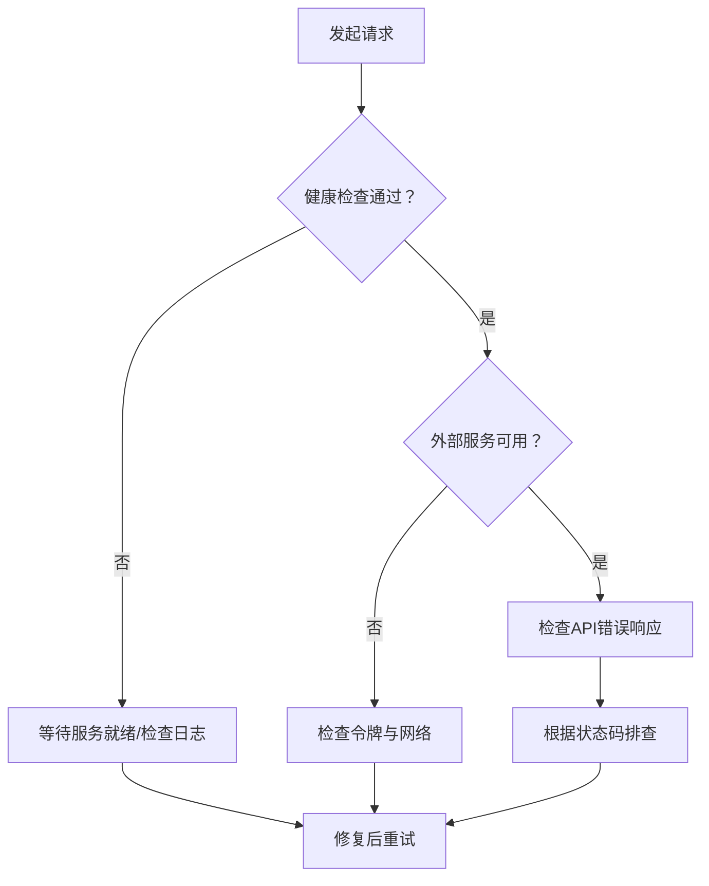

# API认证与授权

<cite>
**本文档引用的文件**
- [app/main.py](file://app/main.py)
- [app/models.py](file://app/models.py)
- [app/scrape_jobs.py](file://app/scrape_jobs.py)
- [app/scrapers/official.py](file://app/scrapers/official.py)
- [tests/test_api/test_scrape_jobs.py](file://tests/test_api/test_scrape_jobs.py)
- [tests/test_api/test_scrape_endpoints.py](file://tests/test_api/test_scrape_endpoints.py)
- [docs/runtime-workflow.md](file://docs/runtime-workflow.md)
- [AGENTS.md](file://AGENTS.md)
- [scripts/lib/noctra.sh](file://scripts/lib/noctra.sh)
</cite>

## 目录
1. [简介](#简介)
2. [项目结构](#项目结构)
3. [核心组件](#核心组件)
4. [架构总览](#架构总览)
5. [详细组件分析](#详细组件分析)
6. [依赖关系分析](#依赖关系分析)
7. [性能考虑](#性能考虑)
8. [故障排除指南](#故障排除指南)
9. [结论](#结论)
10. [附录](#附录)

## 简介
本文件聚焦于Noctra项目的API认证与授权机制，结合仓库中现有的FastAPI路由、测试用例以及外部依赖配置，系统化梳理当前的访问控制策略、认证方式、权限边界、令牌管理与安全防护现状，并给出可操作的改进建议与最佳实践。需要特别说明的是：当前代码库未发现内置的用户账户体系、API密钥管理、JWT令牌颁发与刷新、RBAC访问控制列表等传统认证授权实现；项目通过环境变量注入第三方服务凭据（如LLM服务）进行外部接口访问。

## 项目结构
Noctra基于FastAPI构建Web服务，核心应用入口位于app/main.py，负责定义路由、健康检查与静态资源挂载；数据模型定义在app/models.py；刮削作业相关逻辑在app/scrape_jobs.py；对外部服务的访问在app/scrapers/official.py中体现为HTTP请求头携带的Bearer令牌。测试用例位于tests/test_api/目录下，覆盖了部分API端点行为。

**图表来源**
- [app/main.py](file://app/main.py)
- [app/models.py](file://app/models.py)
- [app/scrape_jobs.py](file://app/scrape_jobs.py)
- [app/scrapers/official.py](file://app/scrapers/official.py)
- [tests/test_api/test_scrape_jobs.py](file://tests/test_api/test_scrape_jobs.py)
- [tests/test_api/test_scrape_endpoints.py](file://tests/test_api/test_scrape_endpoints.py)
- [docs/runtime-workflow.md](file://docs/runtime-workflow.md)
- [scripts/lib/noctra.sh](file://scripts/lib/noctra.sh)
- [AGENTS.md](file://AGENTS.md)

**章节来源**
- [app/main.py](file://app/main.py)
- [docs/runtime-workflow.md](file://docs/runtime-workflow.md)
- [AGENTS.md](file://AGENTS.md)

## 核心组件
- FastAPI应用与路由：定义了健康检查、扫描、整理、刮削作业等API端点，采用标准HTTP状态码返回错误信息。
- 数据模型：使用Pydantic定义请求与响应结构，确保输入输出的类型安全。
- 刮削作业：提供作业创建、查询、取消等接口，支持异步执行与状态追踪。
- 外部服务调用：通过HTTP请求头携带Bearer令牌访问外部服务（如LLM），令牌来源于环境变量。

**章节来源**
- [app/main.py](file://app/main.py)
- [app/models.py](file://app/models.py)
- [app/scrape_jobs.py](file://app/scrape_jobs.py)
- [app/scrapers/official.py](file://app/scrapers/official.py)

## 架构总览
Noctra的API层采用轻量级无状态设计：客户端直接向FastAPI服务发起HTTP请求；服务端根据路由规则处理业务逻辑，必要时调用外部服务（如LLM）。当前未实现内置的用户认证与授权，而是通过环境变量注入第三方服务凭据，形成“服务到服务”的访问模式。

**图表来源**
- [app/main.py](file://app/main.py)
- [app/scrape_jobs.py](file://app/scrape_jobs.py)
- [app/models.py](file://app/models.py)
- [app/scrapers/official.py](file://app/scrapers/official.py)

## 详细组件分析

### 认证与授权现状
- 当前未发现内置的用户账户体系、API密钥管理、JWT颁发与刷新、RBAC访问控制列表等机制。
- 服务通过环境变量加载第三方服务凭据（如LLM），用于对外部接口进行身份验证。
- API端点未强制要求认证，错误处理以HTTP状态码与错误消息为主。

**章节来源**
- [app/main.py](file://app/main.py)
- [app/scrapers/official.py](file://app/scrapers/official.py)

### API端点与访问控制
- 健康检查：用于服务可用性探测，通常无需认证。
- 刮削作业：提供创建、查询、取消等端点，返回标准HTTP状态码与错误详情。
- 错误处理：当资源不存在或业务异常时，返回4xx/5xx状态码及错误描述。

**图表来源**
- [app/main.py](file://app/main.py)
- [app/scrape_jobs.py](file://app/scrape_jobs.py)
- [app/scrapers/official.py](file://app/scrapers/official.py)

**章节来源**
- [app/main.py](file://app/main.py)
- [app/scrape_jobs.py](file://app/scrape_jobs.py)
- [tests/test_api/test_scrape_jobs.py](file://tests/test_api/test_scrape_jobs.py)
- [tests/test_api/test_scrape_endpoints.py](file://tests/test_api/test_scrape_endpoints.py)

### 外部服务令牌管理
- 令牌来源：通过环境变量注入（如NOCTRA_LLM_API_KEY、OPENAI_API_KEY）。
- 使用方式：在HTTP请求头中以Bearer形式传递给外部服务。
- 安全建议：建议将令牌存储在受控的密钥管理系统中，避免硬编码在配置文件或镜像中。

**图表来源**
- [app/scrapers/official.py](file://app/scrapers/official.py)

**章节来源**
- [app/scrapers/official.py](file://app/scrapers/official.py)

### 用户角色与权限边界
- 当前代码库未定义用户角色、权限级别或访问控制列表（ACL）。
- 业务层面的访问控制主要依赖于端点可见性与错误处理（如404表示资源不存在）。

**章节来源**
- [app/main.py](file://app/main.py)
- [app/models.py](file://app/models.py)

### 认证流程与安全最佳实践
- 无内置认证流程：客户端可直接访问API端点。
- 建议实施的流程（概念性说明）：
  - 引入用户注册/登录端点，颁发短期访问令牌与刷新令牌。
  - 在中间件中校验令牌有效性与权限范围。
  - 对敏感端点启用细粒度权限控制（如只读/写入）。
  - 实施速率限制与防滥用策略（见后续章节）。

[本节为概念性说明，不直接分析具体文件，故不附加章节来源]

## 依赖关系分析
- 应用依赖：FastAPI、Pydantic、SQLite（通过ORM/查询语句使用）。
- 外部依赖：第三方LLM服务（通过Bearer令牌访问）。
- 运行时依赖：环境变量配置文件（通过配置文件与脚本加载）。

**图表来源**
- [app/main.py](file://app/main.py)
- [app/models.py](file://app/models.py)
- [app/scrape_jobs.py](file://app/scrape_jobs.py)
- [app/scrapers/official.py](file://app/scrapers/official.py)
- [docs/runtime-workflow.md](file://docs/runtime-workflow.md)
- [scripts/lib/noctra.sh](file://scripts/lib/noctra.sh)

**章节来源**
- [app/main.py](file://app/main.py)
- [app/models.py](file://app/models.py)
- [app/scrape_jobs.py](file://app/scrape_jobs.py)
- [app/scrapers/official.py](file://app/scrapers/official.py)
- [docs/runtime-workflow.md](file://docs/runtime-workflow.md)
- [scripts/lib/noctra.sh](file://scripts/lib/noctra.sh)

## 性能考虑
- 无内置限流与缓存：当前未发现针对API端点的速率限制或缓存策略。
- 建议：
  - 在网关或中间件层实施基于IP/令牌的限流。
  - 对高频查询端点增加缓存与ETag支持。
  - 优化外部服务调用的超时与重试策略。

[本节提供一般性建议，不直接分析具体文件，故不附加章节来源]

## 故障排除指南
- 健康检查失败：使用脚本等待服务就绪，确认端口与网络可达。
- 环境变量缺失：检查配置文件与脚本是否正确加载环境变量。
- 外部服务调用失败：核对令牌配置与网络连通性。
- API错误响应：根据HTTP状态码与错误消息定位问题（如404表示资源不存在）。

**图表来源**
- [scripts/lib/noctra.sh](file://scripts/lib/noctra.sh)
- [app/main.py](file://app/main.py)

**章节来源**
- [scripts/lib/noctra.sh](file://scripts/lib/noctra.sh)
- [app/main.py](file://app/main.py)

## 结论
Noctra当前的API未实现内置的认证与授权机制，服务通过环境变量注入外部服务令牌进行访问。建议尽快引入用户认证、令牌管理与权限控制，同时实施限流与防滥用策略，以满足生产环境的安全与稳定性要求。本文档提供了当前实现的概览与改进路线图，便于后续迭代完善。

[本节为总结性内容，不直接分析具体文件，故不附加章节来源]

## 附录
- 开发与部署参考：运行配置、环境变量加载与健康检查流程。
- 测试用例参考：API端点行为验证与错误场景覆盖。

**章节来源**
- [docs/runtime-workflow.md](file://docs/runtime-workflow.md)
- [AGENTS.md](file://AGENTS.md)
- [tests/test_api/test_scrape_jobs.py](file://tests/test_api/test_scrape_jobs.py)
- [tests/test_api/test_scrape_endpoints.py](file://tests/test_api/test_scrape_endpoints.py)