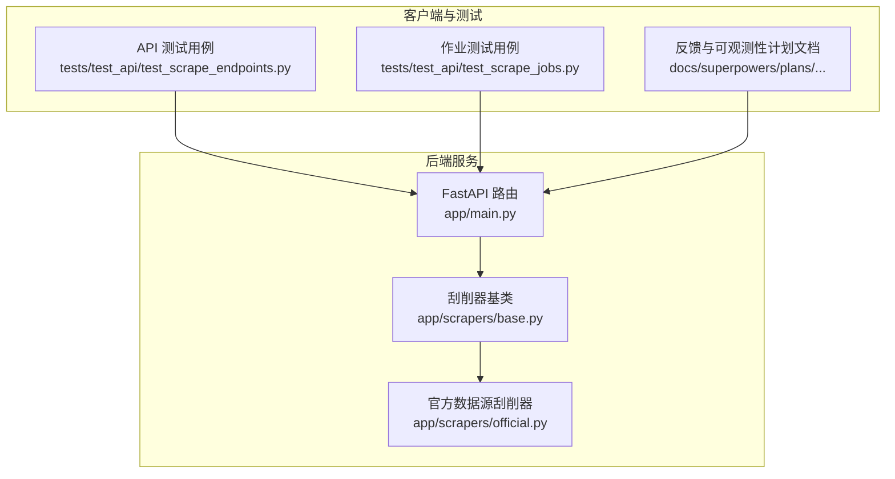
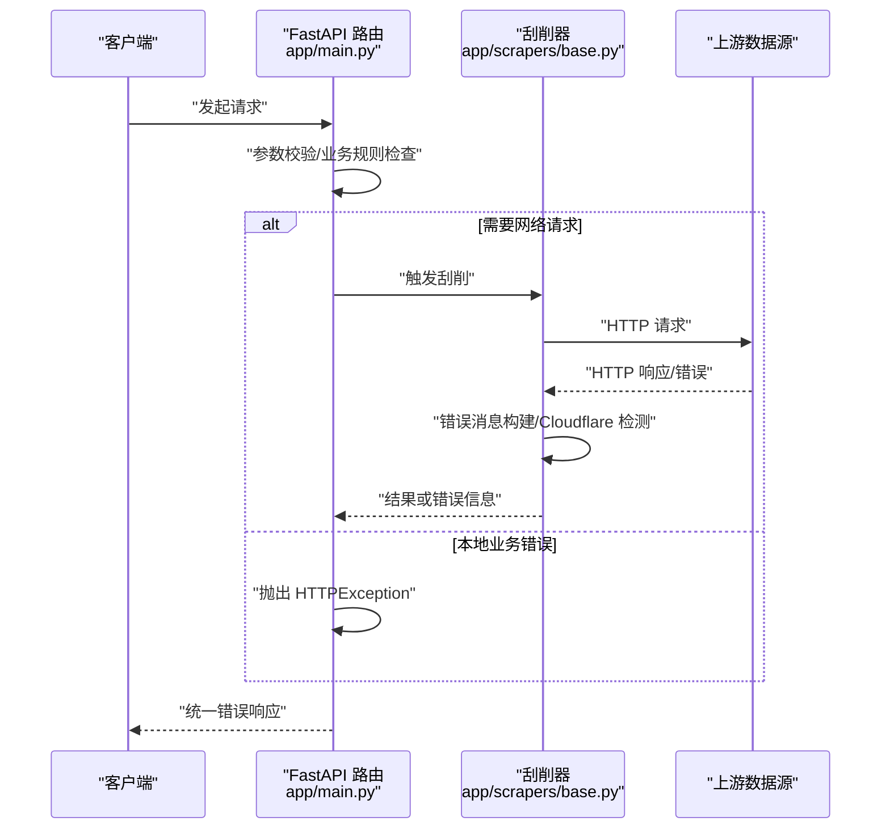
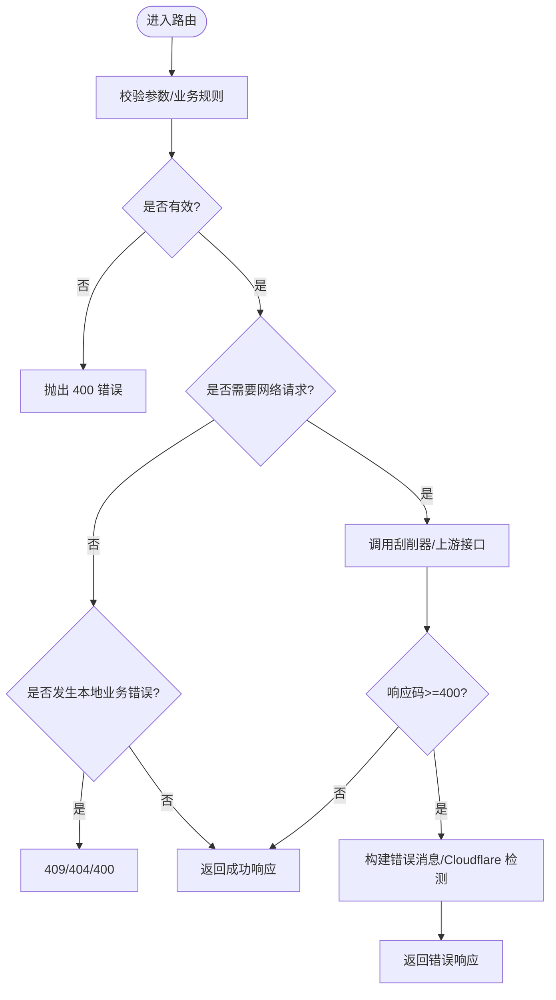
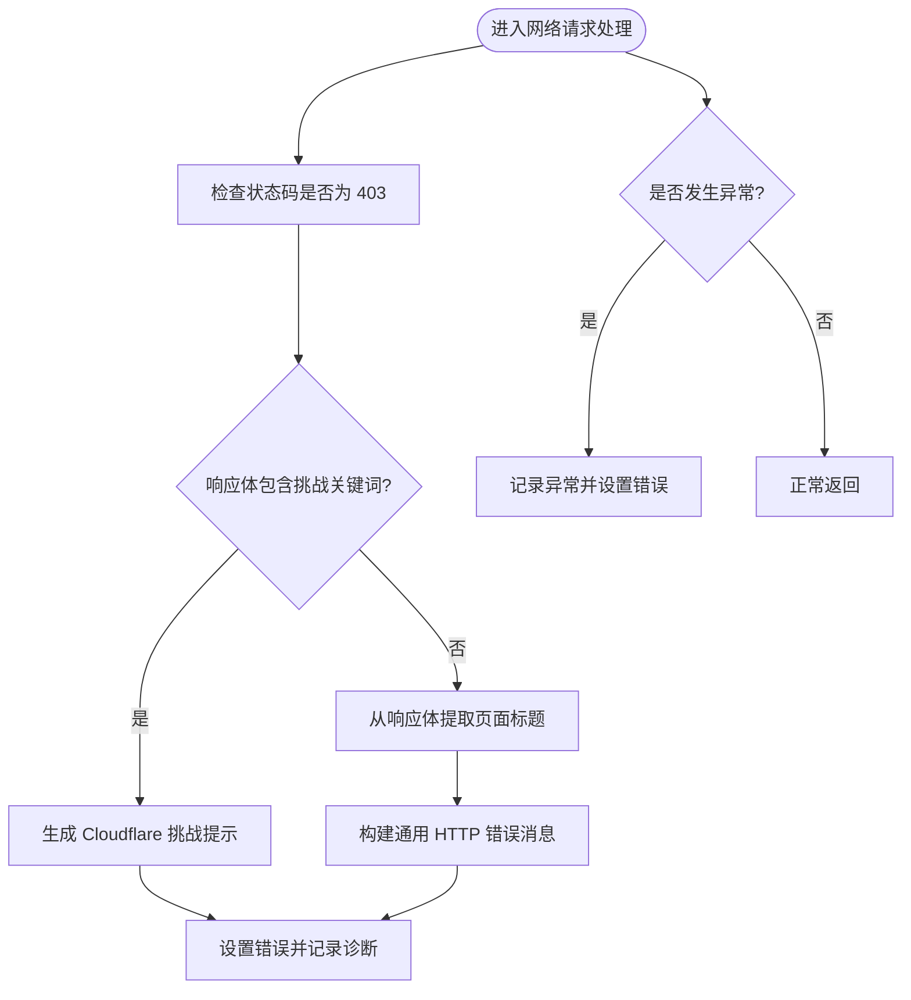
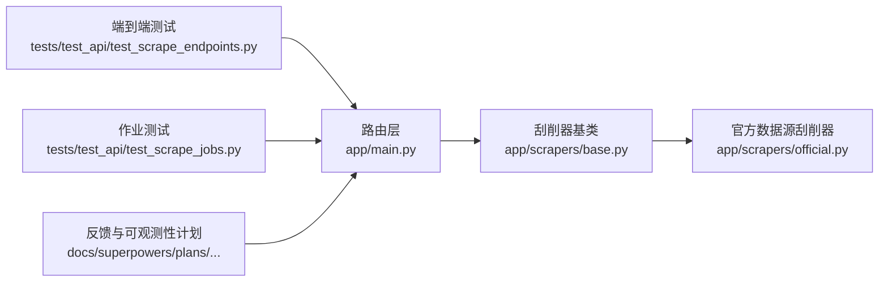

# API错误处理

<cite>
**本文引用的文件**
- [app/main.py](file://app/main.py)
- [app/scrapers/base.py](file://app/scrapers/base.py)
- [app/scrapers/official.py](file://app/scrapers/official.py)
- [tests/test_api/test_scrape_endpoints.py](file://tests/test_api/test_scrape_endpoints.py)
- [tests/test_api/test_scrape_jobs.py](file://tests/test_api/test_scrape_jobs.py)
- [docs/superpowers/plans/2026-03-27-scrape-feedback-observability.md](file://docs/superpowers/plans/2026-03-27-scrape-feedback-observability.md)
</cite>

## 目录
1. [简介](#简介)
2. [项目结构](#项目结构)
3. [核心组件](#核心组件)
4. [架构总览](#架构总览)
5. [详细组件分析](#详细组件分析)
6. [依赖关系分析](#依赖关系分析)
7. [性能考量](#性能考量)
8. [故障排查指南](#故障排查指南)
9. [结论](#结论)
10. [附录](#附录)

## 简介
本文件为 Noctra API 的错误处理与状态码参考文档，覆盖网络错误、业务逻辑错误与服务端错误的分类与处理策略；统一标准错误响应格式、错误代码与错误消息结构；提供常见错误场景的诊断方法与解决方案；记录 API 版本兼容性与迁移要点；并给出调试工具与日志分析方法。

## 项目结构
Noctra 的 API 错误处理主要集中在后端路由层（FastAPI 路由与异常抛出）、刮削器网络请求与错误消息构建、以及测试用例对错误行为的验证。关键位置如下：
- 路由与异常抛出：app/main.py 中定义了多处 HTTP 异常抛出点，涵盖参数校验、资源不存在、并发冲突、数据库错误等。
- 刮削器网络错误处理：app/scrapers/base.py 提供通用 HTTP 响应错误消息构建与 Cloudflare 挑战识别；app/scrapers/official.py 展示了对上游返回码的检查。
- 测试与可观测性：tests/test_api 下的端到端与单元测试验证了错误响应与用户提示；文档中记录了“scrape_error_user_message”等字段用于向用户展示友好错误信息。

图表来源
- [app/main.py](file://app/main.py)
- [app/scrapers/base.py](file://app/scrapers/base.py)
- [app/scrapers/official.py](file://app/scrapers/official.py)
- [tests/test_api/test_scrape_endpoints.py](file://tests/test_api/test_scrape_endpoints.py)
- [tests/test_api/test_scrape_jobs.py](file://tests/test_api/test_scrape_jobs.py)
- [docs/superpowers/plans/2026-03-27-scrape-feedback-observability.md](file://docs/superpowers/plans/2026-03-27-scrape-feedback-observability.md)

章节来源
- [app/main.py](file://app/main.py)
- [app/scrapers/base.py](file://app/scrapers/base.py)
- [app/scrapers/official.py](file://app/scrapers/official.py)
- [tests/test_api/test_scrape_endpoints.py](file://tests/test_api/test_scrape_endpoints.py)
- [tests/test_api/test_scrape_jobs.py](file://tests/test_api/test_scrape_jobs.py)
- [docs/superpowers/plans/2026-03-27-scrape-feedback-observability.md](file://docs/superpowers/plans/2026-03-27-scrape-feedback-observability.md)

## 核心组件
- 路由层异常抛出：在路由函数中通过抛出 HTTPException 实现标准化错误响应，包含状态码与错误详情。
- 刮削器网络错误处理：对上游 HTTP 响应进行解析与错误消息构建，识别 Cloudflare 挑战并生成用户可理解的提示。
- 测试与可观测性：通过测试用例验证错误响应结构与用户消息字段，文档中明确了用户可见错误消息字段。

章节来源
- [app/main.py](file://app/main.py)
- [app/scrapers/base.py](file://app/scrapers/base.py)
- [tests/test_api/test_scrape_endpoints.py](file://tests/test_api/test_scrape_endpoints.py)
- [docs/superpowers/plans/2026-03-27-scrape-feedback-observability.md](file://docs/superpowers/plans/2026-03-27-scrape-feedback-observability.md)

## 架构总览
下图展示了 API 错误处理的整体流程：客户端请求进入 FastAPI 路由，路由根据业务规则与输入参数进行校验，必要时调用刮削器执行网络请求，最终以统一的错误响应格式返回。

图表来源
- [app/main.py](file://app/main.py)
- [app/scrapers/base.py](file://app/scrapers/base.py)
- [app/scrapers/official.py](file://app/scrapers/official.py)

## 详细组件分析

### 路由层错误处理（HTTP 状态码与异常）
- 参数校验失败：当过滤条件或排序字段不在允许集合内时，返回 400 并携带具体错误详情。
- 资源不存在：当批量任务、单个文件或产物不存在时，返回 404。
- 并发冲突：当文件状态变化导致操作冲突时，返回 409。
- 数据库错误：捕获数据库异常并返回 500。
- 其他业务错误：如不支持的删除动作、无可用文件等，返回 400 或 404。
- 未预期异常：路由内部未捕获的异常统一返回 500。

图表来源
- [app/main.py](file://app/main.py)
- [app/scrapers/base.py](file://app/scrapers/base.py)
- [app/scrapers/official.py](file://app/scrapers/official.py)

章节来源
- [app/main.py](file://app/main.py)

### 刮削器网络错误处理（Cloudflare 与通用 HTTP 错误）
- Cloudflare 挑战识别：当响应状态码为 403 且响应体包含特定关键词时，判定为 Cloudflare 挑战，生成用户可理解的提示。
- 通用 HTTP 错误消息构建：从响应体提取标题，结合状态码生成带上下文的错误描述。
- 异常捕获：对网络请求过程中的异常进行捕获与记录，便于后续诊断。

图表来源
- [app/scrapers/base.py](file://app/scrapers/base.py)

章节来源
- [app/scrapers/base.py](file://app/scrapers/base.py)

### 测试用例中的错误行为验证
- GET /api/scrape：验证参数校验（无效 filter/sort）返回 400；验证成功场景返回 200。
- POST /api/scrape/{file_id}：验证失败场景返回 200（success=false, error 字段），验证未预期异常返回 500。
- 作业相关：验证作业状态、进度与最近日志字段，确保错误信息可被前端消费。

章节来源
- [tests/test_api/test_scrape_endpoints.py](file://tests/test_api/test_scrape_endpoints.py)
- [tests/test_api/test_scrape_jobs.py](file://tests/test_api/test_scrape_jobs.py)

### 用户可见错误消息与可观测性
- 文档中明确“scrape_error_user_message”字段用于向用户展示可理解的错误提示，配合“scrape_logs”记录执行阶段与技术细节。
- 测试用例验证该字段的存在与内容，确保前端能正确呈现用户友好的错误信息。

章节来源
- [docs/superpowers/plans/2026-03-27-scrape-feedback-observability.md](file://docs/superpowers/plans/2026-03-27-scrape-feedback-observability.md)
- [tests/test_api/test_scrape_endpoints.py](file://tests/test_api/test_scrape_endpoints.py)

## 依赖关系分析
- 路由层依赖刮削器模块进行网络请求与错误消息构建。
- 刮削器模块依赖上游数据源接口，需处理 4xx/5xx 与 Cloudflare 挑战。
- 测试用例依赖路由与模型定义，验证错误响应结构与用户消息字段。

图表来源
- [app/main.py](file://app/main.py)
- [app/scrapers/base.py](file://app/scrapers/base.py)
- [app/scrapers/official.py](file://app/scrapers/official.py)
- [tests/test_api/test_scrape_endpoints.py](file://tests/test_api/test_scrape_endpoints.py)
- [tests/test_api/test_scrape_jobs.py](file://tests/test_api/test_scrape_jobs.py)
- [docs/superpowers/plans/2026-03-27-scrape-feedback-observability.md](file://docs/superpowers/plans/2026-03-27-scrape-feedback-observability.md)

章节来源
- [app/main.py](file://app/main.py)
- [app/scrapers/base.py](file://app/scrapers/base.py)
- [app/scrapers/official.py](file://app/scrapers/official.py)
- [tests/test_api/test_scrape_endpoints.py](file://tests/test_api/test_scrape_endpoints.py)
- [tests/test_api/test_scrape_jobs.py](file://tests/test_api/test_scrape_jobs.py)
- [docs/superpowers/plans/2026-03-27-scrape-feedback-observability.md](file://docs/superpowers/plans/2026-03-27-scrape-feedback-observability.md)

## 性能考量
- 错误路径尽量避免重复 IO 与复杂计算，优先快速失败与短路返回。
- 对上游接口的错误消息构建应限制正则匹配范围与字符串处理开销。
- 日志记录应区分级别与上下文，避免在高频错误路径中产生过多冗余输出。

## 故障排查指南
- 参数校验失败（400）：检查 filter/sort 是否在允许集合内；确认请求参数类型与范围。
- 资源不存在（404）：确认批量任务、文件或产物 ID 是否正确；检查是否存在软删除或清理逻辑。
- 并发冲突（409）：提示用户刷新列表后重试；检查业务状态机是否与前端同步。
- 数据库错误（500）：检查数据库连接与事务；关注路由层捕获的数据库异常分支。
- 未预期异常（500）：查看服务端异常堆栈与日志；确认路由层是否遗漏异常捕获。
- Cloudflare 挑战：出现 403 且提示拦截时，建议降低请求频率、更换代理或等待挑战通过。
- 用户可见错误消息缺失：检查“scrape_error_user_message”字段是否在响应中存在并正确填充。

章节来源
- [app/main.py](file://app/main.py)
- [app/scrapers/base.py](file://app/scrapers/base.py)
- [tests/test_api/test_scrape_endpoints.py](file://tests/test_api/test_scrape_endpoints.py)
- [docs/superpowers/plans/2026-03-27-scrape-feedback-observability.md](file://docs/superpowers/plans/2026-03-27-scrape-feedback-observability.md)

## 结论
Noctra 的 API 错误处理遵循统一的 HTTP 状态码与错误响应格式，结合刮削器的网络错误检测与用户消息构建，实现了从底层网络到上层用户的完整错误链路。通过测试用例与可观测性文档，确保错误信息可被前端正确消费与展示。建议在后续版本中进一步完善错误码枚举与迁移指南，提升跨版本兼容性与可维护性。

## 附录

### 标准错误响应格式
- 成功响应：通常为 200，返回业务数据。
- 错误响应：包含状态码与错误详情，部分场景返回业务错误对象（如 scrape 失败时的错误对象）。

章节来源
- [tests/test_api/test_scrape_endpoints.py](file://tests/test_api/test_scrape_endpoints.py)

### 常见错误场景与状态码
- 参数无效：400
- 资源不存在：404
- 并发冲突：409
- 数据库错误：500
- 未预期异常：500

章节来源
- [app/main.py](file://app/main.py)
- [tests/test_api/test_scrape_endpoints.py](file://tests/test_api/test_scrape_endpoints.py)

### API 版本兼容性与迁移指南
- 当前仓库未发现显式的版本号或迁移脚本；建议在后续版本中引入语义化版本与变更日志，明确破坏性变更与迁移步骤。
- 在引入新的错误字段（如用户可见错误消息）时，应保持向后兼容或提供过渡期的双写策略。

章节来源
- [docs/superpowers/plans/2026-03-27-scrape-feedback-observability.md](file://docs/superpowers/plans/2026-03-27-scrape-feedback-observability.md)

### 调试工具与日志分析
- 使用测试客户端验证错误响应结构与状态码。
- 关注“scrape_logs”与“scrape_error_user_message”，结合服务端日志定位问题。
- 对于网络错误，优先检查上游响应码与响应体，识别 Cloudflare 挑战并采取相应措施。

章节来源
- [tests/test_api/test_scrape_endpoints.py](file://tests/test_api/test_scrape_endpoints.py)
- [tests/test_api/test_scrape_jobs.py](file://tests/test_api/test_scrape_jobs.py)
- [docs/superpowers/plans/2026-03-27-scrape-feedback-observability.md](file://docs/superpowers/plans/2026-03-27-scrape-feedback-observability.md)