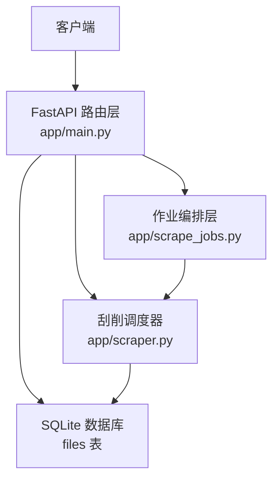
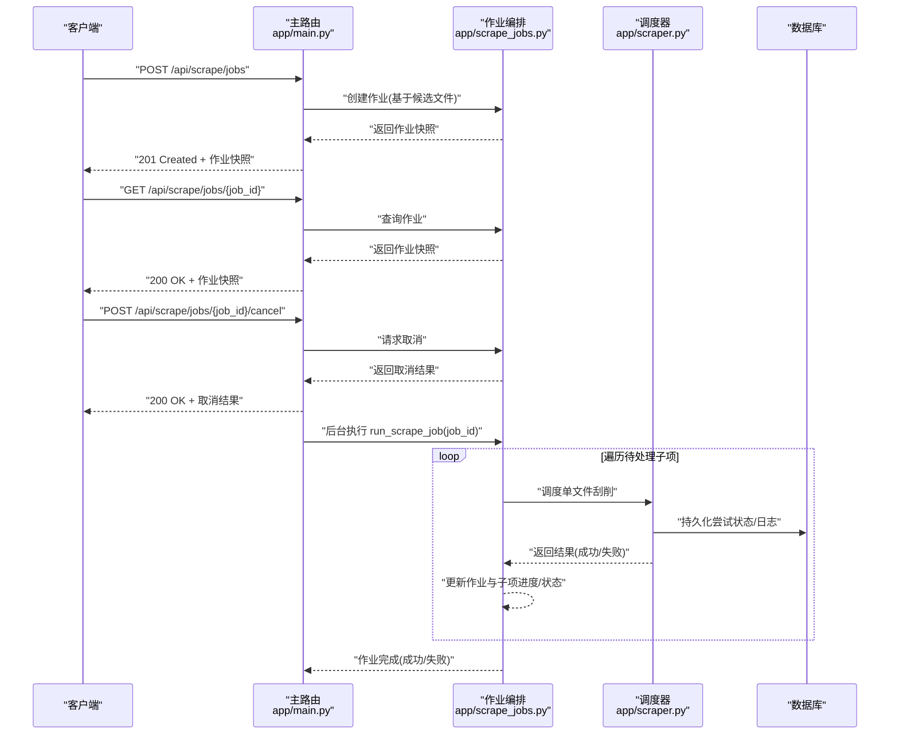
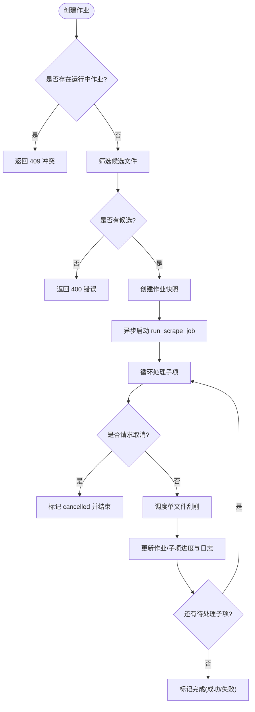
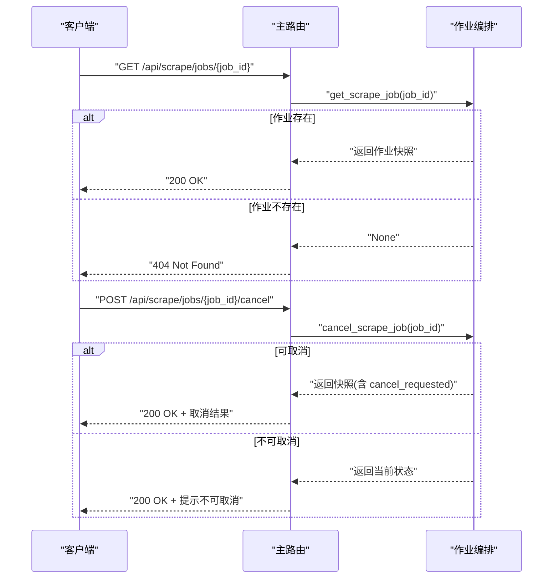
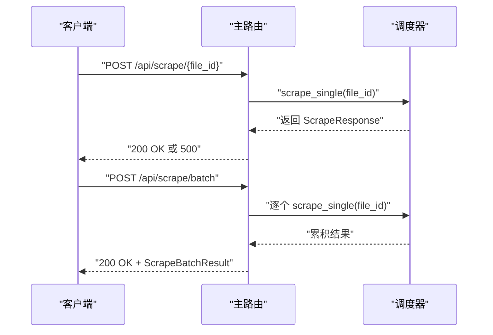
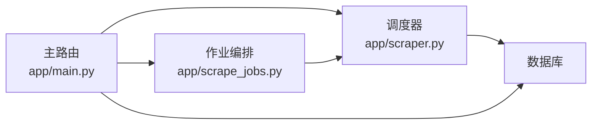

# 刮削作业API

<cite>
**本文引用的文件**
- [app/main.py](file://app/main.py)
- [app/scrape_jobs.py](file://app/scrape_jobs.py)
- [app/models.py](file://app/models.py)
- [app/scraper.py](file://app/scraper.py)
- [app/statuses.py](file://app/statuses.py)
- [tests/test_api/test_scrape_jobs.py](file://tests/test_api/test_scrape_jobs.py)
- [tests/test_api/test_scrape_endpoints.py](file://tests/test_api/test_scrape_endpoints.py)
</cite>

## 目录
1. [简介](#简介)
2. [项目结构](#项目结构)
3. [核心组件](#核心组件)
4. [架构总览](#架构总览)
5. [详细组件分析](#详细组件分析)
6. [依赖关系分析](#依赖关系分析)
7. [性能与并发特性](#性能与并发特性)
8. [故障排查指南](#故障排查指南)
9. [结论](#结论)
10. [附录：API规范与示例](#附录api规范与示例)

## 简介
本文件为“刮削作业管理API”的完整技术文档，覆盖以下主题：
- 作业创建、查询、取消与删除（通过作业队列模型）
- 作业队列管理、进度跟踪、日志记录与结果获取
- 单文件与批量刮削接口
- 错误码定义、异常处理与故障恢复策略
- 并发控制与资源限制现状说明
- 实际调用示例与最佳实践建议

## 项目结构
围绕刮削作业的核心模块包括：
- FastAPI 路由层：提供 REST API 入口与参数校验
- 作业编排层：负责作业生命周期管理（创建、执行、取消）
- 刮削调度器：封装单文件刮削流程与阶段进度
- 数据模型：定义请求/响应结构与作业快照
- 状态与排序：用于扫描候选文件的优先级与状态判定

图表来源
- [app/main.py:1270-1384](file://app/main.py#L1270-L1384)
- [app/scrape_jobs.py:1-256](file://app/scrape_jobs.py#L1-256)
- [app/scraper.py:82-453](file://app/scraper.py#L82-L453)

章节来源
- [app/main.py:1096-1384](file://app/main.py#L1096-L1384)
- [app/scrape_jobs.py:1-256](file://app/scrape_jobs.py#L1-L256)
- [app/scraper.py:1-453](file://app/scraper.py#L1-L453)

## 核心组件
- 作业模型与快照
  - 作业快照包含：作业ID、状态、总数/已处理/成功/失败、时间戳、当前文件与阶段、最近日志、子项明细等
  - 子项包含：文件ID、番号、目标路径、状态、阶段、来源、进度百分比、用户提示、技术错误、起止时间
- 日志与进度
  - 日志条目包含：时间、级别、阶段、来源、消息、进度百分比
  - 进度映射：按阶段分配固定百分比，支持显式覆盖
- 调度器与阶段
  - 单文件流程：校验 → 查询源 → 抓取详情 → 解析元数据 → 写入NFO → 下载海报/额外素材 → 完成
  - 阶段与进度：每个阶段对应一个近似百分比，最终完成时统一推进至100%

章节来源
- [app/models.py:103-216](file://app/models.py#L103-L216)
- [app/scrape_jobs.py:8-56](file://app/scrape_jobs.py#L8-L56)
- [app/scraper.py:24-39](file://app/scraper.py#L24-L39)

## 架构总览
从客户端到数据库的端到端流程如下：

图表来源
- [app/main.py:1270-1312](file://app/main.py#L1270-L1312)
- [app/scrape_jobs.py:146-256](file://app/scrape_jobs.py#L146-L256)
- [app/scraper.py:89-410](file://app/scraper.py#L89-L410)

## 详细组件分析

### 1) 作业创建与执行
- 创建接口
  - 方法与路径：POST /api/scrape/jobs
  - 请求体：包含 file_ids（整型数组）
  - 行为：若存在运行中的作业则拒绝；否则筛选候选文件、创建作业、立即异步启动执行
  - 响应：返回作业快照；若无候选文件或冲突则返回相应错误
- 执行流程
  - run_scrape_job(job_id) 循环处理每个子项，调用调度器执行单文件刮削
  - 进度与日志通过回调实时更新到作业与子项
  - 支持取消：当 cancel_requested=true 时，作业状态置为 cancelled

图表来源
- [app/main.py:1270-1285](file://app/main.py#L1270-L1285)
- [app/scrape_jobs.py:73-116](file://app/scrape_jobs.py#L73-L116)
- [app/scrape_jobs.py:146-256](file://app/scrape_jobs.py#L146-L256)

章节来源
- [app/main.py:1270-1285](file://app/main.py#L1270-L1285)
- [app/scrape_jobs.py:73-116](file://app/scrape_jobs.py#L73-L116)
- [tests/test_api/test_scrape_jobs.py:102-124](file://tests/test_api/test_scrape_jobs.py#L102-L124)

### 2) 作业查询与取消
- 查询接口
  - 方法与路径：GET /api/scrape/jobs/{job_id}
  - 行为：返回指定作业的快照；不存在返回 404
- 取消接口
  - 方法与路径：POST /api/scrape/jobs/{job_id}/cancel
  - 行为：仅对 queued/running 状态允许取消；返回取消请求结果；不存在返回 404

图表来源
- [app/main.py:1287-1312](file://app/main.py#L1287-L1312)
- [app/scrape_jobs.py:119-128](file://app/scrape_jobs.py#L119-L128)
- [tests/test_api/test_scrape_jobs.py:126-205](file://tests/test_api/test_scrape_jobs.py#L126-L205)

章节来源
- [app/main.py:1287-1312](file://app/main.py#L1287-L1312)
- [app/scrape_jobs.py:119-128](file://app/scrape_jobs.py#L119-L128)
- [tests/test_api/test_scrape_jobs.py:126-205](file://tests/test_api/test_scrape_jobs.py#L126-L205)

### 3) 单文件与批量刮削
- 单文件刮削
  - 方法与路径：POST /api/scrape/{file_id}
  - 行为：直接调度单文件刮削，返回结果；异常时返回 500
- 批量刮削
  - 方法与路径：POST /api/scrape/batch
  - 请求体：包含 file_ids（整型数组）
  - 行为：逐个执行单文件刮削，汇总成功/失败计数与明细

图表来源
- [app/main.py:1355-1353](file://app/main.py#L1355-L1353)
- [app/scraper.py:89-410](file://app/scraper.py#L89-L410)

章节来源
- [app/main.py:1355-1353](file://app/main.py#L1355-L1353)
- [app/scraper.py:89-410](file://app/scraper.py#L89-L410)

### 4) 刮削列表与详情
- 列表接口
  - 方法与路径：GET /api/scrape
  - 查询参数：page、per_page、filter(all/pending/success/failed)、sort(code/scrape_time)
  - 行为：返回分页列表、统计与当前活动作业快照
- 详情与产物
  - 详情：GET /api/scrape/{file_id}/detail → 返回元数据、文件清单、海报URL
  - 产物：GET /api/scrape/{file_id}/artifacts/{filename} → 返回刮削产物文件

章节来源
- [app/main.py:1096-1268](file://app/main.py#L1096-L1268)
- [tests/test_api/test_scrape_endpoints.py:92-200](file://tests/test_api/test_scrape_endpoints.py#L92-L200)

### 5) 进度与日志
- 进度映射
  - 作业级：按阶段分配百分比，最终完成推进至100
  - 子项级：按阶段推进，支持显式覆盖
- 日志
  - 最近日志上限：作业与子项均维护最近若干条日志
  - 调度器在关键阶段发出事件，持久化到数据库字段 scrape_logs

章节来源
- [app/scrape_jobs.py:8-20](file://app/scrape_jobs.py#L8-L20)
- [app/scrape_jobs.py:38-56](file://app/scrape_jobs.py#L38-L56)
- [app/scraper.py:98-150](file://app/scraper.py#L98-L150)

### 6) 状态与优先级
- 状态
  - 作业：queued、running、completed、failed、cancelled、cancel_requested
  - 子项：pending、processing、success、failed
  - 文件：processed、organized、pending、duplicate、target_exists、failed、ignored
- 优先级
  - 扫描候选按后缀类别与大小/自然排序进行优先级判定，确保同番号下最优文件优先

章节来源
- [app/models.py:57-131](file://app/models.py#L57-L131)
- [app/statuses.py:16-104](file://app/statuses.py#L16-L104)

## 依赖关系分析
- 组件耦合
  - 主路由依赖作业编排与调度器；作业编排依赖调度器；调度器依赖数据库
- 关键依赖链
  - /api/scrape/jobs → create_scrape_job → run_scrape_job → ScraperScheduler.scrape_single
  - /api/scrape → 查询 files 表并组装 ScrapeListItem
- 并发与锁
  - 作业字典使用 asyncio.Lock 保护；作业内循环串行处理子项，避免竞争条件

图表来源
- [app/main.py:1270-1384](file://app/main.py#L1270-L1384)
- [app/scrape_jobs.py:22-23](file://app/scrape_jobs.py#L22-L23)
- [app/scraper.py:412-453](file://app/scraper.py#L412-L453)

章节来源
- [app/main.py:1270-1384](file://app/main.py#L1270-L1384)
- [app/scrape_jobs.py:22-23](file://app/scrape_jobs.py#L22-L23)
- [app/scraper.py:412-453](file://app/scraper.py#L412-L453)

## 性能与并发特性
- 并发控制
  - 作业队列当前为单实例串行执行，避免多作业并发竞争
  - 子项处理在作业内部串行推进，保证状态一致性
- 资源限制
  - 未见显式的并发池/速率限制配置；可通过外部部署规模与限流策略控制
- 进度与日志
  - 使用内存字典存储作业状态，适合小到中等规模；大规模场景建议持久化到数据库或缓存

章节来源
- [app/scrape_jobs.py:73-116](file://app/scrape_jobs.py#L73-L116)
- [app/scrape_jobs.py:146-256](file://app/scrape_jobs.py#L146-L256)

## 故障排查指南
- 常见错误码与场景
  - 400：过滤/排序参数无效、无候选文件、请求体不合法
  - 404：作业不存在、文件不存在、产物不存在
  - 409：已有运行中作业、状态冲突
  - 500：内部异常（如单文件刮削抛出异常）
- 典型问题定位
  - 查看作业快照中的 recent_logs 与子项 logs，定位失败阶段
  - 检查 scrape_error 与 scrape_error_user_message 字段
  - 对于网络/反爬问题，参考调度器对不同阶段的用户提示映射
- 测试参考
  - 作业创建冲突、查询/取消404、列表过滤与排序等均有测试覆盖

章节来源
- [app/main.py:1114-1121](file://app/main.py#L1114-L1121)
- [app/main.py:1188-1189](file://app/main.py#L1188-L1189)
- [app/main.py:1274-1278](file://app/main.py#L1274-L1278)
- [app/main.py:1291-1292](file://app/main.py#L1291-L1292)
- [app/main.py:1367](file://app/main.py#L1367)
- [tests/test_api/test_scrape_jobs.py:102-205](file://tests/test_api/test_scrape_jobs.py#L102-L205)
- [tests/test_api/test_scrape_endpoints.py:92-200](file://tests/test_api/test_scrape_endpoints.py#L92-L200)

## 结论
本API以“作业队列”为核心，提供从创建、执行、监控到取消的完整生命周期管理；单文件与批量接口满足不同使用场景；进度与日志设计便于可观测性与故障定位。当前实现为串行队列，适合中小规模使用；如需高吞吐与并发控制，可在现有基础上引入外部队列与速率限制。

## 附录：API规范与示例

### 1) 作业管理
- 创建作业
  - 方法：POST /api/scrape/jobs
  - 请求体：{
      "file_ids": [整型数组]
    }
  - 成功：201，响应体为作业快照
  - 冲突：409（已有运行中作业）
  - 无候选：400
- 查询作业
  - 方法：GET /api/scrape/jobs/{job_id}
  - 成功：200，响应体为作业快照
  - 不存在：404
- 取消作业
  - 方法：POST /api/scrape/jobs/{job_id}/cancel
  - 成功：200，返回包含取消状态的消息
  - 不存在：404
  - 不可取消：返回当前状态与提示

章节来源
- [app/main.py:1270-1312](file://app/main.py#L1270-L1312)
- [tests/test_api/test_scrape_jobs.py:102-205](file://tests/test_api/test_scrape_jobs.py#L102-L205)

### 2) 刮削接口
- 单文件刮削
  - 方法：POST /api/scrape/{file_id}
  - 成功：200，返回单次刮削结果
  - 异常：500
- 批量刮削
  - 方法：POST /api/scrape/batch
  - 请求体：{
      "file_ids": [整型数组]
    }
  - 成功：200，返回成功/失败计数与明细

章节来源
- [app/main.py:1355-1353](file://app/main.py#L1355-L1353)

### 3) 刮削列表与详情
- 列表
  - 方法：GET /api/scrape
  - 查询参数：page、per_page、filter、sort
  - 成功：200，返回 total/items/stats/active_job
- 详情
  - 方法：GET /api/scrape/{file_id}/detail
  - 成功：200，返回元数据、文件清单、海报URL
  - 不存在：404
- 产物
  - 方法：GET /api/scrape/{file_id}/artifacts/{filename}
  - 成功：200，返回文件
  - 不存在：404

章节来源
- [app/main.py:1096-1268](file://app/main.py#L1096-L1268)
- [tests/test_api/test_scrape_endpoints.py:92-200](file://tests/test_api/test_scrape_endpoints.py#L92-L200)

### 4) 数据模型要点
- 作业快照（部分字段）
  - id、status、total、processed、succeeded、failed、created_at、started_at、finished_at、current_file_id、current_file_code、current_stage、current_source、current_progress_percent、recent_logs、items
- 子项（部分字段）
  - id、code、target_path、status、stage、source、progress_percent、user_message、technical_error、started_at、finished_at
- 日志条目
  - at、level、stage、source、message、progress_percent
- 单次刮削响应
  - success、code、error、user_message、stage、source、logs

章节来源
- [app/models.py:103-216](file://app/models.py#L103-L216)

### 5) 最佳实践
- 作业创建前先查询当前活动作业，避免 409 冲突
- 使用 GET /api/scrape/jobs/{job_id} 轮询进度，结合 recent_logs 观察阶段
- 对于网络/反爬失败，依据 user_message 与 logs 的 stage/source 判断来源与阶段，必要时调整网络或代理
- 批量操作建议分批提交，避免单次请求过大
- 生产环境建议配合外部队列与限流策略，以实现更高的并发与稳定性