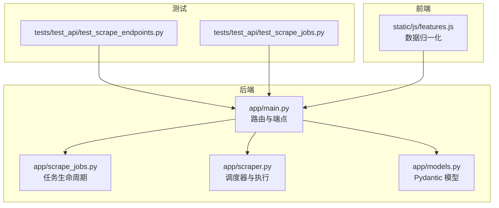
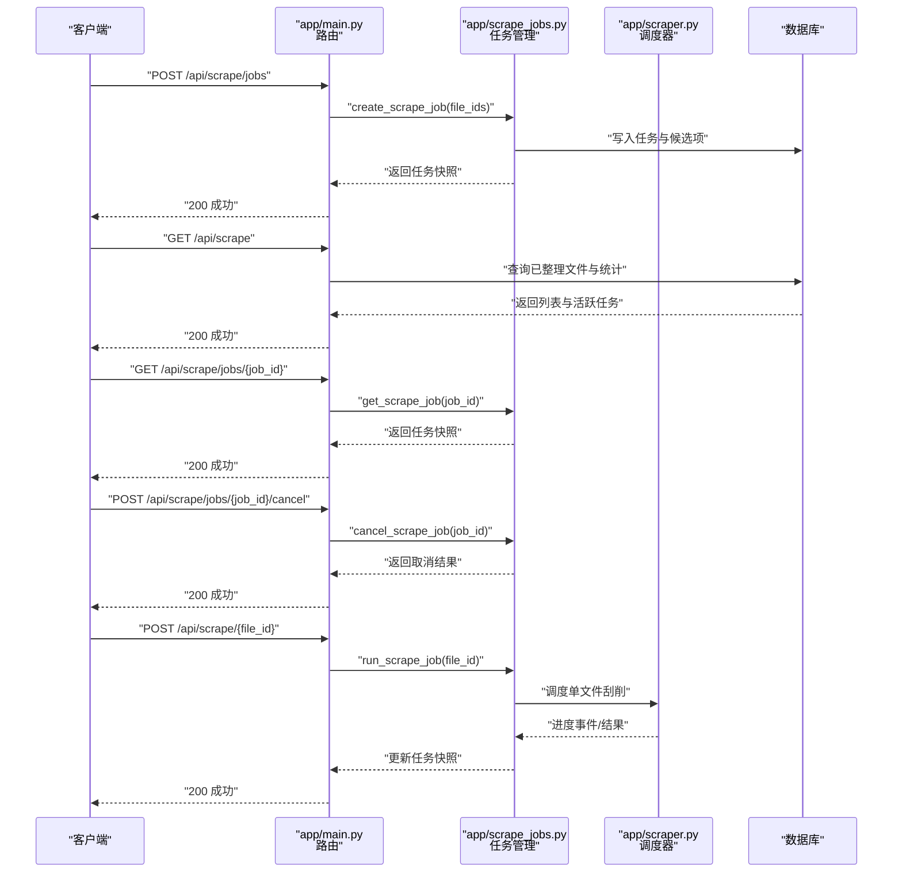
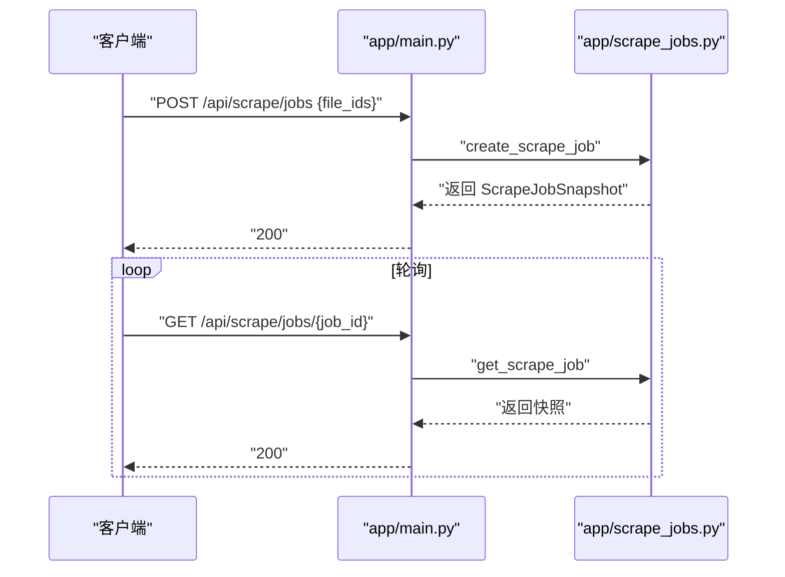
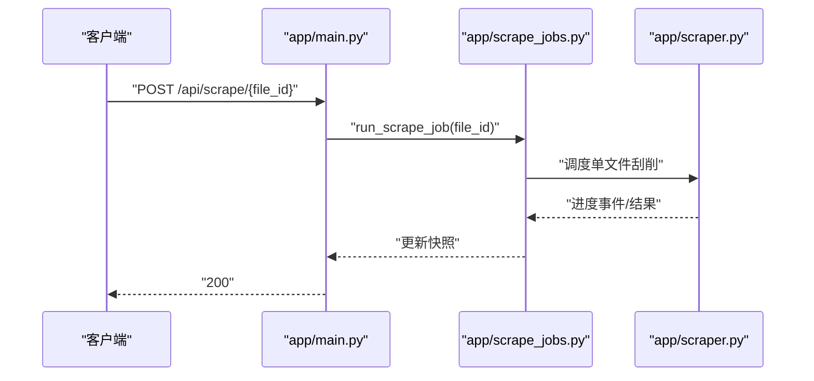
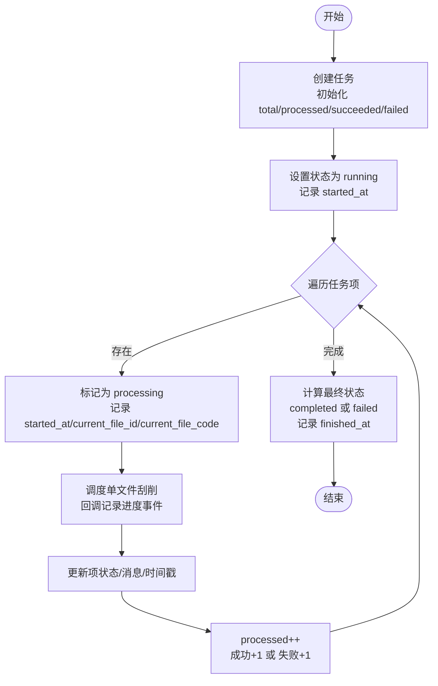
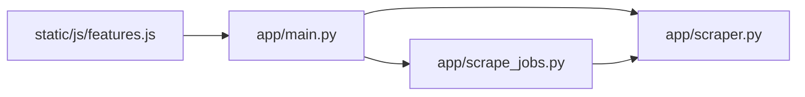

# 刮削端点

<cite>
**本文引用的文件**
- [app/main.py](file://app/main.py)
- [app/scrape_jobs.py](file://app/scrape_jobs.py)
- [app/scraper.py](file://app/scraper.py)
- [app/models.py](file://app/models.py)
- [tests/test_api/test_scrape_endpoints.py](file://tests/test_api/test_scrape_endpoints.py)
- [tests/test_api/test_scrape_jobs.py](file://tests/test_api/test_scrape_jobs.py)
- [docs/testing/scraping-e2e-checklist.md](file://docs/testing/scraping-e2e-checklist.md)
- [docs/superpowers/plans/2026-03-27-scrape-feedback-observability.md](file://docs/superpowers/plans/2026-03-27-scrape-feedback-observability.md)
- [static/js/features.js](file://static/js/features.js)
</cite>

## 目录
1. [简介](#简介)
2. [项目结构](#项目结构)
3. [核心组件](#核心组件)
4. [架构总览](#架构总览)
5. [详细组件分析](#详细组件分析)
6. [依赖关系分析](#依赖关系分析)
7. [性能考虑](#性能考虑)
8. [故障排查指南](#故障排查指南)
9. [结论](#结论)
10. [附录](#附录)

## 简介
本文件系统性梳理并记录与“刮削”（元数据抓取）相关的全部 RESTful API 端点，覆盖以下能力：
- 批量/单个刮削触发
- 刮削任务状态查询与进度监控
- 刮削任务取消
- 已整理文件列表查询与筛选排序分页
- 进度日志、阶段、来源、错误信息等可观测性字段

目标是为前端与集成用户提供清晰的接口定义、数据模型、状态流转与错误处理说明。

## 项目结构
与刮削 API 相关的关键模块与文件如下：
- 后端路由与业务逻辑：app/main.py
- 刮削任务管理：app/scrape_jobs.py
- 刮削调度器与执行流程：app/scraper.py
- 数据模型与 Pydantic 模型：app/models.py
- 前端数据归一化：static/js/features.js
- 测试用例（端到端与 API）：tests/test_api/test_scrape_endpoints.py、tests/test_api/test_scrape_jobs.py
- 规划与设计文档（端点、模型、可观测性）：docs/superpowers/plans/...、docs/testing/scraping-e2e-checklist.md

图表来源
- [app/main.py](file://app/main.py)
- [app/scrape_jobs.py](file://app/scrape_jobs.py)
- [app/scraper.py](file://app/scraper.py)
- [app/models.py](file://app/models.py)
- [tests/test_api/test_scrape_endpoints.py](file://tests/test_api/test_scrape_endpoints.py)
- [tests/test_api/test_scrape_jobs.py](file://tests/test_api/test_scrape_jobs.py)
- [static/js/features.js](file://static/js/features.js)

章节来源
- [app/main.py](file://app/main.py)
- [app/scrape_jobs.py](file://app/scrape_jobs.py)
- [app/scraper.py](file://app/scraper.py)
- [app/models.py](file://app/models.py)
- [tests/test_api/test_scrape_endpoints.py](file://tests/test_api/test_scrape_endpoints.py)
- [tests/test_api/test_scrape_jobs.py](file://tests/test_api/test_scrape_jobs.py)
- [static/js/features.js](file://static/js/features.js)

## 核心组件
- 路由与端点：在 app/main.py 中定义了刮削相关路由，包括 GET /api/scrape、POST /api/scrape/{file_id}、POST /api/scrape/jobs、GET /api/scrape/jobs/{job_id}、POST /api/scrape/jobs/{job_id}/cancel 等。
- 任务管理：app/scrape_jobs.py 提供任务创建、运行、取消、活跃任务查询等能力，并维护任务快照（进度、日志、当前文件、阶段、来源等）。
- 调度器：app/scraper.py 实现 ScraperScheduler，负责按阶段与来源执行单文件刮削，并通过回调记录进度事件。
- 数据模型：app/models.py 定义了 ScrapeListItem、ScrapeJobSnapshot、ScrapeJobItem、ScrapeLogEntry、ScrapeJobCreateRequest、ScrapeJobCancelResult 等模型，用于请求/响应与持久化字段映射。
- 前端适配：static/js/features.js 将后端返回的字段归一化为前端期望的结构，便于 UI 展示与交互。

章节来源
- [app/main.py](file://app/main.py)
- [app/scrape_jobs.py](file://app/scrape_jobs.py)
- [app/scraper.py](file://app/scraper.py)
- [app/models.py](file://app/models.py)
- [static/js/features.js](file://static/js/features.js)

## 架构总览
下图展示了从客户端到后端服务、任务管理与执行器的整体调用链路与数据流。

图表来源
- [app/main.py](file://app/main.py)
- [app/scrape_jobs.py](file://app/scrape_jobs.py)
- [app/scraper.py](file://app/scraper.py)

## 详细组件分析

### 端点清单与规范

- 列表与统计：GET /api/scrape
  - 功能：列出已整理文件，支持筛选、排序、分页；返回总数、条目数组与统计信息；同时返回当前活跃任务。
  - 查询参数：
    - filter：可选，支持 all/pending/success/failed；非法值返回 400。
    - sort：可选，支持 code/scrape_time；非法值返回 400。
    - page/per_page：可选，分页参数。
  - 响应字段概览（节选）：total、items（每项含 file_id、code、target_path、scrape_status、last_scrape_at、scrape_started_at、scrape_finished_at、scrape_stage、scrape_source、scrape_error、scrape_error_user_message、scrape_logs）、stats（如 organized/pending/scraped/failed）、active_job（活跃任务快照）。
  - 状态码：200 成功；400 非法参数。
  - 参考示例与断言见测试用例。

- 单文件刮削：POST /api/scrape/{file_id}
  - 功能：对指定已整理文件发起一次刮削任务（单文件模式），返回任务快照。
  - 请求体：无。
  - 响应：任务快照（包含当前文件、阶段、来源、最近日志等）。
  - 状态码：200 成功；404 文件不存在或未组织；409 冲突（例如已有进行中任务）。
  - 注意：该端点会触发 run_scrape_job，内部将文件加入任务队列并推进状态。

- 批量任务创建：POST /api/scrape/jobs
  - 功能：基于 file_ids 创建一个批量刮削任务，返回任务快照。
  - 请求体：{ file_ids: [number] }。
  - 响应：ScrapeJobSnapshot。
  - 状态码：200 成功；400 参数无效；409 冲突。
  - 行为：后端会预取候选文件并填充任务项，随后可通过轮询任务详情查看进度。

- 任务详情：GET /api/scrape/jobs/{job_id}
  - 功能：查询指定任务的实时快照。
  - 响应：ScrapeJobSnapshot。
  - 状态码：200 成功；404 任务不存在。

- 任务取消：POST /api/scrape/jobs/{job_id}/cancel
  - 功能：请求取消指定任务。
  - 响应：ScrapeJobCancelResult（包含 id、status、message）。
  - 状态码：200 成功；404 任务不存在。
  - 行为：设置 cancel_requested 标记，后续在任务循环中检测并最终置为 cancelled 并结束。

章节来源
- [app/main.py](file://app/main.py)
- [tests/test_api/test_scrape_endpoints.py](file://tests/test_api/test_scrape_endpoints.py)
- [tests/test_api/test_scrape_jobs.py](file://tests/test_api/test_scrape_jobs.py)
- [docs/testing/scraping-e2e-checklist.md](file://docs/testing/scraping-e2e-checklist.md)

### 数据模型与返回结构

- 列表项模型（部分字段）
  - file_id、code、target_path、original_path、status、scrape_status、last_scrape_at、scrape_started_at、scrape_finished_at、scrape_stage、scrape_source、scrape_error、scrape_error_user_message、scrape_logs（数组，元素为日志条目）。
  - 参考：ScrapeListItem。

- 任务快照模型
  - id、status、total、processed、succeeded、failed、created_at、started_at、finished_at、current_file_id、current_file_code、current_stage、current_source、recent_logs（最多保留最近 10 条）、items（每个包含 id、code、target_path、status、stage、source、user_message、technical_error、started_at、finished_at）。
  - 参考：ScrapeJobSnapshot。

- 日志条目模型
  - at、level、stage、source（可选）、message。
  - 参考：ScrapeLogEntry。

- 请求模型
  - 批量任务创建：ScrapeJobCreateRequest（file_ids 数组）。
  - 取消结果：ScrapeJobCancelResult（id、status、message）。
  - 参考：ScrapeJobCreateRequest、ScrapeJobCancelResult。

章节来源
- [app/models.py](file://app/models.py)
- [docs/superpowers/plans/2026-03-27-scrape-feedback-observability.md](file://docs/superpowers/plans/2026-03-27-scrape-feedback-observability.md)

### 端到端调用序列

#### 批量任务创建与轮询

图表来源
- [app/main.py](file://app/main.py)
- [app/scrape_jobs.py](file://app/scrape_jobs.py)

#### 单文件刮削

图表来源
- [app/main.py](file://app/main.py)
- [app/scrape_jobs.py](file://app/scrape_jobs.py)
- [app/scraper.py](file://app/scraper.py)

### 复杂逻辑流程（任务执行与状态机）

图表来源
- [docs/superpowers/plans/2026-03-27-scrape-feedback-observability.md](file://docs/superpowers/plans/2026-03-27-scrape-feedback-observability.md)

## 依赖关系分析
- 路由层（app/main.py）依赖任务管理（app/scrape_jobs.py）与调度器（app/scraper.py）。
- 任务管理依赖数据库以持久化任务与候选项，并通过锁与异步回调保证并发安全。
- 调度器（app/scraper.py）负责实际的刮削步骤与事件记录，向任务管理回传进度。
- 前端通过 static/js/features.js 将后端返回的字段标准化为 UI 使用的结构。

图表来源
- [app/main.py](file://app/main.py)
- [app/scrape_jobs.py](file://app/scrape_jobs.py)
- [app/scraper.py](file://app/scraper.py)
- [static/js/features.js](file://static/js/features.js)

章节来源
- [app/main.py](file://app/main.py)
- [app/scrape_jobs.py](file://app/scrape_jobs.py)
- [app/scraper.py](file://app/scraper.py)
- [static/js/features.js](file://static/js/features.js)

## 性能考虑
- 异步与锁：任务执行采用异步协程与锁保护共享状态，避免竞态与重复执行。
- 最近日志限制：任务快照中的 recent_logs 仅保留最近 N 条，控制响应体积与内存占用。
- 分页与筛选：列表接口支持分页与筛选，建议前端按需请求，减少一次性传输大量数据。
- 并发控制：单任务内逐项处理，避免过度并发导致资源争用；如需更高吞吐，可在调度器层面引入限速与并发池。

## 故障排查指南
- 常见状态码
  - 400：请求参数非法（如 filter/sort 值不合法）。
  - 404：任务或文件不存在。
  - 409：冲突（如已有进行中任务）。
  - 200：成功。
- 错误字段
  - scrape_error：技术错误码或类型。
  - scrape_error_user_message：面向用户的提示信息。
  - scrape_logs：包含 at、level、stage、source、message 的日志数组，便于定位问题阶段与来源。
- 建议排查步骤
  - 查看 active_job 与任务快照中的 current_stage/current_source，确认卡在哪个阶段与来源。
  - 检查 scrape_error 与 scrape_error_user_message，结合 scrape_logs 的最后几条定位根因。
  - 对于单文件刮削失败，尝试重新触发；对于批量任务，可单独重试失败项。
  - 若出现长时间无进度，检查网络、代理与目标站点可用性。

章节来源
- [tests/test_api/test_scrape_endpoints.py](file://tests/test_api/test_scrape_endpoints.py)
- [tests/test_api/test_scrape_jobs.py](file://tests/test_api/test_scrape_jobs.py)
- [docs/superpowers/plans/2026-03-27-scrape-feedback-observability.md](file://docs/superpowers/plans/2026-03-27-scrape-feedback-observability.md)

## 结论
本文档提供了刮削相关 API 的端点定义、数据模型、调用流程与可观测性细节。通过列表查询、任务创建/轮询、单文件触发与取消等能力，配合丰富的日志与错误信息，能够满足从用户界面到自动化集成的多种场景需求。建议在生产环境中结合分页、筛选与并发控制策略，确保稳定与高效。

## 附录

### 请求/响应示例与最佳实践
- 列表查询（过滤/排序/分页）
  - 示例：GET /api/scrape?filter=pending&sort=code&page=1&per_page=10
  - 响应：包含 total、items、stats、active_job。
- 批量任务
  - 请求：POST /api/scrape/jobs { file_ids: [1,2,3] }
  - 响应：ScrapeJobSnapshot，随后轮询 GET /api/scrape/jobs/{job_id} 获取进度。
- 单文件刮削
  - 请求：POST /api/scrape/{file_id}
  - 响应：任务快照（包含当前文件、阶段、来源、最近日志）。
- 取消任务
  - 请求：POST /api/scrape/jobs/{job_id}/cancel
  - 响应：ScrapeJobCancelResult（id、status、message）。

章节来源
- [docs/testing/scraping-e2e-checklist.md](file://docs/testing/scraping-e2e-checklist.md)
- [tests/test_api/test_scrape_endpoints.py](file://tests/test_api/test_scrape_endpoints.py)
- [tests/test_api/test_scrape_jobs.py](file://tests/test_api/test_scrape_jobs.py)