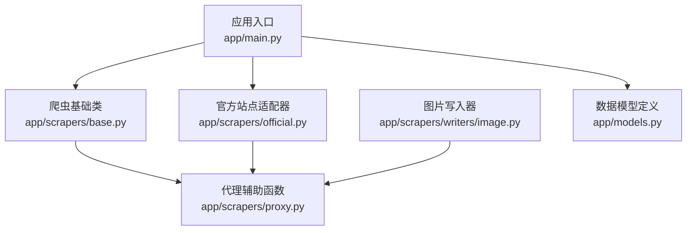
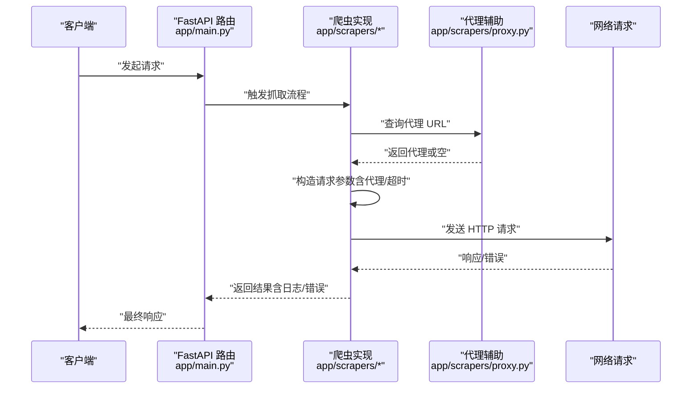
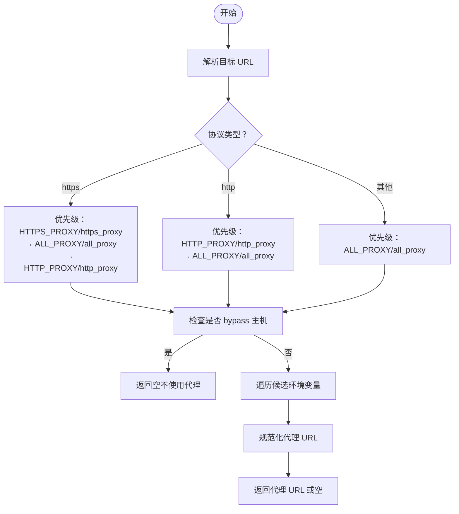
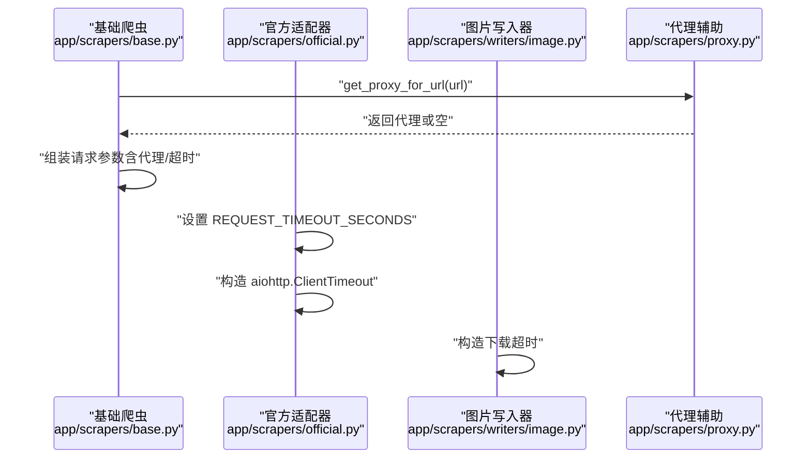
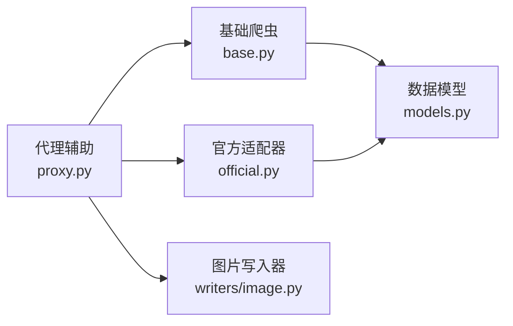

# 代理管理

<cite>
**本文引用的文件**
- [app/scrapers/proxy.py](file://app/scrapers/proxy.py)
- [app/scrapers/base.py](file://app/scrapers/base.py)
- [app/scrapers/official.py](file://app/scrapers/official.py)
- [app/scrapers/writers/image.py](file://app/scrapers/writers/image.py)
- [app/main.py](file://app/main.py)
- [app/models.py](file://app/models.py)
- [AGENTS.md](file://AGENTS.md)
- [README.en.md](file://README.en.md)
- [tests/test_api/test_scrape_endpoints.py](file://tests/test_api/test_scrape_endpoints.py)
</cite>

## 目录
1. [简介](#简介)
2. [项目结构](#项目结构)
3. [核心组件](#核心组件)
4. [架构总览](#架构总览)
5. [组件详解](#组件详解)
6. [依赖关系分析](#依赖关系分析)
7. [性能考量](#性能考量)
8. [故障排除指南](#故障排除指南)
9. [结论](#结论)
10. [附录](#附录)

## 简介
本文件面向“代理管理系统”的技术文档，聚焦于代理配置机制、环境变量解析与生效范围、请求级代理注入、超时控制与错误处理等主题。当前仓库中与代理直接相关的核心实现集中在爬虫模块的代理辅助函数与各爬虫实现中；同时，系统通过环境变量驱动代理选择，并在请求阶段按需注入到 HTTP 客户端。

## 项目结构
- 后端采用 FastAPI 应用入口，负责路由与业务编排。
- 爬虫子系统位于 app/scrapers 下，包含通用基础类、官方站点适配器以及写入器（如图片下载）。
- 代理相关逻辑集中于 app/scrapers/proxy.py，其他爬虫模块按需调用该代理辅助函数以决定是否启用代理及如何注入。

图表来源
- [app/main.py:1-1384](file://app/main.py#L1-L1384)
- [app/scrapers/base.py:1-200](file://app/scrapers/base.py#L1-L200)
- [app/scrapers/official.py:1-600](file://app/scrapers/official.py#L1-L600)
- [app/scrapers/proxy.py:1-65](file://app/scrapers/proxy.py#L1-L65)
- [app/scrapers/writers/image.py:1-120](file://app/scrapers/writers/image.py#L1-L120)
- [app/models.py:1-216](file://app/models.py#L1-L216)

章节来源
- [app/main.py:1-1384](file://app/main.py#L1-L1384)
- [app/scrapers/proxy.py:1-65](file://app/scrapers/proxy.py#L1-L65)
- [app/scrapers/base.py:1-200](file://app/scrapers/base.py#L1-L200)
- [app/scrapers/official.py:1-600](file://app/scrapers/official.py#L1-L600)
- [app/scrapers/writers/image.py:1-120](file://app/scrapers/writers/image.py#L1-L120)
- [app/models.py:1-216](file://app/models.py#L1-L216)
- [README.en.md:1-87](file://README.en.md#L1-L87)
- [AGENTS.md:1-32](file://AGENTS.md#L1-L32)

## 核心组件
- 代理辅助模块：提供代理 URL 规范化与基于 URL 的代理选择逻辑，支持 HTTPS/HTTP/ALL_PROXY 等环境变量优先级。
- 爬虫基础类与官方适配器：在请求构建阶段查询代理并注入到请求参数中，统一处理超时与异常。
- 图片写入器：在下载资源时设置 aiohttp 的 ClientTimeout，确保下载阶段的超时控制。
- 数据模型：包含刮削日志、作业快照、批次任务等，用于记录代理相关的错误与进度。

章节来源
- [app/scrapers/proxy.py:1-65](file://app/scrapers/proxy.py#L1-L65)
- [app/scrapers/base.py:140-160](file://app/scrapers/base.py#L140-L160)
- [app/scrapers/official.py:180-190](file://app/scrapers/official.py#L180-L190)
- [app/scrapers/official.py:246-256](file://app/scrapers/official.py#L246-L256)
- [app/scrapers/official.py:528-537](file://app/scrapers/official.py#L528-L537)
- [app/scrapers/official.py:576-585](file://app/scrapers/official.py#L576-L585)
- [app/scrapers/writers/image.py:60-100](file://app/scrapers/writers/image.py#L60-L100)
- [app/models.py:106-167](file://app/models.py#L106-L167)

## 架构总览
代理管理在系统中的位置如下：应用入口负责调度与状态管理；爬虫层负责网络请求与代理注入；代理辅助模块提供环境变量解析与代理 URL 选择；超时控制贯穿请求构建与异步会话。

图表来源
- [app/main.py:1-1384](file://app/main.py#L1-L1384)
- [app/scrapers/proxy.py:27-64](file://app/scrapers/proxy.py#L27-L64)
- [app/scrapers/base.py:140-160](file://app/scrapers/base.py#L140-L160)
- [app/scrapers/official.py:180-190](file://app/scrapers/official.py#L180-L190)

## 组件详解

### 代理配置机制与环境变量解析
- 代理 URL 规范化：支持形如 host:port 或完整 URL 的输入，统一转换为可用的 HTTP 客户端 URL。
- 基于 URL 的代理选择：根据目标 URL 的协议（http/https），按优先级从环境变量中选取代理；若主机命中 bypass 规则，则不使用代理。
- 优先级顺序：HTTPS 场景优先尝试 HTTPS_PROXY/https_proxy，其次 ALL_PROXY/all_proxy，最后 HTTP_PROXY/http_proxy；HTTP 场景优先 HTTP_PROXY/http_proxy，再试 ALL_PROXY/all_proxy；其他场景仅试 ALL_PROXY/all_proxy。

图表来源
- [app/scrapers/proxy.py:8-24](file://app/scrapers/proxy.py#L8-L24)
- [app/scrapers/proxy.py:27-64](file://app/scrapers/proxy.py#L27-L64)

章节来源
- [app/scrapers/proxy.py:1-65](file://app/scrapers/proxy.py#L1-L65)

### 请求级代理注入与超时控制
- 爬虫基础类：在构建请求参数时查询代理并注入到请求关键字参数中；同时设置默认超时时间。
- 官方适配器：在多个请求点设置统一的请求超时常量；在异步会话中使用 aiohttp.ClientTimeout 控制整体超时。
- 图片写入器：在下载阶段显式设置总超时，避免长时间阻塞。

图表来源
- [app/scrapers/base.py:140-160](file://app/scrapers/base.py#L140-L160)
- [app/scrapers/official.py:180-190](file://app/scrapers/official.py#L180-L190)
- [app/scrapers/official.py:246-256](file://app/scrapers/official.py#L246-L256)
- [app/scrapers/official.py:528-537](file://app/scrapers/official.py#L528-L537)
- [app/scrapers/official.py:576-585](file://app/scrapers/official.py#L576-L585)
- [app/scrapers/writers/image.py:60-100](file://app/scrapers/writers/image.py#L60-L100)
- [app/scrapers/proxy.py:27-64](file://app/scrapers/proxy.py#L27-L64)

章节来源
- [app/scrapers/base.py:140-160](file://app/scrapers/base.py#L140-L160)
- [app/scrapers/official.py:180-190](file://app/scrapers/official.py#L180-L190)
- [app/scrapers/official.py:246-256](file://app/scrapers/official.py#L246-L256)
- [app/scrapers/official.py:528-537](file://app/scrapers/official.py#L528-L537)
- [app/scrapers/official.py:576-585](file://app/scrapers/official.py#L576-L585)
- [app/scrapers/writers/image.py:60-100](file://app/scrapers/writers/image.py#L60-L100)

### 代理检测、健康检查与自动切换
- 当前实现未包含主动的代理健康检查与自动切换逻辑。代理选择完全依赖于环境变量与 URL 解析；若代理不可用，请求将失败并在上层进行错误处理与日志记录。
- 若需增强可靠性，可在现有基础上扩展：在请求失败时重试其他代理（若配置了多个）、或在代理辅助函数中增加“可用性缓存/黑名单”机制。

章节来源
- [app/scrapers/proxy.py:27-64](file://app/scrapers/proxy.py#L27-L64)
- [app/scrapers/base.py:140-160](file://app/scrapers/base.py#L140-L160)
- [app/scrapers/official.py:180-190](file://app/scrapers/official.py#L180-L190)

### 代理池管理、连接复用与超时控制
- 连接复用：官方适配器使用 aiohttp.ClientSession 创建会话，具备连接池能力；通过合理设置超时与并发可提升吞吐。
- 超时控制：请求级超时常量与下载级超时分别在不同层级设置，避免长时间阻塞；测试中也覆盖了“超时”错误的断言。
- 代理池：当前未实现多代理轮询或负载均衡；如需扩展，可在代理辅助函数中引入代理列表与轮询/权重策略，并在请求阶段动态选择。

章节来源
- [app/scrapers/official.py:528-537](file://app/scrapers/official.py#L528-L537)
- [app/scrapers/official.py:576-585](file://app/scrapers/official.py#L576-L585)
- [app/scrapers/writers/image.py:60-100](file://app/scrapers/writers/image.py#L60-L100)
- [tests/test_api/test_scrape_endpoints.py:319-348](file://tests/test_api/test_scrape_endpoints.py#L319-L348)

### 代理认证、SSL 处理与安全考虑
- 认证：代理辅助函数未涉及认证参数注入；若需要认证，应在代理 URL 中携带凭据或在请求层补充认证头。
- SSL：官方适配器使用 aiohttp，默认遵循系统证书链；如需自定义证书或禁用校验，请在会话配置中谨慎处理。
- 安全：建议将代理地址与认证信息置于受控环境变量中，避免硬编码；对代理 URL 进行白名单校验，防止 SSRF。

章节来源
- [app/scrapers/proxy.py:8-24](file://app/scrapers/proxy.py#L8-L24)
- [app/scrapers/official.py:528-537](file://app/scrapers/official.py#L528-L537)

### 配置示例与最佳实践
- 环境变量配置：HTTPS/HTTP/ALL_PROXY 及其小写变体均可生效；建议为不同协议设置独立代理，提高可控性。
- 代理 URL 格式：支持 host:port 或完整 URL；务必保证可被 HTTP 客户端识别。
- 超时设置：结合网络状况调整 REQUEST_TIMEOUT_SECONDS 与下载超时，避免过短导致误判，过长影响响应性。
- 并发与连接池：通过 aiohttp 会话的并发限制与超时参数平衡吞吐与稳定性。

章节来源
- [app/scrapers/proxy.py:27-64](file://app/scrapers/proxy.py#L27-L64)
- [app/scrapers/official.py:180-190](file://app/scrapers/official.py#L180-L190)
- [app/scrapers/official.py:528-537](file://app/scrapers/official.py#L528-L537)

## 依赖关系分析
- 代理辅助模块被多个爬虫模块依赖，形成“低耦合、高内聚”的设计：基础类与官方适配器均通过同一接口获取代理。
- 超时控制分布在不同层次：基础类设置默认超时，官方适配器设置统一常量，图片写入器设置下载超时，形成分层保护。
- 错误与日志：数据模型中的刮削日志与作业快照可用于记录代理相关的错误与进度，便于诊断。

图表来源
- [app/scrapers/proxy.py:1-65](file://app/scrapers/proxy.py#L1-L65)
- [app/scrapers/base.py:140-160](file://app/scrapers/base.py#L140-L160)
- [app/scrapers/official.py:180-190](file://app/scrapers/official.py#L180-L190)
- [app/scrapers/writers/image.py:60-100](file://app/scrapers/writers/image.py#L60-L100)
- [app/models.py:106-167](file://app/models.py#L106-L167)

章节来源
- [app/scrapers/proxy.py:1-65](file://app/scrapers/proxy.py#L1-L65)
- [app/scrapers/base.py:140-160](file://app/scrapers/base.py#L140-L160)
- [app/scrapers/official.py:180-190](file://app/scrapers/official.py#L180-L190)
- [app/scrapers/writers/image.py:60-100](file://app/scrapers/writers/image.py#L60-L100)
- [app/models.py:106-167](file://app/models.py#L106-L167)

## 性能考量
- 连接池与并发：合理设置 aiohttp 会话的并发上限与超时，避免过多并发导致代理服务器过载。
- 超时策略：区分请求超时与下载超时，针对慢资源（如大图）单独放宽下载超时。
- 代理选择开销：代理 URL 解析与环境变量读取成本较低，但应避免在热路径中重复解析，可做简单缓存。
- 日志与监控：利用数据模型中的日志与作业快照记录代理错误与耗时，辅助性能分析。

章节来源
- [app/scrapers/official.py:528-537](file://app/scrapers/official.py#L528-L537)
- [app/scrapers/writers/image.py:60-100](file://app/scrapers/writers/image.py#L60-L100)
- [app/models.py:106-167](file://app/models.py#L106-L167)

## 故障排除指南
- 代理不生效
  - 检查目标 URL 协议与环境变量匹配情况；确认未命中 bypass 规则。
  - 验证代理 URL 格式是否被规范化接受。
- 请求超时
  - 调整 REQUEST_TIMEOUT_SECONDS 与下载超时；观察测试中对“超时”错误的断言。
  - 结合日志定位具体阶段（请求/下载）。
- 代理错误与日志
  - 使用数据模型中的刮削日志与作业快照查看错误详情与进度。
- 并发问题
  - 检查 aiohttp 会话的并发设置与超时配置，避免资源争用。

章节来源
- [app/scrapers/proxy.py:27-64](file://app/scrapers/proxy.py#L27-L64)
- [app/scrapers/official.py:180-190](file://app/scrapers/official.py#L180-L190)
- [app/scrapers/official.py:528-537](file://app/scrapers/official.py#L528-L537)
- [app/scrapers/writers/image.py:60-100](file://app/scrapers/writers/image.py#L60-L100)
- [app/models.py:106-167](file://app/models.py#L106-L167)
- [tests/test_api/test_scrape_endpoints.py:319-348](file://tests/test_api/test_scrape_endpoints.py#L319-L348)

## 结论
当前代理管理以“环境变量驱动 + 请求级注入”为核心，具备清晰的代理选择与超时控制机制。系统未内置代理健康检查与自动切换，亦未实现代理池轮询与负载均衡。建议在保持现有简洁设计的前提下，按需扩展代理可用性检测、多代理轮询与连接池优化，以进一步提升鲁棒性与性能。

## 附录
- 快速参考
  - 代理 URL 规范化与选择：见代理辅助模块。
  - 请求参数注入与超时设置：见基础类与官方适配器。
  - 下载超时设置：见图片写入器。
  - 错误与日志记录：见数据模型中的刮削日志与作业快照。

章节来源
- [app/scrapers/proxy.py:1-65](file://app/scrapers/proxy.py#L1-L65)
- [app/scrapers/base.py:140-160](file://app/scrapers/base.py#L140-L160)
- [app/scrapers/official.py:180-190](file://app/scrapers/official.py#L180-L190)
- [app/scrapers/official.py:528-537](file://app/scrapers/official.py#L528-L537)
- [app/scrapers/writers/image.py:60-100](file://app/scrapers/writers/image.py#L60-L100)
- [app/models.py:106-167](file://app/models.py#L106-L167)