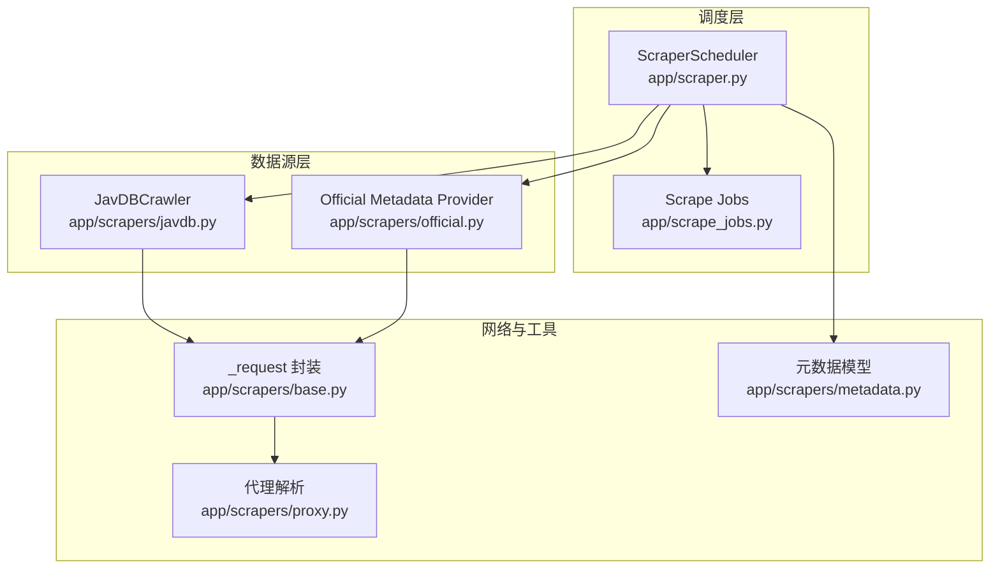
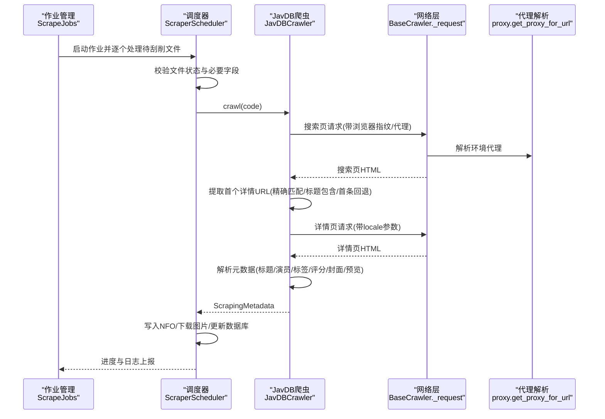
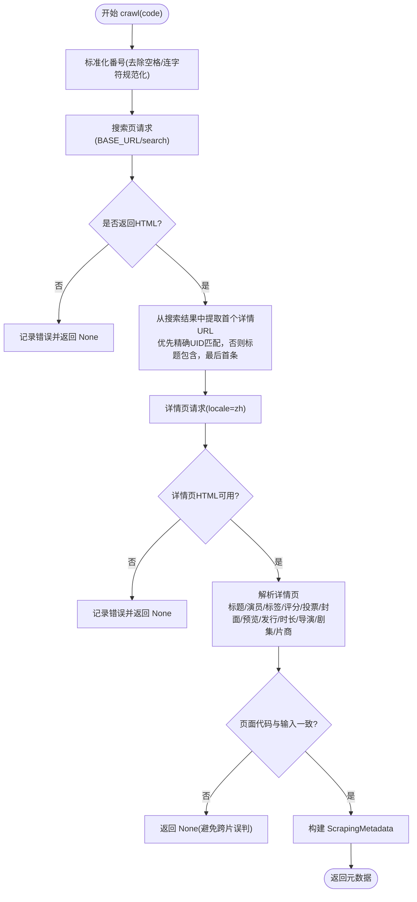
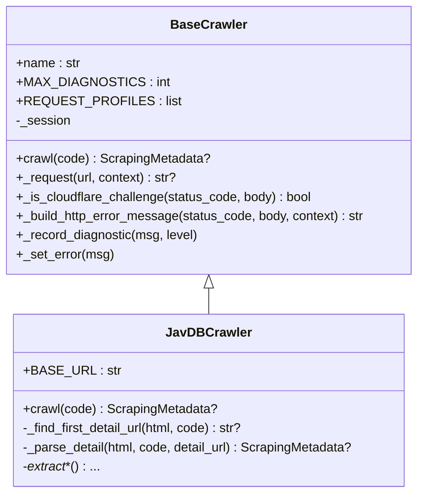
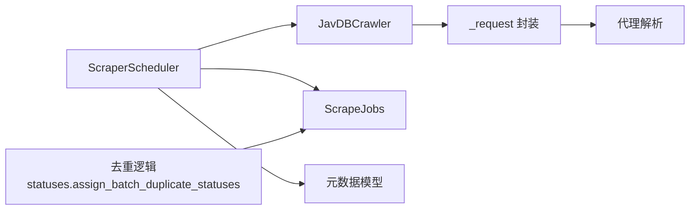
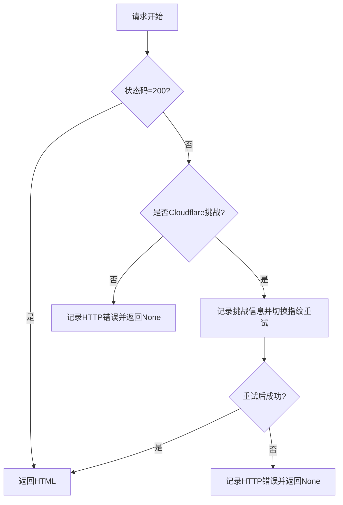

# JavDB刮削器

<cite>
**本文引用的文件**
- [app/scrapers/javdb.py](file://app/scrapers/javdb.py)
- [app/scrapers/base.py](file://app/scrapers/base.py)
- [app/scrapers/proxy.py](file://app/scrapers/proxy.py)
- [app/scrapers/metadata.py](file://app/scrapers/metadata.py)
- [app/scraper.py](file://app/scraper.py)
- [app/scrape_jobs.py](file://app/scrape_jobs.py)
- [tests/test_scrapers/test_javdb.py](file://tests/test_scrapers/test_javdb.py)
- [tests/test_scraper_diagnostics.py](file://tests/test_scraper_diagnostics.py)
- [app/statuses.py](file://app/statuses.py)
</cite>

## 目录
1. [引言](#引言)
2. [项目结构](#项目结构)
3. [核心组件](#核心组件)
4. [架构总览](#架构总览)
5. [详细组件分析](#详细组件分析)
6. [依赖关系分析](#依赖关系分析)
7. [性能与网络优化](#性能与网络优化)
8. [故障排查指南](#故障排查指南)
9. [结论](#结论)
10. [附录](#附录)

## 引言
本文件面向需要深入理解与维护 JavDB 刮削器的工程师与运维人员，系统性阐述其数据源策略、反爬虫应对机制、代理配置、抓取流程、页面解析与数据提取算法、API 调用方式、请求头与会话管理、错误处理与重试策略、超时配置、缓存与去重、数据质量保障等。文档以代码为依据，辅以可视化图示，帮助读者快速掌握实现细节与最佳实践。

## 项目结构
JavDB 刮削器位于应用的刮削子系统内，采用“数据源适配器 + 通用调度器”的分层设计：
- 数据源适配器：JavDB 爬虫负责搜索与详情页解析，抽取元数据。
- 通用调度器：统一编排“校验 → 查询 → 解析 → 写入 NFO → 下载图片 → 更新状态”的全流程。
- 代理与网络：基于环境变量自动选择代理，支持浏览器指纹模拟与 Cloudflare 挑战检测。
- 测试与诊断：覆盖关键路径、错误场景与代理/Cloudflare 行为验证。

图表来源
- [app/scraper.py:82-374](file://app/scraper.py#L82-L374)
- [app/scrape_jobs.py:146-255](file://app/scrape_jobs.py#L146-L255)
- [app/scrapers/javdb.py:14-89](file://app/scrapers/javdb.py#L14-L89)
- [app/scrapers/base.py:15-204](file://app/scrapers/base.py#L15-L204)
- [app/scrapers/proxy.py:27-65](file://app/scrapers/proxy.py#L27-L65)
- [app/scrapers/metadata.py:6-60](file://app/scrapers/metadata.py#L6-L60)

章节来源
- [app/scraper.py:82-374](file://app/scraper.py#L82-L374)
- [app/scrape_jobs.py:146-255](file://app/scrape_jobs.py#L146-L255)
- [app/scrapers/javdb.py:14-89](file://app/scrapers/javdb.py#L14-L89)
- [app/scrapers/base.py:15-204](file://app/scrapers/base.py#L15-L204)
- [app/scrapers/proxy.py:27-65](file://app/scrapers/proxy.py#L27-L65)
- [app/scrapers/metadata.py:6-60](file://app/scrapers/metadata.py#L6-L60)

## 核心组件
- JavDBCrawler：面向 JavDB 的搜索与详情页解析器，支持多语言标签、代码规范化、封面与预览图提取、评分与投票统计解析。
- BaseCrawler：通用网络请求封装，内置浏览器指纹配置、Cloudflare 挑战检测与自动切换、固定延迟、会话复用与诊断记录。
- Proxy 工具：从环境变量解析代理，支持 http/https/all 优先级与绕过规则。
- ScraperScheduler：端到端调度器，串联数据库查询、状态校验、数据源查询、NFO 写入、图片下载与最终状态落库。
- ScrapeJobs：作业生命周期管理，进度推进、日志裁剪与并发控制。
- 元数据模型：标准化输出字段，便于下游写入与展示。

章节来源
- [app/scrapers/javdb.py:14-89](file://app/scrapers/javdb.py#L14-L89)
- [app/scrapers/base.py:15-204](file://app/scrapers/base.py#L15-L204)
- [app/scrapers/proxy.py:27-65](file://app/scrapers/proxy.py#L27-L65)
- [app/scraper.py:82-374](file://app/scraper.py#L82-L374)
- [app/scrape_jobs.py:146-255](file://app/scrape_jobs.py#L146-L255)
- [app/scrapers/metadata.py:6-60](file://app/scrapers/metadata.py#L6-L60)

## 架构总览
下图展示了从调度到数据源再到网络层的整体交互：

图表来源
- [app/scrape_jobs.py:146-255](file://app/scrape_jobs.py#L146-L255)
- [app/scraper.py:82-374](file://app/scraper.py#L82-L374)
- [app/scrapers/javdb.py:41-89](file://app/scrapers/javdb.py#L41-L89)
- [app/scrapers/base.py:124-197](file://app/scrapers/base.py#L124-L197)
- [app/scrapers/proxy.py:27-65](file://app/scrapers/proxy.py#L27-L65)

## 详细组件分析

### JavDBCrawler 组件
职责与流程
- 输入：视频番号（如 SSIS-743）
- 流程：搜索页 → 定位详情页 → 详情页解析 → 输出标准化元数据
- 关键点：多语言标签兼容、代码规范化、封面/预览提取、评分与投票解析、网站链接本地化

图表来源
- [app/scrapers/javdb.py:41-89](file://app/scrapers/javdb.py#L41-L89)
- [app/scrapers/javdb.py:113-148](file://app/scrapers/javdb.py#L113-L148)
- [app/scrapers/javdb.py:150-202](file://app/scrapers/javdb.py#L150-L202)

章节来源
- [app/scrapers/javdb.py:14-89](file://app/scrapers/javdb.py#L14-L89)
- [app/scrapers/javdb.py:113-148](file://app/scrapers/javdb.py#L113-L148)
- [app/scrapers/javdb.py:150-202](file://app/scrapers/javdb.py#L150-L202)

### BaseCrawler 网络与反爬虫
- 请求封装：固定 2 秒延迟，会话复用，超时 25 秒，关闭严格 SSL 校验。
- 浏览器指纹：内置 Chrome/Safari 两种配置，遇到 Cloudflare 挑战自动切换。
- 代理集成：按 https/http/all 顺序解析环境变量，支持绕过直连主机。
- 错误诊断：记录诊断消息，构建用户可读的 HTTP 错误提示，区分 Cloudflare 挑战与普通 403。

图表来源
- [app/scrapers/base.py:15-204](file://app/scrapers/base.py#L15-L204)
- [app/scrapers/javdb.py:14-89](file://app/scrapers/javdb.py#L14-L89)

章节来源
- [app/scrapers/base.py:124-197](file://app/scrapers/base.py#L124-L197)
- [app/scrapers/base.py:88-123](file://app/scrapers/base.py#L88-L123)

### 代理配置与网络优化
- 代理解析：优先 HTTPS_PROXY/https_proxy/ALL_PROXY/all_proxy/HTTP_PROXY/http_proxy，支持 host:port 或 http://host:port 形式，自动补全协议。
- 绕过规则：若目标主机命中代理绕过条件，则不使用代理。
- 使用方式：网络请求阶段自动注入 proxy 参数，无需手动传参。
- 优化建议：在高并发场景下结合固定延迟与指纹切换，避免触发速率限制；必要时配合代理池与轮换策略。

章节来源
- [app/scrapers/proxy.py:27-65](file://app/scrapers/proxy.py#L27-L65)
- [app/scrapers/base.py:146-156](file://app/scrapers/base.py#L146-L156)

### 元数据模型与输出
- 字段覆盖：基础信息（标题、原始标题、网站）、制作信息（演员、片商、发行、时长、导演、标签、评分、投票）、媒体资源（封面、背景、预览）。
- 导出形态：提供 to_dict(base_name) 用于模板渲染与命名规范。

章节来源
- [app/scrapers/metadata.py:6-60](file://app/scrapers/metadata.py#L6-L60)

### 调度与作业管理
- 作业生命周期：排队 → 运行 → 处理每个文件 → 完成/失败 → 结束。
- 进度映射：按阶段分配进度百分比，支持显式进度覆盖。
- 日志裁剪：仅保留最近若干条日志，避免内存膨胀。
- 并发控制：同一时刻仅允许一个活动作业运行，防止资源争用。

章节来源
- [app/scrape_jobs.py:146-255](file://app/scrape_jobs.py#L146-L255)
- [app/scraper.py:24-39](file://app/scraper.py#L24-L39)
- [app/scraper.py:186-208](file://app/scraper.py#L186-L208)

## 依赖关系分析
- JavDBCrawler 依赖 BaseCrawler 的网络能力与代理解析。
- ScraperScheduler 负责编排，调用数据源与写入器，并与数据库交互。
- ScrapeJobs 提供作业级并发与进度推进。
- statuses 模块提供去重逻辑，确保同一批次内相同番号仅保留一个有效候选。

图表来源
- [app/scrapers/javdb.py:14-89](file://app/scrapers/javdb.py#L14-L89)
- [app/scrapers/base.py:124-197](file://app/scrapers/base.py#L124-L197)
- [app/scrapers/proxy.py:27-65](file://app/scrapers/proxy.py#L27-L65)
- [app/scraper.py:82-374](file://app/scraper.py#L82-L374)
- [app/scrape_jobs.py:146-255](file://app/scrape_jobs.py#L146-L255)
- [app/statuses.py:83-104](file://app/statuses.py#L83-L104)

章节来源
- [app/statuses.py:83-104](file://app/statuses.py#L83-L104)

## 性能与网络优化
- 请求节流：固定 2 秒延迟，降低请求频率，缓解目标站点压力与风控触发概率。
- 指纹切换：遇到 Cloudflare 挑战自动切换浏览器指纹，提升成功率。
- 会话复用：单实例内复用 Session，减少握手开销。
- 代理启用：通过环境变量自动注入代理，便于在受限网络环境下稳定访问。
- 超时与重试：统一 25 秒超时，Cloudflare 场景下自动切换指纹重试。
- 图片下载：异步并行下载附加图片，支持进度回调，提升整体吞吐。

章节来源
- [app/scrapers/base.py:135-136](file://app/scrapers/base.py#L135-L136)
- [app/scrapers/base.py:148-197](file://app/scrapers/base.py#L148-L197)
- [app/scraper.py:285-325](file://app/scraper.py#L285-L325)

## 故障排查指南
常见问题与定位要点
- 搜索页失败：检查网络连通性、代理配置与目标站点可达性；查看诊断消息与错误提示。
- 详情页为空：确认搜索结果命中正确详情页；核对代码规范化逻辑与页面结构变化。
- 代码不匹配：详情页代码与输入不一致将直接返回 None，避免误抓。
- Cloudflare 挑战：自动切换指纹重试；若仍失败，检查代理有效性与网络环境。
- 代理无效：确认环境变量名与格式（支持 host:port 与 http://host:port），并确保未被绕过。
- 日志与诊断：利用诊断消息与作业日志定位阶段与来源，结合用户可读错误提示快速定位根因。

图表来源
- [app/scrapers/base.py:171-197](file://app/scrapers/base.py#L171-L197)
- [app/scrapers/base.py:88-123](file://app/scrapers/base.py#L88-L123)

章节来源
- [tests/test_scraper_diagnostics.py:65-104](file://tests/test_scraper_diagnostics.py#L65-L104)
- [tests/test_scraper_diagnostics.py:112-136](file://tests/test_scraper_diagnostics.py#L112-L136)
- [app/scrapers/base.py:171-197](file://app/scrapers/base.py#L171-L197)

## 结论
JavDB 刮削器通过“适配器 + 调度器 + 通用网络层”的清晰分层，实现了稳定的元数据抓取与高质量输出。其反爬虫策略（指纹切换、固定延迟、Cloudflare 挑战检测）与代理集成（环境变量驱动）在实际部署中具备良好可操作性。结合作业管理与去重逻辑，可在批量场景下保持一致性与可靠性。建议在生产环境中配合代理池、限速与监控告警，进一步提升稳定性与可观测性。

## 附录

### API 调用方式与请求头
- 调用入口：JavDBCrawler.crawl(code) 返回 ScrapingMetadata 或 None。
- 请求头：内置浏览器指纹（Chrome/Safari），Accept-Language 配置为多语言。
- 会话管理：首次请求创建 Session 并复用；关闭严格 SSL 校验；超时 25 秒。
- 代理注入：自动从环境变量解析代理并注入请求。

章节来源
- [app/scrapers/javdb.py:41-89](file://app/scrapers/javdb.py#L41-L89)
- [app/scrapers/base.py:124-197](file://app/scrapers/base.py#L124-L197)

### 数据抓取流程与页面解析逻辑
- 搜索页：解析卡片集合，优先精确 UID 匹配，其次标题包含，最后首条回退。
- 详情页：解析标题、演员、标签、评分、投票、发行、时长、导演、片商、封面与预览图。
- 代码校验：详情页代码需与输入一致，否则拒绝返回。

章节来源
- [app/scrapers/javdb.py:113-148](file://app/scrapers/javdb.py#L113-L148)
- [app/scrapers/javdb.py:150-202](file://app/scrapers/javdb.py#L150-L202)

### 错误处理机制与重试策略
- 重试：Cloudflare 挑战自动切换指纹重试一次；其他错误直接记录并返回 None。
- 诊断：记录阶段与来源，生成用户可读错误提示。
- 作业层面：失败项标记失败并持久化错误信息与日志。

章节来源
- [app/scrapers/base.py:171-197](file://app/scrapers/base.py#L171-L197)
- [app/scraper.py:375-410](file://app/scraper.py#L375-L410)

### 代理服务器配置示例
- 支持的环境变量：HTTPS_PROXY/https_proxy/ALL_PROXY/all_proxy/HTTP_PROXY/http_proxy。
- 格式：host:port 或 http://host:port；未带协议时自动补全为 http://。
- 绕过规则：若目标主机命中代理绕过条件则不使用代理。

章节来源
- [app/scrapers/proxy.py:27-65](file://app/scrapers/proxy.py#L27-L65)

### 缓存策略、去重逻辑与数据质量
- 去重：同一批次内按番号分组，保留优先级最高的候选，其余标记为 duplicate。
- 缓存：当前实现未见专用缓存层；可通过外部存储或数据库索引优化重复请求。
- 质量保障：代码规范化、页面字段存在性检查、评分/投票解析、封面/预览 URL 去重。

章节来源
- [app/statuses.py:83-104](file://app/statuses.py#L83-L104)
- [app/scrapers/javdb.py:104-111](file://app/scrapers/javdb.py#L104-L111)
- [app/scrapers/javdb.py:270-281](file://app/scrapers/javdb.py#L270-L281)