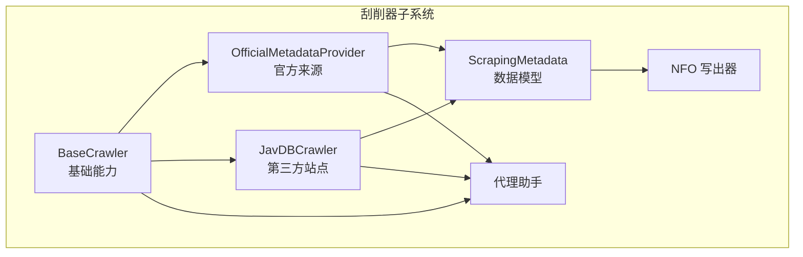
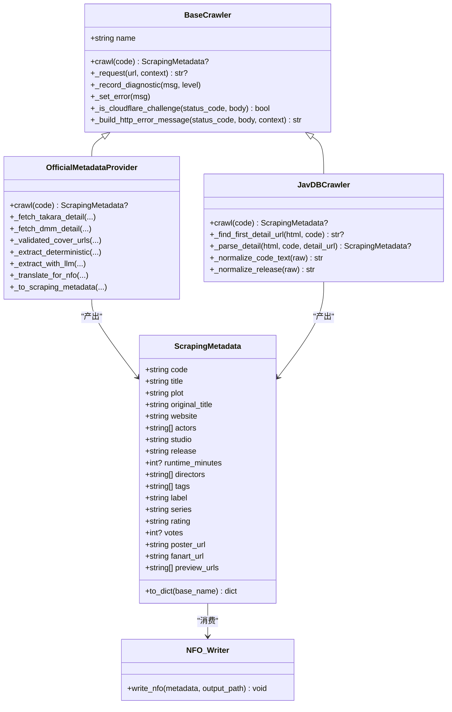
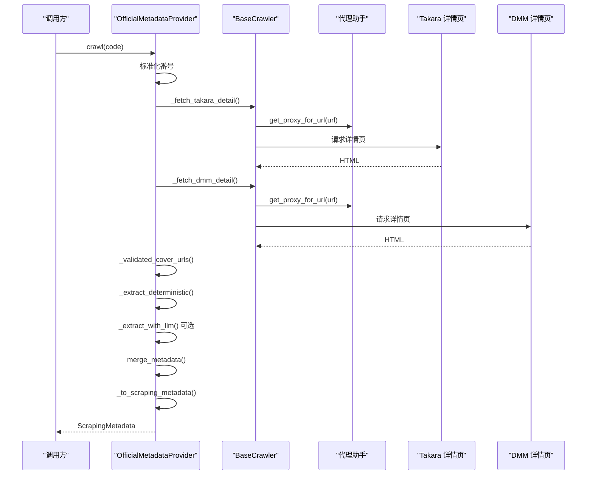
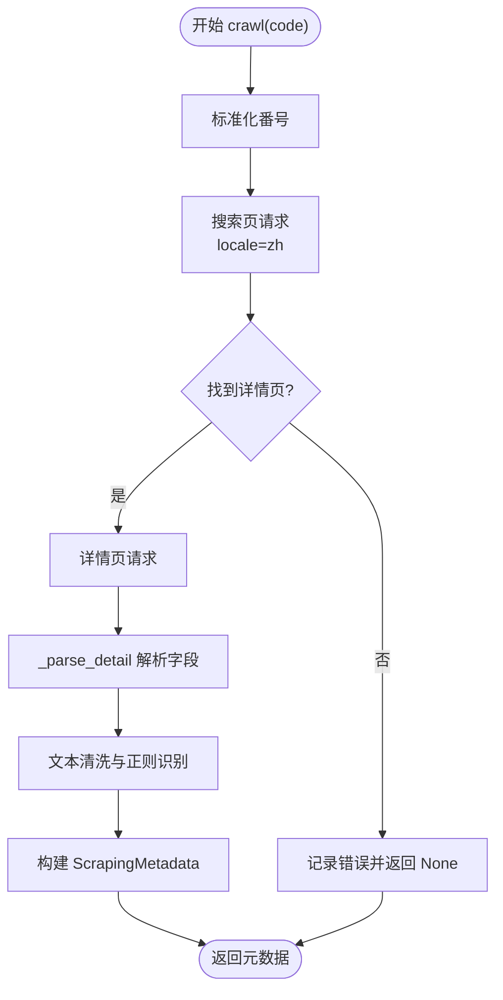
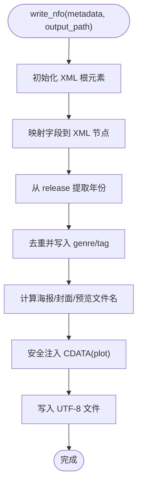
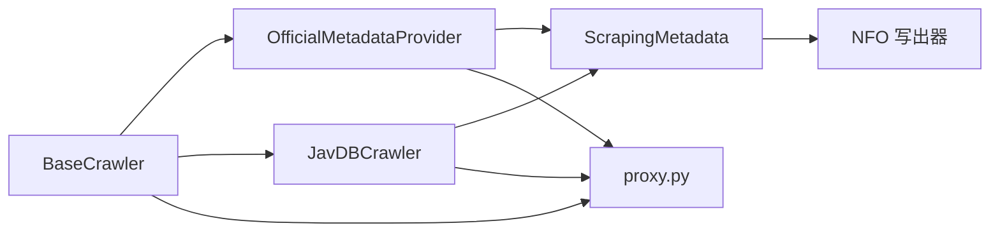

# 元数据刮削器

<cite>
**本文引用的文件**
- [app/scrapers/base.py](file://app/scrapers/base.py)
- [app/scrapers/metadata.py](file://app/scrapers/metadata.py)
- [app/scrapers/official.py](file://app/scrapers/official.py)
- [app/scrapers/javdb.py](file://app/scrapers/javdb.py)
- [app/scrapers/proxy.py](file://app/scrapers/proxy.py)
- [app/scrapers/writers/nfo.py](file://app/scrapers/writers/nfo.py)
- [app/models.py](file://app/models.py)
- [app/scrapers/__init__.py](file://app/scrapers/__init__.py)
</cite>

## 目录
1. [引言](#引言)
2. [项目结构](#项目结构)
3. [核心组件](#核心组件)
4. [架构总览](#架构总览)
5. [详细组件分析](#详细组件分析)
6. [依赖分析](#依赖分析)
7. [性能考虑](#性能考虑)
8. [故障排查指南](#故障排查指南)
9. [结论](#结论)
10. [附录](#附录)

## 引言
本文件面向“元数据刮削器”的技术实现，系统性阐述官方来源（DMM/Takara）与第三方站点（JavDB）两类数据源的元数据提取算法、字段映射规则、数据标准化流程与质量控制策略；同时覆盖文本解析逻辑、正则表达式匹配与模式识别技术、多语言支持与字符编码处理、国际化适配、数据清洗与格式规范化、质量检查机制、配置选项与扩展接口，以及与基础刮削器的继承关系与差异。

## 项目结构
元数据刮削子系统位于 app/scrapers 目录，主要由以下模块构成：
- 基类与通用能力：base.py（HTTP 请求、诊断日志、Cloudflare 挑战检测、浏览器指纹轮换）
- 数据模型：metadata.py（统一的 ScrapingMetadata 结构）
- 官方来源刮削器：official.py（Takara/DMM 多源聚合、可选 LLM 辅助抽取与翻译）
- 第三方站点刮削器：javdb.py（JavDB 单源刮削，多语言标签集）
- 写出器：writers/nfo.py（生成 Emby/Kodi 兼容的 NFO XML）
- 代理与网络：proxy.py（基于环境变量的代理选择）
- API/模型：models.py（批量作业、日志、进度等）
- 导出入口：scrapers/__init__.py

图表来源
- [app/scrapers/base.py:15-204](file://app/scrapers/base.py#L15-L204)
- [app/scrapers/metadata.py:6-60](file://app/scrapers/metadata.py#L6-L60)
- [app/scrapers/official.py:67-142](file://app/scrapers/official.py#L67-L142)
- [app/scrapers/javdb.py:14-90](file://app/scrapers/javdb.py#L14-L90)
- [app/scrapers/writers/nfo.py:12-82](file://app/scrapers/writers/nfo.py#L12-L82)
- [app/scrapers/proxy.py:27-65](file://app/scrapers/proxy.py#L27-L65)

章节来源
- [app/scrapers/base.py:15-204](file://app/scrapers/base.py#L15-L204)
- [app/scrapers/metadata.py:6-60](file://app/scrapers/metadata.py#L6-L60)
- [app/scrapers/official.py:67-142](file://app/scrapers/official.py#L67-L142)
- [app/scrapers/javdb.py:14-90](file://app/scrapers/javdb.py#L14-L90)
- [app/scrapers/writers/nfo.py:12-82](file://app/scrapers/writers/nfo.py#L12-L82)
- [app/scrapers/proxy.py:27-65](file://app/scrapers/proxy.py#L27-L65)
- [app/scrapers/__init__.py:1-7](file://app/scrapers/__init__.py#L1-L7)

## 核心组件
- 基础刮削器 BaseCrawler
  - 提供统一的 HTTP 请求封装、重试与诊断记录、Cloudflare 挑战检测、浏览器指纹轮换、会话管理与代理注入。
  - 统一错误消息构建与用户可读提示，便于前端展示与排障。
- 元数据模型 ScrapingMetadata
  - 定义统一的元数据字段集合（基础信息、制作信息、媒体资源），并提供 to_dict 输出以适配模板/写出器。
- 官方来源刮削器 OfficialMetadataProvider
  - 支持 Takara 与 DMM 双源抓取，进行番号标准化、页面校验、封面 URL 验证、确定性解析与可选 LLM 辅助抽取/翻译。
- 第三方站点刮削器 JavDBCrawler
  - 从 JavDB 搜索页定位详情页，使用多语言标签集解析字段，支持本地化 URL 参数。
- NFO 写出器
  - 将 ScrapingMetadata 转为 Emby/Kodi 兼容的 XML，并进行 CDATA 注入与字符编码处理。
- 代理与网络
  - 基于环境变量自动选择代理，支持 http/https/all 代理优先级与绕过规则。

章节来源
- [app/scrapers/base.py:15-204](file://app/scrapers/base.py#L15-L204)
- [app/scrapers/metadata.py:6-60](file://app/scrapers/metadata.py#L6-L60)
- [app/scrapers/official.py:67-142](file://app/scrapers/official.py#L67-L142)
- [app/scrapers/javdb.py:14-90](file://app/scrapers/javdb.py#L14-L90)
- [app/scrapers/writers/nfo.py:12-82](file://app/scrapers/writers/nfo.py#L12-L82)
- [app/scrapers/proxy.py:27-65](file://app/scrapers/proxy.py#L27-L65)

## 架构总览
官方来源与第三方站点分别继承自 BaseCrawler，共享统一的网络层与诊断能力；两者均产出 ScrapingMetadata，再由 NFO 写出器生成标准 XML 文件。官方来源还具备可选的 LLM 抽取与翻译能力，以提升字段完整性与可读性。

图表来源
- [app/scrapers/base.py:15-204](file://app/scrapers/base.py#L15-L204)
- [app/scrapers/metadata.py:6-60](file://app/scrapers/metadata.py#L6-L60)
- [app/scrapers/official.py:67-142](file://app/scrapers/official.py#L67-L142)
- [app/scrapers/javdb.py:14-90](file://app/scrapers/javdb.py#L14-L90)
- [app/scrapers/writers/nfo.py:12-82](file://app/scrapers/writers/nfo.py#L12-L82)

## 详细组件分析

### 官方来源刮削器（Takara/DMM）
- 番号标准化与变体生成
  - 将输入番号转换为带连字符、纯数字、mono_cid、digital_cid、小写 hyphen 形式，确保后续 URL 与校验一致。
- 页面抓取与校验
  - 分别尝试 Takara 与 DMM 详情页，使用内容特征判断是否为目标产品（含年龄验证过滤）。
- 封面 URL 验证
  - 通过 HEAD/GET 请求校验候选 URL 的可达性与 Content-Type，剔除占位/打印中链接。
- 确定性解析与证据收集
  - 解析 Takara 表格与 DMM 字段，提取标题、剧情、演员、发售日期、时长、导演、制作商、标签、评分、投票数、封面图、商品页等，并记录证据来源。
- LLM 辅助抽取与翻译
  - 若启用且存在 API Key，则构造提示词，调用外部 LLM 接口抽取 JSON 并合并到确定性结果；随后对可翻译字段执行中文翻译，再应用回元数据。
- 字段映射与质量控制
  - 将 ExtractedMetadata 映射到 ScrapingMetadata，优先使用 LLM/确定性结果中的可信字段；若无任何关键字段则判定失败并记录错误。

图表来源
- [app/scrapers/official.py:90-142](file://app/scrapers/official.py#L90-L142)
- [app/scrapers/official.py:143-212](file://app/scrapers/official.py#L143-L212)
- [app/scrapers/official.py:213-283](file://app/scrapers/official.py#L213-L283)
- [app/scrapers/official.py:284-310](file://app/scrapers/official.py#L284-L310)
- [app/scrapers/official.py:311-450](file://app/scrapers/official.py#L311-L450)
- [app/scrapers/official.py:500-562](file://app/scrapers/official.py#L500-L562)
- [app/scrapers/official.py:657-686](file://app/scrapers/official.py#L657-L686)
- [app/scrapers/base.py:124-204](file://app/scrapers/base.py#L124-L204)
- [app/scrapers/proxy.py:27-65](file://app/scrapers/proxy.py#L27-L65)

章节来源
- [app/scrapers/official.py:688-705](file://app/scrapers/official.py#L688-L705)
- [app/scrapers/official.py:90-142](file://app/scrapers/official.py#L90-L142)
- [app/scrapers/official.py:284-310](file://app/scrapers/official.py#L284-L310)
- [app/scrapers/official.py:311-450](file://app/scrapers/official.py#L311-L450)
- [app/scrapers/official.py:500-562](file://app/scrapers/official.py#L500-L562)
- [app/scrapers/official.py:657-686](file://app/scrapers/official.py#L657-L686)

### 第三方站点刮削器（JavDB）
- 搜索与详情页定位
  - 使用 zh 语言参数搜索，优先精确匹配卡片中的识别码，其次标题包含匹配，最后退回到首个结果。
- 字段解析与多语言标签集
  - 使用中/英/日标签集匹配字段，解析演员、片商、日期、时长、导演、标签、评分、投票数、封面与预览图。
- 文本清洗与正则识别
  - 识别码归一化（去除多余空格与连字符）、发布日期标准化（YYYY-MM-DD 或 YYYY/MM/DD）、时长与评分数值提取、标题剧情提取（优先显式描述块，其次从标题派生）。
- URL 规范化与本地化
  - 详情页 URL 增加 locale=zh 查询参数，保证页面语言一致性。

图表来源
- [app/scrapers/javdb.py:41-90](file://app/scrapers/javdb.py#L41-L90)
- [app/scrapers/javdb.py:113-149](file://app/scrapers/javdb.py#L113-L149)
- [app/scrapers/javdb.py:150-203](file://app/scrapers/javdb.py#L150-L203)
- [app/scrapers/javdb.py:204-353](file://app/scrapers/javdb.py#L204-L353)

章节来源
- [app/scrapers/javdb.py:41-90](file://app/scrapers/javdb.py#L41-L90)
- [app/scrapers/javdb.py:113-149](file://app/scrapers/javdb.py#L113-L149)
- [app/scrapers/javdb.py:150-203](file://app/scrapers/javdb.py#L150-L203)
- [app/scrapers/javdb.py:204-353](file://app/scrapers/javdb.py#L204-L353)

### NFO 写出器
- 字段映射与 XML 结构
  - 将 ScrapingMetadata 中的关键字段映射到 movie/actor/set 等节点，生成标准 XML。
- 标题与原始标题处理
  - 若无标题则回退到 code；原始标题优先取 original_title，否则取 title 或 code。
- 发行年份与标签处理
  - 年份从 release 截取前四位；标签去重后同时写入 genre 与 tag。
- 艺术资源命名
  - 基于输出文件名 stem 生成 poster/fanart/preview 系列文件名。
- 安全注入与编码
  - plot 使用 CDATA 包裹，特殊序列进行转义；文件以 utf-8 编码写出。

图表来源
- [app/scrapers/writers/nfo.py:12-82](file://app/scrapers/writers/nfo.py#L12-L82)
- [app/scrapers/writers/nfo.py:91-116](file://app/scrapers/writers/nfo.py#L91-L116)
- [app/scrapers/writers/nfo.py:132-142](file://app/scrapers/writers/nfo.py#L132-L142)

章节来源
- [app/scrapers/writers/nfo.py:12-82](file://app/scrapers/writers/nfo.py#L12-L82)
- [app/scrapers/writers/nfo.py:91-116](file://app/scrapers/writers/nfo.py#L91-L116)
- [app/scrapers/writers/nfo.py:132-142](file://app/scrapers/writers/nfo.py#L132-L142)

### 基础刮削器与网络层
- 统一请求封装
  - 固定 2 秒延迟，支持代理注入、超时与证书校验关闭、浏览器指纹轮换（Chrome/Safari）。
- 诊断与错误处理
  - 记录最近 MAX_DIAGNOSTICS 条诊断信息；Cloudflare 挑战识别与用户可读错误消息构建。
- 代理选择
  - 基于 URL scheme 与环境变量 HTTPS_PROXY/HTTP_PROXY/ALL_PROXY 选择代理，支持绕过规则。

章节来源
- [app/scrapers/base.py:15-204](file://app/scrapers/base.py#L15-L204)
- [app/scrapers/proxy.py:27-65](file://app/scrapers/proxy.py#L27-L65)

## 依赖分析
- 组件耦合
  - OfficialMetadataProvider 与 JavDBCrawler 均依赖 BaseCrawler 的网络与诊断能力，耦合度低、内聚性强。
  - 两者均产出 ScrapingMetadata，NFO 写出器消费该模型，形成清晰的数据流。
- 外部依赖
  - HTTP 客户端（curl_cffi/requests）、HTML 解析（BeautifulSoup/lxml）、XML 序列化（ElementTree）。
- 可能的循环依赖
  - 无直接循环导入；ScrapingMetadata 仅被刮削器与写出器使用，不反向依赖。

图表来源
- [app/scrapers/base.py:15-204](file://app/scrapers/base.py#L15-L204)
- [app/scrapers/official.py:67-142](file://app/scrapers/official.py#L67-L142)
- [app/scrapers/javdb.py:14-90](file://app/scrapers/javdb.py#L14-L90)
- [app/scrapers/metadata.py:6-60](file://app/scrapers/metadata.py#L6-L60)
- [app/scrapers/writers/nfo.py:12-82](file://app/scrapers/writers/nfo.py#L12-L82)
- [app/scrapers/proxy.py:27-65](file://app/scrapers/proxy.py#L27-L65)

章节来源
- [app/scrapers/base.py:15-204](file://app/scrapers/base.py#L15-L204)
- [app/scrapers/official.py:67-142](file://app/scrapers/official.py#L67-L142)
- [app/scrapers/javdb.py:14-90](file://app/scrapers/javdb.py#L14-L90)
- [app/scrapers/metadata.py:6-60](file://app/scrapers/metadata.py#L6-L60)
- [app/scrapers/writers/nfo.py:12-82](file://app/scrapers/writers/nfo.py#L12-L82)
- [app/scrapers/proxy.py:27-65](file://app/scrapers/proxy.py#L27-L65)

## 性能考虑
- 请求节流与指纹轮换
  - 固定延迟与多指纹重试降低被反爬拦截概率，但会增加整体耗时；可根据网络状况调整延迟与重试次数。
- 图片校验
  - 封面 URL 校验采用并发外层的线程池调用，避免阻塞事件循环；建议在批量场景下限制并发以平衡成功率与资源占用。
- HTML 解析
  - 使用 lxml 解析器，性能稳定；建议对大型页面进行片段裁剪（官方实现中已有提示词裁剪示例）以减少解析开销。
- LLM 调用
  - 外部 LLM 调用存在显著延迟与成本；建议按需启用并设置合理超时与输出长度上限。

## 故障排查指南
- HTTP 403 与 Cloudflare 挑战
  - 基类内置挑战识别与用户可读错误消息；可通过诊断日志查看切换指纹与具体标题信息。
- 请求异常与超时
  - 统一捕获异常并记录 last_error；检查代理配置、网络连通性与目标站点状态。
- 官方来源无匹配
  - 若确定性解析与 LLM 均未提取到关键字段，将返回失败；检查番号标准化与站点页面变化。
- JavDB 搜索命中异常
  - 检查搜索页 locale 参数、结果卡片结构变化与代码归一化逻辑。
- NFO 写出失败
  - 检查输出路径权限、XML 片段与 CDATA 转义；确认编码为 UTF-8。

章节来源
- [app/scrapers/base.py:88-123](file://app/scrapers/base.py#L88-L123)
- [app/scrapers/official.py:131-135](file://app/scrapers/official.py#L131-L135)
- [app/scrapers/javdb.py:67-69](file://app/scrapers/javdb.py#L67-L69)
- [app/scrapers/writers/nfo.py:78-82](file://app/scrapers/writers/nfo.py#L78-L82)

## 结论
本元数据刮削器通过统一的基础能力与清晰的组件边界，实现了对官方与第三方站点的稳健抓取与标准化输出。官方来源结合确定性解析与可选 LLM 辅助，兼顾准确性与可扩展性；第三方站点通过多语言标签集与严格清洗规则保障字段质量；最终以 NFO 写出器完成与生态系统的兼容。建议在生产环境中根据站点稳定性与网络条件调整重试与延迟策略，并谨慎启用 LLM 功能以平衡成本与收益。

## 附录

### 字段映射与数据标准化
- 官方来源 → ScrapingMetadata
  - 标题、剧情、演员、发售日期、时长、导演、制作商、标签、评分、投票数、封面图、商品页 URL → 对应字段映射；封面优先取验证后的高质量图。
- JavDB → ScrapingMetadata
  - 通过标签集匹配解析字段；发布日期标准化为 YYYY-MM-DD；时长与评分数值提取；标题剧情优先显式描述块，否则从标题派生。
- NFO 写出
  - 标题/原始标题回退策略、年份提取、标签去重、资源命名、CDATA 安全注入、UTF-8 写出。

章节来源
- [app/scrapers/official.py:657-686](file://app/scrapers/official.py#L657-L686)
- [app/scrapers/javdb.py:150-203](file://app/scrapers/javdb.py#L150-L203)
- [app/scrapers/writers/nfo.py:12-82](file://app/scrapers/writers/nfo.py#L12-L82)

### 正则表达式与模式识别
- 番号标准化
  - 识别字母前缀与数字部分，统一为“前缀-数字”形式，支持多种分隔符与大小写。
- 发布日期标准化
  - 支持 YYYY-MM-DD 与 YYYY/MM/DD 两种常见格式。
- 时长与评分提取
  - 从文本中提取首个数字或小数作为时长/评分值。
- 标题剧情提取
  - 优先匹配显式“简介/剧情”类标签块；若无则从标题派生首句并剔除与番号重复的部分。

章节来源
- [app/scrapers/official.py:688-705](file://app/scrapers/official.py#L688-L705)
- [app/scrapers/javdb.py:342-353](file://app/scrapers/javdb.py#L342-L353)
- [app/scrapers/javdb.py:284-300](file://app/scrapers/javdb.py#L284-L300)
- [app/scrapers/javdb.py:302-318](file://app/scrapers/javdb.py#L302-L318)

### 多语言支持与国际化适配
- 官方来源
  - 默认使用日文/英文 Accept-Language；Takara/DMM 页面语言由站点决定。
- JavDB
  - 搜索与详情页强制 locale=zh，确保页面语言一致；标签集覆盖中/英/日三语标签。
- 字符编码
  - NFO 写出使用 UTF-8；HTML 解析默认编码由解析器处理；建议在上游保持页面编码一致性。

章节来源
- [app/scrapers/base.py:20-45](file://app/scrapers/base.py#L20-L45)
- [app/scrapers/javdb.py:59-71](file://app/scrapers/javdb.py#L59-L71)
- [app/scrapers/writers/nfo.py:79-81](file://app/scrapers/writers/nfo.py#L79-L81)

### 数据清洗规则与质量检查
- 去重与非空
  - 标签/链接列表去重与非空过滤；封面 URL 白名单与类型校验。
- 冲突检测
  - 官方来源对番号不一致的情况记录冲突证据，避免错误覆盖。
- 质量阈值
  - 确定性解析至少包含标题/演员/封面之一才视为有效；LLM 结果需与输入番号一致。

章节来源
- [app/scrapers/official.py:327-337](file://app/scrapers/official.py#L327-L337)
- [app/scrapers/official.py:385-395](file://app/scrapers/official.py#L385-L395)
- [app/scrapers/official.py:131-135](file://app/scrapers/official.py#L131-L135)
- [app/scrapers/official.py:742-744](file://app/scrapers/official.py#L742-L744)

### 配置选项与扩展接口
- 代理配置
  - HTTPS_PROXY/https_proxy/all_proxy/http_proxy/all_proxy；支持 http/https scheme 自动选择。
- LLM 集成（官方来源）
  - 启用开关、API Key（NOCTRA_LLM_API_KEY 或 OPENAI_API_KEY）、模型名称、最大输出 token、超时秒数；可选中文翻译。
- 爬取行为
  - 请求超时、重试次数与延迟、浏览器指纹轮换、固定延迟。
- 扩展接口
  - 新增站点：继承 BaseCrawler，实现 crawl(code) 与必要的解析方法；将结果映射到 ScrapingMetadata；必要时接入代理与诊断系统。

章节来源
- [app/scrapers/proxy.py:27-65](file://app/scrapers/proxy.py#L27-L65)
- [app/scrapers/official.py:508-516](file://app/scrapers/official.py#L508-L516)
- [app/scrapers/official.py:571-584](file://app/scrapers/official.py#L571-L584)
- [app/scrapers/base.py:124-204](file://app/scrapers/base.py#L124-L204)