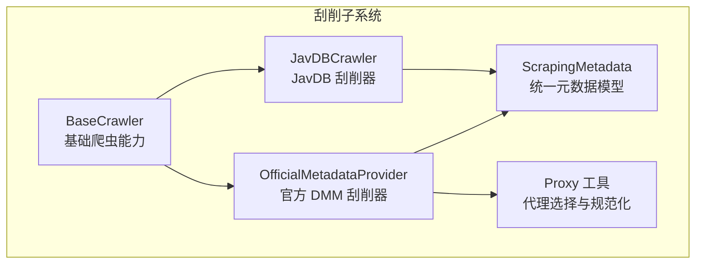
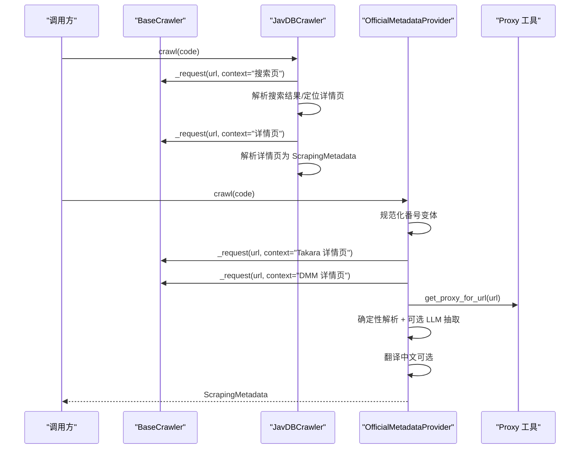
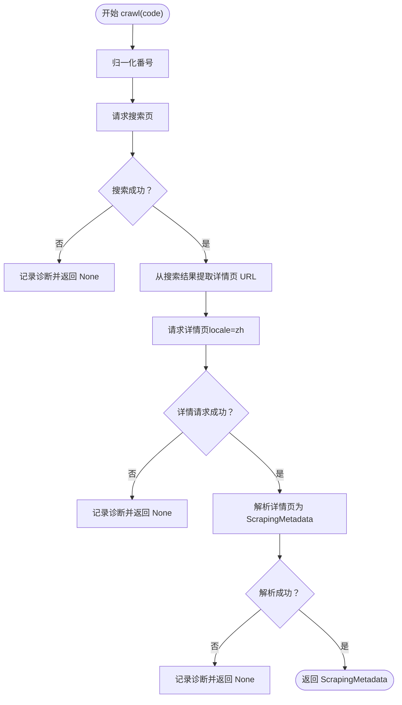
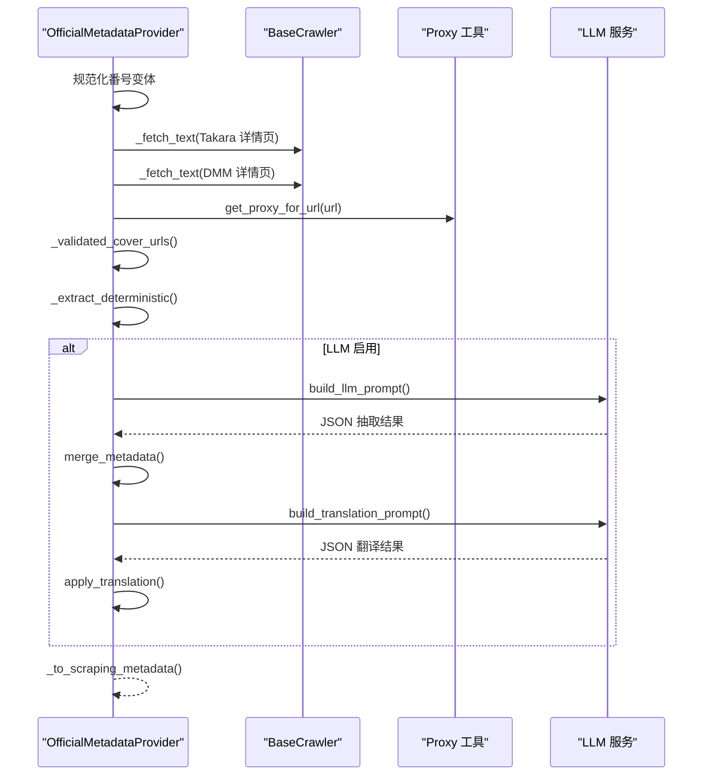
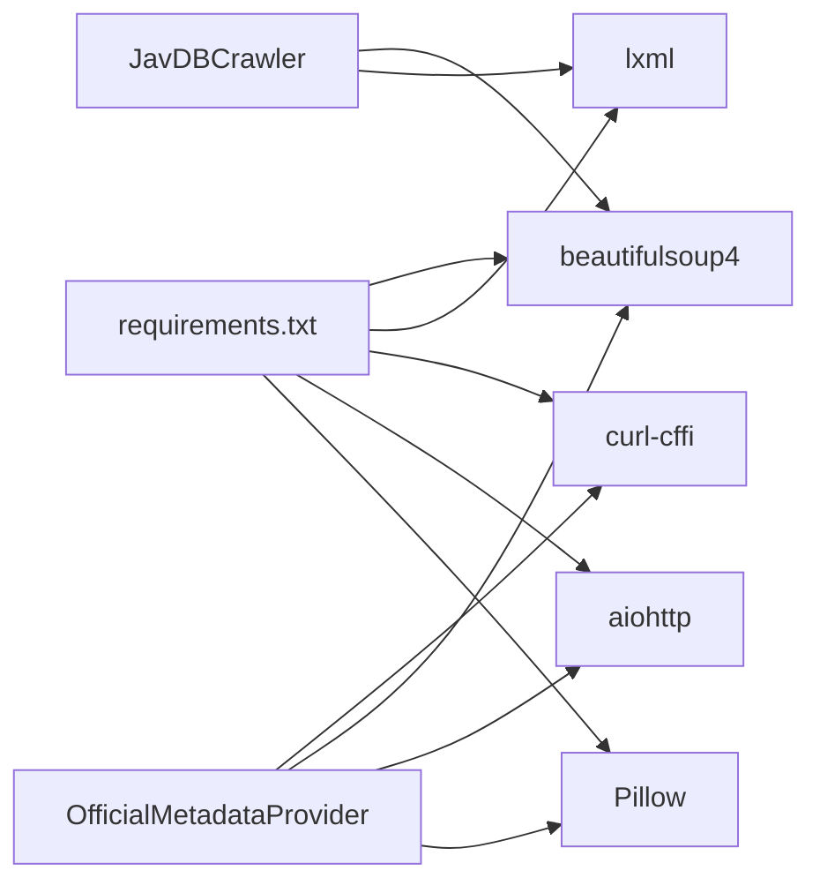
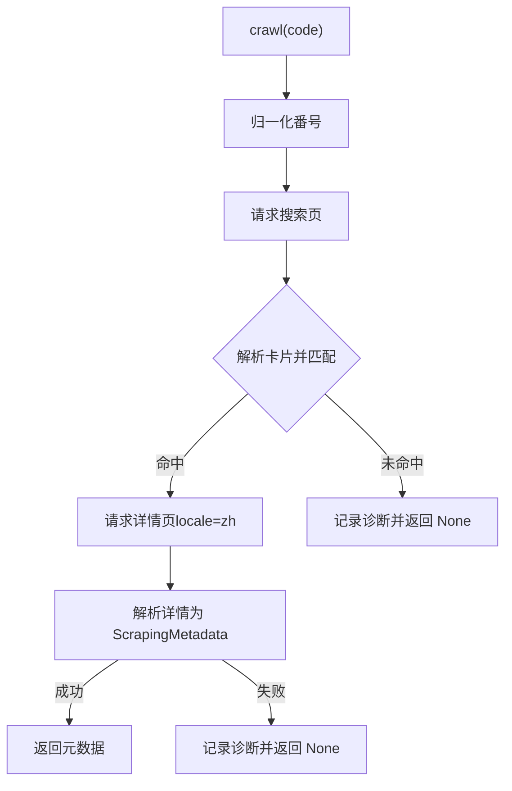
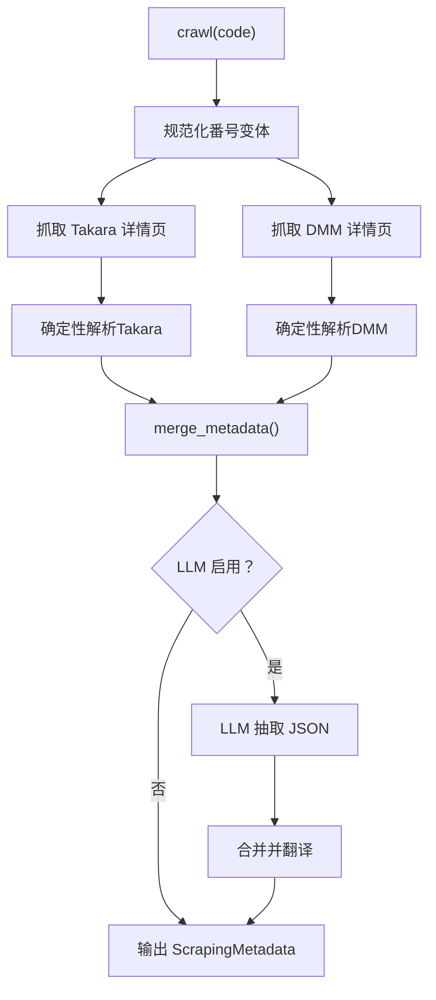

# 具体刮削器实现

<cite>
**本文引用的文件**
- [app/scrapers/javdb.py](file://app/scrapers/javdb.py)
- [app/scrapers/official.py](file://app/scrapers/official.py)
- [app/scrapers/metadata.py](file://app/scrapers/metadata.py)
- [app/scrapers/base.py](file://app/scrapers/base.py)
- [app/scrapers/proxy.py](file://app/scrapers/proxy.py)
- [app/models.py](file://app/models.py)
- [tests/test_scrapers/test_javdb.py](file://tests/test_scrapers/test_javdb.py)
- [tests/test_scrapers/test_official.py](file://tests/test_scrapers/test_official.py)
- [config/profiles/local.env.example](file://config/profiles/local.env.example)
- [config/profiles/nas.env.example](file://config/profiles/nas.env.example)
- [requirements.txt](file://requirements.txt)
</cite>

## 目录
1. [引言](#引言)
2. [项目结构](#项目结构)
3. [核心组件](#核心组件)
4. [架构总览](#架构总览)
5. [详细组件分析](#详细组件分析)
6. [依赖关系分析](#依赖关系分析)
7. [性能考量](#性能考量)
8. [故障诊断指南](#故障诊断指南)
9. [结论](#结论)
10. [附录](#附录)

## 引言
本文件面向需要理解并使用 Noctra 刮削子系统的工程师与运维人员，聚焦两类具体刮削器实现：JavDB 刮削器与官方 DMM 数据源刮削器。文档将系统阐述数据抓取策略、API 调用方式、数据解析逻辑、认证与代理机制、元数据标准化与格式转换规则，并给出配置参数、使用场景、性能特点、故障诊断与优化建议。

## 项目结构
Noctra 的刮削子系统位于 app/scrapers 目录，采用“多刮削器 + 统一元数据模型”的设计。核心文件包括：
- 基类：app/scrapers/base.py
- 元数据模型：app/scrapers/metadata.py
- JavDB 刮削器：app/scrapers/javdb.py
- 官方 DMM 刮削器：app/scrapers/official.py
- 代理工具：app/scrapers/proxy.py
- 批处理与前端交互模型：app/models.py
- 配置示例：config/profiles/local.env.example、config/profiles/nas.env.example
- 依赖声明：requirements.txt

图表来源
- [app/scrapers/base.py:15-204](file://app/scrapers/base.py#L15-L204)
- [app/scrapers/metadata.py:6-60](file://app/scrapers/metadata.py#L6-L60)
- [app/scrapers/javdb.py:14-353](file://app/scrapers/javdb.py#L14-L353)
- [app/scrapers/official.py:67-142](file://app/scrapers/official.py#L67-L142)
- [app/scrapers/proxy.py:27-65](file://app/scrapers/proxy.py#L27-L65)

章节来源
- [app/scrapers/base.py:15-204](file://app/scrapers/base.py#L15-L204)
- [app/scrapers/metadata.py:6-60](file://app/scrapers/metadata.py#L6-L60)
- [app/scrapers/javdb.py:14-353](file://app/scrapers/javdb.py#L14-L353)
- [app/scrapers/official.py:67-142](file://app/scrapers/official.py#L67-L142)
- [app/scrapers/proxy.py:27-65](file://app/scrapers/proxy.py#L27-L65)

## 核心组件
- 基类 BaseCrawler：提供统一的 HTTP 请求封装、Cloudflare 挑战检测与降级、诊断记录、错误设置等能力。
- 元数据模型 ScrapingMetadata：定义刮削后统一输出的字段集合，便于后续写入 NFO 与下载海报/背景图。
- JavDB 刮削器 JavDBCrawler：面向 javdb.com 的搜索与详情页解析，支持中英日标签、封面与预览图提取。
- 官方 DMM 刮削器 OfficialMetadataProvider：同时抓取 Takara 与 DMM 页面，进行确定性解析与可选 LLM 辅助抽取，支持封面 URL 校验与翻译。

章节来源
- [app/scrapers/base.py:15-204](file://app/scrapers/base.py#L15-L204)
- [app/scrapers/metadata.py:6-60](file://app/scrapers/metadata.py#L6-L60)
- [app/scrapers/javdb.py:14-353](file://app/scrapers/javdb.py#L14-L353)
- [app/scrapers/official.py:67-142](file://app/scrapers/official.py#L67-L142)

## 架构总览
下图展示两类刮削器在系统中的位置与交互关系：

图表来源
- [app/scrapers/javdb.py:41-89](file://app/scrapers/javdb.py#L41-L89)
- [app/scrapers/official.py:90-141](file://app/scrapers/official.py#L90-L141)
- [app/scrapers/base.py:124-204](file://app/scrapers/base.py#L124-L204)
- [app/scrapers/proxy.py:27-65](file://app/scrapers/proxy.py#L27-L65)

## 详细组件分析

### JavDB 刮削器（JavDBCrawler）
- 数据抓取策略
  - 搜索阶段：以番号为关键词访问搜索页，解析卡片列表，优先精确匹配 .uid 或 .video-title 中的番号，其次按标题包含匹配，最后回退到第一个结果。
  - 详情阶段：进入详情页，按中/英/日标签集合解析字段。
- API 调用方式
  - 使用 BaseCrawler 的 _request 封装，固定 2 秒延时，支持浏览器指纹切换与代理透传。
  - 详情页强制 locale=zh 参数，确保页面语言一致。
- 数据解析逻辑
  - 标签集覆盖中文（简繁）、英文与日文，提升跨语言兼容性。
  - 提取字段：标题、原始标题、剧情简介、网站链接、演员、片商、发行日期、时长、导演、标签、评分与投票数、海报/背景图、预览图。
  - 代码归一化：去除多余空格与连字符空格，统一大小写，仅保留形如 “XX-NNN” 的核心部分。
  - 发行日期归一化：支持 YYYY-MM-DD 与 YYYY/MM/DD 两种格式。
- 错误处理与诊断
  - 搜索失败、详情失败、代码不匹配均会记录诊断并返回 None。
  - 支持 Cloudflare 挑战检测与降级重试。

图表来源
- [app/scrapers/javdb.py:41-89](file://app/scrapers/javdb.py#L41-L89)
- [app/scrapers/base.py:124-204](file://app/scrapers/base.py#L124-L204)

章节来源
- [app/scrapers/javdb.py:14-353](file://app/scrapers/javdb.py#L14-L353)
- [tests/test_scrapers/test_javdb.py:1-549](file://tests/test_scrapers/test_javdb.py#L1-L549)

### 官方 DMM 刮削器（OfficialMetadataProvider）
- 数据抓取策略
  - 并行抓取 Takara 与 DMM 详情页，基于番号变体生成候选 URL。
  - Takara：解析 table.product_i 字段，提取标题、品番、发售日、时长。
  - DMM：解析 h1#title、meta og:title、表格字段（发售日、时长、演员、导演、系列、厂商、厂牌、标签、品番），并提取评分与投票数。
- API 调用方式
  - 使用 curl_cffi requests.Session，支持 impersonate、超时、证书校验关闭、可选代理。
  - 多次重试与失败降级，记录诊断。
- 认证机制
  - DMM 请求头包含 age_check_done Cookie，绕过年龄确认。
  - 代理自动选择：根据 URL scheme 与环境变量 HTTPS_PROXY/HTTP_PROXY/ALL_PROXY 决定。
- 数据完整性保证
  - 封面 URL 校验：HEAD/GET 检查 200 且 content-type 以 image/ 开头，拒绝 now_printing 占位图。
  - 代码一致性检查：若页面品番与输入不一致则标记冲突。
  - 确定性字段优先：评分与投票数来自 DMM 表格，优先保留确定性结果。
- 元数据标准化与格式转换
  - 日文日期标准化为 YYYY-MM-DD。
  - 时长提取纯数字。
  - 标签与演员去重、清洗空白。
  - 产品页 URL 与封面 URL 白名单过滤。
- LLM 辅助抽取与翻译
  - 可选启用，需配置 NOCTRA_LLM_ENABLED 或 API Key。
  - 提供抽取提示词与翻译提示词，严格限制输出 JSON 结构与字段来源。
  - 翻译仅更新显示字段，保留原文以防冲突。

图表来源
- [app/scrapers/official.py:90-141](file://app/scrapers/official.py#L90-L141)
- [app/scrapers/official.py:500-562](file://app/scrapers/official.py#L500-L562)
- [app/scrapers/official.py:563-608](file://app/scrapers/official.py#L563-L608)
- [app/scrapers/proxy.py:27-65](file://app/scrapers/proxy.py#L27-L65)

章节来源
- [app/scrapers/official.py:67-1178](file://app/scrapers/official.py#L67-L1178)
- [tests/test_scrapers/test_official.py:1-299](file://tests/test_scrapers/test_official.py#L1-L299)

### 元数据模型（ScrapingMetadata）
- 字段覆盖基础信息、制作信息与媒体资源，提供 to_dict 以便模板渲染与写入 NFO。
- 用于两类刮削器的统一输出，确保下游写入器无需关心数据源差异。

章节来源
- [app/scrapers/metadata.py:6-60](file://app/scrapers/metadata.py#L6-L60)

### 基类与代理（BaseCrawler、Proxy）
- BaseCrawler
  - 统一请求封装：浏览器指纹切换、Cloudflare 挑战检测、错误消息构建、诊断记录。
  - 适用于两类刮削器的基础能力。
- Proxy
  - 根据 URL scheme 与环境变量选择代理，支持 http/https/all 代理优先级。

章节来源
- [app/scrapers/base.py:15-204](file://app/scrapers/base.py#L15-L204)
- [app/scrapers/proxy.py:27-65](file://app/scrapers/proxy.py#L27-L65)

## 依赖关系分析
- 运行时依赖
  - fastapi、uvicorn、aiohttp、aiosqlite、beautifulsoup4、lxml、curl-cffi、aiofiles、Pillow 等。
- 刮削器依赖
  - JavDB：BeautifulSoup 解析 HTML。
  - 官方：curl_cffi requests.Session、aiohttp（LLM 调用）、BeautifulSoup、正则清洗。

图表来源
- [requirements.txt:1-12](file://requirements.txt#L1-L12)
- [app/scrapers/javdb.py:8-11](file://app/scrapers/javdb.py#L8-L11)
- [app/scrapers/official.py:10-16](file://app/scrapers/official.py#L10-L16)

章节来源
- [requirements.txt:1-12](file://requirements.txt#L1-L12)

## 性能考量
- 请求延时与并发
  - BaseCrawler 固定 2 秒延时，降低被反爬策略触发的概率，适合稳定抓取。
  - 官方刮削器对 Takara 与 DMM 并行请求，结合重试与代理可提升成功率。
- 解析效率
  - BeautifulSoup + lxml 在本地解析性能良好；建议控制单次解析规模，避免超大 HTML 片段。
- LLM 抽取
  - 仅在明确启用时才发起请求，避免额外网络开销；合理设置超时与输出长度上限。
- 缓存与复用
  - 可在上游层引入缓存（如数据库或内存缓存）减少重复请求与解析。

## 故障诊断指南
- 常见问题与定位
  - 搜索失败/无结果：检查网络、代理、目标站点状态；查看诊断记录中的 HTTP 状态与标题。
  - 详情页解析失败：确认页面结构是否变化；检查标签集合是否覆盖当前语言。
  - 代码不匹配：JavDB 详情页的番号需与输入一致，否则视为不匹配。
  - Cloudflare 挑战：BaseCrawler 自动检测并切换浏览器指纹，必要时调整代理。
  - DMM 年龄确认：确保请求头包含 age_check_done Cookie。
  - 封面校验失败：拒绝 now_printing 占位图；检查 URL 白名单与网络可达性。
- 诊断记录
  - BaseCrawler 维护最近若干条诊断，包含级别与消息；可通过日志或前端界面查看。
- LLM 相关
  - 未配置 API Key 或禁用 LLM 时，将回退到确定性解析；翻译亦会跳过。

章节来源
- [app/scrapers/base.py:72-123](file://app/scrapers/base.py#L72-L123)
- [app/scrapers/javdb.py:55-89](file://app/scrapers/javdb.py#L55-L89)
- [app/scrapers/official.py:176-211](file://app/scrapers/official.py#L176-L211)
- [app/scrapers/official.py:508-561](file://app/scrapers/official.py#L508-L561)

## 结论
- JavDB 刮削器适合快速获取公开元数据，具备良好的跨语言标签支持与稳健的解析流程。
- 官方 DMM 刮削器在确定性解析基础上提供可选 LLM 抽取与翻译，显著提升数据完整性与中文可读性。
- 两者共享统一的元数据模型与基础能力，便于扩展与维护。

## 附录

### 配置参数与使用场景
- 通用
  - NOCTRA_LLM_ENABLED：启用/禁用 LLM 抽取与翻译。
  - NOCTRA_LLM_BASE_URL：LLM 服务基础地址，默认 OpenAI 兼容路径。
  - NOCTRA_LLM_WIRE_API：wire 接口名称，如 responses。
  - NOCTRA_LLM_MODEL：模型名，默认 gpt-5.4-mini。
  - NOCTRA_LLM_API_KEY：LLM 访问密钥。
  - NOCTRA_LLM_TIMEOUT_SECONDS：LLM 请求超时秒数。
  - NOCTRA_LLM_MAX_OUTPUT_TOKENS：LLM 输出最大 token 数。
- 代理
  - HTTPS_PROXY/https_proxy/ALL_PROXY/all_proxy/HTTP_PROXY/http_proxy：按 scheme 优先级选择代理。
- 使用场景
  - JavDB：适合快速抓取公开页面元数据，无需认证。
  - 官方：适合需要高完整性的日文作品，配合 LLM 提升准确性与中文可读性。

章节来源
- [config/profiles/local.env.example:16-22](file://config/profiles/local.env.example#L16-L22)
- [config/profiles/nas.env.example:30-34](file://config/profiles/nas.env.example#L30-L34)
- [app/scrapers/official.py:523-535](file://app/scrapers/official.py#L523-L535)
- [app/scrapers/official.py:576-583](file://app/scrapers/official.py#L576-L583)

### 关键流程图（代码级）
- JavDB 搜索与详情解析

图表来源
- [app/scrapers/javdb.py:41-89](file://app/scrapers/javdb.py#L41-L89)

- 官方刮削器确定性解析与 LLM 合并

图表来源
- [app/scrapers/official.py:90-141](file://app/scrapers/official.py#L90-L141)
- [app/scrapers/official.py:708-734](file://app/scrapers/official.py#L708-L734)
- [app/scrapers/official.py:500-608](file://app/scrapers/official.py#L500-L608)