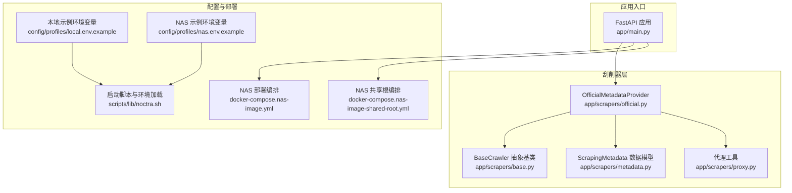
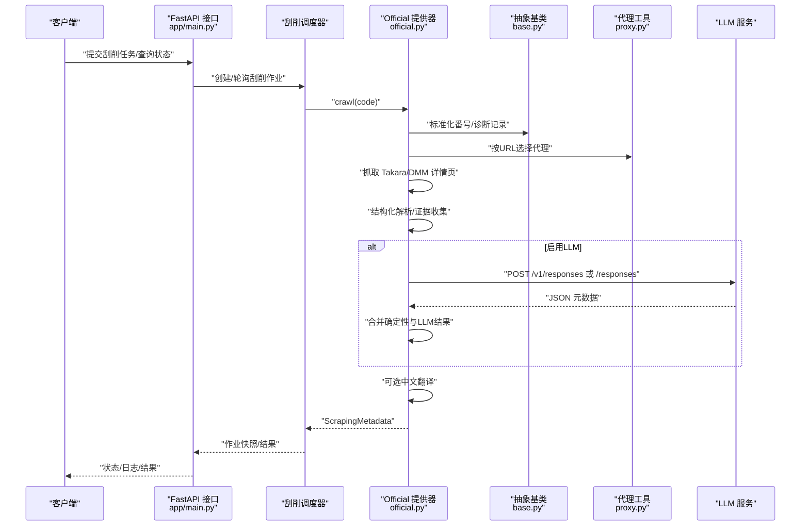
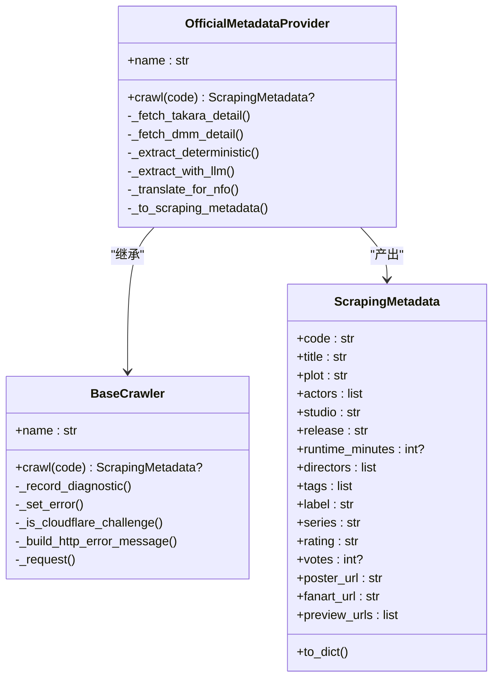
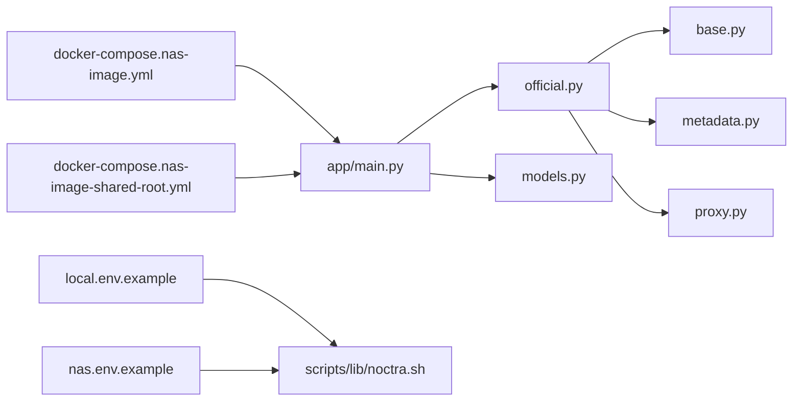

# 官方数据源刮削器

<cite>
**本文引用的文件**
- [app/scrapers/official.py](file://app/scrapers/official.py)
- [app/scrapers/base.py](file://app/scrapers/base.py)
- [app/scrapers/metadata.py](file://app/scrapers/metadata.py)
- [app/scrapers/proxy.py](file://app/scrapers/proxy.py)
- [app/models.py](file://app/models.py)
- [app/main.py](file://app/main.py)
- [config/profiles/local.env.example](file://config/profiles/local.env.example)
- [config/profiles/nas.env.example](file://config/profiles/nas.env.example)
- [docker-compose.nas-image.yml](file://docker-compose.nas-image.yml)
- [docker-compose.nas-image-shared-root.yml](file://docker-compose.nas-image-shared-root.yml)
- [scripts/lib/noctra.sh](file://scripts/lib/noctra.sh)
- [docs/runtime-workflow.md](file://docs/runtime-workflow.md)
- [docs/local-startup.md](file://docs/local-startup.md)
</cite>

## 目录
1. [简介](#简介)
2. [项目结构](#项目结构)
3. [核心组件](#核心组件)
4. [架构总览](#架构总览)
5. [详细组件分析](#详细组件分析)
6. [依赖关系分析](#依赖关系分析)
7. [性能考量](#性能考量)
8. [故障排查指南](#故障排查指南)
9. [结论](#结论)
10. [附录](#附录)

## 简介
本文件面向官方数据源刮削器的技术文档，聚焦于官方API接口的认证机制、访问令牌管理与权限控制，数据同步策略、增量更新与一致性保障，API调用频率限制与配额管理、速率控制，错误码处理与异常恢复、降级策略，配置参数与环境变量、安全最佳实践，以及数据验证规则、格式转换与标准化流程。

## 项目结构
官方数据源刮削器位于应用层的刮削模块中，围绕“官方/DMM”数据源构建，采用异步HTTP客户端与可选LLM增强抽取，结合统一的元数据模型与诊断日志系统，形成从请求、解析、合并、翻译到落库的完整链路。

图表来源
- [app/main.py:1-200](file://app/main.py#L1-L200)
- [app/scrapers/official.py:1-120](file://app/scrapers/official.py#L1-L120)
- [app/scrapers/base.py:1-60](file://app/scrapers/base.py#L1-L60)
- [app/scrapers/metadata.py:1-60](file://app/scrapers/metadata.py#L1-L60)
- [app/scrapers/proxy.py:1-65](file://app/scrapers/proxy.py#L1-L65)
- [config/profiles/local.env.example:1-23](file://config/profiles/local.env.example#L1-L23)
- [config/profiles/nas.env.example:1-44](file://config/profiles/nas.env.example#L1-L44)
- [docker-compose.nas-image.yml:1-50](file://docker-compose.nas-image.yml#L1-L50)
- [docker-compose.nas-image-shared-root.yml:1-32](file://docker-compose.nas-image-shared-root.yml#L1-L32)
- [scripts/lib/noctra.sh:1-103](file://scripts/lib/noctra.sh#L1-L103)

章节来源
- [app/main.py:1-200](file://app/main.py#L1-L200)
- [app/scrapers/official.py:1-120](file://app/scrapers/official.py#L1-L120)
- [app/scrapers/base.py:1-60](file://app/scrapers/base.py#L1-L60)
- [app/scrapers/metadata.py:1-60](file://app/scrapers/metadata.py#L1-L60)
- [app/scrapers/proxy.py:1-65](file://app/scrapers/proxy.py#L1-L65)
- [config/profiles/local.env.example:1-23](file://config/profiles/local.env.example#L1-L23)
- [config/profiles/nas.env.example:1-44](file://config/profiles/nas.env.example#L1-L44)
- [docker-compose.nas-image.yml:1-50](file://docker-compose.nas-image.yml#L1-L50)
- [docker-compose.nas-image-shared-root.yml:1-32](file://docker-compose.nas-image-shared-root.yml#L1-L32)
- [scripts/lib/noctra.sh:1-103](file://scripts/lib/noctra.sh#L1-L103)

## 核心组件
- 官方/DMM元数据提供器：负责标准化番号、抓取Takara与DMM详情页、提取结构化元数据、可选LLM增强抽取与中文翻译、合并与去重、最终转为通用元数据模型。
- 抽象爬虫基类：提供统一的诊断日志、错误记录、Cloudflare挑战检测与浏览器指纹切换、会话复用与代理支持。
- 元数据模型：统一的刮削元数据结构，便于NFO与图片写入。
- 代理工具：基于URL协议与环境变量自动选择HTTP/HTTPS代理。
- FastAPI应用：提供健康检查、扫描、整理、刮削作业等API，并维护SQLite数据库与刮削状态字段。

章节来源
- [app/scrapers/official.py:67-142](file://app/scrapers/official.py#L67-L142)
- [app/scrapers/base.py:15-87](file://app/scrapers/base.py#L15-L87)
- [app/scrapers/metadata.py:6-60](file://app/scrapers/metadata.py#L6-L60)
- [app/scrapers/proxy.py:27-65](file://app/scrapers/proxy.py#L27-L65)
- [app/main.py:58-130](file://app/main.py#L58-L130)

## 架构总览
官方数据源刮削器采用“异步抓取 + 结构化解析 + 可选LLM增强 + 统一模型输出”的架构。请求阶段通过curl_cffi与aiohttp分别处理网页与LLM请求；解析阶段利用BeautifulSoup与正则表达式进行字段抽取与清洗；合并阶段以确定性解析为主、LLM为辅，确保一致性；最后通过FastAPI对外提供可观测的刮削作业与状态。

图表来源
- [app/main.py:1-200](file://app/main.py#L1-L200)
- [app/scrapers/official.py:90-142](file://app/scrapers/official.py#L90-L142)
- [app/scrapers/base.py:72-123](file://app/scrapers/base.py#L72-L123)
- [app/scrapers/proxy.py:27-65](file://app/scrapers/proxy.py#L27-L65)

## 详细组件分析

### 官方/DMM元数据提供器（OfficialMetadataProvider）
- 认证与权限
  - 官方站点访问通过浏览器指纹伪装与代理支持降低风控拦截概率；未见显式OAuth/JWT令牌管理逻辑，而是通过年龄验证Cookie与UA适配规避简单反爬。
- 访问令牌管理
  - 未实现官方API的令牌颁发/刷新流程；当启用LLM时，通过环境变量注入Bearer令牌至外部LLM服务端点。
- 数据同步与增量更新
  - 刮削结果写入SQLite文件数据库，包含状态、时间戳、错误与日志字段；通过作业模式实现可观察的增量处理与重试。
- 数据一致性
  - 采用“确定性解析优先 + LLM增强为辅”的合并策略，优先保留非空字段，证据与冲突列表用于溯源与对齐。
- 错误处理与降级
  - 对Cloudflare挑战进行浏览器指纹切换重试；对LLM请求失败进行降级回退，保留确定性解析结果。
- 速率控制
  - 网页请求采用线程池异步执行，未见显式的并发限速；LLM请求通过超时配置与异常捕获实现稳健性。

图表来源
- [app/scrapers/official.py:67-142](file://app/scrapers/official.py#L67-L142)
- [app/scrapers/base.py:15-87](file://app/scrapers/base.py#L15-L87)
- [app/scrapers/metadata.py:6-60](file://app/scrapers/metadata.py#L6-L60)

章节来源
- [app/scrapers/official.py:67-142](file://app/scrapers/official.py#L67-L142)
- [app/scrapers/official.py:143-212](file://app/scrapers/official.py#L143-L212)
- [app/scrapers/official.py:284-310](file://app/scrapers/official.py#L284-L310)
- [app/scrapers/official.py:500-562](file://app/scrapers/official.py#L500-L562)
- [app/scrapers/official.py:563-608](file://app/scrapers/official.py#L563-L608)
- [app/scrapers/official.py:657-686](file://app/scrapers/official.py#L657-L686)

### 抽象爬虫基类（BaseCrawler）
- 诊断与错误
  - 统一日志上限、错误记录与HTTP错误消息构建；对Cloudflare挑战进行多浏览器指纹切换重试。
- 代理与请求
  - 通过代理工具按URL协议选择代理；固定UA与语言头，支持impersonate浏览器指纹。

章节来源
- [app/scrapers/base.py:15-87](file://app/scrapers/base.py#L15-L87)
- [app/scrapers/base.py:124-204](file://app/scrapers/base.py#L124-L204)
- [app/scrapers/proxy.py:27-65](file://app/scrapers/proxy.py#L27-L65)

### 元数据模型（ScrapingMetadata）
- 字段覆盖：基础信息、制作信息、媒体资源等；提供字典化导出方法，便于模板渲染与写入NFO/图片命名。
- 与官方提供器的映射：官方提供器将解析结果转换为该模型，再由写入器消费。

章节来源
- [app/scrapers/metadata.py:6-60](file://app/scrapers/metadata.py#L6-L60)
- [app/scrapers/official.py:657-686](file://app/scrapers/official.py#L657-L686)

### API与作业系统（FastAPI + 作业）
- 健康检查与数据库初始化：启动时创建表与必要列，确保刮削状态字段存在。
- 作业模式：支持创建、轮询、取消刮削作业，返回快照与日志，便于前端观测与用户反馈。
- 数据持久化：文件记录包含刮削状态、时间戳、错误与日志，支持增量处理与重试。

章节来源
- [app/main.py:78-130](file://app/main.py#L78-L130)
- [app/main.py:141-205](file://app/main.py#L141-L205)
- [app/models.py:106-185](file://app/models.py#L106-L185)

## 依赖关系分析
- 组件耦合
  - Official 提供器依赖 BaseCrawler 的诊断与请求能力，依赖 ScrapingMetadata 输出统一模型，依赖 Proxy 选择代理。
  - FastAPI 应用依赖刮削调度器与作业模型，依赖 SQLite 存储状态。
- 外部依赖
  - curl_cffi 用于网页请求与浏览器指纹伪装；aiohttp 用于LLM请求；BeautifulSoup 用于HTML解析。
- 配置与部署
  - 通过环境变量与profile文件控制行为；Docker编排支持NAS部署与代理透传。

图表来源
- [app/scrapers/official.py:1-120](file://app/scrapers/official.py#L1-L120)
- [app/scrapers/base.py:1-60](file://app/scrapers/base.py#L1-L60)
- [app/scrapers/metadata.py:1-60](file://app/scrapers/metadata.py#L1-L60)
- [app/scrapers/proxy.py:1-65](file://app/scrapers/proxy.py#L1-L65)
- [app/models.py:1-216](file://app/models.py#L1-L216)
- [app/main.py:1-200](file://app/main.py#L1-L200)
- [config/profiles/local.env.example:1-23](file://config/profiles/local.env.example#L1-L23)
- [config/profiles/nas.env.example:1-44](file://config/profiles/nas.env.example#L1-L44)
- [docker-compose.nas-image.yml:1-50](file://docker-compose.nas-image.yml#L1-L50)
- [docker-compose.nas-image-shared-root.yml:1-32](file://docker-compose.nas-image-shared-root.yml#L1-L32)
- [scripts/lib/noctra.sh:1-103](file://scripts/lib/noctra.sh#L1-L103)

章节来源
- [app/scrapers/official.py:1-120](file://app/scrapers/official.py#L1-L120)
- [app/scrapers/base.py:1-60](file://app/scrapers/base.py#L1-L60)
- [app/scrapers/metadata.py:1-60](file://app/scrapers/metadata.py#L1-L60)
- [app/scrapers/proxy.py:1-65](file://app/scrapers/proxy.py#L1-L65)
- [app/models.py:1-216](file://app/models.py#L1-L216)
- [app/main.py:1-200](file://app/main.py#L1-L200)
- [config/profiles/local.env.example:1-23](file://config/profiles/local.env.example#L1-L23)
- [config/profiles/nas.env.example:1-44](file://config/profiles/nas.env.example#L1-L44)
- [docker-compose.nas-image.yml:1-50](file://docker-compose.nas-image.yml#L1-L50)
- [docker-compose.nas-image-shared-root.yml:1-32](file://docker-compose.nas-image-shared-root.yml#L1-L32)
- [scripts/lib/noctra.sh:1-103](file://scripts/lib/noctra.sh#L1-L103)

## 性能考量
- 异步I/O与线程池
  - 网页请求通过线程池执行，减少阻塞；LLM请求使用aiohttp异步会话，提升吞吐。
- 重试与超时
  - 网页请求具备有限次重试与延迟；LLM请求具备超时配置，避免长时间等待。
- 代理与指纹
  - 自动代理选择与多浏览器指纹切换，有助于绕过简单风控，提高成功率。
- 并发与限速
  - 未发现显式的并发上限或速率限制实现，建议在部署侧通过容器资源限制与队列化作业控制整体并发。

## 故障排查指南
- 常见问题定位
  - 健康检查：通过健康端点确认服务状态与路径配置。
  - 诊断日志：查看最近诊断消息与错误记录，定位具体阶段与原因。
  - Cloudflare拦截：若出现403且提示“Just a moment”，系统会自动切换浏览器指纹重试。
- LLM相关
  - 未配置API Key或禁用LLM时，系统将回退到确定性解析；检查环境变量与服务端点。
- 数据库
  - 启动时自动补齐刮削字段索引与默认值，确保状态字段可用。

章节来源
- [app/main.py:127-139](file://app/main.py#L127-L139)
- [app/scrapers/base.py:88-123](file://app/scrapers/base.py#L88-L123)
- [app/scrapers/official.py:500-562](file://app/scrapers/official.py#L500-L562)

## 结论
官方数据源刮削器通过“确定性解析 + LLM增强 + 统一模型 + 作业可观测”的设计，在不直接依赖官方API令牌的前提下，实现了对DMM/Takara等站点的稳定抓取与高质量元数据输出。其配置驱动与容器化部署降低了运维复杂度，而诊断日志与错误降级提升了稳定性与可维护性。

## 附录

### 配置参数与环境变量详解
- 服务绑定与端口
  - NOCTRA_BIND_HOST、NOCTRA_PORT：服务监听地址与端口。
- 路径配置
  - NOCTRA_SOURCE_DIR、NOCTRA_DIST_DIR、NOCTRA_DATA_DIR、NOCTRA_DB_PATH：源目录、目标目录、数据目录与数据库路径。
- LLM相关
  - NOCTRA_LLM_ENABLED：是否启用LLM增强。
  - NOCTRA_LLM_BASE_URL：LLM服务基础URL，默认OpenAI兼容。
  - NOCTRA_LLM_WIRE_API：请求路径后缀（responses/v1/responses）。
  - NOCTRA_LLM_MODEL：模型名称。
  - NOCTRA_LLM_API_KEY：外部LLM服务的访问密钥。
  - NOCTRA_LLM_TIMEOUT_SECONDS：LLM请求超时秒数。
  - NOCTRA_LLM_MAX_OUTPUT_TOKENS：最大输出token数。
- 代理与网络
  - HTTP_PROXY/HTTPS_PROXY/all_proxy等：按URL协议自动选择代理。
- 运行时工作流
  - NOCTRA_PROFILE：选择本地或NAS配置文件。
  - NOCTRA_PYTHON_BIN：可选自定义Python路径。
- Docker部署
  - NOCTRA_REMOTE_*：远程部署目标与模式。
  - NOCTRA_DOCKER_IMAGE/PULL_POLICY：镜像与拉取策略。
  - NOCTRA_HTTP_PROXY/HTTPS_PROXY：容器内代理透传。

章节来源
- [config/profiles/local.env.example:4-23](file://config/profiles/local.env.example#L4-L23)
- [config/profiles/nas.env.example:3-44](file://config/profiles/nas.env.example#L3-L44)
- [docker-compose.nas-image.yml:14-26](file://docker-compose.nas-image.yml#L14-L26)
- [docker-compose.nas-image-shared-root.yml:13-27](file://docker-compose.nas-image-shared-root.yml#L13-L27)
- [scripts/lib/noctra.sh:13-73](file://scripts/lib/noctra.sh#L13-L73)
- [docs/runtime-workflow.md:9-29](file://docs/runtime-workflow.md#L9-L29)
- [docs/local-startup.md:66-92](file://docs/local-startup.md#L66-L92)

### 安全最佳实践
- 令牌与密钥
  - 将NOCTRA_LLM_API_KEY置于受控环境，避免硬编码；仅在需要时启用LLM增强。
- 代理与网络
  - 使用HTTPS_PROXY/HTTP_PROXY明确代理，避免泄露内部网络信息；在容器中按需透传。
- 部署隔离
  - 使用Docker镜像与资源限制，限制CPU/内存；通过只读挂载与最小权限原则保护宿主机。
- 日志与审计
  - 通过诊断日志与作业快照追踪刮削过程；避免在日志中打印敏感信息。

### 数据验证规则、格式转换与标准化流程
- 番号标准化
  - 支持多种分隔符与大小写输入，统一为“前缀-数字”格式；生成mono/digital CID与小写变体。
- 日期与分钟数
  - 日文日期与ISO日期均支持，统一为YYYY-MM-DD；分钟数从文本中提取为整数。
- 文本清洗
  - 清理多余空白、标签与属性，保留有效内容；标题/标签等字段去除尾部冒号。
- 图片URL校验
  - HEAD/GET探测、Content-Type校验、禁止“now_printing”跳过；支持代理直连。
- 冲突与证据
  - 不同来源字段冲突时记录冲突证据，便于人工核验与溯源。

章节来源
- [app/scrapers/official.py:688-705](file://app/scrapers/official.py#L688-L705)
- [app/scrapers/official.py:1057-1110](file://app/scrapers/official.py#L1057-L1110)
- [app/scrapers/official.py:213-283](file://app/scrapers/official.py#L213-L283)