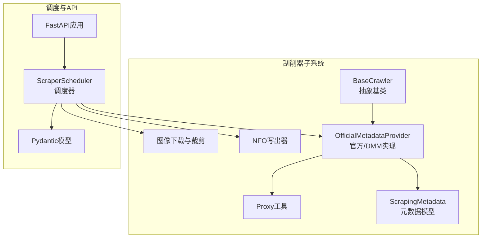
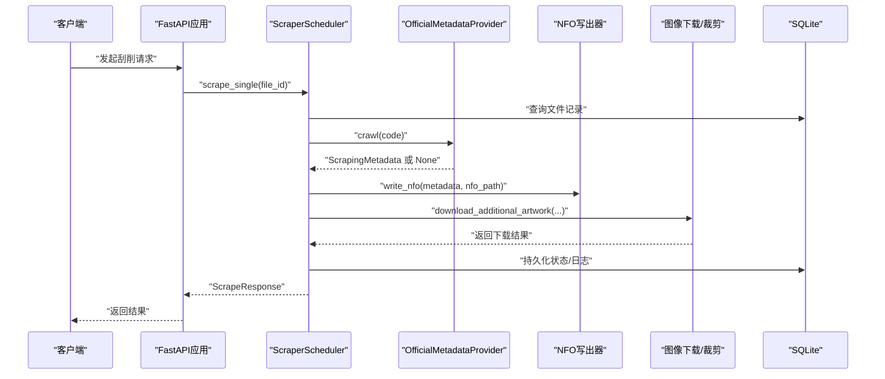
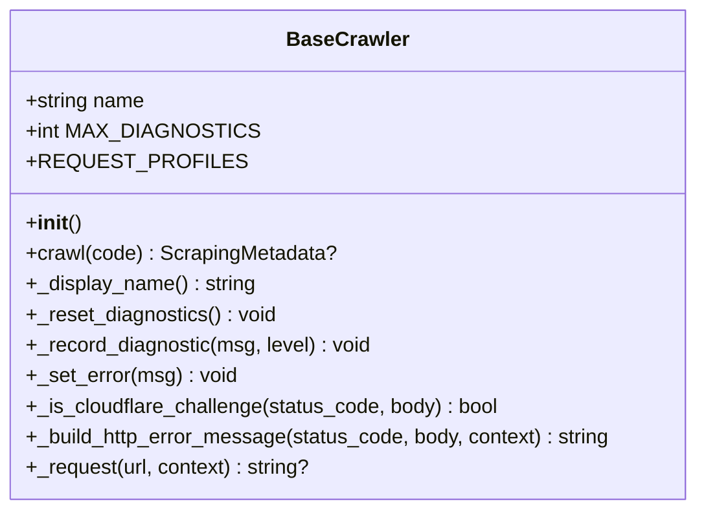
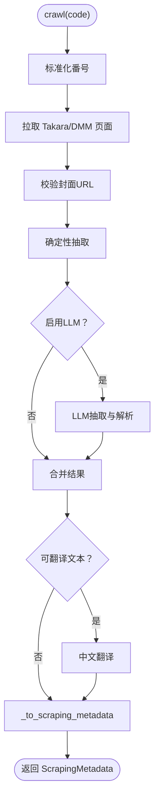
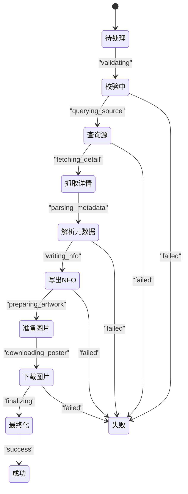
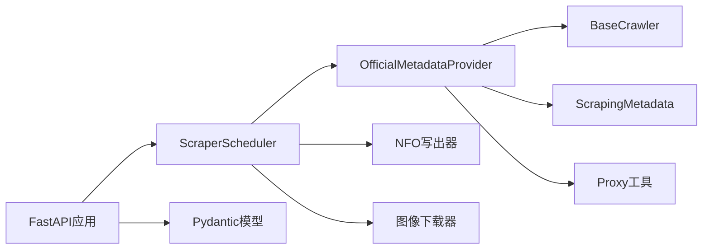

# 刮削器基础框架

<cite>
**本文档引用的文件**
- [app/scrapers/base.py](file://app/scrapers/base.py)
- [app/scrapers/official.py](file://app/scrapers/official.py)
- [app/scrapers/metadata.py](file://app/scrapers/metadata.py)
- [app/scrapers/proxy.py](file://app/scrapers/proxy.py)
- [app/scrapers/writers/nfo.py](file://app/scrapers/writers/nfo.py)
- [app/scrapers/writers/image.py](file://app/scrapers/writers/image.py)
- [app/scraper.py](file://app/scraper.py)
- [app/models.py](file://app/models.py)
- [app/main.py](file://app/main.py)
- [tests/test_scrapers/test_base.py](file://tests/test_scrapers/test_base.py)
- [tests/test_scrapers/test_official.py](file://tests/test_scrapers/test_official.py)
- [config/profiles/local.env.example](file://config/profiles/local.env.example)
- [docker-compose.yml](file://docker-compose.yml)
</cite>

## 目录
1. [引言](#引言)
2. [项目结构](#项目结构)
3. [核心组件](#核心组件)
4. [架构概览](#架构概览)
5. [详细组件分析](#详细组件分析)
6. [依赖关系分析](#依赖关系分析)
7. [性能考虑](#性能考虑)
8. [故障排查指南](#故障排查指南)
9. [结论](#结论)
10. [附录](#附录)

## 引言
本文件面向需要扩展与维护刮削器系统的开发者，系统性阐述 Noctra 刮削器基础框架的设计理念、抽象接口、继承体系、生命周期管理、状态转换、错误处理、注册与工厂机制、配置参数、日志与调试支持，并提供扩展开发指南与最佳实践。

## 项目结构
本项目围绕“刮削器”子系统构建，核心位于 app/scrapers 目录，包含：
- 抽象基类与通用能力：base.py
- 官方数据源实现：official.py
- 元数据模型：metadata.py
- 代理工具：proxy.py
- 写出器：writers/nfo.py、writers/image.py
- 调度器：scraper.py
- 数据模型与 API：models.py、main.py

**图表来源**
- [app/scrapers/base.py:15-204](file://app/scrapers/base.py#L15-L204)
- [app/scrapers/official.py:67-141](file://app/scrapers/official.py#L67-L141)
- [app/scrapers/metadata.py:6-60](file://app/scrapers/metadata.py#L6-L60)
- [app/scrapers/proxy.py:27-64](file://app/scrapers/proxy.py#L27-L64)
- [app/scrapers/writers/nfo.py:12-82](file://app/scrapers/writers/nfo.py#L12-L82)
- [app/scrapers/writers/image.py:60-148](file://app/scrapers/writers/image.py#L60-L148)
- [app/scraper.py:82-453](file://app/scraper.py#L82-L453)
- [app/models.py:106-216](file://app/models.py#L106-L216)
- [app/main.py:48-49](file://app/main.py#L48-L49)

**章节来源**
- [app/scrapers/base.py:15-204](file://app/scrapers/base.py#L15-L204)
- [app/scrapers/official.py:67-141](file://app/scrapers/official.py#L67-L141)
- [app/scraper.py:82-453](file://app/scraper.py#L82-L453)
- [app/models.py:106-216](file://app/models.py#L106-L216)

## 核心组件
- 抽象基类 BaseCrawler：定义统一的异步抓取接口、HTTP请求封装、诊断与错误记录、Cloudflare 挑战检测与重试策略。
- 官方数据源 OfficialMetadataProvider：继承自 BaseCrawler，实现官方/DMM页面的解析、封面校验、LLM辅助抽取与中文翻译。
- 元数据模型 ScrapingMetadata：承载刮削结果的结构化数据，提供导出为字典的能力。
- 调度器 ScraperScheduler：编排单文件刮削流程，从数据库查询、状态校验、调用刮削器、写出 NFO、下载图片到最终状态持久化。
- 写出器：NFO 写出器负责生成 Emby/Kodi 兼容的 XML；图像写出器负责下载 fanart/海报/预览图及海报裁剪。
- 代理工具：基于环境变量自动选择合适的代理，支持 http/https/全量代理。
- API 层：FastAPI 应用负责数据库初始化、状态迁移、刮削作业管理与前端交互。

**章节来源**
- [app/scrapers/base.py:15-204](file://app/scrapers/base.py#L15-L204)
- [app/scrapers/official.py:67-141](file://app/scrapers/official.py#L67-L141)
- [app/scrapers/metadata.py:6-60](file://app/scrapers/metadata.py#L6-L60)
- [app/scraper.py:82-453](file://app/scraper.py#L82-L453)
- [app/scrapers/writers/nfo.py:12-82](file://app/scrapers/writers/nfo.py#L12-L82)
- [app/scrapers/writers/image.py:60-148](file://app/scrapers/writers/image.py#L60-L148)
- [app/scrapers/proxy.py:27-64](file://app/scrapers/proxy.py#L27-L64)
- [app/main.py:48-49](file://app/main.py#L48-L49)

## 架构概览
下图展示了从 API 触发到最终状态落库的端到端流程，以及各组件间的依赖关系。

**图表来源**
- [app/main.py:48-49](file://app/main.py#L48-L49)
- [app/scraper.py:89-410](file://app/scraper.py#L89-L410)
- [app/scrapers/official.py:90-141](file://app/scrapers/official.py#L90-L141)
- [app/scrapers/writers/nfo.py:12-82](file://app/scrapers/writers/nfo.py#L12-L82)
- [app/scrapers/writers/image.py:74-148](file://app/scrapers/writers/image.py#L74-L148)

## 详细组件分析

### 抽象基类 BaseCrawler 设计
- 抽象接口：crawl(code) 必须由子类实现，返回 ScrapingMetadata 或 None。
- 会话与重试：内部维护 requests.Session，内置浏览器指纹配置与固定延迟，遇到 Cloudflare 挑战自动切换指纹重试。
- 诊断与错误：提供 _record_diagnostic、_set_error、_display_name 等方法，限制诊断数量，便于前端展示。
- HTTP 封装：_request(url, context) 统一封装超时、代理、SSL 验证、错误消息格式化。
- 错误映射：_build_http_error_message 将 HTTP 状态与页面标题映射为用户可读提示。

**图表来源**
- [app/scrapers/base.py:15-204](file://app/scrapers/base.py#L15-L204)

**章节来源**
- [app/scrapers/base.py:15-204](file://app/scrapers/base.py#L15-L204)

### 官方数据源 OfficialMetadataProvider 实现
- 继承 BaseCrawler，实现 crawl(code) 主流程：标准化番号、拉取 Takara/DMM 页面、校验封面、确定性抽取、可选 LLM 辅助抽取与翻译、合并结果、转为 ScrapingMetadata。
- 请求与重试：_fetch_text 使用线程池执行阻塞请求，带重试与错误记录。
- 封面校验：_check_image_url 支持 HEAD/GET 自适应与占位图过滤。
- LLM 集成：根据环境变量决定是否启用，构造提示词并解析响应，进行字段清洗与合并。
- 翻译：仅在存在可翻译文本时触发，保留原文失败兜底。

**图表来源**
- [app/scrapers/official.py:90-141](file://app/scrapers/official.py#L90-L141)
- [app/scrapers/official.py:143-211](file://app/scrapers/official.py#L143-L211)
- [app/scrapers/official.py:213-282](file://app/scrapers/official.py#L213-L282)
- [app/scrapers/official.py:500-561](file://app/scrapers/official.py#L500-L561)
- [app/scrapers/official.py:563-607](file://app/scrapers/official.py#L563-L607)
- [app/scrapers/official.py:657-685](file://app/scrapers/official.py#L657-L685)

**章节来源**
- [app/scrapers/official.py:67-141](file://app/scrapers/official.py#L67-L141)
- [app/scrapers/official.py:143-211](file://app/scrapers/official.py#L143-L211)
- [app/scrapers/official.py:213-282](file://app/scrapers/official.py#L213-L282)
- [app/scrapers/official.py:500-607](file://app/scrapers/official.py#L500-L607)
- [app/scrapers/official.py:657-685](file://app/scrapers/official.py#L657-L685)

### 调度器 ScraperScheduler 生命周期与状态
- 生命周期阶段：校验输入 → 查询数据库 → 调用官方刮削器 → 写出 NFO → 下载图片 → 更新数据库状态。
- 状态机：pending → success/failed，同时记录阶段、来源、进度百分比与日志。
- 日志与可观测：emit(event) 记录事件、写入 uvicorn 日志、持久化到数据库 scrape_logs 字段。
- 错误映射：_map_failure 将技术错误映射为用户可读提示，覆盖查询、解析、写出、下载等阶段。

**图表来源**
- [app/scraper.py:24-39](file://app/scraper.py#L24-L39)
- [app/scraper.py:89-410](file://app/scraper.py#L89-L410)

**章节来源**
- [app/scraper.py:82-453](file://app/scraper.py#L82-L453)

### 元数据模型 ScrapingMetadata
- 字段覆盖：基础信息、制作信息、媒体资源等，提供 to_dict(base_name) 导出能力，便于模板渲染。
- 与写出器协作：NFO 写出器直接消费该模型生成 XML；图像下载器据此决定海报/封面 URL。

**章节来源**
- [app/scrapers/metadata.py:6-60](file://app/scrapers/metadata.py#L6-L60)

### 写出器：NFO 与图像
- NFO 写出器：生成 Emby/Kodi 兼容 XML，注入 CDATA 安全处理，按规则生成海报/缩略图文件名。
- 图像下载器：异步下载 fanart/poster/预览图，支持代理、进度回调、海报从 fanart 裁剪。

**章节来源**
- [app/scrapers/writers/nfo.py:12-82](file://app/scrapers/writers/nfo.py#L12-L82)
- [app/scrapers/writers/image.py:60-148](file://app/scrapers/writers/image.py#L60-L148)

### 代理与网络
- 代理选择：get_proxy_for_url 基于 URL scheme 与环境变量（HTTP_PROXY/HTTPS_PROXY/ALL_PROXY）选择代理。
- 会话复用：BaseCrawler/OfficialMetadataProvider 内部复用 requests.Session，减少握手开销。

**章节来源**
- [app/scrapers/proxy.py:27-64](file://app/scrapers/proxy.py#L27-L64)
- [app/scrapers/base.py:143-144](file://app/scrapers/base.py#L143-L144)
- [app/scrapers/official.py:177-178](file://app/scrapers/official.py#L177-L178)

### 注册系统、工厂与动态加载
- 当前实现：官方刮削器通过直接实例化使用（ScraperScheduler 中直接 new），未见集中式注册表或动态导入机制。
- 可扩展点：可在 app/scrapers/__init__.py 中引入工厂函数或映射表，按 name 动态查找并实例化具体实现，以支持多数据源扩展。

**章节来源**
- [app/scraper.py:218-224](file://app/scraper.py#L218-L224)
- [app/scrapers/__init__.py:3-6](file://app/scrapers/__init__.py#L3-L6)

## 依赖关系分析
- 组件耦合：ScraperScheduler 依赖 OfficialMetadataProvider、NFO/图像写出器与数据库；OfficialMetadataProvider 依赖 BaseCrawler、ScrapingMetadata、Proxy 工具。
- 外部依赖：curl_cffi、aiohttp、BeautifulSoup、Pillow、aiosqlite、fastapi 等。
- 环境变量：NOCTRA_LLM_*、HTTP_PROXY/HTTPS_PROXY/ALL_PROXY 等影响行为。

**图表来源**
- [app/scraper.py:82-453](file://app/scraper.py#L82-L453)
- [app/scrapers/official.py:67-141](file://app/scrapers/official.py#L67-L141)
- [app/scrapers/base.py:15-204](file://app/scrapers/base.py#L15-L204)
- [app/scrapers/metadata.py:6-60](file://app/scrapers/metadata.py#L6-L60)
- [app/scrapers/proxy.py:27-64](file://app/scrapers/proxy.py#L27-L64)
- [app/models.py:106-216](file://app/models.py#L106-L216)
- [app/main.py:48-49](file://app/main.py#L48-L49)

**章节来源**
- [app/scraper.py:82-453](file://app/scraper.py#L82-L453)
- [app/scrapers/official.py:67-141](file://app/scrapers/official.py#L67-L141)
- [app/scrapers/base.py:15-204](file://app/scrapers/base.py#L15-L204)
- [app/scrapers/metadata.py:6-60](file://app/scrapers/metadata.py#L6-L60)
- [app/scrapers/proxy.py:27-64](file://app/scrapers/proxy.py#L27-L64)
- [app/models.py:106-216](file://app/models.py#L106-L216)
- [app/main.py:48-49](file://app/main.py#L48-L49)

## 性能考虑
- 会话复用：BaseCrawler/OfficialMetadataProvider 复用 Session，降低 TLS 握手成本。
- 重试与降级：Cloudflare 挑战自动切换指纹重试；LLM 不可用时回退确定性抽取。
- 异步 I/O：图像下载与 NFO 写出采用异步，提升吞吐。
- 代理透明：通过环境变量自动代理，避免硬编码，便于跨网络部署。

[本节为通用指导，无需特定文件引用]

## 故障排查指南
- 常见错误映射：_map_failure 将技术错误映射为用户提示，如“拦截程序化访问”“番号未找到”“页面解析失败”“NFO 写入失败”“图片下载失败”等。
- 诊断与日志：BaseCrawler 提供 _record_diagnostic/_set_error，ScraperScheduler 通过 emit 持久化日志，支持前端轮询查看。
- LLM 相关：检查 NOCTRA_LLM_ENABLED、NOCTRA_LLM_API_KEY、NOCTRA_LLM_BASE_URL 等环境变量。
- 代理问题：确认 HTTP_PROXY/HTTPS_PROXY/ALL_PROXY 设置正确，必要时禁用代理验证（开发环境）。

**章节来源**
- [app/scraper.py:59-79](file://app/scraper.py#L59-L79)
- [app/scraper.py:151-161](file://app/scraper.py#L151-L161)
- [app/scrapers/base.py:76-86](file://app/scrapers/base.py#L76-L86)
- [app/scrapers/official.py:508-561](file://app/scrapers/official.py#L508-L561)
- [app/scrapers/official.py:563-607](file://app/scrapers/official.py#L563-L607)

## 结论
本框架以 BaseCrawler 为核心抽象，结合 OfficialMetadataProvider 的确定性与 LLM 辅助抽取，形成稳定可靠的刮削能力；通过 ScraperScheduler 统一编排，配合 NFO/图像写出器与数据库持久化，实现了端到端的可观测与可维护性。未来可通过引入注册表/工厂模式增强多数据源扩展能力。

[本节为总结，无需特定文件引用]

## 附录

### 配置参数与环境变量
- LLM 相关
  - NOCTRA_LLM_ENABLED：启用/禁用 LLM 抽取
  - NOCTRA_LLM_BASE_URL：服务基础地址
  - NOCTRA_LLM_WIRE_API：接口路径策略
  - NOCTRA_LLM_MODEL：模型名称
  - NOCTRA_LLM_API_KEY：API 密钥
  - NOCTRA_LLM_TIMEOUT_SECONDS：请求超时
  - NOCTRA_LLM_MAX_OUTPUT_TOKENS：最大输出长度
- 代理相关
  - HTTP_PROXY/HTTPS_PROXY/ALL_PROXY：代理地址
  - NO_PROXY：绕过代理主机
- 运行时
  - DB_PATH：数据库路径
  - NOCTRA_PORT/NOCTRA_BIND_HOST：服务端口与绑定地址

**章节来源**
- [config/profiles/local.env.example:16-22](file://config/profiles/local.env.example#L16-L22)
- [docker-compose.yml:16-26](file://docker-compose.yml#L16-L26)
- [app/scrapers/official.py:892-913](file://app/scrapers/official.py#L892-L913)
- [app/scrapers/proxy.py:27-64](file://app/scrapers/proxy.py#L27-L64)

### 日志记录与调试
- 日志级别：info/warning/error 三档，统一写入 uvicorn 日志与数据库 scrape_logs。
- 诊断上限：BaseCrawler 限制 MAX_DIAGNOSTICS，避免内存膨胀。
- 调试建议：开启 LLM 时关注提示词构造与响应解析；网络问题优先检查代理与证书设置。

**章节来源**
- [app/scraper.py:117-149](file://app/scraper.py#L117-L149)
- [app/scrapers/base.py:72-83](file://app/scrapers/base.py#L72-L83)

### 扩展开发指南
- 新建刮削器类
  - 继承 BaseCrawler，实现 name 与 crawl(code)。
  - 在 crawl 中完成页面抓取、解析、错误记录与返回 ScrapingMetadata。
  - 如需网络请求，复用 _request 或 _fetch_text 并遵循重试与诊断规范。
- 接口实现要求
  - crawl 必须返回 ScrapingMetadata 或 None；失败时通过 _set_error 记录 last_error。
  - 严格遵守 _record_diagnostic 与 _display_name 的命名约定，确保日志一致。
- 最佳实践
  - 使用会话复用与固定延迟，避免触发反爬。
  - 对图片/页面进行校验与降级处理，保证鲁棒性。
  - 通过环境变量控制 LLM 开关与参数，便于不同运行环境适配。
  - 在调度器中以统一方式接入新实现，保持流程一致性。

**章节来源**
- [app/scrapers/base.py:52-62](file://app/scrapers/base.py#L52-L62)
- [app/scrapers/official.py:90-141](file://app/scrapers/official.py#L90-L141)
- [tests/test_scrapers/test_base.py:7-11](file://tests/test_scrapers/test_base.py#L7-L11)
- [tests/test_scrapers/test_official.py:127-165](file://tests/test_scrapers/test_official.py#L127-L165)