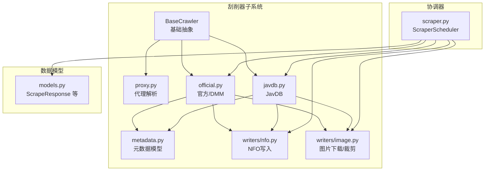
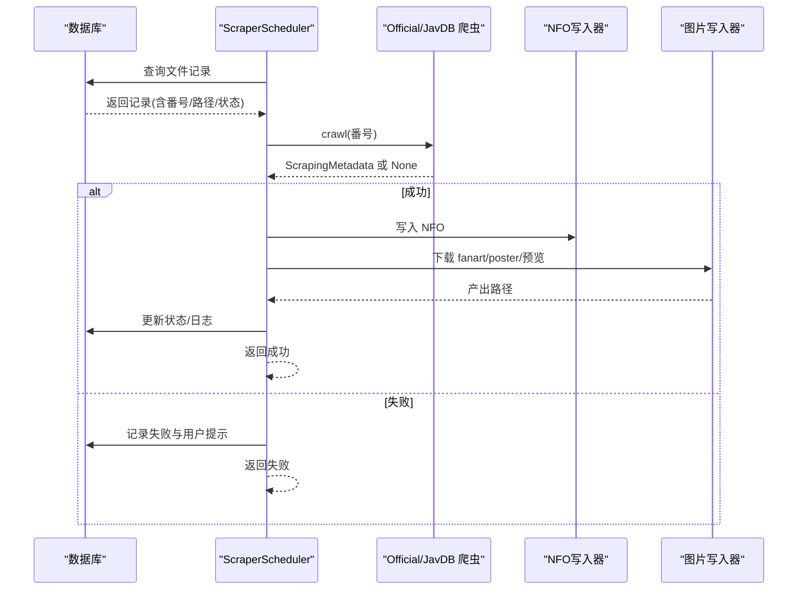
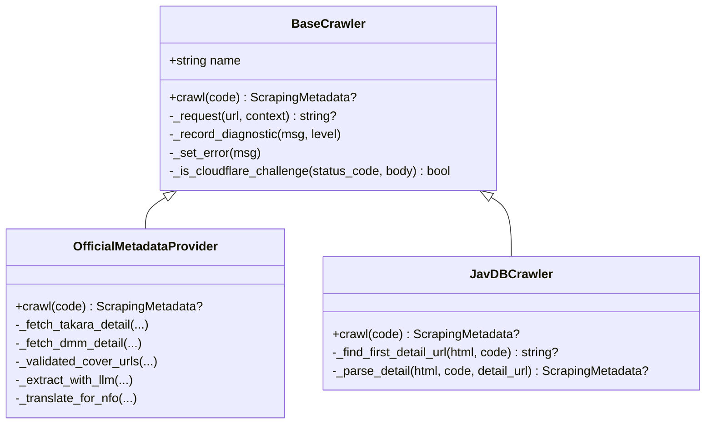
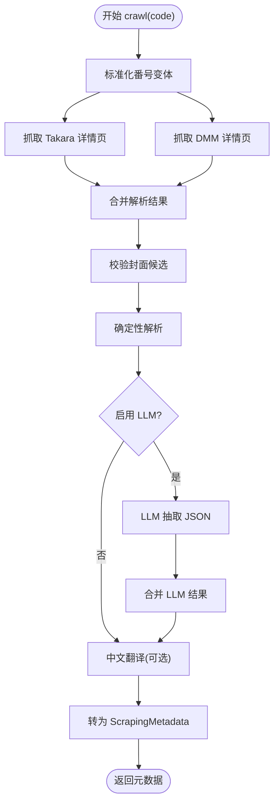
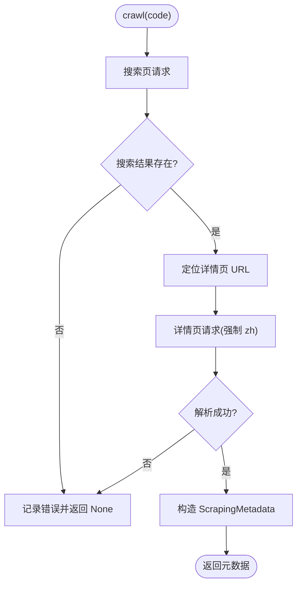
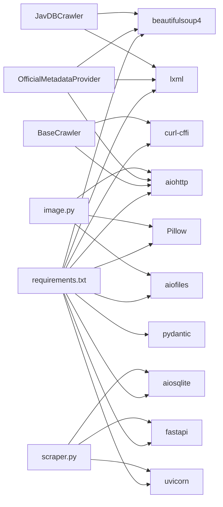

# 刮削器系统

<cite>
**本文引用的文件**
- [app/scrapers/base.py](file://app/scrapers/base.py)
- [app/scrapers/official.py](file://app/scrapers/official.py)
- [app/scrapers/javdb.py](file://app/scrapers/javdb.py)
- [app/scrapers/metadata.py](file://app/scrapers/metadata.py)
- [app/scrapers/proxy.py](file://app/scrapers/proxy.py)
- [app/scrapers/writers/nfo.py](file://app/scrapers/writers/nfo.py)
- [app/scrapers/writers/image.py](file://app/scrapers/writers/image.py)
- [app/scraper.py](file://app/scraper.py)
- [app/models.py](file://app/models.py)
- [requirements.txt](file://requirements.txt)
- [tests/test_scrapers/test_base.py](file://tests/test_scrapers/test_base.py)
- [tests/test_scraper.py](file://tests/test_scraper.py)
</cite>

## 目录
1. [引言](#引言)
2. [项目结构](#项目结构)
3. [核心组件](#核心组件)
4. [架构总览](#架构总览)
5. [详细组件分析](#详细组件分析)
6. [依赖关系分析](#依赖关系分析)
7. [性能与可靠性](#性能与可靠性)
8. [故障排查指南](#故障排查指南)
9. [结论](#结论)
10. [附录：自定义刮削器开发指南](#附录自定义刮削器开发指南)

## 引言
本文件面向开发者与运维人员，系统化阐述 Noctra 刮削器子系统的架构设计、继承体系、扩展机制与实现细节。内容覆盖官方数据源（DMM/Takara）、JavDB 数据源的元数据抓取流程，以及 NFO 写入、图片下载与裁剪、代理配置、错误处理与重试策略。同时提供自定义刮削器开发指南与最佳实践，帮助快速扩展新的数据源。

## 项目结构
- 刮削器子系统位于 app/scrapers，包含：
  - 基类与通用能力：base.py、proxy.py、metadata.py
  - 具体数据源实现：official.py（官方/DMM）、javdb.py（JavDB）
  - 输出写入器：writers/nfo.py、writers/image.py
- 协调器：app/scraper.py，负责数据库交互、进度与日志、NFO 与图片的产出调度
- 数据模型：app/models.py，定义刮削过程中的请求、响应与状态模型
- 依赖：requirements.txt

图表来源
- [app/scrapers/base.py:15-87](file://app/scrapers/base.py#L15-L87)
- [app/scrapers/official.py:67-141](file://app/scrapers/official.py#L67-L141)
- [app/scrapers/javdb.py:14-89](file://app/scrapers/javdb.py#L14-L89)
- [app/scrapers/proxy.py:27-64](file://app/scrapers/proxy.py#L27-L64)
- [app/scrapers/metadata.py:6-60](file://app/scrapers/metadata.py#L6-L60)
- [app/scrapers/writers/nfo.py:12-82](file://app/scrapers/writers/nfo.py#L12-L82)
- [app/scrapers/writers/image.py:60-148](file://app/scrapers/writers/image.py#L60-L148)
- [app/scraper.py:82-410](file://app/scraper.py#L82-L410)
- [app/models.py:176-216](file://app/models.py#L176-L216)

章节来源
- [app/scrapers/base.py:15-87](file://app/scrapers/base.py#L15-L87)
- [app/scrapers/official.py:67-141](file://app/scrapers/official.py#L67-L141)
- [app/scrapers/javdb.py:14-89](file://app/scrapers/javdb.py#L14-L89)
- [app/scrapers/proxy.py:27-64](file://app/scrapers/proxy.py#L27-L64)
- [app/scrapers/metadata.py:6-60](file://app/scrapers/metadata.py#L6-L60)
- [app/scrapers/writers/nfo.py:12-82](file://app/scrapers/writers/nfo.py#L12-L82)
- [app/scrapers/writers/image.py:60-148](file://app/scrapers/writers/image.py#L60-L148)
- [app/scraper.py:82-410](file://app/scraper.py#L82-L410)
- [app/models.py:176-216](file://app/models.py#L176-L216)

## 核心组件
- 基类 BaseCrawler：定义统一的异步抓取接口、HTTP 请求封装、诊断记录、错误记录与 Cloudflare 挑战检测
- 具体实现：
  - OfficialMetadataProvider：官方/DMM 数据源，支持番号标准化、多源页面抓取、确定性解析与可选 LLM 辅助抽取、封面校验与翻译
  - JavDBCrawler：JavDB 数据源，搜索命中详情页、HTML 解析提取元数据
- 输出写入器：
  - NFO 写入：生成 Emby/Kodi 兼容的 XML 元数据文件
  - 图片下载与裁剪：异步下载 fanart/poster/预览图，并从 fanart 裁切 poster
- 协调器 ScraperScheduler：编排单文件刮削全流程，包括数据库查询、状态校验、日志与进度上报、NFO 与图片产出、最终状态落库

章节来源
- [app/scrapers/base.py:52-204](file://app/scrapers/base.py#L52-L204)
- [app/scrapers/official.py:67-141](file://app/scrapers/official.py#L67-L141)
- [app/scrapers/javdb.py:41-89](file://app/scrapers/javdb.py#L41-L89)
- [app/scrapers/writers/nfo.py:12-82](file://app/scrapers/writers/nfo.py#L12-L82)
- [app/scrapers/writers/image.py:60-148](file://app/scrapers/writers/image.py#L60-L148)
- [app/scraper.py:82-410](file://app/scraper.py#L82-L410)

## 架构总览
下图展示从文件记录到最终产出 NFO 与图片的端到端流程，以及各组件间的依赖关系。

图表来源
- [app/scraper.py:163-410](file://app/scraper.py#L163-L410)
- [app/scrapers/official.py:90-141](file://app/scrapers/official.py#L90-L141)
- [app/scrapers/javdb.py:41-89](file://app/scrapers/javdb.py#L41-L89)
- [app/scrapers/writers/nfo.py:12-82](file://app/scrapers/writers/nfo.py#L12-L82)
- [app/scrapers/writers/image.py:74-148](file://app/scrapers/writers/image.py#L74-L148)

## 详细组件分析

### 继承体系与扩展机制
- 抽象接口：所有具体爬虫均继承 BaseCrawler 并实现 crawl(code) 异步方法
- 统一能力：
  - 会话复用与请求封装：_request 封装超时、证书校验关闭、浏览器指纹伪装、固定延迟、代理注入
  - 诊断与错误：_record_diagnostic、_set_error、_display_name、Cloudflare 挑战检测
  - 可插拔代理：get_proxy_for_url 基于环境变量按协议选择代理
- 扩展点：
  - 新增数据源：新建类继承 BaseCrawler，实现 crawl(code)，并在协调器中接入
  - 输出扩展：新增 writers/*.py，按需扩展 NFO 字段或图片处理逻辑

图表来源
- [app/scrapers/base.py:15-87](file://app/scrapers/base.py#L15-L87)
- [app/scrapers/official.py:67-141](file://app/scrapers/official.py#L67-L141)
- [app/scrapers/javdb.py:14-89](file://app/scrapers/javdb.py#L14-L89)

章节来源
- [app/scrapers/base.py:15-87](file://app/scrapers/base.py#L15-L87)
- [app/scrapers/official.py:67-141](file://app/scrapers/official.py#L67-L141)
- [app/scrapers/javdb.py:14-89](file://app/scrapers/javdb.py#L14-L89)

### 官方/DMM 刮削器（OfficialMetadataProvider）
- 功能要点
  - 番号标准化：生成带连字符、纯数字、mono/digital CID 等变体
  - 多源抓取：优先 Takara 详情页，其次 DMM 详情页
  - 确定性解析：BeautifulSoup 提取标题、演员、发行、时长、标签、评分、投票、封面候选
  - LLM 辅助抽取：可选，基于外部响应服务抽取 JSON 并合并置信度
  - 封面校验：HEAD/GET 校验图片 URL，过滤“正在印刷”等无效链接
  - 中文翻译：对可翻译字段进行翻译并应用回元数据
  - 结果转换：映射为 ScrapingMetadata，供 NFO 与图片写入器使用
- 错误与重试
  - 页面请求：固定重试次数与延迟
  - 图片校验：HEAD/GET 双通道与重试
  - 诊断记录：记录 HTTP 状态、Cloudflare 挑战、解析失败等

图表来源
- [app/scrapers/official.py:90-141](file://app/scrapers/official.py#L90-L141)
- [app/scrapers/official.py:143-211](file://app/scrapers/official.py#L143-L211)
- [app/scrapers/official.py:213-282](file://app/scrapers/official.py#L213-L282)
- [app/scrapers/official.py:500-561](file://app/scrapers/official.py#L500-L561)
- [app/scrapers/official.py:563-607](file://app/scrapers/official.py#L563-L607)
- [app/scrapers/official.py:657-685](file://app/scrapers/official.py#L657-L685)

章节来源
- [app/scrapers/official.py:90-141](file://app/scrapers/official.py#L90-L141)
- [app/scrapers/official.py:143-211](file://app/scrapers/official.py#L143-L211)
- [app/scrapers/official.py:213-282](file://app/scrapers/official.py#L213-L282)
- [app/scrapers/official.py:500-561](file://app/scrapers/official.py#L500-L561)
- [app/scrapers/official.py:563-607](file://app/scrapers/official.py#L563-L607)
- [app/scrapers/official.py:657-685](file://app/scrapers/official.py#L657-L685)

### JavDB 刮削器（JavDBCrawler）
- 功能要点
  - 搜索页：按番号搜索，优先精确匹配卡片中的编号，否则回退到标题包含或首个结果
  - 详情页：解析标题、演员、发行、时长、标签、评分、投票、封面与预览图
  - 本地化：详情页强制 zh locale
- 错误与重试
  - _request_with_context 兼容旧签名，内部委托至基类 _request
  - 未命中或解析失败时设置 last_error 并返回 None

图表来源
- [app/scrapers/javdb.py:41-89](file://app/scrapers/javdb.py#L41-L89)
- [app/scrapers/javdb.py:95-102](file://app/scrapers/javdb.py#L95-L102)
- [app/scrapers/javdb.py:113-148](file://app/scrapers/javdb.py#L113-L148)
- [app/scrapers/javdb.py:150-202](file://app/scrapers/javdb.py#L150-L202)

章节来源
- [app/scrapers/javdb.py:41-89](file://app/scrapers/javdb.py#L41-L89)
- [app/scrapers/javdb.py:95-102](file://app/scrapers/javdb.py#L95-L102)
- [app/scrapers/javdb.py:113-148](file://app/scrapers/javdb.py#L113-L148)
- [app/scrapers/javdb.py:150-202](file://app/scrapers/javdb.py#L150-L202)

### 元数据模型（ScrapingMetadata）
- 字段覆盖基础信息、制作信息、媒体资源等
- 提供 to_dict 便于模板渲染与命名规则生成（poster/fanart/preview 文件名）

章节来源
- [app/scrapers/metadata.py:6-60](file://app/scrapers/metadata.py#L6-L60)

### NFO 写入器（writers/nfo.py）
- 生成 Emby/Kodi 兼容的 movie.xml，包含标题、原名、演员、年份、发行日期、时长、评分、投票、标签/流派、工作室/标签、系列、导演、唯一标识、网站、海报/封面、fanart 与预览缩略图
- 特殊处理：plot 使用 CDATA 包裹，避免非法字符；根据文件名后缀推断额外流派（如中字、无码破解）

章节来源
- [app/scrapers/writers/nfo.py:12-82](file://app/scrapers/writers/nfo.py#L12-L82)
- [app/scrapers/writers/nfo.py:97-115](file://app/scrapers/writers/nfo.py#L97-L115)
- [app/scrapers/writers/nfo.py:136-142](file://app/scrapers/writers/nfo.py#L136-L142)

### 图片下载与裁剪（writers/image.py）
- 异步下载：支持代理、超时、分块写入
- 裁剪策略：从横向 DVD 扫描图右侧裁切出正方形海报区域，保证质量与格式
- 进度回调：支持在协调器中上报 fanart 开始/完成、poster 裁剪、预览下载进度

章节来源
- [app/scrapers/writers/image.py:60-72](file://app/scrapers/writers/image.py#L60-L72)
- [app/scrapers/writers/image.py:74-148](file://app/scrapers/writers/image.py#L74-L148)
- [app/scrapers/writers/image.py:151-180](file://app/scrapers/writers/image.py#L151-L180)

### 协调器（ScraperScheduler）
- 流程编排：校验文件状态 → 查询官方/DMM → 写 NFO → 下载图片 → 更新数据库
- 日志与进度：统一事件 emit，持久化到数据库，映射阶段到用户友好提示
- 错误映射：针对不同阶段与来源（官方/DMM、JavDB）给出明确用户提示

章节来源
- [app/scraper.py:82-410](file://app/scraper.py#L82-L410)
- [app/models.py:176-216](file://app/models.py#L176-L216)

## 依赖关系分析
- 运行时依赖：FastAPI、Uvicorn、BeautifulSoup4、lxml、curl-cffi、aiohttp、aiofiles、Pillow、aiosqlite、pydantic
- 组件耦合：
  - BaseCrawler 与 proxy.py 解耦，便于在不同网络环境下灵活配置代理
  - Crawler 与 writers 解耦，便于替换输出格式或扩展图片处理
  - ScraperScheduler 仅依赖 Crawler 接口与 writers 接口，便于扩展新数据源

图表来源
- [requirements.txt:1-12](file://requirements.txt#L1-L12)
- [app/scrapers/base.py:9](file://app/scrapers/base.py#L9)
- [app/scrapers/official.py:10-12](file://app/scrapers/official.py#L10-L12)
- [app/scrapers/javdb.py:8](file://app/scrapers/javdb.py#L8)
- [app/scrapers/writers/image.py:9](file://app/scrapers/writers/image.py#L9)
- [app/scraper.py:3-18](file://app/scraper.py#L3-L18)

章节来源
- [requirements.txt:1-12](file://requirements.txt#L1-L12)
- [app/scrapers/base.py:9](file://app/scrapers/base.py#L9)
- [app/scrapers/official.py:10-12](file://app/scrapers/official.py#L10-L12)
- [app/scrapers/javdb.py:8](file://app/scrapers/javdb.py#L8)
- [app/scrapers/writers/image.py:9](file://app/scrapers/writers/image.py#L9)
- [app/scraper.py:3-18](file://app/scraper.py#L3-L18)

## 性能与可靠性
- 请求与并发
  - 官方/DMM：页面请求采用线程池执行同步 HTTP 请求，避免阻塞事件循环；图片校验与下载使用异步 aiohttp
  - JavDB：统一使用基类 _request，内置固定延迟降低风控风险
- 代理与风控
  - 自动代理：get_proxy_for_url 基于 URL 协议与环境变量选择代理，绕过直连限制
  - 浏览器指纹：curl-cffi 支持 impersonate，减少 Cloudflare 挑战概率
- 错误与重试
  - 页面请求：固定重试次数与延迟
  - 图片校验：HEAD/GET 双通道与重试，过滤无效链接
  - 诊断上限：最多保留最近若干条诊断信息，避免内存膨胀
- 输出稳定性
  - NFO 写入：确保目录存在，使用 CDATA 包裹 plot，兼容 Emby/Kodi
  - 图片下载：分块写入、超时控制、进度回调，失败不影响主流程

[本节为通用性能讨论，无需列出章节来源]

## 故障排查指南
- 常见问题与定位
  - Cloudflare 挑战：基类检测 403 + 特征字符串，记录错误并建议切换网络或配置代理
  - 番号不匹配：官方/DMM 解析到的番号与输入不一致时返回冲突证据
  - 页面解析失败：详情页返回但字段缺失，协调器映射为“页面返回但解析失败”
  - 图片下载失败：fanart/预览下载异常不影响 NFO 写入，poster 回退下载高清封面
- 日志与诊断
  - 爬虫侧：_record_diagnostic/_set_error 记录诊断与错误
  - 协调器侧：emit 统一事件，持久化到数据库，用户消息按阶段映射
- 代理配置
  - 支持 HTTPS_PROXY/https_proxy/ALL_PROXY/all_proxy/HTTP_PROXY/http_proxy 环境变量，自动按 URL 协议选择
  - bypass 环境：若主机命中 bypass 规则，则不使用代理

章节来源
- [app/scrapers/base.py:88-123](file://app/scrapers/base.py#L88-L123)
- [app/scrapers/official.py:131-135](file://app/scrapers/official.py#L131-L135)
- [app/scraper.py:59-79](file://app/scraper.py#L59-L79)
- [app/scraper.py:375-410](file://app/scraper.py#L375-L410)
- [app/scrapers/proxy.py:27-64](file://app/scrapers/proxy.py#L27-L64)

## 结论
本系统以 BaseCrawler 为核心抽象，结合官方/DMM 与 JavDB 两大数据源，形成可扩展、可诊断、可输出的完整刮削流水线。通过代理与指纹伪装降低风控影响，通过 LLM 可选增强抽取能力，通过 NFO 与图片写入器保障媒体中心兼容性。协调器提供统一的日志、进度与状态管理，便于集成到上层任务调度与前端界面。

[本节为总结性内容，无需列出章节来源]

## 附录：自定义刮削器开发指南
- 设计原则
  - 继承 BaseCrawler，实现 crawl(code) 异步方法
  - 在方法内：
    - 清理与标准化输入（如番号）
    - 发起请求（优先使用 _request 或 _fetch_text），记录诊断
    - 解析 HTML/XML，填充 ScrapingMetadata
    - 遇到错误设置 last_error，返回 None
- 代理与风控
  - 使用 get_proxy_for_url 获取代理，必要时在请求 kwargs 注入
  - 适当增加延迟，启用浏览器指纹伪装
- 输出与回写
  - 将元数据写入 NFO（writers/nfo.py）与图片（writers/image.py）
  - 在协调器中注册新数据源，更新进度映射与用户提示
- 最佳实践
  - 保持幂等与可重试：请求与解析分离，失败即早返回
  - 严格边界：对空值、异常编码、非法字符进行防御式处理
  - 明确诊断：每一步都记录上下文信息，便于定位问题
  - 可观测性：充分利用 diagnostics 与 emit，确保日志可追踪

章节来源
- [app/scrapers/base.py:52-204](file://app/scrapers/base.py#L52-L204)
- [app/scrapers/proxy.py:27-64](file://app/scrapers/proxy.py#L27-L64)
- [app/scraper.py:82-410](file://app/scraper.py#L82-L410)
- [tests/test_scrapers/test_base.py:7-10](file://tests/test_scrapers/test_base.py#L7-L10)
- [tests/test_scraper.py:263-291](file://tests/test_scraper.py#L263-L291)