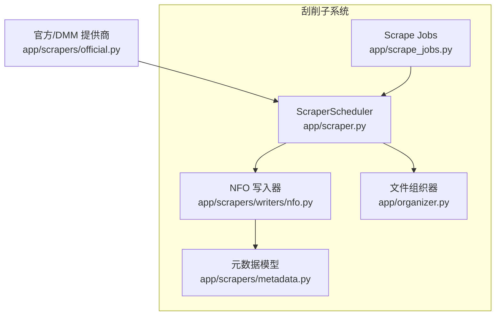
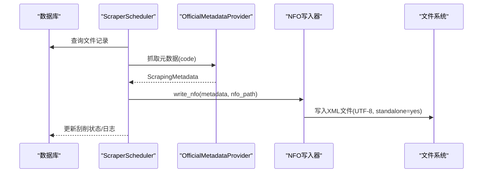
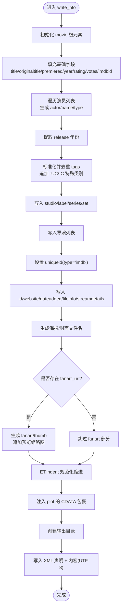
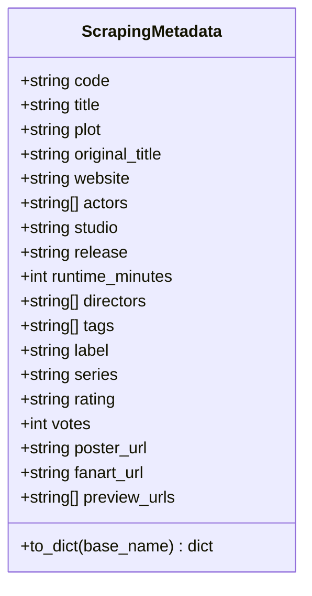
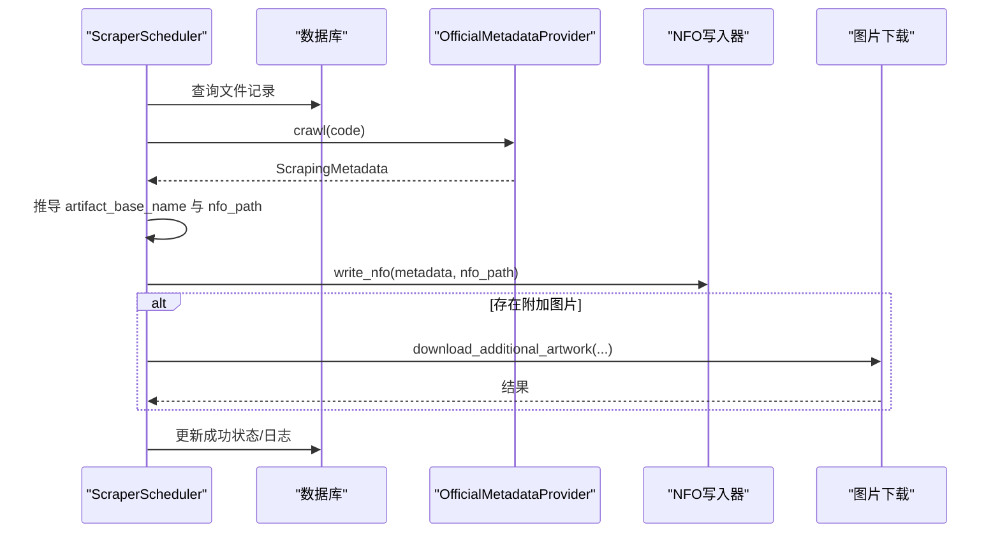
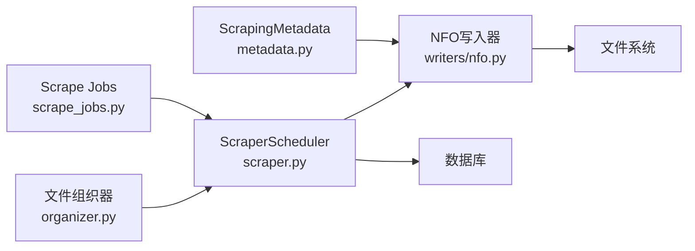

# NFO文件生成器

<cite>
**本文档引用的文件**
- [app/scrapers/writers/nfo.py](file://app/scrapers/writers/nfo.py)
- [app/scrapers/metadata.py](file://app/scrapers/metadata.py)
- [tests/test_scrapers/test_nfo_writer.py](file://tests/test_scrapers/test_nfo_writer.py)
- [tests/test_e2e/test_scraping_flow.py](file://tests/test_e2e/test_scraping_flow.py)
- [app/scraper.py](file://app/scraper.py)
- [app/scrape_jobs.py](file://app/scrape_jobs.py)
- [app/organizer.py](file://app/organizer.py)
</cite>

## 目录
1. [简介](#简介)
2. [项目结构](#项目结构)
3. [核心组件](#核心组件)
4. [架构总览](#架构总览)
5. [详细组件分析](#详细组件分析)
6. [依赖关系分析](#依赖关系分析)
7. [性能考量](#性能考量)
8. [故障排除指南](#故障排除指南)
9. [结论](#结论)
10. [附录](#附录)

## 简介
本文件面向需要理解与扩展NFO文件生成器的技术人员与运维工程师。文档围绕以下目标展开：
- 深入解释XML模板设计原理、字段映射规则与数据转换逻辑
- 详细说明NFO文件的标准格式规范、元数据字段结构与验证机制
- 提供文件写入策略、编码处理与异常恢复机制
- 给出自定义模板开发指南、字段扩展方法与兼容性处理方案
- 说明与不同媒体库系统的集成方式与最佳实践

## 项目结构
NFO生成器位于刮削子系统内，与元数据模型、组织器、调度器协同工作，形成完整的刮削流水线。

图表来源
- [app/scraper.py:82-373](file://app/scraper.py#L82-L373)
- [app/scrape_jobs.py:146-255](file://app/scrape_jobs.py#L146-L255)
- [app/scrapers/writers/nfo.py:12-82](file://app/scrapers/writers/nfo.py#L12-L82)
- [app/scrapers/metadata.py:6-33](file://app/scrapers/metadata.py#L6-L33)
- [app/organizer.py:9-215](file://app/organizer.py#L9-L215)

章节来源
- [app/scraper.py:82-373](file://app/scraper.py#L82-L373)
- [app/scrape_jobs.py:146-255](file://app/scrape_jobs.py#L146-L255)
- [app/scrapers/writers/nfo.py:12-82](file://app/scrapers/writers/nfo.py#L12-L82)
- [app/scrapers/metadata.py:6-33](file://app/scrapers/metadata.py#L6-L33)
- [app/organizer.py:9-215](file://app/organizer.py#L9-L215)

## 核心组件
- NFO写入器：负责将ScrapingMetadata对象渲染为Emby/Kodi兼容的XML，并写入磁盘
- 元数据模型：统一承载刮削得到的字段，支持导出为简单字典以适配模板消费
- 刮削调度器：编排数据库查询、元数据抓取、NFO写入与图片下载流程
- 刮削作业管理：维护作业状态、进度与日志
- 文件组织器：负责文件命名与归档，影响NFO侧写入的文件名与路径

章节来源
- [app/scrapers/writers/nfo.py:12-82](file://app/scrapers/writers/nfo.py#L12-L82)
- [app/scrapers/metadata.py:34-59](file://app/scrapers/metadata.py#L34-L59)
- [app/scraper.py:82-373](file://app/scraper.py#L82-L373)
- [app/scrape_jobs.py:146-255](file://app/scrape_jobs.py#L146-L255)
- [app/organizer.py:9-215](file://app/organizer.py#L9-L215)

## 架构总览
NFO生成器在整体刮削流程中的位置如下：

图表来源
- [app/scraper.py:164-373](file://app/scraper.py#L164-L373)
- [app/scrapers/writers/nfo.py:12-82](file://app/scrapers/writers/nfo.py#L12-L82)

章节来源
- [app/scraper.py:164-373](file://app/scraper.py#L164-L373)
- [app/scrapers/writers/nfo.py:12-82](file://app/scrapers/writers/nfo.py#L12-L82)

## 详细组件分析

### NFO写入器（XML模板与字段映射）
- XML声明与编码
  - 使用固定XML声明，编码为UTF-8，standalone为yes，确保Emby/Kodi兼容
- 根元素与基础字段
  - 根元素为movie；标题与原始标题采用回退策略（title或code，originaltitle优先使用original_title，否则回退）
  - 发行日期与年份：premiered/release均写入；年份字段由完整日期截取前四位
  - 评分与投票数：rating与votes按整型转字符串输出
  - IMDb ID与唯一标识：imdbid与uniqueid(type="imdb")均指向code
- 演员与导演
  - 演员列表逐个生成actor节点，包含name与type="Actor"
  - 导演列表逐个生成director节点
- 类别与标签
  - tags去重并标准化后写入genre与tag
  - 特殊规则：当文件名后缀为-UC或-UC模式时，自动追加中文“中字”、“无码破解”两类额外genre/tag
- 制作信息
  - studio、label、series、set/name（当存在系列时）
- 网站链接与时间戳
  - website与dateadded（当前系统时间）
- 媒体资源与缩略图
  - poster与cover（两者指向同一文件名）
  - fanart/thumb（若存在fanart_url），以及按序号生成的预览缩略图
  - 资源文件名基于输出文件名stem与后缀生成
- 数据转换与安全
  - plot字段使用CDATA包裹，避免特殊字符导致的XML解析问题
  - CDATA边界转义，防止"]]>“破坏CDATA闭合
- 写入策略
  - 输出目录自动创建（parents=True, exist_ok=True）
  - 使用UTF-8编码写入，先写XML声明，再写规范化后的XML内容

图表来源
- [app/scrapers/writers/nfo.py:12-82](file://app/scrapers/writers/nfo.py#L12-L82)
- [app/scrapers/writers/nfo.py:136-142](file://app/scrapers/writers/nfo.py#L136-L142)

章节来源
- [app/scrapers/writers/nfo.py:12-82](file://app/scrapers/writers/nfo.py#L12-L82)
- [app/scrapers/writers/nfo.py:91-115](file://app/scrapers/writers/nfo.py#L91-L115)
- [app/scrapers/writers/nfo.py:118-129](file://app/scrapers/writers/nfo.py#L118-L129)
- [app/scrapers/writers/nfo.py:132-142](file://app/scrapers/writers/nfo.py#L132-L142)

### 元数据模型（ScrapingMetadata）
- 字段覆盖范围
  - 基础信息：code、title、plot、original_title、website
  - 制作信息：actors、studio、release、runtime_minutes、directors、tags、label、series、rating、votes
  - 媒体资源：poster_url、fanart_url、preview_urls
- 辅助方法
  - to_dict：将元数据转换为简单字典，便于模板风格消费；同时计算海报、封面与预览缩略图的文件名占位

图表来源
- [app/scrapers/metadata.py:6-33](file://app/scrapers/metadata.py#L6-L33)
- [app/scrapers/metadata.py:34-59](file://app/scrapers/metadata.py#L34-L59)

章节来源
- [app/scrapers/metadata.py:6-33](file://app/scrapers/metadata.py#L6-L33)
- [app/scrapers/metadata.py:34-59](file://app/scrapers/metadata.py#L34-L59)

### 刮削调度器（流程编排）
- 关键阶段与进度
  - validating/querying_source/fetching_detail/parsing_metadata/writing_nfo/downloading_poster/finalizing
- NFO写入时机
  - 在解析元数据成功后，根据媒体文件路径推导artifact_base_name，生成.nfo文件路径并调用write_nfo
- 错误映射
  - 将不同阶段的异常映射为用户可读提示，如Cloudflare拦截、找不到番号、写入NFO失败等

图表来源
- [app/scraper.py:254-373](file://app/scraper.py#L254-L373)

章节来源
- [app/scraper.py:254-373](file://app/scraper.py#L254-L373)

### 刮削作业管理（状态与进度）
- 作业生命周期
  - queued/running/completed/failed/cancelled
- 进度百分比映射
  - 各阶段对应固定百分比，便于前端展示
- 日志截断
  - 最近日志数量限制，避免内存膨胀

章节来源
- [app/scrape_jobs.py:9-20](file://app/scrape_jobs.py#L9-L20)
- [app/scrape_jobs.py:38-39](file://app/scrape_jobs.py#L38-L39)

### 文件组织器（命名与路径）
- 文件名解析与后缀识别
  - 支持UC/C前缀、字幕/Uncensored关键字识别，统一生成{番号}{后缀}{扩展名}
- 目标路径生成
  - 归档目录结构为/dist/{番号}/{文件名}

章节来源
- [app/organizer.py:18-42](file://app/organizer.py#L18-L42)
- [app/organizer.py:65-96](file://app/organizer.py#L65-L96)

## 依赖关系分析
- 组件耦合
  - NFO写入器依赖ScrapingMetadata模型
  - 刮削调度器依赖NFO写入器与图片下载模块
  - 刮削作业管理独立于具体写入实现，仅关注状态与进度
- 外部依赖
  - XML序列化使用标准库xml.etree.ElementTree
  - 文件系统写入使用pathlib与内置open函数

图表来源
- [app/scrapers/metadata.py:6-33](file://app/scrapers/metadata.py#L6-L33)
- [app/scrapers/writers/nfo.py:12-82](file://app/scrapers/writers/nfo.py#L12-L82)
- [app/scraper.py:82-373](file://app/scraper.py#L82-L373)
- [app/scrape_jobs.py:146-255](file://app/scrape_jobs.py#L146-L255)
- [app/organizer.py:9-215](file://app/organizer.py#L9-L215)

章节来源
- [app/scrapers/metadata.py:6-33](file://app/scrapers/metadata.py#L6-L33)
- [app/scrapers/writers/nfo.py:12-82](file://app/scrapers/writers/nfo.py#L12-L82)
- [app/scraper.py:82-373](file://app/scraper.py#L82-L373)
- [app/scrape_jobs.py:146-255](file://app/scrape_jobs.py#L146-L255)
- [app/organizer.py:9-215](file://app/organizer.py#L9-L215)

## 性能考量
- 写入策略
  - 单次写入：先创建目录，再一次性写入XML声明与内容，减少I/O次数
  - 编码：统一UTF-8，避免跨平台差异
- 内存占用
  - ElementTree在构建XML时按需生成节点，复杂度与字段数量线性相关
- 并发与批处理
  - 刮削作业管理器支持队列化与并发运行多个任务，建议结合外部队列系统进行水平扩展

## 故障排除指南
- 常见问题与定位
  - NFO写入失败：检查输出路径权限、磁盘空间与父目录创建逻辑
  - plot解析异常：确认CDATA包裹与转义逻辑正确
  - Cloudflare拦截：官方提供商会记录诊断信息，建议切换代理或调整请求头
- 日志与诊断
  - 刮削调度器在每个阶段emit事件，包含stage/source/message/progress_percent
  - 作业管理器维护最近日志列表，便于前端展示与排查

章节来源
- [app/scraper.py:102-150](file://app/scraper.py#L102-L150)
- [app/scrape_jobs.py:38-39](file://app/scrape_jobs.py#L38-L39)

## 结论
NFO写入器通过简洁的XML模板与严格的字段映射，实现了与Emby/Kodi生态的高度兼容。配合元数据模型、组织器与调度器，形成了稳定可靠的刮削流水线。通过测试用例与端到端验证，确保了关键字段、编码与文件名生成的正确性。

## 附录

### NFO标准格式规范与字段对照
- 根元素：movie
- 基础字段：outline(lockdata=false)、dateadded、title、originaltitle
- 发行与评分：year、sorttitle、imdbid、premiered、releasedate、runtime、rating、votes、id
- 制作信息：studio、label、series、set/name
- 演员与导演：actor/name/type、director
- 分类与标签：genre、tag（去重与特殊规则）
- 资源与网站：website、poster、cover、fanart/thumb、fileinfo/streamdetails
- 特殊规则：-UC/-C后缀自动追加中文类别

章节来源
- [app/scrapers/writers/nfo.py:18-62](file://app/scrapers/writers/nfo.py#L18-L62)
- [app/scrapers/writers/nfo.py:97-115](file://app/scrapers/writers/nfo.py#L97-L115)

### 自定义模板开发指南
- 基于ScrapingMetadata.to_dict
  - 可直接消费字典形式的元数据，包含海报、封面与预览缩略图占位
- 扩展字段
  - 在ScrapingMetadata中新增字段后，同步更新NFO写入器的映射逻辑
- 兼容性处理
  - 保持空值输出为空元素，避免缺失标签导致解析异常
  - plot始终使用CDATA包裹，保证特殊字符安全

章节来源
- [app/scrapers/metadata.py:34-59](file://app/scrapers/metadata.py#L34-L59)
- [app/scrapers/writers/nfo.py:18-62](file://app/scrapers/writers/nfo.py#L18-L62)
- [app/scrapers/writers/nfo.py:136-142](file://app/scrapers/writers/nfo.py#L136-L142)

### 验证机制与测试要点
- 单元测试覆盖
  - XML声明、根元素、所有核心字段、多演员、空演员、CDATA包裹、空可选字段、父目录创建、-UC/-C特殊类别
- 端到端测试覆盖
  - 完整刮削流程中的NFO生成、XML声明、特殊字符处理、空海报场景、空字段行为

章节来源
- [tests/test_scrapers/test_nfo_writer.py:41-279](file://tests/test_scrapers/test_nfo_writer.py#L41-L279)
- [tests/test_e2e/test_scraping_flow.py:555-762](file://tests/test_e2e/test_scraping_flow.py#L555-L762)

### 与媒体库系统的集成与最佳实践
- Emby/Kodi兼容
  - 使用UTF-8与standalone=yes的XML声明
  - poster与cover指向同一文件名，确保媒体库识别一致
  - set/name用于系列归档，提升浏览体验
- 文件命名一致性
  - 与文件组织器生成的目标路径保持一致，避免路径错配
- 异常与回退
  - NFO生成成功后，图片下载失败不影响NFO可用性；可在后续重试

章节来源
- [app/scrapers/writers/nfo.py:9-9](file://app/scrapers/writers/nfo.py#L9-L9)
- [app/scraper.py:254-373](file://app/scraper.py#L254-L373)
- [app/organizer.py:65-96](file://app/organizer.py#L65-L96)