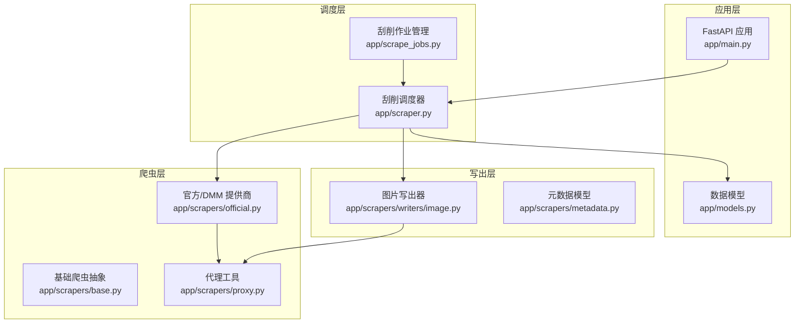
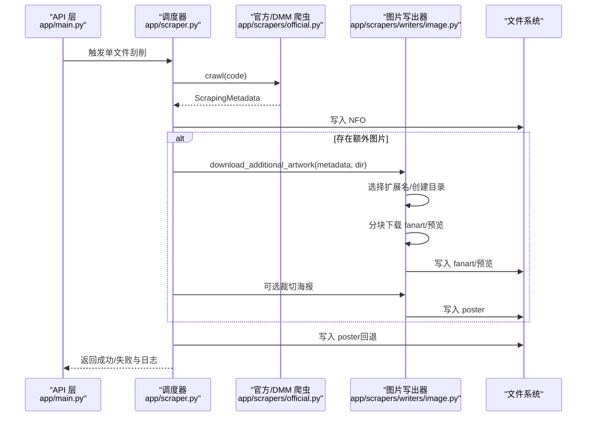
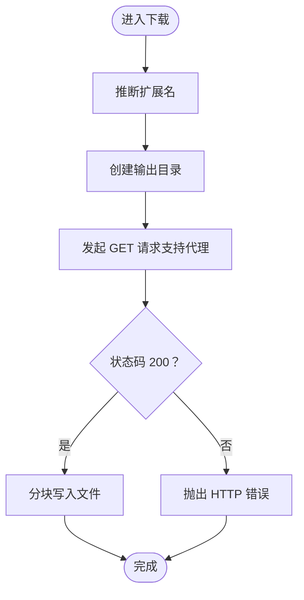
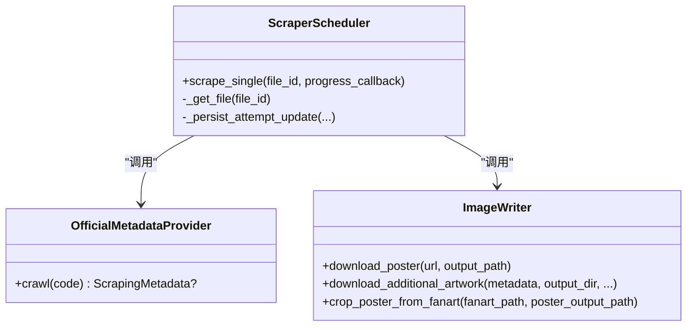
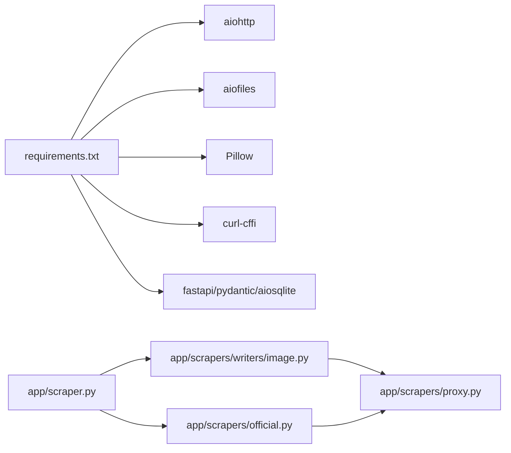

# 图片下载器

<cite>
**本文引用的文件**
- [app/scrapers/writers/image.py](file://app/scrapers/writers/image.py)
- [app/scrapers/base.py](file://app/scrapers/base.py)
- [app/scrapers/metadata.py](file://app/scrapers/metadata.py)
- [app/scrapers/proxy.py](file://app/scrapers/proxy.py)
- [app/scrapers/official.py](file://app/scrapers/official.py)
- [app/scraper.py](file://app/scraper.py)
- [app/scrape_jobs.py](file://app/scrape_jobs.py)
- [app/models.py](file://app/models.py)
- [app/main.py](file://app/main.py)
- [app/storage_diagnostics.py](file://app/storage_diagnostics.py)
- [requirements.txt](file://requirements.txt)
- [tests/test_scrapers/test_image_downloader.py](file://tests/test_scrapers/test_image_downloader.py)
</cite>

## 目录
1. [简介](#简介)
2. [项目结构](#项目结构)
3. [核心组件](#核心组件)
4. [架构总览](#架构总览)
5. [详细组件分析](#详细组件分析)
6. [依赖关系分析](#依赖关系分析)
7. [性能考量](#性能考量)
8. [故障排查指南](#故障排查指南)
9. [结论](#结论)
10. [附录](#附录)

## 简介
本文件为“图片下载器”的综合技术文档，聚焦于图像下载流程、HTTP 请求与响应解析、图片缓存策略、存储路径规划与命名规范、图像格式转换与尺寸调整、并发下载控制、断点续传与错误重试机制、磁盘空间管理与清理策略、性能监控方案，以及自定义下载器开发与第三方服务集成示例。文档基于仓库现有实现进行归纳总结，并提供可视化图示帮助理解。

## 项目结构
本项目采用模块化设计，围绕“刮削与整理”主线组织功能：
- 爬虫层：负责从官方来源抓取元数据，生成 ScrapingMetadata。
- 写出层：负责将元数据写入 NFO，并下载海报、背景图与预览图。
- 任务调度层：负责批量作业的创建、执行与进度追踪。
- 数据模型层：定义数据库表结构与 API 响应模型。
- 主应用层：提供 Web API、扫描与整理入口。

**图表来源**
- [app/main.py:1-1384](file://app/main.py#L1-L1384)
- [app/scraper.py:1-453](file://app/scraper.py#L1-L453)
- [app/scrape_jobs.py:1-256](file://app/scrape_jobs.py#L1-L256)
- [app/scrapers/base.py:1-204](file://app/scrapers/base.py#L1-L204)
- [app/scrapers/official.py:1-1178](file://app/scrapers/official.py#L1-L1178)
- [app/scrapers/proxy.py:1-65](file://app/scrapers/proxy.py#L1-L65)
- [app/scrapers/writers/image.py:1-180](file://app/scrapers/writers/image.py#L1-L180)
- [app/scrapers/metadata.py:1-60](file://app/scrapers/metadata.py#L1-L60)
- [app/models.py:1-216](file://app/models.py#L1-L216)

**章节来源**
- [app/main.py:1-1384](file://app/main.py#L1-L1384)
- [app/scraper.py:1-453](file://app/scraper.py#L1-L453)
- [app/scrape_jobs.py:1-256](file://app/scrape_jobs.py#L1-L256)
- [app/scrapers/base.py:1-204](file://app/scrapers/base.py#L1-L204)
- [app/scrapers/official.py:1-1178](file://app/scrapers/official.py#L1-L1178)
- [app/scrapers/proxy.py:1-65](file://app/scrapers/proxy.py#L1-L65)
- [app/scrapers/writers/image.py:1-180](file://app/scrapers/writers/image.py#L1-L180)
- [app/scrapers/metadata.py:1-60](file://app/scrapers/metadata.py#L1-L60)
- [app/models.py:1-216](file://app/models.py#L1-L216)

## 核心组件
- 图片下载器（异步）：负责下载海报、背景图与预览图，支持代理、分块写入与进度回调。
- 元数据模型：描述影片与图片资源的结构化信息。
- 代理工具：按 URL Scheme 选择 HTTPS/HTTP/ALL_PROXY 环境变量，自动规范化代理地址。
- 官方/DMM 爬虫：从 Takara TV 与 DMM 解析元数据，生成 ScrapingMetadata。
- 刮削调度器：编排“查询元数据 → 写 NFO → 下载图片 → 更新数据库”的全流程。
- 作业管理：支持批量创建、取消、进度推进与最终汇总。
- 数据模型：定义文件记录、刮削日志、作业快照等结构。

**章节来源**
- [app/scrapers/writers/image.py:1-180](file://app/scrapers/writers/image.py#L1-L180)
- [app/scrapers/metadata.py:1-60](file://app/scrapers/metadata.py#L1-L60)
- [app/scrapers/proxy.py:1-65](file://app/scrapers/proxy.py#L1-L65)
- [app/scrapers/official.py:1-1178](file://app/scrapers/official.py#L1-L1178)
- [app/scraper.py:1-453](file://app/scraper.py#L1-L453)
- [app/scrape_jobs.py:1-256](file://app/scrape_jobs.py#L1-L256)
- [app/models.py:1-216](file://app/models.py#L1-L216)

## 架构总览
图片下载器位于“刮削调度器”与“官方/DMM 爬虫”之间，接收 ScrapingMetadata 并输出本地艺术作品文件。其核心流程如下：

**图表来源**
- [app/scraper.py:82-410](file://app/scraper.py#L82-L410)
- [app/scrapers/official.py:90-141](file://app/scrapers/official.py#L90-L141)
- [app/scrapers/writers/image.py:60-148](file://app/scrapers/writers/image.py#L60-L148)

## 详细组件分析

### 组件一：图片下载器（异步）
- 功能要点
  - 使用 aiohttp 异步会话，分块写入，支持代理与宽松 SSL。
  - 自动推断图片扩展名，优先级：URL 后缀（jpg/jpeg/png/webp），否则默认 jpg。
  - 支持进度回调事件：fanart_started、fanart_downloaded、poster_cropped、preview_downloaded。
  - 裁切海报：从横向 fanart 右侧区域裁剪成竖向海报，强制转 RGB，保存为 JPEG（质量 95）。
- 错误处理
  - aiohttp.ClientError/HTTP 错误向上抛出，调用方可捕获并记录。
  - 裁切阶段异常返回 None，不影响整体流程（回退下载高清海报）。
- 并发与性能
  - 单次下载使用独立 ClientSession，避免连接池竞争。
  - 分块大小固定，兼顾内存占用与吞吐。

**图表来源**
- [app/scrapers/writers/image.py:27-57](file://app/scrapers/writers/image.py#L27-L57)
- [app/scrapers/writers/image.py:37-42](file://app/scrapers/writers/image.py#L37-L42)

**章节来源**
- [app/scrapers/writers/image.py:1-180](file://app/scrapers/writers/image.py#L1-L180)
- [tests/test_scrapers/test_image_downloader.py:1-323](file://tests/test_scrapers/test_image_downloader.py#L1-L323)

### 组件二：元数据模型与命名规范
- ScrapingMetadata
  - 字段覆盖基础信息、制作信息与媒体资源（海报、背景图、预览图 URL）。
  - 提供 to_dict(base_name) 以模板风格导出，便于写出层生成文件名。
- 命名规范
  - 艺术作品文件名模式：{基础名}-poster.jpg、{基础名}-fanart.jpg、{基础名}-preview-NN.jpg。
  - 基础名通常取自目标媒体文件名的 stem，保证与媒体文件同目录、同前缀，利于媒体库识别。

**章节来源**
- [app/scrapers/metadata.py:1-60](file://app/scrapers/metadata.py#L1-L60)
- [app/scraper.py:254-266](file://app/scraper.py#L254-L266)

### 组件三：代理与网络请求
- 代理选择
  - 根据 URL Scheme 优先级选择环境变量：HTTPS 优先 HTTPS_PROXY/https_proxy/ALL_PROXY/all_proxy/HTTP_PROXY/http_proxy；HTTP 优先 HTTP_PROXY/http_proxy/ALL_PROXY/all_proxy；其他优先 ALL_PROXY/all_proxy。
  - 自动规范化代理 URL（无协议前缀时补 http://），并绕过代理白名单主机。
- 官方/DMM 爬虫
  - 固定延迟 2 秒，降低风控概率。
  - 多浏览器指纹重试（Chrome/Safari），Cloudflare 挑战时自动切换指纹。
  - 失败时记录诊断信息与用户可读错误消息。

**章节来源**
- [app/scrapers/proxy.py:1-65](file://app/scrapers/proxy.py#L1-L65)
- [app/scrapers/base.py:1-204](file://app/scrapers/base.py#L1-L204)
- [app/scrapers/official.py:167-211](file://app/scrapers/official.py#L167-L211)

### 组件四：刮削调度器与作业管理
- 刮削流程
  - 校验文件状态（processed/organized），读取数据库记录。
  - 调用官方/DMM 爬虫获取 ScrapingMetadata。
  - 写入 NFO，按需下载 fanart/预览并裁切 poster，最后回退下载高清海报。
  - 更新数据库刮削状态、时间戳、日志与错误信息。
- 作业管理
  - 支持创建、运行、取消、进度推进与汇总。
  - 将单文件刮削的进度事件映射为作业级进度百分比。

**图表来源**
- [app/scraper.py:82-410](file://app/scraper.py#L82-L410)
- [app/scrapers/official.py:90-141](file://app/scrapers/official.py#L90-L141)
- [app/scrapers/writers/image.py:60-179](file://app/scrapers/writers/image.py#L60-L179)

**章节来源**
- [app/scraper.py:1-453](file://app/scraper.py#L1-L453)
- [app/scrape_jobs.py:1-256](file://app/scrape_jobs.py#L1-L256)

### 组件五：数据模型与 API
- 数据模型
  - 文件记录、统计摘要、刮削作业快照、批次结果等。
  - 刮削日志包含阶段、来源、消息与进度百分比。
- API
  - 提供扫描、整理、刮削创建与查询等接口。
  - 通过数据库持久化状态与日志，支持前端状态同步。

**章节来源**
- [app/models.py:1-216](file://app/models.py#L1-L216)
- [app/main.py:1-1384](file://app/main.py#L1-L1384)

## 依赖关系分析
- 第三方库
  - aiohttp/aiofiles/Pillow：异步 HTTP、文件写入与图像处理。
  - curl-cffi：官方/DMM 爬虫使用，模拟浏览器指纹。
  - pydantic/fastapi/aiosqlite：数据建模、Web 框架与数据库。
- 组件耦合
  - 刮削调度器依赖官方/DMM 爬虫与图片写出器。
  - 图片写出器依赖代理工具与 PIL。
  - 作业管理与调度器通过回调推进进度。

**图表来源**
- [requirements.txt:1-12](file://requirements.txt#L1-L12)
- [app/scraper.py:1-453](file://app/scraper.py#L1-L453)
- [app/scrapers/official.py:1-1178](file://app/scrapers/official.py#L1-L1178)
- [app/scrapers/writers/image.py:1-180](file://app/scrapers/writers/image.py#L1-L180)
- [app/scrapers/proxy.py:1-65](file://app/scrapers/proxy.py#L1-L65)

**章节来源**
- [requirements.txt:1-12](file://requirements.txt#L1-L12)

## 性能考量
- 异步 I/O 与分块写入
  - 使用 aiohttp.ClientSession 与 aiofiles 分块写入，降低内存峰值，提升吞吐。
- 代理与指纹轮换
  - 官方/DMM 爬虫在 Cloudflare 挑战时自动切换浏览器指纹，提高成功率。
- 并发控制
  - 当前实现为单次下载独立会话；若需并发，建议在上层作业层引入限流与队列。
- 图像处理
  - 裁切与格式转换在内存中完成，注意大图内存占用；可考虑限制最大分辨率或分块处理。

[本节为通用性能建议，无需特定文件引用]

## 故障排查指南
- 常见问题
  - HTTP 403/Cloudflare 挑战：官方/DMM 爬虫会记录诊断并提示切换网络或配置代理。
  - 网络错误：图片下载器抛出 aiohttp.ClientError，检查代理、DNS 与防火墙。
  - 文件写入失败：权限不足或磁盘空间不足，检查输出目录权限与剩余空间。
- 日志与诊断
  - 刮削调度器与官方/DMM 爬虫均维护诊断日志，包含阶段、来源与用户可读消息。
  - 作业管理器记录最近若干条日志，便于前端展示。
- 存储模式诊断
  - 通过存储诊断工具探测是否可原子 rename，辅助判断移动策略与性能。

**章节来源**
- [app/scrapers/base.py:88-123](file://app/scrapers/base.py#L88-L123)
- [app/scraper.py:151-162](file://app/scraper.py#L151-L162)
- [app/scrape_jobs.py:38-57](file://app/scrape_jobs.py#L38-L57)
- [app/storage_diagnostics.py:1-63](file://app/storage_diagnostics.py#L1-L63)

## 结论
本图片下载器以异步 I/O 为核心，结合代理与浏览器指纹轮换策略，实现了稳定可靠的图像下载能力。通过明确的命名规范与裁切策略，确保生成的艺术作品与媒体库兼容。调度器与作业管理提供了可观测性与可控的执行流程。未来可在并发控制、断点续传与缓存策略方面进一步增强。

[本节为总结性内容，无需特定文件引用]

## 附录

### 图片缓存策略与存储路径规划
- 缓存策略
  - 当前实现未内置磁盘缓存；建议在业务层引入基于 URL 的哈希缓存目录，命中则直接复用。
- 存储路径
  - 输出目录与媒体文件同目录，文件名遵循“基础名-类型.扩展名”模式，便于媒体库识别。
- 清理策略
  - 建议定期扫描输出目录，移除与媒体文件无关的历史产物；或在作业完成后仅保留必要文件。

[本节为概念性建议，无需特定文件引用]

### 图像格式转换、尺寸调整与质量优化
- 格式转换
  - 裁切后的海报统一保存为 JPEG（质量 95），必要时转换为 RGB。
- 尺寸调整
  - 当前实现未进行缩放；如需压缩体积，可在写入前按目标分辨率重采样。
- 质量优化
  - JPEG 质量参数固定为 95；可根据场景动态调整或启用 WebP。

**章节来源**
- [app/scrapers/writers/image.py:151-179](file://app/scrapers/writers/image.py#L151-L179)

### 并发下载控制、断点续传与错误重试
- 并发控制
  - 建议在作业层引入信号量限制并发度，避免代理与目标站点限速。
- 断点续传
  - 当前未实现；可基于 Range 请求与本地临时文件实现增量下载。
- 错误重试
  - 图片下载器未内置重试；可在上层包装器中增加指数退避重试。
  - 官方/DMM 爬虫对 Cloudflare 挑战与网络异常有基本重试与指纹切换。

**章节来源**
- [app/scrapers/official.py:197-207](file://app/scrapers/official.py#L197-L207)

### 磁盘空间管理与清理策略
- 空间监控
  - 建议在写入前检查剩余空间阈值，失败即中止以免系统崩溃。
- 清理策略
  - 定期扫描输出目录，删除过期或重复文件；与媒体库索引同步。

[本节为通用实践建议，无需特定文件引用]

### 性能监控方案
- 指标采集
  - 下载耗时、成功率、重试次数、代理命中率、Cloudflare 挑战率。
- 可视化
  - 通过作业日志与前端面板展示进度与错误趋势。

[本节为通用实践建议，无需特定文件引用]

### 自定义下载器开发指南
- 接口约定
  - 输入：ScrapingMetadata、输出目录、基础名、进度回调。
  - 输出：fanart、poster、previews 的路径映射。
- 适配步骤
  - 实现 download_additional_artwork 与 download_poster。
  - 集成代理工具与进度回调。
  - 在调度器中替换图片写出器。

**章节来源**
- [app/scraper.py:285-325](file://app/scraper.py#L285-L325)
- [app/scrapers/writers/image.py:74-148](file://app/scrapers/writers/image.py#L74-L148)

### 第三方服务集成示例
- LLM 元数据抽取与翻译
  - 官方/DMM 爬虫支持通过配置 API Key 与端点进行抽取与翻译，失败时回退确定性解析。
- 代理服务
  - 通过 HTTPS_PROXY/HTTP_PROXY/ALL_PROXY 环境变量接入代理，自动绕过直连域名。

**章节来源**
- [app/scrapers/official.py:500-561](file://app/scrapers/official.py#L500-L561)
- [app/scrapers/proxy.py:27-64](file://app/scrapers/proxy.py#L27-L64)