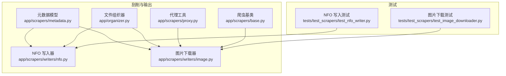
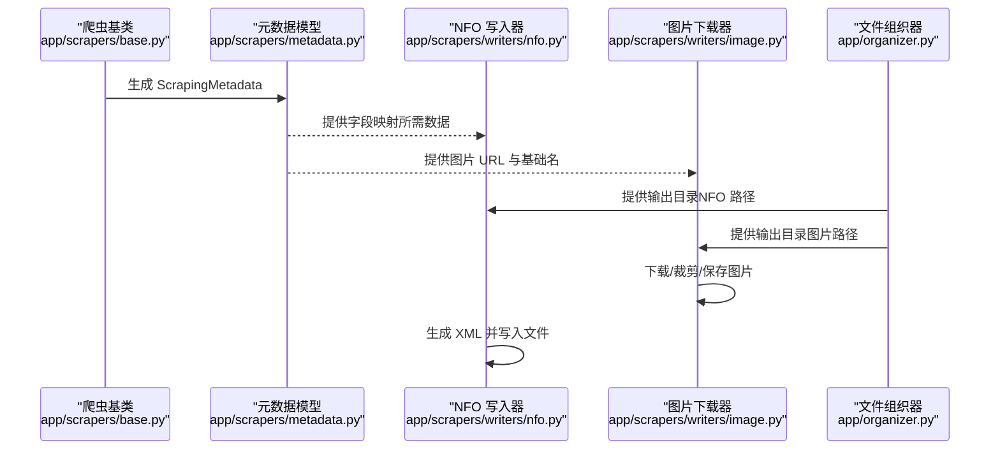
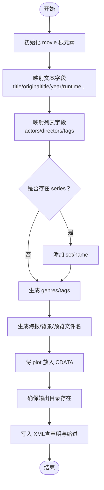
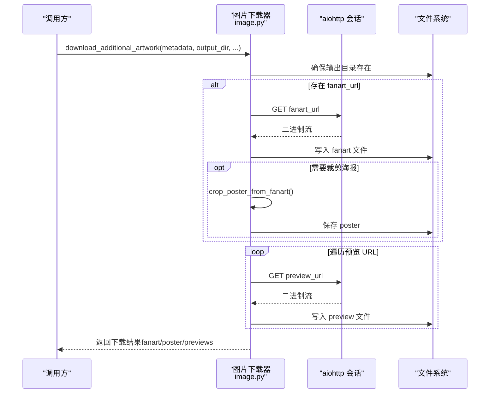
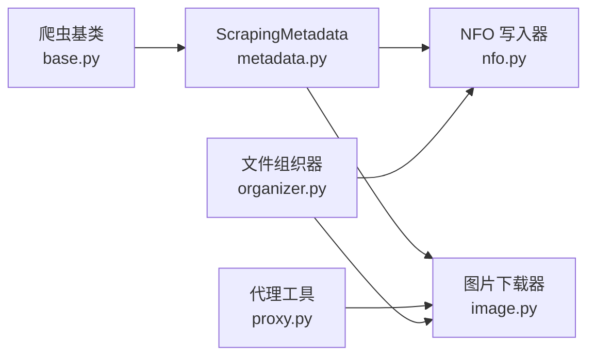

# 输出处理器

<cite>
**本文引用的文件**
- [app/scrapers/writers/nfo.py](file://app/scrapers/writers/nfo.py)
- [app/scrapers/writers/image.py](file://app/scrapers/writers/image.py)
- [app/scrapers/metadata.py](file://app/scrapers/metadata.py)
- [app/organizer.py](file://app/organizer.py)
- [app/scrapers/base.py](file://app/scrapers/base.py)
- [app/scrapers/proxy.py](file://app/scrapers/proxy.py)
- [tests/test_scrapers/test_nfo_writer.py](file://tests/test_scrapers/test_nfo_writer.py)
- [tests/test_scrapers/test_image_downloader.py](file://tests/test_scrapers/test_image_downloader.py)
- [config/profiles/local.env.example](file://config/profiles/local.env.example)
- [config/profiles/nas.env.example](file://config/profiles/nas.env.example)
</cite>

## 目录
1. [简介](#简介)
2. [项目结构](#项目结构)
3. [核心组件](#核心组件)
4. [架构总览](#架构总览)
5. [详细组件分析](#详细组件分析)
6. [依赖关系分析](#依赖关系分析)
7. [性能考量](#性能考量)
8. [故障排查指南](#故障排查指南)
9. [结论](#结论)
10. [附录](#附录)

## 简介
本技术文档聚焦于“输出处理器”，涵盖以下方面：
- NFO 文件生成器的 XML 模板设计、字段映射规则与文件写入策略
- 图片下载器的图像处理流程、缓存机制与存储优化
- 输出文件命名规范、目录结构组织与文件权限管理
- 输出处理器的配置选项、错误处理与重试机制
- 自定义输出处理器开发指南与集成示例

## 项目结构
输出处理器相关代码主要位于 app/scrapers/writers 下，配合元数据模型、组织器与代理工具共同工作；测试覆盖了 NFO 写入与图片下载的关键行为。

图表来源
- [app/scrapers/writers/nfo.py:1-142](file://app/scrapers/writers/nfo.py#L1-L142)
- [app/scrapers/writers/image.py:1-180](file://app/scrapers/writers/image.py#L1-L180)
- [app/scrapers/metadata.py:1-60](file://app/scrapers/metadata.py#L1-L60)
- [app/organizer.py:1-307](file://app/organizer.py#L1-L307)
- [app/scrapers/base.py:1-204](file://app/scrapers/base.py#L1-L204)
- [app/scrapers/proxy.py:1-65](file://app/scrapers/proxy.py#L1-L65)
- [tests/test_scrapers/test_nfo_writer.py:1-280](file://tests/test_scrapers/test_nfo_writer.py#L1-L280)
- [tests/test_scrapers/test_image_downloader.py:1-323](file://tests/test_scrapers/test_image_downloader.py#L1-L323)

章节来源
- [app/scrapers/writers/nfo.py:1-142](file://app/scrapers/writers/nfo.py#L1-L142)
- [app/scrapers/writers/image.py:1-180](file://app/scrapers/writers/image.py#L1-L180)
- [app/scrapers/metadata.py:1-60](file://app/scrapers/metadata.py#L1-L60)
- [app/organizer.py:1-307](file://app/organizer.py#L1-L307)
- [app/scrapers/base.py:1-204](file://app/scrapers/base.py#L1-L204)
- [app/scrapers/proxy.py:1-65](file://app/scrapers/proxy.py#L1-L65)
- [tests/test_scrapers/test_nfo_writer.py:1-280](file://tests/test_scrapers/test_nfo_writer.py#L1-L280)
- [tests/test_scrapers/test_image_downloader.py:1-323](file://tests/test_scrapers/test_image_downloader.py#L1-L323)

## 核心组件
- NFO 写入器：基于元数据生成 Emby/Kodi 兼容的 XML，并安全写入文件系统
- 图片下载器：异步下载海报、背景图与预览图，支持裁剪生成封面
- 元数据模型：统一承载刮削得到的影片信息
- 文件组织器：负责目标路径生成与文件移动（影响输出位置）
- 代理工具：按环境变量自动选择代理，提升网络稳定性
- 爬虫基类：提供请求配置与重试策略，间接影响输出质量

章节来源
- [app/scrapers/writers/nfo.py:12-82](file://app/scrapers/writers/nfo.py#L12-L82)
- [app/scrapers/writers/image.py:60-148](file://app/scrapers/writers/image.py#L60-L148)
- [app/scrapers/metadata.py:6-33](file://app/scrapers/metadata.py#L6-L33)
- [app/organizer.py:85-96](file://app/organizer.py#L85-L96)
- [app/scrapers/proxy.py:27-64](file://app/scrapers/proxy.py#L27-L64)
- [app/scrapers/base.py:124-197](file://app/scrapers/base.py#L124-L197)

## 架构总览
输出处理器在“刮削-组织-输出”链路中的位置如下：

图表来源
- [app/scrapers/base.py:52-62](file://app/scrapers/base.py#L52-L62)
- [app/scrapers/metadata.py:34-59](file://app/scrapers/metadata.py#L34-L59)
- [app/scrapers/writers/nfo.py:12-82](file://app/scrapers/writers/nfo.py#L12-L82)
- [app/scrapers/writers/image.py:74-148](file://app/scrapers/writers/image.py#L74-L148)
- [app/organizer.py:85-96](file://app/organizer.py#L85-L96)

## 详细组件分析

### NFO 文件生成器
- XML 模板设计
  - 根元素为 movie，包含 outline、lockdata、dateadded、title、originaltitle、year、sorttitle、imdbid、premiered、releasedate、runtime、rating、votes、studio、label、series、set/name、director、uniqueid、id、fileinfo、website 等节点
  - 演员以 actor 子元素列表形式输出，每个 actor 包含 name 与 type
  - 类别与标签分别输出 genre 与 tag，去重并保持顺序
  - 若存在系列信息，set 子元素包含 name
  - 唯一标识 uniqueid 设置 type="imdb"
  - fileinfo/streamdetails 用于兼容播放器元数据
- 字段映射规则
  - 标题优先使用 title，否则回退 code
  - 原始标题优先 original_title，否则回退 title 或 code
  - 发行日期 release 的年份取前四位
  - 评分 rating 与投票数 votes 直接映射
  - 演员、导演、标签、剧集等列表逐一映射
  - poster/cover 指向基于基础名生成的海报文件名
  - fanart/thumb 指向基于基础名生成的背景图与预览图文件名
- 文件写入策略
  - 使用 XML 声明 standalone="yes"
  - plot 文本采用 CDATA 包裹，避免特殊字符转义问题
  - 写入前对父目录进行递归创建
  - 使用缩进格式化输出，便于阅读
- 特殊规则
  - 基于基础名后缀推断语义后缀（如 -UC/-C），自动注入“中字/无码破解”等额外类别
  - 基础名由输出路径 stem 决定，确保与组织器生成的目标文件名一致

图表来源
- [app/scrapers/writers/nfo.py:12-82](file://app/scrapers/writers/nfo.py#L12-L82)
- [app/scrapers/writers/nfo.py:97-115](file://app/scrapers/writers/nfo.py#L97-L115)
- [app/scrapers/writers/nfo.py:136-142](file://app/scrapers/writers/nfo.py#L136-L142)

章节来源
- [app/scrapers/writers/nfo.py:12-82](file://app/scrapers/writers/nfo.py#L12-L82)
- [app/scrapers/writers/nfo.py:97-115](file://app/scrapers/writers/nfo.py#L97-L115)
- [app/scrapers/writers/nfo.py:136-142](file://app/scrapers/writers/nfo.py#L136-L142)
- [tests/test_scrapers/test_nfo_writer.py:41-92](file://tests/test_scrapers/test_nfo_writer.py#L41-L92)
- [tests/test_scrapers/test_nfo_writer.py:198-236](file://tests/test_scrapers/test_nfo_writer.py#L198-L236)
- [tests/test_scrapers/test_nfo_writer.py:238-266](file://tests/test_scrapers/test_nfo_writer.py#L238-L266)

### 图片下载器
- 异步下载流程
  - 使用 aiohttp 客户端，禁用 SSL 校验，设置超时与默认浏览器头
  - 支持从环境变量读取代理（HTTPS_PROXY/HTTP_PROXY/ALL_PROXY 等），自动判断 URL 方案
  - 分块写入文件，避免大图内存占用过高
- 图像处理流程
  - fanart 下载完成后，可选地从背景图裁剪出海报区域（右半区），并转换为 RGB/JPEG 保存
  - 预览图按序编号（两位左填充），与元数据中的预览 URL 数量一致
- 缓存与存储优化
  - 通过基础名与 URL 推断扩展名，减少无效请求
  - 目录按需创建，避免重复 IO
  - 裁剪仅在需要时执行，失败不中断整体流程
- 进度回调
  - 提供 fanart_started/fanart_downloaded/poster_cropped/preview_downloaded 等事件，便于 UI 或日志反馈

图表来源
- [app/scrapers/writers/image.py:74-148](file://app/scrapers/writers/image.py#L74-L148)
- [app/scrapers/writers/image.py:151-179](file://app/scrapers/writers/image.py#L151-L179)
- [app/scrapers/proxy.py:27-64](file://app/scrapers/proxy.py#L27-L64)

章节来源
- [app/scrapers/writers/image.py:60-148](file://app/scrapers/writers/image.py#L60-L148)
- [app/scrapers/writers/image.py:151-179](file://app/scrapers/writers/image.py#L151-L179)
- [app/scrapers/proxy.py:27-64](file://app/scrapers/proxy.py#L27-L64)
- [tests/test_scrapers/test_image_downloader.py:197-304](file://tests/test_scrapers/test_image_downloader.py#L197-L304)

### 元数据模型与组织器协作
- 元数据模型提供基础字段与派生字段（如海报/背景/预览文件名），便于写入器与下载器直接消费
- 组织器负责目标路径生成（基于番号与后缀规则），确保 NFO 与图片与媒体文件在同一目录下，便于播放器识别

章节来源
- [app/scrapers/metadata.py:34-59](file://app/scrapers/metadata.py#L34-L59)
- [app/organizer.py:85-96](file://app/organizer.py#L85-L96)

## 依赖关系分析
- 写入器依赖元数据模型提供的字段与派生文件名
- 图片下载器依赖代理工具解析环境变量，同时依赖元数据模型提供的 URL 列表
- 组织器为输出提供目录结构基础，影响 NFO 与图片的相对位置
- 爬虫基类提供请求配置与重试策略，间接影响元数据质量，从而影响输出

图表来源
- [app/scrapers/metadata.py:1-60](file://app/scrapers/metadata.py#L1-L60)
- [app/scrapers/writers/nfo.py:1-142](file://app/scrapers/writers/nfo.py#L1-L142)
- [app/scrapers/writers/image.py:1-180](file://app/scrapers/writers/image.py#L1-L180)
- [app/scrapers/proxy.py:1-65](file://app/scrapers/proxy.py#L1-L65)
- [app/organizer.py:1-307](file://app/organizer.py#L1-L307)
- [app/scrapers/base.py:1-204](file://app/scrapers/base.py#L1-L204)

章节来源
- [app/scrapers/metadata.py:1-60](file://app/scrapers/metadata.py#L1-L60)
- [app/scrapers/writers/nfo.py:1-142](file://app/scrapers/writers/nfo.py#L1-L142)
- [app/scrapers/writers/image.py:1-180](file://app/scrapers/writers/image.py#L1-L180)
- [app/scrapers/proxy.py:1-65](file://app/scrapers/proxy.py#L1-L65)
- [app/organizer.py:1-307](file://app/organizer.py#L1-L307)
- [app/scrapers/base.py:1-204](file://app/scrapers/base.py#L1-L204)

## 性能考量
- 异步 I/O 与分块写入：图片下载采用异步与分块写入，降低内存峰值，提升吞吐
- 目录按需创建：避免重复 mkdir 调用，减少系统调用次数
- 裁剪前置条件：仅在 fanart 尺寸合理时裁剪，避免无效计算
- 代理直连：优先使用环境变量代理，减少网络失败重试成本
- 文件组织：组织器按番号分目录，有利于大规模媒体库的索引与播放器扫描

## 故障排查指南
- NFO 写入失败
  - 检查输出目录权限与磁盘空间
  - 确认基础名与组织器生成的目标路径一致
  - 查看 XML 是否包含正确声明与缩进
- 图片下载失败
  - 检查代理环境变量是否正确（HTTPS_PROXY/HTTP_PROXY/ALL_PROXY）
  - 确认网络可达性与 SSL 配置
  - 如遇 aiohttp.ClientError/ClientResponseError，确认 URL 可访问且状态码正常
- 裁剪失败
  - 检查 fanart 是否为横向布局、尺寸是否足够
  - 确认 Pillow 依赖可用
- 重试与诊断
  - 爬虫基类内置多浏览器指纹与 Cloudflare 挑战检测，可在日志中查看诊断信息

章节来源
- [tests/test_scrapers/test_nfo_writer.py:164-172](file://tests/test_scrapers/test_nfo_writer.py#L164-L172)
- [tests/test_scrapers/test_image_downloader.py:144-195](file://tests/test_scrapers/test_image_downloader.py#L144-L195)
- [app/scrapers/base.py:88-123](file://app/scrapers/base.py#L88-L123)

## 结论
输出处理器通过 NFO 写入器与图片下载器，实现了面向 Emby/Kodi 的元数据与艺术资源输出。其设计强调：
- 明确的字段映射与兼容性（CDATAs、唯一标识、演员/导演/标签）
- 异步与分块的下载策略，以及可选的海报裁剪
- 与组织器协同的目录结构，保证 NFO 与图片与媒体文件同目录
- 基于环境变量的代理与爬虫基类的重试机制，提升稳定性

## 附录

### 输出文件命名规范
- NFO：与媒体文件同名，扩展名为 .nfo
- 海报：{基础名}-poster.jpg
- 背景图：{基础名}-fanart.jpg
- 预览图：{基础名}-preview-{序号两位左填充}.jpg
- 基础名由输出路径 stem 决定，通常与组织器生成的目标文件名一致

章节来源
- [app/scrapers/writers/nfo.py:118-129](file://app/scrapers/writers/nfo.py#L118-L129)
- [app/scrapers/metadata.py:53-58](file://app/scrapers/metadata.py#L53-L58)
- [app/organizer.py:85-96](file://app/organizer.py#L85-L96)

### 目录结构组织
- 目录层级：{DIST_DIR}/{番号}/
- 文件命名：{番号}{后缀}{扩展名}
- 后缀规则：依据文件名中的 UC/C/字幕/Uncensored 等标记推断并标准化

章节来源
- [app/organizer.py:85-96](file://app/organizer.py#L85-L96)
- [app/organizer.py:18-41](file://app/organizer.py#L18-L41)

### 文件权限管理
- 写入前自动创建父目录，确保目标路径存在
- 写入使用 UTF-8 编码，XML 声明为 standalone="yes"
- 图片写入采用二进制模式，分块写入，避免大文件内存压力

章节来源
- [app/scrapers/writers/nfo.py:78-81](file://app/scrapers/writers/nfo.py#L78-L81)
- [app/scrapers/writers/image.py:37-41](file://app/scrapers/writers/image.py#L37-L41)

### 配置选项
- 环境变量
  - HTTPS_PROXY/HTTP_PROXY/ALL_PROXY：网络代理
  - NOCTRA_SOURCE_DIR/NOCTRA_DIST_DIR：源目录与目标目录
  - NOCTRA_DB_PATH：数据库路径
- 示例配置文件
  - 本地示例：config/profiles/local.env.example
  - NAS 示例：config/profiles/nas.env.example

章节来源
- [config/profiles/local.env.example:1-23](file://config/profiles/local.env.example#L1-L23)
- [config/profiles/nas.env.example:1-44](file://config/profiles/nas.env.example#L1-L44)
- [app/scrapers/proxy.py:27-64](file://app/scrapers/proxy.py#L27-L64)

### 错误处理与重试机制
- 网络错误：aiohttp.ClientError/ClientResponseError 会向上抛出
- 文件系统错误：PermissionError/OSError 会向上抛出
- 爬虫重试：多浏览器指纹与 Cloudflare 挑战检测，记录诊断信息
- 最佳实践：在调用方捕获异常并记录日志，必要时进行重试或降级

章节来源
- [tests/test_scrapers/test_image_downloader.py:144-195](file://tests/test_scrapers/test_image_downloader.py#L144-L195)
- [app/scrapers/base.py:124-197](file://app/scrapers/base.py#L124-L197)

### 自定义输出处理器开发指南
- 设计原则
  - 以 ScrapingMetadata 为输入，输出符合目标播放器/索引器规范的文件
  - 保持幂等与可重入，避免重复写入
  - 与组织器约定目录结构，确保 NFO/图片与媒体文件同目录
- 开发步骤
  - 定义输出模板/映射规则（参考 NFO 写入器）
  - 实现异步下载与本地存储（参考图片下载器）
  - 集成代理与错误处理（参考代理工具与爬虫基类）
  - 编写单元测试验证关键场景（参考测试文件）
- 集成示例
  - 在组织器生成目标路径后，调用自定义写入器生成 NFO
  - 在下载完成后，调用自定义图片处理器生成额外资源
  - 通过进度回调或日志记录输出状态

章节来源
- [app/scrapers/metadata.py:34-59](file://app/scrapers/metadata.py#L34-L59)
- [app/organizer.py:85-96](file://app/organizer.py#L85-L96)
- [tests/test_scrapers/test_nfo_writer.py:1-280](file://tests/test_scrapers/test_nfo_writer.py#L1-L280)
- [tests/test_scrapers/test_image_downloader.py:1-323](file://tests/test_scrapers/test_image_downloader.py#L1-L323)