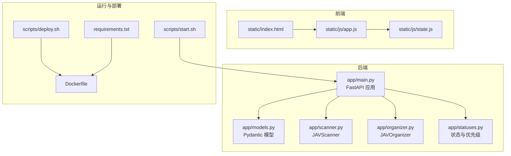
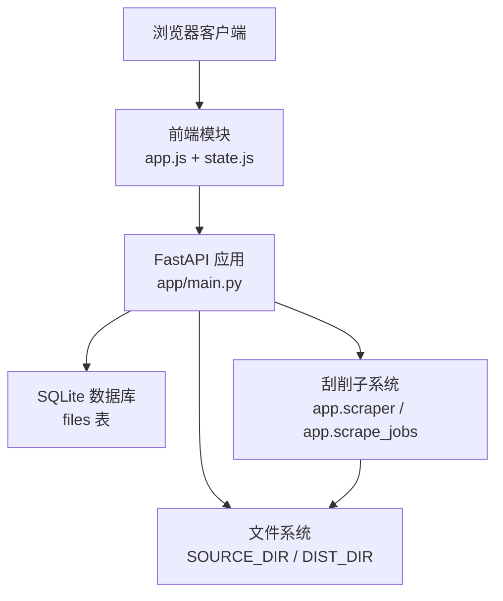
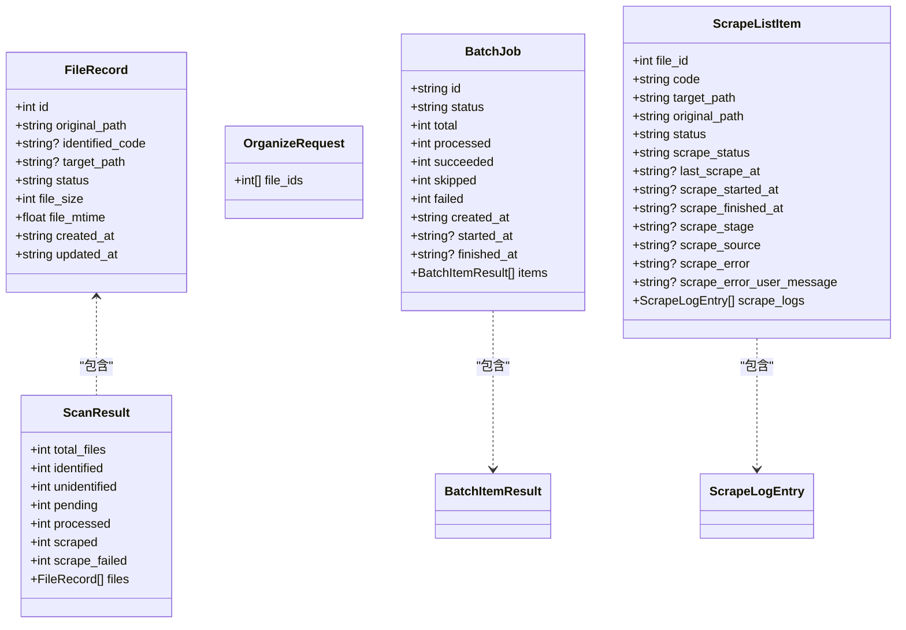
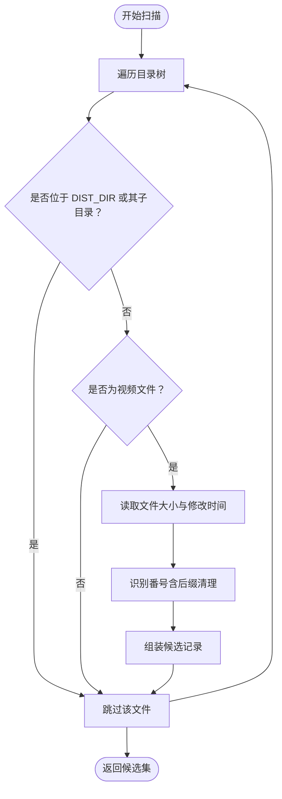
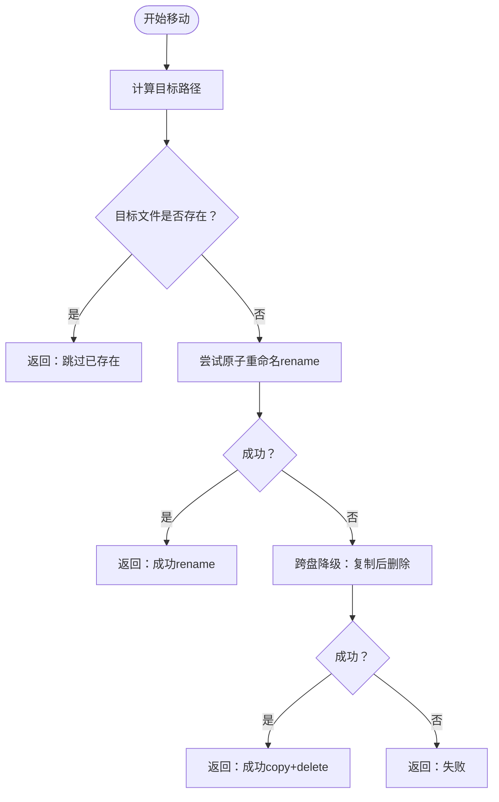
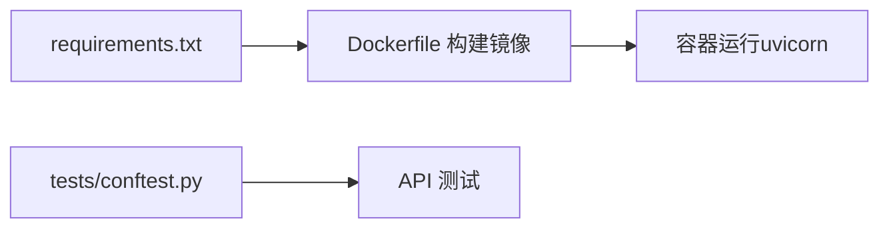

# 开发指南

<cite>
**本文引用的文件**   
- [README.en.md](file://README.en.md)
- [app/main.py](file://app/main.py)
- [app/models.py](file://app/models.py)
- [app/scanner.py](file://app/scanner.py)
- [app/organizer.py](file://app/organizer.py)
- [app/statuses.py](file://app/statuses.py)
- [requirements.txt](file://requirements.txt)
- [Dockerfile](file://Dockerfile)
- [docs/project-overview.md](file://docs/project-overview.md)
- [docs/roadmap-next.md](file://docs/roadmap-next.md)
- [static/js/app.js](file://static/js/app.js)
- [static/js/state.js](file://static/js/state.js)
- [scripts/start.sh](file://scripts/start.sh)
- [scripts/deploy.sh](file://scripts/deploy.sh)
- [tests/conftest.py](file://tests/conftest.py)
</cite>

## 目录
1. [简介](#简介)
2. [项目结构](#项目结构)
3. [核心组件](#核心组件)
4. [架构总览](#架构总览)
5. [详细组件分析](#详细组件分析)
6. [依赖关系分析](#依赖关系分析)
7. [性能考量](#性能考量)
8. [故障排查指南](#故障排查指南)
9. [结论](#结论)
10. [附录](#附录)

## 简介
Noctra 是一个面向本地与 NAS 的 JAV 文件组织工具，强调“先预览、再整理”的可控性。后端采用 FastAPI + SQLite，前端为无构建的静态页面（Alpine.js + 原生模块）。核心流程包括：扫描源目录、识别番号、生成目标路径预览、用户确认后批量整理，并在历史页回看结果。

- 快速开始与典型工作流见项目自述文件
- 本地、Docker、NAS 部署路径均有文档与脚本支撑
- 前端状态与交互通过模块化 JS 组合，状态集中管理

**章节来源**
- [README.en.md:1-87](file://README.en.md#L1-L87)

## 项目结构
仓库采用按职责分层的组织方式：
- app：后端核心逻辑（FastAPI 应用、扫描器、整理器、状态与调度）
- static：前端静态资源（HTML/CSS/JS 模块）
- tests：端到端与单元测试
- scripts：本地启动、停止、部署辅助脚本
- docs：项目概览、路线图、运行与部署说明
- config/profiles：本地与 NAS 环境示例
- migrations：数据库迁移脚本
- requirements.txt：Python 依赖清单

**图表来源**
- [app/main.py:1-1384](file://app/main.py#L1-L1384)
- [app/models.py:1-216](file://app/models.py#L1-L216)
- [app/scanner.py:1-161](file://app/scanner.py#L1-L161)
- [app/organizer.py:1-307](file://app/organizer.py#L1-L307)
- [app/statuses.py:1-154](file://app/statuses.py#L1-L154)
- [static/js/app.js:1-26](file://static/js/app.js#L1-L26)
- [static/js/state.js:1-676](file://static/js/state.js#L1-L676)
- [requirements.txt:1-12](file://requirements.txt#L1-L12)
- [Dockerfile:1-31](file://Dockerfile#L1-L31)
- [scripts/start.sh:1-42](file://scripts/start.sh#L1-L42)
- [scripts/deploy.sh:1-106](file://scripts/deploy.sh#L1-L106)

**章节来源**
- [README.en.md:58-87](file://README.en.md#L58-L87)
- [docs/project-overview.md:1-163](file://docs/project-overview.md#L1-L163)

## 核心组件
- FastAPI 应用与路由：负责健康检查、扫描、整理、刮削相关接口与静态资源挂载
- Pydantic 模型：统一请求/响应与统计数据结构
- JAVScanner：递归扫描、过滤、番号识别与候选集生成
- JAVOrganizer：目标路径生成、文件移动（原子 rename 优先，跨盘降级为 copy+delete）
- 状态与优先级：扫描状态判定、重复项处理、自然序优先级排序
- 前端状态机：扫描页/刮削页、分页、排序、选择、批任务面板、存储诊断等

**章节来源**
- [app/main.py:58-1384](file://app/main.py#L58-L1384)
- [app/models.py:1-216](file://app/models.py#L1-L216)
- [app/scanner.py:8-161](file://app/scanner.py#L8-L161)
- [app/organizer.py:9-307](file://app/organizer.py#L9-L307)
- [app/statuses.py:1-154](file://app/statuses.py#L1-L154)
- [static/js/state.js:1-676](file://static/js/state.js#L1-L676)

## 架构总览
后端以 FastAPI 为中心，围绕 SQLite 存储文件与刮削元数据；前端通过模块化 JS 实现状态驱动的 UI。部署支持本地虚拟环境、Docker 容器与 NAS 镜像模式。

**图表来源**
- [app/main.py:58-1384](file://app/main.py#L58-L1384)
- [static/js/app.js:1-26](file://static/js/app.js#L1-L26)
- [static/js/state.js:1-676](file://static/js/state.js#L1-L676)
- [Dockerfile:1-31](file://Dockerfile#L1-L31)

## 详细组件分析

### 后端应用与数据模型
- 应用初始化：启动事件中创建数据库与索引，缓存存储诊断结果
- 数据库：files 表承载文件元数据与刮削字段；运行时动态补齐字段以兼容旧版本
- 接口职责：扫描、整理、批任务、历史、刮削相关 API（定义于主文件）

**图表来源**
- [app/models.py:1-216](file://app/models.py#L1-L216)

**章节来源**
- [app/main.py:78-1384](file://app/main.py#L78-L1384)
- [app/models.py:1-216](file://app/models.py#L1-L216)

### 扫描器（JAVScanner）
- 功能：递归遍历源目录，过滤 dist 目录与非视频文件，识别番号并返回候选集
- 关键点：正则识别、清理展示性标记、去除尾部 -C/-UC 等后缀；跳过 dist 目录

**图表来源**
- [app/scanner.py:67-125](file://app/scanner.py#L67-L125)

**章节来源**
- [app/scanner.py:8-161](file://app/scanner.py#L8-L161)

### 整理器（JAVOrganizer）
- 功能：生成目标路径、执行移动（rename 原子优先，跨盘降级为 copy+delete）、返回结果
- 关键点：目录名使用纯番号；文件名规范化（-C/-UC），保留语义后缀；严格的目标存在性检查

**图表来源**
- [app/organizer.py:139-162](file://app/organizer.py#L139-L162)

**章节来源**
- [app/organizer.py:9-307](file://app/organizer.py#L9-L307)

### 状态与优先级（statuses）
- 扫描状态：未识别、目标已存在、待处理、重复、已处理、失败、忽略
- 重复项处理：同一番号多候选按后缀优先级、大小、自然序排序，保留最优，其余标记为重复
- 前端映射：内部状态与 UI 文案存在映射（如 skipped -> 未识别）

**章节来源**
- [app/statuses.py:1-154](file://app/statuses.py#L1-L154)

### 前端状态机与交互
- 模块化组合：app.js 将状态、渲染、工具、特性模块合并为应用实例
- 状态机：扫描页/刮削页切换、分页与排序、选择状态、批任务面板、存储诊断提示、NSFW 图像遮罩开关等
- 交互细节：批任务运行态自动展开、终态保留结果、失败项高亮与筛选入口

**章节来源**
- [static/js/app.js:1-26](file://static/js/app.js#L1-L26)
- [static/js/state.js:1-676](file://static/js/state.js#L1-L676)

### 刮削能力预留与演进
- 数据层预留：scrape_status、last_scrape_at、scrape_stage、scrape_source、scrape_error 等字段
- UI 层预留：历史页保留记录列表定位，状态 badge 支持“刮削中/已刮削/刮削失败”
- 交互层预留：批处理 rail 思想可复用于刮削任务

**章节来源**
- [app/main.py:101-125](file://app/main.py#L101-L125)
- [docs/roadmap-next.md:64-91](file://docs/roadmap-next.md#L64-L91)

## 依赖关系分析
- 运行时依赖：FastAPI、uvicorn、aiosqlite、Pydantic、BeautifulSoup4、lxml、curl-cffi、aiohttp、aiofiles、Pillow
- 镜像构建：Dockerfile 使用 slim 基础镜像，按需设置 pip 源参数，安装 requirements.txt 并暴露 8000 端口
- 测试隔离：通过 conftest 对第三方依赖进行 stub，避免导入错误影响 API 测试

**图表来源**
- [requirements.txt:1-12](file://requirements.txt#L1-L12)
- [Dockerfile:1-31](file://Dockerfile#L1-L31)
- [tests/conftest.py:1-20](file://tests/conftest.py#L1-L20)

**章节来源**
- [requirements.txt:1-12](file://requirements.txt#L1-L12)
- [Dockerfile:1-31](file://Dockerfile#L1-L31)
- [tests/conftest.py:1-20](file://tests/conftest.py#L1-L20)

## 性能考量
- I/O 行为
  - 整理阶段优先使用 os.replace（原子重命名），在跨盘场景降级为复制后删除，确保数据一致性
  - 复制后显式 fsync 提升落盘可靠性
- 扫描与排序
  - 扫描使用 os.walk 递归，跳过 dist 目录与非视频扩展名
  - 同番号候选按后缀优先级、文件大小、自然序排序，减少人工筛选成本
- 数据库
  - 运行时动态补齐刮削相关字段，避免手工迁移
  - 为 scrape_status 建立索引，提升查询效率
- 前端
  - 分页与排序在前端完成，结合缓存与状态机降低重复渲染

**章节来源**
- [app/organizer.py:98-162](file://app/organizer.py#L98-L162)
- [app/scanner.py:67-125](file://app/scanner.py#L67-L125)
- [app/statuses.py:62-104](file://app/statuses.py#L62-L104)
- [app/main.py:101-125](file://app/main.py#L101-L125)
- [static/js/state.js:588-668](file://static/js/state.js#L588-L668)

## 故障排查指南
- 启动与健康检查
  - 本地启动脚本会打印配置并等待健康检查，失败时输出最后 20 行日志
- 存储诊断
  - 前端状态提供“当前模式：快速移动/复制后删除”的提示，帮助判断是否跨盘
- 常见问题定位
  - 目标文件已存在：整理阶段会跳过，检查 dist 目录是否已有同名文件
  - 跨盘移动失败：检查源/目标挂载方式，确认 rename 是否可用
  - 刮削失败：查看 scrape_logs 与 user_message，结合最近日志定位阶段与来源

**章节来源**
- [scripts/start.sh:14-41](file://scripts/start.sh#L14-L41)
- [static/js/state.js:106-119](file://static/js/state.js#L106-L119)
- [app/main.py:242-259](file://app/main.py#L242-L259)

## 结论
Noctra 以清晰的前后端分层、可追溯的数据库模型与可控的整理流程为核心，兼顾本地与 NAS 场景。当前重点在于稳定扫描-整理闭环与历史页收口，后续将基于现有骨架平滑接入刮削能力。建议在开发过程中遵循环境配置与代码解耦原则，持续完善批任务反馈与失败重试路径。

[无需章节来源：本节为总结性内容]

## 附录

### 开发环境搭建
- 本地
  - 创建虚拟环境并安装依赖
  - 运行启动脚本，默认绑定地址与端口由环境变量控制
- Docker
  - 使用 Dockerfile 构建镜像，容器内以 uvicorn 运行应用
  - 通过卷挂载 source/dist/db，映射端口至宿主机
- NAS
  - 使用部署脚本同步代码与配置，支持 docker/docker-image 两种部署模式

**章节来源**
- [README.en.md:16-47](file://README.en.md#L16-L47)
- [scripts/start.sh:12-31](file://scripts/start.sh#L12-L31)
- [Dockerfile:1-31](file://Dockerfile#L1-L31)
- [scripts/deploy.sh:69-102](file://scripts/deploy.sh#L69-L102)

### 编程规范与最佳实践
- 后端
  - 使用 Pydantic 校验请求/响应，保持接口契约稳定
  - 异步数据库访问，避免阻塞；必要时使用线程池执行耗时操作
  - 通过 conftest 对第三方依赖进行 stub，保证测试稳定性
- 前端
  - 模块化组织状态、渲染、工具与特性，避免全局状态污染
  - 交互以状态驱动，批任务面板保持终态可见，失败项高亮便于继续处理
- 部署
  - 环境差异仅通过 profile/env 注入，不硬编码进代码
  - 本地默认端口为 4020，避免与历史端口混淆

**章节来源**
- [tests/conftest.py:1-20](file://tests/conftest.py#L1-L20)
- [static/js/app.js:1-26](file://static/js/app.js#L1-L26)
- [static/js/state.js:313-388](file://static/js/state.js#L313-L388)
- [docs/project-overview.md:52-59](file://docs/project-overview.md#L52-L59)

### 贡献流程与发布管理
- 贡献流程
  - 新功能/修复提交前先运行本地测试与脚本验证
  - 保持环境差异通过 profile/env 注入，避免代码改动
- 代码审查
  - 关注状态与优先级逻辑的一致性、批任务面板的反馈完整性
  - 刮削能力开发需遵循数据/UI/交互层预留约定
- 发布管理
  - Docker 镜像构建与发布由 CI/CD 流水线负责（参考工作流文件）
  - NAS 部署采用 docker-image 模式配合 Watchtower 自动更新

**章节来源**
- [docs/roadmap-next.md:30-44](file://docs/roadmap-next.md#L30-L44)
- [.github/workflows/docker-publish.yml](file://.github/workflows/docker-publish.yml)

### 路线图与优先级
- 短期（P0）
  - 历史页布局收口、批处理失败反馈优化、失败重试能力
- 中期
  - 刮削能力数据结构预留与 UI 入口设计
- 长期
  - 历史检索、高级筛选、批任务持久化与历史列表等增强

**章节来源**
- [docs/roadmap-next.md:1-122](file://docs/roadmap-next.md#L1-L122)