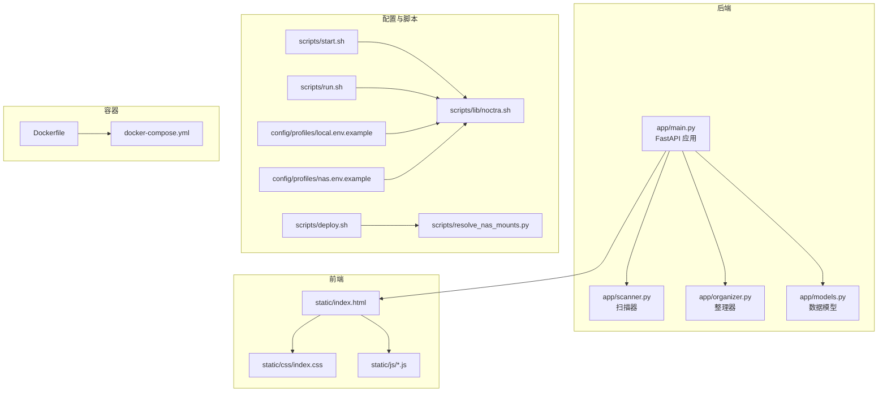
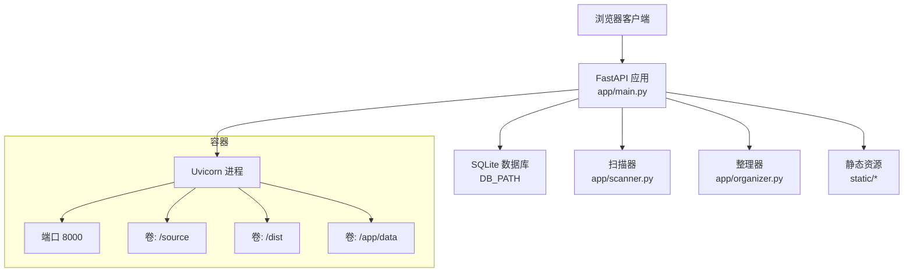
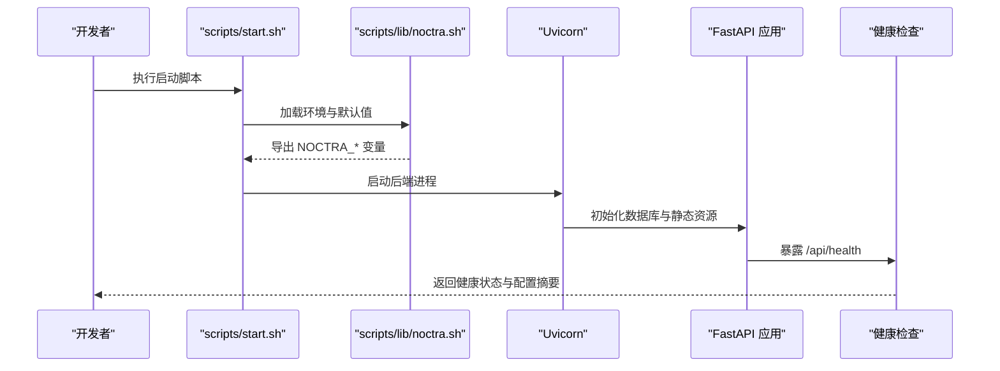
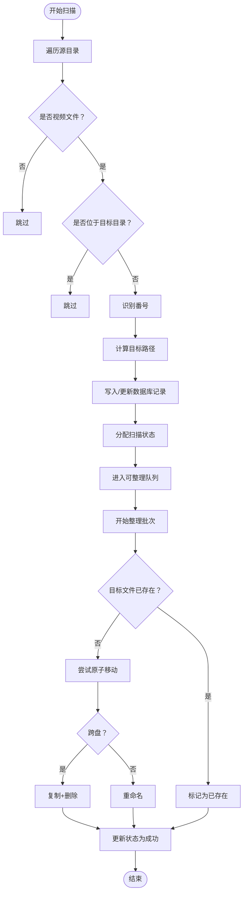
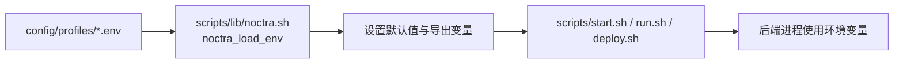
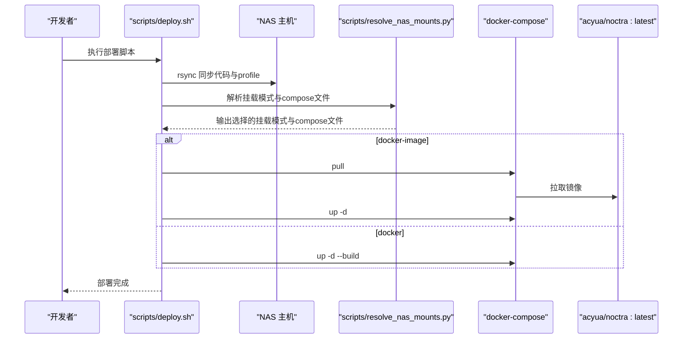
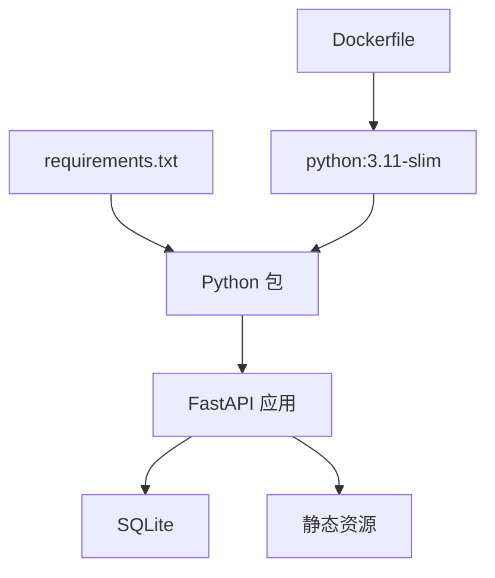

# 快速开始

<cite>
**本文引用的文件**
- [README.en.md](file://README.en.md)
- [requirements.txt](file://requirements.txt)
- [Dockerfile](file://Dockerfile)
- [docker-compose.yml](file://docker-compose.yml)
- [config/profiles/local.env.example](file://config/profiles/local.env.example)
- [config/profiles/nas.env.example](file://config/profiles/nas.env.example)
- [scripts/start.sh](file://scripts/start.sh)
- [scripts/start-local.sh](file://scripts/start-local.sh)
- [scripts/run.sh](file://scripts/run.sh)
- [scripts/lib/noctra.sh](file://scripts/lib/noctra.sh)
- [scripts/deploy.sh](file://scripts/deploy.sh)
- [scripts/resolve_nas_mounts.py](file://scripts/resolve_nas_mounts.py)
- [docs/local-startup.md](file://docs/local-startup.md)
- [docs/nas-deployment.md](file://docs/nas-deployment.md)
- [app/main.py](file://app/main.py)
- [app/models.py](file://app/models.py)
- [app/scanner.py](file://app/scanner.py)
- [app/organizer.py](file://app/organizer.py)
</cite>

## 目录
1. [简介](#简介)
2. [项目结构](#项目结构)
3. [核心组件](#核心组件)
4. [架构总览](#架构总览)
5. [详细组件分析](#详细组件分析)
6. [依赖关系分析](#依赖关系分析)
7. [性能与资源建议](#性能与资源建议)
8. [常见问题与故障排除](#常见问题与故障排除)
9. [结论](#结论)
10. [附录](#附录)

## 简介
Noctra 是一个专注于本地与NAS的JAV文件整理工具。其核心能力包括：递归扫描源目录、自动识别番号、预览目标路径、确认后才移动文件，并以FastAPI + SQLite提供后端服务，前端采用无构建的静态页面（Alpine.js + 原生JS模块）。支持本地开发、Docker运行以及NAS部署三种方式。

## 项目结构
- 后端：app/（FastAPI应用、扫描器、整理器、模型定义等）
- 前端：static/（HTML/CSS/JS静态资源）
- 配置：config/profiles/（本地与NAS环境变量模板）
- 部署与脚本：scripts/（启动、停止、部署、状态查询等）
- 文档：docs/（本地启动、NAS部署、运行工作流等）
- 依赖：requirements.txt（Python包清单）
- 容器：Dockerfile、docker-compose.yml（镜像构建与编排）

**图表来源**
- [app/main.py:58-76](file://app/main.py#L58-L76)
- [app/scanner.py:8-16](file://app/scanner.py#L8-L16)
- [app/organizer.py:9-17](file://app/organizer.py#L9-L17)
- [app/models.py:7-27](file://app/models.py#L7-L27)
- [scripts/start.sh:9-26](file://scripts/start.sh#L9-L26)
- [scripts/run.sh:9-20](file://scripts/run.sh#L9-L20)
- [scripts/lib/noctra.sh:13-73](file://scripts/lib/noctra.sh#L13-L73)
- [scripts/deploy.sh:49-102](file://scripts/deploy.sh#L49-L102)
- [scripts/resolve_nas_mounts.py:15-38](file://scripts/resolve_nas_mounts.py#L15-L38)
- [Dockerfile:1-31](file://Dockerfile#L1-L31)
- [docker-compose.yml:1-28](file://docker-compose.yml#L1-L28)
- [config/profiles/local.env.example:1-23](file://config/profiles/local.env.example#L1-L23)
- [config/profiles/nas.env.example:1-44](file://config/profiles/nas.env.example#L1-L44)

**章节来源**
- [README.en.md:58-72](file://README.en.md#L58-L72)
- [Dockerfile:1-31](file://Dockerfile#L1-L31)
- [docker-compose.yml:1-28](file://docker-compose.yml#L1-L28)

## 核心组件
- FastAPI后端：负责API路由、数据库初始化、扫描与整理任务调度、静态资源挂载。
- 扫描器（JAVScanner）：递归扫描源目录，识别番号，过滤非视频与目标目录，输出候选文件列表。
- 整理器（JAVOrganizer）：计算目标路径、执行原子移动或跨盘复制+删除，保证数据一致性。
- 数据模型（Pydantic）：定义文件记录、扫描结果、批量作业、刮削日志等结构。
- 配置与脚本：通过环境变量与profile文件控制源/目标/数据目录、端口、代理、LLM参数等；提供本地启动、后台运行、状态查询、停止、NAS部署等脚本。

**章节来源**
- [app/main.py:58-76](file://app/main.py#L58-L76)
- [app/scanner.py:67-125](file://app/scanner.py#L67-L125)
- [app/organizer.py:85-163](file://app/organizer.py#L85-L163)
- [app/models.py:7-27](file://app/models.py#L7-L27)
- [scripts/lib/noctra.sh:13-73](file://scripts/lib/noctra.sh#L13-L73)

## 架构总览
后端通过Uvicorn运行在指定主机与端口，前端静态页面由FastAPI挂载提供。扫描与整理流程围绕SQLite数据库进行状态管理与持久化。Docker模式下通过Compose暴露端口并挂载卷，NAS部署支持镜像拉取与Watchtower自动更新。

**图表来源**
- [app/main.py:58-76](file://app/main.py#L58-L76)
- [app/main.py:78-99](file://app/main.py#L78-L99)
- [Dockerfile:26-30](file://Dockerfile#L26-L30)
- [docker-compose.yml:10-16](file://docker-compose.yml#L10-L16)

## 详细组件分析

### 后端启动与健康检查
- 本地启动：脚本加载profile，打印配置，后台启动Uvicorn，等待健康检查URL可达。
- 健康检查：通过/api/health返回当前profile与路径信息，便于快速验证。
- 环境变量：后端读取SOURCE_DIR、DIST_DIR、DB_PATH等，作为扫描与整理的根路径。

**图表来源**
- [scripts/start.sh:9-31](file://scripts/start.sh#L9-L31)
- [scripts/lib/noctra.sh:13-73](file://scripts/lib/noctra.sh#L13-L73)
- [app/main.py:127-131](file://app/main.py#L127-L131)

**章节来源**
- [scripts/start.sh:9-42](file://scripts/start.sh#L9-L42)
- [scripts/lib/noctra.sh:75-96](file://scripts/lib/noctra.sh#L75-L96)
- [app/main.py:127-131](file://app/main.py#L127-L131)
- [README.en.md:74-79](file://README.en.md#L74-L79)

### 扫描与整理流程
- 扫描：遍历SOURCE_DIR，过滤非视频与目标目录，识别番号，计算目标路径，写入数据库并分配初始状态。
- 整理：按批次执行，先尝试原子移动，跨盘时降级为复制+删除，更新状态并标记重复项为目标已存在。

**图表来源**
- [app/scanner.py:67-125](file://app/scanner.py#L67-L125)
- [app/main.py:740-808](file://app/main.py#L740-L808)
- [app/organizer.py:139-163](file://app/organizer.py#L139-L163)

**章节来源**
- [app/scanner.py:67-125](file://app/scanner.py#L67-L125)
- [app/main.py:740-808](file://app/main.py#L740-L808)
- [app/organizer.py:139-163](file://app/organizer.py#L139-L163)

### 配置文件与环境变量
- 本地profile：local.env.example，定义绑定主机、端口、源/目标/数据目录、可选LLM参数等。
- NAS profile：nas.env.example，定义NAS挂载点、远程部署目标、镜像与代理、Watchtower计划等。
- 脚本加载：lib/noctra.sh按顺序加载profile文件、设置默认值、创建必要目录、导出变量。

**图表来源**
- [config/profiles/local.env.example:1-23](file://config/profiles/local.env.example#L1-L23)
- [config/profiles/nas.env.example:1-44](file://config/profiles/nas.env.example#L1-L44)
- [scripts/lib/noctra.sh:13-73](file://scripts/lib/noctra.sh#L13-L73)

**章节来源**
- [config/profiles/local.env.example:1-23](file://config/profiles/local.env.example#L1-L23)
- [config/profiles/nas.env.example:1-44](file://config/profiles/nas.env.example#L1-L44)
- [scripts/lib/noctra.sh:13-73](file://scripts/lib/noctra.sh#L13-L73)

### Docker与NAS部署
- Dockerfile：复制依赖、安装、创建工作目录、暴露端口、设置CMD。
- docker-compose.yml：构建或拉取镜像、映射端口与卷、注入环境变量（含代理与LLM相关）。
- NAS部署：deploy.sh在本机同步代码与profile，远端解析挂载模式（auto/separate/shared-root），选择docker/docker-image模式启动，并可启用Watchtower自动更新。

**图表来源**
- [scripts/deploy.sh:49-102](file://scripts/deploy.sh#L49-L102)
- [scripts/resolve_nas_mounts.py:15-38](file://scripts/resolve_nas_mounts.py#L15-L38)
- [Dockerfile:12-18](file://Dockerfile#L12-L18)
- [docker-compose.yml:3-8](file://docker-compose.yml#L3-L8)

**章节来源**
- [Dockerfile:1-31](file://Dockerfile#L1-L31)
- [docker-compose.yml:1-28](file://docker-compose.yml#L1-L28)
- [scripts/deploy.sh:1-106](file://scripts/deploy.sh#L1-L106)
- [scripts/resolve_nas_mounts.py:1-43](file://scripts/resolve_nas_mounts.py#L1-L43)
- [docs/nas-deployment.md:1-125](file://docs/nas-deployment.md#L1-L125)

## 依赖关系分析
- 后端依赖：FastAPI、Uvicorn、aiosqlite、BeautifulSoup4、lxml、aiohttp、aiofiles、Pillow等。
- 容器构建：基于python:3.11-slim，支持自定义pip索引与可信主机。
- 前端：无构建，直接由FastAPI挂载静态资源。

**图表来源**
- [requirements.txt:1-12](file://requirements.txt#L1-L12)
- [Dockerfile:1-31](file://Dockerfile#L1-L31)
- [app/main.py:58-76](file://app/main.py#L58-L76)

**章节来源**
- [requirements.txt:1-12](file://requirements.txt#L1-L12)
- [Dockerfile:1-31](file://Dockerfile#L1-L31)

## 性能与资源建议
- I/O优化：优先在同一文件系统内进行原子重命名，减少跨盘复制带来的延迟与风险。
- 并发与批处理：整理过程按批次执行，合理设置批次大小以平衡吞吐与稳定性。
- 存储诊断：后端启动时进行存储诊断，帮助识别移动模式与潜在性能瓶颈。
- 代理与网络：NAS部署时为Docker daemon配置代理，确保镜像拉取稳定。

**章节来源**
- [app/organizer.py:122-138](file://app/organizer.py#L122-L138)
- [app/main.py:133-139](file://app/main.py#L133-L139)
- [docs/nas-deployment.md:83-112](file://docs/nas-deployment.md#L83-L112)

## 常见问题与故障排除
- 启动失败或无法访问
  - 使用健康检查接口确认后端状态与配置是否正确。
  - 查看启动日志，确认端口占用与权限问题。
- 番号识别异常
  - 检查文件名是否符合识别规则，清理特殊标记后重试。
- 目标文件已存在
  - 整理时若目标文件已存在会跳过，需清理或调整目标目录。
- 跨盘移动失败
  - 自动降级为复制+删除，若失败请检查磁盘空间与权限。
- NAS部署镜像拉取失败
  - 为Docker daemon配置HTTP/HTTPS代理，确保可访问Docker Hub。
- Watchtower未更新
  - 检查Watchtower计划表达式与代理配置，确认镜像标签策略。

**章节来源**
- [README.en.md:74-79](file://README.en.md#L74-L79)
- [app/scanner.py:32-65](file://app/scanner.py#L32-L65)
- [app/organizer.py:155-158](file://app/organizer.py#L155-L158)
- [docs/nas-deployment.md:83-125](file://docs/nas-deployment.md#L83-L125)

## 结论
通过本地开发、Docker运行与NAS部署三种方式，Noctra能够满足不同场景下的JAV文件整理需求。建议新用户先从本地启动验证功能，再按需迁移到Docker或NAS环境。合理配置环境变量与挂载策略，结合健康检查与日志定位问题，可快速完成部署与日常维护。

## 附录

### 快速开始步骤（本地）
- 安装依赖：使用虚拟环境安装requirements.txt中的包。
- 启动服务：执行启动脚本，或前台运行查看日志。
- 访问UI：在浏览器打开健康检查返回的地址。
- 健康检查：调用/api/health确认服务状态。

**章节来源**
- [docs/local-startup.md:32-64](file://docs/local-startup.md#L32-L64)
- [README.en.md:16-33](file://README.en.md#L16-L33)

### 快速开始步骤（Docker）
- 构建或拉取镜像：使用docker-compose构建或拉取镜像。
- 映射卷与端口：将源目录、目标目录与数据目录映射到容器。
- 设置环境变量：如SOURCE_DIR、DIST_DIR、DB_PATH等。
- 启动服务：启动容器并访问UI。

**章节来源**
- [README.en.md:34-47](file://README.en.md#L34-L47)
- [docker-compose.yml:1-28](file://docker-compose.yml#L1-L28)

### 快速开始步骤（NAS）
- 复制NAS配置：将nas.env.example复制为nas.env并填写NAS路径与远程信息。
- 本地部署：执行部署脚本，同步代码与profile至NAS。
- 选择部署模式：docker或docker-image，自动拉取镜像并启动。
- 验证服务：在NAS上检查健康检查与日志。

**章节来源**
- [docs/nas-deployment.md:25-59](file://docs/nas-deployment.md#L25-L59)
- [scripts/deploy.sh:1-106](file://scripts/deploy.sh#L1-L106)