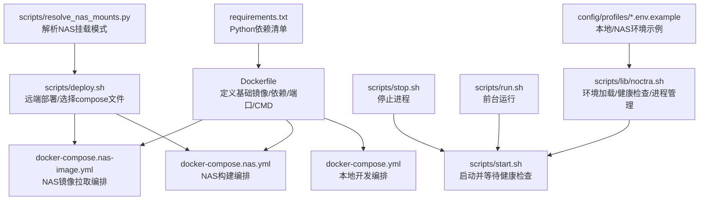
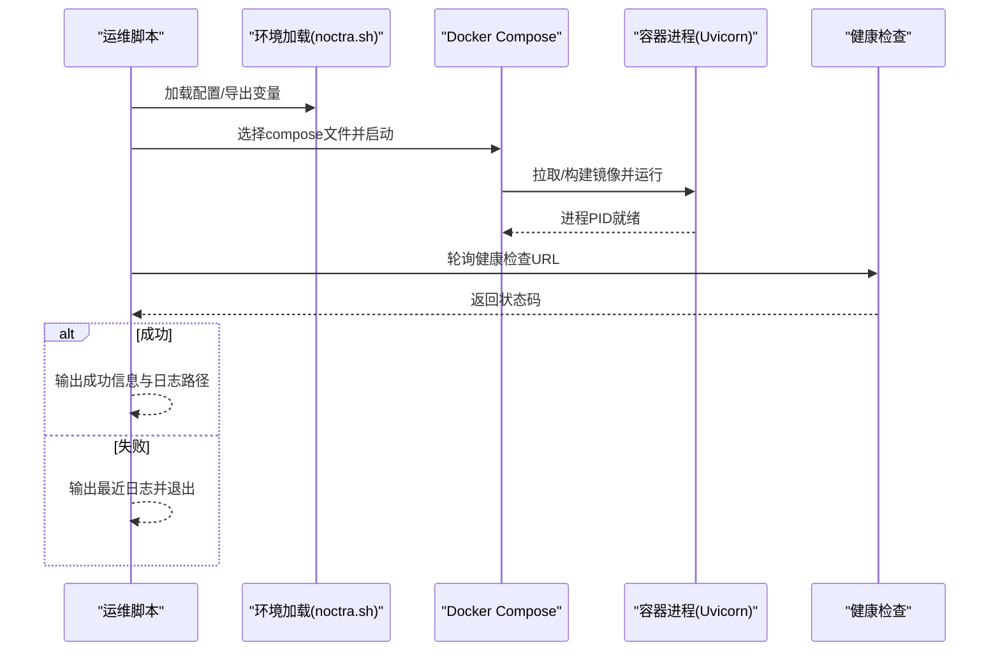
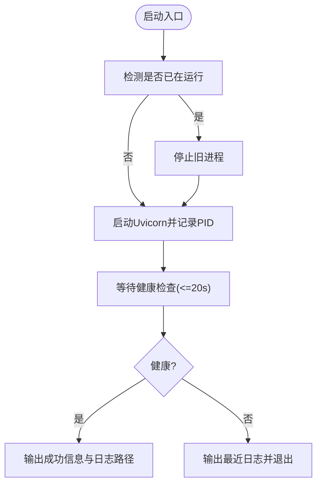
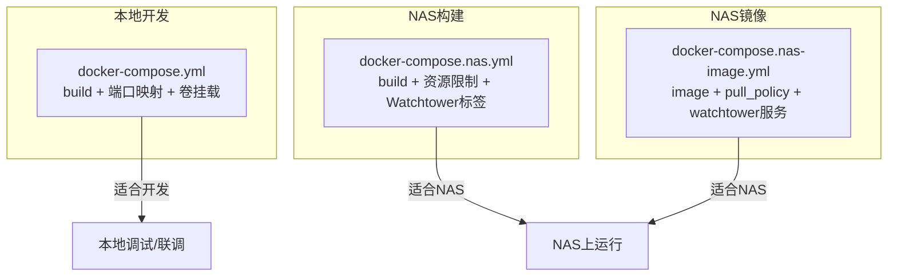
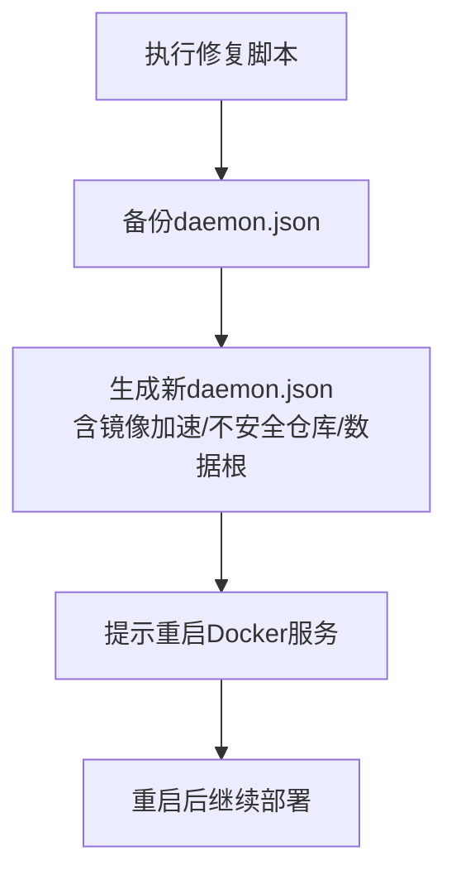
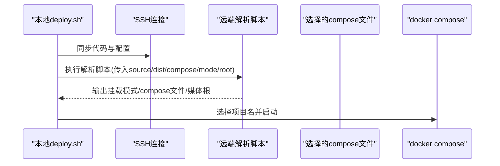
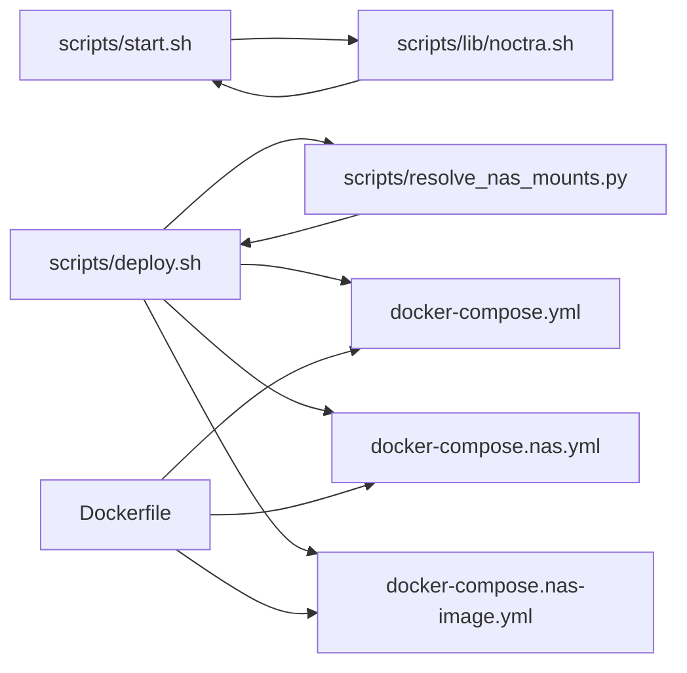

# Docker容器问题

<cite>
**本文引用的文件**
- [Dockerfile](file://Dockerfile)
- [docker-compose.yml](file://docker-compose.yml)
- [docker-compose.nas.yml](file://docker-compose.nas.yml)
- [docker-compose.nas-image.yml](file://docker-compose.nas-image.yml)
- [scripts/fix-docker-registry.sh](file://scripts/fix-docker-registry.sh)
- [scripts/start.sh](file://scripts/start.sh)
- [scripts/stop.sh](file://scripts/stop.sh)
- [scripts/run.sh](file://scripts/run.sh)
- [scripts/deploy.sh](file://scripts/deploy.sh)
- [scripts/lib/noctra.sh](file://scripts/lib/noctra.sh)
- [scripts/resolve_nas_mounts.py](file://scripts/resolve_nas_mounts.py)
- [config/profiles/local.env.example](file://config/profiles/local.env.example)
- [config/profiles/nas.env.example](file://config/profiles/nas.env.example)
- [requirements.txt](file://requirements.txt)
- [app/main.py](file://app/main.py)
</cite>

## 目录
1. [简介](#简介)
2. [项目结构](#项目结构)
3. [核心组件](#核心组件)
4. [架构总览](#架构总览)
5. [详细组件分析](#详细组件分析)
6. [依赖关系分析](#依赖关系分析)
7. [性能考虑](#性能考虑)
8. [故障排除指南](#故障排除指南)
9. [结论](#结论)
10. [附录](#附录)

## 简介
本手册面向在Docker与Docker Compose环境下运行Noctra应用的用户，提供从容器启动失败到镜像拉取、端口冲突、网络连接、健康检查、资源限制、日志分析、镜像重建与registry修复、权限与卷挂载、跨平台兼容性的完整故障排除流程。内容基于仓库中的实际配置与脚本，确保可操作性与可验证性。

## 项目结构
- 应用容器化通过Dockerfile定义基础镜像、依赖安装、工作目录与启动命令。
- Docker Compose配置分为本地开发与NAS部署两套模板，支持构建镜像或直接拉取远程镜像，并可选集成Watchtower自动更新。
- 运维脚本提供启动/停止/前台运行/部署/注册表修复等能力，配合环境配置文件实现多场景适配。

图表来源
- [Dockerfile:1-31](file://Dockerfile#L1-L31)
- [docker-compose.yml:1-28](file://docker-compose.yml#L1-L28)
- [docker-compose.nas.yml:1-33](file://docker-compose.nas.yml#L1-L33)
- [docker-compose.nas-image.yml:1-51](file://docker-compose.nas-image.yml#L1-L51)
- [scripts/lib/noctra.sh:13-73](file://scripts/lib/noctra.sh#L13-L73)
- [scripts/start.sh:13-41](file://scripts/start.sh#L13-L41)
- [scripts/stop.sh:11-18](file://scripts/stop.sh#L11-L18)
- [scripts/run.sh:16-20](file://scripts/run.sh#L16-L20)
- [scripts/deploy.sh:49-102](file://scripts/deploy.sh#L49-L102)
- [scripts/resolve_nas_mounts.py:15-38](file://scripts/resolve_nas_mounts.py#L15-L38)
- [config/profiles/local.env.example:1-23](file://config/profiles/local.env.example#L1-L23)
- [config/profiles/nas.env.example:1-44](file://config/profiles/nas.env.example#L1-L44)
- [requirements.txt:1-12](file://requirements.txt#L1-L12)

章节来源
- [Dockerfile:1-31](file://Dockerfile#L1-L31)
- [docker-compose.yml:1-28](file://docker-compose.yml#L1-L28)
- [docker-compose.nas.yml:1-33](file://docker-compose.nas.yml#L1-L33)
- [docker-compose.nas-image.yml:1-51](file://docker-compose.nas-image.yml#L1-L51)
- [scripts/lib/noctra.sh:13-73](file://scripts/lib/noctra.sh#L13-L73)
- [scripts/start.sh:13-41](file://scripts/start.sh#L13-L41)
- [scripts/stop.sh:11-18](file://scripts/stop.sh#L11-L18)
- [scripts/run.sh:16-20](file://scripts/run.sh#L16-L20)
- [scripts/deploy.sh:49-102](file://scripts/deploy.sh#L49-L102)
- [scripts/resolve_nas_mounts.py:15-38](file://scripts/resolve_nas_mounts.py#L15-L38)
- [config/profiles/local.env.example:1-23](file://config/profiles/local.env.example#L1-L23)
- [config/profiles/nas.env.example:1-44](file://config/profiles/nas.env.example#L1-L44)
- [requirements.txt:1-12](file://requirements.txt#L1-L12)

## 核心组件
- 基础镜像与依赖
  - 使用参数化基础镜像，支持自定义pip索引与可信主机，便于内网加速与合规。
  - 暴露端口8000，CMD启动Uvicorn服务。
- 编排配置
  - 本地：构建镜像，映射宿主端口至容器8000，挂载source/dist/data。
  - NAS：支持构建或直接拉取镜像，带CPU/内存限制与Watchtower。
- 运维脚本
  - 环境加载：集中设置绑定地址、端口、卷挂载根、健康检查URL等。
  - 启动/停止/前台运行：封装健康检查与日志输出。
  - 部署：远端同步代码、选择compose文件、按模式启动。
  - 注册表修复：生成daemon.json并提示重启Docker服务。

章节来源
- [Dockerfile:1-31](file://Dockerfile#L1-L31)
- [docker-compose.yml:1-28](file://docker-compose.yml#L1-L28)
- [docker-compose.nas.yml:1-33](file://docker-compose.nas.yml#L1-L33)
- [docker-compose.nas-image.yml:1-51](file://docker-compose.nas-image.yml#L1-L51)
- [scripts/lib/noctra.sh:13-73](file://scripts/lib/noctra.sh#L13-L73)
- [scripts/start.sh:13-41](file://scripts/start.sh#L13-L41)
- [scripts/stop.sh:11-18](file://scripts/stop.sh#L11-L18)
- [scripts/run.sh:16-20](file://scripts/run.sh#L16-L20)
- [scripts/deploy.sh:49-102](file://scripts/deploy.sh#L49-L102)
- [scripts/fix-docker-registry.sh:1-38](file://scripts/fix-docker-registry.sh#L1-L38)

## 架构总览
下图展示了容器启动的关键流程与依赖关系，包括环境加载、健康检查、日志输出与部署选择。

图表来源
- [scripts/lib/noctra.sh:13-73](file://scripts/lib/noctra.sh#L13-L73)
- [scripts/start.sh:13-41](file://scripts/start.sh#L13-L41)
- [scripts/deploy.sh:49-102](file://scripts/deploy.sh#L49-L102)
- [docker-compose.yml:1-28](file://docker-compose.yml#L1-L28)
- [docker-compose.nas.yml:1-33](file://docker-compose.nas.yml#L1-L33)
- [docker-compose.nas-image.yml:1-51](file://docker-compose.nas-image.yml#L1-L51)

## 详细组件分析

### 组件A：容器启动与健康检查
- 关键点
  - 启动脚本先判断是否已在运行，再以守护方式启动Uvicorn并写入PID。
  - 健康检查通过轮询健康检查URL，最多尝试20次，每次间隔1秒。
  - 失败时输出最后20行日志，便于快速定位。
- 典型问题
  - 端口占用：容器无法绑定宿主端口。
  - 权限不足：卷挂载目录无读写权限。
  - 依赖缺失：pip安装失败或版本不匹配。
- 排查建议
  - 使用“查看端口占用”“检查卷权限”“查看pip日志”三步法。
  - 若为本地开发，优先核对环境变量与端口映射。

图表来源
- [scripts/start.sh:13-41](file://scripts/start.sh#L13-L41)
- [scripts/lib/noctra.sh:120-129](file://scripts/lib/noctra.sh#L120-L129)

章节来源
- [scripts/start.sh:13-41](file://scripts/start.sh#L13-L41)
- [scripts/lib/noctra.sh:120-129](file://scripts/lib/noctra.sh#L120-L129)

### 组件B：Docker Compose配置与资源限制
- 本地开发
  - build上下文与参数传递，端口映射默认4020:8000，挂载source/dist/data。
- NAS部署
  - 支持两种模式：构建镜像或直接拉取镜像；可启用Watchtower自动更新；限制CPU与内存。
- 典型问题
  - 端口冲突：宿主端口已被占用。
  - 资源限制：内存/CPU过低导致容器频繁被杀。
  - 卷挂载：路径不存在或权限不足。
- 排查建议
  - 更改宿主端口或释放占用端口。
  - 提升内存/CPU限制，观察容器状态。
  - 确认挂载路径存在且具备读写权限。

图表来源
- [docker-compose.yml:1-28](file://docker-compose.yml#L1-L28)
- [docker-compose.nas.yml:1-33](file://docker-compose.nas.yml#L1-L33)
- [docker-compose.nas-image.yml:1-51](file://docker-compose.nas-image.yml#L1-L51)

章节来源
- [docker-compose.yml:1-28](file://docker-compose.yml#L1-L28)
- [docker-compose.nas.yml:1-33](file://docker-compose.nas.yml#L1-L33)
- [docker-compose.nas-image.yml:1-51](file://docker-compose.nas-image.yml#L1-L51)

### 组件C：镜像拉取与registry修复
- 镜像拉取策略
  - 可通过pull_policy控制是否拉取最新镜像。
  - 支持自定义镜像名称与拉取策略，便于内网或私有仓库。
- registry修复
  - 生成daemon.json，设置镜像加速、不安全仓库与数据根目录。
  - 提示重启Docker服务后继续部署。
- 典型问题
  - 网络受限：无法访问官方仓库。
  - 私有仓库：未配置认证或镜像加速。
- 排查建议
  - 使用修复脚本生成daemon.json并重启Docker。
  - 如需私有仓库，补充认证与信任配置。

图表来源
- [scripts/fix-docker-registry.sh:11-37](file://scripts/fix-docker-registry.sh#L11-L37)

章节来源
- [scripts/fix-docker-registry.sh:1-38](file://scripts/fix-docker-registry.sh#L1-L38)
- [docker-compose.nas-image.yml:1-51](file://docker-compose.nas-image.yml#L1-L51)

### 组件D：部署流程与NAS挂载解析
- 远端部署
  - 通过SSH同步代码，必要时同步环境配置文件。
  - 在远端解析NAS挂载模式，选择compose文件并启动。
- NAS挂载解析
  - 根据source/dist路径与请求模式，输出最终挂载模式与compose文件。
- 典型问题
  - 远端Python路径不可用：虚拟环境未创建或路径错误。
  - 挂载模式不匹配：NAS存储布局变化导致路径不一致。
- 排查建议
  - 确保远端Python可用或在部署前创建虚拟环境。
  - 使用解析脚本输出的模式与compose文件进行确认。

图表来源
- [scripts/deploy.sh:49-102](file://scripts/deploy.sh#L49-L102)
- [scripts/resolve_nas_mounts.py:15-38](file://scripts/resolve_nas_mounts.py#L15-L38)
- [docker-compose.nas.yml:1-33](file://docker-compose.nas.yml#L1-L33)
- [docker-compose.nas-image.yml:1-51](file://docker-compose.nas-image.yml#L1-L51)

章节来源
- [scripts/deploy.sh:49-102](file://scripts/deploy.sh#L49-L102)
- [scripts/resolve_nas_mounts.py:15-38](file://scripts/resolve_nas_mounts.py#L15-L38)

### 组件E：日志分析与健康检查
- 日志位置
  - 启动脚本将日志重定向到指定目录server.log。
- 健康检查
  - 默认健康检查URL为http://<bind_host>:<port>/api/health。
  - 启动脚本轮询该URL，成功则认为容器启动完成。
- 典型问题
  - 健康检查失败：应用未正确启动或端口未开放。
  - 日志为空：重定向路径错误或权限不足。
- 排查建议
  - 查看server.log最后若干行，结合容器状态与端口监听情况定位。
  - 确认健康检查端点可达且返回预期状态。

章节来源
- [scripts/start.sh:25-41](file://scripts/start.sh#L25-L41)
- [scripts/lib/noctra.sh:41-41](file://scripts/lib/noctra.sh#L41-L41)

## 依赖关系分析
- 组件耦合
  - 启动脚本依赖环境加载脚本提供的变量与健康检查函数。
  - 部署脚本依赖解析脚本输出的compose文件与挂载模式。
  - Compose文件依赖Dockerfile构建或外部镜像。
- 外部依赖
  - Docker与Docker Compose版本要求。
  - Python依赖由requirements.txt定义，Dockerfile中安装。
  - NAS部署依赖远端SSH可达与Docker可用。

图表来源
- [scripts/start.sh:7-7](file://scripts/start.sh#L7-L7)
- [scripts/lib/noctra.sh:7-7](file://scripts/lib/noctra.sh#L7-L7)
- [scripts/deploy.sh:52-61](file://scripts/deploy.sh#L52-L61)
- [scripts/resolve_nas_mounts.py:12-12](file://scripts/resolve_nas_mounts.py#L12-L12)
- [Dockerfile:1-31](file://Dockerfile#L1-L31)
- [docker-compose.yml:1-28](file://docker-compose.yml#L1-L28)
- [docker-compose.nas.yml:1-33](file://docker-compose.nas.yml#L1-L33)
- [docker-compose.nas-image.yml:1-51](file://docker-compose.nas-image.yml#L1-L51)

章节来源
- [scripts/start.sh:7-7](file://scripts/start.sh#L7-L7)
- [scripts/lib/noctra.sh:7-7](file://scripts/lib/noctra.sh#L7-L7)
- [scripts/deploy.sh:52-61](file://scripts/deploy.sh#L52-L61)
- [scripts/resolve_nas_mounts.py:12-12](file://scripts/resolve_nas_mounts.py#L12-L12)
- [Dockerfile:1-31](file://Dockerfile#L1-L31)
- [docker-compose.yml:1-28](file://docker-compose.yml#L1-L28)
- [docker-compose.nas.yml:1-33](file://docker-compose.nas.yml#L1-L33)
- [docker-compose.nas-image.yml:1-51](file://docker-compose.nas-image.yml#L1-L51)

## 性能考虑
- 资源限制
  - NAS编排文件设置了CPU与内存上限，建议根据实际负载调整。
- 端口与网络
  - 本地开发默认端口可能与其他服务冲突，建议修改宿主端口。
- 依赖安装
  - 内网可通过参数化pip索引与可信主机提升安装速度与稳定性。

## 故障排除指南

### 容器启动失败
- 步骤
  - 检查健康检查URL是否可达。
  - 查看server.log最后若干行。
  - 确认端口未被占用。
- 相关文件
  - [scripts/start.sh:32-41](file://scripts/start.sh#L32-L41)
  - [scripts/lib/noctra.sh:41-41](file://scripts/lib/noctra.sh#L41-L41)

章节来源
- [scripts/start.sh:32-41](file://scripts/start.sh#L32-L41)
- [scripts/lib/noctra.sh:41-41](file://scripts/lib/noctra.sh#L41-L41)

### 镜像拉取错误
- 步骤
  - 使用registry修复脚本生成daemon.json并重启Docker。
  - 如为私有仓库，补充认证与信任配置。
- 相关文件
  - [scripts/fix-docker-registry.sh:11-37](file://scripts/fix-docker-registry.sh#L11-L37)
  - [docker-compose.nas-image.yml:1-51](file://docker-compose.nas-image.yml#L1-L51)

章节来源
- [scripts/fix-docker-registry.sh:11-37](file://scripts/fix-docker-registry.sh#L11-L37)
- [docker-compose.nas-image.yml:1-51](file://docker-compose.nas-image.yml#L1-L51)

### 端口冲突
- 步骤
  - 修改宿主端口映射，避免与系统或其他容器冲突。
  - 检查宿主端口占用情况并释放。
- 相关文件
  - [docker-compose.yml:10-11](file://docker-compose.yml#L10-L11)
  - [docker-compose.nas.yml:10-11](file://docker-compose.nas.yml#L10-L11)
  - [docker-compose.nas-image.yml:8-9](file://docker-compose.nas-image.yml#L8-L9)

章节来源
- [docker-compose.yml:10-11](file://docker-compose.yml#L10-L11)
- [docker-compose.nas.yml:10-11](file://docker-compose.nas.yml#L10-L11)
- [docker-compose.nas-image.yml:8-9](file://docker-compose.nas-image.yml#L8-L9)

### 网络连接问题
- 步骤
  - 检查代理环境变量是否正确传递至容器。
  - 确认DNS与防火墙策略允许访问目标域名。
- 相关文件
  - [docker-compose.yml:16-26](file://docker-compose.yml#L16-L26)
  - [docker-compose.nas.yml:16-26](file://docker-compose.nas.yml#L16-L26)
  - [docker-compose.nas-image.yml:14-24](file://docker-compose.nas-image.yml#L14-L24)

章节来源
- [docker-compose.yml:16-26](file://docker-compose.yml#L16-L26)
- [docker-compose.nas.yml:16-26](file://docker-compose.nas.yml#L16-L26)
- [docker-compose.nas-image.yml:14-24](file://docker-compose.nas-image.yml#L14-L24)

### Docker Compose配置问题
- 步骤
  - 确认环境变量已正确加载（如端口、卷路径）。
  - 使用解析脚本输出的compose文件与挂载模式。
- 相关文件
  - [scripts/lib/noctra.sh:13-73](file://scripts/lib/noctra.sh#L13-L73)
  - [scripts/deploy.sh:56-61](file://scripts/deploy.sh#L56-L61)
  - [scripts/resolve_nas_mounts.py:32-38](file://scripts/resolve_nas_mounts.py#L32-L38)

章节来源
- [scripts/lib/noctra.sh:13-73](file://scripts/lib/noctra.sh#L13-L73)
- [scripts/deploy.sh:56-61](file://scripts/deploy.sh#L56-L61)
- [scripts/resolve_nas_mounts.py:32-38](file://scripts/resolve_nas_mounts.py#L32-L38)

### 容器健康检查失败
- 步骤
  - 检查健康检查URL与端口映射。
  - 查看应用启动日志与依赖安装日志。
- 相关文件
  - [scripts/lib/noctra.sh:41-41](file://scripts/lib/noctra.sh#L41-L41)
  - [scripts/start.sh:32-41](file://scripts/start.sh#L32-L41)

章节来源
- [scripts/lib/noctra.sh:41-41](file://scripts/lib/noctra.sh#L41-L41)
- [scripts/start.sh:32-41](file://scripts/start.sh#L32-L41)

### 资源限制导致的问题
- 步骤
  - 提高内存/CPU限制，观察容器状态。
  - 关注容器被Killed或OOM事件。
- 相关文件
  - [docker-compose.nas.yml:28-33](file://docker-compose.nas.yml#L28-L33)
  - [docker-compose.nas-image.yml:26-30](file://docker-compose.nas-image.yml#L26-L30)

章节来源
- [docker-compose.nas.yml:28-33](file://docker-compose.nas.yml#L28-L33)
- [docker-compose.nas-image.yml:26-30](file://docker-compose.nas-image.yml#L26-L30)

### 容器日志分析方法
- 步骤
  - 启动脚本将日志重定向到server.log，失败时输出最后20行。
  - 结合容器状态与端口监听情况定位问题。
- 相关文件
  - [scripts/start.sh:38-41](file://scripts/start.sh#L38-L41)
  - [scripts/lib/noctra.sh:27-27](file://scripts/lib/noctra.sh#L27-L27)

章节来源
- [scripts/start.sh:38-41](file://scripts/start.sh#L38-L41)
- [scripts/lib/noctra.sh:27-27](file://scripts/lib/noctra.sh#L27-L27)

### 镜像重建步骤
- 步骤
  - 在本地执行构建：docker compose build（或在部署脚本中使用--build）。
  - 清理缓存后重新构建：docker compose build --no-cache。
- 相关文件
  - [docker-compose.yml:3-8](file://docker-compose.yml#L3-L8)
  - [docker-compose.nas.yml:3-8](file://docker-compose.nas.yml#L3-L8)

章节来源
- [docker-compose.yml:3-8](file://docker-compose.yml#L3-L8)
- [docker-compose.nas.yml:3-8](file://docker-compose.nas.yml#L3-L8)

### Registry修复程序使用指南
- 步骤
  - 执行修复脚本生成daemon.json并备份原配置。
  - 重启Docker服务后继续部署。
- 相关文件
  - [scripts/fix-docker-registry.sh:11-37](file://scripts/fix-docker-registry.sh#L11-L37)

章节来源
- [scripts/fix-docker-registry.sh:11-37](file://scripts/fix-docker-registry.sh#L11-L37)

### 容器权限配置
- 步骤
  - 确认挂载目录在宿主存在且具备读写权限。
  - 如为NAS，确保用户与组映射正确。
- 相关文件
  - [docker-compose.yml:12-15](file://docker-compose.yml#L12-L15)
  - [docker-compose.nas.yml:12-15](file://docker-compose.nas.yml#L12-L15)
  - [docker-compose.nas-image.yml:10-13](file://docker-compose.nas-image.yml#L10-L13)

章节来源
- [docker-compose.yml:12-15](file://docker-compose.yml#L12-L15)
- [docker-compose.nas.yml:12-15](file://docker-compose.nas.yml#L12-L15)
- [docker-compose.nas-image.yml:10-13](file://docker-compose.nas-image.yml#L10-L13)

### 卷挂载问题
- 步骤
  - 检查source/dist/data路径是否存在。
  - 确认compose文件中的卷路径与容器内挂载点一致。
- 相关文件
  - [docker-compose.yml:12-15](file://docker-compose.yml#L12-L15)
  - [docker-compose.nas.yml:12-15](file://docker-compose.nas.yml#L12-L15)
  - [docker-compose.nas-image.yml:10-13](file://docker-compose.nas-image.yml#L10-L13)

章节来源
- [docker-compose.yml:12-15](file://docker-compose.yml#L12-L15)
- [docker-compose.nas.yml:12-15](file://docker-compose.nas.yml#L12-L15)
- [docker-compose.nas-image.yml:10-13](file://docker-compose.nas-image.yml#L10-L13)

### 跨平台兼容性问题
- 步骤
  - 在不同平台使用相同的compose文件与环境变量。
  - 注意路径分隔符与大小写敏感性差异。
- 相关文件
  - [config/profiles/local.env.example:8-11](file://config/profiles/local.env.example#L8-L11)
  - [config/profiles/nas.env.example:8-13](file://config/profiles/nas.env.example#L8-L13)

章节来源
- [config/profiles/local.env.example:8-11](file://config/profiles/local.env.example#L8-L11)
- [config/profiles/nas.env.example:8-13](file://config/profiles/nas.env.example#L8-L13)

## 结论
本手册基于仓库中的实际配置与脚本，提供了从启动、网络、资源、日志到镜像与registry修复的全链路故障排除方法。建议在日常运维中结合环境变量、健康检查与日志输出，快速定位并解决问题。

## 附录
- 环境变量参考
  - 本地示例：绑定地址、端口、source/dist/data路径。
  - NAS示例：绑定地址、端口、NAS挂载路径、远端部署参数、镜像与拉取策略、Watchtower配置。
- 依赖清单
  - Python依赖由requirements.txt定义，Dockerfile中安装。

章节来源
- [config/profiles/local.env.example:1-23](file://config/profiles/local.env.example#L1-L23)
- [config/profiles/nas.env.example:1-44](file://config/profiles/nas.env.example#L1-L44)
- [requirements.txt:1-12](file://requirements.txt#L1-L12)