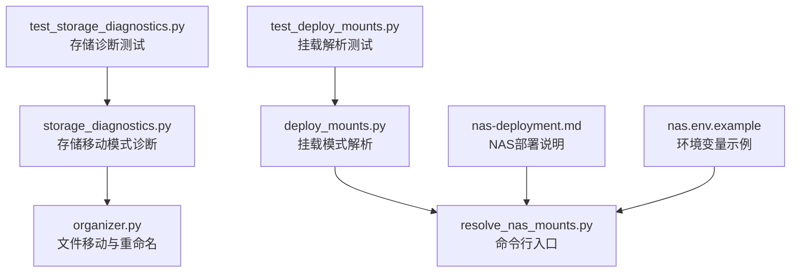
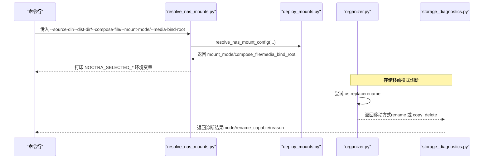
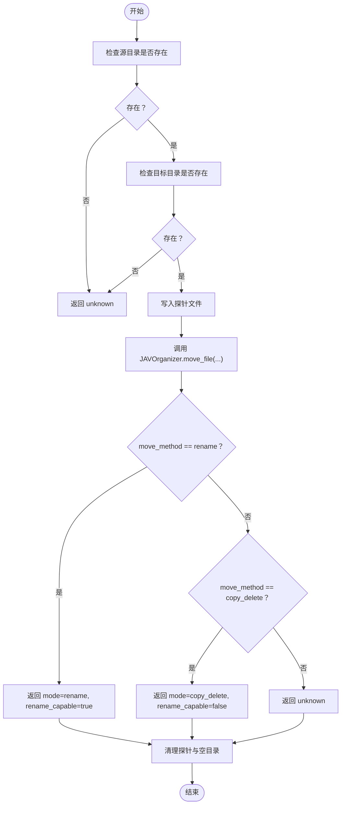
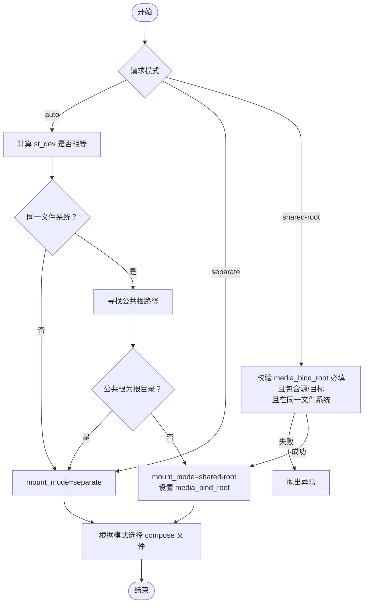
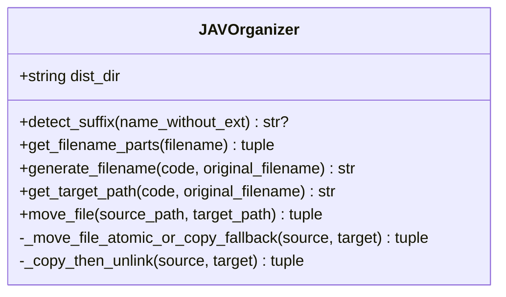
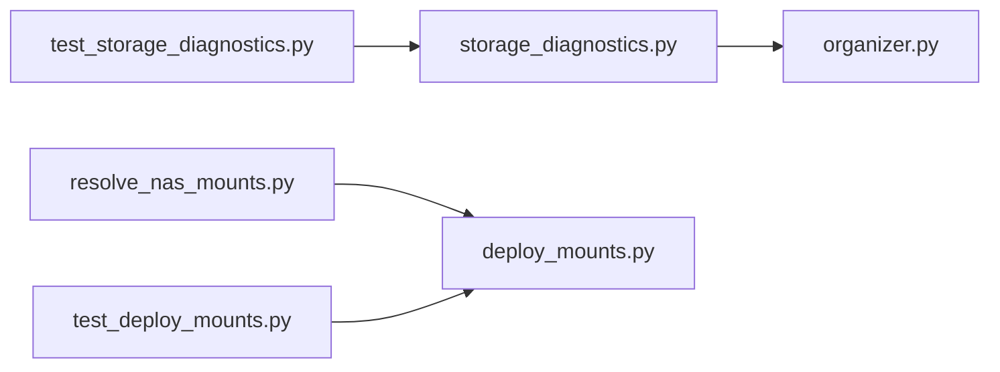

# 存储问题

<cite>
**本文引用的文件**
- [app/storage_diagnostics.py](file://app/storage_diagnostics.py)
- [app/deploy_mounts.py](file://app/deploy_mounts.py)
- [scripts/resolve_nas_mounts.py](file://scripts/resolve_nas_mounts.py)
- [app/organizer.py](file://app/organizer.py)
- [docs/nas-deployment.md](file://docs/nas-deployment.md)
- [config/profiles/nas.env.example](file://config/profiles/nas.env.example)
- [tests/test_storage_diagnostics.py](file://tests/test_storage_diagnostics.py)
- [tests/test_deploy_mounts.py](file://tests/test_deploy_mounts.py)
</cite>

## 目录
1. [简介](#简介)
2. [项目结构](#项目结构)
3. [核心组件](#核心组件)
4. [架构总览](#架构总览)
5. [详细组件分析](#详细组件分析)
6. [依赖关系分析](#依赖关系分析)
7. [性能考量](#性能考量)
8. [故障排除指南](#故障排除指南)
9. [结论](#结论)
10. [附录](#附录)

## 简介
本指南聚焦于Noctra在NAS部署与运行过程中常见的存储相关问题，包括但不限于：
- NAS挂载失败
- 磁盘空间不足
- 权限错误
- 网络存储连接问题

内容覆盖存储诊断工具的使用方法（storage_diagnostics.py中的诊断函数与deploy_mounts.py中的挂载检查机制），并提供错误代码解释、日志分析方法与修复步骤。同时给出不同操作系统下的存储配置差异与最佳实践。

## 项目结构
围绕存储问题的关键文件与职责如下：
- app/storage_diagnostics.py：提供存储移动模式诊断能力，用于判断rename或copy_delete是否可用，并输出可读性说明
- app/deploy_mounts.py：根据源/目标目录位置与文件系统特性，选择挂载模式（auto/separate/shared-root）并返回compose文件
- scripts/resolve_nas_mounts.py：命令行入口，调用部署挂载解析逻辑，输出环境变量供后续部署流程使用
- app/organizer.py：负责文件重命名/移动的核心逻辑，包含rename与跨文件系统fallback策略
- docs/nas-deployment.md：NAS部署与挂载模式说明
- config/profiles/nas.env.example：NAS部署所需环境变量示例
- tests/test_storage_diagnostics.py、tests/test_deploy_mounts.py：对上述功能的单元测试

**图表来源**
- [app/storage_diagnostics.py:1-63](file://app/storage_diagnostics.py#L1-L63)
- [app/deploy_mounts.py:1-89](file://app/deploy_mounts.py#L1-L89)
- [scripts/resolve_nas_mounts.py:1-43](file://scripts/resolve_nas_mounts.py#L1-L43)
- [app/organizer.py:1-307](file://app/organizer.py#L1-L307)
- [docs/nas-deployment.md:1-125](file://docs/nas-deployment.md#L1-L125)
- [config/profiles/nas.env.example:1-44](file://config/profiles/nas.env.example#L1-L44)
- [tests/test_storage_diagnostics.py:1-66](file://tests/test_storage_diagnostics.py#L1-L66)
- [tests/test_deploy_mounts.py:1-101](file://tests/test_deploy_mounts.py#L1-L101)

**章节来源**
- [app/storage_diagnostics.py:1-63](file://app/storage_diagnostics.py#L1-L63)
- [app/deploy_mounts.py:1-89](file://app/deploy_mounts.py#L1-L89)
- [scripts/resolve_nas_mounts.py:1-43](file://scripts/resolve_nas_mounts.py#L1-L43)
- [app/organizer.py:1-307](file://app/organizer.py#L1-L307)
- [docs/nas-deployment.md:1-125](file://docs/nas-deployment.md#L1-L125)
- [config/profiles/nas.env.example:1-44](file://config/profiles/nas.env.example#L1-L44)
- [tests/test_storage_diagnostics.py:1-66](file://tests/test_storage_diagnostics.py#L1-L66)
- [tests/test_deploy_mounts.py:1-101](file://tests/test_deploy_mounts.py#L1-L101)

## 核心组件
- 存储移动模式诊断（storage_diagnostics.py）
  - 功能：探测源/目标目录是否支持原子rename移动，若不支持则回退到copy+delete
  - 输出：包含mode（rename/copy_delete/unknown）、rename_capable布尔值、reason说明
- 挂载模式解析（deploy_mounts.py）
  - 功能：根据源/目标目录是否在同一文件系统、是否存在公共根路径，自动选择挂载模式（auto/separate/shared-root）
  - 输出：mount_mode、media_bind_root、compose_file
- 文件移动与重命名（organizer.py）
  - 功能：优先原子替换（rename），跨文件系统时降级为copy+delete，并进行fsync确保落盘
- 命令行挂载解析（scripts/resolve_nas_mounts.py）
  - 功能：接收参数，调用解析函数，打印环境变量供部署脚本使用

**章节来源**
- [app/storage_diagnostics.py:8-63](file://app/storage_diagnostics.py#L8-L63)
- [app/deploy_mounts.py:57-89](file://app/deploy_mounts.py#L57-L89)
- [app/organizer.py:98-163](file://app/organizer.py#L98-L163)
- [scripts/resolve_nas_mounts.py:15-43](file://scripts/resolve_nas_mounts.py#L15-L43)

## 架构总览
下面的序列图展示了从命令行到最终选择挂载模式与compose文件的流程，以及存储移动模式诊断如何影响健康检查结果。

**图表来源**
- [scripts/resolve_nas_mounts.py:15-43](file://scripts/resolve_nas_mounts.py#L15-L43)
- [app/deploy_mounts.py:57-89](file://app/deploy_mounts.py#L57-L89)
- [app/organizer.py:122-163](file://app/organizer.py#L122-L163)
- [app/storage_diagnostics.py:8-63](file://app/storage_diagnostics.py#L8-L63)

## 详细组件分析

### 组件A：存储移动模式诊断（storage_diagnostics.py）
- 输入：源目录、目标目录
- 处理逻辑：
  - 若任一目录不存在，返回unknown
  - 写入探针文件，调用JAVOrganizer.move_file执行移动
  - 根据返回的move_method区分rename或copy_delete
  - 清理探针文件与空目录
- 输出：mode、rename_capable、reason

**图表来源**
- [app/storage_diagnostics.py:8-63](file://app/storage_diagnostics.py#L8-L63)
- [app/organizer.py:139-163](file://app/organizer.py#L139-L163)

**章节来源**
- [app/storage_diagnostics.py:8-63](file://app/storage_diagnostics.py#L8-L63)

### 组件B：挂载模式解析（deploy_mounts.py）
- 自动模式（auto）：
  - 判断源/目标目录是否在同一文件系统
  - 寻找公共根路径，若根为根目录则视为不可共享
- 显式模式：
  - separate：始终独立挂载
  - shared-root：要求提供media_bind_root，且同时包含源/目标目录，且在同一文件系统
- 返回值：mount_mode、media_bind_root、compose_file

**图表来源**
- [app/deploy_mounts.py:26-89](file://app/deploy_mounts.py#L26-L89)

**章节来源**
- [app/deploy_mounts.py:26-89](file://app/deploy_mounts.py#L26-L89)

### 组件C：文件移动与重命名（organizer.py）
- 原子移动优先：os.replace（rename）
- 跨文件系统回退：复制到目标后fsync并删除源
- 错误处理：捕获OSError与shutil.Error，返回失败原因

**图表来源**
- [app/organizer.py:9-307](file://app/organizer.py#L9-L307)

**章节来源**
- [app/organizer.py:98-163](file://app/organizer.py#L98-L163)

### 组件D：命令行挂载解析（scripts/resolve_nas_mounts.py）
- 参数：--source-dir、--dist-dir、--compose-file、--mount-mode、--media-bind-root
- 调用resolve_nas_mount_config并打印NOCTRA_SELECTED_MOUNT_MODE、NOCTRA_SELECTED_COMPOSE_FILE、NOCTRA_MEDIA_BIND_ROOT

**章节来源**
- [scripts/resolve_nas_mounts.py:15-43](file://scripts/resolve_nas_mounts.py#L15-L43)

## 依赖关系分析
- storage_diagnostics.py依赖JAVOrganizer.move_file，后者位于organizer.py
- deploy_mounts.py被resolve_nas_mounts.py调用，用于生成部署所需的环境变量
- 测试文件分别验证存储诊断与挂载解析的行为

**图表来源**
- [app/storage_diagnostics.py:5-5](file://app/storage_diagnostics.py#L5-L5)
- [app/organizer.py:31-31](file://app/organizer.py#L31-L31)
- [scripts/resolve_nas_mounts.py:12-12](file://scripts/resolve_nas_mounts.py#L12-L12)
- [app/deploy_mounts.py:57-89](file://app/deploy_mounts.py#L57-L89)
- [tests/test_storage_diagnostics.py:4-4](file://tests/test_storage_diagnostics.py#L4-L4)
- [tests/test_deploy_mounts.py:5-5](file://tests/test_deploy_mounts.py#L5-L5)

**章节来源**
- [app/storage_diagnostics.py:5-5](file://app/storage_diagnostics.py#L5-L5)
- [app/organizer.py:31-31](file://app/organizer.py#L31-L31)
- [scripts/resolve_nas_mounts.py:12-12](file://scripts/resolve_nas_mounts.py#L12-L12)
- [app/deploy_mounts.py:57-89](file://app/deploy_mounts.py#L57-L89)
- [tests/test_storage_diagnostics.py:4-4](file://tests/test_storage_diagnostics.py#L4-L4)
- [tests/test_deploy_mounts.py:5-5](file://tests/test_deploy_mounts.py#L5-L5)

## 性能考量
- rename（原子替换）优于copy+delete，因为rename不会产生“复制到一半”的中间态，且速度更快
- 当源/目标位于不同文件系统时，rename不可用，系统会自动降级为copy+delete，并通过fsync确保数据落盘
- auto模式优先选择shared-root以保留rename，从而提升移动性能；若跨文件系统则保持separate以保证兼容性

[本节为通用性能讨论，无需特定文件来源]

## 故障排除指南

### 1. NAS挂载失败
- 现象
  - 容器内无法访问/source或/dist
  - 健康检查失败或API不可用
- 诊断步骤
  - 使用resolve_nas_mounts.py检查挂载模式与compose文件选择
  - 查看NOCTRA_SELECTED_MOUNT_MODE与NOCTRA_SELECTED_COMPOSE_FILE是否符合预期
  - 参考NAS部署文档中的验证步骤，检查docker info与健康检查接口
- 修复建议
  - 确认compose文件与挂载模式匹配
  - 若为shared-root，确保NOCTRA_MEDIA_BIND_ROOT正确且包含源/目标目录
  - 若为separate，确认两目录在同一主机上可访问

**章节来源**
- [scripts/resolve_nas_mounts.py:15-43](file://scripts/resolve_nas_mounts.py#L15-L43)
- [docs/nas-deployment.md:50-125](file://docs/nas-deployment.md#L50-L125)

### 2. 磁盘空间不足
- 现象
  - 文件移动报错，目标目录无空间
  - 日志显示IO错误或磁盘空间相关提示
- 诊断步骤
  - 检查目标目录所在卷的剩余空间
  - 确认临时目录与数据库目录有足够的空间
- 修复建议
  - 清理历史缓存与旧版本数据
  - 调整NOCTRA_DATA_DIR至有足够空间的卷
  - 分离/source与/dist到不同卷，避免相互挤占

[本节为通用指导，无需特定文件来源]

### 3. 权限错误
- 现象
  - 源目录读取失败或目标目录写入失败
  - 健康检查返回存储诊断为unknown或失败
- 诊断步骤
  - 使用storage_diagnostics.py进行移动模式探测
  - 若返回unknown，检查源/目标目录是否存在且可访问
- 修复建议
  - 确保容器进程对/source与/dist具有读写权限
  - 对于shared-root，确保bind root对容器可见且权限正确

**章节来源**
- [app/storage_diagnostics.py:12-24](file://app/storage_diagnostics.py#L12-L24)

### 4. 网络存储连接问题
- 现象
  - 源/目标目录在NAS上，但网络波动导致读写失败
  - rename失败但copy+delete成功，说明跨设备/网络存储限制rename
- 诊断步骤
  - 使用storage_diagnostics.py查看mode是否为copy_delete
  - 若为copy_delete，确认网络存储是否支持rename
- 修复建议
  - 采用separate挂载模式，避免跨设备限制
  - 在NAS侧优化网络与存储性能，减少抖动

**章节来源**
- [app/storage_diagnostics.py:44-49](file://app/storage_diagnostics.py#L44-L49)

### 5. 存储诊断工具使用方法
- storage_diagnostics.py
  - 输入：源目录、目标目录
  - 输出：mode、rename_capable、reason
  - 用途：判断rename是否可用，辅助定位跨设备/网络存储限制
- deploy_mounts.py
  - 输入：source_dir、dist_dir、compose_file、requested_mode、media_bind_root
  - 输出：mount_mode、media_bind_root、compose_file
  - 用途：自动选择挂载模式并返回对应compose文件
- scripts/resolve_nas_mounts.py
  - 输入：命令行参数
  - 输出：NOCTRA_SELECTED_MOUNT_MODE、NOCTRA_SELECTED_COMPOSE_FILE、NOCTRA_MEDIA_BIND_ROOT
  - 用途：部署前生成环境变量

**章节来源**
- [app/storage_diagnostics.py:8-63](file://app/storage_diagnostics.py#L8-L63)
- [app/deploy_mounts.py:57-89](file://app/deploy_mounts.py#L57-L89)
- [scripts/resolve_nas_mounts.py:15-43](file://scripts/resolve_nas_mounts.py#L15-L43)

### 6. 错误代码与含义
- EXDEV（跨设备链接）
  - 含义：rename无法在不同文件系统间进行
  - 影响：系统自动降级为copy+delete
  - 修复：使用separate挂载或确保在同一文件系统
- 目标文件已存在
  - 含义：移动目标已存在，跳过该文件
  - 修复：清理冲突文件或调整目标路径规则
- 源文件不存在
  - 含义：原始文件已被删除或路径错误
  - 修复：检查扫描与下载流程，确保文件存在

**章节来源**
- [app/organizer.py:134-137](file://app/organizer.py#L134-L137)
- [app/organizer.py:156-157](file://app/organizer.py#L156-L157)
- [app/organizer.py:149-150](file://app/organizer.py#L149-L150)

### 7. 日志分析方法
- 健康检查
  - 通过健康检查接口查看storage_diagnostic字段，确认mode与rename_capable
- 容器日志
  - 关注移动失败与跨文件系统相关的错误信息
- 部署日志
  - 检查resolve_nas_mounts.py输出的环境变量是否正确

**章节来源**
- [tests/test_storage_diagnostics.py:46-65](file://tests/test_storage_diagnostics.py#L46-L65)

### 8. 不同操作系统下的存储配置差异与最佳实践
- Linux（NAS常用）
  - 建议使用shared-root以保留rename，提高性能
  - 确保bind root对容器可见且权限正确
- Windows/macOS
  - Docker Desktop可能对文件系统边界与权限控制有差异
  - 建议使用separate挂载以规避跨盘限制
- 最佳实践
  - 优先使用auto模式，让系统自动选择最优挂载策略
  - 对网络存储优先采用separate挂载
  - 定期运行storage_diagnostics.py进行健康评估

**章节来源**
- [docs/nas-deployment.md:44-48](file://docs/nas-deployment.md#L44-L48)
- [config/profiles/nas.env.example:27-27](file://config/profiles/nas.env.example#L27-L27)

## 结论
通过storage_diagnostics.py与deploy_mounts.py的组合使用，Noctra能够在不同存储环境下自动选择最优挂载策略，并提供明确的诊断信息。针对NAS部署，建议优先采用auto模式，结合resolve_nas_mounts.py生成的环境变量进行部署；当遇到跨设备/网络存储限制时，采用separate挂载并关注rename_capable状态，以确保稳定与性能兼顾。

[本节为总结，无需特定文件来源]

## 附录
- 相关配置文件
  - [config/profiles/nas.env.example](file://config/profiles/nas.env.example)
- 相关文档
  - [docs/nas-deployment.md](file://docs/nas-deployment.md)
- 相关测试
  - [tests/test_storage_diagnostics.py](file://tests/test_storage_diagnostics.py)
  - [tests/test_deploy_mounts.py](file://tests/test_deploy_mounts.py)

[本节为补充信息，无需特定文件来源]