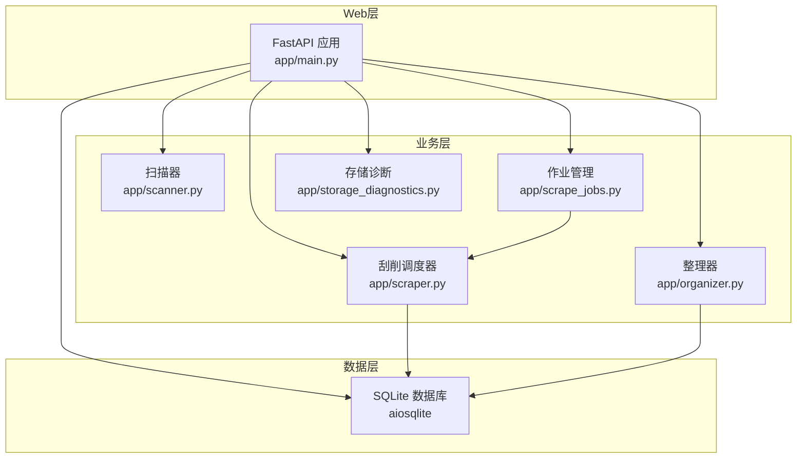
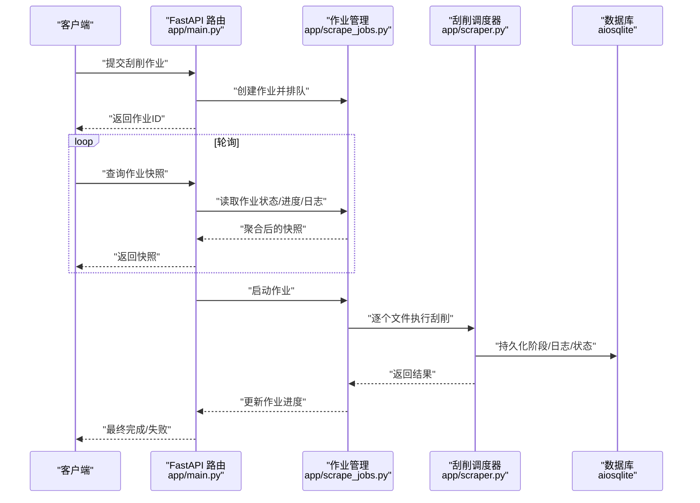
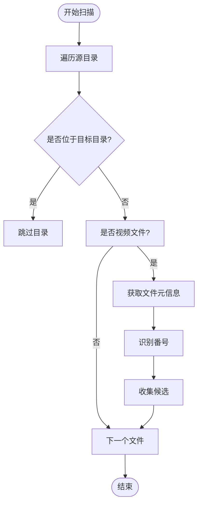
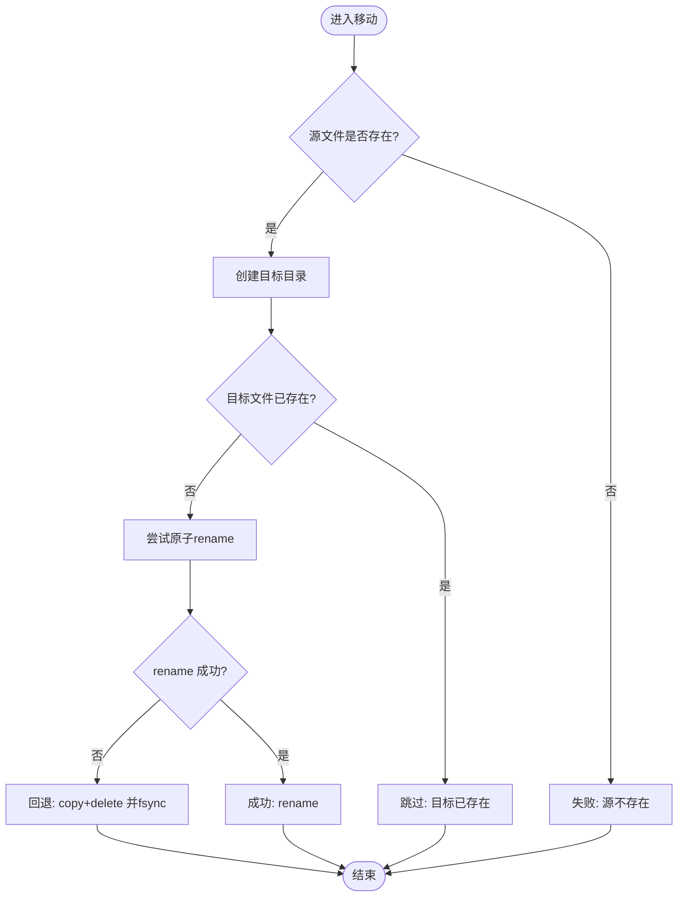
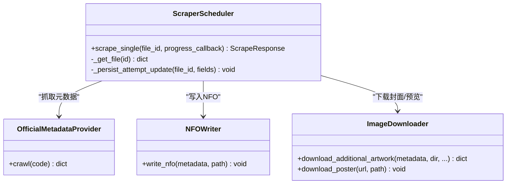
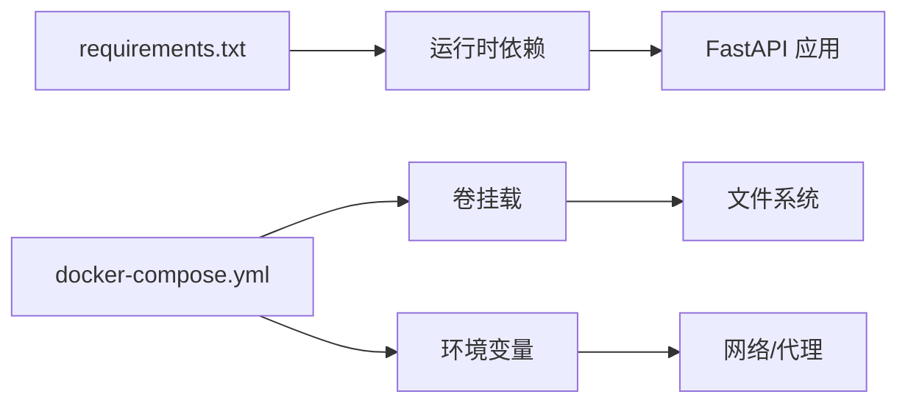

# 性能优化与监控

<cite>
**本文引用的文件**
- [app/main.py](file://app/main.py)
- [app/models.py](file://app/models.py)
- [app/scanner.py](file://app/scanner.py)
- [app/organizer.py](file://app/organizer.py)
- [app/storage_diagnostics.py](file://app/storage_diagnostics.py)
- [app/scraper.py](file://app/scraper.py)
- [app/scrape_jobs.py](file://app/scrape_jobs.py)
- [requirements.txt](file://requirements.txt)
- [docker-compose.yml](file://docker-compose.yml)
- [config/profiles/local.env.example](file://config/profiles/local.env.example)
- [docs/superpowers/plans/2026-03-27-scrape-feedback-observability.md](file://docs/superpowers/plans/2026-03-27-scrape-feedback-observability.md)
- [tests/test_scanner.py](file://tests/test_scanner.py)
- [tests/test_frontend_state_sync.py](file://tests/test_frontend_state_sync.py)
- [tests/test_storage_diagnostics.py](file://tests/test_storage_diagnostics.py)
</cite>

## 目录
1. [简介](#简介)
2. [项目结构](#项目结构)
3. [核心组件](#核心组件)
4. [架构总览](#架构总览)
5. [详细组件分析](#详细组件分析)
6. [依赖关系分析](#依赖关系分析)
7. [性能考量](#性能考量)
8. [故障排查指南](#故障排查指南)
9. [结论](#结论)
10. [附录](#附录)

## 简介
本指南聚焦Noctra在实际运行中的性能问题诊断与优化，覆盖CPU使用率过高、内存泄漏、I/O瓶颈、并发处理问题等。文档结合代码实现，给出日志分析方法、性能指标监控与瓶颈识别技巧，并提供系统资源监控工具使用、进程状态检查与性能调优建议。最后，针对不同负载场景提出优化策略与扩展方案。

## 项目结构
Noctra采用FastAPI服务端，围绕“扫描-整理-刮削”三段式流程组织模块：
- Web入口与路由：FastAPI应用、数据库初始化、静态资源挂载
- 扫描器：递归扫描源目录，识别番号并生成候选集
- 整理器：计算目标路径并进行原子移动/复制删除
- 刮削调度器：串联元数据抓取、NFO写入、封面下载与进度持久化
- 作业管理：批处理与刮削作业的队列、进度与取消控制
- 存储诊断：探测移动模式（rename vs copy_delete），指导I/O策略

图表来源
- [app/main.py](file://app/main.py)
- [app/scanner.py](file://app/scanner.py)
- [app/organizer.py](file://app/organizer.py)
- [app/scraper.py](file://app/scraper.py)
- [app/scrape_jobs.py](file://app/scrape_jobs.py)
- [app/storage_diagnostics.py](file://app/storage_diagnostics.py)

章节来源
- [app/main.py](file://app/main.py)
- [app/scanner.py](file://app/scanner.py)
- [app/organizer.py](file://app/organizer.py)
- [app/scraper.py](file://app/scraper.py)
- [app/scrape_jobs.py](file://app/scrape_jobs.py)
- [app/storage_diagnostics.py](file://app/storage_diagnostics.py)

## 核心组件
- 扫描器：遍历源目录，过滤非视频与目标目录，识别番号，返回候选集
- 整理器：生成目标路径，优先原子rename，跨盘时回退copy+delete，保证落盘一致性
- 刮削调度器：按阶段推进，记录日志与进度，持久化到数据库
- 作业管理：维护作业状态、进度、最近日志，支持取消
- 存储诊断：探测rename能力，输出模式与原因，辅助I/O策略选择

章节来源
- [app/scanner.py](file://app/scanner.py)
- [app/organizer.py](file://app/organizer.py)
- [app/scraper.py](file://app/scraper.py)
- [app/scrape_jobs.py](file://app/scrape_jobs.py)
- [app/storage_diagnostics.py](file://app/storage_diagnostics.py)

## 架构总览
Noctra以异步I/O为核心，数据库操作通过aiosqlite串行化，I/O密集型任务通过线程池与异步回调解耦。刮削流程严格分阶段，日志与进度持久化，便于可观测性与故障定位。

图表来源
- [app/main.py](file://app/main.py)
- [app/scrape_jobs.py](file://app/scrape_jobs.py)
- [app/scraper.py](file://app/scraper.py)

## 详细组件分析

### 扫描器（JAVScanner）
- 关键点
  - 使用正则识别番号，清理干扰标记，去除尾部后缀
  - 递归遍历源目录，跳过目标目录与非视频文件
  - 输出候选集包含路径、文件名、番号、大小与修改时间
- 性能关注
  - 目录遍历与正则匹配为CPU热点；可通过限制扫描深度、排除大目录或启用缓存减少重复扫描
  - I/O开销主要来自stat与文件系统遍历，建议使用更快的存储介质或减少扫描频率

图表来源
- [app/scanner.py](file://app/scanner.py)

章节来源
- [app/scanner.py](file://app/scanner.py)

### 整理器（JAVOrganizer）
- 关键点
  - 生成目标路径，优先原子rename；跨盘时回退copy+delete并fsync确保落盘
  - 对目标已存在与源不存在等边界条件进行明确处理
- 性能关注
  - rename为O(1)原子操作；跨盘copy_delete为O(size)，是I/O瓶颈主因
  - 通过存储诊断提前获知rename能力，避免运行期反复尝试

图表来源
- [app/organizer.py](file://app/organizer.py)

章节来源
- [app/organizer.py](file://app/organizer.py)

### 刮削调度器（ScraperScheduler）
- 关键点
  - 分阶段推进：校验→查询→解析→写NFO→下载封面→落库
  - 日志与进度持久化，支持用户友好提示与技术错误映射
- 性能关注
  - 网络请求与I/O为瓶颈；可通过并发控制、限速与代理优化
  - 日志上限控制，避免内存膨胀

图表来源
- [app/scraper.py](file://app/scraper.py)

章节来源
- [app/scraper.py](file://app/scraper.py)

### 作业管理（scrape_jobs）
- 关键点
  - 维护作业状态、进度百分比、最近日志与每个文件项的状态
  - 支持取消、完成/失败判定与进度推进
- 性能关注
  - 单作业串行执行，避免竞争；若需提升吞吐，应考虑多作业隔离与资源配额

章节来源
- [app/scrape_jobs.py](file://app/scrape_jobs.py)

### 存储诊断（storage_diagnostics）
- 关键点
  - 通过一次小文件移动探测rename能力，返回模式与原因
- 性能关注
  - 仅在启动或手动触发时执行，避免频繁探测带来的额外I/O

章节来源
- [app/storage_diagnostics.py](file://app/storage_diagnostics.py)

## 依赖关系分析
- 运行时依赖
  - FastAPI、uvicorn、aiosqlite、BeautifulSoup、lxml、aiohttp、Pillow等
- 容器编排
  - 通过docker-compose挂载源/目标目录与数据卷，暴露端口，支持代理环境变量注入

图表来源
- [requirements.txt](file://requirements.txt)
- [docker-compose.yml](file://docker-compose.yml)

章节来源
- [requirements.txt](file://requirements.txt)
- [docker-compose.yml](file://docker-compose.yml)

## 性能考量
- CPU使用率过高
  - 扫描阶段：减少不必要的正则复杂度，避免深层递归；对大目录建立索引或增量扫描
  - 刮削阶段：限制并发，避免同时发起过多网络请求；对解析与图像处理增加限流
- 内存泄漏
  - 控制日志与进度数组长度，避免无限增长；及时释放临时对象
  - 数据库连接与文件句柄需正确关闭，避免句柄泄露
- I/O瓶颈
  - 优先rename，减少跨盘拷贝；对copy_delete路径进行批量合并与顺序写
  - 使用更快的存储介质（SSD/NVMe）与合适的文件系统参数
- 并发处理
  - 串行化作业避免竞争；若需并发，引入队列与资源配额，防止饥饿
  - 将I/O密集任务与CPU密集任务分离，合理使用线程池与事件循环

## 故障排查指南
- 日志分析方法
  - 刮削日志包含阶段、来源、级别与进度百分比，结合用户提示与技术错误映射定位问题
  - 通过作业快照查看当前文件、阶段与最近日志，快速定位失败环节
- 性能指标监控
  - 监控CPU使用率、内存占用、磁盘IOPS与带宽、网络请求数与延迟
  - 结合存储诊断模式，评估rename与copy_delete对整体吞吐的影响
- 瓶颈识别技巧
  - 通过阶段进度百分比与日志时间戳，识别耗时最长的阶段（如下载封面）
  - 对I/O密集路径（copy_delete）进行批量优化与顺序化
- 系统资源监控工具
  - Linux：top/htop、iotop、iostat、netstat/ss、strace
  - 容器：docker stats、容器内pidstat、blktrace
  - Python：cProfile、py-spy采样分析
- 进程状态检查
  - uvicorn worker数量与队列积压；数据库连接池大小；线程池活跃度
- 性能调优建议
  - 降低并发度，增加批处理粒度；启用代理与CDN以缓解源站限流
  - 对图像处理与NFO写入进行异步化与缓存
  - 针对NAS/共享存储调整挂载参数与文件系统特性

章节来源
- [app/scraper.py](file://app/scraper.py)
- [app/scrape_jobs.py](file://app/scrape_jobs.py)
- [app/storage_diagnostics.py](file://app/storage_diagnostics.py)
- [tests/test_storage_diagnostics.py](file://tests/test_storage_diagnostics.py)
- [tests/test_frontend_state_sync.py](file://tests/test_frontend_state_sync.py)

## 结论
Noctra的性能问题多集中在I/O与网络环节。通过存储诊断提前规避跨盘拷贝、在刮削阶段精细化并发与限速、强化日志与进度持久化以提升可观测性，可在不同负载场景下获得稳定吞吐与更低的资源占用。建议结合容器编排与系统监控工具，形成闭环的性能治理流程。

## 附录
- 不同负载场景下的优化策略
  - 小规模：单作业串行，减少并发，启用本地代理
  - 中等规模：多作业隔离，限制每作业并发，启用缓存与CDN
  - 大规模：分布式队列与资源配额，I/O批量化与顺序化，存储介质升级
- 扩展方案
  - 引入消息队列（如RabbitMQ/Kafka）承载作业调度
  - 使用Redis缓存热门番号元数据与封面缩略图
  - 部署反向代理与CDN，降低源站压力与网络抖动