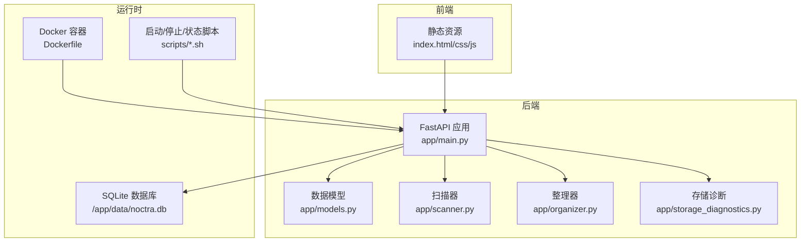
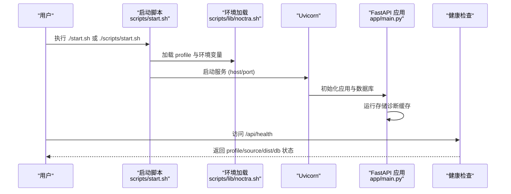
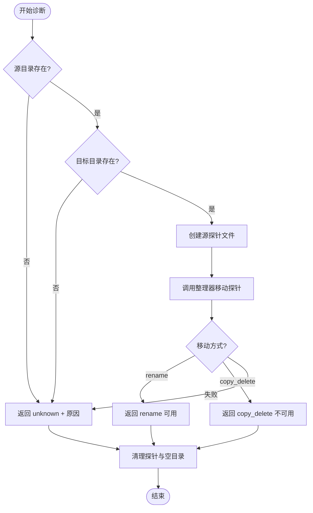
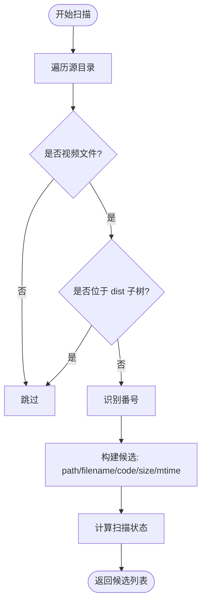
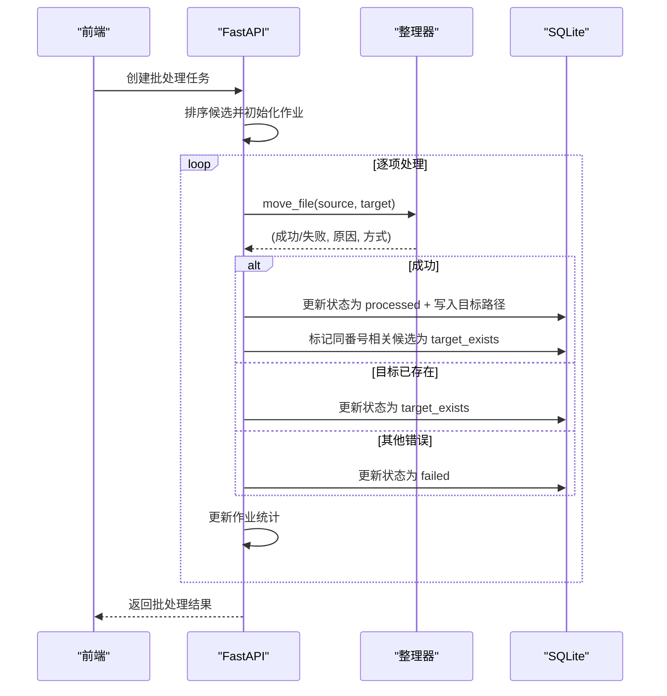
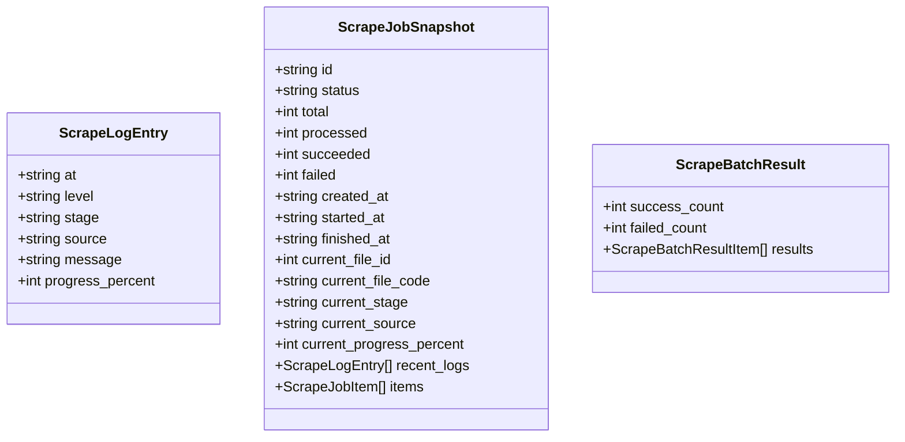
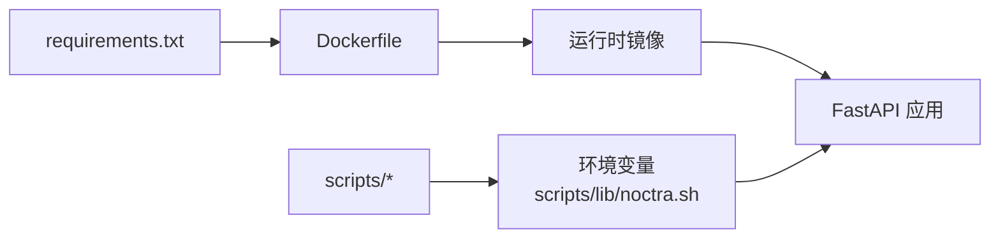

# 故障排除

<cite>
**本文引用的文件**
- [README.en.md](file://README.en.md)
- [app/main.py](file://app/main.py)
- [app/storage_diagnostics.py](file://app/storage_diagnostics.py)
- [app/organizer.py](file://app/organizer.py)
- [app/scanner.py](file://app/scanner.py)
- [app/models.py](file://app/models.py)
- [scripts/start.sh](file://scripts/start.sh)
- [scripts/stop.sh](file://scripts/stop.sh)
- [scripts/status.sh](file://scripts/status.sh)
- [scripts/lib/noctra.sh](file://scripts/lib/noctra.sh)
- [Dockerfile](file://Dockerfile)
- [requirements.txt](file://requirements.txt)
- [docs/local-startup.md](file://docs/local-startup.md)
- [docs/nas-deployment.md](file://docs/nas-deployment.md)
- [tests/test_storage_diagnostics.py](file://tests/test_storage_diagnostics.py)
- [tests/test_organizer.py](file://tests/test_organizer.py)
- [tests/test_scanner.py](file://tests/test_scanner.py)
</cite>

## 目录
1. [简介](#简介)
2. [项目结构](#项目结构)
3. [核心组件](#核心组件)
4. [架构总览](#架构总览)
5. [详细组件分析](#详细组件分析)
6. [依赖关系分析](#依赖关系分析)
7. [性能考量](#性能考量)
8. [故障排除指南](#故障排除指南)
9. [结论](#结论)
10. [附录](#附录)

## 简介
本手册面向Noctra使用者与运维人员，提供从本地开发到NAS部署的全栈故障排除流程。内容覆盖存储诊断、网络连接、Docker容器与权限配置、日志分析、调试工具与性能监控，并给出紧急恢复、数据备份与灾难恢复策略，以及问题报告模板与社区支持渠道。

## 项目结构
Noctra采用FastAPI后端与静态前端的分层设计，核心模块包括扫描器、整理器、存储诊断、批处理作业与SQLite持久化。脚本层负责本地与NAS环境的启动、停止、状态查询与部署。

**图表来源**
- [app/main.py:58-130](file://app/main.py#L58-L130)
- [app/scanner.py:8-16](file://app/scanner.py#L8-L16)
- [app/organizer.py:9-17](file://app/organizer.py#L9-L17)
- [app/storage_diagnostics.py:8-25](file://app/storage_diagnostics.py#L8-L25)
- [Dockerfile:1-31](file://Dockerfile#L1-L31)
- [scripts/start.sh:12-31](file://scripts/start.sh#L12-L31)

**章节来源**
- [README.en.md:58-72](file://README.en.md#L58-L72)
- [docs/local-startup.md:1-99](file://docs/local-startup.md#L1-L99)
- [docs/nas-deployment.md:1-125](file://docs/nas-deployment.md#L1-L125)

## 核心组件
- 扫描器：递归扫描源目录，识别番号并过滤非视频文件与目标目录。
- 整理器：生成目标路径，执行原子rename或跨盘copy+delete，保证数据一致性。
- 存储诊断：探测源/目标目录是否在同一文件系统，决定移动模式。
- API与批处理：提供扫描、组织、刮削、历史查看等接口，维护批处理作业状态。
- 配置与脚本：通过环境变量与profile文件控制路径、端口、日志与Docker参数。

**章节来源**
- [app/scanner.py:67-125](file://app/scanner.py#L67-L125)
- [app/organizer.py:139-163](file://app/organizer.py#L139-L163)
- [app/storage_diagnostics.py:8-63](file://app/storage_diagnostics.py#L8-L63)
- [app/main.py:78-125](file://app/main.py#L78-L125)
- [scripts/lib/noctra.sh:13-73](file://scripts/lib/noctra.sh#L13-L73)

## 架构总览
Noctra的运行时由“前端静态页面 + FastAPI后端 + SQLite + 存储”构成。启动流程通过脚本加载profile，启动Uvicorn服务，健康检查通过/api/health验证。

**图表来源**
- [scripts/start.sh:12-41](file://scripts/start.sh#L12-L41)
- [scripts/lib/noctra.sh:13-73](file://scripts/lib/noctra.sh#L13-L73)
- [app/main.py:127-138](file://app/main.py#L127-L138)
- [docs/local-startup.md:58-64](file://docs/local-startup.md#L58-L64)

**章节来源**
- [docs/local-startup.md:42-64](file://docs/local-startup.md#L42-L64)
- [scripts/start.sh:25-41](file://scripts/start.sh#L25-L41)

## 详细组件分析

### 存储诊断与移动模式
存储诊断通过在源/目标目录创建探针文件，调用整理器执行移动，判断是否为rename或copy_delete，从而指导批处理与UI提示。

**图表来源**
- [app/storage_diagnostics.py:8-63](file://app/storage_diagnostics.py#L8-L63)
- [app/organizer.py:139-163](file://app/organizer.py#L139-L163)

**章节来源**
- [app/storage_diagnostics.py:8-63](file://app/storage_diagnostics.py#L8-L63)
- [tests/test_storage_diagnostics.py:7-66](file://tests/test_storage_diagnostics.py#L7-L66)

### 扫描与状态判定
扫描器遍历源目录，识别番号并生成候选集；API侧根据目标路径是否存在与历史记录，计算扫描状态（pending/duplicate/target_exists/skipped）。

**图表来源**
- [app/scanner.py:67-125](file://app/scanner.py#L67-L125)
- [app/main.py:739-808](file://app/main.py#L739-L808)

**章节来源**
- [app/scanner.py:32-125](file://app/scanner.py#L32-L125)
- [app/main.py:739-808](file://app/main.py#L739-L808)
- [tests/test_scanner.py:189-221](file://tests/test_scanner.py#L189-L221)

### 批处理组织流程
批处理组织通过锁保护共享状态，逐项执行整理，区分成功/跳过/失败三类结果，并更新数据库状态与相关候选的状态。

**图表来源**
- [app/main.py:531-614](file://app/main.py#L531-L614)
- [app/organizer.py:139-163](file://app/organizer.py#L139-L163)
- [app/main.py:209-231](file://app/main.py#L209-L231)

**章节来源**
- [app/main.py:531-614](file://app/main.py#L531-L614)
- [app/organizer.py:139-163](file://app/organizer.py#L139-L163)
- [tests/test_organizer.py:138-163](file://tests/test_organizer.py#L138-L163)

### 刮削与日志结构
刮削相关的数据模型定义了日志条目、作业快照与批次结果，便于追踪阶段、进度与错误信息。

**图表来源**
- [app/models.py:106-167](file://app/models.py#L106-L167)
- [app/models.py:204-216](file://app/models.py#L204-L216)

**章节来源**
- [app/models.py:106-167](file://app/models.py#L106-L167)
- [app/models.py:204-216](file://app/models.py#L204-L216)

## 依赖关系分析
- 后端依赖：FastAPI、Uvicorn、aiosqlite、Pydantic、BeautifulSoup、lxml、aiohttp、Pillow等。
- Docker镜像基于python:3.11-slim，暴露8000端口，CMD启动Uvicorn。
- 本地脚本通过环境变量控制绑定主机、端口、源/目标/数据目录、日志与PID文件位置。

**图表来源**
- [requirements.txt:1-12](file://requirements.txt#L1-L12)
- [Dockerfile:1-31](file://Dockerfile#L1-L31)
- [scripts/lib/noctra.sh:13-73](file://scripts/lib/noctra.sh#L13-L73)

**章节来源**
- [requirements.txt:1-12](file://requirements.txt#L1-L12)
- [Dockerfile:1-31](file://Dockerfile#L1-L31)
- [scripts/lib/noctra.sh:13-73](file://scripts/lib/noctra.sh#L13-L73)

## 性能考量
- 移动策略：优先原子rename，跨盘时采用copy+delete并fsync确保落盘，减少IO开销与数据丢失风险。
- 扫描优化：递归遍历时跳过dist子树，仅处理视频扩展名，降低I/O与CPU占用。
- 批处理并发：使用锁保护作业状态，避免竞态；单线程逐项处理，简化错误恢复。
- 存储诊断：仅在启动与显式刷新时进行，避免频繁探测带来的额外开销。

**章节来源**
- [app/organizer.py:122-163](file://app/organizer.py#L122-L163)
- [app/scanner.py:21-31](file://app/scanner.py#L21-L31)
- [app/main.py:127-138](file://app/main.py#L127-L138)

## 故障排除指南

### 通用诊断步骤
- 健康检查：访问/api/health确认profile、source、dist、db路径与服务状态。
- 日志定位：查看logs/server.log，关注启动与运行期错误。
- 环境核对：确认本地或NAS profile中的SOURCE_DIR、DIST_DIR、DB_PATH、端口与代理设置。

**章节来源**
- [docs/local-startup.md:58-64](file://docs/local-startup.md#L58-L64)
- [scripts/status.sh:24-28](file://scripts/status.sh#L24-L28)
- [scripts/lib/noctra.sh:75-96](file://scripts/lib/noctra.sh#L75-L96)

### 存储诊断与移动问题
症状
- 整理时提示“目标文件已存在”或“移动失败”。
- 批处理作业全部失败或部分失败。

原因分析
- 目标路径已存在：同番号不同后缀的候选被标记为target_exists。
- 跨盘移动：源/目标不在同一文件系统，触发copy_delete。
- 权限不足：源/目标目录无读写权限，导致rename或copy失败。

解决步骤
- 确认目标路径唯一性，清理冲突文件或调整命名规则。
- 使用存储诊断接口或脚本确认当前移动模式，必要时调整挂载策略。
- 检查源/目标目录权限与磁盘空间，确保可写。

**章节来源**
- [app/main.py:531-614](file://app/main.py#L531-L614)
- [app/organizer.py:139-163](file://app/organizer.py#L139-L163)
- [app/storage_diagnostics.py:8-63](file://app/storage_diagnostics.py#L8-L63)
- [tests/test_organizer.py:73-137](file://tests/test_organizer.py#L73-L137)

### 网络连接与代理问题（NAS部署）
症状
- docker pull超时或失败。
- Watchtower无法拉取新镜像。

原因分析
- Docker守护进程未配置HTTP/HTTPS代理。
- NAS网络策略限制外网访问。

解决步骤
- 在NAS的Docker daemon.json中添加代理配置，重启Docker服务。
- 验证代理生效后重试pull与健康检查。
- 如需，为Watchtower单独设置代理参数。

**章节来源**
- [docs/nas-deployment.md:83-112](file://docs/nas-deployment.md#L83-L112)
- [docs/nas-deployment.md:113-124](file://docs/nas-deployment.md#L113-L124)

### Docker容器与权限配置
症状
- 容器启动后无法访问源/目标目录。
- 容器内无权限写入/app/data。

原因分析
- 挂载路径不正确或权限不足。
- 容器用户与宿主权限不匹配。

解决步骤
- 确认docker-compose中卷挂载路径与实际路径一致。
- 修改宿主目录权限或使用相同UID/GID运行容器。
- 使用docker inspect查看挂载与用户上下文。

**章节来源**
- [Dockerfile:23-31](file://Dockerfile#L23-L31)
- [docs/nas-deployment.md:14-24](file://docs/nas-deployment.md#L14-L24)

### 权限与路径问题（本地）
症状
- ./start.sh无法启动或启动后立即退出。
- /api/health返回路径不正确。

原因分析
- 未安装虚拟环境或依赖缺失。
- profile文件未正确加载或路径不存在。

解决步骤
- 按本地启动指南创建并激活虚拟环境，安装依赖。
- 检查config/profiles/local.env，确认路径存在且可访问。
- 使用scripts/status.sh核对当前使用的配置。

**章节来源**
- [docs/local-startup.md:32-41](file://docs/local-startup.md#L32-L41)
- [docs/local-startup.md:66-99](file://docs/local-startup.md#L66-L99)
- [scripts/status.sh:17-22](file://scripts/status.sh#L17-L22)

### 日志分析技巧
- 启动日志：查看logs/server.log最后20行，定位初始化异常。
- 运行日志：结合API请求与批处理作业状态，定位具体失败项。
- 存储诊断：关注“移动方式”字段，判断rename或copy_delete路径。

**章节来源**
- [scripts/start.sh:38-41](file://scripts/start.sh#L38-L41)
- [app/main.py:133-138](file://app/main.py#L133-L138)

### 调试工具与性能监控
- 健康检查：curl http://host:port/api/health，确认服务可用。
- 批处理监控：轮询批处理作业状态，观察processed/succeeded/skipped/failed计数。
- 性能观测：对比rename与copy_delete的耗时差异，评估跨盘影响。

**章节来源**
- [docs/local-startup.md:58-64](file://docs/local-startup.md#L58-L64)
- [app/main.py:531-614](file://app/main.py#L531-L614)

### 紧急恢复程序
- 快速停止：使用./scripts/stop.sh终止进程，清理PID文件。
- 重启服务：先./scripts/stop.sh，再./scripts/start.sh或./start.sh。
- 回滚策略：若升级后异常，回退到上一个稳定镜像或分支。

**章节来源**
- [scripts/stop.sh:11-18](file://scripts/stop.sh#L11-L18)
- [scripts/start.sh:14-17](file://scripts/start.sh#L14-L17)

### 数据备份与灾难恢复
- 备份策略：定期复制/app/data/noctra.db至安全位置。
- 恢复流程：停止服务，替换noctra.db为备份副本，启动服务并验证/api/health。
- 灾难恢复：若数据库损坏，使用最近一次备份恢复；如需重建表结构，确保迁移逻辑已执行。

**章节来源**
- [app/main.py:78-99](file://app/main.py#L78-L99)
- [app/main.py:101-125](file://app/main.py#L101-L125)

### 问题报告模板
请在提交问题前填写以下信息：
- 环境信息：操作系统、Python版本、Docker版本、Noctra版本/分支。
- 部署方式：本地/容器/NAS，挂载方式（rename/copy_delete）。
- 复现步骤：最小化操作序列，包含涉及的源/目标路径。
- 日志片段：附上关键错误前后20行日志。
- 期望行为与实际行为：简明对比。
- 附加信息：截图、配置文件片段、网络代理设置等。

### 社区支持渠道
- 文档与仓库：参考README与相关文档，提交Issue前先搜索历史讨论。
- 本地与NAS部署：按文档指引核对配置与网络代理。

**章节来源**
- [README.en.md:81-87](file://README.en.md#L81-L87)
- [docs/local-startup.md:1-19](file://docs/local-startup.md#L1-L19)
- [docs/nas-deployment.md:1-14](file://docs/nas-deployment.md#L1-L14)

## 结论
通过系统化的存储诊断、网络代理校验、容器与权限核查、日志与性能监控，可高效定位并解决Noctra在本地与NAS环境中的常见问题。建议将健康检查与存储诊断纳入日常巡检，配合定期备份与回滚策略，保障数据安全与服务连续性。

## 附录

### 常见错误与对应处理
- 源目录不存在：检查路径与权限，确保存在且可读。
- 目标目录不存在：自动创建，但需确保父目录可写。
- rename失败（EXDEV）：切换到共享根挂载或接受copy_delete。
- 权限不足：修正宿主目录权限或使用合适用户运行容器。

**章节来源**
- [app/storage_diagnostics.py:12-24](file://app/storage_diagnostics.py#L12-L24)
- [app/organizer.py:139-163](file://app/organizer.py#L139-L163)
- [tests/test_storage_diagnostics.py:36-44](file://tests/test_storage_diagnostics.py#L36-L44)