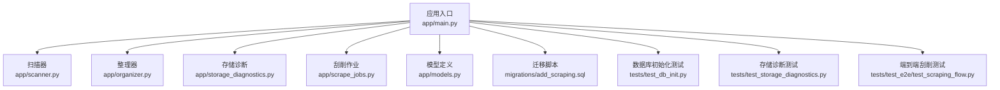
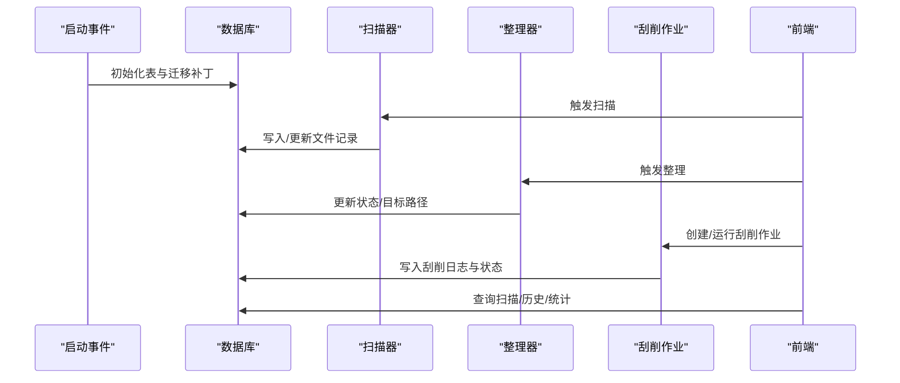
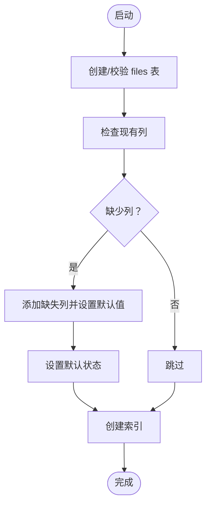
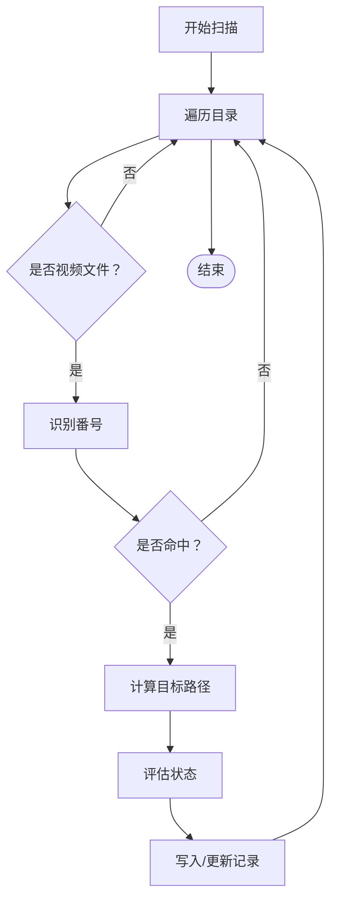
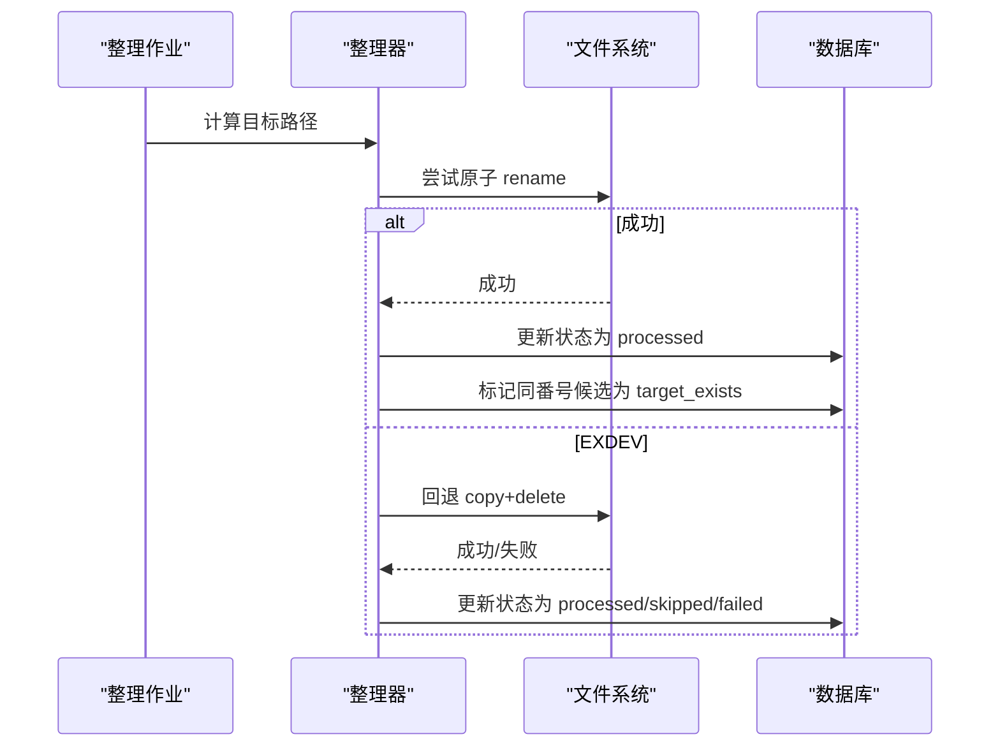
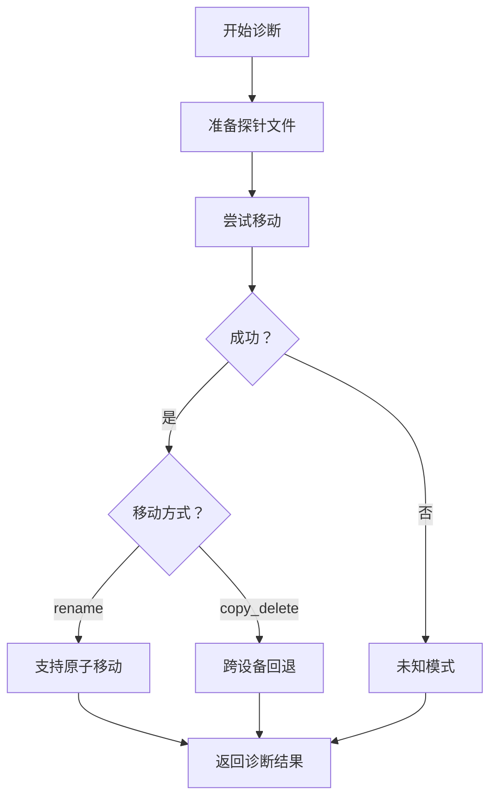
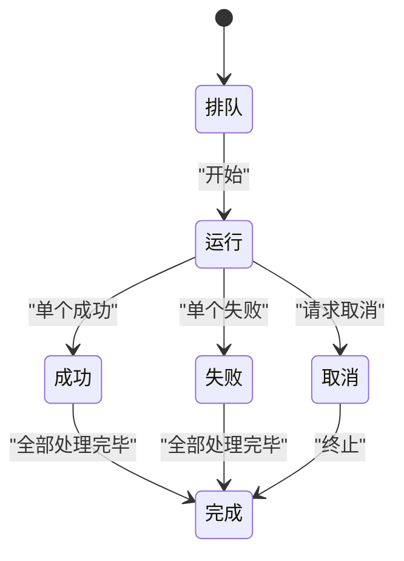
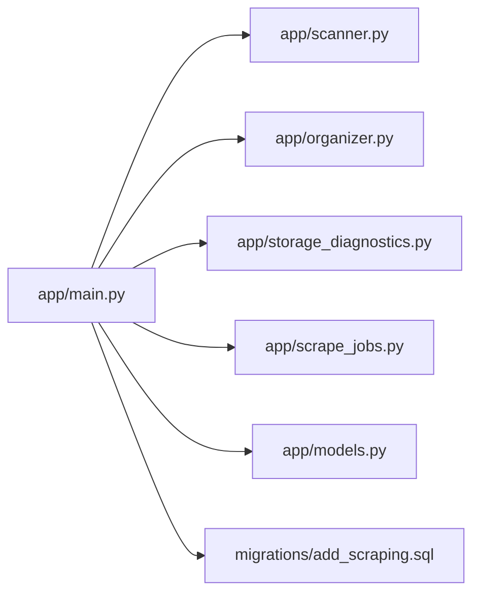

# 数据完整性问题

<cite>
**本文引用的文件**
- [app/main.py](file://app/main.py)
- [app/models.py](file://app/models.py)
- [app/scanner.py](file://app/scanner.py)
- [app/organizer.py](file://app/organizer.py)
- [app/storage_diagnostics.py](file://app/storage_diagnostics.py)
- [app/scrape_jobs.py](file://app/scrape_jobs.py)
- [migrations/add_scraping.sql](file://migrations/add_scraping.sql)
- [tests/test_db_init.py](file://tests/test_db_init.py)
- [tests/test_storage_diagnostics.py](file://tests/test_storage_diagnostics.py)
- [tests/test_e2e/test_scraping_flow.py](file://tests/test_e2e/test_scraping_flow.py)
</cite>

## 目录
1. [简介](#简介)
2. [项目结构](#项目结构)
3. [核心组件](#核心组件)
4. [架构总览](#架构总览)
5. [详细组件分析](#详细组件分析)
6. [依赖关系分析](#依赖关系分析)
7. [性能考量](#性能考量)
8. [故障排除指南](#故障排除指南)
9. [结论](#结论)
10. [附录](#附录)

## 简介
本手册聚焦于数据完整性问题的系统化故障排除，覆盖数据库连接失败、表结构不一致、数据丢失、元数据损坏、数据库迁移问题、数据验证失败、备份与恢复流程、SQL 查询调试方法、数据一致性检查与修复策略，并针对不同数据库系统的差异给出通用建议与实践要点。

## 项目结构
该项目围绕 SQLite 数据库存储文件扫描、整理与刮削元数据，核心模块包括：
- 应用入口与数据库初始化：负责表结构创建与迁移补丁
- 扫描器：负责扫描源目录并识别番号
- 整理器：负责将文件移动到目标目录，支持原子 rename 与跨设备回退
- 存储诊断：探测当前部署的移动模式（rename 或 copy+delete）
- 刮削作业：批量化管理刮削任务与进度日志
- 迁移脚本：提供结构变更与验证查询

**图表来源**
- [app/main.py:78-125](file://app/main.py#L78-L125)
- [app/scanner.py:67-125](file://app/scanner.py#L67-L125)
- [app/organizer.py:139-163](file://app/organizer.py#L139-L163)
- [app/storage_diagnostics.py:8-63](file://app/storage_diagnostics.py#L8-L63)
- [app/scrape_jobs.py:146-256](file://app/scrape_jobs.py#L146-L256)
- [migrations/add_scraping.sql:1-17](file://migrations/add_scraping.sql#L1-L17)
- [tests/test_db_init.py:10-82](file://tests/test_db_init.py#L10-L82)
- [tests/test_storage_diagnostics.py:7-66](file://tests/test_storage_diagnostics.py#L7-L66)
- [tests/test_e2e/test_scraping_flow.py:245-331](file://tests/test_e2e/test_scraping_flow.py#L245-L331)

**章节来源**
- [app/main.py:78-125](file://app/main.py#L78-L125)
- [app/scanner.py:67-125](file://app/scanner.py#L67-L125)
- [app/organizer.py:139-163](file://app/organizer.py#L139-L163)
- [app/storage_diagnostics.py:8-63](file://app/storage_diagnostics.py#L8-L63)
- [app/scrape_jobs.py:146-256](file://app/scrape_jobs.py#L146-L256)
- [migrations/add_scraping.sql:1-17](file://migrations/add_scraping.sql#L1-L17)
- [tests/test_db_init.py:10-82](file://tests/test_db_init.py#L10-L82)
- [tests/test_storage_diagnostics.py:7-66](file://tests/test_storage_diagnostics.py#L7-L66)
- [tests/test_e2e/test_scraping_flow.py:245-331](file://tests/test_e2e/test_scraping_flow.py#L245-L331)

## 核心组件
- 数据库初始化与迁移
  - 启动时自动创建 files 表与刮削相关列，保证向后兼容
  - 提供迁移脚本与测试用例验证
- 扫描与识别
  - 扫描源目录，识别番号并计算目标路径
  - 跳过 dist 目录及其子目录，避免循环扫描
- 整理与移动
  - 优先原子 rename；跨设备时回退为 copy+delete
  - 严格的目标存在性检查与幂等更新
- 存储诊断
  - 探测当前部署的移动模式，便于定位性能与可靠性问题
- 刮削作业
  - 任务队列、进度百分比、最近日志、取消与完成状态管理
- 模型与序列化
  - Pydantic 模型用于 API 请求/响应与日志结构

**章节来源**
- [app/main.py:78-125](file://app/main.py#L78-L125)
- [app/main.py:101-124](file://app/main.py#L101-L124)
- [app/scanner.py:67-125](file://app/scanner.py#L67-L125)
- [app/organizer.py:139-163](file://app/organizer.py#L139-L163)
- [app/storage_diagnostics.py:8-63](file://app/storage_diagnostics.py#L8-L63)
- [app/scrape_jobs.py:146-256](file://app/scrape_jobs.py#L146-L256)
- [app/models.py:106-216](file://app/models.py#L106-L216)

## 架构总览
应用采用事件驱动与异步 IO，核心数据流如下：
- 启动事件触发数据库初始化与存储诊断
- 扫描器遍历源目录，构建候选集合并写入数据库
- 整理器按候选集执行移动，更新状态并标记重复项
- 刮削作业读取候选集，逐项抓取元数据并持久化日志
- 前端通过 API 获取扫描、历史、刮削快照与统计

**图表来源**
- [app/main.py:127-130](file://app/main.py#L127-L130)
- [app/main.py:78-99](file://app/main.py#L78-L99)
- [app/main.py:101-124](file://app/main.py#L101-L124)
- [app/scanner.py:67-125](file://app/scanner.py#L67-L125)
- [app/organizer.py:139-163](file://app/organizer.py#L139-L163)
- [app/scrape_jobs.py:146-256](file://app/scrape_jobs.py#L146-L256)

## 详细组件分析

### 数据库初始化与迁移
- 启动时创建 files 表，包含唯一约束与时间戳字段
- 自动补齐刮削相关列（状态、时间、阶段、来源、错误、日志），并创建索引
- 迁移脚本提供结构变更与计数验证
- 单元测试验证旧数据库在启动时自动补齐列并保持数据一致性

**图表来源**
- [app/main.py:78-99](file://app/main.py#L78-L99)
- [app/main.py:101-124](file://app/main.py#L101-L124)
- [migrations/add_scraping.sql:1-17](file://migrations/add_scraping.sql#L1-L17)
- [tests/test_db_init.py:10-82](file://tests/test_db_init.py#L10-L82)

**章节来源**
- [app/main.py:78-125](file://app/main.py#L78-L125)
- [migrations/add_scraping.sql:1-17](file://migrations/add_scraping.sql#L1-L17)
- [tests/test_db_init.py:10-82](file://tests/test_db_init.py#L10-L82)

### 扫描与识别
- 扫描源目录，过滤非视频文件与 dist 目录
- 使用正则识别番号，去除尾部标记（如 -C/-UC/C/UC）与干扰词
- 计算目标路径并评估状态（待处理/重复/已存在）

**图表来源**
- [app/scanner.py:67-125](file://app/scanner.py#L67-L125)
- [app/main.py:789-800](file://app/main.py#L789-L800)

**章节来源**
- [app/scanner.py:67-125](file://app/scanner.py#L67-L125)
- [app/main.py:789-800](file://app/main.py#L789-L800)

### 整理与移动
- 生成目标路径并创建目录
- 优先原子 rename；跨设备报 EXDEV 时回退为 copy+delete
- 目标已存在则跳过；其他错误记录失败原因
- 更新数据库状态并标记相关重复项为“已存在”

**图表来源**
- [app/organizer.py:139-163](file://app/organizer.py#L139-L163)
- [app/organizer.py:98-121](file://app/organizer.py#L98-L121)
- [app/main.py:568-591](file://app/main.py#L568-L591)

**章节来源**
- [app/organizer.py:139-163](file://app/organizer.py#L139-L163)
- [app/organizer.py:98-121](file://app/organizer.py#L98-L121)
- [app/main.py:568-591](file://app/main.py#L568-L591)

### 存储诊断
- 通过在源/目标目录写探针文件并尝试移动，判断是否支持原子 rename
- 返回模式（rename/copy_delete/unknown）与原因
- 测试覆盖 EXDEV 场景与缺失目录场景

**图表来源**
- [app/storage_diagnostics.py:8-63](file://app/storage_diagnostics.py#L8-L63)
- [tests/test_storage_diagnostics.py:7-66](file://tests/test_storage_diagnostics.py#L7-L66)

**章节来源**
- [app/storage_diagnostics.py:8-63](file://app/storage_diagnostics.py#L8-L63)
- [tests/test_storage_diagnostics.py:7-66](file://tests/test_storage_diagnostics.py#L7-L66)

### 刮削作业与日志
- 作业状态：排队/运行/完成/失败/取消
- 逐项推进阶段进度，记录最近日志
- 支持取消与完成时的状态收敛

**图表来源**
- [app/scrape_jobs.py:146-256](file://app/scrape_jobs.py#L146-L256)

**章节来源**
- [app/scrape_jobs.py:146-256](file://app/scrape_jobs.py#L146-L256)

## 依赖关系分析
- 组件耦合
  - app/main.py 作为中枢，依赖扫描器、整理器、存储诊断与刮削作业
  - 数据库连接集中在主模块，其他模块通过主模块提供的接口访问
- 外部依赖
  - aiosqlite 用于异步 SQLite 访问
  - Pydantic 用于数据模型与序列化
- 潜在风险
  - 数据库锁竞争（批处理与作业并发）
  - 跨设备移动的性能与可靠性差异

**图表来源**
- [app/main.py:18-50](file://app/main.py#L18-L50)
- [app/scanner.py:1-10](file://app/scanner.py#L1-L10)
- [app/organizer.py:1-10](file://app/organizer.py#L1-L10)
- [app/storage_diagnostics.py:1-10](file://app/storage_diagnostics.py#L1-L10)
- [app/scrape_jobs.py:1-10](file://app/scrape_jobs.py#L1-L10)
- [app/models.py:1-10](file://app/models.py#L1-L10)
- [migrations/add_scraping.sql:1-17](file://migrations/add_scraping.sql#L1-L17)

**章节来源**
- [app/main.py:18-50](file://app/main.py#L18-L50)

## 性能考量
- 异步 IO 与原子操作
  - 使用 aiosqlite 降低阻塞
  - 优先 rename，减少磁盘写放大
- 索引与查询
  - 为 scrape_status 建立索引，加速筛选
- 批处理与并发
  - 批作业与刮削作业使用锁保护共享状态
- 跨设备回退
  - EXDEV 时采用 copy+delete，确保一致性但增加 IO

[本节为通用指导，无需具体文件引用]

## 故障排除指南

### 数据库连接失败
- 症状
  - 启动时报连接错误或无法创建表
- 排查步骤
  - 检查 DB_PATH 环境变量与权限
  - 确认数据库目录存在且可写
  - 查看启动事件是否成功执行初始化
- 修复建议
  - 修正环境变量或手动创建目录
  - 使用迁移脚本验证结构

**章节来源**
- [app/main.py:78-99](file://app/main.py#L78-L99)
- [app/main.py:127-130](file://app/main.py#L127-L130)
- [migrations/add_scraping.sql:1-17](file://migrations/add_scraping.sql#L1-L17)

### 表结构不一致
- 症状
  - 新版本启动后缺少刮削相关列
- 排查步骤
  - 启动时自动补齐列并设置默认值
  - 迁移脚本验证列存在与计数
- 修复建议
  - 重启应用以触发自动补齐
  - 手动执行迁移脚本并核对结果

**章节来源**
- [app/main.py:101-124](file://app/main.py#L101-L124)
- [migrations/add_scraping.sql:1-17](file://migrations/add_scraping.sql#L1-L17)
- [tests/test_db_init.py:10-82](file://tests/test_db_init.py#L10-L82)

### 数据丢失
- 症状
  - 文件移动后源文件消失或目标文件缺失
- 排查步骤
  - 检查存储诊断模式（rename/copy_delete）
  - 核对目标路径是否存在
  - 查看整理日志与状态
- 修复建议
  - 若为 rename，确认文件系统边界
  - 若为 copy_delete，确认磁盘空间与权限
  - 重试整理或回滚至上次备份

**章节来源**
- [app/storage_diagnostics.py:8-63](file://app/storage_diagnostics.py#L8-L63)
- [app/organizer.py:139-163](file://app/organizer.py#L139-L163)
- [tests/test_storage_diagnostics.py:7-66](file://tests/test_storage_diagnostics.py#L7-L66)

### 元数据损坏
- 症状
  - 刮削日志 JSON 解析失败或字段为空
- 排查步骤
  - 检查 scrape_logs 字段的 JSON 结构
  - 核对日志解析函数的容错逻辑
- 修复建议
  - 重建刮削作业或清理损坏的日志字段
  - 重新抓取元数据

**章节来源**
- [app/main.py:242-259](file://app/main.py#L242-L259)
- [app/models.py:106-131](file://app/models.py#L106-L131)

### 数据验证失败
- 症状
  - 文件无番号或无目标路径导致无法刮削
- 排查步骤
  - 核对扫描结果与状态
  - 检查番号识别规则与尾缀标记
- 修复建议
  - 修正文件命名或手动补充番号
  - 重新扫描并更新状态

**章节来源**
- [app/scanner.py:32-66](file://app/scanner.py#L32-L66)
- [app/main.py:789-800](file://app/main.py#L789-L800)

### 备份与恢复流程
- 备份
  - 备份 noctra.db 文件
  - 备份源/目标目录结构
- 恢复
  - 停止服务，替换数据库文件
  - 校验扫描与整理状态
  - 重新运行刮削作业（如需）

[本节为通用指导，无需具体文件引用]

### SQL 查询调试方法
- 常用查询
  - 查询文件总数与状态分布
  - 按番号排序查询已整理记录
  - 统计刮削成功/失败数量
- 端到端测试中的同步查询示例
  - 直接连接数据库进行断言
  - 使用参数化查询防止注入

**章节来源**
- [tests/test_e2e/test_scraping_flow.py:245-331](file://tests/test_e2e/test_scraping_flow.py#L245-L331)

### 数据一致性检查与修复策略
- 一致性检查
  - 校验唯一约束（original_path）
  - 校验状态枚举与索引
  - 校验刮削日志 JSON 结构
- 修复策略
  - 使用迁移脚本补齐列
  - 重置状态或删除异常记录后重新扫描
  - 修复存储诊断模式导致的移动失败

**章节来源**
- [app/main.py:78-99](file://app/main.py#L78-L99)
- [app/main.py:101-124](file://app/main.py#L101-L124)
- [app/main.py:242-259](file://app/main.py#L242-L259)

### 不同数据库系统的特定问题与解决方案
- SQLite
  - 优点：零配置、嵌入式、事务强一致
  - 限制：并发写入受限、无在线热备工具链
  - 建议：定期备份、使用 WAL/FTS 扩展（视需求）
- MySQL/PostgreSQL
  - 优点：成熟的备份/恢复工具链、更强的并发能力
  - 限制：需要额外运维与资源
  - 建议：使用逻辑/物理备份、主从复制、定期校验

[本节为通用指导，无需具体文件引用]

## 结论
通过启动时自动迁移、存储诊断与严格的幂等更新，系统在 SQLite 环境下实现了较好的数据完整性保障。建议在生产环境中配合定期备份、监控存储诊断模式变化与日志解析异常，以进一步提升可靠性与可维护性。

## 附录
- 关键接口与路径
  - 数据库初始化与迁移：[app/main.py:78-125](file://app/main.py#L78-L125)，[migrations/add_scraping.sql:1-17](file://migrations/add_scraping.sql#L1-L17)
  - 扫描与识别：[app/scanner.py:67-125](file://app/scanner.py#L67-L125)
  - 整理与移动：[app/organizer.py:139-163](file://app/organizer.py#L139-L163)
  - 存储诊断：[app/storage_diagnostics.py:8-63](file://app/storage_diagnostics.py#L8-L63)
  - 刮削作业：[app/scrape_jobs.py:146-256](file://app/scrape_jobs.py#L146-L256)
  - 日志解析：[app/main.py:242-259](file://app/main.py#L242-L259)
  - 端到端测试查询：[tests/test_e2e/test_scraping_flow.py:245-331](file://tests/test_e2e/test_scraping_flow.py#L245-L331)