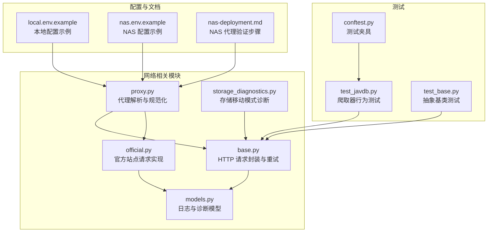
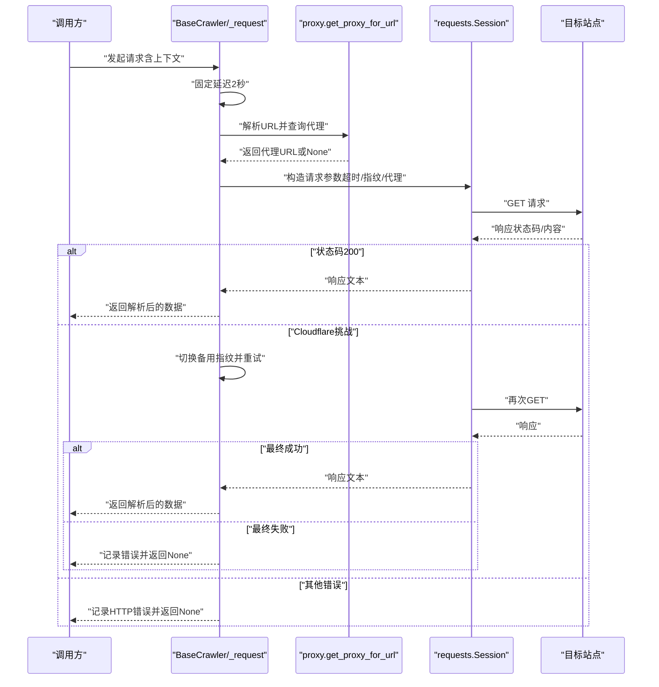
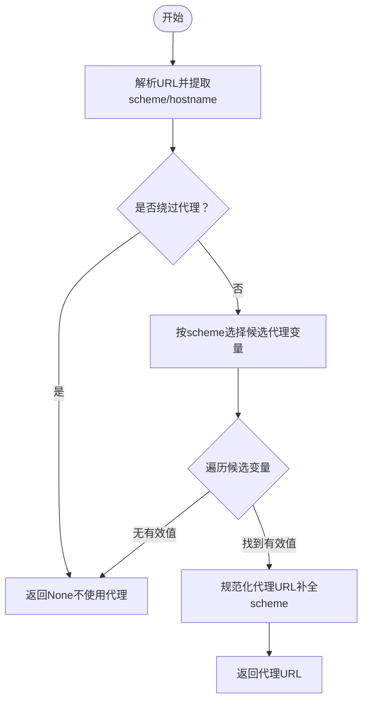
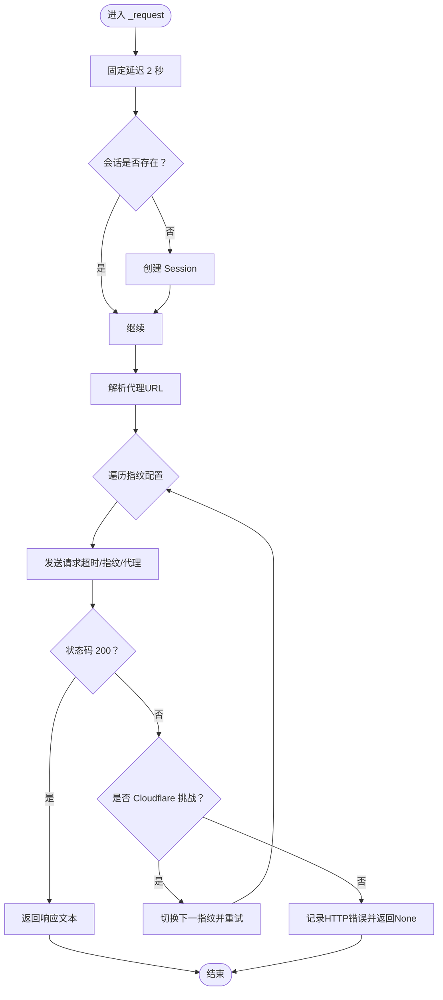
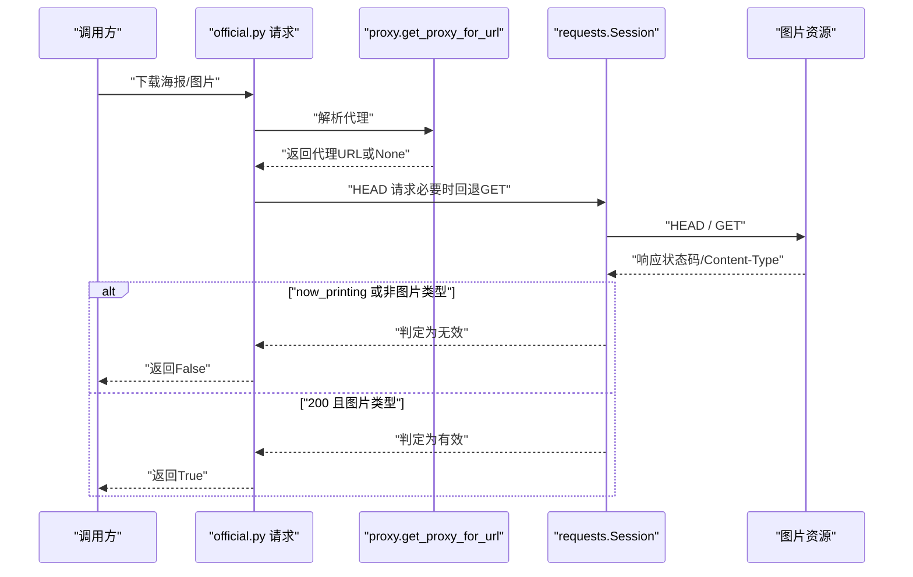
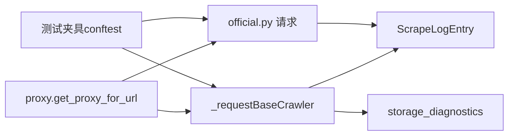

# 网络连接问题

<cite>
**本文引用的文件**
- [app/scrapers/proxy.py](file://app/scrapers/proxy.py)
- [app/scrapers/base.py](file://app/scrapers/base.py)
- [app/scrapers/official.py](file://app/scrapers/official.py)
- [app/models.py](file://app/models.py)
- [app/storage_diagnostics.py](file://app/storage_diagnostics.py)
- [config/profiles/local.env.example](file://config/profiles/local.env.example)
- [config/profiles/nas.env.example](file://config/profiles/nas.env.example)
- [docs/nas-deployment.md](file://docs/nas-deployment.md)
- [tests/test_scrapers/test_javdb.py](file://tests/test_scrapers/test_javdb.py)
- [tests/test_scrapers/test_base.py](file://tests/test_scrapers/test_base.py)
- [tests/conftest.py](file://tests/conftest.py)
</cite>

## 目录
1. [简介](#简介)
2. [项目结构](#项目结构)
3. [核心组件](#核心组件)
4. [架构总览](#架构总览)
5. [详细组件分析](#详细组件分析)
6. [依赖关系分析](#依赖关系分析)
7. [性能考量](#性能考量)
8. [故障排除指南](#故障排除指南)
9. [结论](#结论)
10. [附录](#附录)

## 简介
本指南聚焦于网络连接相关问题的专项故障排除，覆盖代理配置错误、DNS 解析失败、防火墙阻断、SSL 证书问题等常见场景，并结合项目中的代理辅助模块、HTTP 请求封装与重试策略、日志与诊断信息，给出可操作的排查步骤与优化建议。同时提供网络连通性测试方法、抓包分析技巧与流量监控工具使用建议，并针对不同地区网络环境下的特殊配置与绕过限制方法进行说明。

## 项目结构
围绕网络连接问题的关键文件与职责如下：
- 代理辅助模块：负责从环境变量解析并规范化代理地址，按 URL scheme 选择合适的代理变量。
- HTTP 请求封装：统一的请求流程，包含固定延迟、浏览器指纹模拟、超时控制、代理注入、Cloudflare 挑战检测与回退策略。
- 官方站点爬取器：基于 requests.Session 的请求实现，包含超时、重试、代理注入与严格 SSL 关闭。
- 配置示例：本地与 NAS 环境的端口、代理、镜像源等配置样例。
- 存储诊断：用于探测容器内文件系统移动模式，间接影响网络与存储协同。
- 文档与测试：NAS 部署文档中的代理验证步骤、测试夹具对第三方依赖的模拟。

**图表来源**
- [app/scrapers/proxy.py:1-65](file://app/scrapers/proxy.py#L1-L65)
- [app/scrapers/base.py:1-204](file://app/scrapers/base.py#L1-L204)
- [app/scrapers/official.py:176-268](file://app/scrapers/official.py#L176-L268)
- [app/models.py:106-131](file://app/models.py#L106-L131)
- [app/storage_diagnostics.py:1-63](file://app/storage_diagnostics.py#L1-L63)
- [config/profiles/local.env.example:1-23](file://config/profiles/local.env.example#L1-L23)
- [config/profiles/nas.env.example:1-44](file://config/profiles/nas.env.example#L1-L44)
- [docs/nas-deployment.md:93-125](file://docs/nas-deployment.md#L93-L125)
- [tests/test_scrapers/test_javdb.py:1-549](file://tests/test_scrapers/test_javdb.py#L1-L549)
- [tests/test_scrapers/test_base.py:1-11](file://tests/test_scrapers/test_base.py#L1-L11)
- [tests/conftest.py:1-19](file://tests/conftest.py#L1-L19)

**章节来源**
- [app/scrapers/proxy.py:1-65](file://app/scrapers/proxy.py#L1-L65)
- [app/scrapers/base.py:1-204](file://app/scrapers/base.py#L1-L204)
- [app/scrapers/official.py:176-268](file://app/scrapers/official.py#L176-L268)
- [app/models.py:106-131](file://app/models.py#L106-L131)
- [app/storage_diagnostics.py:1-63](file://app/storage_diagnostics.py#L1-L63)
- [config/profiles/local.env.example:1-23](file://config/profiles/local.env.example#L1-L23)
- [config/profiles/nas.env.example:1-44](file://config/profiles/nas.env.example#L1-L44)
- [docs/nas-deployment.md:93-125](file://docs/nas-deployment.md#L93-L125)
- [tests/test_scrapers/test_javdb.py:1-549](file://tests/test_scrapers/test_javdb.py#L1-L549)
- [tests/test_scrapers/test_base.py:1-11](file://tests/test_scrapers/test_base.py#L1-L11)
- [tests/conftest.py:1-19](file://tests/conftest.py#L1-L19)

## 核心组件
- 代理解析与规范化
  - 支持从环境变量读取代理值，自动补全 scheme 并判断是否绕过代理。
  - 按 URL scheme 优先级选择 HTTPS/HTTP/ALL 代理变量。
- HTTP 请求封装与重试
  - 统一使用 requests.Session，内置固定延迟、超时、浏览器指纹模拟、代理注入。
  - 遇到 Cloudflare 挑战时自动切换备用浏览器指纹配置并重试。
  - 记录诊断日志，便于定位网络与反爬问题。
- 官方站点请求实现
  - 显式超时、重试次数与延迟、关闭严格 SSL 校验、代理注入。
- 日志与诊断模型
  - 使用 ScrapeLogEntry 结构化记录阶段、级别、消息与进度，便于问题追踪。
- 存储诊断
  - 探测容器内文件系统移动模式，辅助判断网络与存储协同问题。

**章节来源**
- [app/scrapers/proxy.py:8-64](file://app/scrapers/proxy.py#L8-L64)
- [app/scrapers/base.py:124-204](file://app/scrapers/base.py#L124-L204)
- [app/scrapers/official.py:176-268](file://app/scrapers/official.py#L176-L268)
- [app/models.py:106-131](file://app/models.py#L106-L131)
- [app/storage_diagnostics.py:8-63](file://app/storage_diagnostics.py#L8-L63)

## 架构总览
下图展示了网络相关组件之间的交互关系与数据流：

**图表来源**
- [app/scrapers/base.py:124-204](file://app/scrapers/base.py#L124-L204)
- [app/scrapers/proxy.py:27-64](file://app/scrapers/proxy.py#L27-L64)

## 详细组件分析

### 代理解析与规范化（proxy.py）
- 功能要点
  - 规范化输入：支持“host:port”或完整 URL，自动补全 scheme。
  - 绕过判断：依据主机名判断是否应绕过代理。
  - 变量优先级：按 scheme 选择 HTTPS/HTTP/ALL 代理变量，确保正确匹配。
- 典型问题
  - 环境变量拼写错误（大小写不一致）、值为空或仅空白字符。
  - 未设置 ALL_PROXY 导致非 HTTPS URL 未命中代理。
  - 代理地址缺少 scheme，导致无法识别。
- 排查建议
  - 使用统一的代理解析函数校验环境变量值。
  - 在目标站点访问前后对比代理变量与解析结果。
  - 针对特定域名启用绕过，避免不必要的代理转发。

**图表来源**
- [app/scrapers/proxy.py:27-64](file://app/scrapers/proxy.py#L27-L64)

**章节来源**
- [app/scrapers/proxy.py:8-64](file://app/scrapers/proxy.py#L8-L64)

### HTTP 请求封装与重试（base.py）
- 功能要点
  - 固定延迟：降低请求频率，缓解目标站点限流与反爬压力。
  - 超时控制：统一超时时间，避免长时间阻塞。
  - 代理注入：自动从环境变量解析并注入代理。
  - 浏览器指纹模拟：多套配置轮换，应对 Cloudflare 挑战。
  - Cloudflare 检测与回退：识别挑战页面后切换指纹并重试。
  - 诊断记录：结构化日志，包含阶段、级别、消息与进度。
- 典型问题
  - 超时过短导致频繁失败。
  - 未启用代理导致访问受限区域站点失败。
  - 严格 SSL 校验导致自签证书或中间证书链问题。
  - 多次重试未切换指纹导致持续挑战。
- 排查建议
  - 逐步增加超时时间，观察成功率变化。
  - 在测试环境中开启代理并验证连通性。
  - 临时关闭严格 SSL 校验以排除证书链问题。
  - 查看诊断日志，确认是否触发 Cloudflare 挑战与指纹切换。

**图表来源**
- [app/scrapers/base.py:124-204](file://app/scrapers/base.py#L124-L204)

**章节来源**
- [app/scrapers/base.py:124-204](file://app/scrapers/base.py#L124-L204)
- [app/models.py:106-131](file://app/models.py#L106-L131)

### 官方站点请求实现（official.py）
- 功能要点
  - 显式超时、重试次数与延迟、关闭严格 SSL 校验、代理注入。
  - 图片链接有效性检查：HEAD/GET 双通道，过滤特定返回。
- 典型问题
  - 站点返回 405 Method Not Allowed，需回退为 GET。
  - 图片链接返回 now_printing，视为无效。
  - 代理未生效导致图片下载失败。
- 排查建议
  - 在请求前打印代理与超时配置，确认注入成功。
  - 对图片链接分别尝试 HEAD 与 GET，观察返回差异。
  - 使用抓包工具对比代理转发前后请求头与响应状态。

**图表来源**
- [app/scrapers/official.py:176-268](file://app/scrapers/official.py#L176-L268)

**章节来源**
- [app/scrapers/official.py:176-268](file://app/scrapers/official.py#L176-L268)

### 配置示例与环境变量（local.env.example / nas.env.example）
- 本地与 NAS 环境均提供端口绑定、数据目录、代理与镜像源等配置示例。
- NAS 示例中包含 HTTP/HTTPS 代理与 Watchtower 代理配置项，便于跨平台一致性。
- 建议在部署前核对并按需覆盖默认值，确保与实际网络环境匹配。

**章节来源**
- [config/profiles/local.env.example:1-23](file://config/profiles/local.env.example#L1-L23)
- [config/profiles/nas.env.example:1-44](file://config/profiles/nas.env.example#L1-L44)

### 存储诊断（storage_diagnostics.py）
- 通过在源与目标目录间执行一次移动探测，判断是否可使用原子 rename，从而影响后续组织与网络协同策略。
- 若探测失败或不可用，可能提示需要使用复制+删除的方式，间接影响网络传输与缓存策略。

**章节来源**
- [app/storage_diagnostics.py:8-63](file://app/storage_diagnostics.py#L8-L63)

## 依赖关系分析
- 组件耦合
  - BaseCrawler 依赖 proxy.get_proxy_for_url 注入代理。
  - BaseCrawler 与 OfficialCrawler 共享统一的日志模型与请求策略。
  - 测试夹具通过模拟第三方依赖，保证网络层测试的稳定性。
- 外部依赖
  - curl_cffi.requests 用于浏览器指纹模拟与请求封装。
  - requests.Session 作为底层 HTTP 客户端。
- 潜在风险
  - 代理变量缺失或格式错误会导致请求直连，引发地域限制与反爬拦截。
  - 严格 SSL 校验与证书链问题可能导致 HTTPS 连接失败。

**图表来源**
- [app/scrapers/proxy.py:27-64](file://app/scrapers/proxy.py#L27-L64)
- [app/scrapers/base.py:124-204](file://app/scrapers/base.py#L124-L204)
- [app/scrapers/official.py:176-268](file://app/scrapers/official.py#L176-L268)
- [app/models.py:106-131](file://app/models.py#L106-L131)
- [app/storage_diagnostics.py:8-63](file://app/storage_diagnostics.py#L8-L63)
- [tests/conftest.py:1-19](file://tests/conftest.py#L1-L19)

**章节来源**
- [app/scrapers/proxy.py:1-65](file://app/scrapers/proxy.py#L1-L65)
- [app/scrapers/base.py:1-204](file://app/scrapers/base.py#L1-L204)
- [app/scrapers/official.py:176-268](file://app/scrapers/official.py#L176-L268)
- [app/models.py:106-131](file://app/models.py#L106-L131)
- [app/storage_diagnostics.py:1-63](file://app/storage_diagnostics.py#L1-L63)
- [tests/conftest.py:1-19](file://tests/conftest.py#L1-L19)

## 性能考量
- 请求节流：固定延迟有助于降低反爬压力，但会增加整体耗时。可根据目标站点限速策略调整。
- 超时与重试：合理设置超时与重试间隔，避免在网络波动时过度占用资源。
- 代理与证书：在保证安全的前提下，适当放宽证书校验可减少握手失败带来的重试成本。
- 会话复用：统一使用 Session 可减少 TCP/TLS 握手开销，提升并发效率。

## 故障排除指南

### 代理配置错误
- 症状
  - 访问受限站点失败，或代理未生效。
- 排查步骤
  - 校验环境变量：HTTPS_PROXY/https_proxy/ALL_PROXY/all_proxy/HTTP_PROXY/http_proxy 是否正确设置。
  - 使用代理解析函数验证规范化结果，确认 scheme 与主机端口正确。
  - 针对特定域名启用绕过，避免误走代理。
- 修复建议
  - 在部署配置中统一设置 ALL_PROXY，并按需补充 HTTPS_PROXY/HTTP_PROXY。
  - 在容器或 NAS 的 Docker 配置中添加代理，参考 NAS 部署文档中的验证步骤。

**章节来源**
- [app/scrapers/proxy.py:27-64](file://app/scrapers/proxy.py#L27-L64)
- [docs/nas-deployment.md:93-125](file://docs/nas-deployment.md#L93-L125)
- [config/profiles/nas.env.example:28-38](file://config/profiles/nas.env.example#L28-L38)

### DNS 解析失败
- 症状
  - 域名无法解析，请求超时或报错。
- 排查步骤
  - 使用 nslookup/dig/host 等工具验证域名解析。
  - 更换系统 DNS（如 8.8.8.8/114.114.114.114），确认是否为 DNS 服务商问题。
  - 在容器内使用 nslookup 或 curl 验证内部 DNS。
- 修复建议
  - 在容器运行时指定 --add-host 或使用自定义 resolv.conf。
  - 如为企业网络，联系 IT 提供可访问的上游 DNS。

### 防火墙阻断
- 症状
  - 仅部分端口可访问，或特定域名被阻断。
- 排查步骤
  - 使用 telnet/nmap 测试端口连通性。
  - 通过代理或 VPN 尝试访问，确认是否为本地防火墙策略。
- 修复建议
  - 在防火墙策略中放行所需端口与域名。
  - 使用合规代理或隧道服务绕过限制。

### SSL 证书问题
- 症状
  - HTTPS 连接失败，提示证书链错误或不受信任。
- 排查步骤
  - 使用 openssl s_client 验证证书链与有效期。
  - 检查系统 CA 证书库是否完整。
- 修复建议
  - 更新系统 CA 证书或导入中间证书。
  - 在测试环境临时关闭严格校验以定位问题（生产环境不建议）。

### 网络连通性测试
- 基础连通性
  - 使用 ping/traceroute 检查路由与丢包。
  - 使用 curl/wget 验证 HTTP/HTTPS 可达性。
- 代理连通性
  - 通过 curl --proxy 验证代理可用性。
  - 在 NAS 中参考部署文档的验证命令，检查 Docker 代理配置。
- DNS 连通性
  - 使用 dig/nslookup 检查权威 DNS 与递归解析。
- 抓包分析
  - 使用 Wireshark/tshark 抓取 HTTP/HTTPS 流量，比对请求头、代理转发与响应状态。
  - 关注 TLS 握手、SNI、证书链与代理认证字段。
- 流量监控
  - 使用 iptables/netstat/ss 命令监控连接数与状态。
  - 在容器内使用 docker stats 监控资源占用与网络 I/O。

**章节来源**
- [docs/nas-deployment.md:113-122](file://docs/nas-deployment.md#L113-L122)

### 不同地区网络环境下的特殊配置
- 中国大陆
  - 使用企业代理或合规 VPN，确保访问外部站点。
  - 在 NAS 的 Docker 配置中设置代理，参考部署文档。
- 东南亚/南亚
  - 注意 ISP 对特定站点的限速或阻断，必要时使用代理或 CDN。
- 欧美地区
  - 关注严格的隐私与数据保护法规，避免敏感数据跨境传输。
- 通用建议
  - 统一使用 ALL_PROXY，按需补充 HTTPS_PROXY/HTTP_PROXY。
  - 在容器内设置 HTTP_PROXY/HTTPS_PROXY，确保子进程继承。

**章节来源**
- [config/profiles/nas.env.example:28-38](file://config/profiles/nas.env.example#L28-L38)
- [docs/nas-deployment.md:93-125](file://docs/nas-deployment.md#L93-L125)

### 绕过限制的方法
- 代理与隧道
  - 使用高可用代理或 SOCKS 代理，配合指纹切换与延迟策略。
- 浏览器指纹与 UA
  - 切换不同浏览器指纹与语言头，降低被识别概率。
- 速率控制与随机化
  - 增加随机延迟与指数退避，避免被限速。
- 证书与协议
  - 在测试环境临时放宽证书校验，定位证书链问题后再恢复严格校验。

**章节来源**
- [app/scrapers/base.py:124-204](file://app/scrapers/base.py#L124-L204)
- [app/scrapers/official.py:176-268](file://app/scrapers/official.py#L176-L268)

## 结论
通过代理解析、统一的 HTTP 请求封装与重试策略、结构化的诊断日志以及配置示例与测试夹具，项目提供了较为完善的网络连接问题排查基础。建议在部署前完善代理与证书配置，结合抓包与流量监控工具进行端到端验证，并根据不同地区的网络环境制定相应的绕过与合规策略。

## 附录
- 相关测试
  - 爬取器行为测试：验证搜索/详情流程与字段解析。
  - 抽象基类测试：确保基类不可直接实例化。
  - 测试夹具：模拟第三方依赖，保证网络层测试稳定。

**章节来源**
- [tests/test_scrapers/test_javdb.py:1-549](file://tests/test_scrapers/test_javdb.py#L1-L549)
- [tests/test_scrapers/test_base.py:1-11](file://tests/test_scrapers/test_base.py#L1-L11)
- [tests/conftest.py:1-19](file://tests/conftest.py#L1-L19)