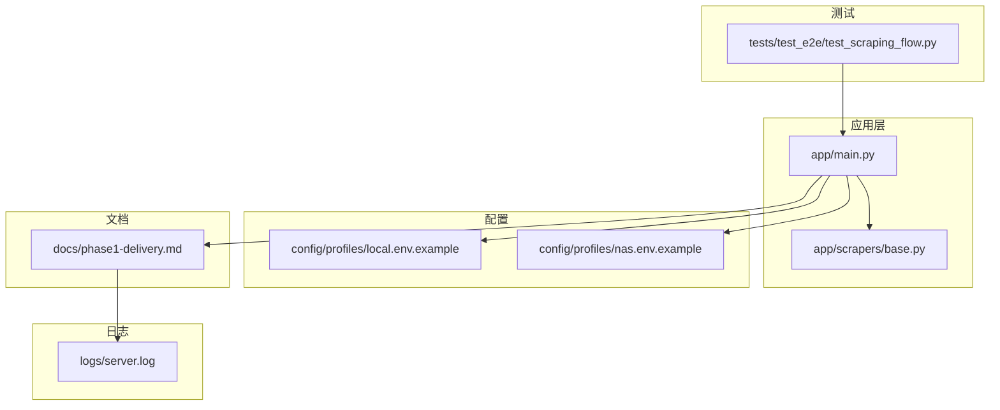
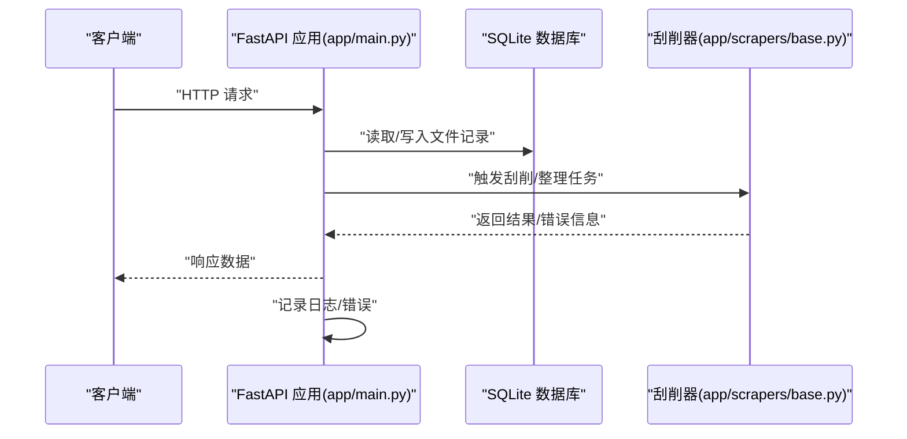
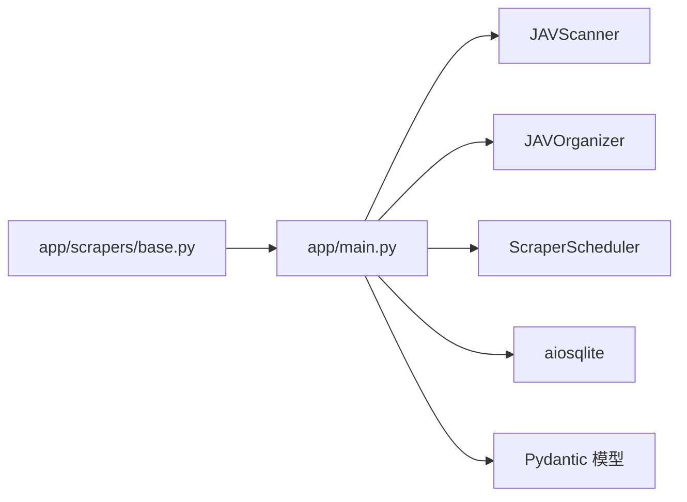

# 调试工具与日志分析

<cite>
**本文引用的文件**
- [app/main.py](file://app/main.py)
- [app/scrapers/base.py](file://app/scrapers/base.py)
- [config/profiles/local.env.example](file://config/profiles/local.env.example)
- [config/profiles/nas.env.example](file://config/profiles/nas.env.example)
- [docs/phase1-delivery.md](file://docs/phase1-delivery.md)
- [tests/test_e2e/test_scraping_flow.py](file://tests/test_e2e/test_scraping_flow.py)
- [logs/server.log](file://logs/server.log)
</cite>

## 目录
1. [简介](#简介)
2. [项目结构](#项目结构)
3. [核心组件](#核心组件)
4. [架构总览](#架构总览)
5. [详细组件分析](#详细组件分析)
6. [依赖关系分析](#依赖关系分析)
7. [性能考量](#性能考量)
8. [故障排查指南](#故障排查指南)
9. [结论](#结论)
10. [附录](#附录)

## 简介
本指南面向Noctra项目的调试与日志分析，覆盖以下主题：
- 内置调试工具与日志输出机制
- 日志级别与输出格式说明
- 日志文件位置、轮转与清理建议
- Python调试器使用、单元测试与集成测试执行
- 问题复现技巧、堆栈跟踪分析与性能剖析方法
- 标准化问题报告模板与调试信息收集流程

## 项目结构
Noctra采用FastAPI作为Web框架，核心逻辑集中在应用入口与业务模块；日志通过标准输出与文件输出结合的方式进行管理；测试覆盖了端到端流程与单个组件。

图表来源
- [app/main.py:1-1384](file://app/main.py#L1-L1384)
- [app/scrapers/base.py:84-122](file://app/scrapers/base.py#L84-L122)
- [config/profiles/local.env.example:1-23](file://config/profiles/local.env.example#L1-L23)
- [config/profiles/nas.env.example:1-44](file://config/profiles/nas.env.example#L1-L44)
- [docs/phase1-delivery.md:294-350](file://docs/phase1-delivery.md#L294-L350)
- [tests/test_e2e/test_scraping_flow.py:333-376](file://tests/test_e2e/test_scraping_flow.py#L333-L376)
- [logs/server.log](file://logs/server.log)

章节来源
- [app/main.py:1-1384](file://app/main.py#L1-L1384)
- [docs/phase1-delivery.md:294-350](file://docs/phase1-delivery.md#L294-L350)

## 核心组件
- 应用入口与数据库初始化：负责应用启动、数据库表结构补齐、静态资源挂载等。
- 刮削基础类：提供HTTP错误诊断、错误记录与日志条目结构。
- 配置示例：定义环境变量键值，包括绑定地址、端口、数据目录与数据库路径等。
- 文档与日志：提供日志查看方式、Docker日志查看、数据库查询示例与常见故障排查步骤。
- 测试：端到端测试通过真实数据库与TestClient验证流程。

章节来源
- [app/main.py:78-131](file://app/main.py#L78-L131)
- [app/scrapers/base.py:84-122](file://app/scrapers/base.py#L84-L122)
- [config/profiles/local.env.example:1-23](file://config/profiles/local.env.example#L1-L23)
- [config/profiles/nas.env.example:1-44](file://config/profiles/nas.env.example#L1-L44)
- [docs/phase1-delivery.md:294-350](file://docs/phase1-delivery.md#L294-L350)
- [tests/test_e2e/test_scraping_flow.py:333-376](file://tests/test_e2e/test_scraping_flow.py#L333-L376)

## 架构总览
下图展示了从请求进入、业务处理到日志输出的整体流程，并映射到实际代码文件。

图表来源
- [app/main.py:78-131](file://app/main.py#L78-L131)
- [app/main.py:739-800](file://app/main.py#L739-L800)
- [app/scrapers/base.py:84-122](file://app/scrapers/base.py#L84-L122)

## 详细组件分析

### 日志与调试工具
- 日志输出位置
  - 本地运行：可通过脚本实时查看服务日志文件。
  - Docker运行：可通过容器日志命令查看。
- 日志内容与格式
  - 应用层会将运行过程中的状态、错误与诊断信息输出到日志文件。
  - 刮削器在发生错误时会记录诊断信息与错误消息。
- 日志级别
  - 错误级别：用于记录HTTP错误、拦截情况与异常。
  - 诊断级别：用于记录刮削过程中的上下文信息与阶段信息。
- 输出格式
  - 前端展示刮削错误时，会以列表形式显示最近的日志条目，便于快速定位问题。

章节来源
- [docs/phase1-delivery.md:294-322](file://docs/phase1-delivery.md#L294-L322)
- [app/scrapers/base.py:84-122](file://app/scrapers/base.py#L84-L122)
- [docs/superpowers/plans/2026-03-27-scrape-feedback-observability.md:1278-1307](file://docs/superpowers/plans/2026-03-27-scrape-feedback-observability.md#L1278-L1307)

### 日志文件位置、轮转与清理
- 文件位置
  - 本地日志文件位于logs/server.log。
- 轮转策略
  - 仓库未提供内置轮转配置；建议结合系统工具（如logrotate）实现按大小或时间轮转。
- 清理方法
  - 可定期备份重要日志后清理旧文件，或在Docker环境中使用卷挂载策略避免日志无限增长。

章节来源
- [logs/server.log](file://logs/server.log)
- [docs/phase1-delivery.md:294-308](file://docs/phase1-delivery.md#L294-L308)

### Python调试器使用
- 断点调试
  - 在app/main.py中设置断点，配合本地开发服务器启动方式进行交互式调试。
- 数据库检查
  - 使用sqlite3连接数据库路径，执行查询以核对文件状态与刮削记录。
- 环境变量校验
  - 对照local.env.example与nas.env.example，确认绑定地址、端口、数据目录与数据库路径等配置。

章节来源
- [app/main.py:78-131](file://app/main.py#L78-L131)
- [docs/phase1-delivery.md:310-322](file://docs/phase1-delivery.md#L310-L322)
- [config/profiles/local.env.example:1-23](file://config/profiles/local.env.example#L1-L23)
- [config/profiles/nas.env.example:1-44](file://config/profiles/nas.env.example#L1-L44)

### 单元测试与集成测试
- 运行方式
  - 使用pytest运行tests目录下的测试用例，支持端到端测试与组件级测试。
- 端到端测试要点
  - 通过真实的SQLite数据库与TestClient模拟请求，验证刮削流程与状态变更。
- 数据库隔离
  - 端到端测试使用临时数据库文件，避免影响生产数据。

章节来源
- [tests/test_e2e/test_scraping_flow.py:333-376](file://tests/test_e2e/test_scraping_flow.py#L333-L376)

### 问题复现技巧
- 复现场景
  - 使用端到端测试用例提供的组织记录与目标路径，构造可重复的刮削场景。
- 关注点
  - 刮削阶段、数据源、错误用户提示与技术详情，前端会展示这些信息以便定位问题。

章节来源
- [tests/test_e2e/test_scraping_flow.py:333-376](file://tests/test_e2e/test_scraping_flow.py#L333-L376)
- [docs/superpowers/plans/2026-03-27-scrape-feedback-observability.md:1278-1307](file://docs/superpowers/plans/2026-03-27-scrape-feedback-observability.md#L1278-L1307)

### 堆栈跟踪分析
- 定位错误
  - 结合服务日志与数据库状态，确认错误发生的具体阶段与数据源。
- 前端辅助
  - 错误模态框会显示失败原因、失败阶段、数据源以及最近日志列表，有助于快速缩小范围。

章节来源
- [docs/phase1-delivery.md:294-322](file://docs/phase1-delivery.md#L294-L322)
- [docs/superpowers/plans/2026-03-27-scrape-feedback-observability.md:1278-1307](file://docs/superpowers/plans/2026-03-27-scrape-feedback-observability.md#L1278-L1307)

### 性能剖析方法
- I/O瓶颈
  - 关注扫描与整理阶段的文件系统操作，必要时对批量任务进行分批处理。
- 并发与锁
  - 批处理作业使用异步锁保护共享状态，避免竞态条件。
- 刮削阶段
  - 将网络请求与解析分离，减少阻塞；对重试与超时进行合理配置。

章节来源
- [app/main.py:531-614](file://app/main.py#L531-L614)

## 依赖关系分析
- 组件耦合
  - 应用入口依赖扫描器、整理器与刮削调度器；数据库Schema在启动时补齐，确保向后兼容。
- 外部依赖
  - FastAPI、aiosqlite、Pydantic模型等。
- 配置依赖
  - 环境变量决定绑定地址、端口、数据目录与数据库路径。

图表来源
- [app/main.py:40-49](file://app/main.py#L40-L49)
- [app/main.py:127-131](file://app/main.py#L127-L131)
- [app/scrapers/base.py:84-122](file://app/scrapers/base.py#L84-L122)

章节来源
- [app/main.py:40-49](file://app/main.py#L40-L49)
- [app/main.py:127-131](file://app/main.py#L127-L131)

## 性能考量
- 批处理优化
  - 合理设置批处理队列长度与并发度，避免I/O饱和。
- 数据库索引
  - 已创建scrape_status索引，有助于筛选与统计。
- 日志开销
  - 在高负载场景下适当降低日志级别，避免I/O成为瓶颈。

章节来源
- [app/main.py:124](file://app/main.py#L124)

## 故障排查指南
- 服务无法启动
  - 检查Python版本、依赖安装、端口占用与日志文件。
- 扫描不到文件
  - 校验SOURCE_DIR、挂载权限与视频扩展名白名单。
- 整理失败
  - 检查DIST_DIR写权限、磁盘空间与服务日志。
- 无法访问Web界面
  - 检查健康检查接口、防火墙与绑定地址。

章节来源
- [docs/phase1-delivery.md:326-349](file://docs/phase1-delivery.md#L326-L349)

## 结论
本指南提供了Noctra的调试与日志分析实践路径：通过明确的日志位置与格式、合理的轮转与清理策略、完善的测试与问题复现手段，以及基于前端错误面板的可观测性，能够高效定位并解决问题。建议在生产环境中结合系统级日志轮转工具与数据库定期备份策略，确保长期稳定运行。

## 附录

### 标准化问题报告模板
- 环境信息
  - 运行模式：本地/Docker/NAS
  - Python版本与依赖
  - 配置文件摘要（绑定地址、端口、数据目录、数据库路径）
- 复现步骤
  - 具体操作与输入
  - 期望结果与实际结果
- 日志与截图
  - 服务日志片段（含时间戳）
  - 数据库查询结果（文件状态、刮削记录）
  - 前端错误面板截图（失败原因、失败阶段、数据源、最近日志）
- 附加信息
  - 系统资源使用情况
  - 网络与代理配置（如有）

章节来源
- [docs/phase1-delivery.md:294-322](file://docs/phase1-delivery.md#L294-L322)
- [docs/superpowers/plans/2026-03-27-scrape-feedback-observability.md:1278-1307](file://docs/superpowers/plans/2026-03-27-scrape-feedback-observability.md#L1278-L1307)