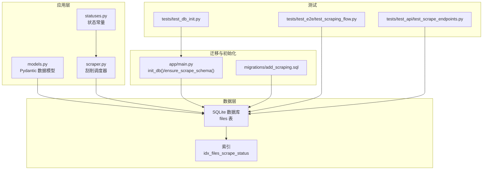
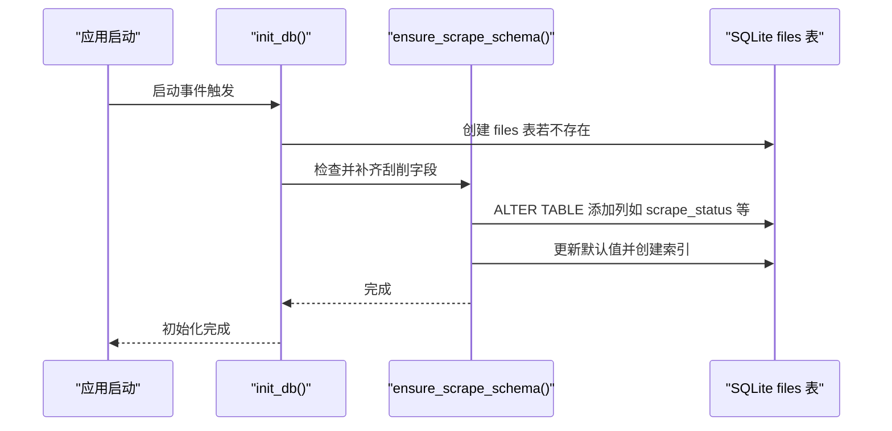
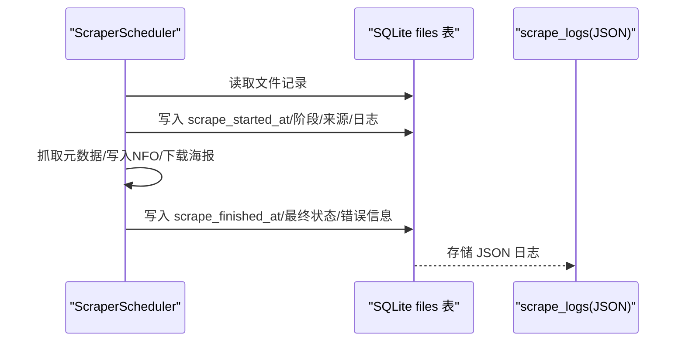
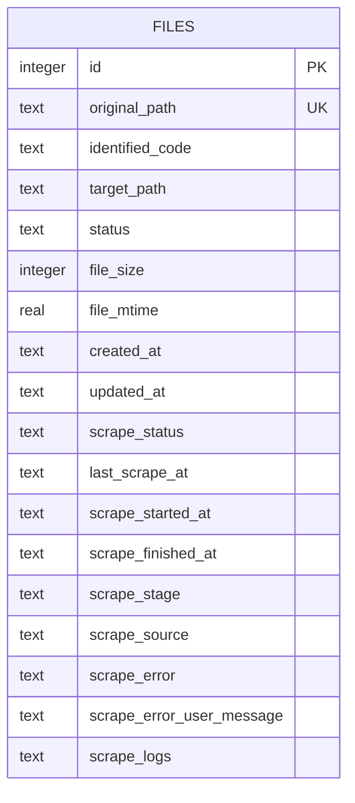
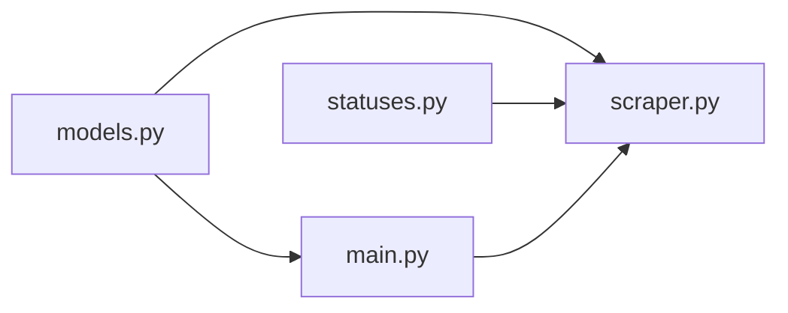

# 数据模型

<cite>
**本文引用的文件**
- [app/models.py](file://app/models.py)
- [app/main.py](file://app/main.py)
- [app/scraper.py](file://app/scraper.py)
- [migrations/add_scraping.sql](file://migrations/add_scraping.sql)
- [tests/test_db_init.py](file://tests/test_db_init.py)
- [tests/test_e2e/test_scraping_flow.py](file://tests/test_e2e/test_scraping_flow.py)
- [tests/test_api/test_scrape_endpoints.py](file://tests/test_api/test_scrape_endpoints.py)
- [app/statuses.py](file://app/statuses.py)
</cite>

## 目录
1. [简介](#简介)
2. [项目结构](#项目结构)
3. [核心组件](#核心组件)
4. [架构总览](#架构总览)
5. [详细组件分析](#详细组件分析)
6. [依赖分析](#依赖分析)
7. [性能考虑](#性能考虑)
8. [故障排查指南](#故障排查指南)
9. [结论](#结论)
10. [附录](#附录)

## 简介
本文件系统性梳理 Noctra 的数据模型与数据库 Schema 设计，覆盖实体关系、字段定义、索引与约束、数据验证规则、业务逻辑与生命周期管理，并给出数据访问模式、缓存策略与性能优化建议，以及数据迁移路径与版本管理方案。内容基于仓库中的实际实现与测试用例进行归纳总结。

## 项目结构
Noctra 的数据层围绕 SQLite 数据库与一组 Pydantic 数据模型展开，核心文件包括：
- 数据模型定义：app/models.py（Pydantic 模型）
- 数据库初始化与迁移：app/main.py（初始化 files 表、确保刮削字段）、migrations/add_scraping.sql（SQL 迁移脚本）
- 刮削调度器与日志持久化：app/scraper.py
- 测试与端到端验证：tests/test_db_init.py、tests/test_e2e/test_scraping_flow.py、tests/test_api/test_scrape_endpoints.py
- 状态常量：app/statuses.py

图表来源
- [app/models.py:1-216](file://app/models.py#L1-L216)
- [app/main.py:84-124](file://app/main.py#L84-L124)
- [migrations/add_scraping.sql:1-17](file://migrations/add_scraping.sql#L1-L17)
- [app/scraper.py:1-200](file://app/scraper.py#L1-L200)
- [tests/test_db_init.py:10-56](file://tests/test_db_init.py#L10-L56)
- [tests/test_e2e/test_scraping_flow.py:193-330](file://tests/test_e2e/test_scraping_flow.py#L193-L330)
- [tests/test_api/test_scrape_endpoints.py:20-67](file://tests/test_api/test_scrape_endpoints.py#L20-L67)

章节来源
- [app/models.py:1-216](file://app/models.py#L1-L216)
- [app/main.py:84-124](file://app/main.py#L84-L124)
- [migrations/add_scraping.sql:1-17](file://migrations/add_scraping.sql#L1-L17)
- [app/scraper.py:1-200](file://app/scraper.py#L1-L200)
- [tests/test_db_init.py:10-56](file://tests/test_db_init.py#L10-L56)
- [tests/test_e2e/test_scraping_flow.py:193-330](file://tests/test_e2e/test_scraping_flow.py#L193-L330)
- [tests/test_api/test_scrape_endpoints.py:20-67](file://tests/test_api/test_scrape_endpoints.py#L20-L67)

## 核心组件
- 文件记录模型（FileRecord）：描述扫描/整理后的文件记录，包含原始路径、识别番号、目标路径、状态、尺寸、修改时间、创建/更新时间等。
- 统计与汇总模型（StatsSummary、ScanResult、HistoryResult）：用于统计各类状态数量与分页返回文件列表。
- 批处理与组织模型（BatchJob、BatchItemResult、OrganizeResult、OrganizeResultItem）：支持批量任务与组织结果的结构化表示。
- 刮削模型（ScrapeListItem、ScrapeJobCreateRequest、ScrapeJobSnapshot、ScrapeResponse、ScrapeDetailResponse、ScrapeBatchResult 等）：定义刮削流程中使用的请求/响应与作业快照结构。
- 日志模型（ScrapeLogEntry）：记录刮削过程中的阶段、级别、来源、消息与进度百分比。

章节来源
- [app/models.py:7-216](file://app/models.py#L7-L216)

## 架构总览
Noctra 的数据模型以 SQLite 为核心存储，使用 aiosqlite 异步访问。应用启动时自动初始化 files 表并确保刮削相关列存在，同时维护一个按 scrape_status 的索引以提升查询效率。刮削调度器负责从数据库读取待刮削文件，执行元数据抓取与侧写（NFO、海报等），并将日志与状态回写数据库。

图表来源
- [app/main.py:84-124](file://app/main.py#L84-L124)

章节来源
- [app/main.py:84-124](file://app/main.py#L84-L124)

## 详细组件分析

### 数据库 Schema：files 表
- 表名：files
- 主键：id（自增整数）
- 字段与约束：
  - original_path：TEXT，UNIQUE NOT NULL（唯一标识源文件路径）
  - identified_code：TEXT（识别出的番号）
  - target_path：TEXT（目标目录/文件路径）
  - status：TEXT NOT NULL，默认 'pending'（扫描/整理状态）
  - file_size：INTEGER NOT NULL（文件大小）
  - file_mtime：REAL NOT NULL（文件修改时间）
  - created_at：TEXT NOT NULL（记录创建时间）
  - updated_at：TEXT NOT NULL（记录更新时间）
  - scrape_status：TEXT，默认 'pending'（新增：刮削状态）
  - last_scrape_at：TEXT（新增：上次刮削时间）
  - scrape_started_at：TEXT（新增：开始刮削时间）
  - scrape_finished_at：TEXT（新增：完成刮削时间）
  - scrape_stage：TEXT（新增：当前刮削阶段）
  - scrape_source：TEXT（新增：刮削来源）
  - scrape_error：TEXT（新增：技术错误）
  - scrape_error_user_message：TEXT（新增：用户可见错误提示）
  - scrape_logs：TEXT（新增：JSON 日志数组）

- 索引：
  - idx_files_scrape_status：对 scrape_status 建立索引，便于按状态筛选与统计。

- 约束与默认值：
  - status 默认 'pending'
  - scrape_status 默认 'pending'
  - 其他新增列允许为空，以便在未开始或未完成时保持 NULL

- 迁移与兼容性：
  - 历史状态 processed 在迁移中映射为 organized，保证查询一致性
  - 启动时自动补齐缺失列并设置默认值，避免手工迁移

章节来源
- [app/main.py:84-98](file://app/main.py#L84-L98)
- [app/main.py:101-124](file://app/main.py#L101-L124)
- [migrations/add_scraping.sql:3-16](file://migrations/add_scraping.sql#L3-L16)
- [tests/test_db_init.py:15-51](file://tests/test_db_init.py#L15-L51)

### 状态与生命周期
- 文件状态（status）：
  - pending：待处理
  - duplicate：重复
  - processed → organized：历史兼容映射
  - target_exists：目标已存在
  - 其他：skipped、failed、ignored 等由扫描/组织流程产生
- 刮削状态（scrape_status）：
  - pending：待刮削
  - success：成功
  - failed：失败
- 生命周期要点：
  - 文件进入 organized 后才具备刮削资格（processed/organized 均可）
  - 刮削开始时记录 scrape_started_at，结束时记录 scrape_finished_at
  - scrape_logs 保存最近若干条日志，限制长度防止膨胀

章节来源
- [app/statuses.py:7-7](file://app/statuses.py#L7-L7)
- [app/scraper.py:197-200](file://app/scraper.py#L197-L200)
- [migrations/add_scraping.sql:10-11](file://migrations/add_scraping.sql#L10-L11)
- [tests/test_e2e/test_scraping_flow.py:773-794](file://tests/test_e2e/test_scraping_flow.py#L773-L794)

### 数据访问模式
- 初始化与回填：
  - 启动时创建 files 表并调用 ensure_scrape_schema 回填列与索引
- 查询：
  - 获取所有文件、按状态统计、按 scrape_status 过滤
- 更新：
  - upsert_file：插入或替换文件记录
  - update_file_status：更新状态与可选目标路径
  - refresh_file_record：刷新识别码、目标路径、状态等
  - 标记同类目其他候选为 target_exists
- 刮削日志解析：
  - _parse_scrape_logs：从 JSON 文本解析为 ScrapeLogEntry 列表

章节来源
- [app/main.py:141-231](file://app/main.py#L141-L231)
- [app/main.py:242-259](file://app/main.py#L242-L259)
- [tests/test_api/test_scrape_endpoints.py:20-67](file://tests/test_api/test_scrape_endpoints.py#L20-L67)

### 刮削工作流与日志持久化
- 调度器职责：
  - 读取文件记录，校验状态（processed/organized）
  - 执行元数据抓取、写入 NFO、下载海报等步骤
  - 实时更新 scrape_stage、scrape_source、scrape_logs，并持久化
- 错误映射：
  - 将不同阶段的错误映射为用户可读提示（如 Cloudflare 拦截、未找到番号等）
- 进度控制：
  - 使用 SCRAPE_PROGRESS 映射各阶段进度百分比

图表来源
- [app/scraper.py:89-150](file://app/scraper.py#L89-L150)
- [app/scraper.py:177-187](file://app/scraper.py#L177-L187)
- [app/scraper.py:59-80](file://app/scraper.py#L59-L80)

章节来源
- [app/scraper.py:1-200](file://app/scraper.py#L1-L200)

### 数据验证规则与边界
- 输入校验：
  - Pydantic 模型对请求/响应字段进行类型与默认值校验
  - 刮削日志解析对 JSON 结构进行容错处理（非列表、解析异常则忽略）
- 业务约束：
  - organized 才能参与刮削
  - 缺少 identified_code 或 target_path 时拒绝开始
  - scrape_logs 仅保留最近若干条，避免无限增长

章节来源
- [app/models.py:106-216](file://app/models.py#L106-L216)
- [app/main.py:242-259](file://app/main.py#L242-L259)
- [app/scraper.py:197-209](file://app/scraper.py#L197-L209)

### 实体关系图

图表来源
- [app/main.py:84-98](file://app/main.py#L84-L98)
- [app/main.py:107-121](file://app/main.py#L107-L121)

## 依赖分析
- 组件耦合：
  - app/models.py 作为数据契约被 API 层与调度器共同依赖
  - app/main.py 提供数据库初始化与回填能力，是数据层基础设施
  - app/scraper.py 依赖状态常量与数据库接口，负责业务流程与日志持久化
- 外部依赖：
  - aiosqlite：异步 SQLite 访问
  - Pydantic：数据模型与序列化
- 可能的循环依赖：
  - 当前模块间为单向依赖（调度器依赖状态常量与模型），未见循环

图表来源
- [app/models.py:1-216](file://app/models.py#L1-L216)
- [app/main.py:84-124](file://app/main.py#L84-L124)
- [app/scraper.py:1-200](file://app/scraper.py#L1-L200)
- [app/statuses.py:7-7](file://app/statuses.py#L7-L7)

章节来源
- [app/models.py:1-216](file://app/models.py#L1-L216)
- [app/main.py:84-124](file://app/main.py#L84-L124)
- [app/scraper.py:1-200](file://app/scraper.py#L1-L200)
- [app/statuses.py:7-7](file://app/statuses.py#L7-L7)

## 性能考虑
- 索引策略：
  - idx_files_scrape_status：按 scrape_status 过滤与统计时显著提升性能
- 查询优化：
  - 优先使用状态过滤与分页（如按 id 倒序）
  - 避免一次性加载过多日志，必要时分页或按需加载
- 写入优化：
  - 批量更新时合并 SQL，减少往返
  - 控制 scrape_logs 长度，避免 JSON 过大影响 IO
- I/O 与并发：
  - 使用 aiosqlite 异步连接池，避免阻塞
  - 刮削流程中尽量串行化关键步骤，降低竞争风险

## 故障排查指南
- 启动后缺少刮削字段：
  - 确认 ensure_scrape_schema 是否执行，检查 PRAGMA table_info 输出
  - 验证索引是否存在
- 刮削日志异常：
  - 检查 scrape_logs JSON 结构是否为数组
  - 解析失败时会回退为空列表，确认上游是否正确序列化
- 状态不一致：
  - processed → organized 的迁移是否生效
  - 刮削开始/结束时间是否正确更新
- E2E 与 API 测试：
  - 使用真实数据库与同步桥接方法验证查询与更新行为
  - 通过 fixtures 注入样本数据，断言按 scrape_status 过滤与统计

章节来源
- [app/main.py:101-124](file://app/main.py#L101-L124)
- [app/main.py:242-259](file://app/main.py#L242-L259)
- [tests/test_db_init.py:10-56](file://tests/test_db_init.py#L10-L56)
- [tests/test_e2e/test_scraping_flow.py:245-330](file://tests/test_e2e/test_scraping_flow.py#L245-L330)
- [tests/test_api/test_scrape_endpoints.py:20-67](file://tests/test_api/test_scrape_endpoints.py#L20-L67)

## 结论
Noctra 的数据模型以简洁的 files 表为核心，配合 Pydantic 模型与异步数据库访问，实现了从扫描、整理到刮削的全链路数据管理。通过启动时自动回填与索引，兼顾了兼容性与性能。建议在后续迭代中进一步完善日志压缩、批量写入与更细粒度的状态机，以支撑更大规模的媒体库管理。

## 附录

### 数据迁移路径与版本管理
- 迁移脚本：migrations/add_scraping.sql
  - 新增列：scrape_status、last_scrape_at、scrape_started_at、scrape_finished_at、scrape_stage、scrape_source、scrape_error、scrape_error_user_message、scrape_logs
  - 创建索引：idx_files_scrape_status
  - 状态迁移：processed → organized
  - 验证查询：统计 organized 与 pending 数量
- 启动回填：app/main.py 中 ensure_scrape_schema 自动补齐列并设置默认值
- 测试验证：tests/test_db_init.py 与 tests/test_e2e/test_scraping_flow.py 提供真实数据库初始化与端到端验证

章节来源
- [migrations/add_scraping.sql:1-17](file://migrations/add_scraping.sql#L1-L17)
- [app/main.py:101-124](file://app/main.py#L101-L124)
- [tests/test_db_init.py:10-56](file://tests/test_db_init.py#L10-L56)
- [tests/test_e2e/test_scraping_flow.py:193-330](file://tests/test_e2e/test_scraping_flow.py#L193-L330)