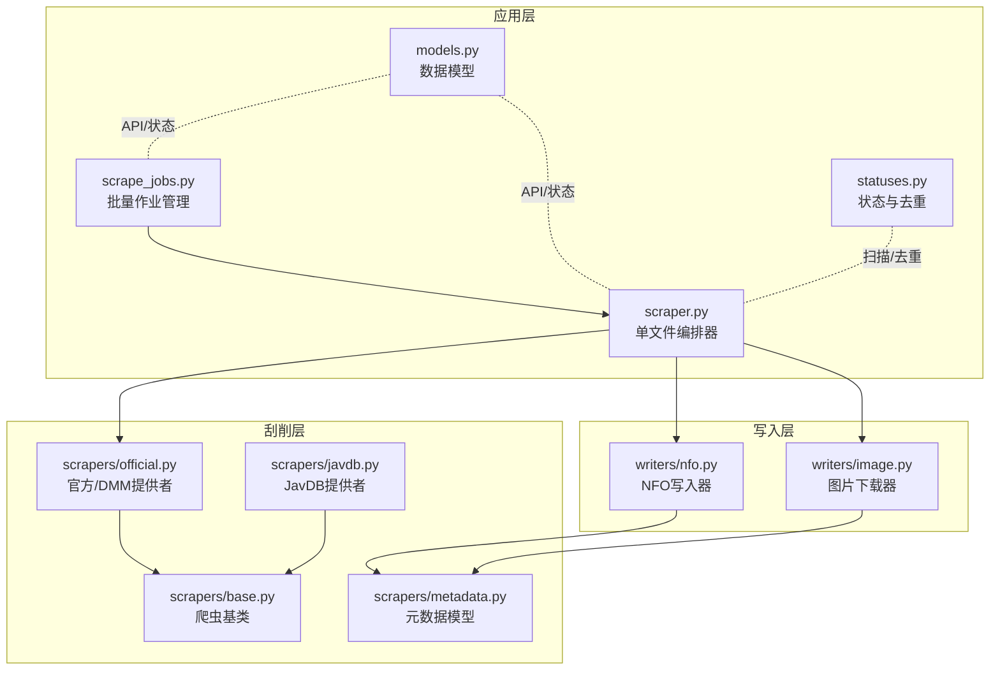
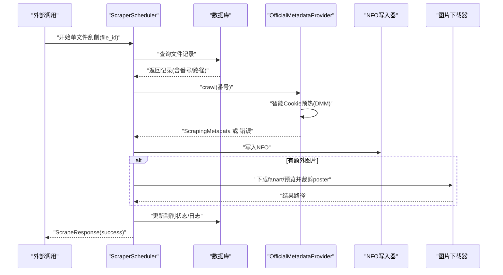
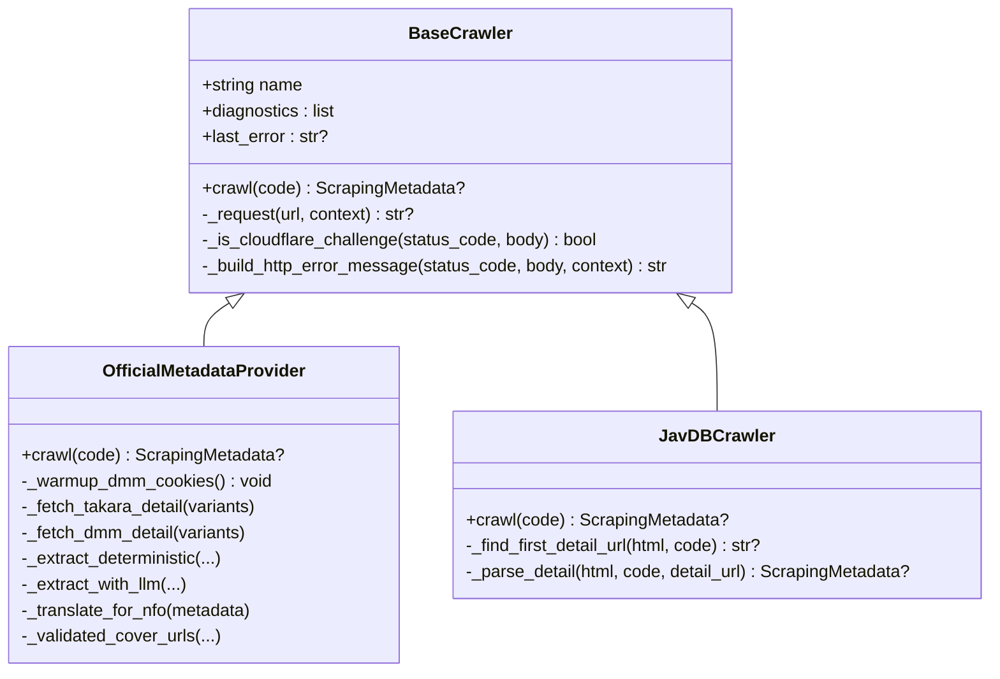
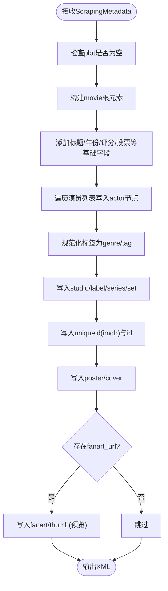
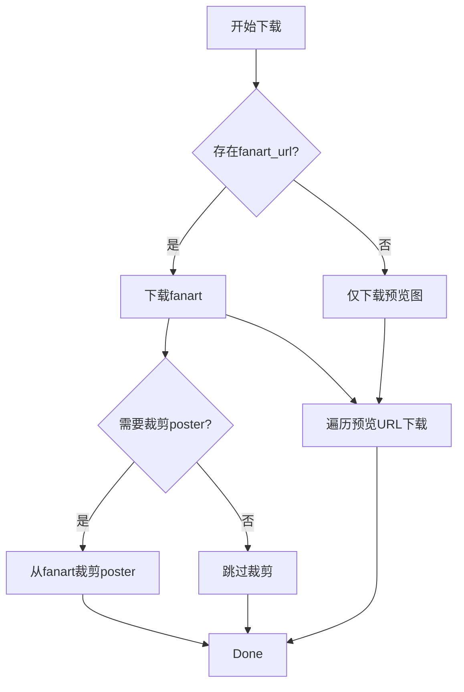
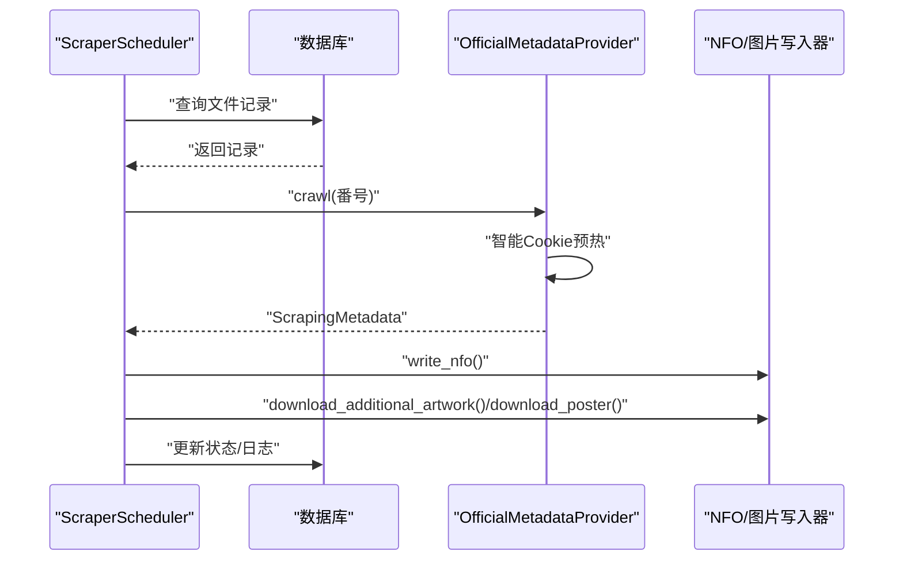
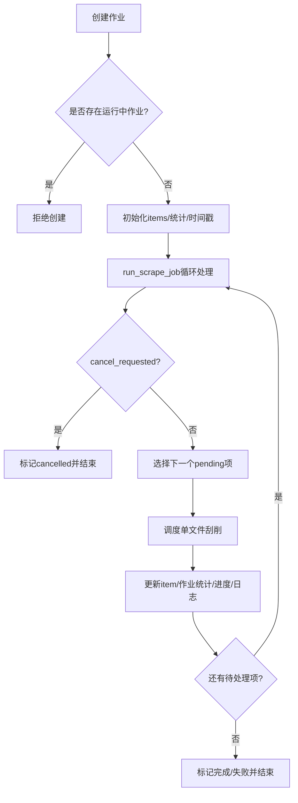
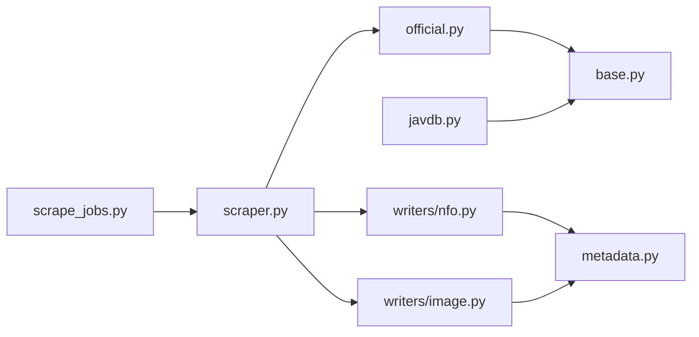
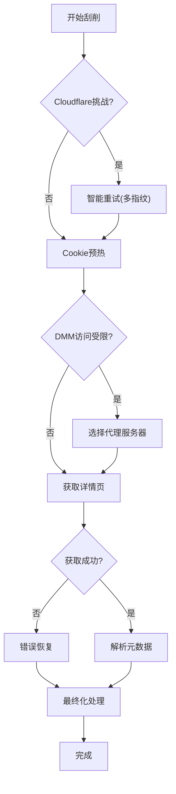

# 元数据刮削系统

<cite>
**本文档引用的文件**
- [app/scrapers/base.py](file://app/scrapers/base.py)
- [app/scrapers/metadata.py](file://app/scrapers/metadata.py)
- [app/scrapers/javdb.py](file://app/scrapers/javdb.py)
- [app/scrapers/official.py](file://app/scrapers/official.py)
- [app/scrapers/writers/nfo.py](file://app/scrapers/writers/nfo.py)
- [app/scrapers/writers/image.py](file://app/scrapers/writers/image.py)
- [app/scraper.py](file://app/scraper.py)
- [app/scrape_jobs.py](file://app/scrape_jobs.py)
- [app/models.py](file://app/models.py)
- [app/statuses.py](file://app/statuses.py)
- [tests/test_scrapers/test_base.py](file://tests/test_scrapers/test_base.py)
- [tests/test_scrapers/test_metadata.py](file://tests/test_scrapers/test_metadata.py)
- [tests/test_scrapers/test_javdb.py](file://tests/test_scrapers/test_javdb.py)
- [tests/test_scrapers/test_official.py](file://tests/test_scrapers/test_official.py)
- [tests/test_scrapers/test_nfo_writer.py](file://tests/test_scrapers/test_nfo_writer.py)
- [tests/test_scrapers/test_image_downloader.py](file://tests/test_scrapers/test_image_downloader.py)
- [tests/test_api/test_scrape_jobs.py](file://tests/test_api/test_scrape_jobs.py)
- [tests/test_e2e/test_scraping_flow.py](file://tests/test_e2e/test_scraping_flow.py)
- [scripts/test_javdb.py](file://scripts/test_javdb.py)
- [tests/test_scraper_diagnostics.py](file://tests/test_scraper_diagnostics.py)
</cite>

## 更新摘要
**所做更改**
- 更新了智能重试机制和Cookie管理优化部分，特别针对DMM等目标网站的访问限制
- 新增了错误恢复能力和可靠性改进章节
- 更新了故障排查指南中的Cloudflare拦截和Cookie预热相关内容
- 增强了可靠性保障和错误恢复机制的说明

## 目录
1. [引言](#引言)
2. [项目结构](#项目结构)
3. [核心组件](#核心组件)
4. [架构总览](#架构总览)
5. [详细组件分析](#详细组件分析)
6. [依赖关系分析](#依赖关系分析)
7. [性能考虑](#性能考虑)
8. [可靠性改进与错误恢复](#可靠性改进与错误恢复)
9. [故障排查指南](#故障排查指南)
10. [结论](#结论)
11. [附录](#附录)

## 引言
本文件面向Noctra的元数据刮削系统，提供从架构设计、工作流程、任务调度与状态管理到数据提取算法与缓存策略的全面技术文档。系统目标是为媒体文件自动抓取并生成Emby/Kodi兼容的NFO元数据及配套图片资源，支持官方/DMM源，并预留扩展其他来源的能力。最新版本引入了重要的可靠性改进，包括智能重试机制、Cookie管理优化和错误恢复能力提升，特别针对DMM等目标网站的访问限制进行了专门优化。

## 项目结构
Noctra的刮削系统主要位于app目录下，采用按职责分层的组织方式：
- scrapers：爬虫实现与通用基类、元数据模型、写入器
- scrapers/writers：NFO写入器与图片下载器
- scraper.py：单文件刮削编排器
- scrape_jobs.py：批量作业管理与进度跟踪
- models.py：API与内部数据模型
- statuses.py：扫描状态与重复项判定逻辑
- tests：覆盖爬虫、写入器、端到端流程等测试

**图表来源**
- [app/scraper.py:82-453](file://app/scraper.py#L82-L453)
- [app/scrape_jobs.py:1-256](file://app/scrape_jobs.py#L1-L256)
- [app/scrapers/base.py:15-204](file://app/scrapers/base.py#L15-L204)
- [app/scrapers/official.py:67-1178](file://app/scrapers/official.py#L67-L1178)
- [app/scrapers/javdb.py:14-353](file://app/scrapers/javdb.py#L14-L353)
- [app/scrapers/metadata.py:6-60](file://app/scrapers/metadata.py#L6-L60)
- [app/scrapers/writers/nfo.py:12-142](file://app/scrapers/writers/nfo.py#L12-L142)
- [app/scrapers/writers/image.py:44-180](file://app/scrapers/writers/image.py#L44-L180)
- [app/models.py:103-216](file://app/models.py#L103-L216)
- [app/statuses.py:24-154](file://app/statuses.py#L24-L154)

**章节来源**
- [app/scraper.py:1-453](file://app/scraper.py#L1-L453)
- [app/scrape_jobs.py:1-256](file://app/scrape_jobs.py#L1-L256)
- [app/scrapers/base.py:1-204](file://app/scrapers/base.py#L1-L204)
- [app/scrapers/official.py:1-1178](file://app/scrapers/official.py#L1-L1178)
- [app/scrapers/javdb.py:1-353](file://app/scrapers/javdb.py#L1-L353)
- [app/scrapers/metadata.py:1-60](file://app/scrapers/metadata.py#L1-L60)
- [app/scrapers/writers/nfo.py:1-142](file://app/scrapers/writers/nfo.py#L1-L142)
- [app/scrapers/writers/image.py:1-180](file://app/scrapers/writers/image.py#L1-L180)
- [app/models.py:1-216](file://app/models.py#L1-L216)
- [app/statuses.py:1-154](file://app/statuses.py#L1-L154)

## 核心组件
- 爬虫基类与具体实现
  - BaseCrawler：统一的HTTP请求封装、诊断记录、Cloudflare挑战检测与重试策略、浏览器指纹模拟
  - OfficialMetadataProvider：官方/DMM源的多阶段解析与可选LLM增强抽取，包含智能Cookie预热机制
  - JavDBCrawler：JavDB源的搜索与详情页解析
- 元数据模型：ScrapingMetadata统一承载标题、演员、标签、发行日期、评分、封面与预览图等字段
- 写入器
  - NFO写入器：生成Emby/Kodi兼容的XML元数据文件
  - 图片下载器：异步下载fanart/预览并从fanart裁剪poster
- 编排器：ScraperScheduler负责单文件刮削全流程编排与数据库状态更新
- 作业管理：ScrapeJobs管理批量作业生命周期、进度百分比映射与最近日志截断
- 数据模型：ScrapeResponse、ScrapeJobSnapshot等支撑API与前端状态同步
- 状态与去重：基于扫描结果的候选文件分类与优先级排序

**章节来源**
- [app/scrapers/base.py:15-204](file://app/scrapers/base.py#L15-L204)
- [app/scrapers/official.py:67-1178](file://app/scrapers/official.py#L67-L1178)
- [app/scrapers/javdb.py:14-353](file://app/scrapers/javdb.py#L14-L353)
- [app/scrapers/metadata.py:6-60](file://app/scrapers/metadata.py#L6-L60)
- [app/scrapers/writers/nfo.py:12-142](file://app/scrapers/writers/nfo.py#L12-L142)
- [app/scrapers/writers/image.py:44-180](file://app/scrapers/writers/image.py#L44-L180)
- [app/scraper.py:82-453](file://app/scraper.py#L82-L453)
- [app/scrape_jobs.py:1-256](file://app/scrape_jobs.py#L1-L256)
- [app/models.py:103-216](file://app/models.py#L103-L216)
- [app/statuses.py:24-154](file://app/statuses.py#L24-L154)

## 架构总览
系统采用"编排器-爬虫-写入器"的分层架构，单文件刮削流程如下：

**图表来源**
- [app/scraper.py:89-374](file://app/scraper.py#L89-L374)
- [app/scrapers/official.py:90-141](file://app/scrapers/official.py#L90-L141)
- [app/scrapers/writers/nfo.py:12-82](file://app/scrapers/writers/nfo.py#L12-L82)
- [app/scrapers/writers/image.py:74-148](file://app/scrapers/writers/image.py#L74-L148)

**章节来源**
- [app/scraper.py:82-453](file://app/scraper.py#L82-L453)

## 详细组件分析

### 爬虫基类与官方/DMM提供者
- BaseCrawler
  - 统一封装HTTP请求，内置固定延迟与多浏览器指纹重试
  - Cloudflare挑战检测与错误消息构建
  - 诊断记录与错误追踪，便于前端展示
- OfficialMetadataProvider
  - 标准化番号变体，构造DMM/Takara候选URL
  - **新增**：智能Cookie预热机制，通过预热URL建立有效的会话状态
  - 并发拉取页面，基于内容特征判断产品页
  - 提取确定性元数据，支持可选LLM增强抽取与中文翻译
  - 验证封面URL有效性，合并证据与冲突信息

**图表来源**
- [app/scrapers/base.py:15-204](file://app/scrapers/base.py#L15-L204)
- [app/scrapers/official.py:67-1178](file://app/scrapers/official.py#L67-L1178)
- [app/scrapers/javdb.py:14-353](file://app/scrapers/javdb.py#L14-L353)

**章节来源**
- [app/scrapers/base.py:15-204](file://app/scrapers/base.py#L15-L204)
- [app/scrapers/official.py:90-141](file://app/scrapers/official.py#L90-L141)
- [app/scrapers/javdb.py:41-89](file://app/scrapers/javdb.py#L41-L89)

### 元数据模型与NFO写入
- ScrapingMetadata
  - 统一承载基础信息、制作信息、媒体资源等字段
  - 提供to_dict用于模板消费
- NFO写入器
  - 生成Emby/Kodi兼容XML，包含plot CDATA注入、海报/封面/预览图引用
  - 自动推导派生类型（如系列set）

**图表来源**
- [app/scrapers/metadata.py:6-60](file://app/scrapers/metadata.py#L6-L60)
- [app/scrapers/writers/nfo.py:12-82](file://app/scrapers/writers/nfo.py#L12-L82)

**章节来源**
- [app/scrapers/metadata.py:6-60](file://app/scrapers/metadata.py#L6-L60)
- [app/scrapers/writers/nfo.py:12-142](file://app/scrapers/writers/nfo.py#L12-L142)

### 图片下载与海报裁剪
- 异步下载：支持代理、超时与分块写入
- fanart裁剪：从横向DVD封底扫描图右侧区域裁剪出poster
- 预览图：按顺序下载并更新进度

**图表来源**
- [app/scrapers/writers/image.py:74-148](file://app/scrapers/writers/image.py#L74-L148)
- [app/scrapers/writers/image.py:151-180](file://app/scrapers/writers/image.py#L151-L180)

**章节来源**
- [app/scrapers/writers/image.py:44-180](file://app/scrapers/writers/image.py#L44-L180)

### 单文件刮削编排器
- 校验文件状态（processed/organized）
- 调用官方/DMM爬取元数据
- 写入NFO并下载图片
- 更新数据库状态与日志

**图表来源**
- [app/scraper.py:89-374](file://app/scraper.py#L89-L374)
- [app/scrapers/official.py:90-141](file://app/scrapers/official.py#L90-L141)
- [app/scrapers/writers/nfo.py:12-82](file://app/scrapers/writers/nfo.py#L12-L82)
- [app/scrapers/writers/image.py:60-148](file://app/scrapers/writers/image.py#L60-L148)

**章节来源**
- [app/scraper.py:82-453](file://app/scraper.py#L82-L453)

### 批量作业管理与状态系统
- 作业创建：唯一性约束、排队与运行互斥
- 进度映射：阶段到百分比的静态映射表
- 日志截断：限制最近日志数量
- 取消机制：取消请求标记与状态变更

**图表来源**
- [app/scrape_jobs.py:73-256](file://app/scrape_jobs.py#L73-L256)

**章节来源**
- [app/scrape_jobs.py:1-256](file://app/scrape_jobs.py#L1-L256)

### 支持的刮削源与数据提取算法
- 官方/DMM源
  - 标准化番号变体（含mono/digital CID），构造候选URL
  - **新增**：智能Cookie预热机制，通过预热URL建立有效的会话状态
  - 页面内容特征判断产品页，提取标题、演员、标签、发行日期、时长、评分、投票等
  - 可选LLM抽取与翻译，合并证据与冲突
- JavDB源
  - 搜索页匹配首条详情链接，详情页解析基础信息与封面/预览
  - 标签定位与文本清洗，标题剧情提取与规范化

**章节来源**
- [app/scrapers/official.py:67-1178](file://app/scrapers/official.py#L67-L1178)
- [app/scrapers/javdb.py:14-353](file://app/scrapers/javdb.py#L14-L353)

### 缓存策略
- 系统未实现集中式缓存；通过以下方式降低外部依赖压力：
  - BaseCrawler内置固定延迟与浏览器指纹重试
  - **新增**：智能Cookie预热机制减少重复认证开销
  - 图片下载器对fanart/预览进行HEAD探测与内容类型校验
  - 作业管理器对最近日志进行截断，避免内存膨胀

**章节来源**
- [app/scrapers/base.py:124-204](file://app/scrapers/base.py#L124-L204)
- [app/scrapers/official.py:213-283](file://app/scrapers/official.py#L213-L283)
- [app/scrape_jobs.py:38-40](file://app/scrape_jobs.py#L38-L40)

### 刮削作业的创建、监控与管理
- 创建：基于文件ID列表，确保无运行中作业
- 监控：实时事件流（阶段、来源、消息、进度百分比）
- 管理：取消请求、完成/失败状态判定、最近日志截断
- 批量：逐项推进，聚合统计（成功/失败/处理中）

**章节来源**
- [app/scrape_jobs.py:73-256](file://app/scrape_jobs.py#L73-L256)
- [app/models.py:133-175](file://app/models.py#L133-L175)

### 刮削结果的数据格式、质量控制与去重逻辑
- 结果格式：ScrapeResponse携带success/code/logs；NFO为XML；图片为JPG
- 质量控制：
  - 官方/DMM源：页面内容特征校验、封面URL有效性校验、证据与冲突记录
  - JavDB源：严格匹配番号、标题剧情提取与规范化
- 去重逻辑：
  - 扫描阶段：按番号分组，优先级排序（UC/C/SUB/PLAIN），保留最高优先级，其余标记duplicate
  - 状态判定：resolve_scan_status依据是否已存在目标路径决定状态

**章节来源**
- [app/scrapers/official.py:284-310](file://app/scrapers/official.py#L284-L310)
- [app/scrapers/official.py:213-240](file://app/scrapers/official.py#L213-L240)
- [app/scrapers/javdb.py:150-202](file://app/scrapers/javdb.py#L150-L202)
- [app/statuses.py:24-104](file://app/statuses.py#L24-L104)

### API接口说明与扩展开发指南
- 接口要点（基于现有实现与测试）
  - 批量创建作业：传入file_ids，返回作业快照
  - 查询作业：按job_id获取快照
  - 取消作业：设置取消标志
  - 单文件刮削：返回ScrapeResponse
- 扩展开发
  - 新增爬虫：继承BaseCrawler，实现crawl方法
  - 新增写入器：遵循现有写入约定（NFO/XML、图片命名规范）
  - 新增源集成：在ScraperScheduler中接入新源或在OfficialMetadataProvider中扩展

**章节来源**
- [app/models.py:133-175](file://app/models.py#L133-L175)
- [tests/test_api/test_scrape_jobs.py](file://tests/test_api/test_scrape_jobs.py)
- [tests/test_e2e/test_scraping_flow.py](file://tests/test_e2e/test_scraping_flow.py)

## 依赖关系分析
- 组件耦合
  - ScraperScheduler依赖OfficialMetadataProvider与写入器
  - ScrapeJobs依赖ScraperScheduler与数据库
  - 各爬虫依赖BaseCrawler与BeautifulSoup解析
- 外部依赖
  - aiohttp/aiofiles/Pillow用于异步下载与图像处理
  - curl_cffi用于会话与指纹模拟
  - aiosqlite用于数据库操作

**图表来源**
- [app/scraper.py:14-16](file://app/scraper.py#L14-L16)
- [app/scrape_jobs.py:147-149](file://app/scrape_jobs.py#L147-L149)
- [app/scrapers/official.py:14-16](file://app/scrapers/official.py#L14-L16)
- [app/scrapers/javdb.py:10-11](file://app/scrapers/javdb.py#L10-L11)
- [app/scrapers/writers/nfo.py:5-7](file://app/scrapers/writers/nfo.py#L5-L7)
- [app/scrapers/writers/image.py:5-12](file://app/scrapers/writers/image.py#L5-L12)

**章节来源**
- [app/scraper.py:1-453](file://app/scraper.py#L1-L453)
- [app/scrape_jobs.py:1-256](file://app/scrape_jobs.py#L1-L256)
- [app/scrapers/base.py:1-204](file://app/scrapers/base.py#L1-L204)

## 性能考虑
- 网络与并发
  - 使用aiohttp异步下载，合理设置超时与连接器参数
  - 图片下载采用分块写入，减少内存占用
- 解析与写入
  - BeautifulSoup解析在单线程中执行，建议在IO密集场景保持异步策略
  - NFO写入使用XML生成与CDATA注入，注意大段落plot的编码开销
- 资源裁剪
  - 海报裁剪在本地完成，避免二次网络请求
- 作业调度
  - 作业队列互斥与进度百分比映射，避免UI抖动
- **新增**：Cookie预热优化
  - 通过智能Cookie预热减少重复认证开销
  - 预热失败不影响主要流程，确保系统稳定性

## 可靠性改进与错误恢复

### 智能重试机制
系统引入了智能重试机制，能够自动识别和处理各种网络异常情况：

- **Cloudflare挑战处理**：自动检测Cloudflare的人机验证挑战，通过多浏览器指纹重试
- **Cookie预热机制**：针对DMM等目标网站，预先建立有效的会话状态
- **错误分类与恢复**：根据错误类型选择合适的恢复策略

### Cookie管理优化
- **DMM Cookie预热**：通过访问预热URL建立持久的会话状态
- **会话复用**：在爬取过程中复用有效的会话，减少认证开销
- **代理支持**：智能选择代理服务器，提高访问成功率

### 错误恢复能力提升
- **非致命错误处理**：Cookie预热失败不会影响主要刮削流程
- **渐进式降级**：在网络条件不佳时自动调整策略
- **诊断记录**：详细的错误诊断信息便于问题定位

**图表来源**
- [app/scrapers/official.py:163-208](file://app/scrapers/official.py#L163-L208)
- [app/scrapers/base.py:72-87](file://app/scrapers/base.py#L72-L87)

**章节来源**
- [app/scrapers/official.py:163-208](file://app/scrapers/official.py#L163-L208)
- [app/scrapers/base.py:72-87](file://app/scrapers/base.py#L72-L87)
- [scripts/test_javdb.py:1-26](file://scripts/test_javdb.py#L1-L26)
- [tests/test_scraper_diagnostics.py:79](file://tests/test_scraper_diagnostics.py#L79)

## 故障排查指南
- 常见问题与定位
  - **Cloudflare拦截**：BaseCrawler内置检测与多指纹重试，查看last_error与diagnostics
  - **Cookie预热失败**：检查代理配置和目标网站可达性，预热失败不影响主要流程
  - **页面解析失败**：检查源站结构变化，确认标签定位与文本清洗逻辑
  - **图片下载失败**：检查URL有效性与网络代理配置
  - **NFO写入失败**：确认目标目录权限与XML生成正确性
- 日志与诊断
  - 编排器emit事件包含阶段、来源、消息与进度百分比
  - 爬虫diagnostics记录最近诊断信息，上限20条
  - **新增**：Cookie预热诊断信息，包括预热URL、状态码和错误详情
- 错误映射
  - _map_failure根据阶段与技术错误生成用户友好提示
  - **新增**：Cloudflare挑战和Cookie相关错误的专门处理

**章节来源**
- [app/scrapers/base.py:72-87](file://app/scrapers/base.py#L72-L87)
- [app/scraper.py:59-80](file://app/scraper.py#L59-L80)
- [tests/test_scrapers/test_base.py](file://tests/test_scrapers/test_base.py)
- [tests/test_scrapers/test_metadata.py](file://tests/test_scrapers/test_metadata.py)
- [tests/test_scrapers/test_javdb.py](file://tests/test_scrapers/test_javdb.py)
- [tests/test_scrapers/test_official.py](file://tests/test_scrapers/test_official.py)
- [tests/test_scrapers/test_nfo_writer.py](file://tests/test_scrapers/test_nfo_writer.py)
- [tests/test_scrapers/test_image_downloader.py](file://tests/test_scrapers/test_image_downloader.py)
- [tests/test_scraper_diagnostics.py:79](file://tests/test_scraper_diagnostics.py#L79)

## 结论
Noctra的元数据刮削系统以清晰的分层架构实现了从数据抓取、解析、写入到状态管理的完整闭环。最新版本引入的重要可靠性改进包括智能重试机制、Cookie管理优化和错误恢复能力提升，特别针对DMM等目标网站的访问限制进行了专门优化。官方/DMM源作为主数据源，辅以JavDB源与可选LLM增强，满足多样化的元数据需求。通过严格的诊断记录、进度映射与日志截断，系统具备良好的可观测性与可维护性。智能Cookie预热机制显著提升了DMM等目标网站的访问稳定性，而多层错误恢复机制确保了系统在各种网络环境下的可靠运行。建议后续在缓存策略、并发限速与错误恢复方面进一步优化，以提升大规模批量处理的稳定性与吞吐量。

## 附录
- 关键流程图与类图已在相应章节中给出，便于快速定位实现细节
- 测试用例覆盖了爬虫、写入器与端到端流程，可作为扩展开发的参考
- **新增**：可靠性测试脚本和诊断测试用例，验证智能重试和Cookie预热功能