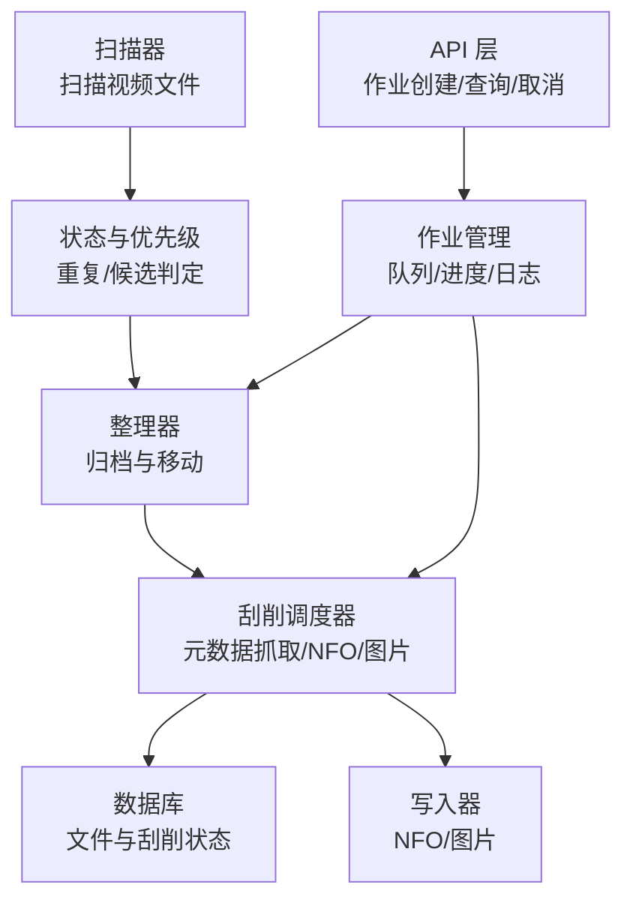
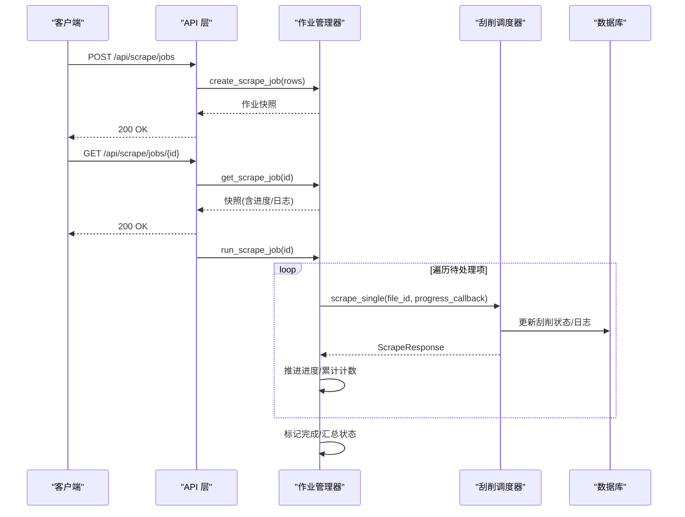
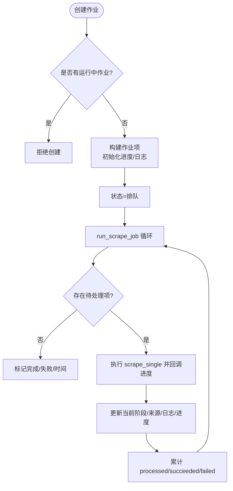
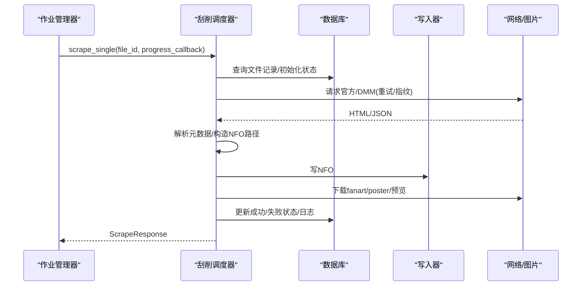
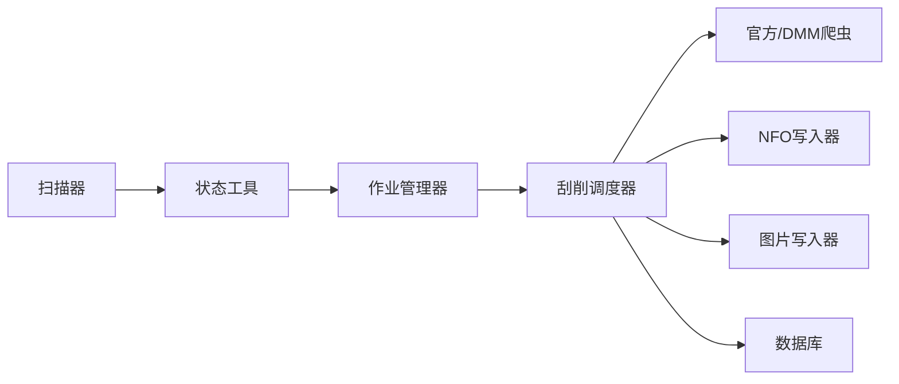

# 刮削作业管理

<cite>
**本文引用的文件**
- [app/scrape_jobs.py](file://app/scrape_jobs.py)
- [app/models.py](file://app/models.py)
- [app/statuses.py](file://app/statuses.py)
- [app/main.py](file://app/main.py)
- [app/scraper.py](file://app/scraper.py)
- [app/organizer.py](file://app/organizer.py)
- [app/scanner.py](file://app/scanner.py)
- [app/scrapers/base.py](file://app/scrapers/base.py)
- [app/scrapers/official.py](file://app/scrapers/official.py)
- [app/scrapers/metadata.py](file://app/scrapers/metadata.py)
- [app/scrapers/writers/nfo.py](file://app/scrapers/writers/nfo.py)
- [app/scrapers/writers/image.py](file://app/scrapers/writers/image.py)
- [tests/test_api/test_scrape_jobs.py](file://tests/test_api/test_scrape_jobs.py)
- [tests/test_scrapers/test_official.py](file://tests/test_scrapers/test_official.py)
</cite>

## 目录
1. [引言](#引言)
2. [项目结构](#项目结构)
3. [核心组件](#核心组件)
4. [架构总览](#架构总览)
5. [详细组件分析](#详细组件分析)
6. [依赖关系分析](#依赖关系分析)
7. [性能考量](#性能考量)
8. [故障排查指南](#故障排查指南)
9. [结论](#结论)
10. [附录](#附录)

## 引言
本文件面向Noctra的刮削作业管理系统，系统性阐述刮削作业的生命周期管理、任务队列机制与批量处理策略，覆盖作业创建、调度、执行与完成状态流转；解释作业优先级、并发控制与资源分配思路；提供监控、进度跟踪与结果收集机制；给出配置选项、参数传递与错误恢复策略，并附带API接口说明与扩展开发指南。

## 项目结构
Noctra采用模块化设计，围绕“扫描-整理-刮削-产出”闭环组织代码：
- 扫描与状态：扫描器负责发现视频文件并识别番号；状态工具用于重复/候选判定与优先级排序。
- 整理：将文件按番号与后缀规则归档至目标目录，处理跨文件系统移动与原子替换。
- 刮削：编排元数据抓取、NFO生成、封面与预览图下载，持久化状态与日志。
- API与模型：FastAPI提供REST接口，Pydantic模型定义作业与结果的数据契约。

图表来源
- [app/scanner.py:67-125](file://app/scanner.py#L67-L125)
- [app/statuses.py:83-104](file://app/statuses.py#L83-L104)
- [app/organizer.py:164-215](file://app/organizer.py#L164-L215)
- [app/scraper.py:82-373](file://app/scraper.py#L82-L373)
- [app/scrape_jobs.py:73-116](file://app/scrape_jobs.py#L73-L116)
- [app/main.py:739-770](file://app/main.py#L739-L770)

章节来源
- [app/main.py:739-770](file://app/main.py#L739-L770)
- [app/scanner.py:67-125](file://app/scanner.py#L67-L125)
- [app/statuses.py:83-104](file://app/statuses.py#L83-L104)
- [app/organizer.py:164-215](file://app/organizer.py#L164-L215)
- [app/scraper.py:82-373](file://app/scraper.py#L82-L373)
- [app/scrape_jobs.py:73-116](file://app/scrape_jobs.py#L73-L116)

## 核心组件
- 作业管理器：维护作业字典、锁、进度百分比推进与完成态收敛。
- 刮削调度器：串联“校验-查询-解析-写NFO-下载图片-落库”，并提供进度回调。
- 写入器：NFO XML生成与图片下载/裁剪。
- 状态与优先级：扫描候选分组、去重与优先级排序。
- API与模型：作业创建/查询/取消接口与数据模型。

章节来源
- [app/scrape_jobs.py:22-116](file://app/scrape_jobs.py#L22-L116)
- [app/scraper.py:82-373](file://app/scraper.py#L82-L373)
- [app/scrapers/writers/nfo.py:12-81](file://app/scrapers/writers/nfo.py#L12-L81)
- [app/scrapers/writers/image.py:74-148](file://app/scrapers/writers/image.py#L74-L148)
- [app/statuses.py:83-104](file://app/statuses.py#L83-L104)
- [app/models.py:103-185](file://app/models.py#L103-L185)

## 架构总览
系统以异步协程驱动，通过锁保证作业状态一致性；作业管理器串行化执行，逐项推进；刮削调度器在单文件粒度内完成端到端流程；写入器与数据库交互实现最终落盘与状态持久化。

图表来源
- [app/main.py:739-770](file://app/main.py#L739-L770)
- [app/scrape_jobs.py:146-255](file://app/scrape_jobs.py#L146-L255)
- [app/scraper.py:89-373](file://app/scraper.py#L89-L373)

## 详细组件分析

### 作业生命周期与队列机制
- 作业创建：校验是否存在运行中的作业；若无，则生成唯一ID、构建作业项（含初始状态、进度、日志），并置为“排队”。
- 作业运行：串行遍历“待处理”项，逐个执行刮削；在每次事件回调中同步更新当前阶段、来源、最近日志与单项进度；累计processed/succeeded/failed。
- 取消：若处于“排队/运行”可取消，设置取消标志；完成后不可取消。
- 完成：当所有项处理完毕，依据失败数量判定“完成/失败”，写入完成时间与最终进度。

图表来源
- [app/scrape_jobs.py:73-116](file://app/scrape_jobs.py#L73-L116)
- [app/scrape_jobs.py:146-255](file://app/scrape_jobs.py#L146-L255)

章节来源
- [app/scrape_jobs.py:73-116](file://app/scrape_jobs.py#L73-L116)
- [app/scrape_jobs.py:146-255](file://app/scrape_jobs.py#L146-L255)
- [tests/test_api/test_scrape_jobs.py:64-124](file://tests/test_api/test_scrape_jobs.py#L64-L124)

### 刮削调度与执行流程
- 输入：文件ID，要求状态为“已整理/已组织”。
- 步骤：校验文件信息→查询官方/DMM→解析元数据→生成NFO→下载图片→落库成功/失败状态与日志。
- 进度：基于阶段映射计算进度百分比；回调中持久化日志与阶段信息。
- 错误映射：针对不同阶段与来源，生成用户可读提示。

图表来源
- [app/scraper.py:89-373](file://app/scraper.py#L89-L373)
- [app/scrapers/writers/nfo.py:12-81](file://app/scrapers/writers/nfo.py#L12-L81)
- [app/scrapers/writers/image.py:74-148](file://app/scrapers/writers/image.py#L74-L148)

章节来源
- [app/scraper.py:89-373](file://app/scraper.py#L89-L373)
- [app/scrapers/writers/nfo.py:12-81](file://app/scrapers/writers/nfo.py#L12-L81)
- [app/scrapers/writers/image.py:74-148](file://app/scrapers/writers/image.py#L74-L148)

### 数据模型与状态
- 作业模型：作业ID、状态、总数、处理数、成功/失败计数、时间戳、当前文件/阶段/来源、进度、最近日志、子项列表。
- 单项模型：文件ID、番号、目标路径、状态、阶段、来源、进度、消息、错误、起止时间。
- 响应模型：成功/失败、阶段、来源、用户消息、技术错误、日志列表。
- 状态映射：阶段到进度百分比，保证单调递增。

章节来源
- [app/models.py:103-185](file://app/models.py#L103-L185)
- [app/scrape_jobs.py:9-20](file://app/scrape_jobs.py#L9-L20)

### 并发控制与资源分配
- 串行化执行：作业管理器在单协程内顺序推进，避免并发竞争。
- 锁保护：全局字典与作业项均通过锁保护，确保读写一致。
- 资源限制：单实例仅允许一个活动作业，避免资源争用；网络请求与IO通过异步并发提升吞吐。

章节来源
- [app/scrape_jobs.py:22-23](file://app/scrape_jobs.py#L22-L23)
- [app/scrape_jobs.py:146-174](file://app/scrape_jobs.py#L146-L174)

### 监控、进度跟踪与结果收集
- 进度：阶段映射与显式百分比推进，保证不回退。
- 日志：事件回调中追加最近日志，限制条数；支持合并作业日志。
- 结果：单项与作业级计数（processed/succeeded/failed），完成态收敛。

章节来源
- [app/scrape_jobs.py:38-56](file://app/scrape_jobs.py#L38-L56)
- [app/scrape_jobs.py:186-207](file://app/scrape_jobs.py#L186-L207)
- [app/scrape_jobs.py:250-253](file://app/scrape_jobs.py#L250-L253)

### 错误恢复与容错
- 阶段化错误映射：针对不同阶段与来源生成用户友好提示。
- 数据库落盘：失败时同样持久化状态与日志，便于后续重试或人工介入。
- 网络重试：官方/DMM抓取具备重试与指纹切换能力。

章节来源
- [app/scraper.py:59-79](file://app/scraper.py#L59-L79)
- [app/scraper.py:375-410](file://app/scraper.py#L375-L410)
- [app/scrapers/base.py:124-203](file://app/scrapers/base.py#L124-L203)

### API接口说明
- 创建作业：POST /api/scrape/jobs
  - 请求体：file_ids
  - 响应：作业快照（包含items）
  - 行为：若存在运行中作业则返回冲突
- 查询作业：GET /api/scrape/jobs/{id}
  - 响应：作业快照（含进度/日志）
- 取消作业：POST /api/scrape/jobs/{id}/cancel
  - 响应：取消结果（若已完成则不可取消）

章节来源
- [app/main.py:739-770](file://app/main.py#L739-L770)
- [tests/test_api/test_scrape_jobs.py:64-223](file://tests/test_api/test_scrape_jobs.py#L64-L223)

### 扩展开发指南
- 新增爬虫：继承基类，实现crawl方法，遵循诊断与错误记录规范。
- 新增写入器：实现输出格式（如其他媒体中心兼容格式），并在调度器中接入。
- 自定义优先级：在状态工具中扩展候选分组与排序规则。
- 配置项：环境变量（如LLM开关/密钥/超时）、阶段进度映射、日志条数上限等。

章节来源
- [app/scrapers/base.py:15-87](file://app/scrapers/base.py#L15-L87)
- [app/scrapers/official.py:90-141](file://app/scrapers/official.py#L90-L141)
- [app/scraper.py:18-22](file://app/scraper.py#L18-L22)

## 依赖关系分析
- 作业管理器依赖：调度器、模型、锁；通过回调与调度器解耦。
- 调度器依赖：官方/DMM爬虫、NFO写入器、图片写入器、数据库。
- 爬虫基类提供统一请求与诊断能力，官方实现具体解析与LLM辅助抽取。
- 状态工具与扫描器共同决定候选集与去重策略。

图表来源
- [app/scrape_jobs.py:146-210](file://app/scrape_jobs.py#L146-L210)
- [app/scraper.py:82-373](file://app/scraper.py#L82-L373)
- [app/scrapers/official.py:67-141](file://app/scrapers/official.py#L67-L141)
- [app/scrapers/writers/nfo.py:12-81](file://app/scrapers/writers/nfo.py#L12-L81)
- [app/scrapers/writers/image.py:74-148](file://app/scrapers/writers/image.py#L74-L148)
- [app/scanner.py:67-125](file://app/scanner.py#L67-L125)
- [app/statuses.py:83-104](file://app/statuses.py#L83-L104)

章节来源
- [app/scrape_jobs.py:146-210](file://app/scrape_jobs.py#L146-L210)
- [app/scraper.py:82-373](file://app/scraper.py#L82-L373)
- [app/scrapers/official.py:67-141](file://app/scrapers/official.py#L67-L141)
- [app/scrapers/writers/nfo.py:12-81](file://app/scrapers/writers/nfo.py#L12-L81)
- [app/scrapers/writers/image.py:74-148](file://app/scrapers/writers/image.py#L74-L148)
- [app/scanner.py:67-125](file://app/scanner.py#L67-L125)
- [app/statuses.py:83-104](file://app/statuses.py#L83-L104)

## 性能考量
- 异步I/O：网络请求与文件写入采用异步，提升吞吐。
- 进度单调：阶段映射与显式百分比推进避免回退，利于UI稳定显示。
- 资源隔离：单实例单作业串行，避免CPU/IO争用；可按需扩展为多实例/队列。
- 缓存与诊断：爬虫基类内置诊断与重试，减少无效重试。

## 故障排查指南
- 无法创建作业：检查是否存在运行中作业；确认候选状态与去重逻辑。
- 刮削失败：查看阶段与来源，结合用户消息定位问题；检查网络与代理配置。
- 图片下载失败：检查URL有效性与网络连通性；确认代理设置。
- 数据库异常：关注失败态落库与日志持久化，必要时手动修复状态。

章节来源
- [tests/test_api/test_scrape_jobs.py:106-124](file://tests/test_api/test_scrape_jobs.py#L106-L124)
- [app/scraper.py:375-410](file://app/scraper.py#L375-L410)
- [app/scrapers/base.py:124-203](file://app/scrapers/base.py#L124-L203)

## 结论
Noctra的刮削作业管理以“串行化作业+阶段化进度+事件驱动回调”为核心，结合状态工具与写入器，形成稳定的端到端流程。通过锁与异步I/O在单实例内实现高可靠与可观测性；测试覆盖验证了关键行为与错误映射。建议在生产环境中配合外部队列与多实例部署以进一步提升吞吐与弹性。

## 附录
- 关键配置项
  - 环境变量：数据库路径、源目录、目标目录
  - LLM相关：开关、模型、超时、最大输出token、API密钥
  - 阶段进度映射：用于UI进度展示
- 术语
  - 已整理/已组织：文件已归档至目标路径
  - 目标存在：同番号已在目标路径存在，跳过处理
  - 重复：同番号多候选，按优先级保留一项