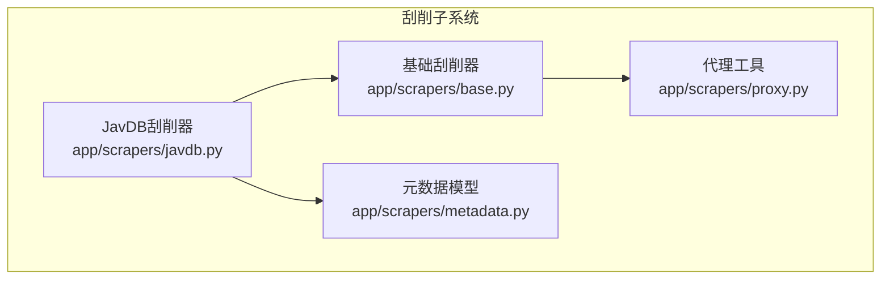
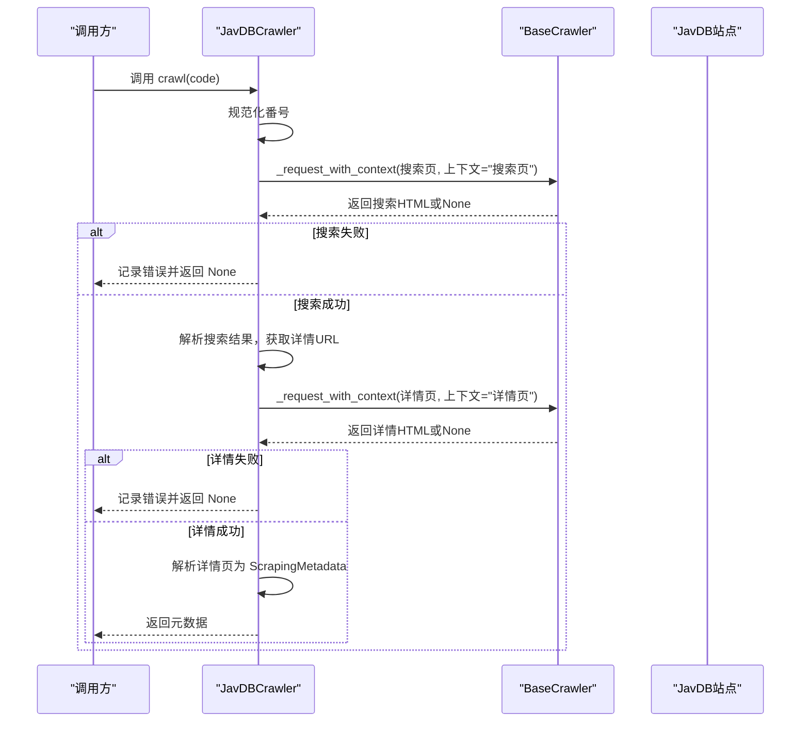
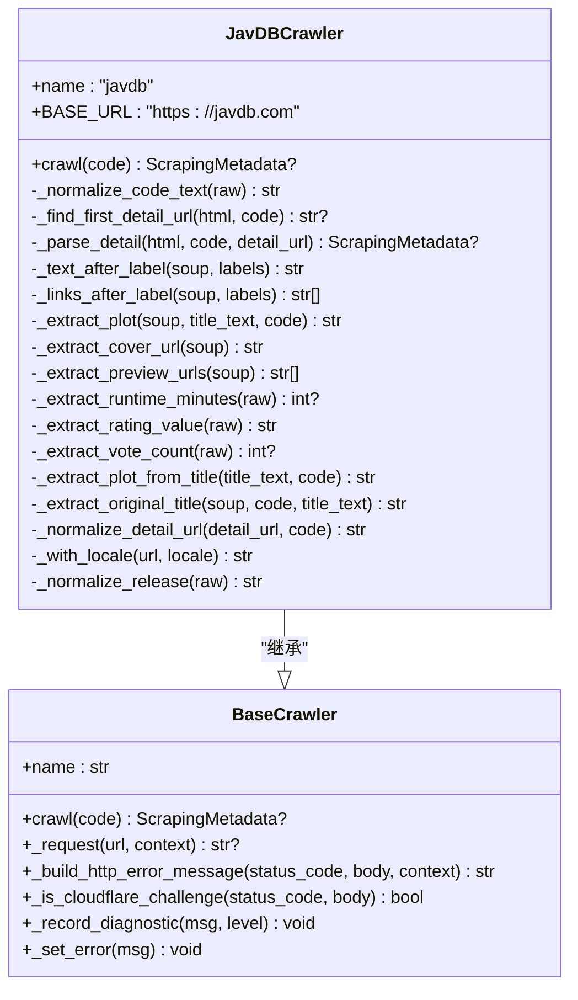
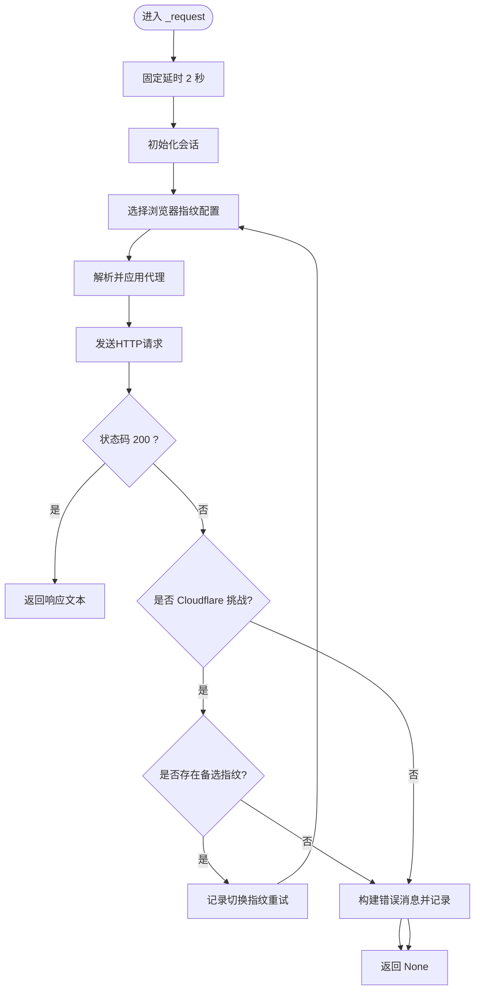
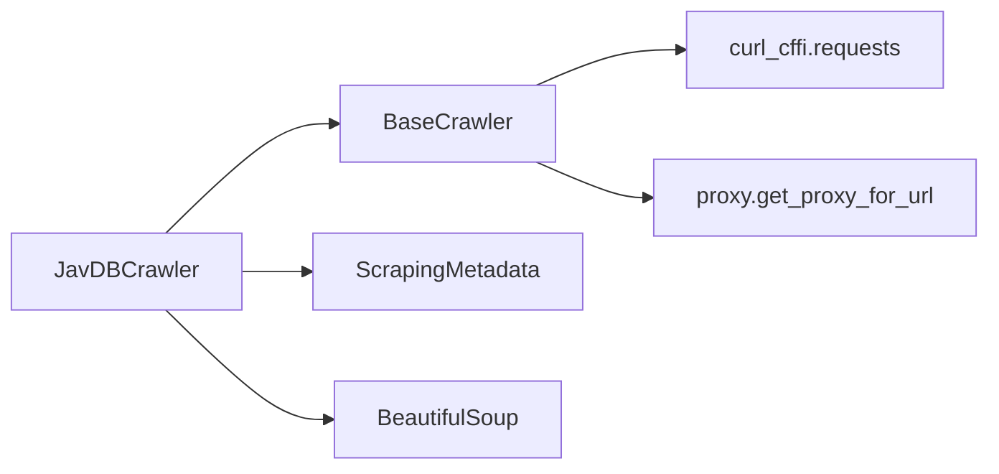
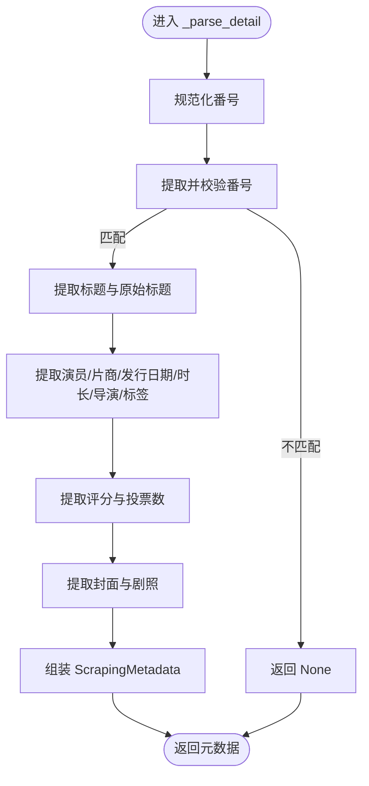

# JavDB刮削器

<cite>
**本文引用的文件**
- [app/scrapers/javdb.py](file://app/scrapers/javdb.py)
- [app/scrapers/base.py](file://app/scrapers/base.py)
- [app/scrapers/metadata.py](file://app/scrapers/metadata.py)
- [app/scrapers/proxy.py](file://app/scrapers/proxy.py)
- [tests/test_scrapers/test_javdb.py](file://tests/test_scrapers/test_javdb.py)
- [tests/test_scraper_diagnostics.py](file://tests/test_scraper_diagnostics.py)
- [docs/scraping-mvp-definition.md](file://docs/scraping-mvp-definition.md)
</cite>

## 目录
1. [简介](#简介)
2. [项目结构](#项目结构)
3. [核心组件](#核心组件)
4. [架构总览](#架构总览)
5. [组件详解](#组件详解)
6. [依赖关系分析](#依赖关系分析)
7. [性能与稳定性](#性能与稳定性)
8. [故障排查指南](#故障排查指南)
9. [结论](#结论)
10. [附录](#附录)

## 简介
本文件面向Noctra项目的JavDB刮削器实现，系统性阐述其工作原理、反爬策略、数据提取算法、对网站结构变化的适配能力、与基础刮削器类的继承关系、配置参数、使用示例与调试技巧，并给出网络请求优化、错误重试与数据缓存建议。内容基于仓库源码与测试用例进行归纳总结，力求兼顾技术深度与可读性。

## 项目结构
JavDB刮削器位于应用的刮削子系统中，采用“单源MVP”的设计思路，围绕基础刮削器类扩展实现，配合元数据模型与代理工具完成端到端的刮削流程。

图表来源
- [app/scrapers/javdb.py:14-23](file://app/scrapers/javdb.py#L14-L23)
- [app/scrapers/base.py:15-204](file://app/scrapers/base.py#L15-L204)
- [app/scrapers/metadata.py:6-60](file://app/scrapers/metadata.py#L6-L60)
- [app/scrapers/proxy.py:27-65](file://app/scrapers/proxy.py#L27-L65)

章节来源
- [app/scrapers/javdb.py:14-23](file://app/scrapers/javdb.py#L14-L23)
- [app/scrapers/base.py:15-204](file://app/scrapers/base.py#L15-L204)
- [app/scrapers/metadata.py:6-60](file://app/scrapers/metadata.py#L6-L60)
- [app/scrapers/proxy.py:27-65](file://app/scrapers/proxy.py#L27-L65)

## 核心组件
- JavDBCrawler：继承自BaseCrawler，负责从JavDB搜索并解析详情页，输出ScrapingMetadata。
- BaseCrawler：提供统一的HTTP请求封装、Cloudflare挑战检测与错误消息构建、诊断日志记录等通用能力。
- ScrapingMetadata：标准化的元数据数据类，承载刮削结果。
- Proxy：根据环境变量解析有效代理URL，供HTTP客户端使用。

章节来源
- [app/scrapers/javdb.py:14-23](file://app/scrapers/javdb.py#L14-L23)
- [app/scrapers/base.py:15-204](file://app/scrapers/base.py#L15-L204)
- [app/scrapers/metadata.py:6-60](file://app/scrapers/metadata.py#L6-L60)
- [app/scrapers/proxy.py:27-65](file://app/scrapers/proxy.py#L27-L65)

## 架构总览
JavDB刮削器遵循“搜索-详情-解析”的两阶段流程：先在搜索页定位目标详情页，再在详情页抽取字段。整体控制流如下：

图表来源
- [app/scrapers/javdb.py:41-89](file://app/scrapers/javdb.py#L41-L89)
- [app/scrapers/base.py:124-204](file://app/scrapers/base.py#L124-L204)

## 组件详解

### JavDBCrawler 类
- 继承关系：直接继承BaseCrawler，复用其HTTP请求、错误处理与诊断能力。
- 关键职责：
  - 将输入番号规范化（去除多余空格、统一连字符格式）。
  - 在搜索页按优先级匹配详情URL：优先精确匹配.uid/.video-title strong中的番号；其次标题包含番号；最后回退到第一个结果。
  - 在详情页抽取字段：标题、原始标题、剧情简介、演员、片商、发行日期、时长、导演、标签、评分、投票数、封面图、剧照预览等。
  - 生成标准化元数据ScrapingMetadata并返回。

图表来源
- [app/scrapers/base.py:15-204](file://app/scrapers/base.py#L15-L204)
- [app/scrapers/javdb.py:14-353](file://app/scrapers/javdb.py#L14-L353)

章节来源
- [app/scrapers/javdb.py:41-89](file://app/scrapers/javdb.py#L41-L89)
- [app/scrapers/javdb.py:113-149](file://app/scrapers/javdb.py#L113-L149)
- [app/scrapers/javdb.py:150-202](file://app/scrapers/javdb.py#L150-L202)

### BaseCrawler 类（反爬虫与请求封装）
- 请求配置：内置多套浏览器指纹（User-Agent、Accept-Language），支持impersonate与超时设置。
- 代理支持：根据URL协议与环境变量解析有效代理，自动注入到请求。
- Cloudflare检测：通过状态码与页面内容判断是否触发挑战，提供友好错误消息。
- 诊断日志：统一记录请求上下文、错误原因与重试过程，便于排障。

图表来源
- [app/scrapers/base.py:124-204](file://app/scrapers/base.py#L124-L204)

章节来源
- [app/scrapers/base.py:124-204](file://app/scrapers/base.py#L124-L204)
- [app/scrapers/proxy.py:27-65](file://app/scrapers/proxy.py#L27-L65)

### 数据模型：ScrapingMetadata
- 字段覆盖：基础信息（番号、标题、剧情、原始标题、来源链接）、制作信息（演员、片商、发行日期、时长、导演、标签、评分、投票数）、媒体资源（海报、背景、剧照列表）。
- 输出：提供to_dict方法，便于模板渲染与NFO写入。

章节来源
- [app/scrapers/metadata.py:6-60](file://app/scrapers/metadata.py#L6-L60)

### 网站结构适配与数据提取算法
- 番号规范化：统一“空格-数字”格式，支持连字符拆分渲染场景。
- 搜索结果匹配：优先从结果卡片的显式番号节点匹配；若无则按标题包含番号；最后回退首个结果。
- 详情页解析：以“标签-值”结构为依据，支持中英双语标签；对剧情、封面、剧照、评分/投票等字段分别提取。
- 结构变化应对：
  - 新版搜索卡片可能将番号置于视频标题的强标记节点而非.uid容器，代码已兼容两种路径。
  - 详情页字段缺失时返回默认空值，保证流程健壮性。

章节来源
- [app/scrapers/javdb.py:104-111](file://app/scrapers/javdb.py#L104-L111)
- [app/scrapers/javdb.py:113-149](file://app/scrapers/javdb.py#L113-L149)
- [app/scrapers/javdb.py:150-202](file://app/scrapers/javdb.py#L150-L202)
- [tests/test_scrapers/test_javdb.py:492-513](file://tests/test_scrapers/test_javdb.py#L492-L513)

### 反爬虫应对策略
- 多指纹轮换：内置Chrome/Safari指纹，遇Cloudflare挑战自动切换。
- 固定延时：每次请求前等待2秒，降低触发风控概率。
- 代理注入：根据URL协议与环境变量自动选择HTTP/HTTPS代理。
- 错误消息友好化：识别Cloudflare挑战并提示用户稍后再试。

章节来源
- [app/scrapers/base.py:18-45](file://app/scrapers/base.py#L18-L45)
- [app/scrapers/base.py:124-204](file://app/scrapers/base.py#L124-L204)
- [tests/test_scraper_diagnostics.py:20-35](file://tests/test_scraper_diagnostics.py#L20-L35)

### 配置参数与使用示例
- 环境变量代理：支持HTTPS_PROXY/https_proxy/ALL_PROXY/all_proxy/HTTP_PROXY/http_proxy等，自动解析并注入。
- 使用方式（概念性示例）：
  - 实例化JavDBCrawler。
  - 调用crawl(code)传入番号，得到ScrapingMetadata对象。
  - 若返回None，检查last_error与diagnostics日志。
- 测试用例展示了多种场景：成功流程、英文标签解析、缺失字段、代码不匹配、封面与剧照提取等。

章节来源
- [app/scrapers/proxy.py:27-65](file://app/scrapers/proxy.py#L27-L65)
- [tests/test_scrapers/test_javdb.py:308-357](file://tests/test_scrapers/test_javdb.py#L308-L357)
- [tests/test_scrapers/test_javdb.py:362-415](file://tests/test_scrapers/test_javdb.py#L362-L415)
- [tests/test_scrapers/test_javdb.py:448-470](file://tests/test_scrapers/test_javdb.py#L448-L470)

### 调试技巧
- 查看诊断日志：通过crawler.diagnostics与last_error定位失败环节。
- 识别Cloudflare挑战：错误消息中包含“HTTP 403”“Cloudflare”等关键词。
- 单元测试辅助：利用测试用例中的HTML夹具快速验证解析逻辑。

章节来源
- [app/scrapers/base.py:72-87](file://app/scrapers/base.py#L72-L87)
- [tests/test_scraper_diagnostics.py:20-35](file://tests/test_scraper_diagnostics.py#L20-L35)
- [tests/test_scrapers/test_javdb.py:16-287](file://tests/test_scrapers/test_javdb.py#L16-L287)

## 依赖关系分析
- 组件耦合：
  - JavDBCrawler依赖BaseCrawler提供的HTTP与诊断能力。
  - JavDBCrawler依赖BeautifulSoup解析HTML。
  - BaseCrawler依赖curl_cffi.requests进行HTTP请求，并通过proxy模块解析代理。
  - 输出ScrapingMetadata供后续写入NFO与下载图片使用。
- 外部依赖：
  - curl_cffi.requests：提供impersonate与TLS指纹模拟。
  - bs4：用于DOM解析与选择器。
  - urllib.parse：用于URL拼接与查询参数处理。

图表来源
- [app/scrapers/javdb.py:10-11](file://app/scrapers/javdb.py#L10-L11)
- [app/scrapers/base.py:9-12](file://app/scrapers/base.py#L9-L12)
- [app/scrapers/proxy.py:27-65](file://app/scrapers/proxy.py#L27-L65)

章节来源
- [app/scrapers/javdb.py:10-11](file://app/scrapers/javdb.py#L10-L11)
- [app/scrapers/base.py:9-12](file://app/scrapers/base.py#L9-L12)
- [app/scrapers/proxy.py:27-65](file://app/scrapers/proxy.py#L27-L65)

## 性能与稳定性
- 请求节流：固定延时2秒，降低并发压力与风控触发概率。
- 多指纹重试：遇到Cloudflare挑战自动切换指纹，提升成功率。
- 代理透明：无需额外配置即可启用代理，增强跨地域可用性。
- 建议（当前MVP未实现的功能）：
  - 重试机制：失败后自动重试（当前仅通过指纹切换尝试一次）。
  - 缓存系统：对搜索结果与详情页进行本地缓存，减少重复请求。
  - Cookie管理：维持登录态以访问受限内容。
  - 自定义Headers：允许用户注入UA/语言偏好等。
  - 预期字段完善：导演、系列、时长、标签、预告片、分辨率、外部ID、排序标题等。

章节来源
- [app/scrapers/base.py:124-204](file://app/scrapers/base.py#L124-L204)
- [docs/scraping-mvp-definition.md:230-272](file://docs/scraping-mvp-definition.md#L230-L272)

## 故障排查指南
- 常见问题与定位：
  - 搜索失败：检查搜索页请求是否返回None，查看last_error与diagnostics。
  - 详情失败：确认详情页URL正确且可访问，关注Cloudflare拦截提示。
  - 字段为空：部分字段缺失属预期，解析器会返回默认值；若关键字段缺失需检查网页结构变化。
  - 代码不匹配：详情页番号与输入不一致时返回None，检查_normalize_code_text逻辑与页面渲染。
- 诊断要点：
  - Cloudflare挑战：错误消息包含“HTTP 403”“Cloudflare”“Just a moment...”等。
  - 日志上限：最多保留最近20条诊断信息，避免内存膨胀。

章节来源
- [app/scrapers/base.py:84-87](file://app/scrapers/base.py#L84-L87)
- [app/scrapers/base.py:18-45](file://app/scrapers/base.py#L18-L45)
- [tests/test_scraper_diagnostics.py:20-35](file://tests/test_scraper_diagnostics.py#L20-L35)

## 结论
JavDB刮削器在MVP阶段实现了稳定的“搜索-详情-解析”流程，具备多指纹重试、代理注入与Cloudflare识别等反爬策略，并通过单元测试覆盖了多种页面结构与字段缺失场景。未来可在重试、缓存、Cookie与自定义Headers等方面进一步增强，以提升鲁棒性与可维护性。

## 附录

### 关键流程图：详情页解析算法

图表来源
- [app/scrapers/javdb.py:150-202](file://app/scrapers/javdb.py#L150-L202)