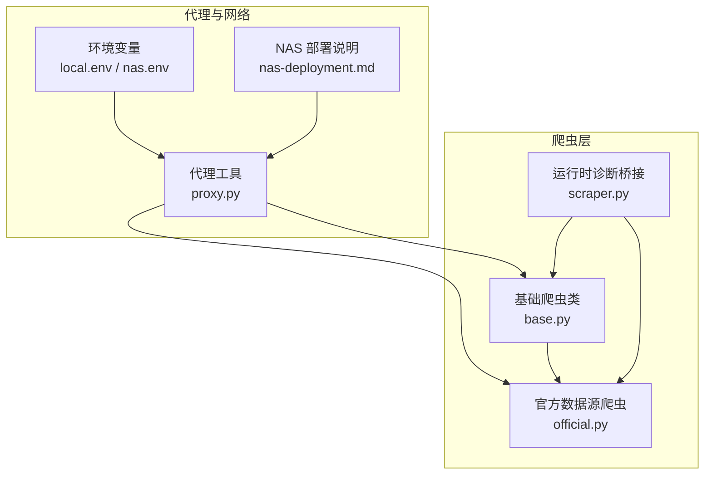
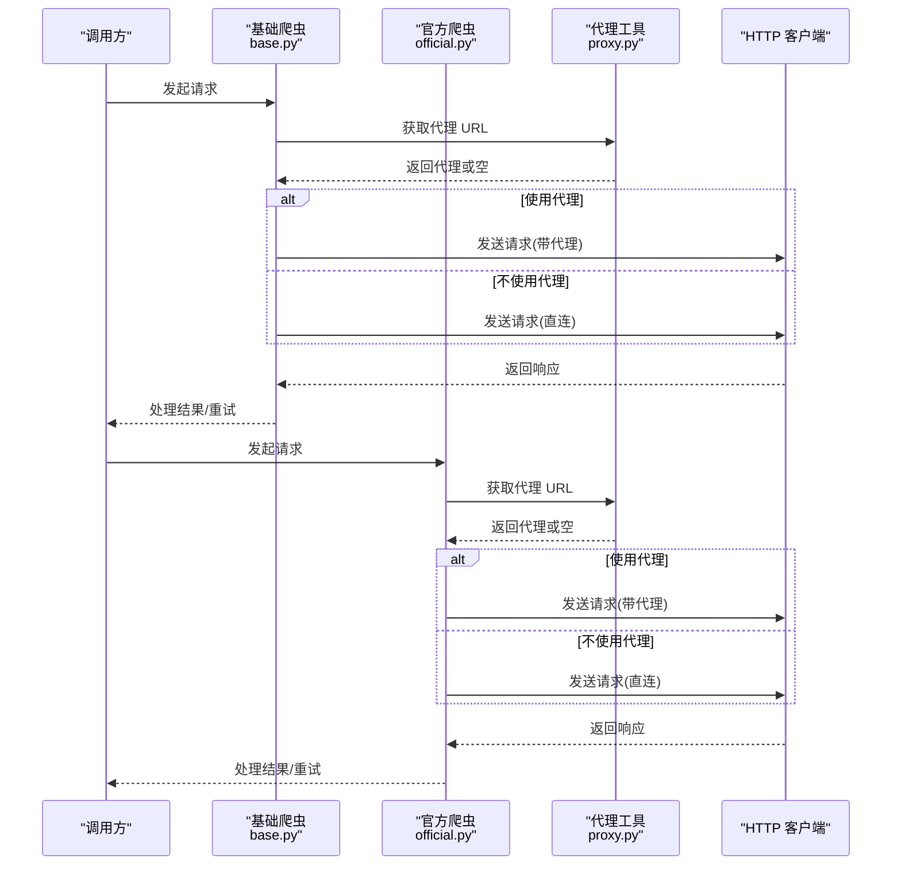
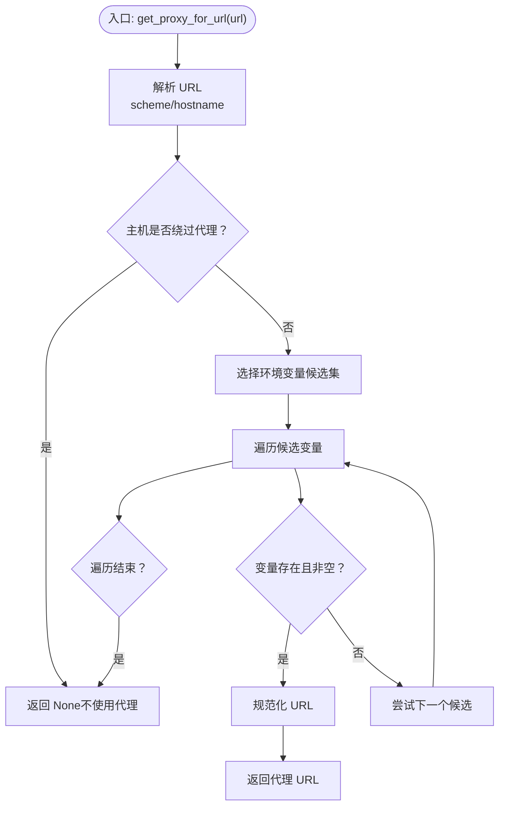
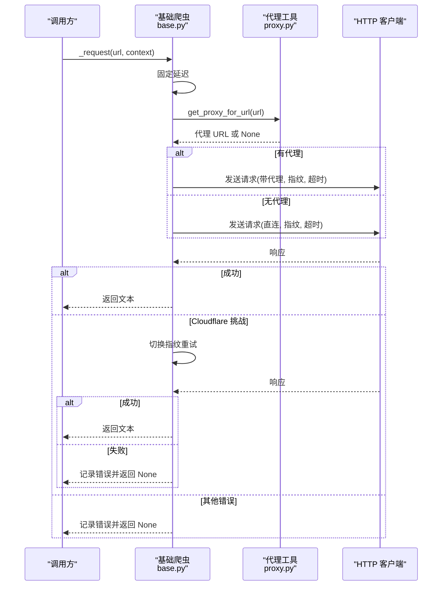
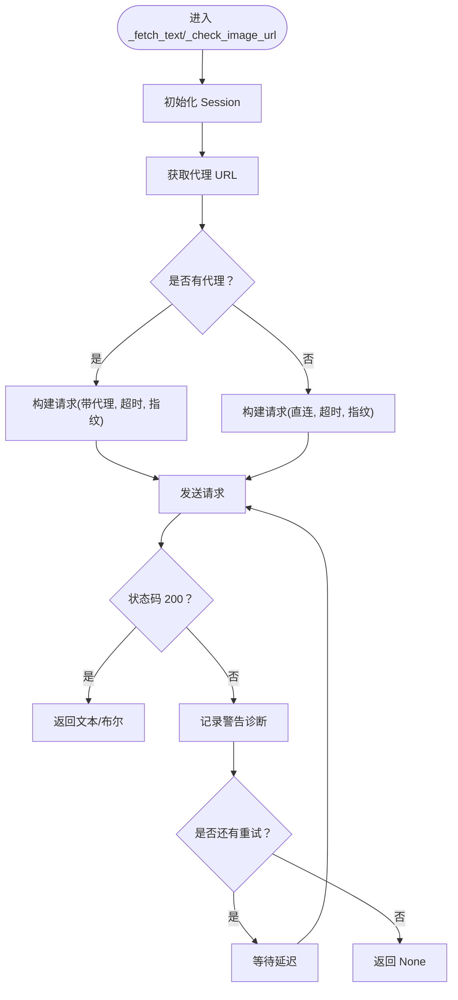
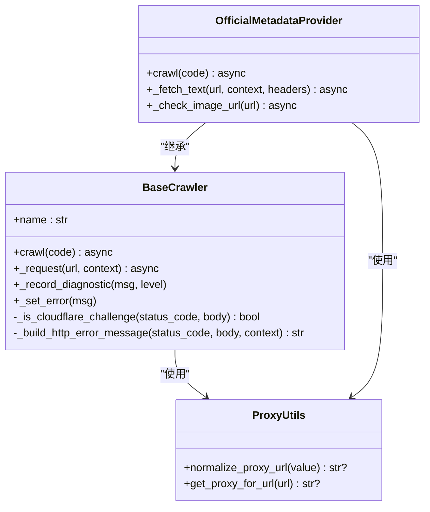
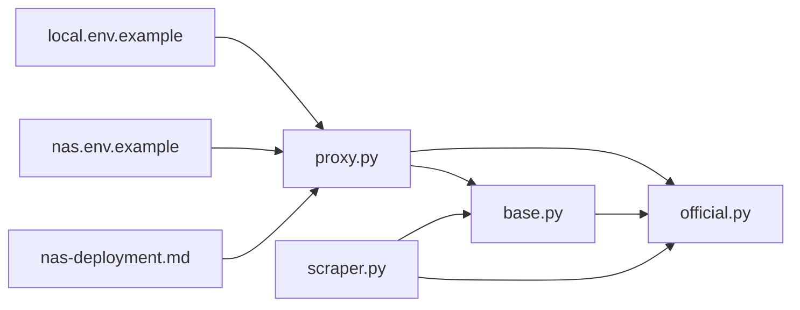

# 代理管理

<cite>
**本文引用的文件**
- [app/scrapers/proxy.py](file://app/scrapers/proxy.py)
- [app/scrapers/base.py](file://app/scrapers/base.py)
- [app/scrapers/official.py](file://app/scrapers/official.py)
- [config/profiles/local.env.example](file://config/profiles/local.env.example)
- [config/profiles/nas.env.example](file://config/profiles/nas.env.example)
- [docs/nas-deployment.md](file://docs/nas-deployment.md)
- [app/scraper.py](file://app/scraper.py)
</cite>

## 目录
1. [简介](#简介)
2. [项目结构](#项目结构)
3. [核心组件](#核心组件)
4. [架构总览](#架构总览)
5. [详细组件分析](#详细组件分析)
6. [依赖关系分析](#依赖关系分析)
7. [性能考量](#性能考量)
8. [故障排查指南](#故障排查指南)
9. [结论](#结论)
10. [附录](#附录)

## 简介
本文件系统性阐述 Noctra 代理管理子系统的设计与实现，覆盖代理配置、代理选择逻辑、故障转移策略、与基础爬虫类的集成方式、以及与环境变量和部署配置的衔接。重点包括：
- 代理配置文件与环境变量格式
- 动态代理选择与绕过规则
- 代理验证与连接超时控制
- 与基础爬虫类的接口设计与调用流程
- 代理池管理、负载均衡与安全防护最佳实践
- 性能监控指标与可观测性

## 项目结构
Noctra 的代理管理主要由以下模块构成：
- 代理工具模块：负责从环境变量解析并规范化代理 URL，并根据目标 URL 的协议与主机决定是否绕过代理。
- 基础爬虫类：统一发起 HTTP 请求，内置浏览器指纹切换与 Cloudflare 挑战处理，支持按需注入代理。
- 官方数据源爬虫：在基础类之上扩展了更严格的重试与超时策略，并同样支持代理注入。
- 环境配置：提供本地与 NAS 部署场景下的代理与 LLM 相关配置示例。
- 运行时诊断：将爬虫诊断信息暴露给上层，便于观测代理与网络状况。

图表来源
- [app/scrapers/proxy.py:1-65](file://app/scrapers/proxy.py#L1-L65)
- [app/scrapers/base.py:15-204](file://app/scrapers/base.py#L15-L204)
- [app/scrapers/official.py:67-141](file://app/scrapers/official.py#L67-L141)
- [config/profiles/local.env.example:1-23](file://config/profiles/local.env.example#L1-L23)
- [config/profiles/nas.env.example:1-44](file://config/profiles/nas.env.example#L1-L44)
- [docs/nas-deployment.md:93-125](file://docs/nas-deployment.md#L93-L125)
- [app/scraper.py:150-219](file://app/scraper.py#L150-L219)

章节来源
- [app/scrapers/proxy.py:1-65](file://app/scrapers/proxy.py#L1-L65)
- [app/scrapers/base.py:15-204](file://app/scrapers/base.py#L15-L204)
- [app/scrapers/official.py:67-141](file://app/scrapers/official.py#L67-L141)
- [config/profiles/local.env.example:1-23](file://config/profiles/local.env.example#L1-L23)
- [config/profiles/nas.env.example:1-44](file://config/profiles/nas.env.example#L1-L44)
- [docs/nas-deployment.md:93-125](file://docs/nas-deployment.md#L93-L125)
- [app/scraper.py:150-219](file://app/scraper.py#L150-L219)

## 核心组件
- 代理工具模块（proxy.py）
  - 负责将环境变量中的代理值规范化为可用的 URL，并根据目标 URL 的协议与主机判断是否绕过代理。
  - 支持 HTTPS/HTTP/通用代理变量，遵循常见的环境变量优先级顺序。
- 基础爬虫类（base.py）
  - 统一发起 HTTP 请求，内置固定延迟、浏览器指纹切换、Cloudflare 挑战检测与重试。
  - 可选注入代理，支持超时与证书校验参数配置。
- 官方数据源爬虫（official.py）
  - 在基础类之上扩展了更细粒度的重试次数与延迟、独立的超时阈值，并同样支持代理注入。
- 环境配置（local.env / nas.env）
  - 提供本地开发与 NAS 部署的代理与 LLM 相关配置项示例，便于动态调整代理行为。
- 运行时诊断（scraper.py）
  - 将各爬虫的诊断信息汇总到上层，便于观测代理与网络状况。

章节来源
- [app/scrapers/proxy.py:8-64](file://app/scrapers/proxy.py#L8-L64)
- [app/scrapers/base.py:158-196](file://app/scrapers/base.py#L158-L196)
- [app/scrapers/official.py:84-88](file://app/scrapers/official.py#L84-L88)
- [app/scrapers/official.py:176-211](file://app/scrapers/official.py#L176-L211)
- [config/profiles/local.env.example:16-23](file://config/profiles/local.env.example#L16-L23)
- [config/profiles/nas.env.example:28-38](file://config/profiles/nas.env.example#L28-L38)
- [app/scraper.py:150-219](file://app/scraper.py#L150-L219)

## 架构总览
代理管理在 Noctra 中以“环境变量驱动 + 爬虫层注入”的方式工作：
- 环境变量提供代理配置，代理工具模块解析并决定是否使用代理。
- 基础爬虫与官方爬虫在发起请求时读取代理配置并注入到底层 HTTP 客户端。
- 代理绕过规则基于目标主机是否命中环境的 bypass 列表，避免对内网或直连域名使用代理。
- 代理失败时，基础爬虫通过浏览器指纹切换与 Cloudflare 挑战处理提升成功率；官方爬虫通过重试与超时策略增强鲁棒性。

图表来源
- [app/scrapers/base.py:145-161](file://app/scrapers/base.py#L145-L161)
- [app/scrapers/official.py:184-187](file://app/scrapers/official.py#L184-L187)
- [app/scrapers/proxy.py:27-64](file://app/scrapers/proxy.py#L27-L64)

## 详细组件分析

### 代理工具模块（proxy.py）
- 规范化代理 URL
  - 接受完整 URL 或仅含 host:port 的形式，统一补全为可用 URL。
- 代理选择与绕过
  - 根据目标 URL 的协议选择合适的环境变量候选集。
  - 若目标主机命中环境的 bypass 列表，则直接返回空（不使用代理）。
  - 按优先级遍历候选环境变量，返回首个非空值。
- 适用范围
  - 任何需要根据 URL 选择代理的场景均可复用该模块。

图表来源
- [app/scrapers/proxy.py:27-64](file://app/scrapers/proxy.py#L27-L64)
- [app/scrapers/proxy.py:8-24](file://app/scrapers/proxy.py#L8-L24)

章节来源
- [app/scrapers/proxy.py:8-64](file://app/scrapers/proxy.py#L8-L64)

### 基础爬虫类（base.py）
- 请求封装
  - 内置固定延迟，随后构建 Session 并调用底层 HTTP 客户端发起请求。
  - 支持注入代理、设置超时、关闭证书校验、模拟浏览器指纹等。
- 代理注入
  - 在请求前调用代理工具模块获取代理 URL，若存在则注入到请求参数中。
- 故障转移与重试
  - 内置多套浏览器指纹配置，遇到 Cloudflare 挑战或非 200 响应时进行重试。
  - 记录诊断信息，便于定位问题。
- 错误处理
  - 统一构建 HTTP 错误消息，识别 Cloudflare 挑战并给出明确提示。

图表来源
- [app/scrapers/base.py:124-196](file://app/scrapers/base.py#L124-L196)
- [app/scrapers/proxy.py:27-64](file://app/scrapers/proxy.py#L27-L64)

章节来源
- [app/scrapers/base.py:124-196](file://app/scrapers/base.py#L124-L196)

### 官方数据源爬虫（official.py）
- 请求策略
  - 自定义请求超时、重试次数与重试延迟，适用于更稳健的外部站点访问。
  - 同样在请求前获取代理并注入，确保与基础爬虫一致的行为。
- 代理注入点
  - 在详情页抓取与封面校验两个关键路径均注入代理。
- 重试与超时
  - 采用线程阻塞式请求并在异步上下文中执行，结合重试与延迟降低偶发失败概率。

图表来源
- [app/scrapers/official.py:167-211](file://app/scrapers/official.py#L167-L211)
- [app/scrapers/official.py:241-282](file://app/scrapers/official.py#L241-L282)
- [app/scrapers/proxy.py:27-64](file://app/scrapers/proxy.py#L27-L64)

章节来源
- [app/scrapers/official.py:84-88](file://app/scrapers/official.py#L84-L88)
- [app/scrapers/official.py:167-211](file://app/scrapers/official.py#L167-L211)
- [app/scrapers/official.py:241-282](file://app/scrapers/official.py#L241-L282)

### 与基础爬虫类的集成与接口设计
- 统一接口
  - 所有具体爬虫继承基础爬虫类，复用其请求封装、错误处理与诊断记录能力。
- 代理注入位置
  - 基础爬虫：在通用请求方法中注入代理。
  - 官方爬虫：在详情页与封面校验两个关键方法中注入代理。
- 诊断输出
  - 通过运行时诊断桥接将各爬虫的诊断信息上报，便于前端或监控系统观察代理与网络状况。

图表来源
- [app/scrapers/base.py:15-204](file://app/scrapers/base.py#L15-L204)
- [app/scrapers/official.py:67-141](file://app/scrapers/official.py#L67-L141)
- [app/scrapers/proxy.py:8-64](file://app/scrapers/proxy.py#L8-L64)

章节来源
- [app/scrapers/base.py:15-204](file://app/scrapers/base.py#L15-L204)
- [app/scrapers/official.py:67-141](file://app/scrapers/official.py#L67-L141)
- [app/scraper.py:150-219](file://app/scraper.py#L150-L219)

## 依赖关系分析
- 组件耦合
  - 基础爬虫与官方爬虫均依赖代理工具模块，耦合度低、职责清晰。
  - 代理工具模块仅依赖标准库，无外部依赖，易于维护。
- 直接与间接依赖
  - 代理工具模块：标准库（os、urllib.parse、urllib.request）。
  - 基础爬虫：curl_cffi.requests、ScrapingMetadata、代理工具模块。
  - 官方爬虫：aiohttp、BeautifulSoup、curl_cffi.requests、ScrapingMetadata、代理工具模块。
- 循环依赖
  - 未发现循环依赖，模块间单向依赖清晰。

图表来源
- [app/scrapers/proxy.py:1-65](file://app/scrapers/proxy.py#L1-L65)
- [app/scrapers/base.py:11-12](file://app/scrapers/base.py#L11-L12)
- [app/scrapers/official.py:14-16](file://app/scrapers/official.py#L14-L16)
- [config/profiles/local.env.example:1-23](file://config/profiles/local.env.example#L1-L23)
- [config/profiles/nas.env.example:1-44](file://config/profiles/nas.env.example#L1-L44)
- [docs/nas-deployment.md:93-125](file://docs/nas-deployment.md#L93-L125)
- [app/scraper.py:150-219](file://app/scraper.py#L150-L219)

章节来源
- [app/scrapers/proxy.py:1-65](file://app/scrapers/proxy.py#L1-L65)
- [app/scrapers/base.py:11-12](file://app/scrapers/base.py#L11-L12)
- [app/scrapers/official.py:14-16](file://app/scrapers/official.py#L14-L16)
- [config/profiles/local.env.example:1-23](file://config/profiles/local.env.example#L1-L23)
- [config/profiles/nas.env.example:1-44](file://config/profiles/nas.env.example#L1-L44)
- [docs/nas-deployment.md:93-125](file://docs/nas-deployment.md#L93-L125)
- [app/scraper.py:150-219](file://app/scraper.py#L150-L219)

## 性能考量
- 代理选择开销
  - 代理解析为常量时间操作，开销极小，适合高频请求场景。
- 请求延迟与重试
  - 基础爬虫内置固定延迟与多指纹重试，有助于规避临时性网络波动。
  - 官方爬虫提供可控的重试次数与延迟，平衡成功率与耗时。
- 超时与资源占用
  - 统一设置超时阈值，避免长时间阻塞；关闭证书校验可减少握手成本但需注意安全风险。
- 诊断与可观测性
  - 通过诊断队列记录关键事件，便于定位代理与网络问题。

章节来源
- [app/scrapers/base.py:134-136](file://app/scrapers/base.py#L134-L136)
- [app/scrapers/base.py:148-196](file://app/scrapers/base.py#L148-L196)
- [app/scrapers/official.py:84-88](file://app/scrapers/official.py#L84-L88)
- [app/scrapers/official.py:196-207](file://app/scrapers/official.py#L196-L207)
- [app/scraper.py:150-219](file://app/scraper.py#L150-L219)

## 故障排查指南
- 代理未生效
  - 检查环境变量是否正确设置，确认代理 URL 已规范化。
  - 确认目标主机未被绕过（bypass 列表）。
- Cloudflare 挑战
  - 基础爬虫会自动切换指纹并重试；若仍失败，检查代理有效性与网络连通性。
- 超时与重试
  - 官方爬虫提供重试与延迟配置，适当增大重试次数或缩短延迟可提升成功率。
- 诊断信息
  - 通过运行时诊断桥接查看最近的诊断记录，定位具体失败阶段与原因。

章节来源
- [app/scrapers/proxy.py:27-64](file://app/scrapers/proxy.py#L27-L64)
- [app/scrapers/base.py:88-122](file://app/scrapers/base.py#L88-L122)
- [app/scrapers/base.py:171-196](file://app/scrapers/base.py#L171-L196)
- [app/scrapers/official.py:196-207](file://app/scrapers/official.py#L196-L207)
- [app/scraper.py:150-219](file://app/scraper.py#L150-L219)

## 结论
Noctra 的代理管理以简洁高效的模块化设计实现了环境变量驱动的动态代理选择，并与基础爬虫类无缝集成。通过统一的代理注入、Cloudflare 挑战处理、重试与超时策略，以及完善的诊断输出，系统在复杂网络环境下具备良好的稳定性与可观测性。建议在生产环境中配合合理的代理池与安全策略，持续优化代理可用性与访问性能。

## 附录

### 代理配置文件格式与环境变量
- 本地开发（local.env.example）
  - 提供 LLM 相关配置项示例，便于在本地启用代理与 LLM 功能。
- NAS 部署（nas.env.example）
  - 提供 HTTP/HTTPS 代理与 Docker Watchtower 代理配置示例，便于在容器环境中统一代理。
- NAS 部署验证
  - 文档提供了 Docker 代理配置与健康检查验证步骤，确保代理生效。

章节来源
- [config/profiles/local.env.example:16-23](file://config/profiles/local.env.example#L16-L23)
- [config/profiles/nas.env.example:28-38](file://config/profiles/nas.env.example#L28-L38)
- [docs/nas-deployment.md:93-125](file://docs/nas-deployment.md#L93-L125)

### 动态代理更新与部署
- 环境变量热更新
  - 代理工具模块从进程环境变量读取，可在不重启服务的情况下通过重新加载环境变量实现动态更新。
- Docker 部署
  - NAS 部署文档提供了 Docker daemon.json 代理配置示例与健康检查验证步骤，确保代理在容器内生效。

章节来源
- [app/scrapers/proxy.py:59-62](file://app/scrapers/proxy.py#L59-L62)
- [docs/nas-deployment.md:93-125](file://docs/nas-deployment.md#L93-L125)

### 代理池管理、负载均衡与安全防护最佳实践
- 代理池管理
  - 建议维护多个代理实例，按质量与延迟分层，结合健康检查与故障剔除策略。
- 负载均衡
  - 在上游调度层实现轮询或加权轮询，避免单一代理过载。
- 安全防护
  - 严格限制代理白名单，避免对敏感内网直连；必要时启用证书校验与加密传输。
- 监控指标
  - 关键指标包括代理可用率、请求成功率、平均响应时间、Cloudflare 挑战率与错误分布，结合诊断信息进行可视化展示。

[本节为概念性内容，无需列出章节来源]