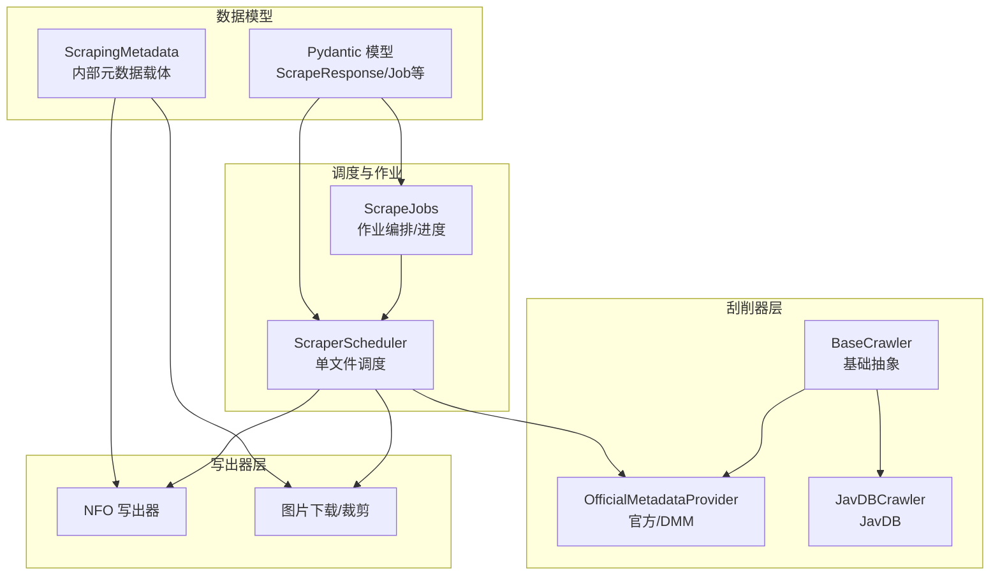
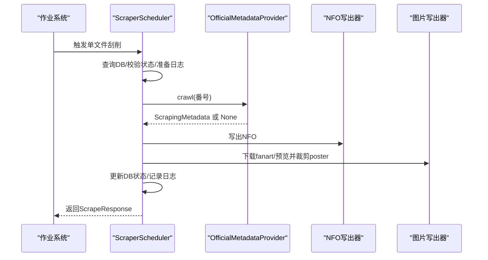
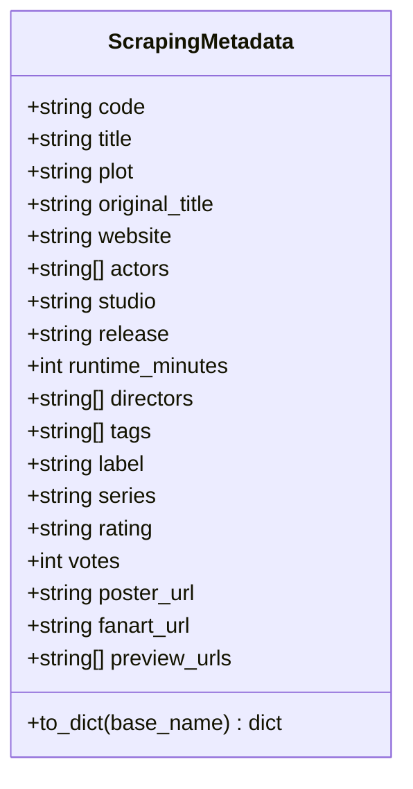
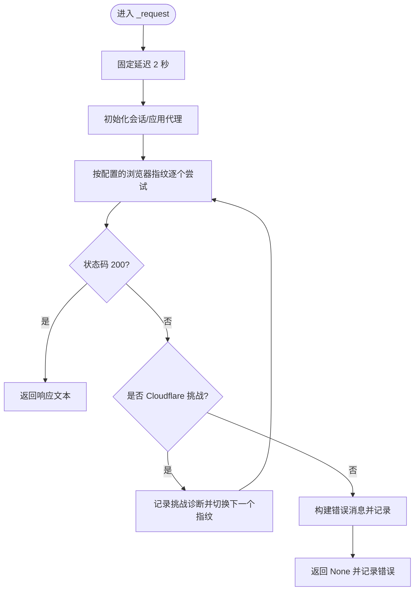
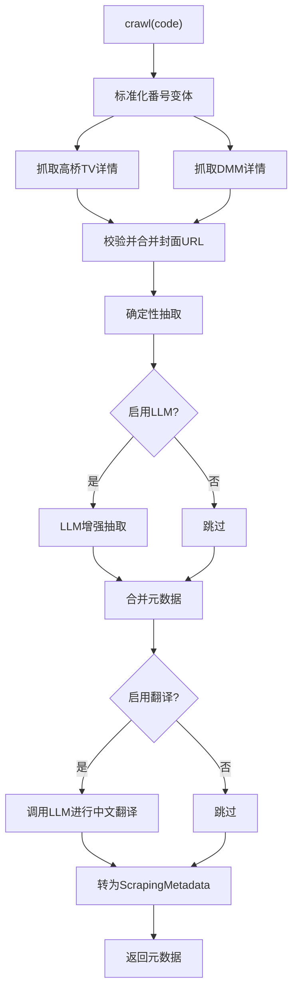
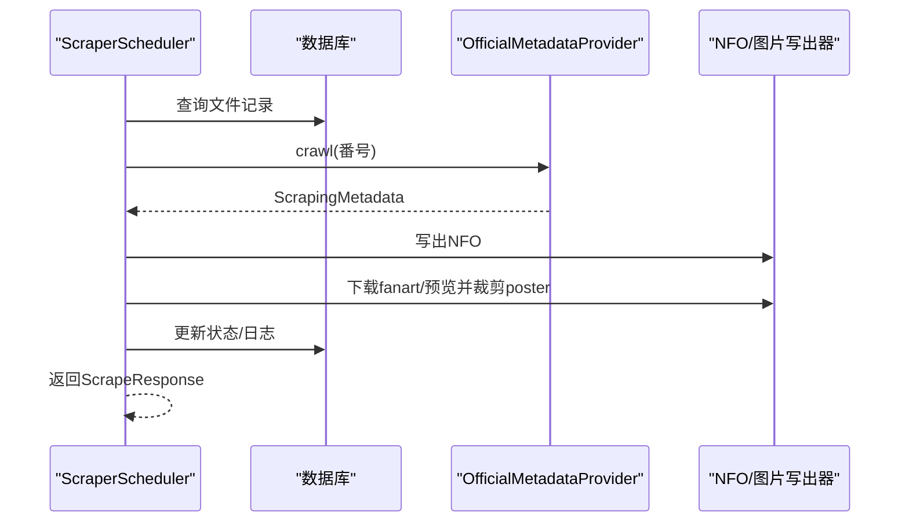
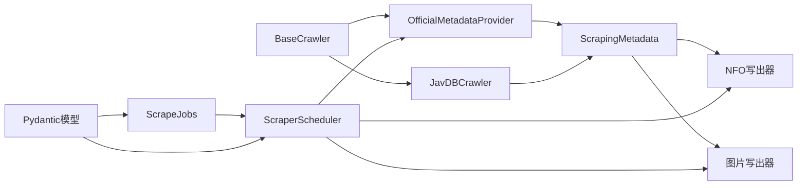

# 元数据刮削器

<cite>
**本文引用的文件**
- [app/scrapers/metadata.py](file://app/scrapers/metadata.py)
- [app/scrapers/base.py](file://app/scrapers/base.py)
- [app/scrapers/official.py](file://app/scrapers/official.py)
- [app/scrapers/javdb.py](file://app/scrapers/javdb.py)
- [app/scrapers/writers/nfo.py](file://app/scrapers/writers/nfo.py)
- [app/scrapers/writers/image.py](file://app/scrapers/writers/image.py)
- [app/scraper.py](file://app/scraper.py)
- [app/scrape_jobs.py](file://app/scrape_jobs.py)
- [app/models.py](file://app/models.py)
- [tests/test_scrapers/test_metadata.py](file://tests/test_scrapers/test_metadata.py)
- [config/profiles/local.env.example](file://config/profiles/local.env.example)
- [scripts/lib/noctra.sh](file://scripts/lib/noctra.sh)
</cite>

## 目录
1. [引言](#引言)
2. [项目结构](#项目结构)
3. [核心组件](#核心组件)
4. [架构总览](#架构总览)
5. [详细组件分析](#详细组件分析)
6. [依赖关系分析](#依赖关系分析)
7. [性能考量](#性能考量)
8. [故障排查指南](#故障排查指南)
9. [结论](#结论)
10. [附录](#附录)

## 引言
本文件面向Noctra的元数据刮削子系统，系统性阐述其设计架构、数据提取与处理流程、多源元数据解析与标准化机制、与基础刮削器类的关系与扩展方式，并给出配置选项、数据验证规则与质量控制措施。读者无需深入编程背景即可理解元数据刮削器如何从官方渠道（DMM/高桥TV）与第三方站点（如JavDB）抓取并标准化元数据，最终生成Emby/Kodi兼容的NFO与配套图片资源。

## 项目结构
元数据刮削器位于app/scrapers目录下，围绕以下关键模块协同工作：
- 基础刮削器抽象层：统一请求、诊断、错误处理与重试策略
- 官方元数据提供器：解析DMM/高桥TV等官方页面，支持可选LLM增强抽取与中文翻译
- 第三方元数据提供器：解析JavDB等站点
- 写出器：生成NFO与下载/裁剪图片资源
- 调度器与作业管理：编排单文件刮削全流程，记录进度与日志
- 数据模型：数据库与API交互的Pydantic模型

图表来源
- [app/scrapers/base.py:15-204](file://app/scrapers/base.py#L15-L204)
- [app/scrapers/official.py:67-142](file://app/scrapers/official.py#L67-L142)
- [app/scrapers/javdb.py:14-90](file://app/scrapers/javdb.py#L14-L90)
- [app/scrapers/writers/nfo.py:12-82](file://app/scrapers/writers/nfo.py#L12-L82)
- [app/scrapers/writers/image.py:74-148](file://app/scrapers/writers/image.py#L74-L148)
- [app/scraper.py:82-411](file://app/scraper.py#L82-L411)
- [app/scrape_jobs.py:146-256](file://app/scrape_jobs.py#L146-L256)
- [app/models.py:106-216](file://app/models.py#L106-L216)
- [app/scrapers/metadata.py:6-60](file://app/scrapers/metadata.py#L6-L60)

章节来源
- [app/scrapers/base.py:15-204](file://app/scrapers/base.py#L15-L204)
- [app/scrapers/official.py:67-142](file://app/scrapers/official.py#L67-L142)
- [app/scrapers/javdb.py:14-90](file://app/scrapers/javdb.py#L14-L90)
- [app/scrapers/writers/nfo.py:12-82](file://app/scrapers/writers/nfo.py#L12-L82)
- [app/scrapers/writers/image.py:74-148](file://app/scrapers/writers/image.py#L74-L148)
- [app/scraper.py:82-411](file://app/scraper.py#L82-L411)
- [app/scrape_jobs.py:146-256](file://app/scrape_jobs.py#L146-L256)
- [app/models.py:106-216](file://app/models.py#L106-L216)
- [app/scrapers/metadata.py:6-60](file://app/scrapers/metadata.py#L6-L60)

## 核心组件
- ScrapingMetadata：内部统一的元数据载体，提供to_dict用于模板/写出器消费
- BaseCrawler：抽象基类，统一请求、Cloudflare检测、诊断与错误记录、浏览器指纹轮换
- OfficialMetadataProvider：官方/DMM解析器，支持封面URL校验、确定性抽取与LLM增强抽取、中文翻译
- JavDBCrawler：第三方站点解析器，支持多语言标签映射与标题/剧情提取
- NFO写出器：生成Emby/Kodi兼容的XML元数据文件
- 图片写出器：下载fanart/预览并从fanart裁剪poster
- ScraperScheduler：单文件刮削编排器，串联DB查询、官方解析、NFO写出、图片下载与状态更新
- ScrapeJobs：作业队列与进度管理，驱动批量执行

章节来源
- [app/scrapers/metadata.py:6-60](file://app/scrapers/metadata.py#L6-L60)
- [app/scrapers/base.py:15-204](file://app/scrapers/base.py#L15-L204)
- [app/scrapers/official.py:67-142](file://app/scrapers/official.py#L67-L142)
- [app/scrapers/javdb.py:14-90](file://app/scrapers/javdb.py#L14-L90)
- [app/scrapers/writers/nfo.py:12-82](file://app/scrapers/writers/nfo.py#L12-L82)
- [app/scrapers/writers/image.py:74-148](file://app/scrapers/writers/image.py#L74-L148)
- [app/scraper.py:82-411](file://app/scraper.py#L82-L411)
- [app/scrape_jobs.py:146-256](file://app/scrape_jobs.py#L146-L256)

## 架构总览
元数据刮削器采用“解析器 + 写出器 + 调度器”的分层架构：
- 解析器负责从多个来源抓取HTML并抽取结构化元数据
- 写出器负责将元数据落盘为NFO与图片资源
- 调度器负责编排流程、记录日志与进度、持久化状态

图表来源
- [app/scraper.py:89-374](file://app/scraper.py#L89-L374)
- [app/scrape_jobs.py:146-256](file://app/scrape_jobs.py#L146-L256)
- [app/scrapers/official.py:90-142](file://app/scrapers/official.py#L90-L142)
- [app/scrapers/writers/nfo.py:12-82](file://app/scrapers/writers/nfo.py#L12-L82)
- [app/scrapers/writers/image.py:74-148](file://app/scrapers/writers/image.py#L74-L148)

## 详细组件分析

### ScrapingMetadata：元数据载体与标准化
- 字段覆盖基础信息、制作信息、媒体资源三类，提供to_dict便于模板/写出器消费
- to_dict根据基础文件名生成附属资源命名，确保与媒体文件同名对齐

图表来源
- [app/scrapers/metadata.py:6-60](file://app/scrapers/metadata.py#L6-L60)

章节来源
- [app/scrapers/metadata.py:6-60](file://app/scrapers/metadata.py#L6-L60)
- [tests/test_scrapers/test_metadata.py:6-54](file://tests/test_scrapers/test_metadata.py#L6-L54)

### BaseCrawler：请求与诊断抽象
- 统一请求封装，内置固定延迟、浏览器指纹轮换、Cloudflare挑战检测
- 提供诊断记录与错误消息构建，便于上层映射用户提示

图表来源
- [app/scrapers/base.py:124-204](file://app/scrapers/base.py#L124-L204)

章节来源
- [app/scrapers/base.py:15-204](file://app/scrapers/base.py#L15-L204)

### OfficialMetadataProvider：官方/DMM解析与LLM增强
- 支持高桥TV与DMM双源解析，自动校验封面URL有效性
- 确定性抽取与LLM增强抽取并行，合并策略优先使用LLM覆盖
- 可选中文翻译，基于外部LLM服务
- 输出标准化为ScrapingMetadata，补充网站链接、海报/剧照URL

图表来源
- [app/scrapers/official.py:90-142](file://app/scrapers/official.py#L90-L142)
- [app/scrapers/official.py:284-310](file://app/scrapers/official.py#L284-L310)
- [app/scrapers/official.py:500-562](file://app/scrapers/official.py#L500-L562)
- [app/scrapers/official.py:563-608](file://app/scrapers/official.py#L563-L608)
- [app/scrapers/official.py:657-686](file://app/scrapers/official.py#L657-L686)

章节来源
- [app/scrapers/official.py:67-142](file://app/scrapers/official.py#L67-L142)
- [app/scrapers/official.py:284-310](file://app/scrapers/official.py#L284-L310)
- [app/scrapers/official.py:500-562](file://app/scrapers/official.py#L500-L562)
- [app/scrapers/official.py:563-608](file://app/scrapers/official.py#L563-L608)
- [app/scrapers/official.py:657-686](file://app/scrapers/official.py#L657-L686)

### JavDBCrawler：第三方站点解析
- 通过搜索页定位详情页，解析标题、演员、标签、发行日期、时长、评分、剧情、封面与预览图
- 支持中/英/日多语言标签映射，提升跨语言站点适配能力

章节来源
- [app/scrapers/javdb.py:14-90](file://app/scrapers/javdb.py#L14-L90)
- [app/scrapers/javdb.py:150-203](file://app/scrapers/javdb.py#L150-L203)

### NFO写出器：Emby/Kodi兼容XML
- 生成movie根节点，填充标题、原名、演员、年份、IMDB ID、上映日期、时长、评分、投票、类型/标签、制片厂、标签、系列、导演、网站、海报/封面、fanart与预览缩略图
- 对剧情文本进行CDATA安全注入

章节来源
- [app/scrapers/writers/nfo.py:12-82](file://app/scrapers/writers/nfo.py#L12-L82)
- [app/scrapers/writers/nfo.py:97-116](file://app/scrapers/writers/nfo.py#L97-L116)
- [app/scrapers/writers/nfo.py:136-142](file://app/scrapers/writers/nfo.py#L136-L142)

### 图片写出器：下载与裁剪
- 下载fanart/预览图，必要时从fanart右侧区域裁剪poster
- 支持进度回调，便于UI展示

章节来源
- [app/scrapers/writers/image.py:74-148](file://app/scrapers/writers/image.py#L74-L148)
- [app/scrapers/writers/image.py:151-180](file://app/scrapers/writers/image.py#L151-L180)

### ScraperScheduler：单文件刮削编排
- 查询DB、校验状态、调用官方解析器、写出NFO、下载/裁剪图片、更新DB状态与日志
- 将技术错误映射为用户友好提示，支持异步进度回调

图表来源
- [app/scraper.py:89-374](file://app/scraper.py#L89-L374)

章节来源
- [app/scraper.py:82-411](file://app/scraper.py#L82-L411)

### ScrapeJobs：作业编排与进度
- 队列化管理单次/批量刮削任务，维护当前文件、阶段、进度百分比与最近日志
- 与调度器配合，驱动单文件执行并回传事件

章节来源
- [app/scrape_jobs.py:146-256](file://app/scrape_jobs.py#L146-L256)

## 依赖关系分析
- 解析器依赖基础刮削器的请求与诊断能力
- 官方解析器依赖BeautifulSoup解析HTML、curl_cffi/aiohttp进行HTTP请求
- 写出器依赖ScrapingMetadata作为输入
- 调度器依赖数据库连接与写出器
- 作业系统依赖调度器与模型定义

图表来源
- [app/scrapers/base.py:15-204](file://app/scrapers/base.py#L15-L204)
- [app/scrapers/official.py:67-142](file://app/scrapers/official.py#L67-L142)
- [app/scrapers/javdb.py:14-90](file://app/scrapers/javdb.py#L14-L90)
- [app/scrapers/metadata.py:6-60](file://app/scrapers/metadata.py#L6-L60)
- [app/scrapers/writers/nfo.py:12-82](file://app/scrapers/writers/nfo.py#L12-L82)
- [app/scrapers/writers/image.py:74-148](file://app/scrapers/writers/image.py#L74-L148)
- [app/scraper.py:82-411](file://app/scraper.py#L82-L411)
- [app/scrape_jobs.py:146-256](file://app/scrape_jobs.py#L146-L256)
- [app/models.py:106-216](file://app/models.py#L106-L216)

章节来源
- [app/scrapers/base.py:15-204](file://app/scrapers/base.py#L15-L204)
- [app/scrapers/official.py:67-142](file://app/scrapers/official.py#L67-L142)
- [app/scrapers/javdb.py:14-90](file://app/scrapers/javdb.py#L14-L90)
- [app/scrapers/metadata.py:6-60](file://app/scrapers/metadata.py#L6-L60)
- [app/scrapers/writers/nfo.py:12-82](file://app/scrapers/writers/nfo.py#L12-L82)
- [app/scrapers/writers/image.py:74-148](file://app/scrapers/writers/image.py#L74-L148)
- [app/scraper.py:82-411](file://app/scraper.py#L82-L411)
- [app/scrape_jobs.py:146-256](file://app/scrape_jobs.py#L146-L256)
- [app/models.py:106-216](file://app/models.py#L106-L216)

## 性能考量
- 请求节流：每次请求前固定延迟，降低被反爬/限速风险
- 重试与指纹轮换：遇到Cloudflare挑战自动切换浏览器指纹重试
- 并发与异步：图片下载与NFO写出采用异步会话，提高吞吐
- 缓存与去重：封面URL校验与唯一化减少无效请求
- 进度与日志：分阶段进度百分比与最近日志上限，便于可观测性

## 故障排查指南
- Cloudflare拦截：系统会检测并提示需切换网络或配置代理
- 解析失败：官方/DMM或第三方站点页面结构变化导致解析失败，需检查对应解析逻辑
- 翻译失败：LLM API未配置或返回非JSON，系统会降级保留原文
- 图片下载失败：网络异常或URL失效，系统会记录并继续后续步骤
- 用户提示映射：调度器将技术错误映射为用户可理解的提示

章节来源
- [app/scrapers/base.py:88-123](file://app/scrapers/base.py#L88-L123)
- [app/scraper.py:59-80](file://app/scraper.py#L59-L80)
- [app/scrapers/official.py:500-562](file://app/scrapers/official.py#L500-L562)
- [app/scrapers/official.py:563-608](file://app/scrapers/official.py#L563-L608)

## 结论
元数据刮削器通过清晰的分层设计与稳健的错误处理，实现了从多源网页到标准化元数据再到Emby/Kodi兼容文件的完整链路。官方/DMM解析器提供高置信度的基础数据，第三方解析器与LLM增强进一步提升覆盖率与准确性。调度器与作业系统保证了端到端的可观测性与可运维性。

## 附录

### 配置选项
- LLM相关（可选）
  - NOCTRA_LLM_ENABLED：启用/禁用LLM增强抽取
  - NOCTRA_LLM_BASE_URL：LLM服务地址
  - NOCTRA_LLM_WIRE_API：LLM接口类型（如responses）
  - NOCTRA_LLM_MODEL：模型名称
  - NOCTRA_LLM_API_KEY：LLM鉴权密钥
  - NOCTRA_LLM_TIMEOUT_SECONDS：请求超时秒数
  - NOCTRA_LLM_MAX_OUTPUT_TOKENS：最大输出token数
- 运行参数
  - DB_PATH：SQLite数据库路径
  - NOCTRA_PORT/NOCTRA_BIND_HOST：服务监听端口与主机
  - NOCTRA_SOURCE_DIR/NOCTRA_DIST_DIR/NOCTRA_DATA_DIR：源目录/目标目录/数据目录
  - NOCTRA_PYTHON_BIN：Python可执行路径

章节来源
- [config/profiles/local.env.example:16-22](file://config/profiles/local.env.example#L16-L22)
- [scripts/lib/noctra.sh:13-73](file://scripts/lib/noctra.sh#L13-L73)
- [app/scraper.py:18-22](file://app/scraper.py#L18-L22)

### 数据验证规则与质量控制
- 番号标准化：确保输入番号格式一致，避免大小写/连字符差异
- 页面校验：官方/DMM页面需包含标识符或特定关键词，避免误判
- 封面URL校验：HEAD/GET探测内容类型与状态码，过滤无效URL
- 冲突检测：当多源出现不一致字段（如番号），记录冲突证据
- 置信度评估：根据抽取字段完整性与来源数量评估置信度
- 中文翻译：仅在存在可翻译文本且LLM可用时进行

章节来源
- [app/scrapers/official.py:688-705](file://app/scrapers/official.py#L688-L705)
- [app/scrapers/official.py:610-655](file://app/scrapers/official.py#L610-L655)
- [app/scrapers/official.py:213-240](file://app/scrapers/official.py#L213-L240)
- [app/scrapers/official.py:708-735](file://app/scrapers/official.py#L708-L735)

### 元数据映射与字段标准化
- 字段映射
  - 标题/原名：优先使用官方/DMM标题，否则回退至番号
  - 演员/标签/发行日期/时长/导演/制片厂/标签/系列/评分/投票
  - 网站链接：优先使用官方/DMM产品页URL
  - 媒体资源：海报/剧照URL来自封面校验与页面提取
- 标准化策略
  - 日期格式：统一为YYYY-MM-DD
  - 标签/类型：去重并规范化
  - 特殊后缀：根据文件名后缀自动添加“中字/无码破解”等类型

章节来源
- [app/scrapers/official.py:657-686](file://app/scrapers/official.py#L657-L686)
- [app/scrapers/writers/nfo.py:97-116](file://app/scrapers/writers/nfo.py#L97-L116)
- [app/scrapers/javdb.py:319-353](file://app/scrapers/javdb.py#L319-L353)

### 冲突解决策略
- 合并策略：LLM覆盖优先于确定性抽取，低置信度覆盖高置信度
- 冲突记录：记录证据与来源，便于人工复核
- 回退机制：任一环节失败均记录错误并映射为用户提示

章节来源
- [app/scrapers/official.py:708-735](file://app/scrapers/official.py#L708-L735)
- [app/scraper.py:59-80](file://app/scraper.py#L59-L80)