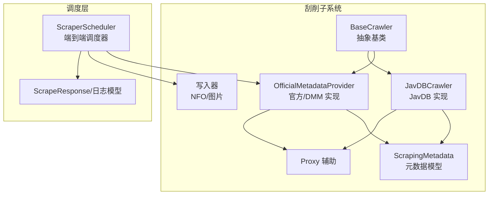
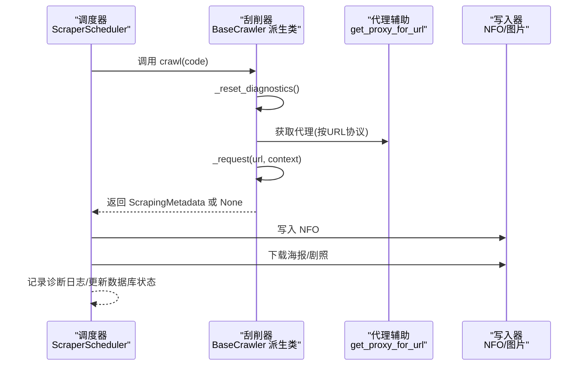
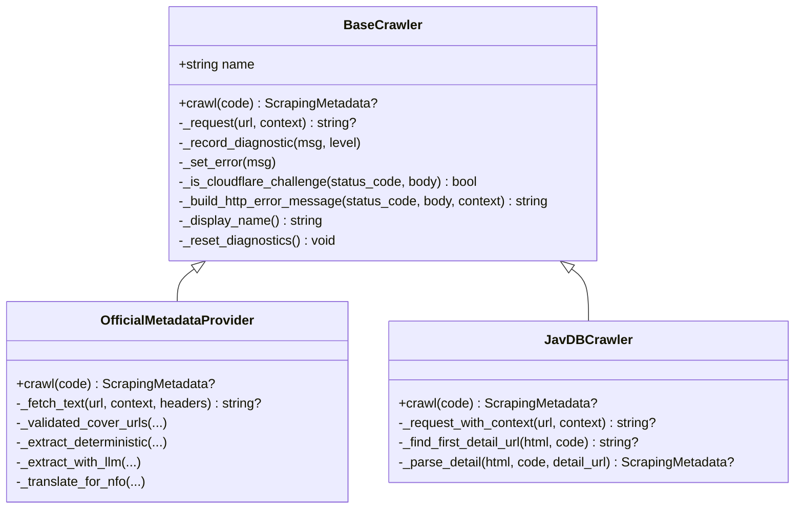
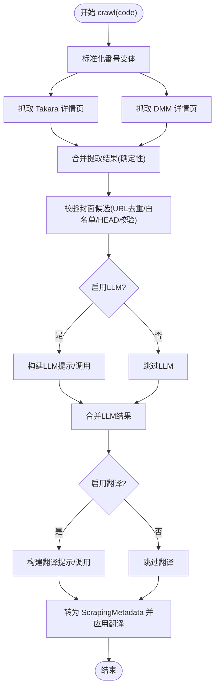
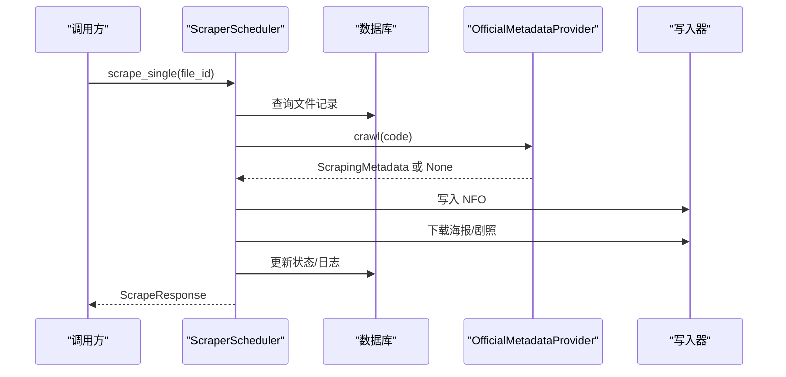
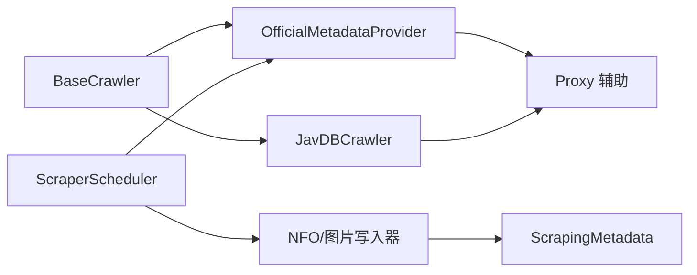

# 刮削器基类

<cite>
**本文引用的文件**
- [app/scrapers/base.py](file://app/scrapers/base.py)
- [app/scrapers/official.py](file://app/scrapers/official.py)
- [app/scrapers/javdb.py](file://app/scrapers/javdb.py)
- [app/scrapers/metadata.py](file://app/scrapers/metadata.py)
- [app/scrapers/proxy.py](file://app/scrapers/proxy.py)
- [app/scraper.py](file://app/scraper.py)
- [app/models.py](file://app/models.py)
- [app/scrapers/writers/nfo.py](file://app/scrapers/writers/nfo.py)
- [app/scrapers/writers/image.py](file://app/scrapers/writers/image.py)
- [tests/test_scrapers/test_base.py](file://tests/test_scrapers/test_base.py)
- [tests/test_scrapers/test_official.py](file://tests/test_scrapers/test_official.py)
- [tests/test_scrapers/test_javdb.py](file://tests/test_scrapers/test_javdb.py)
</cite>

## 目录
1. [引言](#引言)
2. [项目结构](#项目结构)
3. [核心组件](#核心组件)
4. [架构总览](#架构总览)
5. [详细组件分析](#详细组件分析)
6. [依赖关系分析](#依赖关系分析)
7. [性能与可靠性考量](#性能与可靠性考量)
8. [故障排查指南](#故障排查指南)
9. [结论](#结论)
10. [附录：自定义刮削器开发指南](#附录自定义刮削器开发指南)

## 引言
本文件围绕 Noctra 的“刮削器基类”进行系统化技术文档编写，目标是帮助开发者快速理解并扩展刮削能力。文档覆盖以下主题：
- 设计模式与抽象接口：基类如何定义统一的异步抓取契约
- 统一框架与通用功能：请求封装、诊断日志、错误处理、Cloudflare 挑战检测
- 继承体系与扩展点：官方来源与第三方来源的实现差异
- 插件机制与调度集成：如何被调度器编排、如何输出诊断日志
- 配置参数与生命周期管理：会话复用、代理、请求配置
- 自定义开发指南：接口实现规范、最佳实践与常见陷阱

## 项目结构
与“刮削器基类”直接相关的核心目录与文件如下：
- app/scrapers/base.py：定义 BaseCrawler 抽象基类与通用能力
- app/scrapers/official.py：官方/DMM 数据源的具体实现
- app/scrapers/javdb.py：第三方数据源 JavDB 的实现
- app/scrapers/metadata.py：刮削元数据的数据模型
- app/scrapers/proxy.py：代理选择与环境变量解析
- app/scraper.py：端到端调度器，串联“刮削 -> 写NFO -> 下载海报/剧照”
- app/scrapers/writers/*：NFO 写入与图片下载工具
- tests/test_scrapers/*：对基类与具体实现的单元测试

图表来源
- [app/scrapers/base.py:15-204](file://app/scrapers/base.py#L15-L204)
- [app/scrapers/official.py:67-142](file://app/scrapers/official.py#L67-L142)
- [app/scrapers/javdb.py:14-90](file://app/scrapers/javdb.py#L14-L90)
- [app/scrapers/metadata.py:6-60](file://app/scrapers/metadata.py#L6-L60)
- [app/scrapers/proxy.py:27-65](file://app/scrapers/proxy.py#L27-L65)
- [app/scraper.py:82-453](file://app/scraper.py#L82-L453)
- [app/models.py:106-185](file://app/models.py#L106-L185)

章节来源
- [app/scrapers/base.py:15-204](file://app/scrapers/base.py#L15-L204)
- [app/scraper.py:82-453](file://app/scraper.py#L82-L453)

## 核心组件
- 抽象基类 BaseCrawler
  - 定义异步抓取契约 crawl(code)，要求子类实现
  - 提供统一的 HTTP 请求封装 _request，内置固定延迟、多浏览器指纹重试、Cloudflare 挑战检测
  - 提供诊断日志与错误记录：_record_diagnostic、_set_error、_display_name
  - 提供会话复用与代理支持：_session、get_proxy_for_url
- 具体实现
  - OfficialMetadataProvider：官方/DMM 数据源，支持确定性解析与 LLM 辅助抽取
  - JavDBCrawler：第三方 JavDB 数据源，基于搜索页定位详情页再解析
- 元数据模型 ScrapingMetadata：统一的刮削产物结构
- 调度器 ScraperScheduler：编排“查询 -> 解析 -> 写NFO -> 下载图片 -> 更新状态”的全流程，并聚合诊断日志

章节来源
- [app/scrapers/base.py:15-204](file://app/scrapers/base.py#L15-L204)
- [app/scrapers/official.py:67-142](file://app/scrapers/official.py#L67-L142)
- [app/scrapers/javdb.py:14-90](file://app/scrapers/javdb.py#L14-L90)
- [app/scrapers/metadata.py:6-60](file://app/scrapers/metadata.py#L6-L60)
- [app/scraper.py:82-453](file://app/scraper.py#L82-L453)

## 架构总览
下图展示从调度器到具体刮削器再到写入器的整体调用链路与数据流。

图表来源
- [app/scraper.py:89-374](file://app/scraper.py#L89-L374)
- [app/scrapers/base.py:124-204](file://app/scrapers/base.py#L124-L204)
- [app/scrapers/proxy.py:27-65](file://app/scrapers/proxy.py#L27-L65)
- [app/scrapers/writers/nfo.py:12-82](file://app/scrapers/writers/nfo.py#L12-L82)
- [app/scrapers/writers/image.py:74-148](file://app/scrapers/writers/image.py#L74-L148)

## 详细组件分析

### 抽象基类 BaseCrawler
- 角色与职责
  - 定义统一的异步抓取接口 crawl，约束子类行为
  - 封装 HTTP 请求、重试策略、Cloudflare 挑战检测、错误消息构建
  - 提供诊断日志与错误记录，限制最大日志条数，便于前端展示与问题定位
- 关键设计点
  - 请求配置：多浏览器指纹配置、超时、SSL 校验关闭、代理注入
  - 重试策略：遇到 Cloudflare 挑战自动切换指纹继续尝试
  - 诊断与错误：统一的 _record_diagnostic/_set_error，配合 _display_name 显示友好名称
  - 会话复用：_session 单例，避免重复握手开销
- 生命周期与状态
  - 初始化时仅设置内部状态，不建立网络会话
  - 每次抓取前调用 _reset_diagnostics 清空上次诊断
  - last_error 用于上抛给调度器进行用户提示映射

图表来源
- [app/scrapers/base.py:15-204](file://app/scrapers/base.py#L15-L204)
- [app/scrapers/official.py:67-142](file://app/scrapers/official.py#L67-L142)
- [app/scrapers/javdb.py:14-90](file://app/scrapers/javdb.py#L14-L90)

章节来源
- [app/scrapers/base.py:15-204](file://app/scrapers/base.py#L15-L204)

### 官方/DMM 刮削器 OfficialMetadataProvider
- 设计要点
  - 支持 Takara 与 DMM 双源抓取，合并提取结果
  - 确定性解析为主，可选 LLM 辅助抽取，支持中文翻译
  - 图片 URL 校验与优先级策略，封面候选去重与白名单过滤
- 扩展点
  - 可替换/扩展 LLM 抽取与翻译逻辑
  - 可新增更多数据源的候选 URL 与解析规则
- 错误与诊断
  - 通过 _record_diagnostic 输出中间步骤日志
  - 通过 last_error 与错误消息映射反馈给调度器

图表来源
- [app/scrapers/official.py:90-142](file://app/scrapers/official.py#L90-L142)
- [app/scrapers/official.py:213-282](file://app/scrapers/official.py#L213-L282)
- [app/scrapers/official.py:500-561](file://app/scrapers/official.py#L500-L561)
- [app/scrapers/official.py:563-607](file://app/scrapers/official.py#L563-L607)

章节来源
- [app/scrapers/official.py:67-142](file://app/scrapers/official.py#L67-L142)
- [app/scrapers/official.py:213-282](file://app/scrapers/official.py#L213-L282)
- [app/scrapers/official.py:500-561](file://app/scrapers/official.py#L500-L561)
- [app/scrapers/official.py:563-607](file://app/scrapers/official.py#L563-L607)

### 第三方 JavDB 刮削器 JavDBCrawler
- 设计要点
  - 先搜索再定位详情页，再解析字段
  - 多语言标签适配（中/英），封面与预览图提取
  - 严格代码匹配与容错回退策略
- 扩展点
  - 可增加更多数据源的搜索/解析规则
  - 可引入代理池与随机 UA/指纹策略
- 错误与诊断
  - 通过 _request_with_context 兼容旧签名，保证向后兼容

章节来源
- [app/scrapers/javdb.py:14-90](file://app/scrapers/javdb.py#L14-L90)
- [app/scrapers/javdb.py:113-149](file://app/scrapers/javdb.py#L113-L149)
- [app/scrapers/javdb.py:150-202](file://app/scrapers/javdb.py#L150-L202)

### 调度器与日志聚合 ScraperScheduler
- 设计要点
  - 端到端流程：校验 -> 查询 -> 解析 -> 写NFO -> 下载图片 -> 更新状态
  - 进度百分比映射、日志持久化、错误映射为用户可读消息
  - 诊断日志桥接：将各刮削器的 diagnostics 聚合到统一日志结构
- 关键接口
  - scrape_single：单文件刮削入口
  - emit/emit_crawler_diagnostics：事件与诊断日志发射
  - _persist_attempt_update：数据库状态持久化

图表来源
- [app/scraper.py:89-374](file://app/scraper.py#L89-L374)
- [app/scraper.py:151-162](file://app/scraper.py#L151-L162)
- [app/scraper.py:427-453](file://app/scraper.py#L427-L453)

章节来源
- [app/scraper.py:82-453](file://app/scraper.py#L82-L453)

### 元数据模型 ScrapingMetadata
- 设计要点
  - 字段覆盖基础信息、制作信息、媒体资源等
  - 提供 to_dict 以便模板渲染与侧车文件生成
- 使用场景
  - 作为写入器输入（NFO/图片）
  - 作为调度器日志与前端展示的数据载体

章节来源
- [app/scrapers/metadata.py:6-60](file://app/scrapers/metadata.py#L6-L60)

### 代理与网络辅助
- 代理选择策略
  - 根据 URL 协议与环境变量选择 HTTPS/HTTP/ALL 代理
  - 支持 bypass 环境判断，避免对直连域名使用代理
- 与刮削器的协作
  - BaseCrawler/_request 与 Official/JavDB 的 _fetch_text/_request 均可复用代理

章节来源
- [app/scrapers/proxy.py:27-65](file://app/scrapers/proxy.py#L27-L65)
- [app/scrapers/base.py:146-156](file://app/scrapers/base.py#L146-L156)
- [app/scrapers/official.py:185-187](file://app/scrapers/official.py#L185-L187)
- [app/scrapers/javdb.py:95-101](file://app/scrapers/javdb.py#L95-L101)

## 依赖关系分析
- 继承关系
  - OfficialMetadataProvider 与 JavDBCrawler 均继承 BaseCrawler
- 调度依赖
  - ScraperScheduler 在运行时实例化 OfficialMetadataProvider 并调用其 crawl
- 写入器依赖
  - NFO 写入器依赖 ScrapingMetadata
  - 图片写入器依赖 ScrapingMetadata 与代理辅助
- 测试依赖
  - 测试覆盖基类不可实例化、官方实现的解析与翻译、JavDB 的搜索/解析路径

图表来源
- [app/scrapers/base.py:15-204](file://app/scrapers/base.py#L15-L204)
- [app/scrapers/official.py:67-142](file://app/scrapers/official.py#L67-L142)
- [app/scrapers/javdb.py:14-90](file://app/scrapers/javdb.py#L14-L90)
- [app/scraper.py:82-453](file://app/scraper.py#L82-L453)
- [app/scrapers/metadata.py:6-60](file://app/scrapers/metadata.py#L6-L60)
- [app/scrapers/proxy.py:27-65](file://app/scrapers/proxy.py#L27-L65)

章节来源
- [app/scrapers/base.py:15-204](file://app/scrapers/base.py#L15-L204)
- [app/scraper.py:82-453](file://app/scraper.py#L82-L453)

## 性能与可靠性考量
- 会话复用与连接复用
  - BaseCrawler/_request 与 Official/JavDB 的 _fetch_text/_request 均使用 requests.Session，减少握手成本
- 重试与降级
  - 遇到 Cloudflare 挑战自动切换浏览器指纹重试
  - 图片 HEAD/GET 双策略与 SSL 异常重试
- 超时与并发
  - 统一超时配置，图片下载使用 aiohttp 并发拉取
- 日志上限与可观测性
  - 诊断日志与调度日志均限制最大条数，避免内存膨胀
- 代理与网络稳定性
  - 代理按 URL 协议选择，支持 bypass，降低不必要的代理开销

章节来源
- [app/scrapers/base.py:124-204](file://app/scrapers/base.py#L124-L204)
- [app/scrapers/official.py:176-211](file://app/scrapers/official.py#L176-L211)
- [app/scrapers/official.py:241-282](file://app/scrapers/official.py#L241-L282)
- [app/scrapers/writers/image.py:44-72](file://app/scrapers/writers/image.py#L44-L72)

## 故障排查指南
- 常见症状与定位
  - HTTP 403/Cloudflare 挑战：查看 _is_cloudflare_challenge 与 _build_http_error_message 的诊断消息
  - 请求异常：查看 _request 中的异常捕获与 _set_error 记录
  - 诊断日志过多：确认 MAX_DIAGNOSTICS 与日志上限
- 调度器层面
  - 用户可读错误映射：_map_failure 将技术错误转换为用户提示
  - 诊断日志桥接：emit_crawler_diagnostics 将各刮削器的 diagnostics 注入统一日志
- 写入器层面
  - NFO 写入失败：检查输出目录权限与 XML 生成
  - 图片下载失败：检查代理配置、URL 可达性、图片类型与裁剪参数

章节来源
- [app/scrapers/base.py:88-123](file://app/scrapers/base.py#L88-L123)
- [app/scraper.py:59-79](file://app/scraper.py#L59-L79)
- [app/scraper.py:151-162](file://app/scraper.py#L151-L162)
- [app/scrapers/writers/nfo.py:12-82](file://app/scrapers/writers/nfo.py#L12-L82)
- [app/scrapers/writers/image.py:74-148](file://app/scrapers/writers/image.py#L74-L148)

## 结论
BaseCrawler 通过统一的抽象接口、完善的诊断与错误处理、以及可插拔的实现，为 Noctra 的刮削体系提供了稳定且可扩展的基础。官方与第三方数据源的实现展示了不同的解析策略与扩展点，调度器则将这些能力整合为端到端的自动化流程。建议在新增数据源时遵循现有实现的模式，确保一致的日志、错误与进度体验。

## 附录：自定义刮削器开发指南
- 必备步骤
  - 新建类继承 BaseCrawler，并实现 crawl(code) 异步方法
  - 设置 name 属性，确保显示友好名称与日志标识
  - 在 crawl 开头调用 _reset_diagnostics，结束后将诊断日志暴露给调度器
- 推荐实践
  - 使用 _request 或 _fetch_text 进行 HTTP 请求，自动处理代理、重试与 Cloudflare 挑战
  - 严格校验关键字段（如番号），不匹配时设置 _set_error 并返回 None
  - 将中间步骤通过 _record_diagnostic 记录，便于问题定位
  - 尽量复用代理与会话，避免重复初始化
- 接口实现规范
  - crawl 返回 ScrapingMetadata 或 None
  - 不要吞掉异常；必要时通过 _set_error 记录错误
  - 保持异步非阻塞，避免在 _request 之外做同步耗时操作
- 与调度器集成
  - 调度器会读取 last_error 与 diagnostics，用于用户提示与日志展示
  - 若需额外进度反馈，可在 crawl 中通过 _record_diagnostic 发出阶段消息
- 示例参考
  - 官方实现：[app/scrapers/official.py:90-142](file://app/scrapers/official.py#L90-L142)
  - 第三方实现：[app/scrapers/javdb.py:41-90](file://app/scrapers/javdb.py#L41-L90)
  - 基类契约与通用能力：[app/scrapers/base.py:52-204](file://app/scrapers/base.py#L52-L204)

章节来源
- [app/scrapers/base.py:52-204](file://app/scrapers/base.py#L52-L204)
- [app/scrapers/official.py:90-142](file://app/scrapers/official.py#L90-L142)
- [app/scrapers/javdb.py:41-90](file://app/scrapers/javdb.py#L41-L90)