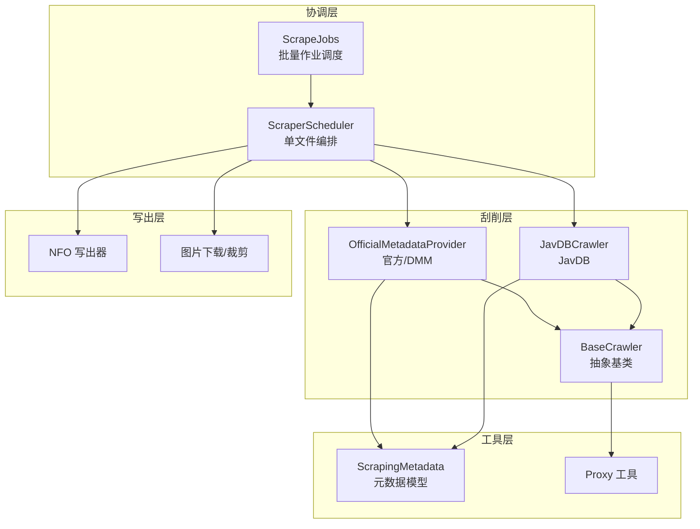
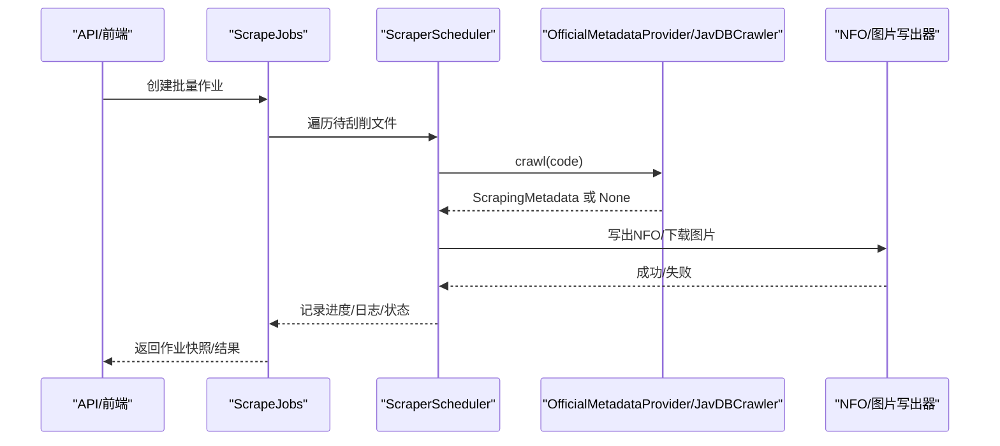
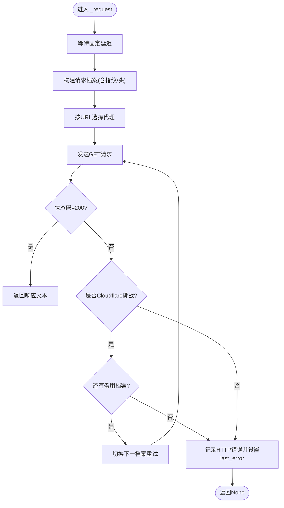
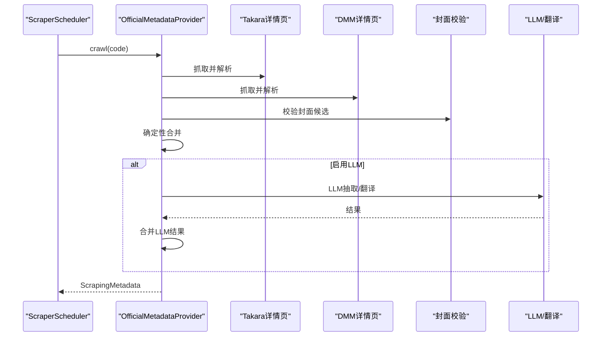
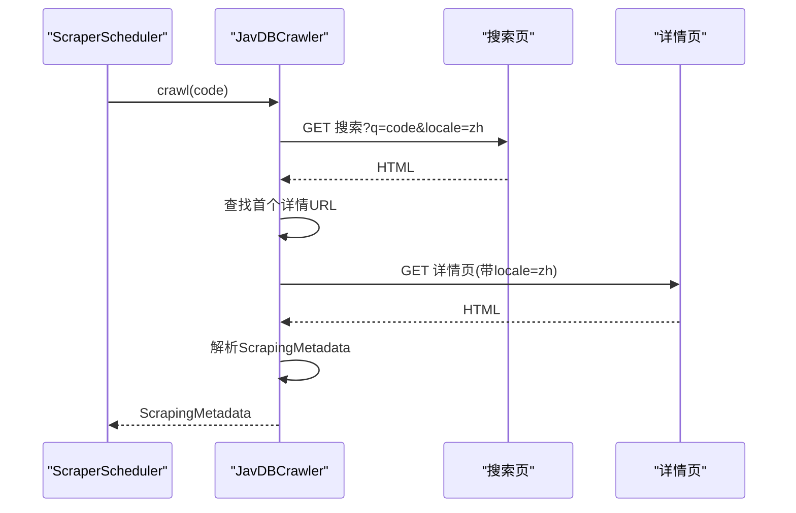
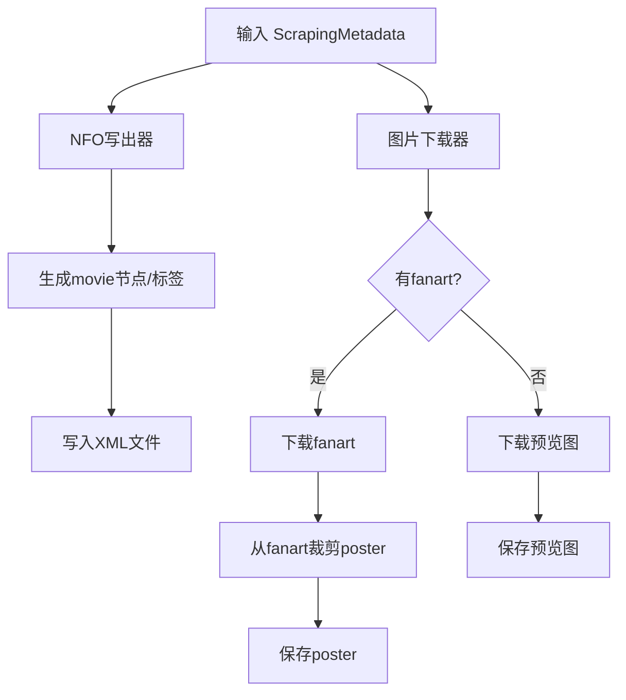
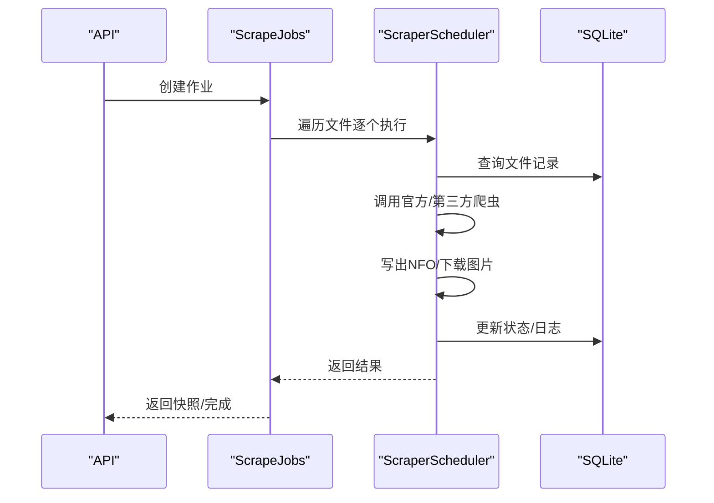
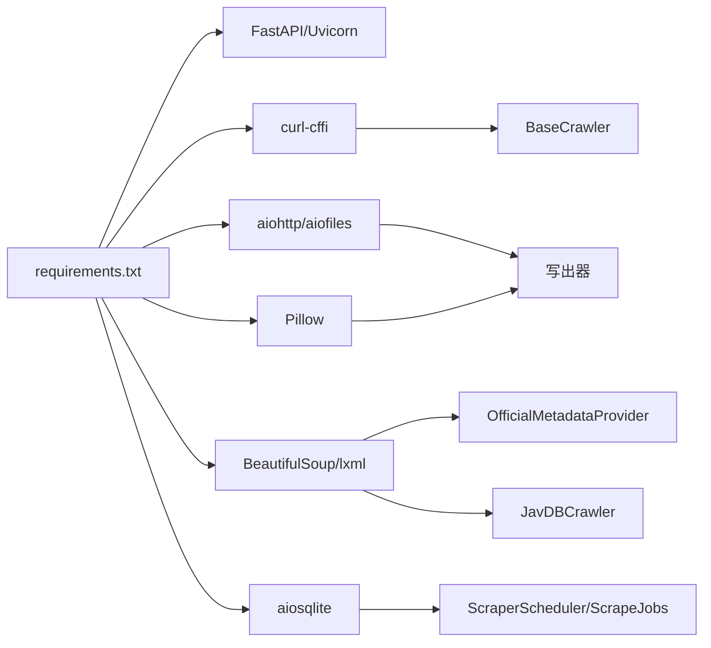

# 刮削引擎

<cite>
**本文引用的文件**   
- [app/scrapers/base.py](file://app/scrapers/base.py)
- [app/scrapers/official.py](file://app/scrapers/official.py)
- [app/scrapers/javdb.py](file://app/scrapers/javdb.py)
- [app/scrapers/metadata.py](file://app/scrapers/metadata.py)
- [app/scrapers/proxy.py](file://app/scrapers/proxy.py)
- [app/scrapers/writers/nfo.py](file://app/scrapers/writers/nfo.py)
- [app/scrapers/writers/image.py](file://app/scrapers/writers/image.py)
- [app/scraper.py](file://app/scraper.py)
- [app/scrape_jobs.py](file://app/scrape_jobs.py)
- [app/models.py](file://app/models.py)
- [app/main.py](file://app/main.py)
- [requirements.txt](file://requirements.txt)
- [tests/test_scrapers/test_official.py](file://tests/test_scrapers/test_official.py)
- [tests/test_scrapers/test_javdb.py](file://tests/test_scrapers/test_javdb.py)
</cite>

## 目录
1. [引言](#引言)
2. [项目结构](#项目结构)
3. [核心组件](#核心组件)
4. [架构总览](#架构总览)
5. [详细组件分析](#详细组件分析)
6. [依赖关系分析](#依赖关系分析)
7. [性能考量](#性能考量)
8. [故障排查指南](#故障排查指南)
9. [结论](#结论)
10. [附录](#附录)

## 引言
本文件面向Noctra的刮削引擎，系统性阐述其核心架构、多源支持机制与数据提取算法，并给出官方刮削器、JavDB刮削器与其他元数据刮削器的实现原理与使用方法。同时覆盖代理服务器配置、请求头管理与反爬虫应对策略，提供扩展开发指南、自定义刮削器编写规范与最佳实践，以及性能优化、并发控制与错误处理机制。

## 项目结构
Noctra的刮削子系统位于app/scrapers目录，围绕“元数据模型 + 抽象爬虫基类 + 各源实现 + 写出器”的分层组织：
- 抽象层：BaseCrawler定义通用请求、诊断、Cloudflare检测与重试策略
- 官方源：OfficialMetadataProvider对接DMM/Takara等站点，支持确定性解析与LLM增强
- 第三方源：JavDBCrawler对接javdb.com，支持搜索与详情页解析
- 写出层：NFO写出与图片下载/裁剪
- 协调层：ScraperScheduler编排单文件刮削流程；ScrapeJobs协调批量作业

图表来源
- [app/scraper.py:82-453](file://app/scraper.py#L82-L453)
- [app/scrape_jobs.py:146-256](file://app/scrape_jobs.py#L146-L256)
- [app/scrapers/base.py:15-204](file://app/scrapers/base.py#L15-L204)
- [app/scrapers/official.py:67-686](file://app/scrapers/official.py#L67-L686)
- [app/scrapers/javdb.py:14-353](file://app/scrapers/javdb.py#L14-L353)
- [app/scrapers/metadata.py:6-60](file://app/scrapers/metadata.py#L6-L60)
- [app/scrapers/proxy.py:27-65](file://app/scrapers/proxy.py#L27-L65)
- [app/scrapers/writers/nfo.py:12-142](file://app/scrapers/writers/nfo.py#L12-L142)
- [app/scrapers/writers/image.py:60-180](file://app/scrapers/writers/image.py#L60-L180)

章节来源
- [app/scraper.py:82-453](file://app/scraper.py#L82-L453)
- [app/scrape_jobs.py:146-256](file://app/scrape_jobs.py#L146-L256)
- [app/scrapers/base.py:15-204](file://app/scrapers/base.py#L15-L204)
- [app/scrapers/official.py:67-686](file://app/scrapers/official.py#L67-L686)
- [app/scrapers/javdb.py:14-353](file://app/scrapers/javdb.py#L14-L353)
- [app/scrapers/metadata.py:6-60](file://app/scrapers/metadata.py#L6-L60)
- [app/scrapers/proxy.py:27-65](file://app/scrapers/proxy.py#L27-L65)
- [app/scrapers/writers/nfo.py:12-142](file://app/scrapers/writers/nfo.py#L12-L142)
- [app/scrapers/writers/image.py:60-180](file://app/scrapers/writers/image.py#L60-L180)

## 核心组件
- 抽象爬虫基类 BaseCrawler
  - 统一请求封装、浏览器指纹重试、Cloudflare挑战检测、诊断日志与错误记录
  - 提供固定延迟与代理选择能力
- 官方刮削器 OfficialMetadataProvider
  - 支持DMM/Takara双源抓取与合并，封面URL校验，确定性解析与LLM增强
- JavDB刮削器 JavDBCrawler
  - 搜索页定位详情页，详情页解析，多语言标签适配
- 元数据模型 ScrapingMetadata
  - 统一输出字段，便于NFO与艺术图写出
- 写出器
  - NFO写出器：生成Emby/Kodi兼容XML
  - 图片下载器：异步下载fanart/预览，必要时从fanart裁剪poster
- 协调器
  - ScraperScheduler：单文件刮削全流程编排
  - ScrapeJobs：批量作业队列、进度与日志追踪

章节来源
- [app/scrapers/base.py:15-204](file://app/scrapers/base.py#L15-L204)
- [app/scrapers/official.py:67-686](file://app/scrapers/official.py#L67-L686)
- [app/scrapers/javdb.py:14-353](file://app/scrapers/javdb.py#L14-L353)
- [app/scrapers/metadata.py:6-60](file://app/scrapers/metadata.py#L6-L60)
- [app/scrapers/writers/nfo.py:12-142](file://app/scrapers/writers/nfo.py#L12-L142)
- [app/scrapers/writers/image.py:60-180](file://app/scrapers/writers/image.py#L60-L180)
- [app/scraper.py:82-453](file://app/scraper.py#L82-L453)
- [app/scrape_jobs.py:146-256](file://app/scrape_jobs.py#L146-L256)

## 架构总览
Noctra的刮削引擎采用“协调器 + 多源爬虫 + 写出器”的分层设计。协调器负责状态推进、日志持久化与错误映射；各源爬虫负责具体站点的数据提取；写出器负责生成NFO与媒体资源。

图表来源
- [app/scrape_jobs.py:146-256](file://app/scrape_jobs.py#L146-L256)
- [app/scraper.py:89-410](file://app/scraper.py#L89-L410)
- [app/scrapers/official.py:90-141](file://app/scrapers/official.py#L90-L141)
- [app/scrapers/javdb.py:41-89](file://app/scrapers/javdb.py#L41-L89)
- [app/scrapers/writers/nfo.py:12-82](file://app/scrapers/writers/nfo.py#L12-L82)
- [app/scrapers/writers/image.py:74-148](file://app/scrapers/writers/image.py#L74-L148)

## 详细组件分析

### 抽象爬虫基类 BaseCrawler
- 设计要点
  - 统一请求封装：固定延迟、浏览器指纹轮换、超时与SSL校验关闭、代理注入
  - 反爬虫应对：Cloudflare挑战检测与自动切换指纹重试
  - 诊断与错误：最多保留N条诊断日志，错误消息格式化
- 关键流程
  - _request：按配置的请求档案依次尝试，遇403且含Cloudflare提示则切换下一种指纹
  - _is_cloudflare_challenge：基于状态码与正文关键词判断
  - _build_http_error_message：生成用户可读错误信息
- 并发与稳定性
  - 使用curl_cffi requests.Session复用连接
  - 通过固定延迟降低触发风控概率

图表来源
- [app/scrapers/base.py:124-204](file://app/scrapers/base.py#L124-L204)

章节来源
- [app/scrapers/base.py:15-204](file://app/scrapers/base.py#L15-L204)

### 官方刮削器 OfficialMetadataProvider
- 多源抓取与合并
  - Takara详情页与DMM详情页并行抓取，分别解析并合并
  - 封面URL候选集生成与HEAD/GET校验，过滤占位与不可用链接
- 数据提取
  - Takara：表格字段解析，校验品番一致性
  - DMM：OG标签、演员/标签/发行/时长/评分/投票/封面等字段解析
- LLM增强与翻译
  - 可选启用LLM进行二次抽取与中文翻译，失败时回退确定性解析
- 输出转换
  - 转换为ScrapingMetadata，设置海报/幻灯片URL等

图表来源
- [app/scrapers/official.py:90-141](file://app/scrapers/official.py#L90-L141)
- [app/scrapers/official.py:143-211](file://app/scrapers/official.py#L143-L211)
- [app/scrapers/official.py:213-282](file://app/scrapers/official.py#L213-L282)
- [app/scrapers/official.py:500-561](file://app/scrapers/official.py#L500-L561)
- [app/scrapers/official.py:563-607](file://app/scrapers/official.py#L563-L607)

章节来源
- [app/scrapers/official.py:67-686](file://app/scrapers/official.py#L67-L686)

### JavDB刮削器 JavDBCrawler
- 搜索到详情的两阶段流程
  - 搜索页：优先匹配.uid/.video-title中的代码，其次标题包含目标代码
  - 详情页：解析识别码、标题、演员、简介、评分/投票、封面与预览图
- 多语言标签适配
  - 中文/繁体/英文标签集合统一解析
- URL本地化
  - 详情页强制locale参数为中文，提升解析稳定性

图表来源
- [app/scrapers/javdb.py:41-89](file://app/scrapers/javdb.py#L41-L89)
- [app/scrapers/javdb.py:113-148](file://app/scrapers/javdb.py#L113-L148)
- [app/scrapers/javdb.py:150-202](file://app/scrapers/javdb.py#L150-L202)
- [app/scrapers/javdb.py:334-353](file://app/scrapers/javdb.py#L334-L353)

章节来源
- [app/scrapers/javdb.py:14-353](file://app/scrapers/javdb.py#L14-L353)

### 写出器：NFO与图片
- NFO写出器
  - 生成movie根节点，填充plot/title/originaltitle/actors/year/studio/label/series/director/website/poster/fanart等
  - 特殊处理：CDATA转义、额外genre推导（依据番号后缀）
- 图片下载器
  - 异步下载fanart/预览，必要时从fanart裁剪poster
  - 代理透传、超时与分块写入、扩展名推断

图表来源
- [app/scrapers/writers/nfo.py:12-82](file://app/scrapers/writers/nfo.py#L12-L82)
- [app/scrapers/writers/nfo.py:136-142](file://app/scrapers/writers/nfo.py#L136-L142)
- [app/scrapers/writers/image.py:74-148](file://app/scrapers/writers/image.py#L74-L148)
- [app/scrapers/writers/image.py:151-180](file://app/scrapers/writers/image.py#L151-L180)

章节来源
- [app/scrapers/writers/nfo.py:12-142](file://app/scrapers/writers/nfo.py#L12-L142)
- [app/scrapers/writers/image.py:60-180](file://app/scrapers/writers/image.py#L60-L180)

### 协调器：单文件与批量
- ScraperScheduler
  - 校验文件状态与路径，调用官方源爬取，写出NFO并下载图片，最终更新数据库状态
  - 错误映射：针对不同阶段与源，生成用户友好提示
- ScrapeJobs
  - 作业队列、进度百分比映射、最近日志截断、取消与完成状态推进

图表来源
- [app/scraper.py:89-410](file://app/scraper.py#L89-L410)
- [app/scrape_jobs.py:146-256](file://app/scrape_jobs.py#L146-L256)

章节来源
- [app/scraper.py:82-453](file://app/scraper.py#L82-L453)
- [app/scrape_jobs.py:146-256](file://app/scrape_jobs.py#L146-L256)

## 依赖关系分析
- 运行时依赖
  - FastAPI/Uvicorn：服务端框架
  - curl-cffi/aiohttp：HTTP客户端与会话
  - BeautifulSoup/lxml：HTML解析
  - Pillow：图像裁剪
  - aiosqlite：异步SQLite
- 组件耦合
  - 爬虫依赖BaseCrawler与Proxy工具
  - 写出器依赖ScrapingMetadata
  - 协调器依赖爬虫与写出器，并持久化状态

图表来源
- [requirements.txt:1-12](file://requirements.txt#L1-L12)
- [app/scrapers/base.py:9-12](file://app/scrapers/base.py#L9-L12)
- [app/scrapers/official.py:10-16](file://app/scrapers/official.py#L10-L16)
- [app/scrapers/javdb.py:8-11](file://app/scrapers/javdb.py#L8-L11)
- [app/scrapers/writers/image.py:7-12](file://app/scrapers/writers/image.py#L7-L12)
- [app/scraper.py:13-18](file://app/scraper.py#L13-L18)

章节来源
- [requirements.txt:1-12](file://requirements.txt#L1-L12)

## 性能考量
- 请求节流与反风控
  - 固定延迟降低触发风控概率
  - 多档案指纹轮换与Cloudflare挑战自动切换
- 异步I/O
  - aiohttp异步下载、aiosqlite异步写库
- 缓存与去重
  - 代理按URL scheme选择，减少无效代理开销
  - 封面URL去重与校验，避免重复下载
- 并发控制建议
  - 控制同时发起的请求数量，避免被源站限速
  - 使用连接池与合理的超时配置
- I/O优化
  - 分块写入、JPEG质量参数调优
  - fanart裁剪仅在需要时执行

[本节为通用指导，无需特定文件引用]

## 故障排查指南
- 常见错误与定位
  - HTTP 403/Cloudflare挑战：检查代理配置与指纹切换逻辑
  - 源站返回但解析失败：查看爬虫诊断日志与last_error
  - NFO写出/图片下载失败：确认输出目录权限与网络可达性
- 用户提示映射
  - 不同阶段与源失败时，映射为用户可读提示，便于前端展示
- 日志与诊断
  - BaseCrawler维护诊断队列，限制最大条数
  - 协调器持久化日志，支持最近日志截断

章节来源
- [app/scrapers/base.py:72-86](file://app/scrapers/base.py#L72-L86)
- [app/scraper.py:59-79](file://app/scraper.py#L59-L79)
- [app/scraper.py:151-162](file://app/scraper.py#L151-L162)

## 结论
Noctra的刮削引擎以清晰的分层设计实现了多源数据聚合与稳定写出。通过抽象基类统一反爬虫策略、通过官方与第三方源互补覆盖、通过写出器保证输出一致性，配合协调器的可观测与容错，形成了可扩展、可维护的刮削体系。建议在生产环境中结合代理、限速与监控进一步提升稳定性与吞吐。

## 附录

### 代理服务器配置与请求头管理
- 代理选择
  - 按URL scheme选择HTTPS/HTTP/ALL_PROXY环境变量
  - 支持代理绕过（bypass）与空值处理
- 请求头与指纹
  - BaseCrawler内置Chrome/Safari两类浏览器指纹
  - 默认User-Agent与Accept-Language，支持代理透传

章节来源
- [app/scrapers/proxy.py:27-65](file://app/scrapers/proxy.py#L27-L65)
- [app/scrapers/base.py:20-45](file://app/scrapers/base.py#L20-L45)

### 反爬虫应对策略
- Cloudflare挑战检测与自动切换
- 固定延迟与多档案指纹轮换
- SSL校验关闭与会话复用

章节来源
- [app/scrapers/base.py:88-123](file://app/scrapers/base.py#L88-L123)
- [app/scrapers/base.py:124-204](file://app/scrapers/base.py#L124-L204)

### 自定义刮削器开发指南
- 继承BaseCrawler，实现crawl(code)并返回ScrapingMetadata
- 使用_request或自定义异步请求函数，遵循固定延迟与代理策略
- 在解析失败时设置last_error，便于协调器映射用户提示
- 输出字段尽量对齐ScrapingMetadata，确保写出器可用

章节来源
- [app/scrapers/base.py:52-62](file://app/scrapers/base.py#L52-L62)
- [app/scrapers/metadata.py:6-60](file://app/scrapers/metadata.py#L6-L60)

### 最佳实践
- 优先使用确定性解析，LLM作为增强手段
- 对封面与图片URL进行校验与去重
- 严格区分“技术错误”与“业务错误”，前者用于调试，后者用于用户提示
- 批量作业中合理设置进度映射与日志截断

章节来源
- [app/scrapers/official.py:500-561](file://app/scrapers/official.py#L500-L561)
- [app/scrape_jobs.py:8-20](file://app/scrape_jobs.py#L8-L20)

### 测试参考
- 官方源测试：覆盖番号标准化、候选URL顺序、封面校验、LLM翻译与合并策略
- JavDB测试：覆盖搜索命中、详情解析、多语言标签、封面与预览提取

章节来源
- [tests/test_scrapers/test_official.py:64-299](file://tests/test_scrapers/test_official.py#L64-L299)
- [tests/test_scrapers/test_javdb.py:308-549](file://tests/test_scrapers/test_javdb.py#L308-L549)