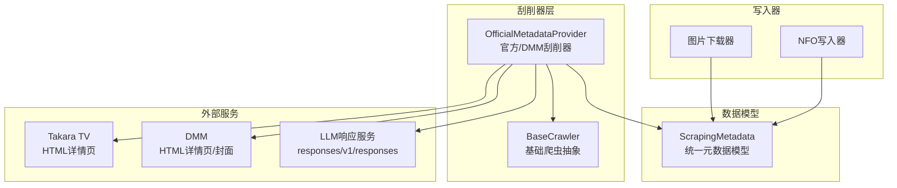
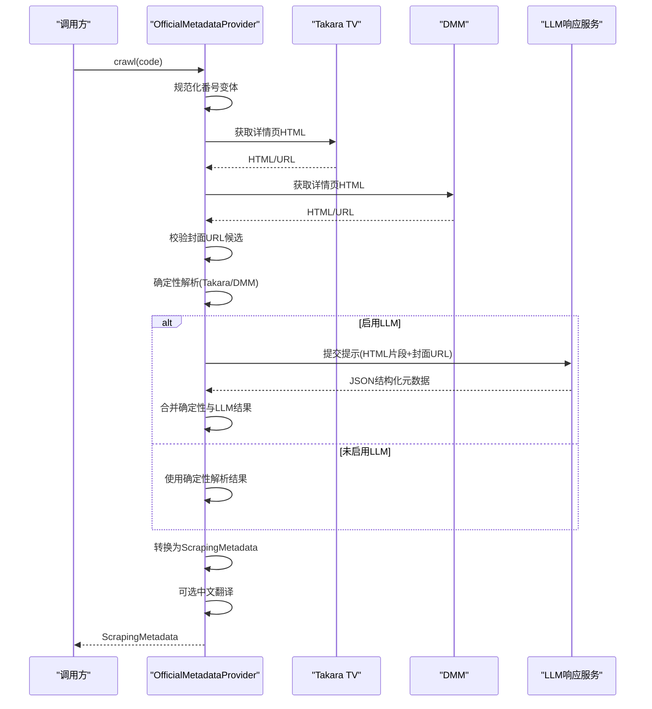
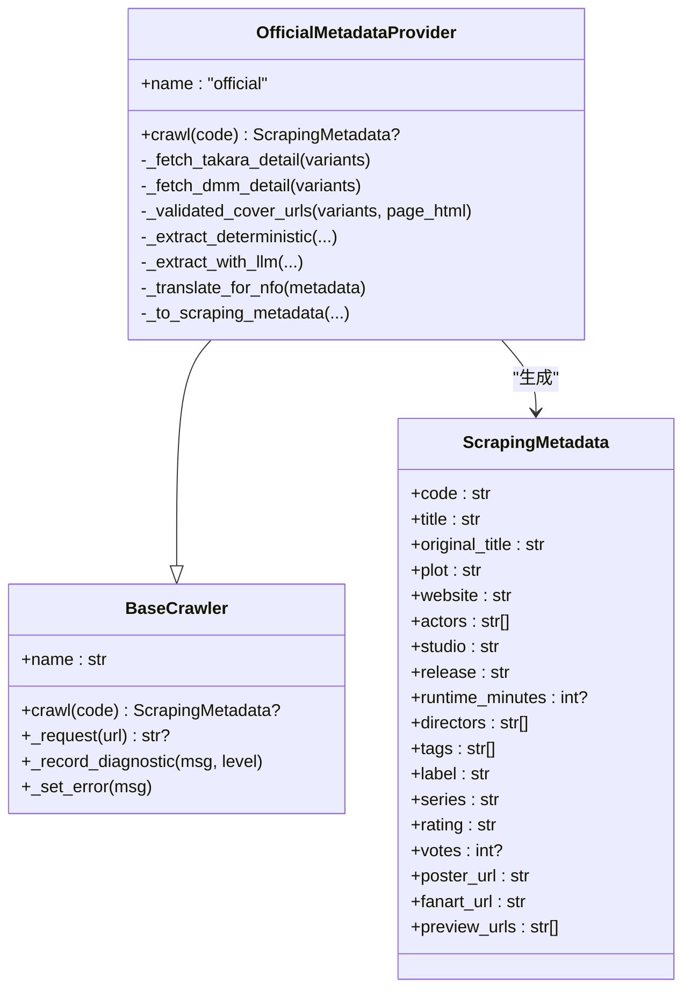
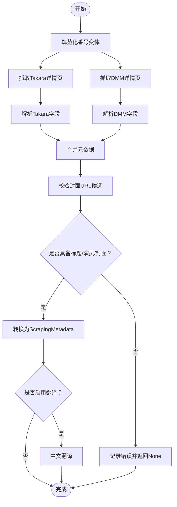
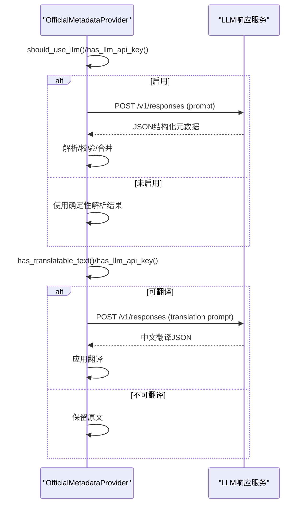
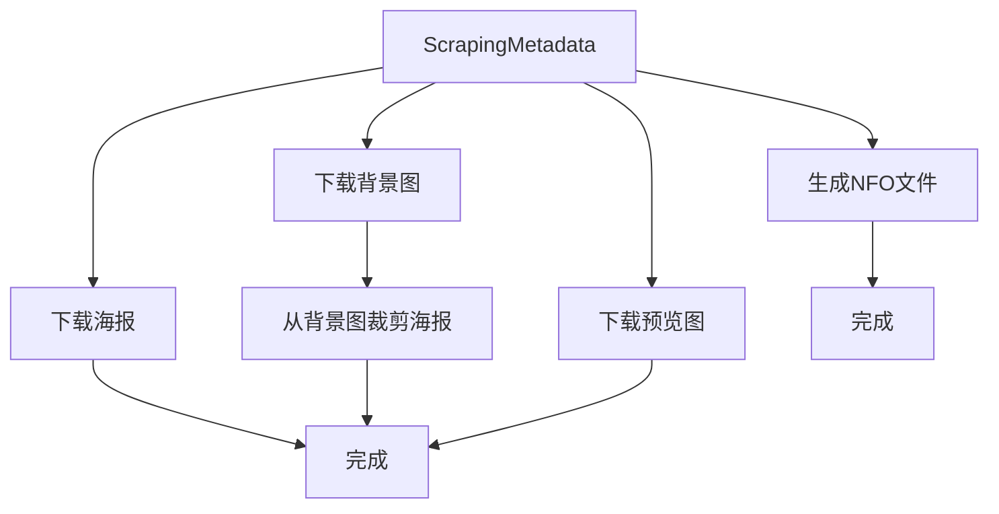
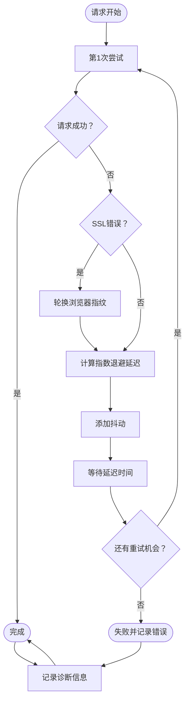
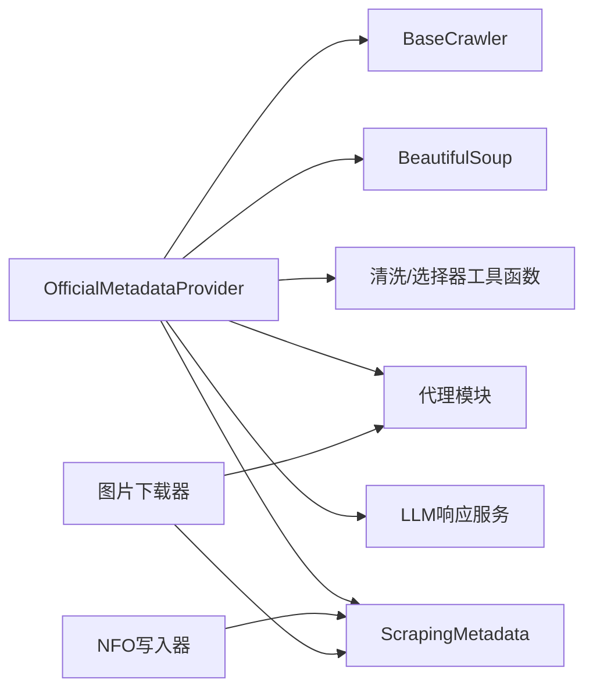

# 官方刮削器

<cite>
**本文引用的文件**
- [app/scrapers/official.py](file://app/scrapers/official.py)
- [app/scrapers/base.py](file://app/scrapers/base.py)
- [app/scrapers/metadata.py](file://app/scrapers/metadata.py)
- [app/scrapers/writers/nfo.py](file://app/scrapers/writers/nfo.py)
- [app/scrapers/writers/image.py](file://app/scrapers/writers/image.py)
- [app/scrapers/proxy.py](file://app/scrapers/proxy.py)
- [tests/test_scrapers/test_official.py](file://tests/test_scrapers/test_official.py)
</cite>

## 目录
1. [引言](#引言)
2. [项目结构](#项目结构)
3. [核心组件](#核心组件)
4. [架构总览](#架构总览)
5. [详细组件分析](#详细组件分析)
6. [依赖关系分析](#依赖关系分析)
7. [性能考量](#性能考量)
8. [故障排查指南](#故障排查指南)
9. [结论](#结论)
10. [附录](#附录)

## 引言
本文件面向Noctra的官方刮削器（Official/DMM）技术文档，系统阐述其设计原理、数据提取算法与实现细节，覆盖以下主题：
- 官方刮削器如何处理不同格式的元数据来源（Takara TV与DMM），包括HTML解析、图片校验与封面URL生成策略
- 官方刮削器与基础刮削器类的继承关系与扩展点
- LLM辅助抽取与中文翻译流程及配置开关
- NFO文件生成与图片下载的映射机制
- 配置选项、使用示例与最佳实践
- 常见问题与性能优化建议

## 项目结构
官方刮削器位于app/scrapers目录下，围绕"官方/DMM"这一元数据来源构建，主要文件与职责如下：
- 官方刮削器实现：app/scrapers/official.py
- 基础爬虫抽象：app/scrapers/base.py
- 元数据模型：app/scrapers/metadata.py
- NFO写入器：app/scrapers/writers/nfo.py
- 图片下载器：app/scrapers/writers/image.py
- 代理支持：app/scrapers/proxy.py
- 单元测试：tests/test_scrapers/test_official.py

图表来源
- [app/scrapers/official.py:67-141](file://app/scrapers/official.py#L67-L141)
- [app/scrapers/base.py:15-62](file://app/scrapers/base.py#L15-L62)
- [app/scrapers/metadata.py:6-33](file://app/scrapers/metadata.py#L6-L33)
- [app/scrapers/writers/nfo.py:12-82](file://app/scrapers/writers/nfo.py#L12-L82)
- [app/scrapers/writers/image.py:60-148](file://app/scrapers/writers/image.py#L60-L148)

章节来源
- [app/scrapers/official.py:67-141](file://app/scrapers/official.py#L67-L141)
- [app/scrapers/base.py:15-62](file://app/scrapers/base.py#L15-L62)
- [app/scrapers/metadata.py:6-33](file://app/scrapers/metadata.py#L6-L33)
- [app/scrapers/writers/nfo.py:12-82](file://app/scrapers/writers/nfo.py#L12-L82)
- [app/scrapers/writers/image.py:60-148](file://app/scrapers/writers/image.py#L60-L148)

## 核心组件
- 官方刮削器类 OfficialMetadataProvider：负责从Takara TV与DMM抓取页面，解析HTML，校验封面URL，合并确定性抽取结果与LLM增强结果，并将最终元数据转换为ScrapingMetadata，再进行中文翻译（可选）。
- 基础爬虫类 BaseCrawler：提供统一的诊断记录、错误处理、HTTP请求封装（含浏览器指纹模拟与Cloudflare挑战检测）、代理支持等能力。
- 元数据模型 ScrapingMetadata：统一的元数据载体，用于NFO写入与图片命名。
- 写入器：
  - NFO写入器：生成Emby/Kodi兼容的XML元数据文件
  - 图片下载器：异步下载海报、背景与预览图，并支持从背景图裁剪海报
- 代理模块：根据URL协议与环境变量自动选择代理

章节来源
- [app/scrapers/official.py:67-141](file://app/scrapers/official.py#L67-L141)
- [app/scrapers/base.py:15-62](file://app/scrapers/base.py#L15-L62)
- [app/scrapers/metadata.py:6-33](file://app/scrapers/metadata.py#L6-L33)
- [app/scrapers/writers/nfo.py:12-82](file://app/scrapers/writers/nfo.py#L12-L82)
- [app/scrapers/writers/image.py:60-148](file://app/scrapers/writers/image.py#L60-L148)
- [app/scrapers/proxy.py:27-64](file://app/scrapers/proxy.py#L27-L64)

## 架构总览
官方刮削器采用"确定性解析 + LLM增强"的双通道策略：
- 确定性解析：从Takara TV与DMM HTML中抽取字段，严格限定来源与字段映射，保证可追溯性与稳定性
- LLM增强：在启用条件下，将HTML片段与已验证封面URL作为提示，抽取JSON结构化元数据，并保留证据链
- 翻译：对可翻译字段进行中文翻译，仅在存在有效API Key且有可翻译文本时执行
- 输出：统一转为ScrapingMetadata，供NFO写入器与图片下载器使用

图表来源
- [app/scrapers/official.py:90-141](file://app/scrapers/official.py#L90-L141)
- [app/scrapers/official.py:500-561](file://app/scrapers/official.py#L500-L561)
- [app/scrapers/official.py:563-607](file://app/scrapers/official.py#L563-L607)

## 详细组件分析

### 组件A：官方刮削器类 OfficialMetadataProvider
- 继承关系：继承自BaseCrawler，复用其诊断、错误记录与HTTP请求能力
- 关键职责：
  - 规范化番号变体（含连字符、纯数字、mono_cid、digital_cid）
  - 并发抓取Takara TV与DMM详情页，识别真实产品页
  - 解析HTML，抽取标题、演员、发行日期、时长、导演、制作商、标签、评分、投票数、封面URL、产品页URL等
  - 校验封面URL，优先使用官方与DMM官方封面图
  - 合并确定性解析与LLM增强结果，保留证据链与冲突信息
  - 将结果转换为ScrapingMetadata，并进行中文翻译（可选）

图表来源
- [app/scrapers/official.py:67-141](file://app/scrapers/official.py#L67-L141)
- [app/scrapers/base.py:15-62](file://app/scrapers/base.py#L15-L62)
- [app/scrapers/metadata.py:6-33](file://app/scrapers/metadata.py#L6-L33)

章节来源
- [app/scrapers/official.py:67-141](file://app/scrapers/official.py#L67-L141)
- [app/scrapers/official.py:284-309](file://app/scrapers/official.py#L284-L309)
- [app/scrapers/official.py:311-449](file://app/scrapers/official.py#L311-L449)
- [app/scrapers/official.py:500-561](file://app/scrapers/official.py#L500-L561)
- [app/scrapers/official.py:563-607](file://app/scrapers/official.py#L563-L607)
- [app/scrapers/official.py:657-685](file://app/scrapers/official.py#L657-L685)

### 组件B：确定性解析与HTML字段映射
- Takara TV解析：基于table.product_i中的<th>/<td>对抽取标题、品番、发售日、收录时间；若品番与输入不一致则记录冲突
- DMM解析：优先使用h1#title或og:title；封面优先取og:image与package-image；详情表按日文标签抽取演员、导演、系列、制作商、厂牌、标签、品番；评分与投票数来自专用区域
- 字段清洗与归一化：日期标准化、分钟数抽取、标签去重与规范化、文本清理等

图表来源
- [app/scrapers/official.py:90-141](file://app/scrapers/official.py#L90-L141)
- [app/scrapers/official.py:284-309](file://app/scrapers/official.py#L284-L309)
- [app/scrapers/official.py:311-449](file://app/scrapers/official.py#L311-L449)
- [app/scrapers/official.py:657-685](file://app/scrapers/official.py#L657-L685)

章节来源
- [app/scrapers/official.py:311-449](file://app/scrapers/official.py#L311-L449)
- [app/scrapers/official.py:688-705](file://app/scrapers/official.py#L688-L705)
- [app/scrapers/official.py:1064-1072](file://app/scrapers/official.py#L1064-L1072)
- [app/scrapers/official.py:1075-1085](file://app/scrapers/official.py#L1075-L1085)

### 组件C：LLM辅助抽取与中文翻译
- LLM抽取：当启用条件满足时，构造包含HTML片段与已验证封面URL的提示，调用LLM响应端点，解析JSON并合并至结果，保留证据与冲突
- 中文翻译：仅在存在可翻译字段且API Key有效时执行，翻译后应用回ScrapingMetadata

图表来源
- [app/scrapers/official.py:500-561](file://app/scrapers/official.py#L500-L561)
- [app/scrapers/official.py:563-607](file://app/scrapers/official.py#L563-L607)
- [app/scrapers/official.py:892-902](file://app/scrapers/official.py#L892-L902)
- [app/scrapers/official.py:905-913](file://app/scrapers/official.py#L905-L913)
- [app/scrapers/official.py:916-922](file://app/scrapers/official.py#L916-L922)
- [app/scrapers/official.py:925-952](file://app/scrapers/official.py#L925-L952)

章节来源
- [app/scrapers/official.py:500-561](file://app/scrapers/official.py#L500-L561)
- [app/scrapers/official.py:563-607](file://app/scrapers/official.py#L563-L607)
- [app/scrapers/official.py:892-902](file://app/scrapers/official.py#L892-L902)
- [app/scrapers/official.py:905-913](file://app/scrapers/official.py#L905-L913)
- [app/scrapers/official.py:916-922](file://app/scrapers/official.py#L916-L922)
- [app/scrapers/official.py:925-952](file://app/scrapers/official.py#L925-L952)

### 组件D：NFO文件与图片下载映射
- NFO写入：根据ScrapingMetadata生成movie元素，填充标题、原名、演员、年份、上映日期、时长、评分、投票、标签、剧集、工作室、厂牌、系列、导演、唯一ID、网站、海报、封面、背景与预览等
- 图片下载：根据poster_url/fanart_url/preview_urls下载并命名；支持从背景图裁剪海报

图表来源
- [app/scrapers/writers/nfo.py:12-82](file://app/scrapers/writers/nfo.py#L12-L82)
- [app/scrapers/writers/image.py:60-148](file://app/scrapers/writers/image.py#L60-L148)
- [app/scrapers/metadata.py:34-59](file://app/scrapers/metadata.py#L34-L59)

章节来源
- [app/scrapers/writers/nfo.py:12-82](file://app/scrapers/writers/nfo.py#L12-L82)
- [app/scrapers/writers/image.py:60-148](file://app/scrapers/writers/image.py#L60-L148)
- [app/scrapers/metadata.py:34-59](file://app/scrapers/metadata.py#L34-L59)

### 组件E：增强的重试机制与错误处理
**更新** 官方刮削器现在具备了显著增强的重试机制和错误处理能力：

- **指数退避与抖动延迟**：每次重试时延迟时间按2的幂次增长，最大不超过配置的上限，同时加入随机抖动避免同步重试风暴
- **浏览器指纹轮换**：在SSL错误发生时自动轮换浏览器指纹（Chrome → Safari → Chrome），提高成功率
- **DMM Cookie 预热**：在获取DMM详情页前先访问年龄验证页面建立会话，减少后续请求失败率
- **增强的诊断日志**：详细的重试过程记录，包括SSL错误检测、指纹轮换通知、延迟时间统计等

图表来源
- [app/scrapers/official.py:234-262](file://app/scrapers/official.py#L234-L262)
- [app/scrapers/official.py:164-190](file://app/scrapers/official.py#L164-L190)

章节来源
- [app/scrapers/official.py:234-262](file://app/scrapers/official.py#L234-L262)
- [app/scrapers/official.py:164-190](file://app/scrapers/official.py#L164-L190)
- [app/scrapers/official.py:296-346](file://app/scrapers/official.py#L296-L346)

## 依赖关系分析
- 官方刮削器依赖基础爬虫类提供的HTTP请求、诊断与错误处理能力
- HTML解析依赖BeautifulSoup与一系列清洗/选择器工具函数
- 图片校验与下载依赖curl_cffi与aiohttp，支持代理与超时控制
- LLM交互依赖环境变量配置的响应端点与API Key
- NFO写入依赖ScrapingMetadata字段映射

图表来源
- [app/scrapers/official.py:14-16](file://app/scrapers/official.py#L14-L16)
- [app/scrapers/base.py:9-12](file://app/scrapers/base.py#L9-L12)
- [app/scrapers/proxy.py:27-64](file://app/scrapers/proxy.py#L27-L64)
- [app/scrapers/metadata.py:6-33](file://app/scrapers/metadata.py#L6-L33)
- [app/scrapers/writers/nfo.py:12-82](file://app/scrapers/writers/nfo.py#L12-L82)
- [app/scrapers/writers/image.py:60-148](file://app/scrapers/writers/image.py#L60-L148)

章节来源
- [app/scrapers/official.py:14-16](file://app/scrapers/official.py#L14-L16)
- [app/scrapers/base.py:9-12](file://app/scrapers/base.py#L9-L12)
- [app/scrapers/proxy.py:27-64](file://app/scrapers/proxy.py#L27-L64)
- [app/scrapers/metadata.py:6-33](file://app/scrapers/metadata.py#L6-L33)
- [app/scrapers/writers/nfo.py:12-82](file://app/scrapers/writers/nfo.py#L12-L82)
- [app/scrapers/writers/image.py:60-148](file://app/scrapers/writers/image.py#L60-L148)

## 性能考量
- 并发与重试：官方刮削器内部使用线程池与异步I/O结合的方式进行请求与图片校验，具备改进的重试机制（指数退避+抖动延迟），降低偶发网络波动影响
- 代理与指纹：通过浏览器指纹模拟与代理选择提升成功率，减少被反爬策略拦截
- LLM成本控制：通过提示长度裁剪与输出令牌上限控制，避免不必要的开销
- 下载优化：异步分块下载、连接复用与SSL禁用以提升速度，同时注意合规与安全
- **DMM Cookie 预热**：在详情页请求前预热会话，显著减少年龄验证失败率

章节来源
- [app/scrapers/official.py:167-211](file://app/scrapers/official.py#L167-L211)
- [app/scrapers/official.py:241-282](file://app/scrapers/official.py#L241-L282)
- [app/scrapers/official.py:528-531](file://app/scrapers/official.py#L528-L531)
- [app/scrapers/writers/image.py:44-57](file://app/scrapers/writers/image.py#L44-L57)
- [app/scrapers/official.py:164-190](file://app/scrapers/official.py#L164-L190)

## 故障排查指南
- HTTP 403/Cloudflare挑战：基础爬虫会检测并提示，必要时切换浏览器指纹重试
- **指数退避重试失败**：检查重试参数配置（REQUEST_RETRY_ATTEMPTS、REQUEST_RETRY_BASE_DELAY_SECONDS、REQUEST_RETRY_MAX_DELAY_SECONDS），观察日志中的延迟时间统计
- **SSL错误恢复**：系统会自动轮换浏览器指纹，如果持续失败，检查网络环境和代理设置
- LLM不可用：检查NOCTRA_LLM_ENABLED、NOCTRA_LLM_API_KEY、OPENAI_API_KEY、NOCTRA_LLM_BASE_URL等环境变量
- 封面校验失败：确保URL属于允许域名，排除占位图（如"now_printing"），必要时手动替换为官方封面
- 番号不匹配：Takara/DMM解析若发现品番与输入不符，会记录冲突，需核对输入或源站数据
- NFO字段缺失：确认ScrapingMetadata中关键字段（标题、原名、演员、发行日期、时长、评分、投票、海报/背景URL）是否完整
- **DMM Cookie 预热失败**：预热失败不影响主要功能，但可能导致后续请求成功率下降

章节来源
- [app/scrapers/base.py:88-123](file://app/scrapers/base.py#L88-L123)
- [app/scrapers/official.py:508-515](file://app/scrapers/official.py#L508-L515)
- [app/scrapers/official.py:241-282](file://app/scrapers/official.py#L241-L282)
- [app/scrapers/official.py:327-337](file://app/scrapers/official.py#L327-L337)
- [app/scrapers/writers/nfo.py:12-82](file://app/scrapers/writers/nfo.py#L12-L82)
- [app/scrapers/official.py:164-190](file://app/scrapers/official.py#L164-L190)

## 结论
官方刮削器通过"确定性解析 + LLM增强 + 中文翻译"的组合策略，在保证元数据可追溯性的同时提升了抽取精度与可用性。其与基础爬虫类的继承关系清晰，职责边界明确，便于扩展与维护。配合NFO写入器与图片下载器，可形成完整的元数据与媒体资源处理闭环。

**更新** 最新的增强功能显著提升了系统的可靠性：
- 指数退避与抖动延迟机制大幅改善了网络波动下的稳定性
- 浏览器指纹轮换功能有效应对SSL错误和反爬策略
- DMM Cookie 预热机制减少了年龄验证相关的请求失败
- 增强的诊断日志为问题排查提供了更详细的信息

## 附录

### 配置选项与环境变量
- LLM启用与密钥
  - NOCTRA_LLM_ENABLED：启用/禁用LLM增强
  - NOCTRA_LLM_API_KEY / OPENAI_API_KEY：LLM访问密钥
  - NOCTRA_LLM_MODEL：模型名称，默认值参见实现
  - NOCTRA_LLM_MAX_OUTPUT_TOKENS：最大输出令牌数
  - NOCTRA_LLM_TIMEOUT_SECONDS：LLM请求超时秒数
  - NOCTRA_LLM_BASE_URL / OPENAI_BASE_URL：LLM服务基础URL
  - NOCTRA_LLM_WIRE_API：响应端点路径（默认responses或/v1/responses）
- 代理
  - HTTPS_PROXY / https_proxy / ALL_PROXY / all_proxy / HTTP_PROXY / http_proxy：按URL协议选择代理
- **重试机制配置**（新增）
  - REQUEST_TIMEOUT_SECONDS：请求超时秒数，默认25秒
  - REQUEST_RETRY_ATTEMPTS：最大重试次数，默认5次
  - REQUEST_RETRY_BASE_DELAY_SECONDS：基础延迟秒数，默认2.0秒
  - REQUEST_RETRY_MAX_DELAY_SECONDS：最大延迟秒数，默认15.0秒
- 其他
  - LLM_TIMEOUT_SECONDS：LLM请求超时秒数

章节来源
- [app/scrapers/official.py:89-93](file://app/scrapers/official.py#L89-L93)
- [app/scrapers/official.py:508-515](file://app/scrapers/official.py#L508-L515)
- [app/scrapers/official.py:528-531](file://app/scrapers/official.py#L528-L531)
- [app/scrapers/official.py:892-902](file://app/scrapers/official.py#L892-L902)
- [app/scrapers/proxy.py:27-64](file://app/scrapers/proxy.py#L27-L64)

### 使用示例与最佳实践
- 使用示例（概念性步骤）
  - 准备环境变量（代理、LLM密钥、模型、超时等）
  - 调用官方刮削器的crawl方法传入番号
  - 若启用LLM，等待结构化元数据与证据链
  - 将返回的ScrapingMetadata交给NFO写入器与图片下载器
- 最佳实践
  - 在输入番号前先进行规范化，减少解析歧义
  - 优先使用官方封面URL，避免盗版或占位图
  - 启用LLM时，确保提示长度与输出令牌上限合理
  - 对Cloudflare挑战场景，系统会自动轮换指纹重试，无需手动干预
  - 使用代理时，确保代理可用且不绕过本地直连规则
  - **监控重试日志**：关注指数退避延迟和指纹轮换信息，及时调整网络配置

章节来源
- [app/scrapers/official.py:90-141](file://app/scrapers/official.py#L90-L141)
- [app/scrapers/official.py:500-561](file://app/scrapers/official.py#L500-L561)
- [app/scrapers/official.py:563-607](file://app/scrapers/official.py#L563-L607)
- [app/scrapers/base.py:88-123](file://app/scrapers/base.py#L88-L123)
- [app/scrapers/proxy.py:27-64](file://app/scrapers/proxy.py#L27-L64)

### 单元测试要点（参考）
- 番号变体规范化与DMM候选URL生成
- 确定性解析字段抽取与评分/投票保留策略
- 封面URL校验与FSDSS前缀的优先顺序
- LLM翻译拒绝与标签数量一致性校验
- 合并元数据时保留确定性评分与投票
- **指数退避重试机制测试**：SSL错误后的指纹轮换和延迟重试
- **DMM Cookie 预热测试**：会话建立与后续请求成功率

章节来源
- [tests/test_scrapers/test_official.py:64-94](file://tests/test_scrapers/test_official.py#L64-L94)
- [tests/test_scrapers/test_official.py:96-124](file://tests/test_scrapers/test_official.py#L96-L124)
- [tests/test_scrapers/test_official.py:167-184](file://tests/test_scrapers/test_official.py#L167-L184)
- [tests/test_scrapers/test_official.py:187-203](file://tests/test_scrapers/test_official.py#L187-L203)
- [tests/test_scrapers/test_official.py:233-262](file://tests/test_scrapers/test_official.py#L233-L262)
- [tests/test_scrapers/test_official.py:264-289](file://tests/test_scrapers/test_official.py#L264-L289)
- [tests/test_scrapers/test_official.py:291-299](file://tests/test_scrapers/test_official.py#L291-L299)