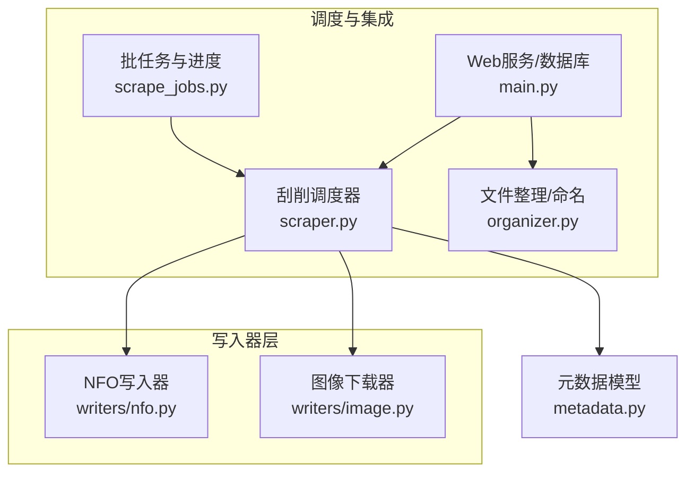
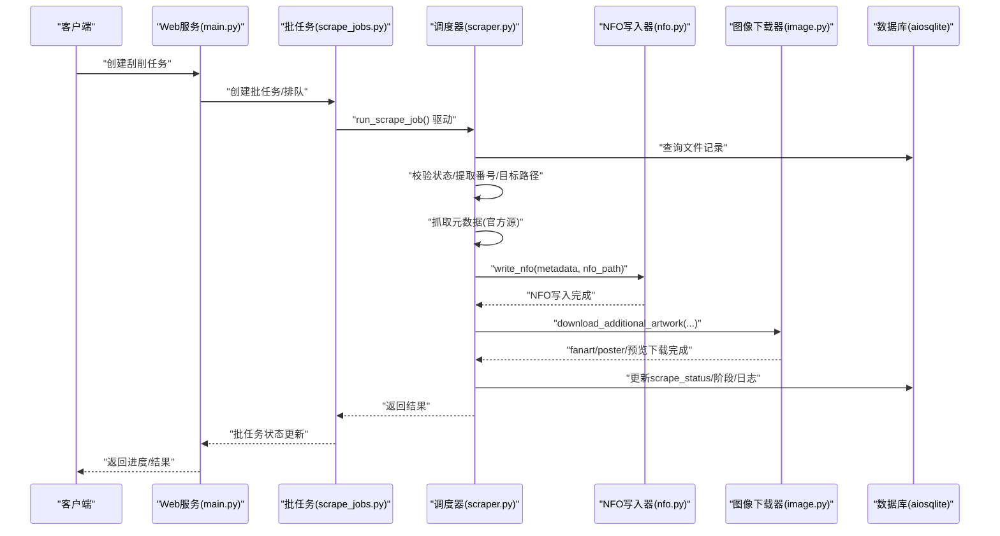
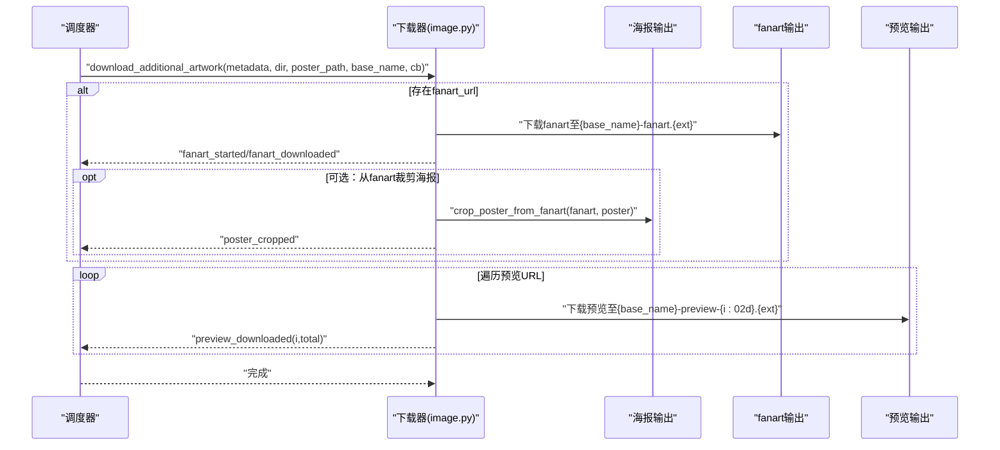
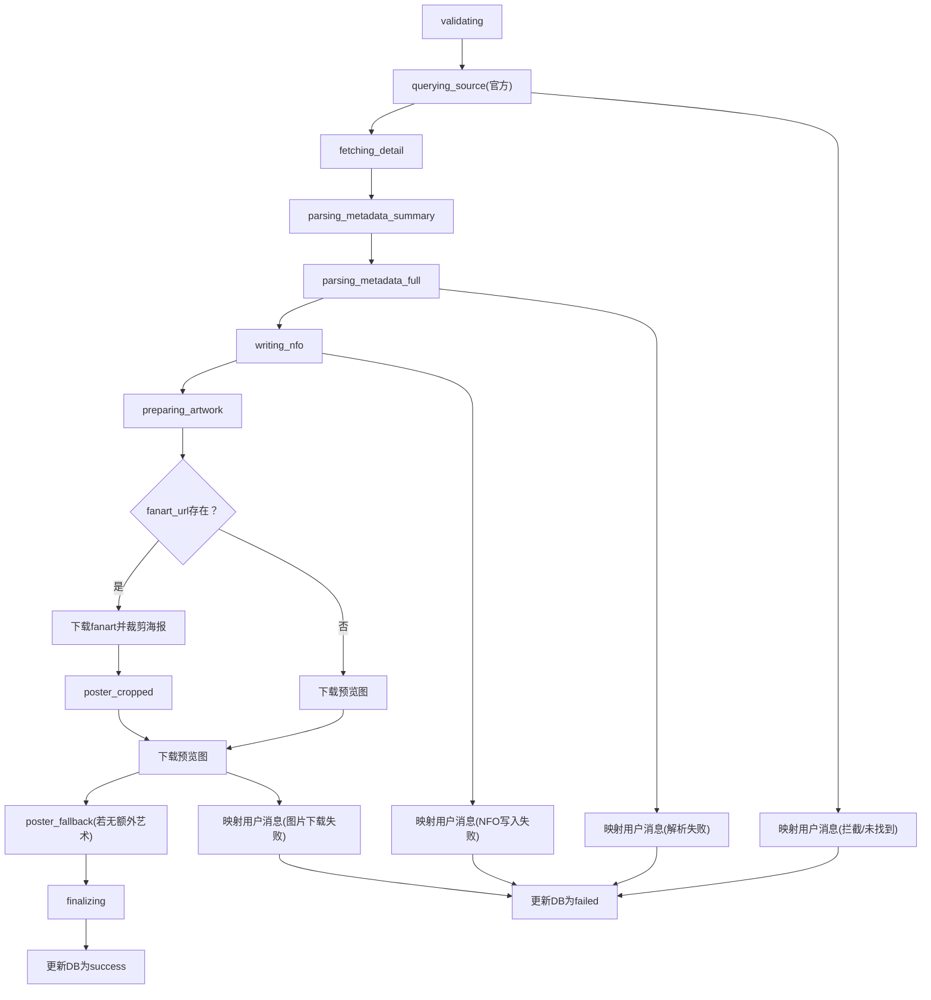
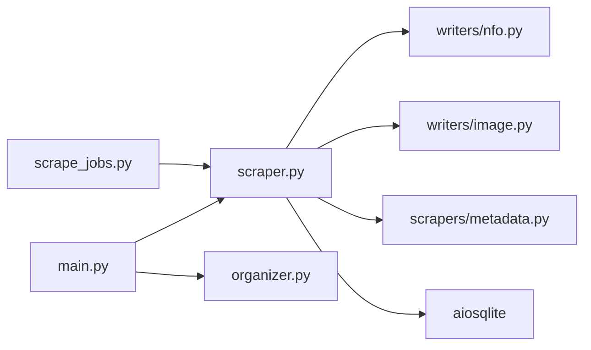

# 数据写入器

<cite>
**本文引用的文件**
- [app/scrapers/writers/nfo.py](file://app/scrapers/writers/nfo.py)
- [app/scrapers/writers/image.py](file://app/scrapers/writers/image.py)
- [app/scrapers/metadata.py](file://app/scrapers/metadata.py)
- [app/scraper.py](file://app/scraper.py)
- [app/scrape_jobs.py](file://app/scrape_jobs.py)
- [app/main.py](file://app/main.py)
- [app/organizer.py](file://app/organizer.py)
- [tests/test_scrapers/test_nfo_writer.py](file://tests/test_scrapers/test_nfo_writer.py)
- [tests/test_scrapers/test_image_downloader.py](file://tests/test_scrapers/test_image_downloader.py)
</cite>

## 目录
1. [简介](#简介)
2. [项目结构](#项目结构)
3. [核心组件](#核心组件)
4. [架构总览](#架构总览)
5. [详细组件分析](#详细组件分析)
6. [依赖关系分析](#依赖关系分析)
7. [性能考量](#性能考量)
8. [故障排查指南](#故障排查指南)
9. [结论](#结论)
10. [附录](#附录)

## 简介
本文件面向Noctra的数据写入器系统，聚焦三类能力：
- NFO文件生成：基于Emby/Kodi兼容的XML元数据文件，包含剧情、演员、标签、集系列、海报/封面、剧照等字段，并对剧情内容进行安全的CDATA注入。
- 图像下载：异步下载海报、背景图（fanart）、预览图，支持进度回调、代理转发、错误降级与海报从背景图裁剪。
- 元数据持久化：通过数据库记录每次刮削的状态、来源、阶段、日志与用户提示信息，便于可观测性与重试。

系统以“刮削调度器”为核心编排者，串联数据库查询、元数据抓取、NFO写入与图像下载，并在最终阶段更新数据库状态，形成完整的端到端流程。

## 项目结构
与数据写入器相关的模块分布如下：
- 写入器层
  - NFO写入器：app/scrapers/writers/nfo.py
  - 图像下载器：app/scrapers/writers/image.py
- 元数据模型：app/scrapers/metadata.py
- 刮削调度器：app/scraper.py
- 批任务与进度：app/scrape_jobs.py
- Web服务与数据库：app/main.py
- 文件整理与命名：app/organizer.py
- 单元测试：tests/test_scrapers/test_nfo_writer.py、tests/test_scrapers/test_image_downloader.py

图表来源
- [app/scraper.py:82-453](file://app/scraper.py#L82-L453)
- [app/scrape_jobs.py:1-256](file://app/scrape_jobs.py#L1-L256)
- [app/main.py:1-800](file://app/main.py#L1-L800)
- [app/organizer.py:1-307](file://app/organizer.py#L1-L307)
- [app/scrapers/writers/nfo.py:1-142](file://app/scrapers/writers/nfo.py#L1-L142)
- [app/scrapers/writers/image.py:1-180](file://app/scrapers/writers/image.py#L1-L180)
- [app/scrapers/metadata.py:1-60](file://app/scrapers/metadata.py#L1-L60)

章节来源
- [app/scraper.py:82-453](file://app/scraper.py#L82-L453)
- [app/scrape_jobs.py:1-256](file://app/scrape_jobs.py#L1-L256)
- [app/main.py:1-800](file://app/main.py#L1-L800)
- [app/organizer.py:1-307](file://app/organizer.py#L1-L307)
- [app/scrapers/writers/nfo.py:1-142](file://app/scrapers/writers/nfo.py#L1-L142)
- [app/scrapers/writers/image.py:1-180](file://app/scrapers/writers/image.py#L1-L180)
- [app/scrapers/metadata.py:1-60](file://app/scrapers/metadata.py#L1-L60)

## 核心组件
- NFO写入器
  - 功能：生成Emby/Kodi兼容的movie根元素XML，填充剧情（CDATA）、演员、年份、标题、原始标题、上映日期、片长、评分、投票数、工作室、标签、系列/套组、导演、唯一ID、网站、海报/封面、背景图与预览图等字段。
  - 关键点：自动注入XML声明与缩进；剧情文本采用CDATA包裹并安全转义；根据媒体文件名派生艺术文件名；基于番号后缀自动追加“中字/无码破解”等类型标签。
- 图像下载器
  - 功能：异步下载海报、fanart与预览图；支持代理；进度事件回调；从fanart裁剪海报；错误捕获与降级。
  - 关键点：浏览器UA与语言头；TCPConnector禁SSL校验；分块写入；基于URL路径推断扩展名；海报裁剪比例固定。
- 刮削调度器
  - 功能：编排“查询DB→校验状态→抓取元数据→写NFO→下载图像→更新DB”的全流程；提供阶段进度与日志；失败时映射用户友好提示。
  - 关键点：阶段进度百分比映射；事件回调驱动UI进度；异常映射为用户消息；最终持久化成功/失败状态。
- 元数据模型
  - 功能：承载刮削结果的结构化数据，供写入器与前端消费。
  - 关键点：包含基础信息、制作信息、媒体资源URL与派生字段（如海报/封面/预览列表）。

章节来源
- [app/scrapers/writers/nfo.py:12-142](file://app/scrapers/writers/nfo.py#L12-L142)
- [app/scrapers/writers/image.py:60-180](file://app/scrapers/writers/image.py#L60-L180)
- [app/scraper.py:82-453](file://app/scraper.py#L82-L453)
- [app/scrapers/metadata.py:6-60](file://app/scrapers/metadata.py#L6-L60)

## 架构总览
整体流程自Web服务触发，经由调度器协调，完成数据库状态校验、元数据抓取、NFO写入与图像下载，并在最后更新数据库状态。

图表来源
- [app/main.py:531-614](file://app/main.py#L531-L614)
- [app/scrape_jobs.py:146-256](file://app/scrape_jobs.py#L146-L256)
- [app/scraper.py:89-411](file://app/scraper.py#L89-L411)
- [app/scrapers/writers/nfo.py:12-82](file://app/scrapers/writers/nfo.py#L12-L82)
- [app/scrapers/writers/image.py:74-148](file://app/scrapers/writers/image.py#L74-L148)

章节来源
- [app/main.py:531-614](file://app/main.py#L531-L614)
- [app/scrape_jobs.py:146-256](file://app/scrape_jobs.py#L146-L256)
- [app/scraper.py:89-411](file://app/scraper.py#L89-L411)

## 详细组件分析

### NFO写入器（XML生成与字段映射）
- XML结构与字段映射
  - 根元素：movie
  - 基础字段：outline（剧情，CDATA）、lockdata、dateadded（写入时）、title、originaltitle、year（取release前4位）、sorttitle（番号）、imdbid（番号）、id（番号）
  - 演员：多个actor/name（type=Actor），空演员不生成节点
  - 发行信息：premiered/releasedate（release）、runtime（分钟）、rating、votes
  - 类别与标签：genre/tag（去重、去空白、大小写无关），并依据文件名后缀自动追加“中字/无码破解”等类型标签
  - 制作信息：studio、label、series（若存在则生成set/name）
  - 导演：多个director
  - 唯一标识：uniqueid（text=番号，type=imdb）
  - 网站：website
  - 艺术文件：poster（若存在海报URL）、cover（同poster）
  - 背景与预览：fanart/thumb（fanart_url存在时生成），以及若干thumb（preview_urls）
- 编码与安全
  - XML声明：standalone=yes，UTF-8
  - 剧情CDATA注入：先插入占位，再替换为CDATA段，避免</movie>被误伤；CDATA结束符“]]>”会被转义为“]]]]><
- [app/scrapers/writers/nfo.py:97-142](file://app/scrapers/writers/nfo.py#L97-L142)

章节来源
- [app/scrapers/writers/nfo.py:12-142](file://app/scrapers/writers/nfo.py#L12-L142)
- [tests/test_scrapers/test_nfo_writer.py:1-280](file://tests/test_scrapers/test_nfo_writer.py#L1-L280)

### 图像下载器（URL解析、文件命名与存储策略）
- 下载流程
  - 海报下载：download_poster(url, output_path)，使用浏览器UA与语言头，禁SSL校验，分块写入
  - 附加艺术下载：download_additional_artwork(metadata, output_dir, poster_output_path, base_name, progress_callback)
    - fanart：若存在fanart_url则下载至“{base_name}-fanart.{ext}”，随后可选地从fanart裁剪出海报
    - 预览图：遍历preview_urls，按顺序下载至“{base_name}-preview-{index:02d}.{ext}”
    - 进度事件：fanart_started → fanart_downloaded → poster_cropped → preview_downloaded（带index/total）
  - 错误处理：网络异常与HTTP错误向上抛出；fanart下载失败不影响后续流程
- 文件命名与扩展名
  - 优先从URL路径解析扩展名，限定为jpg/jpeg/png/webp之一，否则回退为.jpg
  - 艺术文件名模板：poster/fanart/preview均以base_name为前缀
- 海报裁剪
  - crop_poster_from_fanart：从fanart右侧裁剪出矩形区域作为海报，转换为RGB并保存为JPEG（质量95）

图表来源
- [app/scrapers/writers/image.py:74-148](file://app/scrapers/writers/image.py#L74-L148)
- [app/scrapers/writers/image.py:151-180](file://app/scrapers/writers/image.py#L151-L180)

章节来源
- [app/scrapers/writers/image.py:60-180](file://app/scrapers/writers/image.py#L60-L180)
- [tests/test_scrapers/test_image_downloader.py:1-323](file://tests/test_scrapers/test_image_downloader.py#L1-L323)

### 刮削调度器（流程编排与错误映射）
- 阶段与进度
  - validating、querying_source、fetching_detail、parsing_metadata_summary、parsing_metadata_full、writing_nfo、preparing_artwork、fanart_started、fanart_downloaded、poster_cropped、poster_fallback、preview_floor..preview_ceiling、finalizing
- 日志与可观测性
  - emit事件：记录阶段、来源、消息、级别、进度百分比；持久化到数据库files.scrape_logs
  - crawler诊断：将爬虫内部诊断信息透传到日志
- 失败映射
  - 不同阶段的失败映射为用户可理解的消息，如Cloudflare拦截、未找到番号、NFO写入失败、图片下载失败等
- 数据库更新
  - 成功：scrape_status=success，记录完成时间与阶段
  - 失败：scrape_status=failed，记录技术错误与用户消息

图表来源
- [app/scraper.py:89-411](file://app/scraper.py#L89-L411)
- [app/scrape_jobs.py:9-20](file://app/scrape_jobs.py#L9-L20)

章节来源
- [app/scraper.py:89-411](file://app/scraper.py#L89-L411)
- [app/scrape_jobs.py:9-20](file://app/scrape_jobs.py#L9-L20)

### 元数据模型（ScrapingMetadata）
- 字段覆盖
  - 基础信息：code、title、plot、original_title、website
  - 制作信息：actors、studio、release、runtime_minutes、directors、tags、label、series、rating、votes
  - 媒体资源：poster_url、fanart_url、preview_urls
  - 辅助方法：to_dict(base_name?)，用于模板/前端渲染，派生海报/封面/预览列表
- 与写入器的关系
  - NFO写入器直接消费ScrapingMetadata字段
  - 图像下载器基于URL列表与base_name派生文件名

章节来源
- [app/scrapers/metadata.py:6-60](file://app/scrapers/metadata.py#L6-L60)

## 依赖关系分析
- 组件耦合
  - 调度器依赖写入器与元数据模型；写入器仅依赖元数据模型与本地文件系统；图像下载器依赖外部HTTP与图像库
  - 批任务模块通过回调推进UI进度，与调度器松耦合
- 外部依赖
  - aiohttp（异步HTTP）、aiofiles（异步文件IO）、Pillow（图像处理）、aiosqlite（数据库）
- 潜在循环
  - 未见循环导入；模块职责清晰

图表来源
- [app/scraper.py:1-453](file://app/scraper.py#L1-L453)
- [app/scrape_jobs.py:1-256](file://app/scrape_jobs.py#L1-L256)
- [app/main.py:1-800](file://app/main.py#L1-L800)
- [app/organizer.py:1-307](file://app/organizer.py#L1-L307)
- [app/scrapers/writers/nfo.py:1-142](file://app/scrapers/writers/nfo.py#L1-L142)
- [app/scrapers/writers/image.py:1-180](file://app/scrapers/writers/image.py#L1-L180)
- [app/scrapers/metadata.py:1-60](file://app/scrapers/metadata.py#L1-L60)

章节来源
- [app/scraper.py:1-453](file://app/scraper.py#L1-L453)
- [app/scrape_jobs.py:1-256](file://app/scrape_jobs.py#L1-L256)
- [app/main.py:1-800](file://app/main.py#L1-L800)
- [app/organizer.py:1-307](file://app/organizer.py#L1-L307)
- [app/scrapers/writers/nfo.py:1-142](file://app/scrapers/writers/nfo.py#L1-L142)
- [app/scrapers/writers/image.py:1-180](file://app/scrapers/writers/image.py#L1-L180)
- [app/scrapers/metadata.py:1-60](file://app/scrapers/metadata.py#L1-L60)

## 性能考量
- 并发与I/O
  - 图像下载使用异步HTTP与分块写入，降低内存占用；建议在批处理场景下合理控制并发度，避免对远端站点造成过大压力
- 资源管理
  - 客户端会话与连接器在函数作用域内创建，避免长生命周期资源泄漏；图像裁剪在内存中完成，注意大图内存峰值
- 磁盘与目录
  - 自动创建父目录，减少失败重试成本；NFO与艺术文件与媒体文件同目录，利于播放器索引
- 数据库
  - 刮削日志与状态写入采用事务性更新，避免部分写入；建议定期清理历史日志以控制字段长度

[本节为通用指导，无需特定文件引用]

## 故障排查指南
- NFO写入失败
  - 检查输出目录权限与磁盘空间；确认XML声明与CDATA注入逻辑未被外部修改
  - 参考测试用例验证字段齐全与CDATA包裹正确
- 图像下载失败
  - 网络异常：检查代理设置与DNS连通性；关注HTTP 403/429等限流
  - fanart裁剪失败：确认fanart为横向横幅图且尺寸足够；检查Pillow转换与保存流程
  - 权限错误：确保目标目录可写
- 刮削失败映射
  - Cloudflare拦截：等待或更换网络/代理；查看爬虫诊断日志
  - 未找到番号：核对番号与来源站点；检查解析逻辑
  - 用户消息映射：根据阶段与技术错误查看映射规则

章节来源
- [tests/test_scrapers/test_nfo_writer.py:1-280](file://tests/test_scrapers/test_nfo_writer.py#L1-L280)
- [tests/test_scrapers/test_image_downloader.py:1-323](file://tests/test_scrapers/test_image_downloader.py#L1-L323)
- [app/scraper.py:59-80](file://app/scraper.py#L59-L80)

## 结论
Noctra的数据写入器系统以“Emby/Kodi兼容的NFO XML + 艺术文件”为核心，结合异步图像下载与可观测的刮削调度，实现了稳定、可扩展的元数据持久化与媒体组织辅助能力。通过严格的字段映射、安全的CDATA注入与稳健的错误处理，系统在复杂网络环境下仍能提供一致的用户体验。

[本节为总结，无需特定文件引用]

## 附录

### NFO字段映射与编码规范
- 字段映射
  - outline → 剧情（CDATA）
  - lockdata → false
  - dateadded → 写入时的时间
  - title → 标题或番号
  - originaltitle → 原始标题或标题或番号
  - year → release前4位
  - sorttitle → 番号
  - imdbid → 番号
  - premiered/releasedate → release
  - runtime → 分钟数
  - rating/votes → 评分/投票数
  - studio/label/series → 制作/标签/系列
  - set/name → 系列名称
  - uniqueid(@type="imdb") → 番号
  - website → 网站
  - poster/cover → 基于媒体文件名派生
  - fanart/thumb → fanart_url存在时生成
  - tag/genre → 标签去重并追加类型标签
- 编码与安全
  - XML声明：standalone="yes"，UTF-8
  - 剧情CDATA：转义“]]>”为“]]]]><
- [tests/test_scrapers/test_nfo_writer.py:123-150](file://tests/test_scrapers/test_nfo_writer.py#L123-L150)

### 图像下载配置与策略
- 下载参数
  - 超时：30秒
  - 分块大小：8192字节
  - 默认请求头：浏览器UA与Accept-Language
  - SSL：禁用严格校验
- 文件命名
  - poster/fanart/preview均以base_name为前缀
  - 扩展名优先从URL解析，限定jpg/jpeg/png/webp
- 海报裁剪
  - 裁剪起点比例固定，输出JPEG质量95，模式转换为RGB

章节来源
- [app/scrapers/writers/image.py:14-25](file://app/scrapers/writers/image.py#L14-L25)
- [app/scrapers/writers/image.py:151-180](file://app/scrapers/writers/image.py#L151-L180)

### 扩展新写入器的开发指南
- 接口与职责
  - 输入：ScrapingMetadata
  - 输出：侧写文件（如.nfo/.json/.yml）与/或艺术文件
  - 依赖：仅依赖元数据模型与本地文件系统
- 开发步骤
  - 定义字段映射与输出格式
  - 实现写入函数（如write_my_format(metadata, output_path)）
  - 在调度器中注册调用位置（如writing_my_format阶段）
  - 提供错误处理与日志记录
  - 编写单元测试覆盖关键分支
- 最佳实践
  - 保持幂等与可重复执行
  - 自动创建目录，避免失败重试
  - 对外部依赖（如HTTP/文件系统）进行最小化封装
  - 与现有进度/日志体系对齐

[本节为概念性指导，无需特定文件引用]