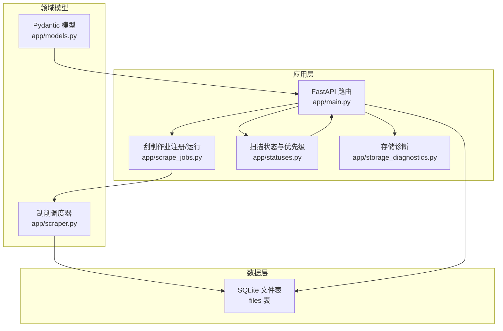
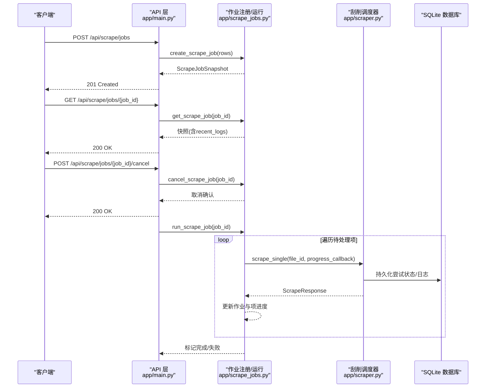
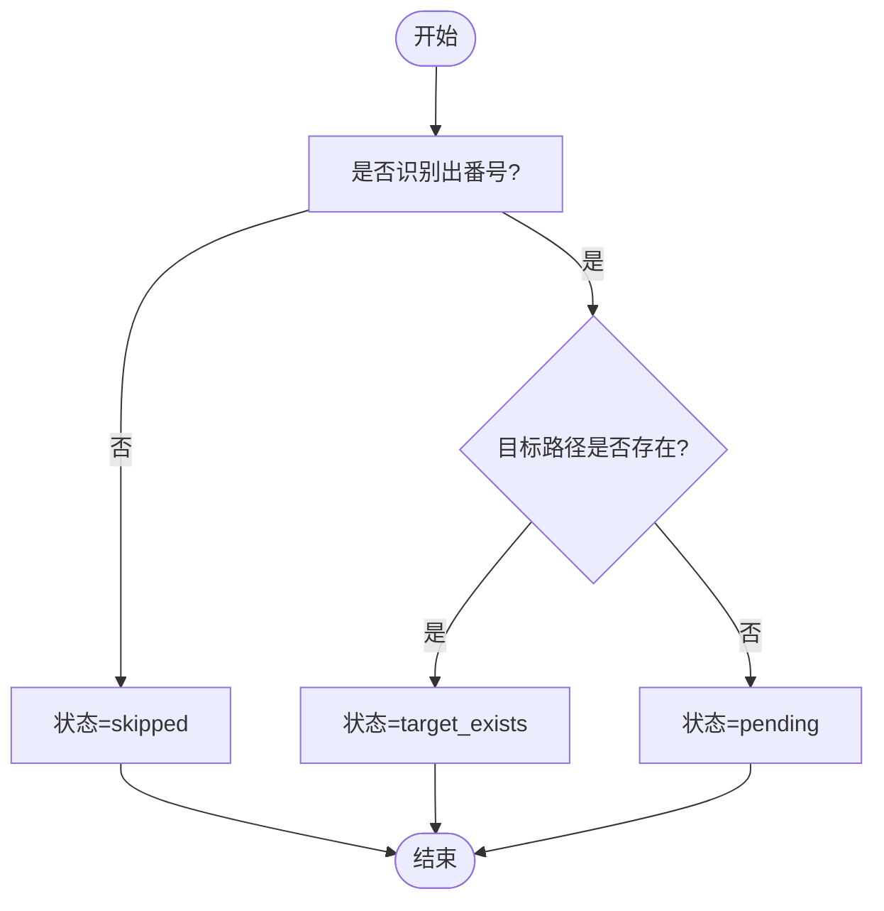
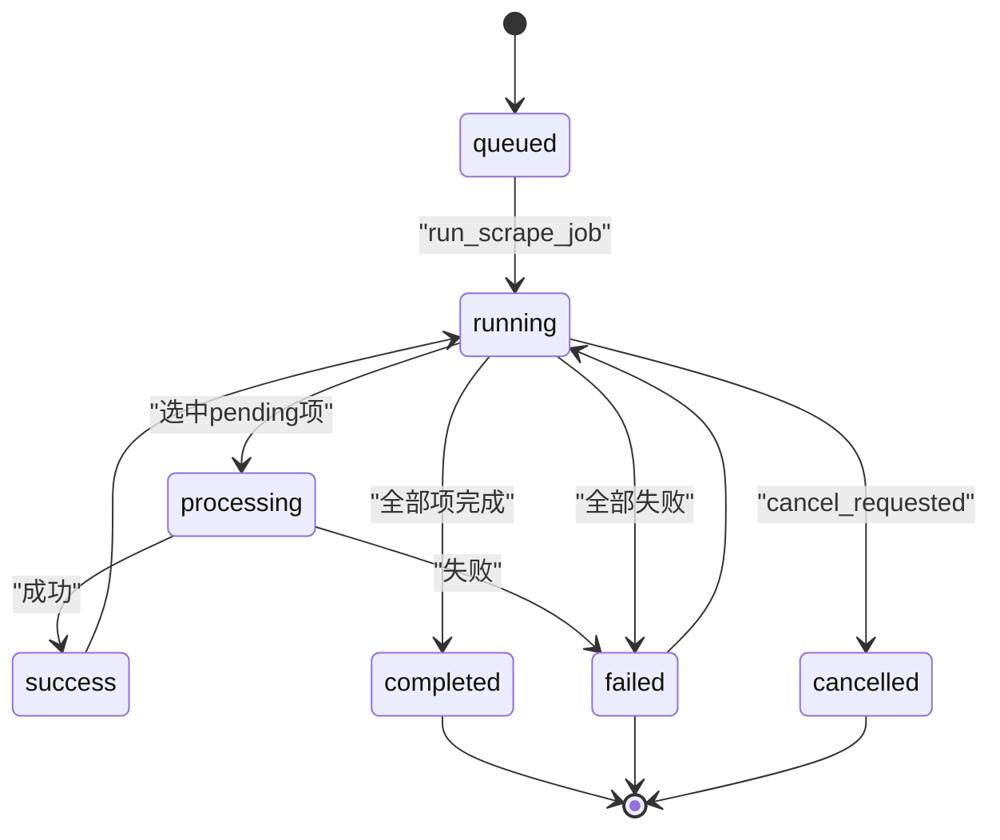
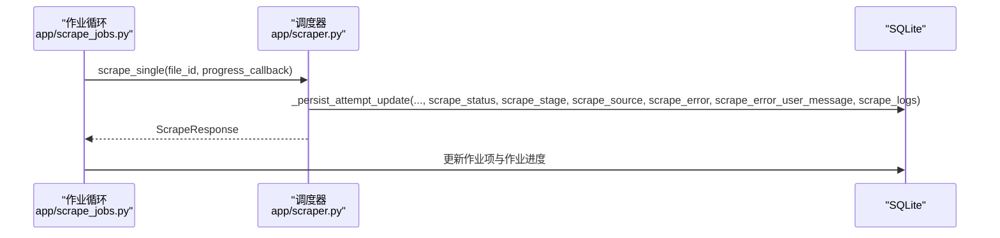
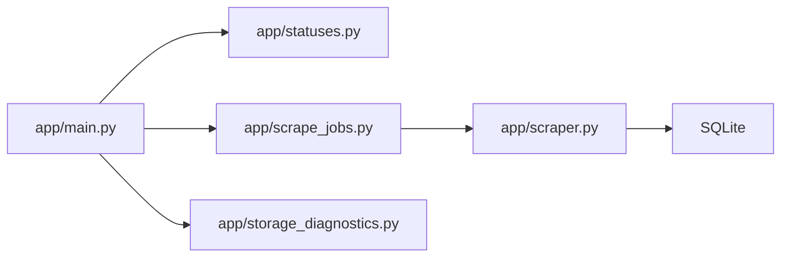

# 状态跟踪系统

<cite>
**本文引用的文件**
- [app/statuses.py](file://app/statuses.py)
- [app/models.py](file://app/models.py)
- [app/scrape_jobs.py](file://app/scrape_jobs.py)
- [app/main.py](file://app/main.py)
- [app/storage_diagnostics.py](file://app/storage_diagnostics.py)
- [app/scraper.py](file://app/scraper.py)
- [docs/superpowers/plans/2026-03-27-scrape-feedback-observability.md](file://docs/superpowers/plans/2026-03-27-scrape-feedback-observability.md)
- [tests/test_api/test_scrape_jobs.py](file://tests/test_api/test_scrape_jobs.py)
- [tests/test_scraper.py](file://tests/test_scraper.py)
- [scripts/status.sh](file://scripts/status.sh)
- [scripts/lib/noctra.sh](file://scripts/lib/noctra.sh)
</cite>

## 目录
1. [简介](#简介)
2. [项目结构](#项目结构)
3. [核心组件](#核心组件)
4. [架构概览](#架构概览)
5. [详细组件分析](#详细组件分析)
6. [依赖关系分析](#依赖关系分析)
7. [性能考量](#性能考量)
8. [故障排查指南](#故障排查指南)
9. [结论](#结论)
10. [附录](#附录)

## 简介
本文件面向Noctra的状态跟踪系统，系统性阐述文件扫描状态、刮削作业状态与刮削尝试状态的定义、转换规则与持久化机制；说明状态枚举值、状态机设计与更新策略；解释诊断信息收集、健康检查与性能监控；覆盖状态查询API、实时状态推送与历史状态追踪；提供异常检测、告警机制与故障诊断方法，并给出状态数据存储格式、查询优化与清理策略。

## 项目结构
Noctra采用分层架构，状态跟踪涉及以下模块：
- 扫描状态与候选优先级：app/statuses.py
- 数据模型与状态字段：app/models.py
- 刮削作业注册与进度：app/scrape_jobs.py
- API入口与持久化：app/main.py
- 存储移动模式诊断：app/storage_diagnostics.py
- 刮削调度与尝试持久化：app/scraper.py
- 文档与测试：docs/...、tests/...

图表来源
- [app/main.py:78-125](file://app/main.py#L78-L125)
- [app/scrape_jobs.py:22-23](file://app/scrape_jobs.py#L22-L23)
- [app/statuses.py:24-32](file://app/statuses.py#L24-L32)
- [app/storage_diagnostics.py:8-63](file://app/storage_diagnostics.py#L8-L63)
- [app/models.py:7-216](file://app/models.py#L7-L216)
- [app/scraper.py:412-452](file://app/scraper.py#L412-L452)

章节来源
- [app/main.py:78-125](file://app/main.py#L78-L125)
- [app/statuses.py:24-154](file://app/statuses.py#L24-L154)
- [app/models.py:7-216](file://app/models.py#L7-L216)
- [app/scrape_jobs.py:22-256](file://app/scrape_jobs.py#L22-L256)
- [app/storage_diagnostics.py:8-63](file://app/storage_diagnostics.py#L8-L63)
- [app/scraper.py:412-452](file://app/scraper.py#L412-L452)

## 核心组件
- 扫描状态解析与重复项判定
  - 基于识别码与目标路径决定单文件基础状态
  - 同番号候选按后缀类别与大小排序，保留最优，其余标记为重复
- 刮削作业状态机
  - 作业生命周期：queued → running → completed 或 failed 或 cancelled
  - 逐项执行：pending → processing → success 或 failed
  - 进度百分比按阶段映射，支持显式百分比覆盖
- 刮削尝试状态与日志
  - 尝试字段：scrape_status、scrape_stage、scrape_source、scrape_error、scrape_error_user_message、scrape_logs
  - 日志截断保留最近若干条
- 数据模型与索引
  - Pydantic 模型定义状态字段与快照结构
  - SQLite 增量补齐刮削字段并建立索引
- 存储诊断
  - 探测rename与copy_delete两种移动模式，缓存结果供健康检查使用

章节来源
- [app/statuses.py:24-104](file://app/statuses.py#L24-L104)
- [app/scrape_jobs.py:8-57](file://app/scrape_jobs.py#L8-L57)
- [app/models.py:106-216](file://app/models.py#L106-L216)
- [app/main.py:101-125](file://app/main.py#L101-L125)
- [app/storage_diagnostics.py:8-63](file://app/storage_diagnostics.py#L8-L63)

## 架构概览
状态跟踪贯穿“扫描—组织—刮削”链路，形成多维状态体系：
- 文件级状态：扫描状态（pending/duplicate/skipped/target_exists）与组织状态（processed/failed/skipped/ignored）
- 刮削尝试状态：pending/success/failed
- 作业级状态：queued/running/completed/failed/cancelled
- 实时进度：作业快照与近期日志
- 历史追踪：按番号与时间维度的尝试详情

图表来源
- [app/main.py:1270-1295](file://app/main.py#L1270-L1295)
- [app/scrape_jobs.py:73-117](file://app/scrape_jobs.py#L73-L117)
- [app/scrape_jobs.py:146-256](file://app/scrape_jobs.py#L146-L256)
- [app/scraper.py:423-452](file://app/scraper.py#L423-L452)

## 详细组件分析

### 扫描状态与重复项判定
- 单文件基础状态
  - 未识别码：skipped
  - 目标路径存在：target_exists
  - 其他：pending
- 同番号候选分组与优先级
  - 分类：UC/C/SUB/PLAIN（基于编码、前缀、关键词）
  - 排序：优先级、大小、自然排序文件名、原始路径
  - 保留最优为pending，其余为duplicate

图表来源
- [app/statuses.py:24-32](file://app/statuses.py#L24-L32)

章节来源
- [app/statuses.py:24-104](file://app/statuses.py#L24-L104)

### 刮削作业状态机与进度
- 作业状态
  - queued → running → completed/failed/cancelled
  - cancel_requested触发取消流程
- 作业项状态
  - pending → processing → success/failed
- 进度计算
  - 阶段映射百分比与显式百分比取最大
  - 最近日志限制数量

图表来源
- [app/scrape_jobs.py:8-57](file://app/scrape_jobs.py#L8-L57)
- [app/scrape_jobs.py:146-256](file://app/scrape_jobs.py#L146-L256)

章节来源
- [app/scrape_jobs.py:22-256](file://app/scrape_jobs.py#L22-L256)

### 刮削尝试状态与日志持久化
- 尝试字段
  - scrape_status、scrape_stage、scrape_source、scrape_error、scrape_error_user_message、scrape_logs
- 持久化策略
  - 仅允许的字段写入，避免无关列变更
  - 日志以JSON字符串存储，按需解析
- 失败映射
  - 失败阶段、来源、用户消息与技术错误映射

图表来源
- [app/scraper.py:423-452](file://app/scraper.py#L423-L452)
- [docs/superpowers/plans/2026-03-27-scrape-feedback-observability.md:486-510](file://docs/superpowers/plans/2026-03-27-scrape-feedback-observability.md#L486-L510)

章节来源
- [app/scraper.py:412-452](file://app/scraper.py#L412-L452)
- [docs/superpowers/plans/2026-03-27-scrape-feedback-observability.md:486-510](file://docs/superpowers/plans/2026-03-27-scrape-feedback-observability.md#L486-L510)

### 数据模型与索引
- 文件记录与刮削字段
  - status：pending/duplicate/processed/skipped/target_exists/failed/ignored
  - scrape_status：pending/success/failed
  - 其他：时间戳、错误信息、日志等
- 作业模型
  - ScrapeJobSnapshot、ScrapeJobItem、ScrapeLogEntry等
- 数据库升级
  - 启动时补齐缺失的刮削列并设置默认值
  - 创建索引提升查询性能

章节来源
- [app/models.py:7-216](file://app/models.py#L7-L216)
- [app/main.py:101-125](file://app/main.py#L101-L125)

### 存储诊断与健康检查
- 移动模式探测
  - 通过临时文件探测rename或copy_delete
  - 结果缓存并在健康检查返回
- 健康检查
  - CLI脚本调用健康端点进行可用性检查

章节来源
- [app/storage_diagnostics.py:8-63](file://app/storage_diagnostics.py#L8-L63)
- [scripts/status.sh:24-28](file://scripts/status.sh#L24-L28)
- [scripts/lib/noctra.sh:120-129](file://scripts/lib/noctra.sh#L120-L129)

## 依赖关系分析
- 组件耦合
  - app/main.py 依赖 app/statuses.py、app/scrape_jobs.py、app/storage_diagnostics.py
  - app/scrape_jobs.py 依赖 app/scraper.py 的调度接口
  - app/scraper.py 依赖 SQLite 持久化尝试状态
- 外部依赖
  - aiosqlite 提供异步数据库访问
  - FastAPI 提供路由与响应模型

图表来源
- [app/main.py:42-56](file://app/main.py#L42-L56)
- [app/scrape_jobs.py:147-150](file://app/scrape_jobs.py#L147-L150)
- [app/scraper.py:412-452](file://app/scraper.py#L412-L452)

章节来源
- [app/main.py:42-56](file://app/main.py#L42-L56)
- [app/scrape_jobs.py:147-150](file://app/scrape_jobs.py#L147-L150)
- [app/scraper.py:412-452](file://app/scraper.py#L412-L452)

## 性能考量
- 查询优化
  - 为scrape_status建立索引，加速按状态筛选
  - 使用参数化查询与批量更新减少开销
- 内存与并发
  - 作业与批次使用锁保护共享状态
  - 异步I/O与线程池分离CPU密集型操作
- 日志与存储
  - 限制recent_logs数量，避免日志膨胀
  - JSON日志按需解析，避免不必要的序列化

章节来源
- [app/main.py:124](file://app/main.py#L124)
- [app/scrape_jobs.py:8-57](file://app/scrape_jobs.py#L8-L57)

## 故障排查指南
- 常见问题定位
  - 刮削失败：检查scrape_error与scrape_error_user_message，查看scrape_logs
  - 作业卡住：确认cancel_requested状态与current_file_id/当前阶段
  - 存储问题：查看存储诊断mode与rename_capable
- 告警建议
  - 作业长时间无进展或失败率过高触发告警
  - 刮削阶段长时间停留在某阶段提示异常
- 诊断工具
  - 健康检查端点与CLI脚本
  - 测试用例验证作业快照与失败详情

章节来源
- [tests/test_api/test_scrape_jobs.py:126-166](file://tests/test_api/test_scrape_jobs.py#L126-L166)
- [docs/superpowers/plans/2026-03-27-scrape-feedback-observability.md:588-630](file://docs/superpowers/plans/2026-03-27-scrape-feedback-observability.md#L588-L630)
- [scripts/status.sh:24-28](file://scripts/status.sh#L24-L28)

## 结论
Noctra的状态跟踪系统通过清晰的状态枚举、严谨的状态机与完善的持久化机制，实现了从扫描、组织到刮削的全链路可观测性。结合实时作业快照、历史日志与存储诊断，系统能够有效支撑运维与用户侧的监控与排障需求。

## 附录

### 状态枚举与含义
- 文件扫描状态
  - pending：待处理
  - duplicate：同番号重复项
  - skipped：无法识别番号
  - target_exists：目标路径已存在
  - processed/failed/ignored：组织后状态
- 刮削尝试状态
  - pending：待刮削
  - success：成功
  - failed：失败
- 作业状态
  - queued/running/completed/failed/cancelled

章节来源
- [app/models.py:12](file://app/models.py#L12)
- [app/models.py:122](file://app/models.py#L122)
- [app/models.py:59](file://app/models.py#L59)
- [app/statuses.py:8](file://app/statuses.py#L8)

### 状态查询API与实时推送
- 刮削列表与活动作业
  - GET /api/scrape：返回统计与列表，包含活动作业
  - GET /api/scrape/jobs/{job_id}：返回作业快照（含recent_logs）
- 实时推送
  - 通过轮询获取最新快照，前端可定时刷新
  - 作业项progress_percent与current_stage用于进度展示

章节来源
- [app/main.py:1096](file://app/main.py#L1096)
- [app/main.py:1287](file://app/main.py#L1287)
- [tests/test_api/test_scrape_jobs.py:126-166](file://tests/test_api/test_scrape_jobs.py#L126-L166)

### 历史状态追踪与清理策略
- 历史追踪
  - 历史processed记录以番号维度聚合，失败与成功分别计数
  - 刮削日志以JSON字符串存储，按需解析
- 清理策略
  - 建议定期备份数据库
  - 控制recent_logs数量，避免无限增长
  - 对长期未更新的记录进行归档或清理（由上层策略决定）

章节来源
- [app/main.py:401-409](file://app/main.py#L401-L409)
- [app/main.py:242-259](file://app/main.py#L242-L259)
- [app/scrape_jobs.py:38-39](file://app/scrape_jobs.py#L38-L39)