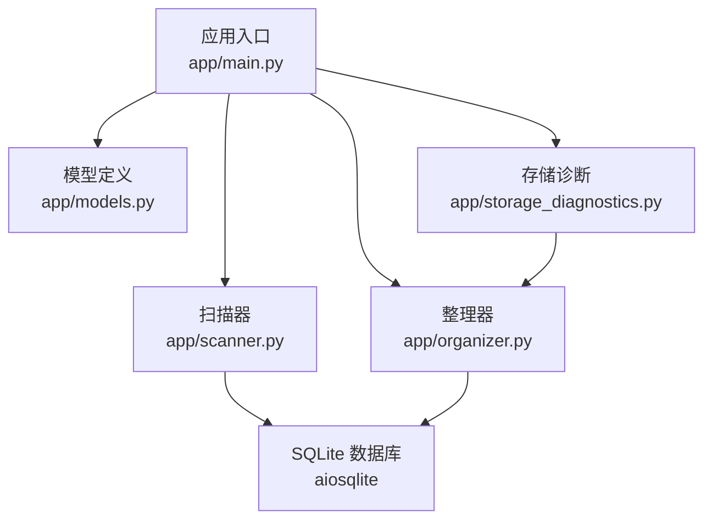
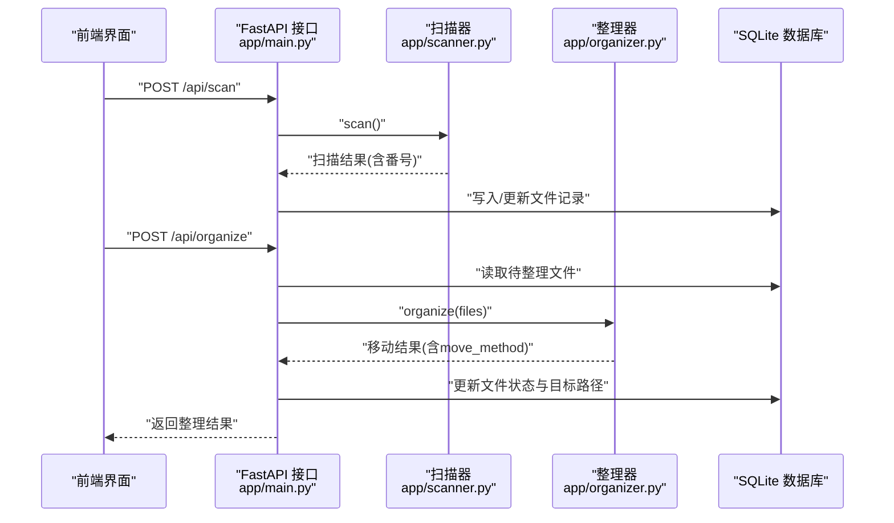
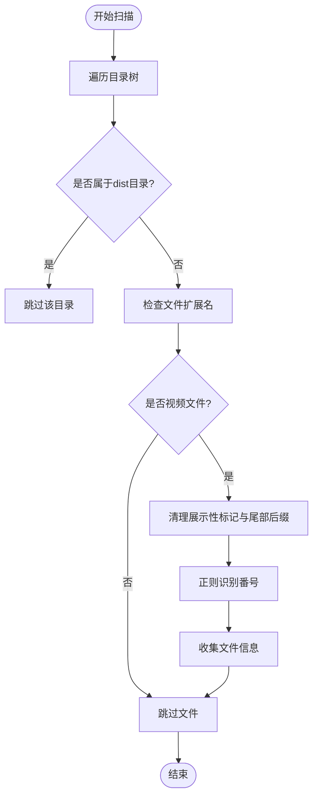
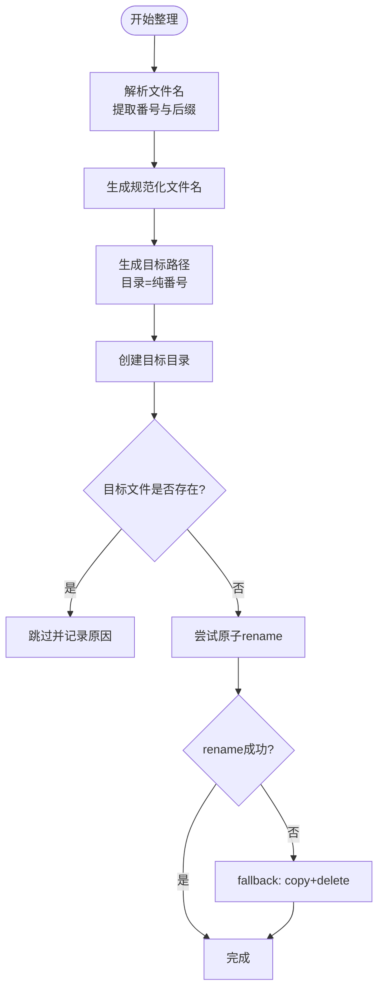
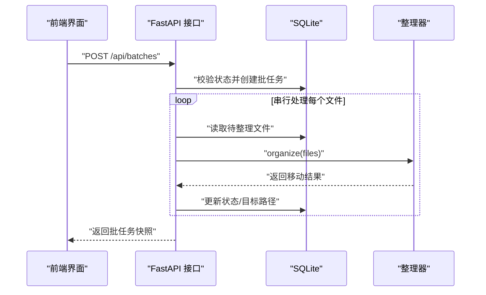
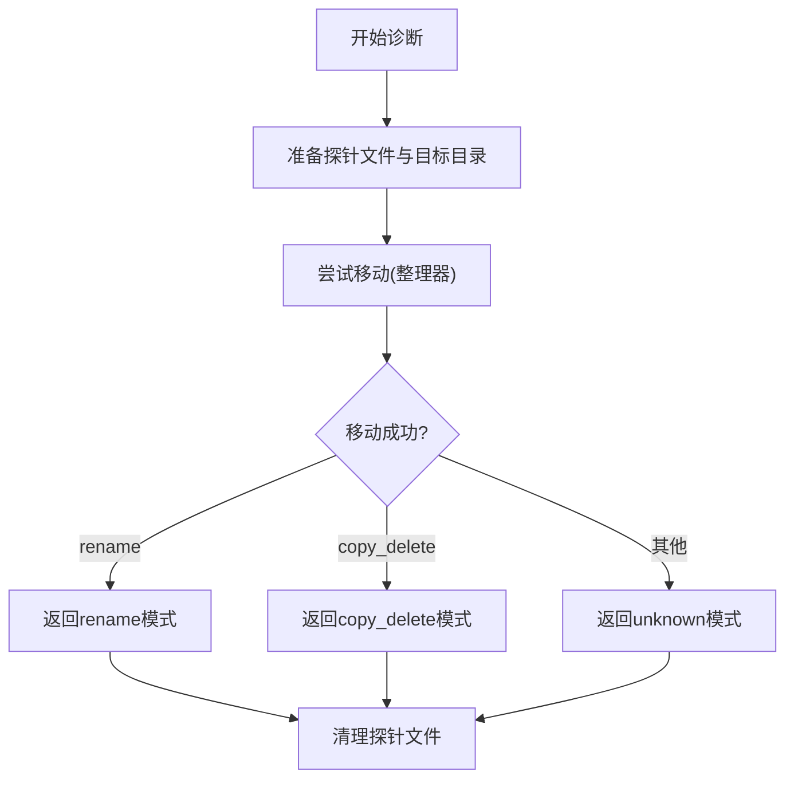
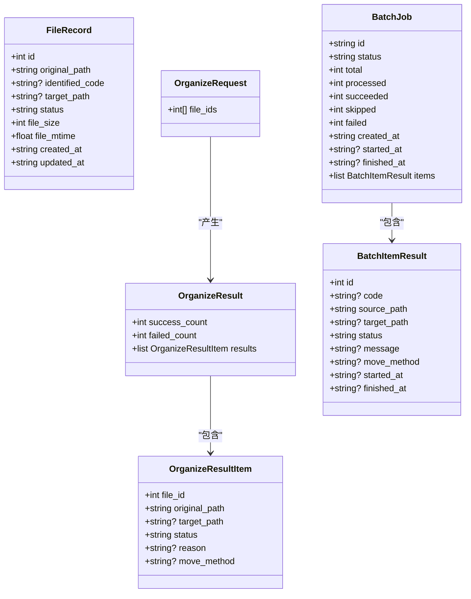
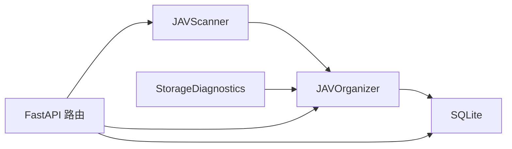

# 媒体文件整理

<cite>
**本文引用的文件**
- [app/organizer.py](file://app/organizer.py)
- [app/scanner.py](file://app/scanner.py)
- [app/models.py](file://app/models.py)
- [app/main.py](file://app/main.py)
- [app/storage_diagnostics.py](file://app/storage_diagnostics.py)
- [tests/test_organizer.py](file://tests/test_organizer.py)
- [tests/test_deploy_mounts.py](file://tests/test_deploy_mounts.py)
- [tests/test_storage_diagnostics.py](file://tests/test_storage_diagnostics.py)
- [README.en.md](file://README.en.md)
- [AGENTS.md](file://AGENTS.md)
</cite>

## 目录
1. [简介](#简介)
2. [项目结构](#项目结构)
3. [核心组件](#核心组件)
4. [架构总览](#架构总览)
5. [详细组件分析](#详细组件分析)
6. [依赖关系分析](#依赖关系分析)
7. [性能考量](#性能考量)
8. [故障排查指南](#故障排查指南)
9. [结论](#结论)
10. [附录](#附录)

## 简介
本文件面向Noctra的媒体文件整理能力，聚焦于JAV类媒体的扫描、番号识别、命名规范化、目录结构生成与文件移动策略。内容涵盖：
- 整理器的命名规则与目录结构生成
- 文件移动策略（原子rename优先、跨设备fallback为copy+delete）
- 冲突处理与回滚思路
- 批量操作流程
- 与外部存储系统的集成与诊断
- 性能与可靠性保障

## 项目结构
Noctra后端采用FastAPI + SQLite，前端为无构建的静态页面。媒体整理相关的核心模块位于app目录，测试覆盖整理器行为与存储诊断。

图表来源
- [app/main.py:68-72](file://app/main.py#L68-L72)
- [app/scanner.py:8-16](file://app/scanner.py#L8-L16)
- [app/organizer.py:9-16](file://app/organizer.py#L9-L16)
- [app/models.py:18-39](file://app/models.py#L18-L39)
- [app/storage_diagnostics.py:8-35](file://app/storage_diagnostics.py#L8-L35)

章节来源
- [README.en.md:58-72](file://README.en.md#L58-L72)
- [app/main.py:68-72](file://app/main.py#L68-L72)

## 核心组件
- 扫描器：递归扫描源目录，过滤dist输出目录，识别视频文件与番号，生成待整理清单。
- 整理器：基于番号生成目标路径与规范化文件名，执行移动（优先原子rename，跨设备时fallback为copy+delete），并记录移动方式。
- 模型：统一输入输出数据结构，包括扫描结果、组织请求、批量作业、历史记录等。
- 存储诊断：探测当前部署的移动模式（rename或copy_delete），辅助性能与可靠性判断。

章节来源
- [app/scanner.py:67-125](file://app/scanner.py#L67-L125)
- [app/organizer.py:164-215](file://app/organizer.py#L164-L215)
- [app/models.py:7-90](file://app/models.py#L7-L90)
- [app/storage_diagnostics.py:8-62](file://app/storage_diagnostics.py#L8-L62)

## 架构总览
Noctra的整理工作流由“扫描-预览-确认-批量整理”构成。后端提供REST接口，前端通过UI选择待整理文件并触发整理；后端将文件状态持久化至SQLite，并按批次执行移动。

图表来源
- [app/main.py:888-954](file://app/main.py#L888-L954)
- [app/scanner.py:67-125](file://app/scanner.py#L67-L125)
- [app/organizer.py:164-215](file://app/organizer.py#L164-L215)

## 详细组件分析

### 扫描器（JAVScanner）
职责
- 递归遍历源目录，跳过dist输出目录与子目录
- 仅处理视频扩展名文件
- 识别番号并清理展示性标记与尾部后缀，确保番号纯净
- 输出文件路径、文件名、识别出的番号、文件大小与修改时间

命名与规则
- 支持多类番号变体（含连字符、后缀标记等），并统一清理“字幕版/字幕/Uncensored/uncensored”等干扰词
- 尾部后缀如“-C/-UC/C/UC”在识别阶段被剥离，保证最终目录名为纯番号

图表来源
- [app/scanner.py:67-125](file://app/scanner.py#L67-L125)

章节来源
- [app/scanner.py:32-65](file://app/scanner.py#L32-L65)
- [app/scanner.py:67-125](file://app/scanner.py#L67-L125)

### 整理器（JAVOrganizer）
职责
- 解析文件名，识别番号与后缀（-C/-UC/字幕/Uncensored等）
- 生成规范化文件名与目标路径（目录为纯番号，文件名为“番号+后缀+扩展名”）
- 执行移动：优先原子rename，跨设备时fallback为copy+delete，并记录移动方式
- 批量整理：逐条处理，记录每条结果（moved/skipped/failed）及原因

命名规则与目录结构
- 目录：以识别出的纯番号命名
- 文件名：规范化为“番号+后缀（若存在）+扩展名”，去除冗余标记与多余后缀
- 后缀识别：支持紧凑型（如“FPRE-123C”）与分隔型（如“FPRE-123-C”）、中文“字幕/字幕版”、英文“Uncensored/uncensored”等

移动策略
- 同一文件系统：优先使用原子rename，速度快且无中间态
- 跨设备/跨文件系统：捕获EXDEV错误，自动降级为copy+delete，并确保目标落盘后删除源文件
- 冲突处理：若目标文件已存在，直接跳过并返回“目标文件已存在”

图表来源
- [app/organizer.py:164-215](file://app/organizer.py#L164-L215)
- [app/organizer.py:122-137](file://app/organizer.py#L122-L137)

章节来源
- [app/organizer.py:43-96](file://app/organizer.py#L43-L96)
- [app/organizer.py:139-162](file://app/organizer.py#L139-L162)
- [app/organizer.py:164-215](file://app/organizer.py#L164-L215)

### 批量操作与API
- 批量创建：/api/batches，校验文件状态与可整理范围，创建批任务并串行执行
- 批量取消：/api/batches/{batch_id}/cancel
- 单次整理：/api/organize，读取待整理文件，调用整理器，更新数据库状态
- 历史查看：/api/history，返回已处理文件的历史记录

图表来源
- [app/main.py:957-1000](file://app/main.py#L957-L1000)
- [app/main.py:888-954](file://app/main.py#L888-L954)

章节来源
- [app/main.py:957-1000](file://app/main.py#L957-L1000)
- [app/main.py:888-954](file://app/main.py#L888-L954)

### 存储诊断与外部存储集成
- 存储诊断：通过在源/目标目录间进行一次探针移动，判断当前部署的移动模式（rename或copy_delete），并缓存诊断结果
- 部署模式：当源/目标在同一文件系统时，推荐共享根挂载；跨设备时采用分离挂载并启用copy_delete模式
- 健康检查：/api/health返回存储诊断信息，便于运维观察

图表来源
- [app/storage_diagnostics.py:8-62](file://app/storage_diagnostics.py#L8-L62)
- [app/organizer.py:122-137](file://app/organizer.py#L122-L137)

章节来源
- [app/storage_diagnostics.py:8-62](file://app/storage_diagnostics.py#L8-L62)
- [tests/test_storage_diagnostics.py:7-34](file://tests/test_storage_diagnostics.py#L7-L34)
- [tests/test_deploy_mounts.py:8-25](file://tests/test_deploy_mounts.py#L8-L25)

### 数据模型与状态流转
- FileRecord：文件记录，包含原始路径、识别番号、目标路径、状态、文件大小与时间戳
- OrganizeRequest/OrganizeResult：组织请求与结果，包含每条文件的移动状态与原因
- BatchJob/BatchItemResult：批任务与单项结果，包含状态、消息、移动方式与时间戳
- 状态：pending、duplicate、processed、skipped、target_exists、failed、ignored等

图表来源
- [app/models.py:7-90](file://app/models.py#L7-L90)

章节来源
- [app/models.py:7-90](file://app/models.py#L7-L90)

## 依赖关系分析
- 组件耦合
  - 扫描器与整理器：扫描器产出文件清单，整理器消费清单并执行移动
  - 整理器与数据库：通过API读写文件状态与目标路径
  - 存储诊断与整理器：诊断结果指导移动策略选择
- 外部依赖
  - 文件系统：rename与EXDEV错误码用于跨设备判定
  - SQLite：异步连接与事务管理
  - FastAPI：路由与响应模型

图表来源
- [app/main.py:68-72](file://app/main.py#L68-L72)
- [app/scanner.py:8-16](file://app/scanner.py#L8-L16)
- [app/organizer.py:9-16](file://app/organizer.py#L9-L16)
- [app/storage_diagnostics.py:8-35](file://app/storage_diagnostics.py#L8-L35)

章节来源
- [app/main.py:68-72](file://app/main.py#L68-L72)
- [app/organizer.py:9-16](file://app/organizer.py#L9-L16)
- [app/storage_diagnostics.py:8-35](file://app/storage_diagnostics.py#L8-L35)

## 性能考量
- 原子rename优先：同一文件系统内，rename具备最佳性能与可靠性，避免中间态与重复IO
- 跨设备fallback：检测EXDEV后自动copy+delete，确保一致性；同时通过fsync与落盘检查降低数据丢失风险
- 扫描优化：跳过dist目录与非视频文件，减少无效I/O
- 批处理串行：批任务串行执行，避免并发写冲突与磁盘争用
- 存储诊断：通过健康检查暴露当前移动模式，便于运维优化挂载与存储布局

## 故障排查指南
- 目标文件已存在
  - 现象：整理结果为skipped，原因“目标文件已存在”
  - 处理：检查目标目录是否已有同名文件，必要时清理或调整命名规则
- 源文件不存在
  - 现象：整理结果为failed，原因“源文件不存在”
  - 处理：确认源路径是否正确，文件是否被外部程序占用
- 跨设备移动失败
  - 现象：rename失败并抛出EXDEV，自动降级为copy+delete
  - 处理：确认源/目标目录挂载在同一文件系统；若跨设备，建议调整挂载策略或使用共享根模式
- 存储模式未知
  - 现象：健康检查返回unknown
  - 处理：确认源/目标目录存在且可写，重新运行健康检查

章节来源
- [app/organizer.py:139-162](file://app/organizer.py#L139-L162)
- [tests/test_organizer.py:73-115](file://tests/test_organizer.py#L73-L115)
- [tests/test_storage_diagnostics.py:36-65](file://tests/test_storage_diagnostics.py#L36-L65)

## 结论
Noctra的媒体文件整理以“扫描-预览-确认-批量整理”为核心流程，通过严格的番号识别与命名规范化，结合可靠的移动策略与存储诊断，实现了高可靠、可观察的本地/NAS媒体整理体验。建议在生产环境中：
- 使用共享根挂载以获得rename性能
- 对跨设备场景启用copy_delete并监控磁盘I/O
- 定期运行健康检查与存储诊断，确保部署最优

## 附录

### 实际案例与命名约定
- 案例1：紧凑型后缀
  - 输入：FPRE-123C.mp4
  - 目标：/dist/FPRE-123/FPRE-123-C.mp4
- 案例2：分隔型后缀
  - 输入：ABP-456-C.mp4
  - 目标：/dist/ABP-456/ABP-456-C.mp4
- 案例3：Uncensored标记
  - 输入：ABC-123 [Uncensored].mp4
  - 目标：/dist/ABC-123/ABC-123-UC.mp4
- 案例4：中文“字幕/字幕版”
  - 输入：FPRE-123_字幕版.mp4
  - 目标：/dist/FPRE-123/FPRE-123-C.mp4
- 案例5：无后缀
  - 输入：SSIS-123.mp4
  - 目标：/dist/SSIS-123/SSIS-123.mp4

章节来源
- [app/organizer.py:65-83](file://app/organizer.py#L65-L83)
- [app/organizer.py:85-96](file://app/organizer.py#L85-L96)
- [tests/test_organizer.py:7-40](file://tests/test_organizer.py#L7-L40)

### 配置与环境变量
- 关键变量
  - SOURCE_DIR：源目录
  - DIST_DIR：目标目录
  - DB_PATH：SQLite数据库路径
- 建议
  - 不在容器外提交个人绝对路径
  - 若变更端口，需同步更新本地与容器默认值

章节来源
- [AGENTS.md:30-32](file://AGENTS.md#L30-L32)
- [README.en.md:27-32](file://README.en.md#L27-L32)