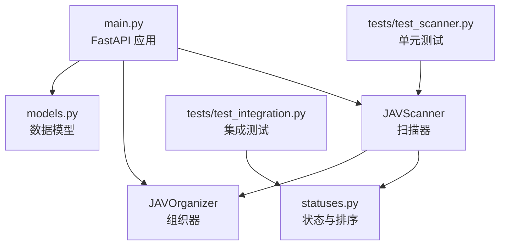
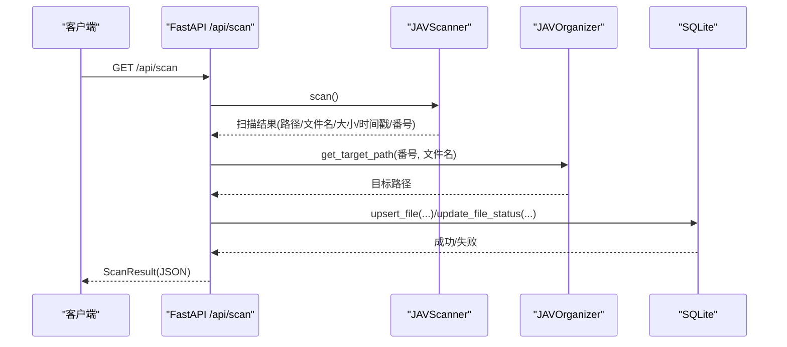
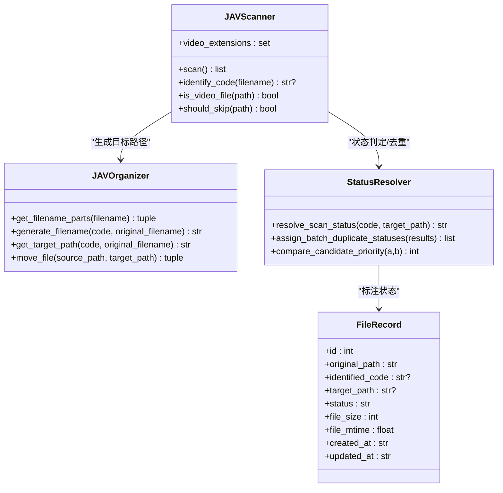

# 文件扫描与识别

<cite>
**本文引用的文件**
- [app/scanner.py](file://app/scanner.py)
- [app/organizer.py](file://app/organizer.py)
- [app/statuses.py](file://app/statuses.py)
- [app/models.py](file://app/models.py)
- [app/main.py](file://app/main.py)
- [tests/test_scanner.py](file://tests/test_scanner.py)
- [tests/test_integration.py](file://tests/test_integration.py)
- [AGENTS.md](file://AGENTS.md)
</cite>

## 目录
1. [简介](#简介)
2. [项目结构](#项目结构)
3. [核心组件](#核心组件)
4. [架构总览](#架构总览)
5. [详细组件分析](#详细组件分析)
6. [依赖关系分析](#依赖关系分析)
7. [性能考量](#性能考量)
8. [故障排查指南](#故障排查指南)
9. [结论](#结论)
10. [附录](#附录)

## 简介
本文档围绕 Noctra 的文件扫描与识别能力，系统阐述扫描器工作原理、媒体文件识别算法、扫描策略、配置选项、过滤规则与性能优化机制；并提供使用示例、扫描结果数据结构说明、后续处理流程、常见问题与最佳实践。

## 项目结构
与“文件扫描与识别”直接相关的模块与文件如下：
- 扫描器：负责遍历源目录、识别番号、过滤 dist 目录与非视频文件，输出扫描结果
- 组织器：负责根据番号生成目标路径与文件名，执行移动/复制操作
- 状态与排序：用于扫描结果去重、优先级排序与状态判定
- 数据模型：定义扫描结果、文件记录、批次作业等数据结构
- 主应用：FastAPI 接口层，挂载扫描接口、数据库初始化、状态统计与后续处理入口

图表来源
- [app/scanner.py:1-161](file://app/scanner.py#L1-L161)
- [app/organizer.py:1-307](file://app/organizer.py#L1-L307)
- [app/statuses.py:1-154](file://app/statuses.py#L1-L154)
- [app/models.py:1-216](file://app/models.py#L1-L216)
- [app/main.py:738-808](file://app/main.py#L738-L808)
- [tests/test_scanner.py:115-220](file://tests/test_scanner.py#L115-L220)
- [tests/test_integration.py:98-140](file://tests/test_integration.py#L98-L140)

章节来源
- [app/main.py:60-75](file://app/main.py#L60-L75)
- [app/main.py:738-808](file://app/main.py#L738-L808)

## 核心组件
- JAVScanner：扫描源目录，识别视频文件与番号，过滤 dist 目录与非视频文件，返回标准化扫描结果
- JAVOrganizer：根据番号与原始文件名生成目标路径与文件名，执行原子移动或跨文件系统回退复制
- statuses：扫描状态判定、重复项去重、候选优先级排序、自然序比较
- 数据模型：定义扫描结果、文件记录、批次作业、刮削作业等结构
- 主应用：提供 /api/scan 接口，初始化数据库与索引，维护扫描状态与历史记录

章节来源
- [app/scanner.py:8-126](file://app/scanner.py#L8-L126)
- [app/organizer.py:9-215](file://app/organizer.py#L9-L215)
- [app/statuses.py:24-104](file://app/statuses.py#L24-L104)
- [app/models.py:7-216](file://app/models.py#L7-L216)
- [app/main.py:738-808](file://app/main.py#L738-L808)

## 架构总览
Noctra 的扫描与识别由“扫描器 + 组织器 + 状态与排序 + 数据模型 + 接口层”构成。扫描器负责发现与识别，组织器负责目标路径生成与文件移动，状态模块负责去重与优先级，接口层负责对外暴露扫描 API 并持久化状态。

图表来源
- [app/main.py:738-808](file://app/main.py#L738-L808)
- [app/scanner.py:67-125](file://app/scanner.py#L67-L125)
- [app/organizer.py:85-96](file://app/organizer.py#L85-L96)

## 详细组件分析

### 扫描器（JAVScanner）
- 功能要点
  - 视频扩展名白名单：仅处理指定扩展名的文件
  - 跳过规则：跳过 dist 目录及其子目录，以及 dist 下的文件
  - 番号识别：基于正则表达式匹配“首段含字母、中间段字母数字、末段数字”，并去除尾部 -C/-UC/C/UC 等后缀
  - 清洗标记：去除“字幕版/字幕/Uncensored/uncensored”等干扰词
  - 遍历策略：使用 os.walk 递归遍历，跳过 dist 子目录，逐文件统计与识别
  - 结果结构：包含绝对路径、文件名、识别出的番号、文件大小、修改时间

- 关键算法与复杂度
  - 遍历复杂度：O(N)，N 为扫描目录中的文件数
  - 单文件识别：O(L)，L 为文件名长度（正则匹配与字符串清洗）
  - 跳过 dist：通过路径解析与前缀匹配实现 O(1) 判断

- 使用示例（概念性）
  - 配置环境变量 SOURCE_DIR/DIST_DIR 后，调用 /api/scan 即可触发扫描
  - 可通过参数控制是否强制重新扫描（当前实现未使用该参数）

章节来源
- [app/scanner.py:17-125](file://app/scanner.py#L17-L125)
- [tests/test_scanner.py:115-220](file://tests/test_scanner.py#L115-L220)

### 组织器（JAVOrganizer）
- 功能要点
  - 文件名解析：拆解番号、扩展名与后缀（-C/-UC），兼容中文/英文标记
  - 文件名生成：统一生成“番号+后缀+扩展名”的目标文件名
  - 目标路径生成：/dist/{番号}/{文件名}
  - 移动策略：优先原子替换（rename），跨文件系统时回退复制并删除源文件，保证落盘一致性
  - 错误处理：目标已存在、源不存在、跨设备错误等场景均有明确返回

- 关键算法与复杂度
  - 文件名解析与生成：O(L)，L 为文件名长度
  - 路径拼接：O(1)
  - 移动：O(1) 原子替换，跨设备复制 O(F)（F 为文件大小）

- 使用示例（概念性）
  - 对扫描结果中的每个文件，调用 get_target_path 生成目标路径，再调用 move_file 完成移动

章节来源
- [app/organizer.py:43-163](file://app/organizer.py#L43-L163)
- [tests/test_scanner.py:218-220](file://tests/test_scanner.py#L218-L220)

### 状态与排序（statuses）
- 功能要点
  - 扫描状态判定：无番号则跳过；目标路径存在则标记为已存在；否则为待处理
  - 候选去重：同一番号多候选时，按后缀优先级、大小、自然序进行排序，仅保留最高优先级，其余标记为 duplicate
  - 自然序比较：对包含数字的文件名进行“自然排序”，提升人类可读性

- 使用示例（概念性）
  - 在扫描完成后，对扫描结果调用 assign_batch_duplicate_statuses 进行去重与状态标注

章节来源
- [app/statuses.py:24-104](file://app/statuses.py#L24-L104)
- [tests/test_integration.py:98-140](file://tests/test_integration.py#L98-L140)

### 数据模型（models）
- 扫描结果与文件记录
  - FileRecord：文件记录，包含原始路径、识别番号、目标路径、状态、文件大小、修改时间、创建/更新时间
  - ScanResult：扫描结果聚合，包含统计与文件列表
- 批次与作业
  - BatchJob/BatchItemResult：批量整理作业与单项结果
  - ScrapeJobSnapshot/ScrapeJobItem：刮削作业快照与单项
- 刮削详情
  - ScrapeDetailMetadata/ScrapeDetailResponse：刮削元数据与响应

章节来源
- [app/models.py:7-216](file://app/models.py#L7-L216)

### 接口层（FastAPI）
- /api/scan：扫描源目录，结合组织器生成目标路径，调用状态模块判定状态，插入/更新数据库，返回 ScanResult
- 数据库初始化：首次启动自动建表与补齐刮削相关列，创建索引
- 历史记录处理：区分“已处理历史记录”与“当前扫描基线”，避免历史脏路径污染统计

章节来源
- [app/main.py:738-808](file://app/main.py#L738-L808)
- [app/main.py:78-125](file://app/main.py#L78-L125)

## 依赖关系分析
- 组件耦合
  - main.py 依赖 scanner、organizer、statuses、models
  - scanner 与 organizer 为纯函数式工具，低耦合
  - statuses 提供扫描后处理逻辑，与扫描结果强关联
- 外部依赖
  - 文件系统：os.walk、stat、replace、copy2、fsync
  - SQLite：异步存储文件记录与状态
  - 正则：番号识别与标记清洗

图表来源
- [app/scanner.py:8-126](file://app/scanner.py#L8-L126)
- [app/organizer.py:9-215](file://app/organizer.py#L9-L215)
- [app/statuses.py:24-104](file://app/statuses.py#L24-L104)
- [app/models.py:7-17](file://app/models.py#L7-L17)

## 性能考量
- 扫描阶段
  - 使用 os.walk 递归遍历，时间复杂度 O(N)，建议将源目录结构扁平化以减少层级
  - 跳过 dist 目录与非视频文件，避免无效 IO
- 识别阶段
  - 正则匹配与字符串清洗均为 O(L)，对长文件名有轻微开销
- 写入阶段
  - upsert/update 操作为 O(1)，SQLite 写入受磁盘性能限制
- 移动阶段
  - 同盘原子替换最快；跨盘复制需考虑带宽与延迟
- 建议
  - 将 SOURCE_DIR 与 DIST_DIR 放在同一文件系统，减少跨盘复制
  - 控制扫描频率，避免频繁全量扫描
  - 对大目录采用分批扫描或增量策略（当前实现未内置增量）

[本节为通用性能建议，不直接分析具体文件]

## 故障排查指南
- 番号识别异常
  - 检查文件名是否符合“首段含字母、中间段字母数字、末段数字”的规则
  - 确认是否包含被清洗的标记（字幕版/字幕/Uncensored/uncensored）
- 目标路径已存在
  - 组织器会跳过已存在的目标文件；确认 dist 中是否存在同名文件
- 跨文件系统移动失败
  - 组织器会回退复制+删除源文件；检查磁盘空间与权限
- 扫描结果为空
  - 确认 SOURCE_DIR/DIST_DIR 环境变量正确，dist 目录不会被扫描
  - 确认文件扩展名为视频扩展名之一
- 历史记录污染统计
  - 系统区分“已处理历史记录”与“当前扫描基线”，确保历史记录中源文件不存在才会计入已处理

章节来源
- [app/organizer.py:139-162](file://app/organizer.py#L139-L162)
- [app/main.py:716-731](file://app/main.py#L716-L731)

## 结论
Noctra 的文件扫描与识别以“扫描器 + 组织器 + 状态与排序 + 数据模型 + 接口层”为核心，实现了对 JAV 类媒体文件的自动化识别与整理。扫描器专注发现与识别，组织器专注路径生成与移动，状态模块负责去重与优先级，接口层提供稳定的 API 与持久化。通过合理的配置与最佳实践，可在保证准确性的同时获得良好的性能表现。

[本节为总结性内容，不直接分析具体文件]

## 附录

### 扫描配置选项与环境变量
- SOURCE_DIR：源目录，默认值来自环境变量，扫描器以此为根目录
- DIST_DIR：目标目录，默认值来自环境变量，扫描器会跳过该目录及其子目录
- DB_PATH：数据库路径，默认值来自环境变量，用于存储文件记录与状态

章节来源
- [app/main.py:60-68](file://app/main.py#L60-L68)

### 扫描策略与过滤规则
- 视频文件过滤：仅处理预设扩展名集合
- dist 目录过滤：跳过 dist 目录及其子目录
- dist 文件过滤：跳过 dist 下的文件
- 番号清洗：去除字幕版/字幕/Uncensored/uncensored 等标记
- 后缀清理：去除尾部 -C/-UC/C/UC 等后缀

章节来源
- [app/scanner.py:17-65](file://app/scanner.py#L17-L65)

### 扫描结果数据结构
- FileRecord：原始路径、识别番号、目标路径、状态、文件大小、修改时间、创建/更新时间
- ScanResult：统计汇总（总数、已识别、未识别、待处理、已处理、已刮削、刮削失败）与文件列表
- 批次与作业：BatchJob/BatchItemResult、ScrapeJobSnapshot/ScrapeJobItem 等

章节来源
- [app/models.py:7-90](file://app/models.py#L7-L90)

### 使用示例（概念性）
- 配置扫描路径
  - 设置 SOURCE_DIR 与 DIST_DIR 环境变量，指向实际媒体库与目标库
- 设置扫描频率
  - 通过外部调度器定期调用 /api/scan；当前实现未内置定时器
- 处理不同类型的媒体文件
  - 仅处理视频扩展名；非视频文件会被跳过
- 后续处理流程
  - 扫描完成后，系统根据番号生成目标路径并尝试移动；若目标已存在则跳过；若跨盘则复制后删除源文件

章节来源
- [app/main.py:738-808](file://app/main.py#L738-L808)
- [app/organizer.py:139-163](file://app/organizer.py#L139-L163)

### 常见问题与最佳实践
- 问题：番号识别失败
  - 原因：文件名不符合规则或包含干扰标记
  - 处理：调整命名规范，移除干扰词
- 问题：目标已存在导致跳过
  - 原因：dist 中已有同名文件
  - 处理：清理冲突文件或调整命名
- 问题：跨盘移动失败
  - 原因：跨文件系统导致 rename 不可用
  - 处理：确保 SOURCE_DIR 与 DIST_DIR 在同一文件系统
- 最佳实践
  - 保持命名规范，避免长文件名与特殊字符
  - 分批扫描，避免一次性全量扫描大目录
  - 使用一致的媒体库结构，减少层级

章节来源
- [app/organizer.py:122-162](file://app/organizer.py#L122-L162)
- [AGENTS.md:30-32](file://AGENTS.md#L30-L32)