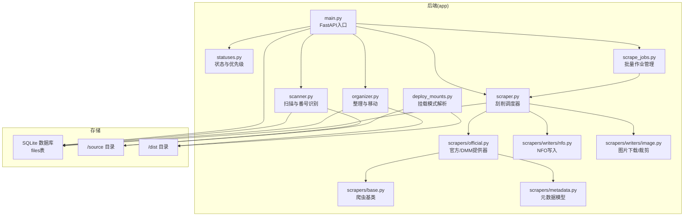
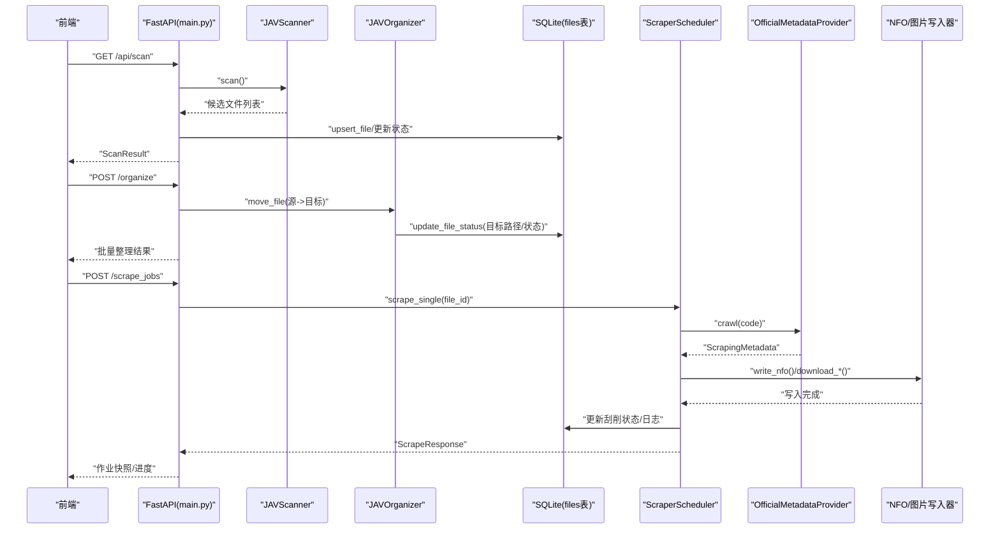
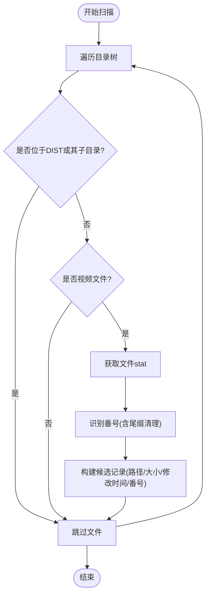
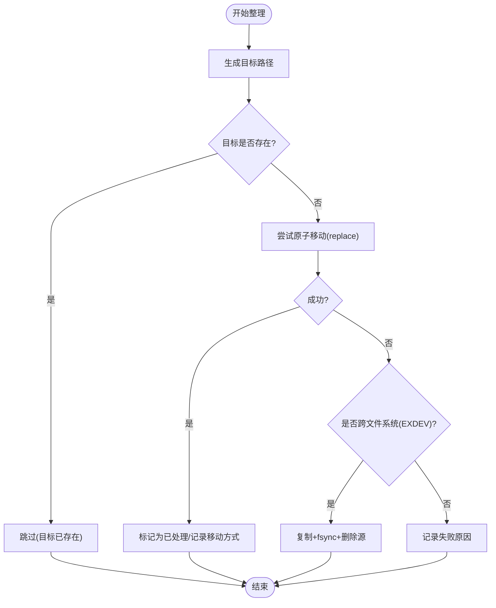
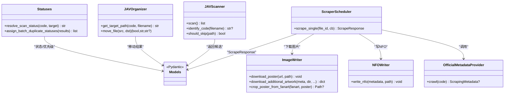

# 核心功能

<cite>
**本文引用的文件**
- [app/main.py](file://app/main.py)
- [app/scanner.py](file://app/scanner.py)
- [app/organizer.py](file://app/organizer.py)
- [app/scraper.py](file://app/scraper.py)
- [app/models.py](file://app/models.py)
- [app/statuses.py](file://app/statuses.py)
- [app/scrape_jobs.py](file://app/scrape_jobs.py)
- [app/scrapers/base.py](file://app/scrapers/base.py)
- [app/scrapers/metadata.py](file://app/scrapers/metadata.py)
- [app/scrapers/official.py](file://app/scrapers/official.py)
- [app/scrapers/writers/nfo.py](file://app/scrapers/writers/nfo.py)
- [app/scrapers/writers/image.py](file://app/scrapers/writers/image.py)
- [app/deploy_mounts.py](file://app/deploy_mounts.py)
- [README.en.md](file://README.en.md)
</cite>

## 目录
1. [简介](#简介)
2. [项目结构](#项目结构)
3. [核心组件](#核心组件)
4. [架构总览](#架构总览)
5. [详细组件分析](#详细组件分析)
6. [依赖关系分析](#依赖关系分析)
7. [性能考量](#性能考量)
8. [故障排查指南](#故障排查指南)
9. [结论](#结论)
10. [附录](#附录)

## 简介
本文件面向Noctra的核心功能模块，系统性阐述文件扫描、媒体整理与元数据刮削三大模块的工作原理、实现细节与协作流程，并提供使用示例、配置选项、最佳实践、扩展点与自定义能力说明。Noctra以FastAPI + SQLite为后端，配合静态前端，提供“预览-确认-执行”的安全工作流，支持本地与NAS部署。

## 项目结构
Noctra采用按职责分层的模块组织方式：
- app/：后端服务与业务逻辑
  - scanner.py：文件扫描与番号识别
  - organizer.py：媒体整理与目标路径生成
  - scraper.py：元数据刮削调度器
  - scrape_jobs.py：批量刮削作业管理
  - scrapers/：爬虫与写入器
    - base.py：爬虫基类与通用能力
    - metadata.py：元数据模型
    - official.py：官方/DMM元数据提供器
    - writers/：NFO与图片写入器
      - nfo.py：Emby/Kodi兼容的NFO生成
      - image.py：异步图片下载与海报裁剪
  - statuses.py：扫描状态与优先级判定
  - models.py：API与数据库模型
  - main.py：FastAPI应用入口与API路由
  - deploy_mounts.py：NAS挂载模式解析
- static/：前端静态资源
- tests/：单元与集成测试
- docs/：运行与设计文档



图表来源
- [app/main.py](file://app/main.py)
- [app/scanner.py](file://app/scanner.py)
- [app/organizer.py](file://app/organizer.py)
- [app/scraper.py](file://app/scraper.py)
- [app/scrape_jobs.py](file://app/scrape_jobs.py)
- [app/scrapers/official.py](file://app/scrapers/official.py)
- [app/scrapers/base.py](file://app/scrapers/base.py)
- [app/scrapers/metadata.py](file://app/scrapers/metadata.py)
- [app/scrapers/writers/nfo.py](file://app/scrapers/writers/nfo.py)
- [app/scrapers/writers/image.py](file://app/scrapers/writers/image.py)
- [app/deploy_mounts.py](file://app/deploy_mounts.py)

章节来源
- [README.en.md](file://README.en.md)
- [app/main.py](file://app/main.py)

## 核心组件
- 文件扫描器（JAVScanner）
  - 功能：递归扫描源目录，过滤dist相关路径，识别JAV番号，生成候选文件清单。
  - 关键点：视频扩展名白名单、番号正则、尾缀清理（-C/-UC/C/UC等）、跳过dist目录。
- 媒体整理器（JAVOrganizer）
  - 功能：根据番号生成目标路径，执行原子移动或跨文件系统复制+删除，保证数据一致性。
  - 关键点：同文件系统优先rename，EXDEV降级为copy2+fsync+unlink；目标存在即跳过。
- 刮削调度器（ScraperScheduler）
  - 功能：单文件刮削全流程编排：校验→查询→解析→写NFO→下载图片→更新DB。
  - 关键点：进度百分比映射、错误映射为用户友好消息、日志持久化、失败回退策略。
- 批量作业管理（scrape_jobs）
  - 功能：队列化批量刮削，记录作业快照、进度与日志，支持取消。
- 状态与优先级（statuses）
  - 功能：扫描状态判定、重复候选去重、自然排序与优先级比较。
- 爬虫与写入器（scrapers/*）
  - 功能：官方/DMM数据抓取、LLM辅助抽取与翻译、NFO生成、图片下载与海报裁剪。
- 应用入口（main.py）
  - 功能：FastAPI路由、数据库初始化、文件记录增改、统计与历史视图、批处理组织。

章节来源
- [app/scanner.py](file://app/scanner.py)
- [app/organizer.py](file://app/organizer.py)
- [app/scraper.py](file://app/scraper.py)
- [app/scrape_jobs.py](file://app/scrape_jobs.py)
- [app/statuses.py](file://app/statuses.py)
- [app/models.py](file://app/models.py)
- [app/scrapers/official.py](file://app/scrapers/official.py)
- [app/scrapers/base.py](file://app/scrapers/base.py)
- [app/scrapers/metadata.py](file://app/scrapers/metadata.py)
- [app/scrapers/writers/nfo.py](file://app/scrapers/writers/nfo.py)
- [app/scrapers/writers/image.py](file://app/scrapers/writers/image.py)
- [app/main.py](file://app/main.py)

## 架构总览
Noctra遵循“扫描-整理-刮削”的三段式流水线，数据在SQLite中持久化，前端通过REST接口与后端交互。核心流程如下：



图表来源
- [app/main.py](file://app/main.py)
- [app/scanner.py](file://app/scanner.py)
- [app/organizer.py](file://app/organizer.py)
- [app/scraper.py](file://app/scraper.py)
- [app/scrape_jobs.py](file://app/scrape_jobs.py)
- [app/scrapers/official.py](file://app/scrapers/official.py)
- [app/scrapers/writers/nfo.py](file://app/scrapers/writers/nfo.py)
- [app/scrapers/writers/image.py](file://app/scrapers/writers/image.py)

## 详细组件分析

### 文件扫描模块（JAVScanner）
- 工作原理
  - 递归遍历SOURCE_DIR，排除DIST目录及其子目录与非视频文件。
  - 使用正则识别番号，去除尾缀标记（-C/-UC/C/UC），清理“字幕版/字幕/Uncensored”等干扰词。
  - 生成候选文件信息：路径、文件名、大小、修改时间、识别番号、目标路径（若已识别）。
- 关键算法与复杂度
  - 遍历：O(N)，N为文件数量；每次文件stat为O(1)。
  - 正则匹配：单次O(L)，L为文件名长度；整体O(N·L)。
- 错误处理与边界
  - 路径解析异常、权限问题导致跳过；非视频文件直接忽略。
- 使用示例
  - 调用扫描接口触发扫描，返回ScanResult，前端可据此筛选与批量整理。
- 配置与环境变量
  - SOURCE_DIR、DIST_DIR由main.py读取；扫描器内部使用相对路径解析避免跨目录误判。
- 最佳实践
  - 将媒体文件放在SOURCE_DIR，避免与DIST混放；定期清理干扰文件名中的标记词。
- 扩展点
  - 可新增更多番号识别规则或正则变体；可扩展支持更多视频格式。



图表来源
- [app/scanner.py](file://app/scanner.py)

章节来源
- [app/scanner.py](file://app/scanner.py)
- [app/main.py](file://app/main.py)

### 媒体整理模块（JAVOrganizer）
- 工作原理
  - 根据番号与原始文件名生成目标路径（/dist/{番号}/{文件名}），保留后缀语义（-C/-UC/字幕/Uncensored）。
  - 移动策略：同文件系统优先原子替换（rename），跨文件系统降级为复制+fsync+删除（确保落盘）。
  - 目标存在则跳过；失败原因记录便于UI反馈。
- 关键算法与复杂度
  - 路径生成：O(1)；移动：rename为O(1)，跨文件系统复制为O(T)，T为文件大小。
- 错误处理与边界
  - 源文件不存在、目标已存在、跨文件系统EXDEV、IO错误等均有明确返回值。
- 使用示例
  - 在扫描结果中选择待整理文件，调用组织接口，观察批量结果与移动方式（rename/copy_delete）。
- 配置与环境变量
  - DIST_DIR由main.py注入；移动前自动创建目标目录。
- 最佳实践
  - 确保DIST与SOURCE在同一文件系统以获得原子rename；否则会自动降级为复制+删除。
- 扩展点
  - 可增加更多后缀语义映射；可支持更多命名规范。



图表来源
- [app/organizer.py](file://app/organizer.py)

章节来源
- [app/organizer.py](file://app/organizer.py)
- [app/main.py](file://app/main.py)

### 元数据刮削模块（ScraperScheduler + 官方提供器）
- 工作原理
  - 单文件刮削：校验文件状态→查询官方/DMM→解析元数据→写NFO→下载图片→更新DB。
  - 官方/DMM提供器：从Takara TV与DMM抓取详情页，解析标题、演员、标签、发行日期、评分等；可选LLM辅助抽取与中文翻译。
  - 写入器：生成Emby/Kodi兼容的NFO；下载fanart与预览图；从fanart裁剪海报。
- 关键算法与复杂度
  - 爬取与解析：受网络与站点结构影响；写入NFO为O(F)，F为字段数量；图片下载为I/O受限。
- 错误处理与边界
  - Cloudflare挑战、HTTP错误、JSON解析失败、图片下载失败等均有用户友好提示与日志记录。
- 使用示例
  - 通过作业接口提交待刮削文件ID，实时查看进度与日志；失败时查看错误映射与最近日志。
- 配置与环境变量
  - DB_PATH；可选NOCTRA_LLM_API_KEY/OPENAI_API_KEY与LLM相关参数；代理通过proxy模块注入。
- 最佳实践
  - 仅对已整理（processed/organized）文件进行刮削；合理设置超时与重试；必要时配置代理。
- 扩展点
  - 新增爬虫提供器（继承BaseCrawler）；扩展写入器（NFO/图片外的其他格式）。

```mermaid
sequenceDiagram
participant Job as "scrape_jobs"
participant Sched as "ScraperScheduler"
participant DB as "SQLite"
participant Off as "OfficialMetadataProvider"
participant NFO as "NFO写入器"
participant Img as "图片写入器"
Job->>Sched : "scrape_single(file_id)"
Sched->>DB : "读取文件记录"
Sched->>Off : "crawl(code)"
Off-->>Sched : "ScrapingMetadata"
Sched->>NFO : "write_nfo(metadata)"
Sched->>Img : "download_additional_artwork()"
Img-->>Sched : "返回下载结果"
Sched->>DB : "更新刮削状态/日志"
Sched-->>Job : "ScrapeResponse"
```

图表来源
- [app/scraper.py](file://app/scraper.py)
- [app/scrape_jobs.py](file://app/scrape_jobs.py)
- [app/scrapers/official.py](file://app/scrapers/official.py)
- [app/scrapers/writers/nfo.py](file://app/scrapers/writers/nfo.py)
- [app/scrapers/writers/image.py](file://app/scrapers/writers/image.py)

章节来源
- [app/scraper.py](file://app/scraper.py)
- [app/scrape_jobs.py](file://app/scrape_jobs.py)
- [app/scrapers/official.py](file://app/scrapers/official.py)
- [app/scrapers/base.py](file://app/scrapers/base.py)
- [app/scrapers/metadata.py](file://app/scrapers/metadata.py)
- [app/scrapers/writers/nfo.py](file://app/scrapers/writers/nfo.py)
- [app/scrapers/writers/image.py](file://app/scrapers/writers/image.py)

### 状态与优先级（statuses）
- 工作原理
  - 扫描状态：未识别（skipped）、目标已存在（target_exists）、待处理（pending）、重复（duplicate）。
  - 重复候选去重：同一番号下按后缀优先级（UC>C>SUB>PLAIN）、文件大小、自然排序确定保留与重复。
- 使用示例
  - 扫描后对同一番号多候选进行去重，保留最高优先级文件，其余标记为duplicate。
- 最佳实践
  - 优先保留UC/C/字幕/Uncensored等语义更完整的版本；大文件优先。

章节来源
- [app/statuses.py](file://app/statuses.py)

### 应用入口与API（main.py）
- 工作原理
  - 初始化数据库与索引；挂载静态资源；提供扫描、组织、刮削、历史、统计等API。
  - 文件记录的upsert/更新、批量作业、存储诊断（移动/复制模式）等。
- 使用示例
  - GET /api/scan：触发扫描并返回候选与状态。
  - POST /organize：批量整理。
  - POST /scrape_jobs：创建并运行批量刮削作业。
- 最佳实践
  - 使用环境变量配置SOURCE_DIR/DIST_DIR/DB_PATH；定期维护数据库索引。

章节来源
- [app/main.py](file://app/main.py)

## 依赖关系分析



图表来源
- [app/scanner.py](file://app/scanner.py)
- [app/organizer.py](file://app/organizer.py)
- [app/scraper.py](file://app/scraper.py)
- [app/scrape_jobs.py](file://app/scrape_jobs.py)
- [app/scrapers/official.py](file://app/scrapers/official.py)
- [app/scrapers/writers/nfo.py](file://app/scrapers/writers/nfo.py)
- [app/scrapers/writers/image.py](file://app/scrapers/writers/image.py)
- [app/statuses.py](file://app/statuses.py)
- [app/models.py](file://app/models.py)

章节来源
- [app/models.py](file://app/models.py)
- [app/statuses.py](file://app/statuses.py)
- [app/scanner.py](file://app/scanner.py)
- [app/organizer.py](file://app/organizer.py)
- [app/scraper.py](file://app/scraper.py)
- [app/scrape_jobs.py](file://app/scrape_jobs.py)
- [app/scrapers/official.py](file://app/scrapers/official.py)
- [app/scrapers/writers/nfo.py](file://app/scrapers/writers/nfo.py)
- [app/scrapers/writers/image.py](file://app/scrapers/writers/image.py)

## 性能考量
- 扫描阶段
  - I/O密集：遍历目录树；建议将SOURCE_DIR与DIST_DIR置于同一磁盘，减少跨设备开销。
- 整理阶段
  - rename为O(1)，跨文件系统复制为O(T)；建议优先使用同文件系统，避免频繁复制。
- 刮削阶段
  - 网络I/O与解析为主；Cloudflare挑战与HTTP错误需重试；图片下载可并发但需控制并发度与超时。
- 数据库
  - 建议为scrape_status建立索引；批量写入时合并事务以降低写放大。

[本节为通用指导，无需特定文件引用]

## 故障排查指南
- 扫描无结果
  - 检查SOURCE_DIR/DIST_DIR是否正确挂载；确认文件扩展名在视频白名单内；排除DIST相关目录。
- 整理失败
  - 查看返回的失败原因（源文件不存在/目标已存在/移动失败）；确认DIST与SOURCE在同一文件系统。
- 刮削失败
  - 查看作业最近日志与错误映射；关注Cloudflare拦截、网络超时、JSON解析失败；必要时配置代理或LLM密钥。
- 历史视图为空
  - 确认文件已被移动（源文件不存在）且状态为processed/organized；数据库schema需包含刮削相关列。

章节来源
- [app/main.py](file://app/main.py)
- [app/scraper.py](file://app/scraper.py)
- [app/scrape_jobs.py](file://app/scrape_jobs.py)

## 结论
Noctra通过清晰的三段式流水线实现了从扫描、整理到刮削的完整自动化，结合状态管理与可视化界面，提供了安全可靠的本地/NAS媒体管理方案。其模块化设计便于扩展新的爬虫与写入器，满足多样化的元数据需求。

[本节为总结，无需特定文件引用]

## 附录

### 使用示例与API参考
- 扫描
  - 接口：GET /api/scan
  - 参数：force_rescan（布尔）
  - 返回：ScanResult（包含文件列表与统计）
- 组织
  - 接口：POST /organize
  - 请求体：BatchCreateRequest（file_ids）
  - 返回：批量整理结果
- 刮削作业
  - 接口：POST /scrape_jobs
  - 请求体：ScrapeJobCreateRequest（file_ids）
  - 返回：作业快照与进度
- 历史
  - 接口：GET /api/history
  - 返回：历史记录与统计

章节来源
- [app/main.py](file://app/main.py)
- [app/models.py](file://app/models.py)

### 配置选项与环境变量
- 必填
  - SOURCE_DIR：源目录
  - DIST_DIR：目标目录
  - DB_PATH：数据库路径
- 可选
  - NOCTRA_LLM_API_KEY / OPENAI_API_KEY：LLM抽取与翻译
  - NOCTRA_LLM_MODEL：模型名称
  - NOCTRA_LLM_TIMEOUT_SECONDS：LLM超时
  - NOCTRA_REMOTE_MOUNT_MODE：挂载模式（auto/separate/shared-root）
  - NOCTRA_MEDIA_BIND_ROOT：共享根目录（shared-root模式必需）

章节来源
- [app/main.py](file://app/main.py)
- [app/deploy_mounts.py](file://app/deploy_mounts.py)

### 扩展点与自定义
- 新增爬虫提供器
  - 继承BaseCrawler，实现crawl方法；在ScraperScheduler中注册使用。
- 自定义写入器
  - 实现NFO或图片写入逻辑；在ScraperScheduler中调用。
- 自定义命名规则
  - 修改JAVOrganizer的文件名与路径生成策略。
- 自定义状态与优先级
  - 在statuses中扩展后缀分类与比较逻辑。

章节来源
- [app/scrapers/base.py](file://app/scrapers/base.py)
- [app/scrapers/official.py](file://app/scrapers/official.py)
- [app/scrapers/writers/nfo.py](file://app/scrapers/writers/nfo.py)
- [app/scrapers/writers/image.py](file://app/scrapers/writers/image.py)
- [app/statuses.py](file://app/statuses.py)
- [app/organizer.py](file://app/organizer.py)