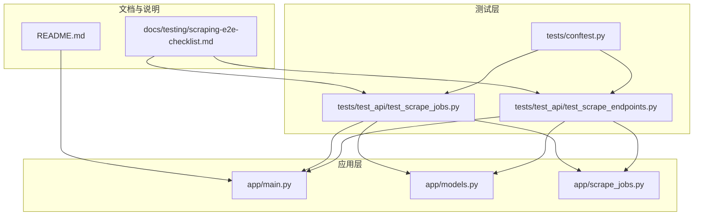
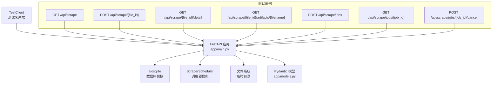
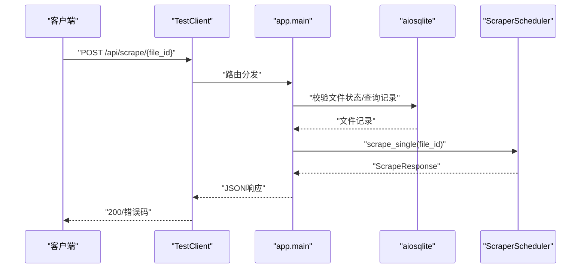
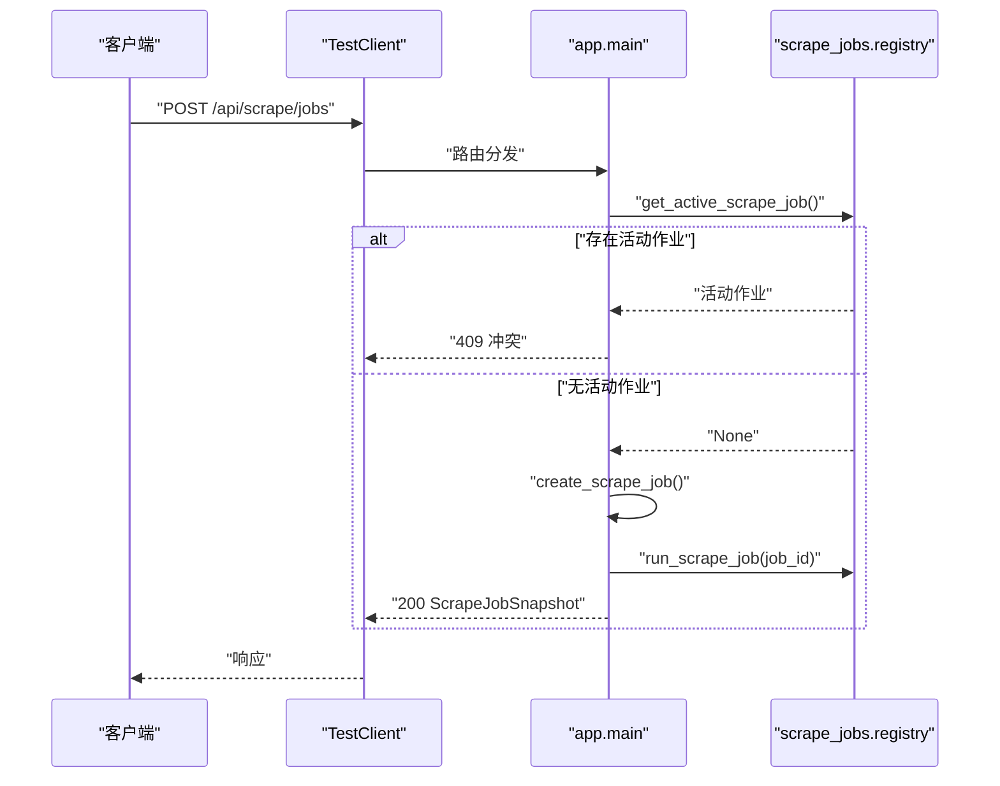
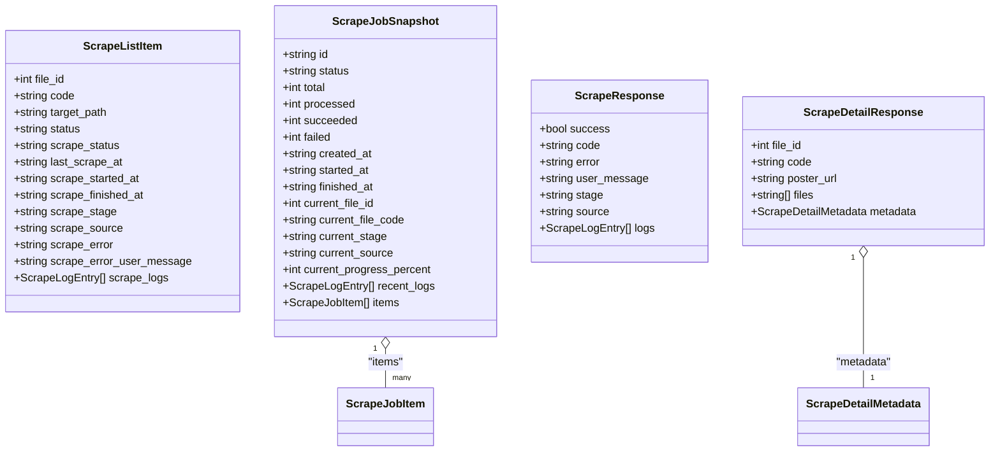
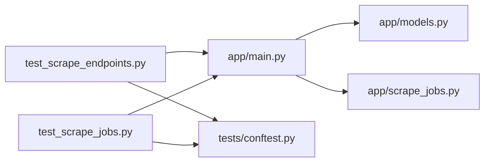

# API测试

<cite>
**本文引用的文件**
- [tests/test_api/test_scrape_endpoints.py](file://tests/test_api/test_scrape_endpoints.py)
- [tests/test_api/test_scrape_jobs.py](file://tests/test_api/test_scrape_jobs.py)
- [tests/conftest.py](file://tests/conftest.py)
- [app/main.py](file://app/main.py)
- [app/models.py](file://app/models.py)
- [app/scrape_jobs.py](file://app/scrape_jobs.py)
- [docs/testing/scraping-e2e-checklist.md](file://docs/testing/scraping-e2e-checklist.md)
- [README.md](file://README.md)
</cite>

## 目录
1. [引言](#引言)
2. [项目结构](#项目结构)
3. [核心组件](#核心组件)
4. [架构总览](#架构总览)
5. [详细组件分析](#详细组件分析)
6. [依赖分析](#依赖分析)
7. [性能考虑](#性能考虑)
8. [故障排查指南](#故障排查指南)
9. [结论](#结论)
10. [附录](#附录)

## 引言
本文件面向Noctra项目的API测试，聚焦于刮削端点与刮削作业的RESTful接口测试设计与实现方法。内容涵盖HTTP请求构造、响应验证与状态码检查策略；提供端到端测试用例编写思路与最佳实践；解释测试夹具、测试数据准备与测试环境配置；并给出性能与安全测试的通用方法论与落地建议。

## 项目结构
Noctra采用FastAPI作为后端框架，API测试集中在tests/test_api目录，配合共享测试夹具tests/conftest.py，以及被测业务模块app/main.py、app/models.py、app/scrape_jobs.py等。

**图表来源**
- [tests/test_api/test_scrape_endpoints.py:1-715](file://tests/test_api/test_scrape_endpoints.py#L1-L715)
- [tests/test_api/test_scrape_jobs.py:1-312](file://tests/test_api/test_scrape_jobs.py#L1-L312)
- [tests/conftest.py:1-20](file://tests/conftest.py#L1-L20)
- [app/main.py:1-1384](file://app/main.py#L1-L1384)
- [app/models.py:1-216](file://app/models.py#L1-L216)
- [app/scrape_jobs.py:1-256](file://app/scrape_jobs.py#L1-L256)
- [docs/testing/scraping-e2e-checklist.md:1-350](file://docs/testing/scraping-e2e-checklist.md#L1-L350)
- [README.md:1-322](file://README.md#L1-L322)

**章节来源**
- [tests/test_api/test_scrape_endpoints.py:1-715](file://tests/test_api/test_scrape_endpoints.py#L1-L715)
- [tests/test_api/test_scrape_jobs.py:1-312](file://tests/test_api/test_scrape_jobs.py#L1-L312)
- [tests/conftest.py:1-20](file://tests/conftest.py#L1-L20)
- [app/main.py:1-1384](file://app/main.py#L1-L1384)
- [app/models.py:1-216](file://app/models.py#L1-L216)
- [app/scrape_jobs.py:1-256](file://app/scrape_jobs.py#L1-L256)
- [docs/testing/scraping-e2e-checklist.md:1-350](file://docs/testing/scraping-e2e-checklist.md#L1-L350)
- [README.md:1-322](file://README.md#L1-L322)

## 核心组件
- 测试夹具与依赖隔离
  - 通过tests/conftest.py在导入阶段stub掉重型第三方依赖，确保API层测试无需加载真实爬虫网络栈，提升稳定性与速度。
- 刮削端点测试
  - 覆盖GET /api/scrape（过滤、排序、分页、统计）、GET /api/scrape/{file_id}/detail（NFO解析与文件枚举）、GET /api/scrape/{file_id}/artifacts/{filename}（工件流式返回）与POST /api/scrape/{file_id}（单文件刮削）。
- 刮削作业测试
  - 覆盖POST /api/scrape/jobs（创建并立即运行作业）、GET /api/scrape/jobs/{job_id}（作业快照）、POST /api/scrape/jobs/{job_id}/cancel（取消作业）及并发与终止态约束。
- 数据模型与响应契约
  - app/models.py定义ScrapeListItem、ScrapeJobSnapshot、ScrapeResponse、ScrapeDetailResponse等，测试围绕Pydantic模型字段进行严格校验。

**章节来源**
- [tests/conftest.py:1-20](file://tests/conftest.py#L1-L20)
- [tests/test_api/test_scrape_endpoints.py:1-715](file://tests/test_api/test_scrape_endpoints.py#L1-L715)
- [tests/test_api/test_scrape_jobs.py:1-312](file://tests/test_api/test_scrape_jobs.py#L1-L312)
- [app/models.py:103-216](file://app/models.py#L103-L216)

## 架构总览
下图展示了API测试与被测模块之间的关系：测试通过FastAPI TestClient驱动app/main.py路由，利用unittest.mock对数据库、调度器与文件系统进行隔离，从而稳定地验证HTTP请求、响应与状态码。

**图表来源**
- [app/main.py:1-1384](file://app/main.py#L1-L1384)
- [app/models.py:103-216](file://app/models.py#L103-L216)
- [tests/test_api/test_scrape_endpoints.py:1-715](file://tests/test_api/test_scrape_endpoints.py#L1-L715)
- [tests/test_api/test_scrape_jobs.py:1-312](file://tests/test_api/test_scrape_jobs.py#L1-L312)

## 详细组件分析

### 刮削端点测试策略
- GET /api/scrape
  - 参数验证：filter（all/pending/success/failed）、sort（code/scrape_time）、page/per_page。
  - 行为验证：正确返回total与items；按状态过滤、按字段排序、分页切片；返回dashboard统计。
  - 错误处理：无效filter/sort返回400；数据库异常返回500；空结果返回空items。
- GET /api/scrape/{file_id}/detail
  - 行为验证：返回poster_url、metadata（含plot/actors/release_date/runtime/tags）、files清单；NFO解析正确。
  - 边界处理：缺失文件返回合理错误；工件目录不存在时返回空列表或404。
- GET /api/scrape/{file_id}/artifacts/{filename}
  - 行为验证：流式返回指定文件内容；路径解析与安全校验（相对路径、禁止越界）。
- POST /api/scrape/{file_id}
  - 行为验证：成功返回ScrapeResponse.success=true；失败返回error；状态不符返回业务错误。
  - 错误处理：文件不存在、状态不符、调度器异常均需覆盖。

**图表来源**
- [tests/test_api/test_scrape_endpoints.py:503-562](file://tests/test_api/test_scrape_endpoints.py#L503-L562)
- [app/main.py:1-1384](file://app/main.py#L1-L1384)

**章节来源**
- [tests/test_api/test_scrape_endpoints.py:96-414](file://tests/test_api/test_scrape_endpoints.py#L96-L414)
- [tests/test_api/test_scrape_endpoints.py:416-497](file://tests/test_api/test_scrape_endpoints.py#L416-L497)
- [tests/test_api/test_scrape_endpoints.py:503-610](file://tests/test_api/test_scrape_endpoints.py#L503-L610)

### 刮削作业测试策略
- POST /api/scrape/jobs
  - 行为验证：无活动作业时创建并立即运行；有活动作业时返回409。
  - 数据契约：返回ScrapeJobSnapshot，包含进度、日志、当前文件与阶段。
- GET /api/scrape/jobs/{job_id}
  - 行为验证：返回作业快照；不存在返回404。
- POST /api/scrape/jobs/{job_id}/cancel
  - 行为验证：运行中可取消；已完成/失败不可取消；返回取消请求状态或不可取消提示。
- 并发与幂等
  - 单实例作业约束；进度百分比不回退；最近日志截断。

**图表来源**
- [tests/test_api/test_scrape_jobs.py:64-100](file://tests/test_api/test_scrape_jobs.py#L64-L100)
- [app/scrape_jobs.py:59-117](file://app/scrape_jobs.py#L59-L117)

**章节来源**
- [tests/test_api/test_scrape_jobs.py:64-224](file://tests/test_api/test_scrape_jobs.py#L64-L224)
- [app/scrape_jobs.py:146-256](file://app/scrape_jobs.py#L146-L256)

### 数据模型与字段校验
- 刮削列表项字段：file_id、code、target_path、status、scrape_status、last_scrape_at、scrape_started_at、scrape_finished_at、scrape_stage、scrape_source、scrape_error、scrape_error_user_message、scrape_logs。
- 作业快照字段：id、status、total、processed、succeeded、failed、created_at、started_at、finished_at、current_file_id、current_file_code、current_stage、current_source、current_progress_percent、recent_logs、items。
- 单文件刮削响应：success、code、error、user_message、stage、source、logs。
- 刮削详情响应：file_id、code、poster_url、files、metadata（code、plot、actors、release_date、runtime、tags）。

**图表来源**
- [app/models.py:115-216](file://app/models.py#L115-L216)

**章节来源**
- [app/models.py:115-216](file://app/models.py#L115-L216)

### HTTP请求构造与响应验证
- 请求构造
  - 使用fastapi.testclient.TestClient发起HTTP请求，设置必要查询参数（filter、sort、page、per_page）与JSON请求体（jobs创建）。
  - 使用unittest.mock.patch替换数据库连接、调度器类与文件系统访问，确保测试可重复且独立。
- 响应验证
  - 状态码断言：200成功、400参数错误、404资源不存在、409冲突、500服务器错误。
  - JSON结构断言：字段存在性、类型一致性、值范围与格式（如ISO时间戳）。
  - 特殊行为：日志数组容错（跳过非法条目）、进度百分比不回退、工件路径安全解析。
- 错误处理
  - 数据库异常捕获并返回500；
  - 业务异常（文件不存在、状态不符）以ScrapeResponse.error或JSON.detail形式返回。

**章节来源**
- [tests/test_api/test_scrape_endpoints.py:354-414](file://tests/test_api/test_scrape_endpoints.py#L354-L414)
- [tests/test_api/test_scrape_jobs.py:106-124](file://tests/test_api/test_scrape_jobs.py#L106-L124)

### 测试夹具与环境配置
- 依赖隔离
  - tests/conftest.py在sys.modules中注册轻量级Mock，屏蔽curl_cffi、aiofiles等重依赖，避免真实网络与IO影响测试稳定性。
- 数据库与调度器模拟
  - 使用unittest.mock.AsyncMock与MagicMock替换aiosqlite.connect、ScraperScheduler类，注入期望返回值与副作用。
- 临时文件系统
  - 使用pytest提供的tmp_path，创建隔离的临时目录与文件，模拟NFO与海报等工件。

**章节来源**
- [tests/conftest.py:1-20](file://tests/conftest.py#L1-L20)
- [tests/test_api/test_scrape_endpoints.py:416-497](file://tests/test_api/test_scrape_endpoints.py#L416-L497)
- [tests/test_api/test_scrape_jobs.py:64-100](file://tests/test_api/test_scrape_jobs.py#L64-L100)

### 端到端测试与回归
- E2E检查清单
  - 前端UI验证、API端点验证、NFO与海报产物验证、数据库状态更新、Emby集成验证、真实番号测试、边缘情况测试、自动化测试套件运行。
- 回归建议
  - 将E2E检查清单转化为可执行脚本，结合pytest与curl命令，形成持续集成中的回归测试步骤。

**章节来源**
- [docs/testing/scraping-e2e-checklist.md:1-350](file://docs/testing/scraping-e2e-checklist.md#L1-L350)

## 依赖分析
- 组件耦合
  - 测试对app/main.py路由强依赖；对数据库与调度器通过mock解耦；对文件系统通过tmp_path隔离。
- 外部依赖
  - aiosqlite（异步SQLite）、FastAPI（测试客户端）、Pydantic（模型校验）。
- 潜在循环依赖
  - 测试文件仅依赖app/main.py导出的FastAPI应用对象，无循环导入风险。

**图表来源**
- [tests/test_api/test_scrape_endpoints.py:1-715](file://tests/test_api/test_scrape_endpoints.py#L1-L715)
- [tests/test_api/test_scrape_jobs.py:1-312](file://tests/test_api/test_scrape_jobs.py#L1-L312)
- [tests/conftest.py:1-20](file://tests/conftest.py#L1-L20)
- [app/main.py:1-1384](file://app/main.py#L1-L1384)
- [app/models.py:1-216](file://app/models.py#L1-L216)
- [app/scrape_jobs.py:1-256](file://app/scrape_jobs.py#L1-L256)

**章节来源**
- [tests/test_api/test_scrape_endpoints.py:1-715](file://tests/test_api/test_scrape_endpoints.py#L1-L715)
- [tests/test_api/test_scrape_jobs.py:1-312](file://tests/test_api/test_scrape_jobs.py#L1-L312)
- [tests/conftest.py:1-20](file://tests/conftest.py#L1-L20)
- [app/main.py:1-1384](file://app/main.py#L1-L1384)
- [app/models.py:1-216](file://app/models.py#L1-L216)
- [app/scrape_jobs.py:1-256](file://app/scrape_jobs.py#L1-L256)

## 性能考虑
- 测试并发与锁
  - 刮削作业内部使用asyncio.Lock保护共享字典scrape_jobs，测试中应避免并发创建多个活动作业，确保单实例约束。
- 进度百分比单调性
  - run_scrape_job中通过_progress_percent不回退策略保证UI进度稳定，测试可用回调事件序列验证该特性。
- I/O与网络隔离
  - 通过conftest.py stub重依赖，避免真实HTTP请求与磁盘IO拖慢测试；对文件系统操作使用tmp_path。
- 响应体积与日志截断
  - 最近日志限制为固定数量，测试应验证截断行为与字段完整性。

**章节来源**
- [app/scrape_jobs.py:8-57](file://app/scrape_jobs.py#L8-L57)
- [app/scrape_jobs.py:146-256](file://app/scrape_jobs.py#L146-L256)
- [tests/conftest.py:1-20](file://tests/conftest.py#L1-L20)

## 故障排查指南
- 常见问题定位
  - 参数错误：filter/sort不在允许集合内导致400，检查查询参数拼写与取值范围。
  - 资源不存在：file_id或job_id不存在导致404，核对数据库记录与作业注册表。
  - 冲突状态：存在活动作业导致409，等待或取消后再试。
  - 数据库异常：aiosqlite连接失败导致500，检查DB_PATH与权限。
- 日志与可观测性
  - 刮削日志数组容错：非法条目会被跳过而非中断，测试中可构造混合数组验证。
  - 作业最近日志截断：超过阈值的日志会被截断，测试应验证长度与顺序。
- 端到端回归
  - 使用E2E检查清单逐项验证，结合curl与pytest，快速定位问题环节。

**章节来源**
- [tests/test_api/test_scrape_endpoints.py:354-414](file://tests/test_api/test_scrape_endpoints.py#L354-L414)
- [tests/test_api/test_scrape_jobs.py:106-124](file://tests/test_api/test_scrape_jobs.py#L106-L124)
- [app/main.py:242-259](file://app/main.py#L242-L259)
- [app/scrape_jobs.py:38-39](file://app/scrape_jobs.py#L38-L39)

## 结论
本文档系统化梳理了Noctra的API测试设计与实现要点，重点覆盖刮削端点与作业API的参数验证、响应契约、错误处理与并发约束。通过依赖隔离、模型驱动的字段校验与端到端检查清单，测试具备高稳定性与可维护性。建议在CI中引入E2E回归与性能基线，持续保障API质量。

## 附录
- 快速参考
  - 端点与方法：GET /api/scrape、POST /api/scrape/{file_id}、GET /api/scrape/{file_id}/detail、GET /api/scrape/{file_id}/artifacts/{filename}、POST /api/scrape/jobs、GET /api/scrape/jobs/{job_id}、POST /api/scrape/jobs/{job_id}/cancel。
  - 关键模型：ScrapeListItem、ScrapeJobSnapshot、ScrapeResponse、ScrapeDetailResponse。
  - 测试工具：TestClient、unittest.mock、pytest、tmp_path、conftest依赖隔离。

**章节来源**
- [README.md:301-322](file://README.md#L301-L322)
- [docs/testing/scraping-e2e-checklist.md:57-111](file://docs/testing/scraping-e2e-checklist.md#L57-L111)
- [app/models.py:115-216](file://app/models.py#L115-L216)