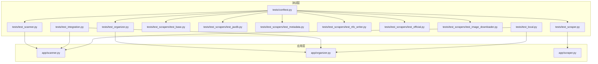
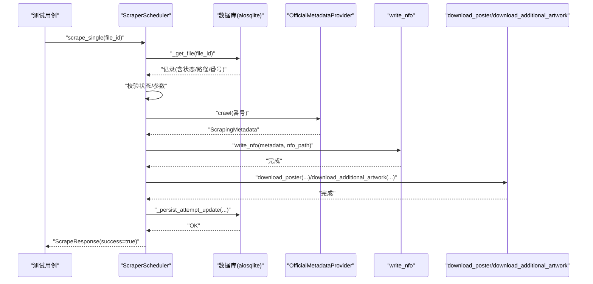
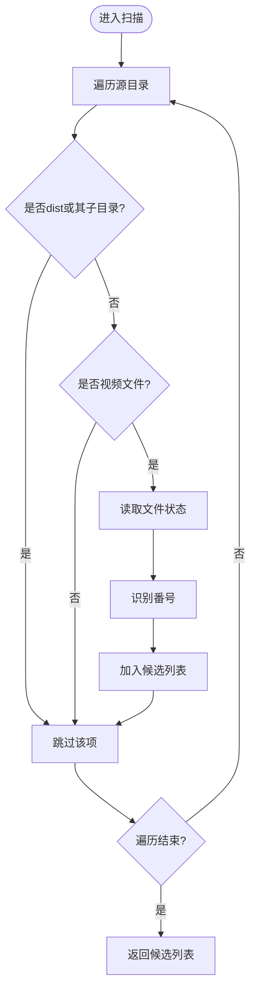
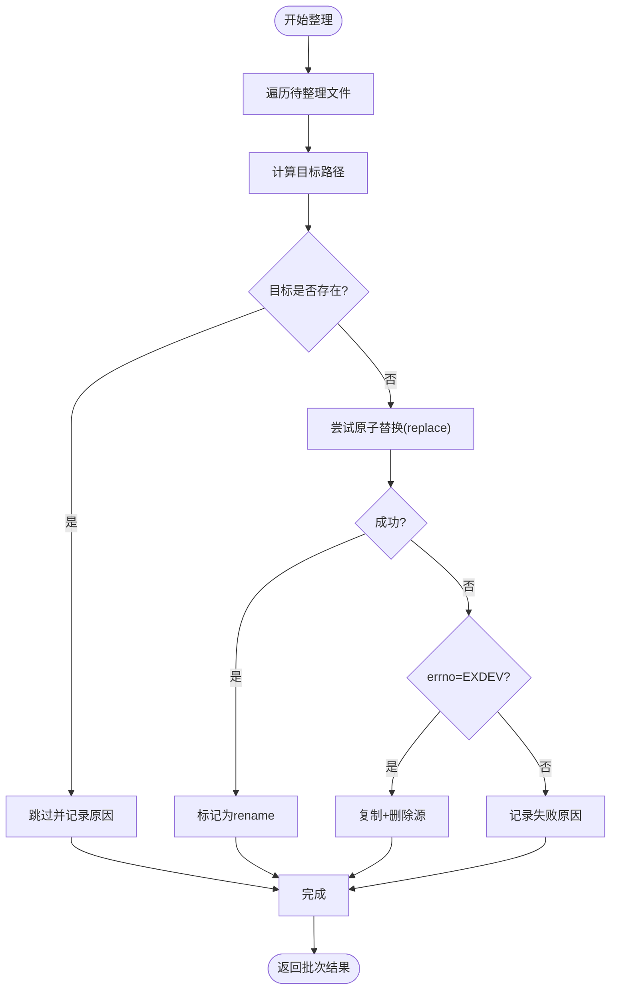
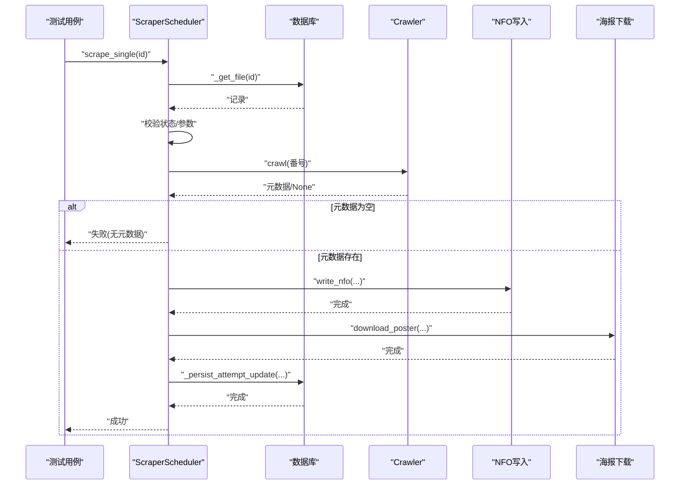
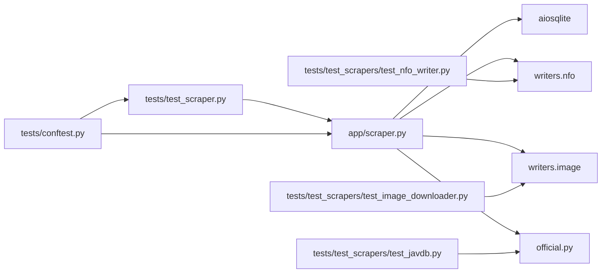

# 单元测试

<cite>
**本文引用的文件**
- [tests/conftest.py](file://tests/conftest.py)
- [tests/test_scanner.py](file://tests/test_scanner.py)
- [tests/test_organizer.py](file://tests/test_organizer.py)
- [tests/test_scraper.py](file://tests/test_scraper.py)
- [tests/test_scrapers/test_base.py](file://tests/test_scrapers/test_base.py)
- [tests/test_scrapers/test_javdb.py](file://tests/test_scrapers/test_javdb.py)
- [tests/test_scrapers/test_metadata.py](file://tests/test_scrapers/test_metadata.py)
- [tests/test_scrapers/test_nfo_writer.py](file://tests/test_scrapers/test_nfo_writer.py)
- [tests/test_scrapers/test_official.py](file://tests/test_scrapers/test_official.py)
- [tests/test_scrapers/test_image_downloader.py](file://tests/test_scrapers/test_image_downloader.py)
- [tests/test_integration.py](file://tests/test_integration.py)
- [tests/test_local.py](file://tests/test_local.py)
- [app/scanner.py](file://app/scanner.py)
- [app/organizer.py](file://app/organizer.py)
- [app/scraper.py](file://app/scraper.py)
- [requirements.txt](file://requirements.txt)
</cite>

## 目录
1. [引言](#引言)
2. [项目结构](#项目结构)
3. [核心组件](#核心组件)
4. [架构总览](#架构总览)
5. [详细组件分析](#详细组件分析)
6. [依赖分析](#依赖分析)
7. [性能考虑](#性能考虑)
8. [故障排查指南](#故障排查指南)
9. [结论](#结论)
10. [附录](#附录)

## 引言
本文件面向Noctra项目的单元测试体系，系统阐述设计原则、测试策略与实施方法，覆盖文件扫描器、文件整理器、刮削器及其子模块（元数据、NFO写入、海报下载、官方数据源）等核心组件。文档提供测试用例编写规范、模拟对象使用、断言策略、测试数据准备与环境隔离技术，并给出测试覆盖率与代码质量标准建议。

## 项目结构
Noctra的测试组织遵循按功能域分层与按模块拆分相结合的原则：
- tests/conftest.py：全局共享的测试配置，用于桩替重依赖以避免导入错误。
- tests/test_scanner.py：文件扫描器（JAVScanner）的完整测试集。
- tests/test_organizer.py：文件整理器（JAVOrganizer）的完整测试集。
- tests/test_scraper.py：刮削调度器（ScraperScheduler）的完整测试集。
- tests/test_scrapers/：子模块测试，包括基础爬虫、JavDB、元数据模型、NFO写入、官方数据源、海报下载等。
- tests/test_integration.py 与 tests/test_local.py：集成/本地演示型测试脚本，便于快速验证。

图表来源
- [tests/conftest.py:1-20](file://tests/conftest.py#L1-L20)
- [tests/test_scanner.py:1-500](file://tests/test_scanner.py#L1-L500)
- [tests/test_organizer.py:1-163](file://tests/test_organizer.py#L1-L163)
- [tests/test_scraper.py:1-597](file://tests/test_scraper.py#L1-L597)
- [tests/test_scrapers/test_javdb.py:1-549](file://tests/test_scrapers/test_javdb.py#L1-L549)
- [tests/test_scrapers/test_official.py:1-299](file://tests/test_scrapers/test_official.py#L1-L299)
- [tests/test_scrapers/test_nfo_writer.py:1-280](file://tests/test_scrapers/test_nfo_writer.py#L1-L280)
- [tests/test_scrapers/test_image_downloader.py:1-323](file://tests/test_scrapers/test_image_downloader.py#L1-L323)
- [tests/test_integration.py:1-141](file://tests/test_integration.py#L1-L141)
- [tests/test_local.py:1-141](file://tests/test_local.py#L1-L141)
- [app/scanner.py:1-161](file://app/scanner.py#L1-L161)
- [app/organizer.py:1-200](file://app/organizer.py#L1-L200)
- [app/scraper.py:1-200](file://app/scraper.py#L1-L200)

章节来源
- [tests/conftest.py:1-20](file://tests/conftest.py#L1-L20)
- [tests/test_scanner.py:1-500](file://tests/test_scanner.py#L1-L500)
- [tests/test_organizer.py:1-163](file://tests/test_organizer.py#L1-L163)
- [tests/test_scraper.py:1-597](file://tests/test_scraper.py#L1-L597)
- [tests/test_scrapers/test_javdb.py:1-549](file://tests/test_scrapers/test_javdb.py#L1-L549)
- [tests/test_scrapers/test_official.py:1-299](file://tests/test_scrapers/test_official.py#L1-L299)
- [tests/test_scrapers/test_nfo_writer.py:1-280](file://tests/test_scrapers/test_nfo_writer.py#L1-L280)
- [tests/test_scrapers/test_image_downloader.py:1-323](file://tests/test_scrapers/test_image_downloader.py#L1-L323)
- [tests/test_integration.py:1-141](file://tests/test_integration.py#L1-L141)
- [tests/test_local.py:1-141](file://tests/test_local.py#L1-L141)
- [app/scanner.py:1-161](file://app/scanner.py#L1-L161)
- [app/organizer.py:1-200](file://app/organizer.py#L1-L200)
- [app/scraper.py:1-200](file://app/scraper.py#L1-L200)

## 核心组件
- 文件扫描器（JAVScanner）：负责扫描源目录、识别番号、过滤非视频与dist目录、收集候选文件。
- 文件整理器（JAVOrganizer）：负责文件名规范化、目标路径计算、跨文件系统移动策略、批量整理。
- 刮削调度器（ScraperScheduler）：负责单文件刮削流程编排（校验、抓取、写NFO、下载海报、持久化），并提供阶段进度与用户消息映射。
- 子模块：
  - 元数据模型（ScrapingMetadata）：统一元数据结构与导出。
  - NFO写入器：生成Emby兼容XML。
  - 官方数据源（OfficialMetadataProvider）：整合DMM/Takara等站点。
  - 海报下载器：异步下载封面/剧照并裁剪。
  - JavDB爬虫：解析搜索与详情页。

章节来源
- [app/scanner.py:1-161](file://app/scanner.py#L1-L161)
- [app/organizer.py:1-200](file://app/organizer.py#L1-L200)
- [app/scraper.py:1-200](file://app/scraper.py#L1-L200)
- [tests/test_scanner.py:1-500](file://tests/test_scanner.py#L1-L500)
- [tests/test_organizer.py:1-163](file://tests/test_organizer.py#L1-L163)
- [tests/test_scraper.py:1-597](file://tests/test_scraper.py#L1-L597)

## 架构总览
以下序列图展示一次成功的单文件刮削流程，涵盖DB查询、校验、抓取、写NFO、下载海报与DB更新。

图表来源
- [tests/test_scraper.py:64-597](file://tests/test_scraper.py#L64-L597)
- [app/scraper.py:82-200](file://app/scraper.py#L82-L200)

## 详细组件分析

### 文件扫描器测试（JAVScanner）
- 设计原则
  - 边界与异常：空目录、dist目录跳过、非视频文件、非法路径。
  - 正则稳健性：多语言/多标记组合、大小写、前后缀清理。
  - 可重复性：使用临时目录与固定文件名，避免磁盘副作用。
- 测试策略
  - 使用构造函数参数注入源/目标根路径，避免真实IO。
  - 使用正则表达式匹配与手工构造样例，覆盖所有分支。
  - 使用临时目录与文件写入，断言扫描结果与状态。
- 关键断言
  - 识别结果与期望一致。
  - dist目录与子目录均被跳过。
  - 不同后缀（-C/-UC/C/UC/字幕版）归一化正确。
  - 同一番号不同后缀/扩展名的优先级与去重策略。
- 错误处理与边界
  - 非法输入返回None。
  - 不存在目录返回空列表。
  - 路径解析异常时跳过当前项。

图表来源
- [tests/test_scanner.py:189-221](file://tests/test_scanner.py#L189-L221)
- [app/scanner.py:67-125](file://app/scanner.py#L67-L125)

章节来源
- [tests/test_scanner.py:127-221](file://tests/test_scanner.py#L127-L221)
- [app/scanner.py:1-161](file://app/scanner.py#L1-L161)

### 文件整理器测试（JAVOrganizer）
- 设计原则
  - 文件名归一化：去除冗余标记、统一大小写、后缀标准化。
  - 路径安全：目标目录不存在时自动创建；目标已存在时拒绝覆盖。
  - 跨文件系统：EXDEV时回退为copy+delete并保证落盘。
- 测试策略
  - 使用tmp_path构造源/目标路径，断言rename/copy_delete行为。
  - 断言目标路径生成与文件名规范化。
  - 断言缺失源/目标存在的错误路径。
- 关键断言
  - get_filename_parts正确拆分番号/扩展名/后缀。
  - generate_filename生成符合规则的目标文件名。
  - move_file在同文件系统使用rename，在跨设备使用copy_delete。
  - organize返回包含move_method的批次结果。

图表来源
- [tests/test_organizer.py:73-163](file://tests/test_organizer.py#L73-L163)
- [app/organizer.py:98-163](file://app/organizer.py#L98-L163)

章节来源
- [tests/test_organizer.py:1-163](file://tests/test_organizer.py#L1-L163)
- [app/organizer.py:1-200](file://app/organizer.py#L1-L200)

### 刮削器测试（ScraperScheduler）
- 设计原则
  - 流程可观测：阶段事件、进度百分比、日志持久化。
  - 用户友好：阶段到用户消息映射，错误分类清晰。
  - 可测试性：大量异步调用通过mock解耦，参数化SQL验证。
- 测试策略
  - 使用AsyncMock与patch对数据库、爬虫、NFO写入、海报下载进行桩替。
  - 参数化用例覆盖成功路径、失败路径、异常路径与边界条件。
  - 断言阶段事件顺序、进度百分比、最终日志与DB持久化字段。
- 关键断言
  - 成功路径：返回success=true，stage=success，source=official。
  - 失败路径：错误映射到用户消息，stage定位到具体阶段。
  - 参数化SQL：仅持久化允许字段，占位符正确。
  - NFO与海报命名：基于媒体文件stem，包含-C/-UC后缀。
- 错误处理与边界
  - 文件不存在、状态不符、无target_path/identified_code等前置条件校验。
  - 爬虫返回None、NFO写入失败、海报下载异常等阶段失败。
  - 数据库异常（锁/不可用）映射为未知错误。

图表来源
- [tests/test_scraper.py:64-597](file://tests/test_scraper.py#L64-L597)
- [app/scraper.py:82-200](file://app/scraper.py#L82-L200)

章节来源
- [tests/test_scraper.py:1-597](file://tests/test_scraper.py#L1-L597)
- [app/scraper.py:1-200](file://app/scraper.py#L1-L200)

### 子模块测试

#### 基础爬虫（BaseCrawler）
- 目标：禁止直接实例化抽象类，确保继承实现。
- 断言：实例化抛出TypeError。

章节来源
- [tests/test_scrapers/test_base.py:1-11](file://tests/test_scrapers/test_base.py#L1-L11)

#### JavDB爬虫
- 目标：搜索/详情页解析、字段提取、国际化标签、代码归一化、URL提取。
- 测试策略：构造HTML片段，mock异步请求，断言ScrapingMetadata字段。
- 关键断言：搜索结果匹配、详情页字段齐全、缺失字段默认值、英文/中文标签解析、释放日期归一化、封面URL提取。

章节来源
- [tests/test_scrapers/test_javdb.py:1-549](file://tests/test_scrapers/test_javdb.py#L1-L549)

#### 元数据模型（ScrapingMetadata）
- 目标：创建与to_dict导出，支持自定义base_name对齐文件stem。
- 断言：字段存在、默认值、base_name影响海报/剧照命名。

章节来源
- [tests/test_scrapers/test_metadata.py:1-54](file://tests/test_scrapers/test_metadata.py#L1-L54)

#### NFO写入器
- 目标：生成Emby兼容XML，CDATA包裹plot，actor/genre/tag多重标签，UC/中字等语义标签。
- 测试策略：解析XML树，断言节点存在与文本内容；断言空字段与特殊字符处理。
- 关键断言：XML声明、根元素、多演员、CDATA、空字段、UC/中字标签、自定义base_name。

章节来源
- [tests/test_scrapers/test_nfo_writer.py:1-280](file://tests/test_scrapers/test_nfo_writer.py#L1-L280)

#### 官方数据源（OfficialMetadataProvider）
- 目标：DMM/Takara站点解析、代码变体归一化、封面URL校验、LLM翻译融合。
- 测试策略：mock异步HTTP请求，断言提取字段与合并策略。
- 关键断言：代码变体集合、确定性字段提取、封面URL优先级、LLM翻译拒绝与合并保留。

章节来源
- [tests/test_scrapers/test_official.py:1-299](file://tests/test_scrapers/test_official.py#L1-L299)

#### 海报下载器
- 目标：异步下载海报/剧照、代理支持、SSL宽松、裁剪海报、进度事件。
- 测试策略：构建aiohttp会话mock，断言请求头、代理、写入路径与异常传播。
- 关键断言：浏览器请求头、代理设置、chunked写入、mkdir自动创建、异常类型传播、裁剪结果。

章节来源
- [tests/test_scrapers/test_image_downloader.py:1-323](file://tests/test_scrapers/test_image_downloader.py#L1-L323)

## 依赖分析
- 测试隔离
  - 通过conftest.py在收集阶段stub第三方重依赖（curl_cffi、aiofiles），避免导入错误与外部网络。
- 组件耦合
  - ScraperScheduler与aiosqlite、NFO写入器、海报下载器、官方爬虫强耦合；通过mock解耦，便于单元测试。
- 外部依赖
  - lxml、beautifulsoup4用于HTML解析；aiohttp、aiofiles用于异步下载；Pillow用于图像处理。

图表来源
- [tests/test_scraper.py:1-597](file://tests/test_scraper.py#L1-L597)
- [tests/test_scrapers/test_nfo_writer.py:1-280](file://tests/test_scrapers/test_nfo_writer.py#L1-L280)
- [tests/test_scrapers/test_image_downloader.py:1-323](file://tests/test_scrapers/test_image_downloader.py#L1-L323)
- [tests/test_scrapers/test_javdb.py:1-549](file://tests/test_scrapers/test_javdb.py#L1-L549)
- [tests/conftest.py:1-20](file://tests/conftest.py#L1-L20)
- [app/scraper.py:1-200](file://app/scraper.py#L1-L200)

章节来源
- [tests/conftest.py:1-20](file://tests/conftest.py#L1-L20)
- [requirements.txt:1-12](file://requirements.txt#L1-L12)

## 性能考虑
- 异步I/O：爬取、下载、写文件均采用异步，测试中通过mock控制执行路径，避免真实网络/磁盘开销。
- 内存与流式：海报下载使用chunked迭代器，测试中验证写入完整性与目录创建。
- 并发与重试：官方数据源对图片URL校验支持重试，测试中模拟TLS握手失败后重试成功。
- 日志与持久化：阶段日志上限限制，避免内存膨胀；参数化SQL减少拼接风险。

## 故障排查指南
- 导入错误
  - 症状：第三方库（curl_cffi、aiofiles）未安装导致导入失败。
  - 处理：使用conftest.py在sys.modules中注册Mock，避免导入。
- 网络/代理问题
  - 症状：下载失败、超时、Cloudflare拦截。
  - 处理：测试中通过patch模拟响应与异常，断言用户消息映射。
- 文件系统问题
  - 症状：EXDEV跨设备、权限不足、磁盘空间。
  - 处理：测试中通过monkeypatch/os.replace模拟EXDEV，断言fallback路径。
- 数据库问题
  - 症状：数据库锁定、连接失败。
  - 处理：测试中通过AsyncMock抛出异常，断言未知错误映射。

章节来源
- [tests/conftest.py:1-20](file://tests/conftest.py#L1-L20)
- [tests/test_organizer.py:116-137](file://tests/test_organizer.py#L116-L137)
- [tests/test_scraper.py:240-461](file://tests/test_scraper.py#L240-L461)

## 结论
Noctra的单元测试体系以“可测试性优先”为核心，通过mock与参数化用例覆盖关键流程与边界条件，确保扫描、整理、刮削三大链路的稳定性与可维护性。建议持续完善覆盖率与质量门禁，结合CI自动化执行，保障发布质量。

## 附录

### 测试用例编写规范
- 命名规范：test_xxx_功能_场景，如test_successful_scrape_flow。
- 参数化：同一场景多用例使用pytest.mark.parametrize或循环构造。
- 断言策略：优先断言结果与副作用（文件存在/日志/DB字段），其次断言调用次数与参数。
- 异常断言：明确捕获异常类型与消息，避免宽泛断言。

### 模拟对象使用
- AsyncMock：用于异步函数与上下文管理器。
- patch：替换模块级对象（如write_nfo、download_poster、OfficialMetadataProvider）。
- monkeypatch：修改内置行为（如os.replace）以触发特定分支。

### 断言策略
- 结果断言：返回值、文件内容、日志结构。
- 行为断言：调用次数、调用参数、异常类型。
- 状态断言：DB字段、文件系统状态、路径存在性。

### 测试数据准备与环境隔离
- 临时目录：使用pytest tmp_path或tempfile.TemporaryDirectory，确保测试隔离。
- 环境变量：通过patch.dict设置代理、LLM开关等。
- 依赖桩：conftest.py统一stub重依赖，避免真实网络与第三方库。

### 测试覆盖率与代码质量标准
- 覆盖率建议
  - 关键模块（扫描/整理/刮削）行覆盖率≥80%，分支覆盖率≥60%。
  - 子模块（NFO/海报/官方数据源/JavDB）行覆盖率≥70%。
- 质量标准
  - 无TODO/FIXME注释；单测命名清晰、断言明确；避免魔法数字与字符串硬编码；保持测试独立与可重复。