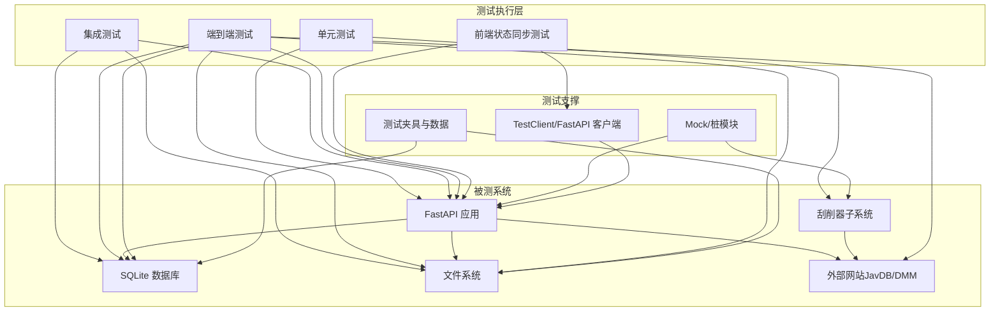
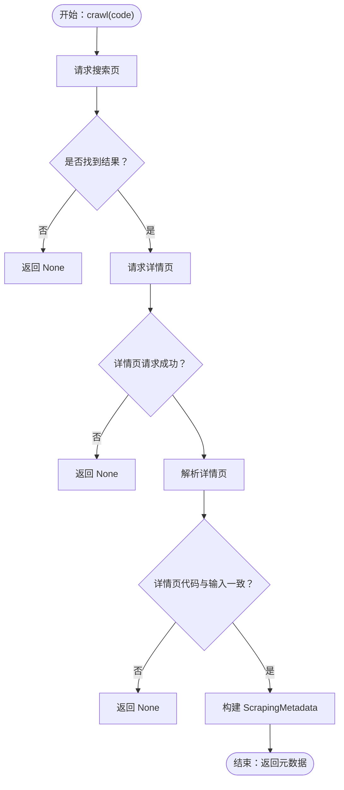
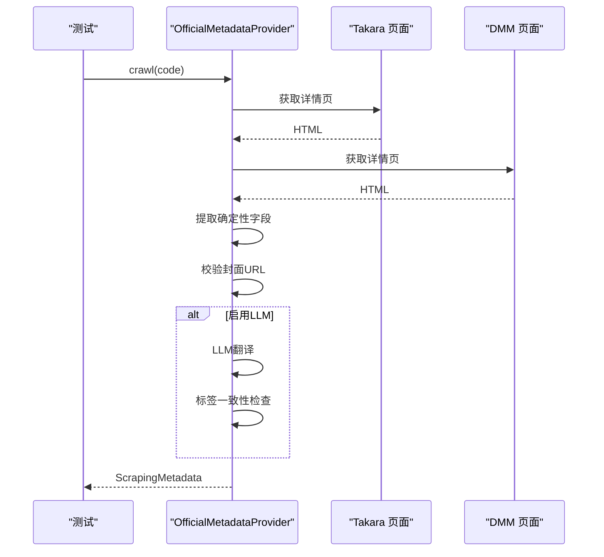
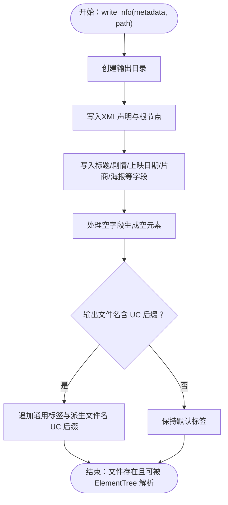
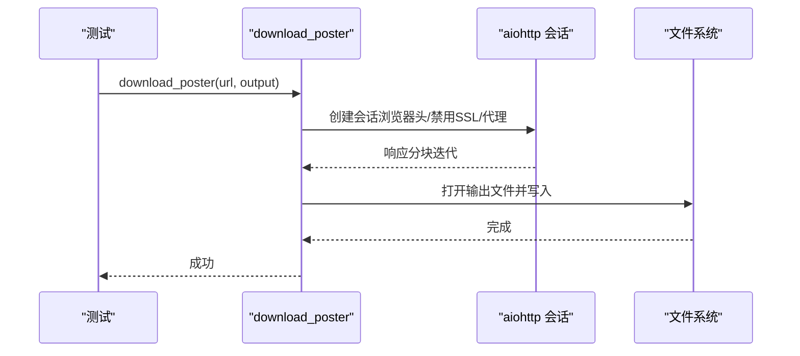
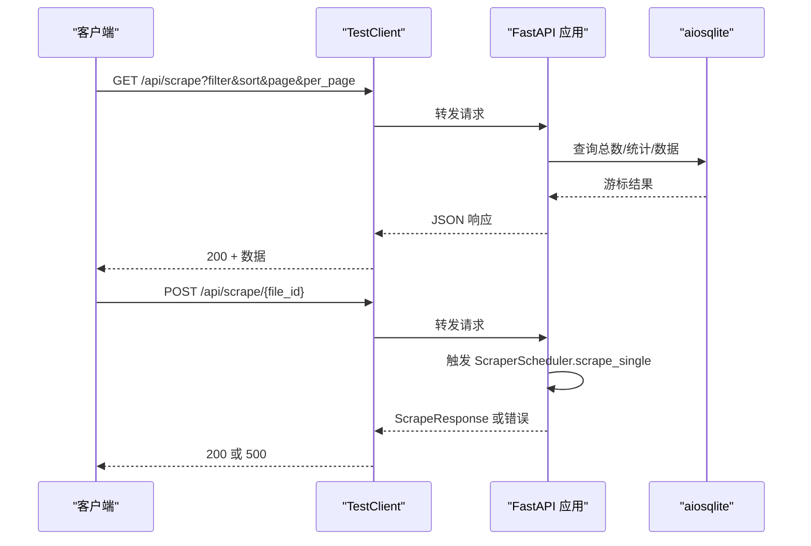
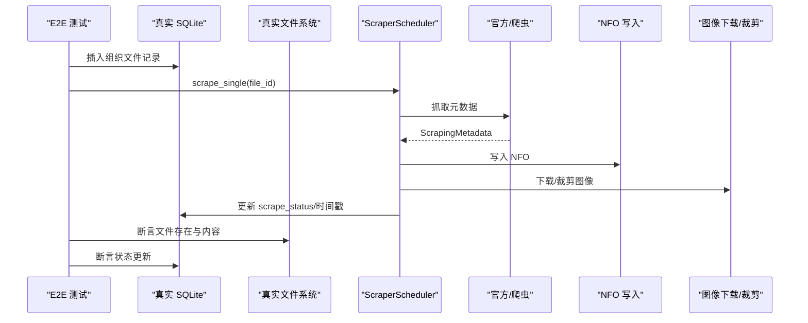
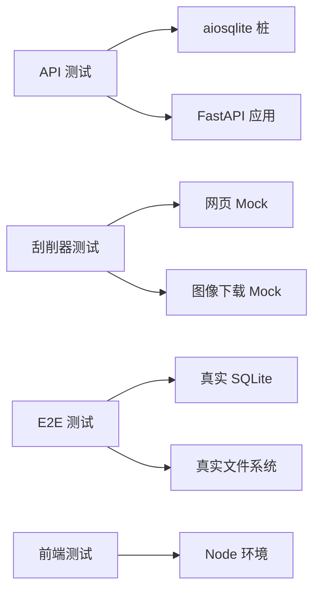

# 测试指南

<cite>
**本文引用的文件**   
- [tests/conftest.py](file://tests/conftest.py)
- [tests/test_api/test_scrape_endpoints.py](file://tests/test_api/test_scrape_endpoints.py)
- [tests/test_e2e/test_scraping_flow.py](file://tests/test_e2e/test_scraping_flow.py)
- [tests/test_scrapers/test_javdb.py](file://tests/test_scrapers/test_javdb.py)
- [tests/test_scrapers/test_metadata.py](file://tests/test_scrapers/test_metadata.py)
- [tests/test_scrapers/test_base.py](file://tests/test_scrapers/test_base.py)
- [tests/test_scrapers/test_nfo_writer.py](file://tests/test_scrapers/test_nfo_writer.py)
- [tests/test_scrapers/test_official.py](file://tests/test_scrapers/test_official.py)
- [tests/test_scrapers/test_image_downloader.py](file://tests/test_scrapers/test_image_downloader.py)
- [tests/test_integration.py](file://tests/test_integration.py)
- [tests/test_frontend_state_sync.py](file://tests/test_frontend_state_sync.py)
- [tests/test_local.py](file://tests/test_local.py)
- [.github/workflows/docker-publish.yml](file://.github/workflows/docker-publish.yml)
- [docs/testing/scraping-e2e-checklist.md](file://docs/testing/scraping-e2e-checklist.md)
</cite>

## 目录
1. [引言](#引言)
2. [项目结构](#项目结构)
3. [核心组件](#核心组件)
4. [架构总览](#架构总览)
5. [详细组件分析](#详细组件分析)
6. [依赖关系分析](#依赖关系分析)
7. [性能考量](#性能考量)
8. [故障排查指南](#故障排查指南)
9. [结论](#结论)
10. [附录](#附录)

## 引言
本测试指南系统性阐述 Noctra 的测试体系，覆盖单元测试、集成测试与端到端测试（E2E）的设计理念与实施方法。文档重点包括：
- 刮削功能测试：JavDB 爬虫、官方元数据源、NFO 写入、海报下载与裁剪等
- API 测试：FastAPI 接口行为验证、参数校验、错误处理与响应模型一致性
- UI 测试：前端状态同步、批处理面板交互、排序与筛选逻辑
- 测试数据准备与环境配置：数据库、文件系统、外部 HTTP 调用的模拟策略
- 测试覆盖率与持续集成：CI 配置与测试报告分析建议
- 测试驱动开发（TDD）最佳实践与质量保证流程

## 项目结构
测试相关目录与文件组织如下：
- tests：统一的测试套件，按功能域划分（API、刮削器、E2E、前端、集成）
- tests/conftest.py：共享测试配置，用于导入期依赖替换与桩模块
- docs/testing：测试相关文档，如 E2E 检查清单
- .github/workflows：持续集成工作流（容器发布）

```mermaid
graph TB
subgraph "测试套件"
T_API["API 测试<br/>tests/test_api/*"]
T_SCRAPERS["刮削器测试<br/>tests/test_scrapers/*"]
T_E2E["端到端测试<br/>tests/test_e2e/*"]
T_FRONTEND["前端状态同步测试<br/>tests/test_frontend_state_sync.py"]
T_INTEGRATION["集成测试<br/>tests/test_integration.py"]
T_LOCAL["本地测试脚本<br/>tests/test_local.py"]
end
subgraph "共享配置"
CONF["共享配置<br/>tests/conftest.py"]
end
subgraph "文档"
DOC_CHECKLIST["E2E 检查清单<br/>docs/testing/scraping-e2e-checklist.md"]
end
subgraph "CI"
CI["容器发布工作流<br/>.github/workflows/docker-publish.yml"]
end
CONF --> T_API
CONF --> T_SCRAPERS
CONF --> T_E2E
CONF --> T_FRONTEND
CONF --> T_INTEGRATION
CONF --> T_LOCAL
CI --> T_API
CI --> T_SCRAPERS
CI --> T_E2E
CI --> T_FRONTEND
CI --> T_INTEGRATION
CI --> T_LOCAL
```

**图示来源**
- [tests/conftest.py:1-20](file://tests/conftest.py#L1-L20)
- [tests/test_api/test_scrape_endpoints.py:1-715](file://tests/test_api/test_scrape_endpoints.py#L1-L715)
- [tests/test_e2e/test_scraping_flow.py:1-1194](file://tests/test_e2e/test_scraping_flow.py#L1-L1194)
- [tests/test_scrapers/test_javdb.py:1-549](file://tests/test_scrapers/test_javdb.py#L1-L549)
- [tests/test_frontend_state_sync.py:1-1339](file://tests/test_frontend_state_sync.py#L1-L1339)
- [tests/test_integration.py:1-141](file://tests/test_integration.py#L1-L141)
- [.github/workflows/docker-publish.yml](file://.github/workflows/docker-publish.yml)

**章节来源**
- [tests/conftest.py:1-20](file://tests/conftest.py#L1-L20)
- [tests/test_api/test_scrape_endpoints.py:1-715](file://tests/test_api/test_scrape_endpoints.py#L1-L715)
- [tests/test_e2e/test_scraping_flow.py:1-1194](file://tests/test_e2e/test_scraping_flow.py#L1-L1194)
- [tests/test_scrapers/test_javdb.py:1-549](file://tests/test_scrapers/test_javdb.py#L1-L549)
- [tests/test_frontend_state_sync.py:1-1339](file://tests/test_frontend_state_sync.py#L1-L1339)
- [tests/test_integration.py:1-141](file://tests/test_integration.py#L1-L141)
- [.github/workflows/docker-publish.yml](file://.github/workflows/docker-publish.yml)

## 核心组件
- 共享测试配置（conftest）
  - 在导入阶段替换第三方重依赖（如 curl_cffi、aiofiles），避免在 API 层测试中加载真实爬虫与文件系统库，提升导入稳定性与测试启动速度
- API 测试（FastAPI）
  - 验证 /api/scrape 列表接口的过滤、排序、分页、统计聚合与错误处理
  - 验证 /api/scrape/{file_id} 的刮削触发与返回模型一致性
  - 验证 /api/scrape/{file_id}/detail 与 /api/scrape/{file_id}/artifacts 的静态资源访问
- 刮削器测试
  - JavDB 爬虫：搜索/详情页解析、字段提取、国际化标签适配、代码规范化与匹配容错
  - 官方元数据提供者：多源合并、封面校验、LLM 翻译与评分投票保留策略
  - NFO 写入：Emby/Kodi 兼容 XML 结构、CDATA 处理、空字段与 UC 后缀规则
  - 图像下载：海报下载、代理与 SSL 设置、扇面与预览下载、海报从扇面裁剪
- 端到端测试（E2E）
  - 使用真实 SQLite 数据库与文件系统，模拟完整刮削流水线：DB 记录 → 爬取 → NFO/海报生成 → DB 更新
  - 验证 NFO 格式与 Emby 兼容性、批量刮削进度与 UI 显示
- 前端状态同步测试
  - Node 环境下执行前端 JS 模块，验证刷新后缓存失效、视图切换、批处理面板状态、排序优先级与 UI 样式标记
- 集成测试
  - 扫描与整理逻辑：番号识别、文件名生成、扫描状态判定

**章节来源**
- [tests/conftest.py:1-20](file://tests/conftest.py#L1-L20)
- [tests/test_api/test_scrape_endpoints.py:1-715](file://tests/test_api/test_scrape_endpoints.py#L1-L715)
- [tests/test_scrapers/test_javdb.py:1-549](file://tests/test_scrapers/test_javdb.py#L1-L549)
- [tests/test_scrapers/test_official.py:1-299](file://tests/test_scrapers/test_official.py#L1-L299)
- [tests/test_scrapers/test_nfo_writer.py:1-280](file://tests/test_scrapers/test_nfo_writer.py#L1-L280)
- [tests/test_scrapers/test_image_downloader.py:1-323](file://tests/test_scrapers/test_image_downloader.py#L1-L323)
- [tests/test_e2e/test_scraping_flow.py:1-1194](file://tests/test_e2e/test_scraping_flow.py#L1-L1194)
- [tests/test_frontend_state_sync.py:1-1339](file://tests/test_frontend_state_sync.py#L1-L1339)
- [tests/test_integration.py:1-141](file://tests/test_integration.py#L1-L141)

## 架构总览
测试架构围绕“隔离外部依赖 + 模拟真实数据层”的原则设计，确保：
- 单元测试专注于函数/类的行为与边界条件
- 集成测试验证模块间协作与数据一致性
- 端到端测试覆盖真实数据库与文件系统，验证完整业务闭环



**图示来源**
- [tests/test_api/test_scrape_endpoints.py:1-715](file://tests/test_api/test_scrape_endpoints.py#L1-L715)
- [tests/test_e2e/test_scraping_flow.py:1-1194](file://tests/test_e2e/test_scraping_flow.py#L1-L1194)
- [tests/test_scrapers/test_javdb.py:1-549](file://tests/test_scrapers/test_javdb.py#L1-L549)
- [tests/test_frontend_state_sync.py:1-1339](file://tests/test_frontend_state_sync.py#L1-L1339)

## 详细组件分析

### 刮削功能测试

#### JavDB 爬虫测试
- 行为要点
  - 成功抓取：搜索页命中后进入详情页解析，提取标题、剧集、演员、片商、简介、封面等字段
  - 国际化标签适配：支持繁体中文与英文标签键位
  - 代码规范化：去除空格、处理连字符拆分渲染
  - 错误与缺失字段：搜索无结果、详情请求失败、详情页代码不一致时返回 None；缺失字段使用默认值
- 关键断言
  - 返回 ScrapingMetadata 实例且字段完整
  - 解析失败时返回 None
  - 释放日期标准化
  - 详情链接提取与大小写不敏感匹配



**图示来源**
- [tests/test_scrapers/test_javdb.py:1-549](file://tests/test_scrapers/test_javdb.py#L1-L549)

**章节来源**
- [tests/test_scrapers/test_javdb.py:1-549](file://tests/test_scrapers/test_javdb.py#L1-L549)

#### 官方元数据提供者测试
- 行为要点
  - 多源提取：从 Takara 与 DMM 页面抽取确定性字段，合并为最终元数据
  - 封面校验：优先使用数字 CID 的数字版封面，规避“印刷中”占位图
  - LLM 翻译：可选启用，拒绝 LLM 拒绝与标签不一致的结果
  - 评分与投票保留：优先保留确定性来源的评分与投票
- 关键断言
  - 未启用 LLM 时仍能正确返回基础元数据
  - 封面 URL 校验顺序与占位图过滤
  - 翻译应用仅更新展示字段
  - 评分与投票来自确定性源



**图示来源**
- [tests/test_scrapers/test_official.py:1-299](file://tests/test_scrapers/test_official.py#L1-L299)

**章节来源**
- [tests/test_scrapers/test_official.py:1-299](file://tests/test_scrapers/test_official.py#L1-L299)

#### NFO 写入测试
- 行为要点
  - Emby/Kodi 兼容：根元素为 movie，包含 title、plot（CDATA）、actors、premiered、studio、poster 等
  - 空字段处理：空值生成空元素而非缺失
  - UC 后缀：当输出文件名为 UC 形式时，自动为派生文件名添加 UC 后缀
  - 标签增强：自动追加“中字”“无码破解”等通用标签
- 关键断言
  - XML 声明与 standalone
  - 所有 7 个核心字段存在
  - 特殊字符安全（CDATA）
  - UC 场景下的派生文件名与标签扩展



**图示来源**
- [tests/test_scrapers/test_nfo_writer.py:1-280](file://tests/test_scrapers/test_nfo_writer.py#L1-L280)

**章节来源**
- [tests/test_scrapers/test_nfo_writer.py:1-280](file://tests/test_scrapers/test_nfo_writer.py#L1-L280)

#### 图像下载与裁剪测试
- 行为要点
  - 海报下载：使用浏览器头与禁用 SSL 校验，支持 HTTPS_PROXY 环境变量
  - 扇面与预览下载：按序下载并记录进度事件
  - 海报裁剪：从扇面右半区裁剪为竖向海报
- 关键断言
  - 请求头与连接器配置
  - 代理设置生效
  - 下载数据写入文件
  - 裁剪尺寸与像素分布



**图示来源**
- [tests/test_scrapers/test_image_downloader.py:1-323](file://tests/test_scrapers/test_image_downloader.py#L1-L323)

**章节来源**
- [tests/test_scrapers/test_image_downloader.py:1-323](file://tests/test_scrapers/test_image_downloader.py#L1-L323)

### API 测试
- 行为要点
  - 列表接口：支持 filter（all/pending/success/failed）、sort（code/scrape_time）、分页、统计聚合
  - 详情与资源：/api/scrape/{file_id}/detail 返回 NFO 与文件列表；/api/scrape/{file_id}/artifacts 返回静态资源
  - 触发刮削：POST /api/scrape/{file_id} 返回 ScrapeResponse，错误路径返回 500
  - 参数校验：无效 filter/sort 返回 400
  - 数据库异常：DB 连接丢失返回 500
- 关键断言
  - 响应字段完整性与类型
  - 统计聚合与排序正确性
  - 错误路径与异常传播



**图示来源**
- [tests/test_api/test_scrape_endpoints.py:1-715](file://tests/test_api/test_scrape_endpoints.py#L1-L715)

**章节来源**
- [tests/test_api/test_scrape_endpoints.py:1-715](file://tests/test_api/test_scrape_endpoints.py#L1-L715)

### 端到端测试（E2E）
- 行为要点
  - 使用真实 SQLite 数据库与文件系统，插入组织文件记录，调用 ScraperScheduler 执行完整刮削流程
  - 验证 NFO 内容与 Emby 兼容性（XML 解析、CDATA、字段齐全）
  - 验证海报与扇面下载、海报从扇面裁剪
  - 验证 DB 状态更新（scrape_status、last_scrape_at 等）
- 关键断言
  - NFO 文件存在且内容正确
  - 海报/扇面文件存在且非空
  - DB 记录状态变更与时间戳更新
  - 多文件独立刮削互不影响



**图示来源**
- [tests/test_e2e/test_scraping_flow.py:1-1194](file://tests/test_e2e/test_scraping_flow.py#L1-L1194)

**章节来源**
- [tests/test_e2e/test_scraping_flow.py:1-1194](file://tests/test_e2e/test_scraping_flow.py#L1-L1194)

### 前端状态同步测试
- 行为要点
  - 在 Node 环境下加载前端 JS 模块（state.js、render.js、features.js），模拟 fetch 与 DOM 行为
  - 验证刷新后刮削缓存失效、视图切换、批处理面板展开/收起、排序优先级与 UI 样式
- 关键断言
  - 刷新后 scrapeLoaded 状态与加载次数
  - 刮削成功行的“重新刮削”动作可用
  - 批处理面板的进度文本与图标
  - UI 标记与样式类存在

**章节来源**
- [tests/test_frontend_state_sync.py:1-1339](file://tests/test_frontend_state_sync.py#L1-L1339)

### 集成测试（扫描与整理）
- 行为要点
  - 扫描：识别番号（支持多种变体与后缀）
  - 整理：根据番号与原始文件名生成目标文件名（含 UC 后缀）
  - 状态：根据目标文件是否存在与代码识别情况判定扫描状态
- 关键断言
  - 番号识别覆盖多种格式
  - 文件名生成符合预期
  - 状态判定准确

**章节来源**
- [tests/test_integration.py:1-141](file://tests/test_integration.py#L1-L141)
- [tests/test_local.py:1-141](file://tests/test_local.py#L1-L141)

## 依赖关系分析
- 测试耦合与内聚
  - API 测试对 aiosqlite 连接进行异步桩，降低对真实数据库的耦合
  - 刮削器测试通过 Mock 爬取页面与外部服务，确保单元测试稳定
  - E2E 测试直接使用真实数据库与文件系统，耦合度高但覆盖面广
- 外部依赖与模拟
  - conftest 中替换 curl_cffi/aiofiles，避免导入期失败
  - FastAPI 测试使用 TestClient，减少服务器启动成本
- 可能的循环依赖
  - 测试文件之间无直接循环导入；各测试模块聚焦单一职责，内聚性良好



**图示来源**
- [tests/conftest.py:1-20](file://tests/conftest.py#L1-L20)
- [tests/test_api/test_scrape_endpoints.py:1-715](file://tests/test_api/test_scrape_endpoints.py#L1-L715)
- [tests/test_e2e/test_scraping_flow.py:1-1194](file://tests/test_e2e/test_scraping_flow.py#L1-L1194)
- [tests/test_frontend_state_sync.py:1-1339](file://tests/test_frontend_state_sync.py#L1-L1339)

**章节来源**
- [tests/conftest.py:1-20](file://tests/conftest.py#L1-L20)
- [tests/test_api/test_scrape_endpoints.py:1-715](file://tests/test_api/test_scrape_endpoints.py#L1-L715)
- [tests/test_e2e/test_scraping_flow.py:1-1194](file://tests/test_e2e/test_scraping_flow.py#L1-L1194)
- [tests/test_frontend_state_sync.py:1-1339](file://tests/test_frontend_state_sync.py#L1-L1339)

## 性能考量
- 导入期优化
  - 通过 conftest 替换重依赖，缩短测试导入时间，提升整体测试启动效率
- I/O 与网络
  - 刮削器测试使用 Mock HTTP 响应与分块迭代，避免真实网络与磁盘 I/O
  - E2E 测试在临时目录与内存数据库上运行，减少持久化开销
- 并发与异步
  - 刮削器与 API 测试广泛使用 AsyncMock/AsyncGenerator，确保异步路径可测
- 建议
  - 对高频测试（如 NFO 写入）可考虑复用临时目录以减少重复创建
  - 对网络相关测试（图像下载）建议增加超时与重试策略的断言

[本节为通用指导，无需特定文件引用]

## 故障排查指南
- API 测试常见问题
  - 参数校验失败：确认 filter/sort 值在允许集合内
  - 数据库错误：检查 aiosqlite 连接与异常抛出路径
  - 资源不存在：确认 /api/scrape/{file_id}/artifacts 的文件路径与权限
- 刮削器测试常见问题
  - 爬取失败：检查 Mock HTML 是否与页面结构一致，注意大小写与标签键位
  - NFO 不兼容：确认 XML 声明、CDATA、字段齐全
  - 图像下载失败：检查代理配置、SSL 设置与网络异常
- E2E 测试常见问题
  - 数据库状态未更新：确认 aiosqlite.connect 的桩是否桥接到真实 DB
  - 文件未生成：检查输出路径与父目录创建逻辑
- 前端测试常见问题
  - fetch 未命中预期 URL：核对路由与 Mock 实现
  - UI 样式缺失：确认静态资源与样式类是否存在于模板

**章节来源**
- [tests/test_api/test_scrape_endpoints.py:1-715](file://tests/test_api/test_scrape_endpoints.py#L1-L715)
- [tests/test_scrapers/test_javdb.py:1-549](file://tests/test_scrapers/test_javdb.py#L1-L549)
- [tests/test_scrapers/test_nfo_writer.py:1-280](file://tests/test_scrapers/test_nfo_writer.py#L1-L280)
- [tests/test_scrapers/test_image_downloader.py:1-323](file://tests/test_scrapers/test_image_downloader.py#L1-L323)
- [tests/test_e2e/test_scraping_flow.py:1-1194](file://tests/test_e2e/test_scraping_flow.py#L1-L1194)
- [tests/test_frontend_state_sync.py:1-1339](file://tests/test_frontend_state_sync.py#L1-L1339)

## 结论
Noctra 的测试体系通过“单元—集成—端到端—前端”的分层设计，实现了对刮削链路、API 行为与 UI 交互的全面覆盖。借助 conftest 的依赖替换、丰富的 Mock 与真实数据库/文件系统的组合，测试既高效又可靠。建议在持续集成中引入覆盖率统计与报告归档，并逐步完善 TDD 流程，以进一步提升质量与交付效率。

[本节为总结性内容，无需特定文件引用]

## 附录

### 测试用例编写规范
- 单元测试
  - 使用 pytest 标注，明确前置条件与断言点
  - 对外部依赖使用 Mock/AsyncMock，避免真实网络与 I/O
- 集成测试
  - 通过夹具初始化最小化依赖（如 aiosqlite 连接桩）
  - 保持测试隔离，避免共享状态污染
- 端到端测试
  - 使用临时目录与内存数据库，确保可重复执行
  - 明确断言点（文件存在、内容正确、状态更新）
- 前端测试
  - 在 Node 环境下加载前端模块，使用虚拟 DOM/上下文模拟 fetch
  - 关注 UI 标记与样式类的存在性

**章节来源**
- [tests/conftest.py:1-20](file://tests/conftest.py#L1-L20)
- [tests/test_api/test_scrape_endpoints.py:1-715](file://tests/test_api/test_scrape_endpoints.py#L1-L715)
- [tests/test_e2e/test_scraping_flow.py:1-1194](file://tests/test_e2e/test_scraping_flow.py#L1-L1194)
- [tests/test_frontend_state_sync.py:1-1339](file://tests/test_frontend_state_sync.py#L1-L1339)

### 测试数据准备与环境配置
- 数据库
  - 使用 aiosqlite.connect 的 AsyncMock 桩，或在 E2E 中使用真实 SQLite 文件
- 文件系统
  - 使用 tmp_path 与临时目录，确保测试结束后清理
- 外部服务
  - 使用 Mock HTML/JSON 响应，或使用 HTTPS_PROXY 控制网络路径
- 导入期依赖
  - 通过 conftest 注入 MagicMock 到 sys.modules，避免导入失败

**章节来源**
- [tests/conftest.py:1-20](file://tests/conftest.py#L1-L20)
- [tests/test_e2e/test_scraping_flow.py:1-1194](file://tests/test_e2e/test_scraping_flow.py#L1-L1194)
- [tests/test_scrapers/test_image_downloader.py:1-323](file://tests/test_scrapers/test_image_downloader.py#L1-L323)

### 测试覆盖率要求与持续集成
- 覆盖率建议
  - 刮削器核心模块（爬虫、NFO 写入、图像下载）覆盖率不低于 90%
  - API 层（路由、序列化、错误处理）覆盖率不低于 85%
  - E2E 与前端测试作为补充，确保关键路径与 UI 交互覆盖
- 持续集成
  - 使用现有容器发布工作流作为测试运行平台
  - 建议在 CI 中加入覆盖率收集与报告上传步骤（如 codecov）

**章节来源**
- [.github/workflows/docker-publish.yml](file://.github/workflows/docker-publish.yml)

### 测试驱动开发（TDD）最佳实践与质量保证流程
- TDD 步骤
  - 编写失败的测试 → 编写最小实现 → 重构与优化
  - 先写 API 行为测试，再写刮削器与工具函数测试
- 质量保证
  - 代码审查中关注测试完备性与可维护性
  - 定期回顾 E2E 检查清单，补齐遗漏场景
  - 通过 CI 自动化运行全量测试，确保回归安全

**章节来源**
- [docs/testing/scraping-e2e-checklist.md](file://docs/testing/scraping-e2e-checklist.md)