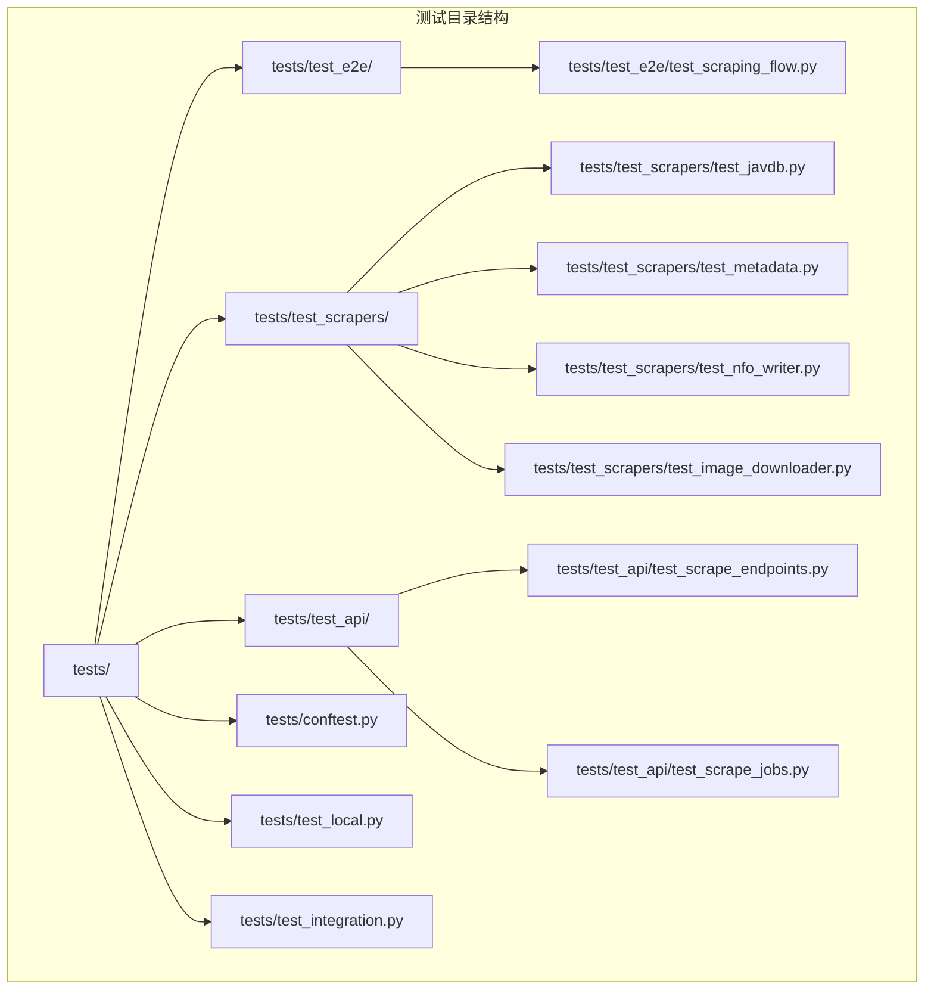
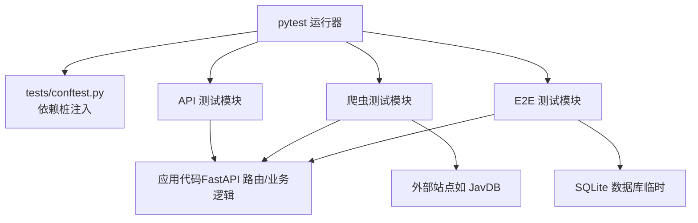
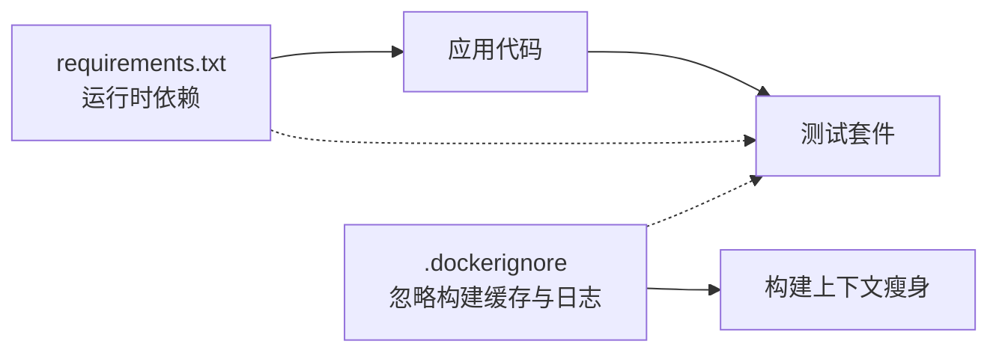

# 测试配置与工具

<cite>
**本文引用的文件**
- [tests/conftest.py](file://tests/conftest.py)
- [test_crawler.py](file://test_crawler.py)
- [.github/workflows/docker-publish.yml](file://.github/workflows/docker-publish.yml)
- [requirements.txt](file://requirements.txt)
- [.dockerignore](file://.dockerignore)
- [AGENTS.md](file://AGENTS.md)
- [tests/test_e2e/test_scraping_flow.py](file://tests/test_e2e/test_scraping_flow.py)
- [tests/test_scrapers/test_javdb.py](file://tests/test_scrapers/test_javdb.py)
- [tests/test_scrapers/test_metadata.py](file://tests/test_scrapers/test_metadata.py)
- [tests/test_scrapers/test_nfo_writer.py](file://tests/test_scrapers/test_nfo_writer.py)
- [tests/test_scrapers/test_image_downloader.py](file://tests/test_scrapers/test_image_downloader.py)
- [tests/test_api/test_scrape_endpoints.py](file://tests/test_api/test_scrape_endpoints.py)
- [tests/test_api/test_scrape_jobs.py](file://tests/test_api/test_scrape_jobs.py)
- [tests/test_integration.py](file://tests/test_integration.py)
- [tests/test_local.py](file://tests/test_local.py)
</cite>

## 目录
1. [简介](#简介)
2. [项目结构](#项目结构)
3. [核心组件](#核心组件)
4. [架构总览](#架构总览)
5. [详细组件分析](#详细组件分析)
6. [依赖分析](#依赖分析)
7. [性能考虑](#性能考虑)
8. [故障排除指南](#故障排除指南)
9. [结论](#结论)
10. [附录](#附录)

## 简介
本文件系统性梳理 Noctra 的测试配置与工具，覆盖以下主题：
- 测试环境搭建与配置：pytest 框架、第三方依赖安装、测试数据准备
- 持续集成：GitHub Actions 工作流与自动化执行
- 测试工具使用：覆盖率、性能与调试工具的配置思路
- 测试报告：生成格式与统计分析方法
- 故障排除与性能优化建议

当前仓库未包含 pytest 配置文件（如 pytest.ini、pyproject.toml 中的 pytest 段）与覆盖率/性能/调试工具配置文件，因此本文件以现有文件为依据，给出可落地的实践建议与参考路径。

## 项目结构
Noctra 的测试目录采用按功能分层组织：
- tests/test_api：API 层端到端与作业相关测试
- tests/test_e2e：端到端流程测试（含真实数据库与临时目录）
- tests/test_scrapers：爬虫模块单元测试（JavDB、官方站点、NFO 写入、图片下载器、元数据等）
- tests/test_integration.py、tests/test_local.py：集成与本地脚本类测试
- tests/conftest.py：pytest 共享配置（依赖桩）
- test_crawler.py：手动爬取器测试脚本

**图表来源**
- [tests/test_e2e/test_scraping_flow.py:333-376](file://tests/test_e2e/test_scraping_flow.py#L333-L376)
- [tests/test_scrapers/test_javdb.py](file://tests/test_scrapers/test_javdb.py)
- [tests/test_scrapers/test_metadata.py](file://tests/test_scrapers/test_metadata.py)
- [tests/test_scrapers/test_nfo_writer.py](file://tests/test_scrapers/test_nfo_writer.py)
- [tests/test_scrapers/test_image_downloader.py](file://tests/test_scrapers/test_image_downloader.py)
- [tests/test_api/test_scrape_endpoints.py](file://tests/test_api/test_scrape_endpoints.py)
- [tests/test_api/test_scrape_jobs.py](file://tests/test_api/test_scrape_jobs.py)
- [tests/conftest.py:1-20](file://tests/conftest.py#L1-L20)
- [tests/test_local.py](file://tests/test_local.py)
- [tests/test_integration.py](file://tests/test_integration.py)

**章节来源**
- [AGENTS.md:17-21](file://AGENTS.md#L17-L21)

## 核心组件
- pytest 共享配置（conftest）
  - 通过在 sys.modules 中预置模拟对象，避免导入重型第三方依赖（如网络与文件异步库），从而稳定 API 层测试。
- 手动爬取器测试脚本（test_crawler.py）
  - 提供对 JavDB 爬虫的手动验证入口，便于快速定位抓取问题。
- GitHub Actions 工作流（docker-publish.yml）
  - 当前用于发布 Docker 镜像；可作为扩展点引入测试任务（见后续“持续集成”章节）。
- 依赖与忽略项（requirements.txt、.dockerignore）
  - requirements.txt 列出运行时依赖；.dockerignore 控制构建上下文与缓存目录，有助于减少测试开销。

**章节来源**
- [tests/conftest.py:1-20](file://tests/conftest.py#L1-L20)
- [test_crawler.py:1-59](file://test_crawler.py#L1-L59)
- [.github/workflows/docker-publish.yml:1-51](file://.github/workflows/docker-publish.yml#L1-L51)
- [requirements.txt:1-12](file://requirements.txt#L1-L12)
- [.dockerignore:1-18](file://.dockerignore#L1-L18)
- [AGENTS.md:17-21](file://AGENTS.md#L17-L21)

## 架构总览
下图展示了测试体系的关键交互：pytest 收集用例、conftest 注入桩、具体测试模块调用应用代码或外部服务、E2E 使用真实数据库与临时目录。

**图表来源**
- [tests/conftest.py:1-20](file://tests/conftest.py#L1-L20)
- [tests/test_api/test_scrape_endpoints.py](file://tests/test_api/test_scrape_endpoints.py)
- [tests/test_api/test_scrape_jobs.py](file://tests/test_api/test_scrape_jobs.py)
- [tests/test_scrapers/test_javdb.py](file://tests/test_scrapers/test_javdb.py)
- [tests/test_scrapers/test_metadata.py](file://tests/test_scrapers/test_metadata.py)
- [tests/test_scrapers/test_nfo_writer.py](file://tests/test_scrapers/test_nfo_writer.py)
- [tests/test_scrapers/test_image_downloader.py](file://tests/test_scrapers/test_image_downloader.py)
- [tests/test_e2e/test_scraping_flow.py:333-376](file://tests/test_e2e/test_scraping_flow.py#L333-L376)

## 详细组件分析

### pytest 共享配置（conftest）
- 作用：在收集阶段向 sys.modules 注入模拟对象，屏蔽重型依赖，确保 API 层测试稳定。
- 关键点：
  - 对 curl_cffi 及其子模块、aiofiles 及其子模块进行桩处理。
  - 不屏蔽 aiohttp，以便需要真实异常类型（如 ClientError）的测试仍能触发预期行为。
- 建议：
  - 在新增测试模块时，若涉及网络或文件异步操作，优先复用该桩策略，避免不必要的外部依赖。

**章节来源**
- [tests/conftest.py:1-20](file://tests/conftest.py#L1-L20)

### 端到端测试（test_e2e/test_scraping_flow.py）
- 特点：
  - 使用真实 SQLite 数据库初始化与临时输出目录，模拟完整整理流程。
  - 通过 TestClient 直连应用路由，验证从扫描、抓取到整理的端到端链路。
- 关键夹具（fixtures）：
  - test_db：创建临时数据库并初始化模式。
  - test_dist_dir：创建临时目标目录树。
  - client：替换应用中的 DB_PATH 并启动测试客户端。
  - organized_record：插入已整理文件记录，返回包含 file_id 的字典。
- 建议：
  - 将 E2E 作为回归与集成验证的“金标准”，在关键路径变更时优先运行。

**章节来源**
- [tests/test_e2e/test_scraping_flow.py:333-376](file://tests/test_e2e/test_scraping_flow.py#L333-L376)

### 爬虫模块测试（tests/test_scrapers/*）
- JavDB 抓取测试（test_javdb.py）
  - 验证抓取器对特定番号的元数据提取能力。
- 元数据测试（test_metadata.py）
  - 验证元数据解析与规范化逻辑。
- NFO 写入测试（test_nfo_writer.py）
  - 验证 NFO 文件生成与写入行为。
- 图片下载器测试（test_image_downloader.py）
  - 验证图片下载与保存流程。
- 建议：
  - 为每个抓取器编写稳定可重复的输入样例，必要时使用桩或本地镜像站。

**章节来源**
- [tests/test_scrapers/test_javdb.py](file://tests/test_scrapers/test_javdb.py)
- [tests/test_scrapers/test_metadata.py](file://tests/test_scrapers/test_metadata.py)
- [tests/test_scrapers/test_nfo_writer.py](file://tests/test_scrapers/test_nfo_writer.py)
- [tests/test_scrapers/test_image_downloader.py](file://tests/test_scrapers/test_image_downloader.py)

### API 层测试（tests/test_api/*）
- 端点测试（test_scrape_endpoints.py）
  - 验证抓取相关接口的行为与响应。
- 作业测试（test_scrape_jobs.py）
  - 验证后台作业队列与状态管理。
- 建议：
  - 结合 conftest 的桩策略，确保网络与文件依赖不会干扰测试稳定性。

**章节来源**
- [tests/test_api/test_scrape_endpoints.py](file://tests/test_api/test_scrape_endpoints.py)
- [tests/test_api/test_scrape_jobs.py](file://tests/test_api/test_scrape_jobs.py)

### 手动爬取器测试脚本（test_crawler.py）
- 用途：对 JavDB 抓取器进行手动验证，支持传入番号参数。
- 输出：打印抓取结果字段与完整字典，便于快速诊断。
- 建议：
  - 将该脚本纳入本地开发与回归流程，作为抓取问题的“第一现场”。

**章节来源**
- [test_crawler.py:1-59](file://test_crawler.py#L1-L59)

### 集成与本地测试（tests/test_integration.py、tests/test_local.py）
- 集成测试：验证多模块协同行为。
- 本地测试：运行基于脚本的冒烟检查。
- 建议：
  - 将本地测试作为每日开发自检步骤，集成测试用于重大变更回归。

**章节来源**
- [tests/test_integration.py](file://tests/test_integration.py)
- [tests/test_local.py](file://tests/test_local.py)

## 依赖分析
- 运行时依赖（requirements.txt）
  - 包含 FastAPI、Uvicorn、Pydantic、SQLite 异步驱动、BeautifulSoup、lxml、curl-cffi、aiohttp、aiofiles、Pillow 等。
- 构建与缓存忽略（.dockerignore）
  - 忽略 .pytest_cache、.mypy_cache、logs、data、test_data、*.db、*.log 等，有助于减小构建上下文与缓存体积。
- 测试依赖现状
  - 未发现显式的 pytest 配置文件；pytest 未在 requirements.txt 中固定版本，需在虚拟环境中单独安装。

**图表来源**
- [requirements.txt:1-12](file://requirements.txt#L1-L12)
- [.dockerignore:1-18](file://.dockerignore#L1-L18)

**章节来源**
- [requirements.txt:1-12](file://requirements.txt#L1-L12)
- [.dockerignore:1-18](file://.dockerignore#L1-L18)
- [AGENTS.md:17-21](file://AGENTS.md#L17-L21)

## 性能考虑
- 测试并发与隔离
  - 使用独立的临时数据库与输出目录，避免跨用例干扰。
- 依赖桩化
  - 通过 conftest 对网络与文件异步库进行桩处理，显著降低测试执行时间与失败率。
- 缓存与上下文
  - .dockerignore 排除测试缓存与日志，有助于缩短构建与测试启动时间。
- 建议
  - 在 CI 中启用并行测试（pytest-xdist），并结合桩策略进一步提速。
  - 对外部站点抓取测试增加超时与重试策略，避免偶发网络波动影响整体进度。

[本节为通用性能建议，不直接分析具体文件]

## 故障排除指南
- 导入错误（网络/文件异步库）
  - 现象：测试导入阶段报错或部分模块缺失。
  - 处理：确认 conftest 是否正确注入桩；必要时在新测试模块中补充相应桩。
  - 参考：[tests/conftest.py:1-20](file://tests/conftest.py#L1-L20)
- 外部站点不可达或限流
  - 现象：抓取测试失败或超时。
  - 处理：使用桩或本地镜像站；为抓取器增加超时与重试；必要时离线运行。
  - 参考：[tests/test_scrapers/test_javdb.py](file://tests/test_scrapers/test_javdb.py)
- 数据库初始化失败（E2E）
  - 现象：E2E 无法连接或初始化数据库。
  - 处理：检查临时数据库路径与权限；确认初始化脚本可用；确保 fixtures 正常创建。
  - 参考：[tests/test_e2e/test_scraping_flow.py:333-376](file://tests/test_e2e/test_scraping_flow.py#L333-L376)
- CI 发布工作流与测试脱钩
  - 现象：CI 仅发布镜像，未执行测试。
  - 处理：在 GitHub Actions 中新增测试 job 或在现有 docker job 中加入测试步骤。
  - 参考：[docker-publish.yml:1-51](file://.github/workflows/docker-publish.yml#L1-L51)

**章节来源**
- [tests/conftest.py:1-20](file://tests/conftest.py#L1-L20)
- [tests/test_scrapers/test_javdb.py](file://tests/test_scrapers/test_javdb.py)
- [tests/test_e2e/test_scraping_flow.py:333-376](file://tests/test_e2e/test_scraping_flow.py#L333-L376)
- [.github/workflows/docker-publish.yml:1-51](file://.github/workflows/docker-publish.yml#L1-L51)

## 结论
Noctra 的测试体系以 pytest 为核心，配合 conftest 的依赖桩策略、E2E 的真实数据库与临时目录、以及面向爬虫与 API 的分层测试，形成了较为完善的质量保障基础。当前缺少显式的 pytest 配置文件与覆盖率/性能/调试工具配置，建议在现有基础上：
- 新增 pytest 配置文件，统一命令行参数与插件设置
- 引入覆盖率工具（如 pytest-cov）与性能基准（如 pytest-benchmark）
- 在 GitHub Actions 中扩展测试 job，实现“提交即测”
- 统一测试报告格式与趋势分析流程

[本节为总结性内容，不直接分析具体文件]

## 附录

### 测试环境搭建与配置
- 安装运行时依赖
  - 使用仓库提供的依赖清单安装运行时依赖。
  - 参考：[requirements.txt:1-12](file://requirements.txt#L1-L12)
- 安装测试依赖
  - 在虚拟环境中安装 pytest（未在 requirements.txt 中固定版本）。
  - 参考：[AGENTS.md:17-21](file://AGENTS.md#L17-L21)
- 准备测试数据
  - E2E 测试会自动创建临时数据库与输出目录；其他测试通常无需额外准备。
  - 参考：[tests/test_e2e/test_scraping_flow.py:333-376](file://tests/test_e2e/test_scraping_flow.py#L333-L376)
- 运行测试
  - 使用 pytest 运行指定模块或全量测试；配合 conftest 的桩策略提升稳定性。
  - 参考：[tests/conftest.py:1-20](file://tests/conftest.py#L1-L20)

**章节来源**
- [requirements.txt:1-12](file://requirements.txt#L1-L12)
- [AGENTS.md:17-21](file://AGENTS.md#L17-L21)
- [tests/test_e2e/test_scraping_flow.py:333-376](file://tests/test_e2e/test_scraping_flow.py#L333-L376)
- [tests/conftest.py:1-20](file://tests/conftest.py#L1-L20)

### 持续集成配置（GitHub Actions）
- 现状
  - 当前工作流仅负责 Docker 镜像发布，未包含测试执行。
  - 参考：[docker-publish.yml:1-51](file://.github/workflows/docker-publish.yml#L1-L51)
- 建议
  - 在同一工作流中新增测试 job，或在推送/PR 时触发测试。
  - 使用容器化执行测试，复用 requirements.txt 与 .dockerignore 的上下文优化。
  - 将测试结果与覆盖率导出为 artifacts，便于审计与趋势分析。

**章节来源**
- [.github/workflows/docker-publish.yml:1-51](file://.github/workflows/docker-publish.yml#L1-L51)

### 测试工具使用指南（建议）
- 覆盖率工具
  - 建议使用 pytest-cov，配置于 pytest 配置文件中，输出 XML/HTML 报告。
- 性能测试工具
  - 建议使用 pytest-benchmark，对关键路径（如抓取、整理）建立基准。
- 调试工具
  - 使用 pytest 的 -s 与 --pdb 参数；结合断点与日志定位问题。
- 报告与分析
  - 统一报告格式（如 JUnit XML + Cobertura XML），便于 CI 平台与趋势分析工具消费。

[本节为通用工具建议，不直接分析具体文件]

### 测试报告生成与分析（建议）
- 报告格式
  - 使用 pytest-html 或 junitxml 插件生成 HTML/JUnit 报告。
- 统计与趋势
  - 指标：通过率、失败用例数、覆盖率、平均/慢用例耗时。
  - 趋势：按日期/版本对比，识别回归与性能退化。
- 建议流程
  - CI 成功后上传报告 artifacts；本地使用工具进行对比与根因分析。

[本节为通用流程建议，不直接分析具体文件]