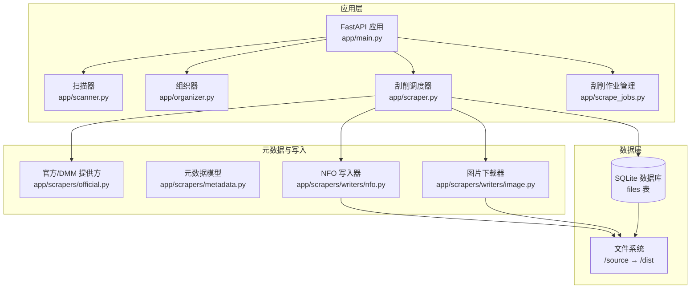
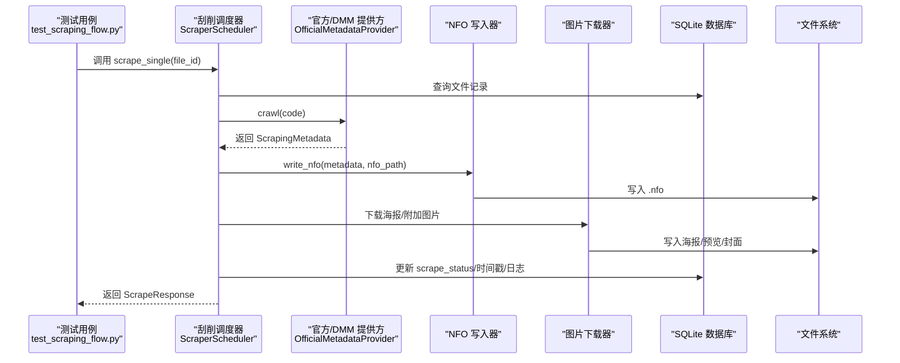
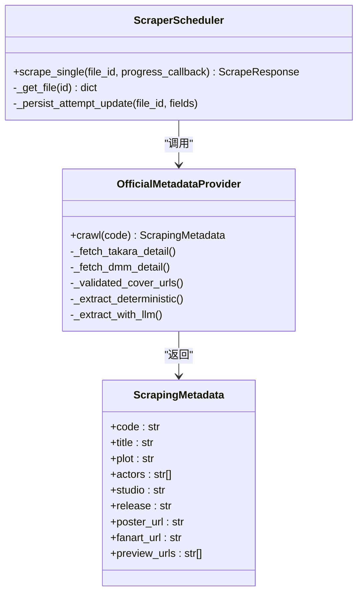
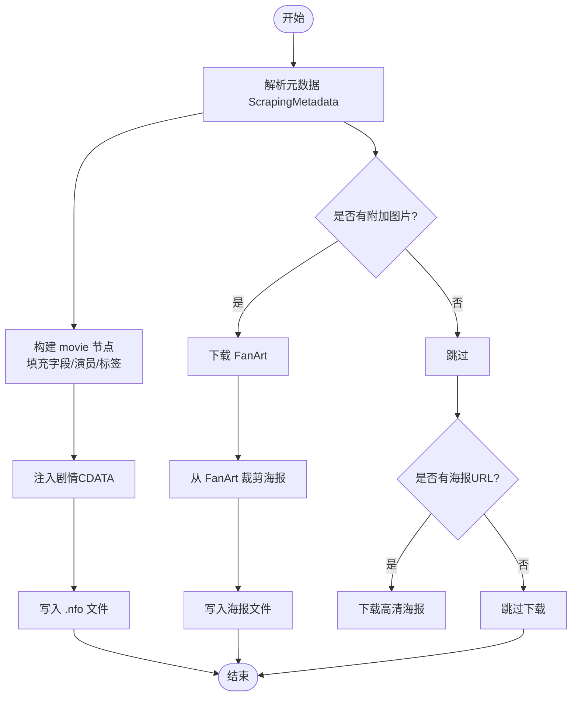
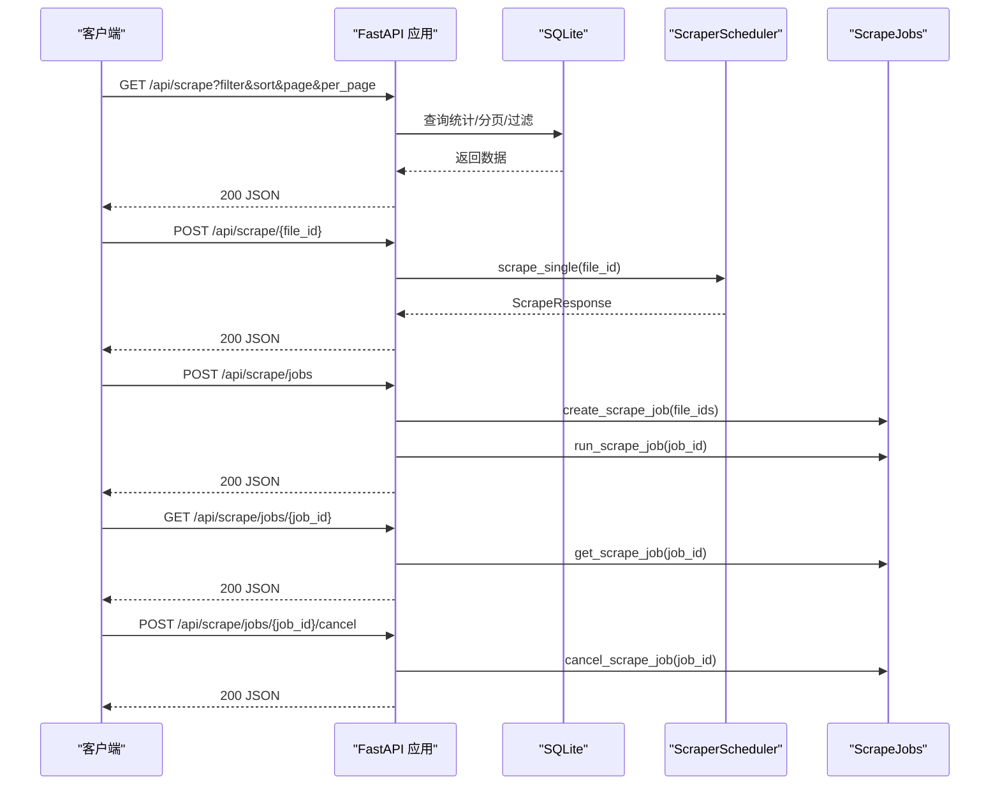
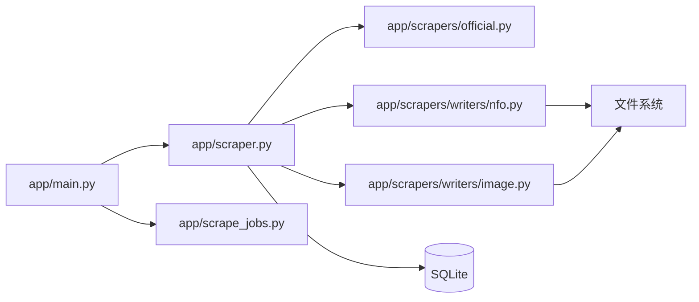

# 端到端测试

<cite>
**本文引用的文件**
- [tests/test_e2e/test_scraping_flow.py](file://tests/test_e2e/test_scraping_flow.py)
- [docs/testing/scraping-e2e-checklist.md](file://docs/testing/scraping-e2e-checklist.md)
- [app/main.py](file://app/main.py)
- [app/scanner.py](file://app/scanner.py)
- [app/scraper.py](file://app/scraper.py)
- [app/scrape_jobs.py](file://app/scrape_jobs.py)
- [app/models.py](file://app/models.py)
- [app/scrapers/metadata.py](file://app/scrapers/metadata.py)
- [app/scrapers/writers/nfo.py](file://app/scrapers/writers/nfo.py)
- [app/scrapers/writers/image.py](file://app/scrapers/writers/image.py)
- [app/scrapers/base.py](file://app/scrapers/base.py)
- [app/scrapers/official.py](file://app/scrapers/official.py)
- [tests/conftest.py](file://tests/conftest.py)
- [tests/test_api/test_scrape_endpoints.py](file://tests/test_api/test_scrape_endpoints.py)
- [tests/test_api/test_scrape_jobs.py](file://tests/test_api/test_scrape_jobs.py)
</cite>

## 目录
1. [引言](#引言)
2. [项目结构](#项目结构)
3. [核心组件](#核心组件)
4. [架构总览](#架构总览)
5. [详细组件分析](#详细组件分析)
6. [依赖关系分析](#依赖关系分析)
7. [性能考量](#性能考量)
8. [故障排查指南](#故障排查指南)
9. [结论](#结论)
10. [附录](#附录)

## 引言
本文件面向Noctra项目的端到端测试，聚焦“从文件扫描到元数据写入”的完整刮削流程。文档基于现有测试与实现，系统阐述测试设计思路、执行方法、环境配置、测试数据选择、自动化流程以及测试报告与问题追踪方式。读者无需深入技术背景即可理解并复用这些测试实践。

## 项目结构
Noctra采用分层架构：扫描器负责发现与识别文件，组织器负责整理目标路径，刮削调度器负责调用元数据提供方、生成NFO与下载海报，并持久化数据库状态；API层提供前端交互所需的端点；测试覆盖API、业务流程与端到端真实文件系统与数据库。

图表来源
- [app/main.py](file://app/main.py)
- [app/scanner.py](file://app/scanner.py)
- [app/scraper.py](file://app/scraper.py)
- [app/scrape_jobs.py](file://app/scrape_jobs.py)
- [app/scrapers/official.py](file://app/scrapers/official.py)
- [app/scrapers/metadata.py](file://app/scrapers/metadata.py)
- [app/scrapers/writers/nfo.py](file://app/scrapers/writers/nfo.py)
- [app/scrapers/writers/image.py](file://app/scrapers/writers/image.py)

章节来源
- [app/main.py](file://app/main.py)
- [app/scanner.py](file://app/scanner.py)
- [app/scraper.py](file://app/scraper.py)
- [app/scrape_jobs.py](file://app/scrape_jobs.py)

## 核心组件
- 端到端测试入口与流程验证：tests/test_e2e/test_scraping_flow.py
- 端到端检查清单与手动验证步骤：docs/testing/scraping-e2e-checklist.md
- API端点测试：tests/test_api/test_scrape_endpoints.py、tests/test_api/test_scrape_jobs.py
- 业务组件：app/main.py、app/scanner.py、app/scraper.py、app/scrape_jobs.py
- 元数据与写入：app/scrapers/metadata.py、app/scrapers/writers/nfo.py、app/scrapers/writers/image.py、app/scrapers/official.py
- 测试环境配置：tests/conftest.py

章节来源
- [tests/test_e2e/test_scraping_flow.py](file://tests/test_e2e/test_scraping_flow.py)
- [docs/testing/scraping-e2e-checklist.md](file://docs/testing/scraping-e2e-checklist.md)
- [tests/test_api/test_scrape_endpoints.py](file://tests/test_api/test_scrape_endpoints.py)
- [tests/test_api/test_scrape_jobs.py](file://tests/test_api/test_scrape_jobs.py)
- [app/main.py](file://app/main.py)
- [app/scrapers/metadata.py](file://app/scrapers/metadata.py)
- [app/scrapers/writers/nfo.py](file://app/scrapers/writers/nfo.py)
- [app/scrapers/writers/image.py](file://app/scrapers/writers/image.py)
- [app/scrapers/official.py](file://app/scrapers/official.py)
- [tests/conftest.py](file://tests/conftest.py)

## 架构总览
端到端测试以真实SQLite数据库与真实文件系统为核心，仅对外部HTTP调用进行模拟，确保覆盖“文件扫描→组织→刮削→NFO/海报生成→数据库状态更新”的完整链路。

图表来源
- [tests/test_e2e/test_scraping_flow.py](file://tests/test_e2e/test_scraping_flow.py)
- [app/scraper.py](file://app/scraper.py)
- [app/scrapers/official.py](file://app/scrapers/official.py)
- [app/scrapers/writers/nfo.py](file://app/scrapers/writers/nfo.py)
- [app/scrapers/writers/image.py](file://app/scrapers/writers/image.py)

## 详细组件分析

### 端到端测试设计与执行
- 测试目标：验证从数据库记录到NFO/海报生成再到数据库状态更新的完整流程。
- 测试策略：
  - 使用真实SQLite数据库与临时文件系统，确保I/O一致性。
  - 仅对外部HTTP请求进行模拟（如JavDB/DMM），内部逻辑保持真实调用。
  - 验证NFO内容完整性、XML合法性、海报下载与文件系统落盘。
  - 验证数据库状态字段更新（scrape_status、last_scrape_at等）。
- 关键测试类别：
  - 完整刮削流程（单文件/多文件）
  - NFO格式与Emby兼容性
  - API端点集成（真实数据库查询）
  - 错误处理（网络拦截、无封面、解析失败等）

章节来源
- [tests/test_e2e/test_scraping_flow.py](file://tests/test_e2e/test_scraping_flow.py)

### 刮削调度器与元数据提供方
- 刮削调度器负责：
  - 校验文件状态与必要字段
  - 调用官方/DMM提供方抓取元数据
  - 写入NFO与下载海报/附加图片
  - 持久化数据库状态与日志
- 元数据提供方负责：
  - 解析官方/DMM页面，提取标题、演员、发行日期、标签、封面URL等
  - 可选地使用LLM增强抽取与翻译

图表来源
- [app/scraper.py](file://app/scraper.py)
- [app/scrapers/official.py](file://app/scrapers/official.py)
- [app/scrapers/metadata.py](file://app/scrapers/metadata.py)

章节来源
- [app/scraper.py](file://app/scraper.py)
- [app/scrapers/official.py](file://app/scrapers/official.py)
- [app/scrapers/metadata.py](file://app/scrapers/metadata.py)

### NFO写入与海报下载
- NFO写入器遵循Emby/Kodi兼容规范，生成合法XML，包含标题、剧情、演员、发行日期、工作室、海报文件名等字段，并对剧情文本使用CDATA保护特殊字符。
- 图片下载器支持异步下载FanArt、预览图与海报，支持从FanArt裁剪海报，具备进度回调与错误容错。

图表来源
- [app/scrapers/writers/nfo.py](file://app/scrapers/writers/nfo.py)
- [app/scrapers/writers/image.py](file://app/scrapers/writers/image.py)

章节来源
- [app/scrapers/writers/nfo.py](file://app/scrapers/writers/nfo.py)
- [app/scrapers/writers/image.py](file://app/scrapers/writers/image.py)

### API端点与作业管理
- GET /api/scrape：分页、过滤、排序、统计聚合，返回刮削列表项及活动作业状态。
- POST /api/scrape/{file_id}：触发单文件刮削，返回ScrapeResponse。
- 作业管理：创建/轮询/取消刮削作业，跟踪进度与最近日志。

图表来源
- [tests/test_api/test_scrape_endpoints.py](file://tests/test_api/test_scrape_endpoints.py)
- [tests/test_api/test_scrape_jobs.py](file://tests/test_api/test_scrape_jobs.py)
- [app/main.py](file://app/main.py)
- [app/scrape_jobs.py](file://app/scrape_jobs.py)
- [app/scraper.py](file://app/scraper.py)

章节来源
- [tests/test_api/test_scrape_endpoints.py](file://tests/test_api/test_scrape_endpoints.py)
- [tests/test_api/test_scrape_jobs.py](file://tests/test_api/test_scrape_jobs.py)
- [app/main.py](file://app/main.py)
- [app/scrape_jobs.py](file://app/scrape_jobs.py)
- [app/scraper.py](file://app/scraper.py)

### 测试场景设计思路
- 场景一：单文件完整刮削
  - 插入已组织文件记录，断言NFO/海报生成、数据库状态更新。
- 场景二：多文件并发刮削
  - 并行执行多个文件，确保各自独立且互不影响。
- 场景三：NFO格式与Emby兼容
  - 验证XML声明、根节点、字段齐全、CDATA处理、空演员/无海报等边界。
- 场景四：API端点集成
  - GET/POST端点返回结构正确，错误路径返回预期错误消息。
- 场景五：错误处理
  - 网络拦截、无封面、解析失败、非组织状态等，断言用户友好提示与状态更新。

章节来源
- [tests/test_e2e/test_scraping_flow.py](file://tests/test_e2e/test_scraping_flow.py)
- [tests/test_api/test_scrape_endpoints.py](file://tests/test_api/test_scrape_endpoints.py)
- [tests/test_api/test_scrape_jobs.py](file://tests/test_api/test_scrape_jobs.py)

### 测试用例编写示例（路径指引）
- 单文件完整刮削流程
  - 参考：[tests/test_e2e/test_scraping_flow.py](file://tests/test_e2e/test_scraping_flow.py)
- 多文件并发刮削
  - 参考：[tests/test_e2e/test_scraping_flow.py](file://tests/test_e2e/test_scraping_flow.py)
- NFO内容与XML合法性
  - 参考：[tests/test_e2e/test_scraping_flow.py](file://tests/test_e2e/test_scraping_flow.py)
- API端点GET/POST
  - 参考：[tests/test_api/test_scrape_endpoints.py](file://tests/test_api/test_scrape_endpoints.py)
- 刮削作业创建/轮询/取消
  - 参考：[tests/test_api/test_scrape_jobs.py](file://tests/test_api/test_scrape_jobs.py)

章节来源
- [tests/test_e2e/test_scraping_flow.py](file://tests/test_e2e/test_scraping_flow.py)
- [tests/test_api/test_scrape_endpoints.py](file://tests/test_api/test_scrape_endpoints.py)
- [tests/test_api/test_scrape_jobs.py](file://tests/test_api/test_scrape_jobs.py)

### 测试环境配置与数据选择
- 环境要求
  - Python测试运行环境，安装依赖（pytest、fastapi、aiohttp、aiosqlite等）。
  - 测试期间会临时创建SQLite数据库与dist目录，确保权限允许写入。
- 测试数据
  - 使用fixtures插入已组织文件记录，设置不同状态与大小，便于验证边界条件。
  - 使用伪造HTML与图片字节，减少对外部服务依赖。
- 依赖隔离
  - 通过tests/conftest.py对curl_cffi/aiofiles等第三方依赖进行桩替，避免导入错误。

章节来源
- [tests/test_e2e/test_scraping_flow.py](file://tests/test_e2e/test_scraping_flow.py)
- [tests/conftest.py](file://tests/conftest.py)

### 自动化执行流程
- 运行全部测试
  - 命令：python3 -m pytest tests/ -v
- 仅运行端到端刮削测试
  - 命令：python3 -m pytest tests/test_e2e/test_scraping_flow.py -v
- 带覆盖率（可选）
  - 命令：python3 -m pytest tests/test_e2e/test_scraping_flow.py --cov=app.scrapers --cov=app.scraper -v

章节来源
- [docs/testing/scraping-e2e-checklist.md](file://docs/testing/scraping-e2e-checklist.md)

### 测试报告与问题追踪
- 测试报告
  - pytest默认输出测试结果与失败详情；建议结合CI生成HTML报告。
- 问题追踪
  - 刮削日志：ScrapeResponse与数据库中的scrape_logs包含阶段、来源、消息与进度百分比，便于定位失败点。
  - 前端UI：检查刮削面板的当前文件、阶段、来源与日志，确认实时状态。
  - 数据库：查询files表对应字段，核对scrape_status、last_scrape_at等。

章节来源
- [app/scraper.py](file://app/scraper.py)
- [app/models.py](file://app/models.py)
- [docs/testing/scraping-e2e-checklist.md](file://docs/testing/scraping-e2e-checklist.md)

## 依赖关系分析
- 组件耦合
  - ScraperScheduler依赖OfficialMetadataProvider、NFO写入器与图片下载器，同时与数据库与文件系统交互。
  - API层通过调度器与作业管理器协调业务流程。
- 外部依赖
  - HTTP请求由OfficialMetadataProvider发起，测试中通过mock屏蔽真实网络。
  - 图片下载依赖aiohttp与Pillow，测试中通过桩函数模拟下载。
- 循环依赖
  - 未见循环导入；各模块职责清晰，通过接口契约解耦。

图表来源
- [app/main.py](file://app/main.py)
- [app/scraper.py](file://app/scraper.py)
- [app/scrape_jobs.py](file://app/scrape_jobs.py)
- [app/scrapers/official.py](file://app/scrapers/official.py)
- [app/scrapers/writers/nfo.py](file://app/scrapers/writers/nfo.py)
- [app/scrapers/writers/image.py](file://app/scrapers/writers/image.py)

章节来源
- [app/main.py](file://app/main.py)
- [app/scraper.py](file://app/scraper.py)
- [app/scrape_jobs.py](file://app/scrape_jobs.py)
- [app/scrapers/official.py](file://app/scrapers/official.py)
- [app/scrapers/writers/nfo.py](file://app/scrapers/writers/nfo.py)
- [app/scrapers/writers/image.py](file://app/scrapers/writers/image.py)

## 性能考量
- I/O瓶颈
  - NFO写入与图片下载为磁盘I/O密集型，建议在测试中使用小体积图片与最小化字段集。
- 网络稳定性
  - 外部网站可能限流或拦截，测试中通过mock与重试策略提升稳定性。
- 并发与锁
  - 作业管理器使用异步锁保证并发安全，避免重复任务创建。

## 故障排查指南
- 常见问题
  - 文件状态不符：确保文件status为organized或processed，否则会拒绝刮削。
  - 无封面：NFO将生成空海报元素，不影响刮削完成。
  - 网络拦截：官方/DMM可能返回Cloudflare挑战，调度器映射为用户可读提示。
- 排查步骤
  - 查看ScrapeResponse与数据库scrape_logs，定位失败阶段与来源。
  - 检查NFO/XML合法性与海报文件是否存在。
  - 在Emby中查看NFO解析日志，确认无解析错误。

章节来源
- [app/scraper.py](file://app/scraper.py)
- [app/main.py](file://app/main.py)
- [docs/testing/scraping-e2e-checklist.md](file://docs/testing/scraping-e2e-checklist.md)

## 结论
本文档提供了Noctra端到端测试的系统化方案：从测试设计、执行方法、环境配置到结果验证与问题追踪均有明确路径。通过真实数据库与文件系统的配合、对外部HTTP的可控模拟，以及完善的API与作业管理测试，能够稳定验证“扫描→组织→刮削→元数据写入→状态更新”的全链路功能。

## 附录
- 手动验证检查清单：参见docs/testing/scraping-e2e-checklist.md
- 端到端测试用例路径：参见tests/test_e2e/test_scraping_flow.py
- API端点测试路径：参见tests/test_api/test_scrape_endpoints.py与tests/test_api/test_scrape_jobs.py