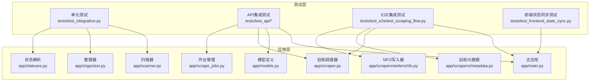
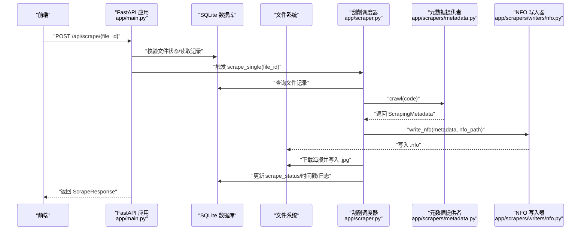
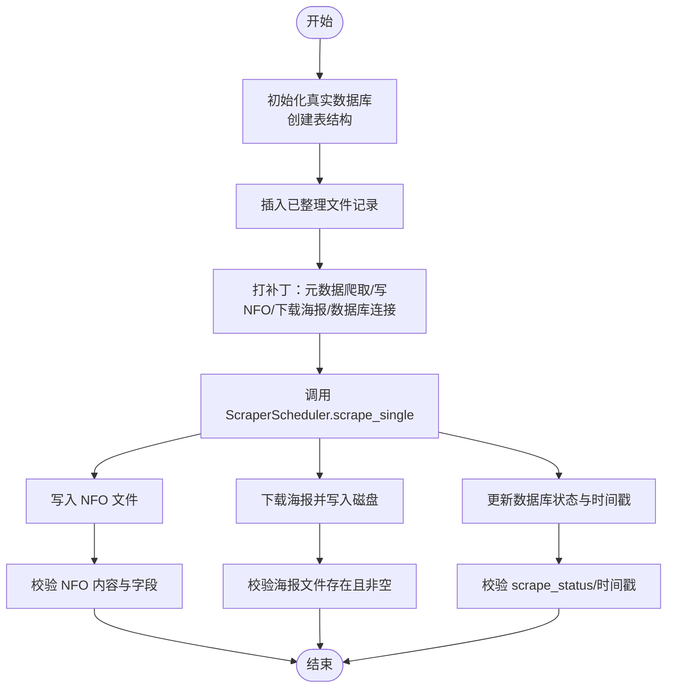
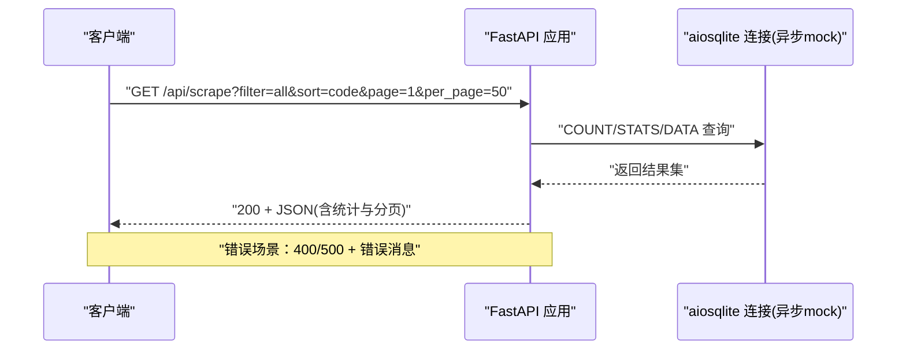
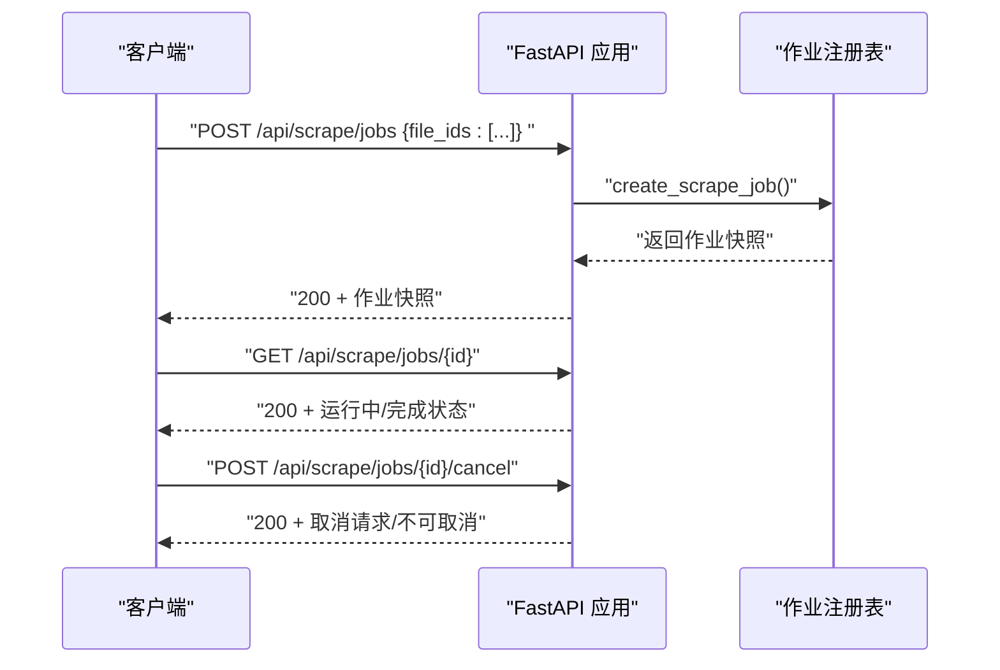
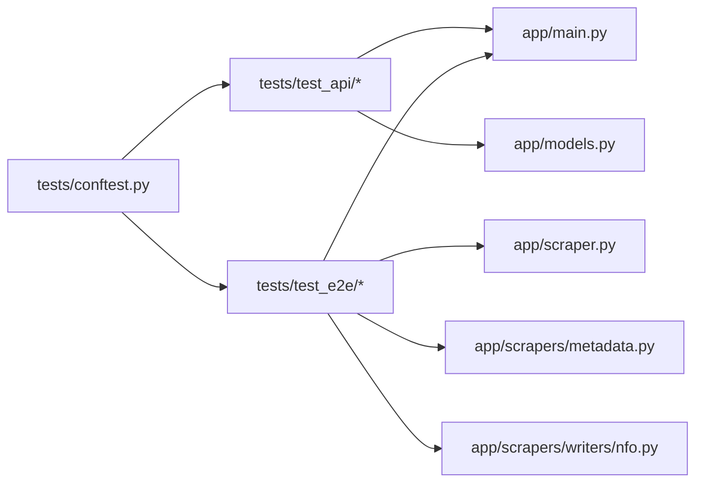

# 集成测试

<cite>
**本文引用的文件**
- [tests/test_integration.py](file://tests/test_integration.py)
- [tests/test_e2e/test_scraping_flow.py](file://tests/test_e2e/test_scraping_flow.py)
- [tests/test_api/test_scrape_endpoints.py](file://tests/test_api/test_scrape_endpoints.py)
- [tests/test_api/test_scrape_jobs.py](file://tests/test_api/test_scrape_jobs.py)
- [tests/test_db_init.py](file://tests/test_db_init.py)
- [tests/test_frontend_state_sync.py](file://tests/test_frontend_state_sync.py)
- [tests/conftest.py](file://tests/conftest.py)
- [app/main.py](file://app/main.py)
- [app/models.py](file://app/models.py)
- [app/statuses.py](file://app/statuses.py)
- [app/scrapers/metadata.py](file://app/scrapers/metadata.py)
- [app/scrapers/writers/nfo.py](file://app/scrapers/writers/nfo.py)
- [app/scraper.py](file://app/scraper.py)
- [app/scrape_jobs.py](file://app/scrape_jobs.py)
- [app/scanner.py](file://app/scanner.py)
- [app/organizer.py](file://app/organizer.py)
</cite>

## 目录
1. [引言](#引言)
2. [项目结构](#项目结构)
3. [核心组件](#核心组件)
4. [架构总览](#架构总览)
5. [详细组件分析](#详细组件分析)
6. [依赖关系分析](#依赖关系分析)
7. [性能考量](#性能考量)
8. [故障排查指南](#故障排查指南)
9. [结论](#结论)
10. [附录](#附录)

## 引言
本文件面向Noctra的集成测试体系，系统化阐述端到端工作流与前后端协同的测试设计目标与策略。重点覆盖以下方面：
- 组件间交互测试：从数据库记录到NFO/海报生成，再到API层状态更新的完整链路验证
- 前后端集成测试：FastAPI接口与真实SQLite数据库、文件系统、外部HTTP抓取的协同验证
- 端到端工作流：使用真实数据库与文件系统，结合HTTP响应模拟，验证刮削全流程的数据流转与状态同步
- 测试用例编写示例：数据库初始化、文件系统写入、网络请求模拟等
- 测试环境搭建、测试数据准备与执行顺序控制
- 结果验证与问题诊断技巧

## 项目结构
Noctra的测试采用分层组织：
- 单元测试：针对具体模块（如扫描器、整理器、状态解析）进行独立验证
- API集成测试：通过FastAPI TestClient验证路由、参数校验、错误处理与数据库交互
- E2E集成测试：使用真实SQLite数据库与临时文件系统，结合HTTP响应模拟，验证完整刮削流程
- 前端状态同步测试：在Node环境中执行前端脚本，验证状态缓存失效、排序优先级、UI交互等

**图表来源**
- [tests/test_integration.py:1-141](file://tests/test_integration.py#L1-L141)
- [tests/test_api/test_scrape_endpoints.py:1-715](file://tests/test_api/test_scrape_endpoints.py#L1-L715)
- [tests/test_e2e/test_scraping_flow.py:1-1194](file://tests/test_e2e/test_scraping_flow.py#L1-L1194)
- [tests/test_frontend_state_sync.py:1-1339](file://tests/test_frontend_state_sync.py#L1-L1339)

**章节来源**
- [tests/test_integration.py:1-141](file://tests/test_integration.py#L1-L141)
- [tests/test_api/test_scrape_endpoints.py:1-715](file://tests/test_api/test_scrape_endpoints.py#L1-L715)
- [tests/test_e2e/test_scraping_flow.py:1-1194](file://tests/test_e2e/test_scraping_flow.py#L1-L1194)
- [tests/test_frontend_state_sync.py:1-1339](file://tests/test_frontend_state_sync.py#L1-L1339)

## 核心组件
- 数据库与文件系统：使用真实SQLite数据库与临时目录，确保I/O行为与生产一致
- 刮削调度器：负责单文件刮削流程，协调元数据抓取、NFO写入、海报下载与数据库状态更新
- API层：提供刮削列表、详情、作业创建/取消等接口，统一参数校验与错误处理
- 前端状态同步：通过Node执行前端脚本，验证状态缓存失效、排序优先级与UI交互

**章节来源**
- [tests/test_db_init.py:1-82](file://tests/test_db_init.py#L1-L82)
- [tests/test_e2e/test_scraping_flow.py:1-1194](file://tests/test_e2e/test_scraping_flow.py#L1-L1194)
- [tests/test_api/test_scrape_endpoints.py:1-715](file://tests/test_api/test_scrape_endpoints.py#L1-L715)
- [tests/test_frontend_state_sync.py:1-1339](file://tests/test_frontend_state_sync.py#L1-L1339)

## 架构总览
下图展示了端到端刮削流程的组件交互与数据流：

**图表来源**
- [tests/test_e2e/test_scraping_flow.py:417-540](file://tests/test_e2e/test_scraping_flow.py#L417-L540)
- [app/scraper.py](file://app/scraper.py)
- [app/scrapers/metadata.py](file://app/scrapers/metadata.py)
- [app/scrapers/writers/nfo.py](file://app/scrapers/writers/nfo.py)
- [app/main.py](file://app/main.py)

## 详细组件分析

### 组件A：端到端刮削流程（E2E）
- 设计目标：验证从数据库记录到NFO/海报生成再到状态更新的完整链路
- 关键点：
  - 使用真实SQLite数据库与临时文件系统，确保I/O一致性
  - 通过异步mock桥接真实数据库与异步调用，保证状态更新可追踪
  - 对NFO内容与Emby兼容性进行严格校验（字段齐全、XML声明、CDATA处理）

**图表来源**
- [tests/test_e2e/test_scraping_flow.py:417-540](file://tests/test_e2e/test_scraping_flow.py#L417-L540)
- [tests/test_e2e/test_scraping_flow.py:541-585](file://tests/test_e2e/test_scraping_flow.py#L541-L585)
- [tests/test_e2e/test_scraping_flow.py:587-763](file://tests/test_e2e/test_scraping_flow.py#L587-L763)

**章节来源**
- [tests/test_e2e/test_scraping_flow.py:1-1194](file://tests/test_e2e/test_scraping_flow.py#L1-L1194)

### 组件B：API端点集成测试
- 设计目标：验证GET/POST /api/scrape及其子接口的行为，包括参数校验、分页、排序、统计与错误处理
- 关键点：
  - 使用FastAPI TestClient与aiosqlite异步mock，避免真实网络依赖
  - 覆盖过滤条件（pending/success/failed）、排序（code/scrape_time）、分页、统计卡片数据
  - 验证异常分支（无效参数、数据库错误、文件不存在、状态不符）

**图表来源**
- [tests/test_api/test_scrape_endpoints.py:96-398](file://tests/test_api/test_scrape_endpoints.py#L96-L398)
- [tests/test_api/test_scrape_endpoints.py:503-610](file://tests/test_api/test_scrape_endpoints.py#L503-L610)

**章节来源**
- [tests/test_api/test_scrape_endpoints.py:1-715](file://tests/test_api/test_scrape_endpoints.py#L1-L715)

### 组件C：刮削作业API集成测试
- 设计目标：验证批量作业的创建、查询、取消与并发控制
- 关键点：
  - 并发保护：当存在活动作业时拒绝重复创建
  - 进度与日志：作业运行期间实时更新进度百分比与最近日志
  - 终止语义：已完成作业不可取消，取消请求返回终端状态

**图表来源**
- [tests/test_api/test_scrape_jobs.py:64-223](file://tests/test_api/test_scrape_jobs.py#L64-L223)
- [tests/test_api/test_scrape_jobs.py:226-312](file://tests/test_api/test_scrape_jobs.py#L226-L312)

**章节来源**
- [tests/test_api/test_scrape_jobs.py:1-312](file://tests/test_api/test_scrape_jobs.py#L1-L312)

### 组件D：数据库初始化与迁移
- 设计目标：验证旧数据库在启动时自动补齐新列，保持向后兼容
- 关键点：
  - 创建旧schema并插入测试数据
  - 通过init_db回填新增列（开始/结束时间、阶段、来源、错误、用户提示、日志）
  - 校验列存在性与默认值

**章节来源**
- [tests/test_db_init.py:1-82](file://tests/test_db_init.py#L1-L82)

### 组件E：前端状态同步与UI交互
- 设计目标：验证前端状态缓存失效、排序优先级、批处理面板与UI标记正确性
- 关键点：
  - 在Node环境中加载前端模块，构造虚拟window/global上下文
  - 模拟API响应，验证刷新后缓存失效、视图切换与批处理面板展开/收起
  - 校验HTML/CSS标记与渲染逻辑

**章节来源**
- [tests/test_frontend_state_sync.py:1-1339](file://tests/test_frontend_state_sync.py#L1-L1339)

## 依赖关系分析
- 测试隔离与耦合
  - API测试通过异步mock隔离外部依赖，降低耦合度
  - E2E测试通过真实数据库与文件系统，提高与生产一致性的耦合度
- 第三方依赖stub策略
  - 通过conftest在导入前stub curl_cffi/aiofiles，避免安装复杂依赖影响测试运行

**图表来源**
- [tests/conftest.py:1-20](file://tests/conftest.py#L1-L20)
- [tests/test_api/test_scrape_endpoints.py:1-715](file://tests/test_api/test_scrape_endpoints.py#L1-L715)
- [tests/test_e2e/test_scraping_flow.py:1-1194](file://tests/test_e2e/test_scraping_flow.py#L1-L1194)

**章节来源**
- [tests/conftest.py:1-20](file://tests/conftest.py#L1-L20)

## 性能考量
- I/O密集型测试建议
  - 尽量使用临时目录与内存数据库，减少磁盘与网络开销
  - 合理拆分测试用例，避免长串顺序依赖导致整体耗时增加
- 并发与资源竞争
  - 刮削作业API测试中需关注并发创建与取消的竞态，确保幂等与最终一致性
- 日志与可观测性
  - E2E测试中保留scrape_logs，便于定位阶段与来源，辅助性能瓶颈定位

## 故障排查指南
- 数据库相关
  - 初始化失败：确认DB_PATH环境变量与schema迁移是否正确执行
  - 查询异常：检查SQL拼接与参数绑定，确保WHERE子句与排序字段有效
- 文件系统相关
  - NFO/海报缺失：确认写入路径、权限与父目录创建逻辑
  - 内容不匹配：核对字段映射与XML转义（CDATA），确保Emby可解析
- 网络请求相关
  - 元数据抓取失败：检查mock响应与URL格式，确认超时与重试策略
- 前端状态相关
  - 缓存未失效：检查刷新逻辑与active_job状态，确认视图切换触发条件
  - 排序异常：核对排序字段与优先级配置，确保失败项排在前列

**章节来源**
- [tests/test_db_init.py:1-82](file://tests/test_db_init.py#L1-L82)
- [tests/test_e2e/test_scraping_flow.py:541-763](file://tests/test_e2e/test_scraping_flow.py#L541-L763)
- [tests/test_frontend_state_sync.py:1-1339](file://tests/test_frontend_state_sync.py#L1-L1339)

## 结论
Noctra的集成测试以“真实数据库+真实文件系统+HTTP响应模拟”为核心策略，覆盖端到端刮削流程、API接口行为与前端状态同步。通过分层测试与严格的断言，确保数据流与状态同步在各组件间可靠传递，并为后续扩展与重构提供稳定保障。

## 附录

### 测试环境搭建与执行顺序
- 环境准备
  - Python虚拟环境与依赖安装
  - 通过pytest运行测试套件，必要时设置DB_PATH指向临时数据库
- 执行顺序建议
  - 先运行单元测试（扫描/整理/状态解析），再运行API集成测试，最后运行E2E与前端状态测试
  - 使用pytest-xdist可并行加速，但需注意共享资源（如数据库文件）的互斥访问

**章节来源**
- [tests/test_integration.py:1-141](file://tests/test_integration.py#L1-L141)
- [tests/test_api/test_scrape_endpoints.py:1-715](file://tests/test_api/test_scrape_endpoints.py#L1-L715)
- [tests/test_e2e/test_scraping_flow.py:1-1194](file://tests/test_e2e/test_scraping_flow.py#L1-L1194)
- [tests/test_frontend_state_sync.py:1-1339](file://tests/test_frontend_state_sync.py#L1-L1339)

### 测试用例编写示例（路径指引）
- 数据库连接测试
  - 示例路径：[tests/test_db_init.py:10-82](file://tests/test_db_init.py#L10-L82)
  - 关键步骤：创建临时数据库、插入旧schema数据、调用init_db、断言新增列存在
- 文件系统操作测试
  - 示例路径：[tests/test_e2e/test_scraping_flow.py:421-490](file://tests/test_e2e/test_scraping_flow.py#L421-L490)
  - 关键步骤：创建目标目录与文件、写入NFO、下载海报、断言文件存在与内容
- 网络请求测试
  - 示例路径：[tests/test_e2e/test_scraping_flow.py:444-455](file://tests/test_e2e/test_scraping_flow.py#L444-L455)
  - 关键步骤：mock元数据提供者返回ScrapingMetadata、断言返回值与DB更新

**章节来源**
- [tests/test_db_init.py:1-82](file://tests/test_db_init.py#L1-L82)
- [tests/test_e2e/test_scraping_flow.py:417-540](file://tests/test_e2e/test_scraping_flow.py#L417-L540)