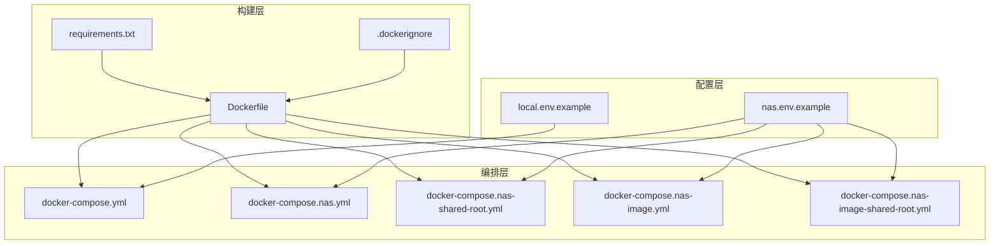
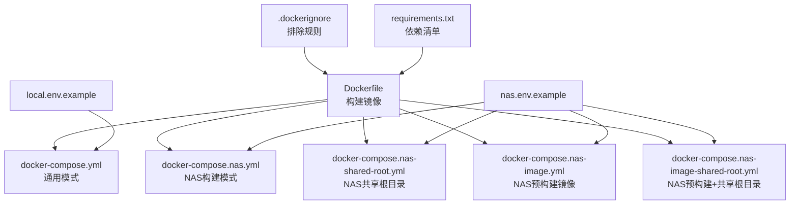
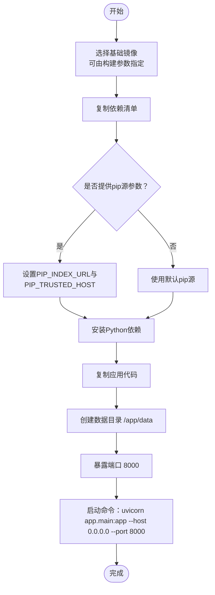
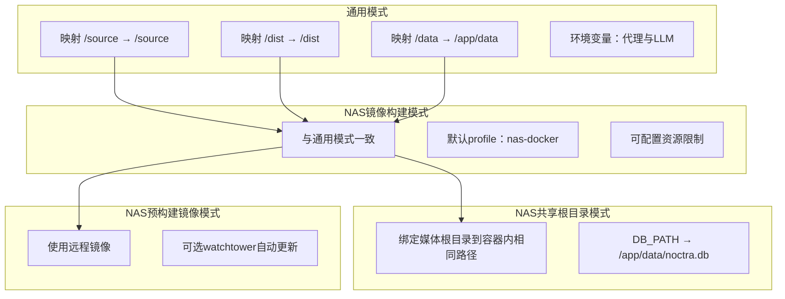
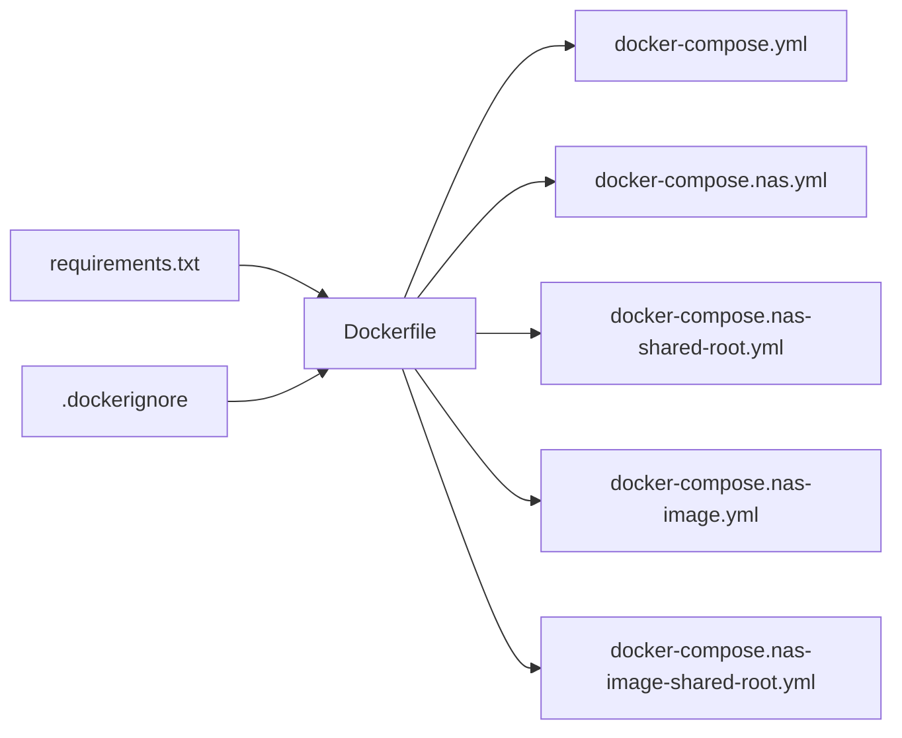
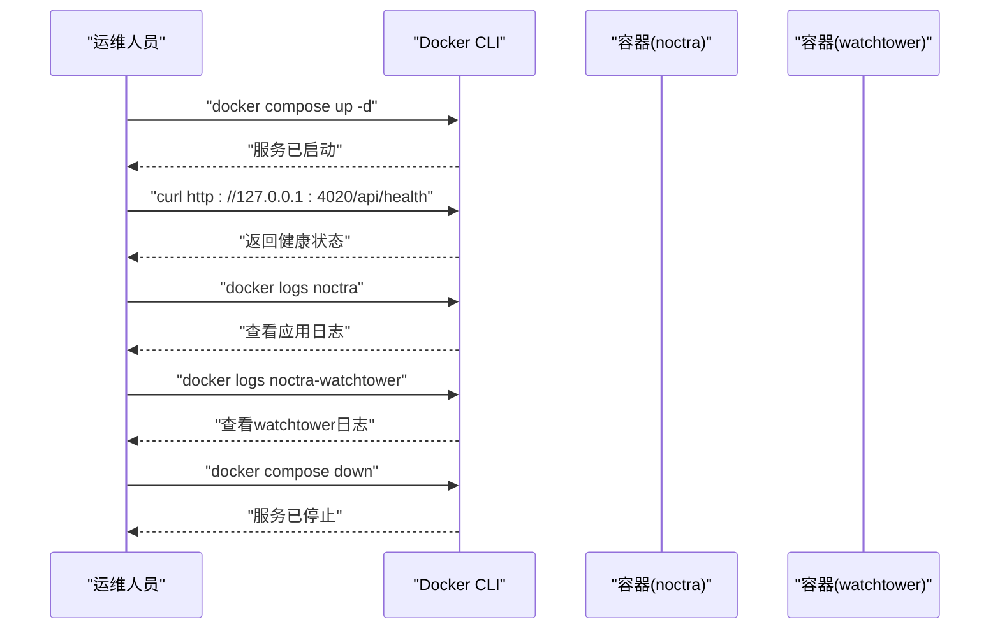

# Docker容器化部署

<cite>
**本文引用的文件**
- [Dockerfile](file://Dockerfile)
- [.dockerignore](file://.dockerignore)
- [docker-compose.yml](file://docker-compose.yml)
- [docker-compose.nas.yml](file://docker-compose.nas.yml)
- [docker-compose.nas-shared-root.yml](file://docker-compose.nas-shared-root.yml)
- [docker-compose.nas-image.yml](file://docker-compose.nas-image.yml)
- [docker-compose.nas-image-shared-root.yml](file://docker-compose.nas-image-shared-root.yml)
- [requirements.txt](file://requirements.txt)
- [config/profiles/local.env.example](file://config/profiles/local.env.example)
- [config/profiles/nas.env.example](file://config/profiles/nas.env.example)
- [docs/nas-deployment.md](file://docs/nas-deployment.md)
- [docs/local-startup.md](file://docs/local-startup.md)
- [scripts/start.sh](file://scripts/start.sh)
- [scripts/start-local.sh](file://scripts/start-local.sh)
- [scripts/start-noctra-nas.sh](file://scripts/start-noctra-nas.sh)
- [scripts/stop.sh](file://scripts/stop.sh)
- [scripts/stop-noctra-nas.sh](file://scripts/stop-noctra-nas.sh)
</cite>

## 目录
1. [简介](#简介)
2. [项目结构](#项目结构)
3. [核心组件](#核心组件)
4. [架构总览](#架构总览)
5. [详细组件分析](#详细组件分析)
6. [依赖关系分析](#依赖关系分析)
7. [性能与资源建议](#性能与资源建议)
8. [故障排查指南](#故障排查指南)
9. [结论](#结论)
10. [附录](#附录)

## 简介
本指南面向希望使用Docker对Noctra进行容器化部署的用户，覆盖镜像构建、Compose服务编排、单机开发模式与NAS共享根目录部署模式的差异与配置要点。内容包括：镜像构建流程、容器启动与停止、网络端口映射、存储卷挂载、环境变量配置、数据持久化策略、健康检查与日志查看、以及常见问题的诊断方法。

## 项目结构
与Docker部署直接相关的文件与目录如下：
- 构建与打包
  - Dockerfile：定义基础镜像、依赖安装、工作目录、暴露端口与启动命令
  - .dockerignore：排除构建上下文中的缓存、日志、数据库文件等
  - requirements.txt：Python运行时依赖清单
- Compose编排
  - docker-compose.yml：通用开发/本地模式
  - docker-compose.nas.yml：NAS镜像构建模式（与通用模式类似）
  - docker-compose.nas-shared-root.yml：NAS共享根目录模式（媒体根路径绑定）
  - docker-compose.nas-image.yml：NAS预构建镜像模式（含watchtower自动更新）
  - docker-compose.nas-image-shared-root.yml：NAS预构建镜像+共享根目录模式
- 配置示例
  - config/profiles/local.env.example：本地开发默认环境变量
  - config/profiles/nas.env.example：NAS部署默认环境变量
- 文档
  - docs/nas-deployment.md：NAS部署与镜像代理配置
  - docs/local-startup.md：本地启动与健康检查参考
- 运维脚本
  - scripts/start.sh、scripts/stop.sh：本地/后台进程管理与健康检查
  - scripts/start-local.sh、scripts/start-noctra-nas.sh、scripts/stop-noctra-nas.sh：不同profile的启动/停止包装

**图表来源**
- [Dockerfile:1-31](file://Dockerfile#L1-L31)
- [.dockerignore:1-19](file://.dockerignore#L1-L19)
- [requirements.txt:1-12](file://requirements.txt#L1-L12)
- [docker-compose.yml:1-28](file://docker-compose.yml#L1-L28)
- [docker-compose.nas.yml:1-33](file://docker-compose.nas.yml#L1-L33)
- [docker-compose.nas-shared-root.yml:1-35](file://docker-compose.nas-shared-root.yml#L1-L35)
- [docker-compose.nas-image.yml:1-51](file://docker-compose.nas-image.yml#L1-L51)
- [docker-compose.nas-image-shared-root.yml:1-53](file://docker-compose.nas-image-shared-root.yml#L1-L53)
- [config/profiles/local.env.example:1-23](file://config/profiles/local.env.example#L1-L23)
- [config/profiles/nas.env.example:1-44](file://config/profiles/nas.env.example#L1-L44)

**章节来源**
- [Dockerfile:1-31](file://Dockerfile#L1-L31)
- [.dockerignore:1-19](file://.dockerignore#L1-L19)
- [requirements.txt:1-12](file://requirements.txt#L1-L12)
- [docker-compose.yml:1-28](file://docker-compose.yml#L1-L28)
- [docker-compose.nas.yml:1-33](file://docker-compose.nas.yml#L1-L33)
- [docker-compose.nas-shared-root.yml:1-35](file://docker-compose.nas-shared-root.yml#L1-L35)
- [docker-compose.nas-image.yml:1-51](file://docker-compose.nas-image.yml#L1-L51)
- [docker-compose.nas-image-shared-root.yml:1-53](file://docker-compose.nas-image-shared-root.yml#L1-L53)
- [config/profiles/local.env.example:1-23](file://config/profiles/local.env.example#L1-L23)
- [config/profiles/nas.env.example:1-44](file://config/profiles/nas.env.example#L1-L44)

## 核心组件
- 镜像构建
  - 基础镜像与构建参数：通过构建参数传递Python基础镜像与pip源信息，便于内网定制
  - 依赖安装：根据是否提供pip源参数决定是否设置索引与可信主机
  - 工作目录与数据目录：设置应用工作目录并创建数据目录
  - 端口暴露与启动命令：暴露8000端口并通过Uvicorn启动FastAPI应用
- Compose服务编排
  - 通用模式：基于本地构建，映射source/dist/data卷，支持代理与LLM相关环境变量
  - NAS镜像构建模式：与通用模式一致，但profile默认为nas-docker
  - NAS共享根目录模式：将媒体根目录整体绑定到容器内相同路径，适合rename保留与跨盘操作
  - NAS预构建镜像模式：直接使用远程镜像，可选启用watchtower自动更新
- 环境变量与持久化
  - 本地默认：绑定本地相对路径，数据库位于容器内/app/data
  - NAS默认：绑定NAS路径，数据库推荐置于NAS数据卷
- 健康检查与日志
  - 本地通过curl访问/api/health验证
  - 日志输出至容器标准输出，可通过docker logs查看

**章节来源**
- [Dockerfile:1-31](file://Dockerfile#L1-L31)
- [docker-compose.yml:1-28](file://docker-compose.yml#L1-L28)
- [docker-compose.nas.yml:1-33](file://docker-compose.nas.yml#L1-L33)
- [docker-compose.nas-shared-root.yml:1-35](file://docker-compose.nas-shared-root.yml#L1-L35)
- [docker-compose.nas-image.yml:1-51](file://docker-compose.nas-image.yml#L1-L51)
- [docker-compose.nas-image-shared-root.yml:1-53](file://docker-compose.nas-image-shared-root.yml#L1-L53)
- [config/profiles/local.env.example:1-23](file://config/profiles/local.env.example#L1-L23)
- [config/profiles/nas.env.example:1-44](file://config/profiles/nas.env.example#L1-L44)
- [docs/local-startup.md:58-64](file://docs/local-startup.md#L58-L64)

## 架构总览
下图展示了Docker构建与Compose编排的关系，以及不同NAS模式的差异点。

**图表来源**
- [Dockerfile:1-31](file://Dockerfile#L1-L31)
- [.dockerignore:1-19](file://.dockerignore#L1-L19)
- [requirements.txt:1-12](file://requirements.txt#L1-L12)
- [docker-compose.yml:1-28](file://docker-compose.yml#L1-L28)
- [docker-compose.nas.yml:1-33](file://docker-compose.nas.yml#L1-L33)
- [docker-compose.nas-shared-root.yml:1-35](file://docker-compose.nas-shared-root.yml#L1-L35)
- [docker-compose.nas-image.yml:1-51](file://docker-compose.nas-image.yml#L1-L51)
- [docker-compose.nas-image-shared-root.yml:1-53](file://docker-compose.nas-image-shared-root.yml#L1-L53)
- [config/profiles/local.env.example:1-23](file://config/profiles/local.env.example#L1-L23)
- [config/profiles/nas.env.example:1-44](file://config/profiles/nas.env.example#L1-L44)

## 详细组件分析

### 组件A：Dockerfile构建流程
- 基础镜像与构建参数
  - 支持通过构建参数替换Python基础镜像，便于内网或加速镜像源
  - 支持通过构建参数设置PIP_INDEX_URL与PIP_TRUSTED_HOST，实现pip源定制
- 依赖安装
  - 若提供pip源参数，则在安装时设置对应环境变量；否则按默认行为安装
- 应用与运行
  - 复制应用代码至镜像
  - 创建/app/data目录作为数据持久化目录
  - 暴露8000端口
  - 使用Uvicorn启动FastAPI应用，监听0.0.0.0:8000

**图表来源**
- [Dockerfile:1-31](file://Dockerfile#L1-L31)

**章节来源**
- [Dockerfile:1-31](file://Dockerfile#L1-L31)

### 组件B：Compose服务编排与模式对比
- 通用模式（docker-compose.yml）
  - 本地构建镜像，映射source、dist、data卷
  - 环境变量支持代理与LLM相关配置
  - 默认profile为docker
- NAS镜像构建模式（docker-compose.nas.yml）
  - 与通用模式相似，但默认profile为nas-docker
  - 可配置CPU与内存限制
- NAS共享根目录模式（docker-compose.nas-shared-root.yml）
  - 将媒体根目录整体绑定到容器内相同路径
  - 设置DB_PATH指向容器内数据目录
- NAS预构建镜像模式（docker-compose.nas-image.yml）
  - 直接使用远程镜像，可选启用watchtower自动更新
  - watchtower监听标签并按计划轮询更新
- NAS预构建镜像+共享根目录模式（docker-compose.nas-image-shared-root.yml）
  - 结合镜像模式与共享根目录模式

**图表来源**
- [docker-compose.yml:1-28](file://docker-compose.yml#L1-L28)
- [docker-compose.nas.yml:1-33](file://docker-compose.nas.yml#L1-L33)
- [docker-compose.nas-shared-root.yml:1-35](file://docker-compose.nas-shared-root.yml#L1-L35)
- [docker-compose.nas-image.yml:1-51](file://docker-compose.nas-image.yml#L1-L51)
- [docker-compose.nas-image-shared-root.yml:1-53](file://docker-compose.nas-image-shared-root.yml#L1-L53)

**章节来源**
- [docker-compose.yml:1-28](file://docker-compose.yml#L1-L28)
- [docker-compose.nas.yml:1-33](file://docker-compose.nas.yml#L1-L33)
- [docker-compose.nas-shared-root.yml:1-35](file://docker-compose.nas-shared-root.yml#L1-L35)
- [docker-compose.nas-image.yml:1-51](file://docker-compose.nas-image.yml#L1-L51)
- [docker-compose.nas-image-shared-root.yml:1-53](file://docker-compose.nas-image-shared-root.yml#L1-L53)

### 组件C：环境变量与配置
- 本地开发默认
  - 绑定本地相对路径，数据库位于容器内/app/data
  - 默认端口4020，绑定主机127.0.0.1
- NAS部署默认
  - 绑定NAS路径，数据库推荐置于NAS数据卷
  - 支持远程部署目标、镜像拉取策略、watchtower配置、代理等
- Compose中常用变量
  - 端口映射：宿主端口默认4020，容器8000
  - 卷挂载：source、dist、data（或媒体根目录）
  - 代理：HTTP_PROXY、HTTPS_PROXY、http_proxy、https_proxy、NO_PROXY
  - LLM：NOCTRA_LLM_ENABLED、NOCTRA_LLM_BASE_URL、NOCTRA_LLM_MODEL、NOCTRA_LLM_API_KEY
  - watchtower：镜像、调度、代理、清理、标签启用

**章节来源**
- [config/profiles/local.env.example:1-23](file://config/profiles/local.env.example#L1-L23)
- [config/profiles/nas.env.example:1-44](file://config/profiles/nas.env.example#L1-L44)
- [docker-compose.yml:10-27](file://docker-compose.yml#L10-L27)
- [docker-compose.nas.yml:16-27](file://docker-compose.nas.yml#L16-L27)
- [docker-compose.nas-shared-root.yml:15-29](file://docker-compose.nas-shared-root.yml#L15-L29)
- [docker-compose.nas-image.yml:14-25](file://docker-compose.nas-image.yml#L14-L25)
- [docker-compose.nas-image-shared-root.yml:13-27](file://docker-compose.nas-image-shared-root.yml#L13-L27)

### 组件D：健康检查与日志
- 健康检查
  - 本地：通过curl访问127.0.0.1:4020/api/health验证
  - NAS：同理，确保端口映射正确
- 日志查看
  - 本地：前台运行或后台运行后通过docker logs查看
  - NAS：通过docker logs noctra 或 watchtower容器查看

**章节来源**
- [docs/local-startup.md:58-64](file://docs/local-startup.md#L58-L64)
- [scripts/start.sh:32-41](file://scripts/start.sh#L32-L41)

## 依赖关系分析
- 构建依赖
  - Dockerfile依赖requirements.txt进行Python依赖安装
  - .dockerignore排除日志、缓存、数据库文件，减少构建上下文体积
- 运行依赖
  - Compose文件定义了卷、环境变量、资源限制与可选watchtower
  - 不同NAS模式在卷挂载与profile上有差异

**图表来源**
- [requirements.txt:1-12](file://requirements.txt#L1-L12)
- [Dockerfile:1-31](file://Dockerfile#L1-L31)
- [.dockerignore:1-19](file://.dockerignore#L1-L19)
- [docker-compose.yml:1-28](file://docker-compose.yml#L1-L28)
- [docker-compose.nas.yml:1-33](file://docker-compose.nas.yml#L1-L33)
- [docker-compose.nas-shared-root.yml:1-35](file://docker-compose.nas-shared-root.yml#L1-L35)
- [docker-compose.nas-image.yml:1-51](file://docker-compose.nas-image.yml#L1-L51)
- [docker-compose.nas-image-shared-root.yml:1-53](file://docker-compose.nas-image-shared-root.yml#L1-L53)

**章节来源**
- [requirements.txt:1-12](file://requirements.txt#L1-L12)
- [Dockerfile:1-31](file://Dockerfile#L1-L31)
- [.dockerignore:1-19](file://.dockerignore#L1-L19)
- [docker-compose.yml:1-28](file://docker-compose.yml#L1-L28)
- [docker-compose.nas.yml:1-33](file://docker-compose.nas.yml#L1-L33)
- [docker-compose.nas-shared-root.yml:1-35](file://docker-compose.nas-shared-root.yml#L1-L35)
- [docker-compose.nas-image.yml:1-51](file://docker-compose.nas-image.yml#L1-L51)
- [docker-compose.nas-image-shared-root.yml:1-53](file://docker-compose.nas-image-shared-root.yml#L1-L53)

## 性能与资源建议
- 资源限制
  - NAS模式默认限制CPU 1.0核、内存512MB，可根据实际负载调整
- 端口与网络
  - 默认容器端口8000，宿主端口默认4020，确保无冲突
- 存储与I/O
  - NAS共享根目录模式可保留rename语义，减少跨盘复制开销
  - 数据库建议置于NAS数据卷，避免容器重建导致数据丢失
- 代理与镜像源
  - 内网可设置pip源与Docker daemon代理，提升构建与拉取速度

**章节来源**
- [docker-compose.nas.yml:28-33](file://docker-compose.nas.yml#L28-L33)
- [docker-compose.nas-shared-root.yml:29-35](file://docker-compose.nas-shared-root.yml#L29-L35)
- [config/profiles/nas.env.example:41-43](file://config/profiles/nas.env.example#L41-L43)
- [docs/nas-deployment.md:83-111](file://docs/nas-deployment.md#L83-L111)

## 故障排查指南
- 健康检查失败
  - 通过curl访问/api/health确认服务状态
  - 查看容器日志：docker logs noctra
  - 若为NAS镜像模式，同时查看watchtower日志：docker logs noctra-watchtower
- 端口冲突
  - 检查宿主端口映射是否被占用，默认映射4020:8000
- 卷挂载异常
  - 确认source、dist、data或媒体根目录路径存在且权限正确
  - 共享根目录模式需保证绑定根路径包含所有媒体子路径
- 代理与网络
  - NAS拉取镜像需在Docker daemon配置代理，非shell环境变量
  - 本地可通过HTTP_PROXY/HTTPS_PROXY等环境变量透传
- 进程管理
  - 使用scripts/start.sh与scripts/stop.sh进行本地启动/停止
  - profile切换：local或nas

**图表来源**
- [docs/local-startup.md:58-64](file://docs/local-startup.md#L58-L64)
- [scripts/start.sh:32-41](file://scripts/start.sh#L32-L41)
- [docker-compose.nas-image.yml:32-52](file://docker-compose.nas-image.yml#L32-L52)

**章节来源**
- [docs/local-startup.md:58-64](file://docs/local-startup.md#L58-L64)
- [scripts/start.sh:32-41](file://scripts/start.sh#L32-L41)
- [scripts/stop.sh:11-18](file://scripts/stop.sh#L11-L18)
- [docker-compose.nas-image.yml:32-52](file://docker-compose.nas-image.yml#L32-L52)

## 结论
通过Docker与Compose，Noctra提供了灵活的容器化部署方案。通用模式适合本地开发与快速迭代，NAS镜像构建与预构建镜像模式则满足NAS场景下的稳定与自动化需求。合理配置卷挂载、环境变量与资源限制，并结合健康检查与日志监控，可实现可靠的生产级部署。

## 附录
- 快速操作清单
  - 本地开发：使用docker-compose.yml，映射source、dist、data卷，访问/api/health验证
  - NAS镜像构建：使用docker-compose.nas.yml，设置profile为nas-docker
  - NAS共享根目录：使用docker-compose.nas-shared-root.yml，绑定媒体根目录
  - NAS预构建镜像：使用docker-compose.nas-image.yml，启用watchtower自动更新
  - 端口与代理：根据需要设置NOCTRA_PORT与HTTP_PROXY/HTTPS_PROXY
  - 数据持久化：将DB_PATH指向NAS数据卷，避免容器重建丢失数据