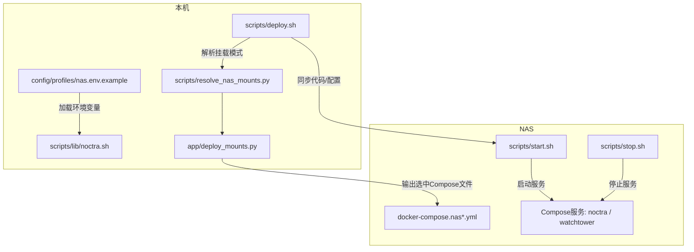
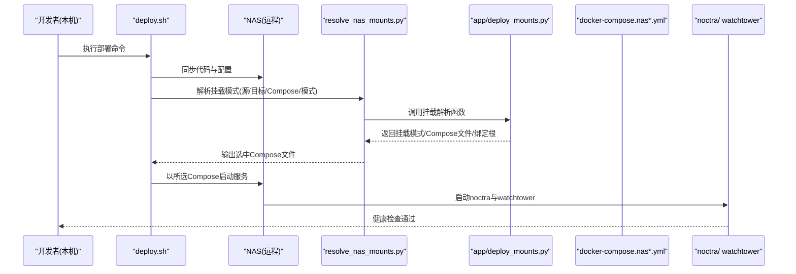
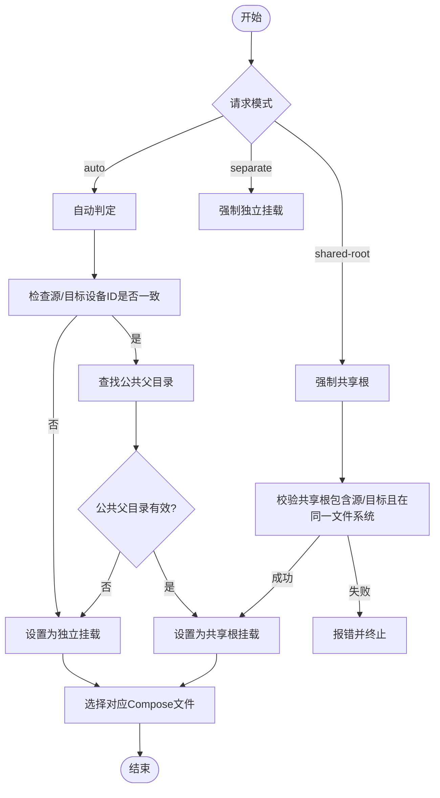
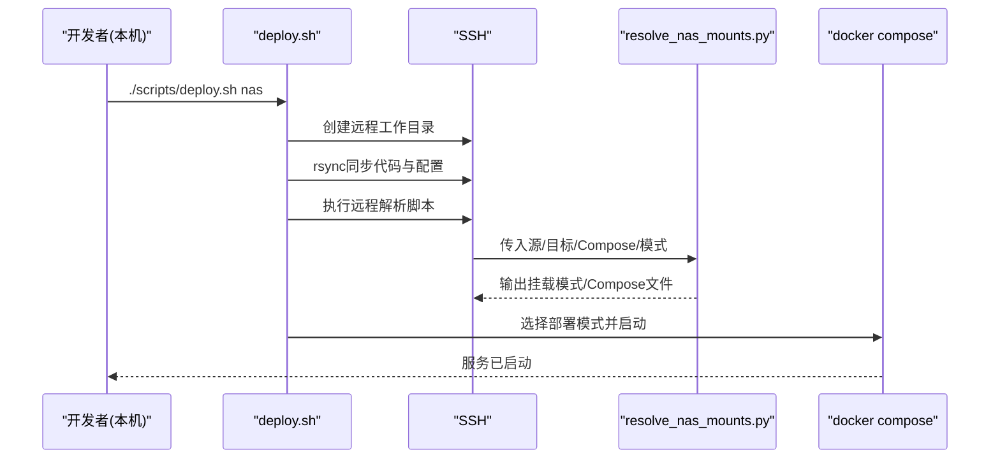
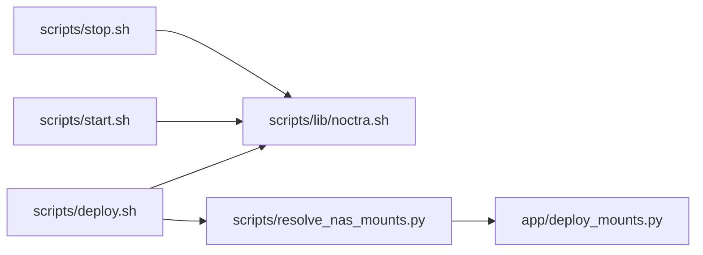

# NAS专用部署

<cite>
**本文引用的文件**
- [nas-deployment.md](file://nas-deployment.md)
- [docs/nas-deployment.md](file://docs/nas-deployment.md)
- [docker-compose.nas.yml](file://docker-compose.nas.yml)
- [docker-compose.nas-shared-root.yml](file://docker-compose.nas-shared-root.yml)
- [docker-compose.nas-image.yml](file://docker-compose.nas-image.yml)
- [docker-compose.nas-image-shared-root.yml](file://docker-compose.nas-image-shared-root.yml)
- [config/profiles/nas.env.example](file://config/profiles/nas.env.example)
- [scripts/deploy.sh](file://scripts/deploy.sh)
- [scripts/start-noctra-nas.sh](file://scripts/start-noctra-nas.sh)
- [scripts/stop-noctra-nas.sh](file://scripts/stop-noctra-nas.sh)
- [scripts/lib/noctra.sh](file://scripts/lib/noctra.sh)
- [scripts/start.sh](file://scripts/start.sh)
- [scripts/stop.sh](file://scripts/stop.sh)
- [scripts/resolve_nas_mounts.py](file://scripts/resolve_nas_mounts.py)
- [app/deploy_mounts.py](file://app/deploy_mounts.py)
</cite>

## 目录
1. [简介](#简介)
2. [项目结构](#项目结构)
3. [核心组件](#核心组件)
4. [架构总览](#架构总览)
5. [详细组件分析](#详细组件分析)
6. [依赖关系分析](#依赖关系分析)
7. [性能考虑](#性能考虑)
8. [故障排查指南](#故障排查指南)
9. [结论](#结论)
10. [附录](#附录)

## 简介
本指南面向在NAS（如QNAP、Synology等）上部署Noctra的用户，覆盖从本机脚本化部署到NAS图形界面部署的多种方式。重点解释NAS特有的存储架构、网络配置与权限管理，以及Docker Compose配置差异、共享卷挂载与媒体库访问设置。同时提供NAS应用商店安装、手动容器部署与SSH远程管理方法，并给出性能优化、备份策略与维护操作的实用建议。

## 项目结构
围绕NAS部署的关键文件与脚本组织如下：
- 文档与说明
  - nas-deployment.md：NAS部署步骤与平台示例
  - docs/nas-deployment.md：NAS部署与代理、验证等说明
- Compose配置
  - docker-compose.nas.yml：基于源码构建的NAS模式
  - docker-compose.nas-shared-root.yml：共享根目录挂载的NAS模式
  - docker-compose.nas-image.yml：基于预构建镜像的NAS模式
  - docker-compose.nas-image-shared-root.yml：共享根目录挂载的镜像模式
- 配置文件
  - config/profiles/nas.env.example：NAS部署的环境变量模板
- 部署与运行脚本
  - scripts/deploy.sh：本机一键部署到NAS的主脚本
  - scripts/start-noctra-nas.sh / scripts/stop-noctra-nas.sh：NAS侧启动/停止入口
  - scripts/lib/noctra.sh：环境加载与通用逻辑
  - scripts/start.sh / scripts/stop.sh：本地/远程启动/停止逻辑
  - scripts/resolve_nas_mounts.py：NAS挂载模式解析工具
  - app/deploy_mounts.py：挂载模式决策与Compose文件选择

图表来源
- [scripts/deploy.sh:1-106](file://scripts/deploy.sh#L1-L106)
- [scripts/lib/noctra.sh:1-148](file://scripts/lib/noctra.sh#L1-L148)
- [scripts/resolve_nas_mounts.py:1-43](file://scripts/resolve_nas_mounts.py#L1-L43)
- [app/deploy_mounts.py:1-89](file://app/deploy_mounts.py#L1-L89)
- [docker-compose.nas.yml:1-33](file://docker-compose.nas.yml#L1-L33)
- [docker-compose.nas-image.yml:1-51](file://docker-compose.nas-image.yml#L1-L51)

章节来源
- [nas-deployment.md:1-286](file://nas-deployment.md#L1-L286)
- [docs/nas-deployment.md:1-125](file://docs/nas-deployment.md#L1-L125)

## 核心组件
- 环境配置与加载
  - 通过环境文件加载并导出部署所需变量（主机、端口、源/目标目录、数据目录、代理、镜像、Watchtower参数等）
- 挂载模式解析
  - 根据源/目标目录位置与文件系统设备ID，自动选择独立挂载或共享根挂载，并切换对应的Compose文件
- 远程部署流程
  - 本机通过SSH将代码与配置同步至NAS，解析挂载模式，按部署模式（python/docker/docker-image）执行启动
- 服务编排
  - 提供多套Compose配置，分别对应构建镜像与使用预构建镜像、独立挂载与共享根挂载

章节来源
- [config/profiles/nas.env.example:1-44](file://config/profiles/nas.env.example#L1-L44)
- [scripts/lib/noctra.sh:13-73](file://scripts/lib/noctra.sh#L13-L73)
- [scripts/resolve_nas_mounts.py:15-43](file://scripts/resolve_nas_mounts.py#L15-L43)
- [app/deploy_mounts.py:57-89](file://app/deploy_mounts.py#L57-L89)
- [scripts/deploy.sh:49-103](file://scripts/deploy.sh#L49-L103)

## 架构总览
下图展示从本机到NAS的部署与运行路径，包括挂载模式解析与Compose文件选择：

图表来源
- [scripts/deploy.sh:49-103](file://scripts/deploy.sh#L49-L103)
- [scripts/resolve_nas_mounts.py:24-38](file://scripts/resolve_nas_mounts.py#L24-L38)
- [app/deploy_mounts.py:57-89](file://app/deploy_mounts.py#L57-L89)
- [docker-compose.nas-image.yml:1-51](file://docker-compose.nas-image.yml#L1-L51)

## 详细组件分析

### 组件A：挂载模式解析与Compose选择
- 功能概述
  - 根据源/目标目录与请求模式，自动判定是否可使用共享根挂载；若不可，则回退为独立挂载
  - 将请求的Compose文件名转换为对应的共享根版本
- 关键流程
  - 自动模式：检测源/目标目录所在文件系统设备ID一致且存在公共父目录时，选择共享根
  - 强制模式：校验共享根必须同时包含源与目标目录，且在同一文件系统
  - 独立模式：强制使用独立挂载
- 复杂度与性能
  - 文件系统设备ID比较与公共父目录计算为O(n)级别，对大规模目录影响有限
  - 仅在部署阶段执行，不影响运行时性能

图表来源
- [app/deploy_mounts.py:26-89](file://app/deploy_mounts.py#L26-L89)
- [scripts/resolve_nas_mounts.py:24-38](file://scripts/resolve_nas_mounts.py#L24-L38)

章节来源
- [app/deploy_mounts.py:1-89](file://app/deploy_mounts.py#L1-L89)
- [scripts/resolve_nas_mounts.py:1-43](file://scripts/resolve_nas_mounts.py#L1-L43)

### 组件B：远程部署脚本（本机到NAS）
- 功能概述
  - 将仓库代码与配置同步到NAS，解析挂载模式，按部署模式（python/docker/docker-image）在NAS侧启动服务
  - 支持停止旧版uvicorn进程，避免端口冲突
- 关键流程
  - 同步：排除缓存与日志目录，仅传输必要文件
  - 解析：调用Python脚本解析挂载模式并输出变量
  - 启动：根据部署模式执行构建或拉取镜像并启动

图表来源
- [scripts/deploy.sh:28-103](file://scripts/deploy.sh#L28-L103)
- [scripts/resolve_nas_mounts.py:15-43](file://scripts/resolve_nas_mounts.py#L15-L43)

章节来源
- [scripts/deploy.sh:1-106](file://scripts/deploy.sh#L1-L106)

### 组件C：Compose配置差异与挂载策略
- 独立挂载（source/dist分开挂载）
  - 优点：跨盘/跨文件系统兼容性好，rename重命名行为稳定
  - 适用：源/目标位于不同卷或文件系统
- 共享根挂载（统一绑定根目录）
  - 优点：保留rename语义，减少跨盘copy+delete
  - 适用：源/目标在同一文件系统且存在公共父目录
- 镜像模式 vs 构建模式
  - 镜像模式：使用预构建镜像，启动更快，适合NAS
  - 构建模式：在NAS本地构建，适合开发调试

章节来源
- [docker-compose.nas.yml:1-33](file://docker-compose.nas.yml#L1-L33)
- [docker-compose.nas-shared-root.yml:1-35](file://docker-compose.nas-shared-root.yml#L1-35)
- [docker-compose.nas-image.yml:1-51](file://docker-compose.nas-image.yml#L1-L51)
- [docker-compose.nas-image-shared-root.yml:1-53](file://docker-compose.nas-image-shared-root.yml#L1-L53)

### 组件D：平台部署指南（Synology/QNAP/Docker Web UI）
- SSH手动部署（推荐）
  - 步骤：SSH登录NAS、创建部署目录、下载/上传配置、修改挂载路径、启动容器、验证与访问
  - 适用：支持SSH的NAS（Synology、QNAP等）
- Docker图形界面部署
  - 步骤：打开套件中心/Container Station，搜索镜像，创建容器，配置端口与卷，设置环境变量
  - 适用：不熟悉命令行的用户
- 平台示例
  - Synology：指定/volume1下的videos与jav目录
  - QNAP：指定/share/Multimedia下的videos与jav目录
  - 通用Linux NAS：指定/mnt/storage下的videos与jav目录

章节来源
- [nas-deployment.md:5-147](file://nas-deployment.md#L5-L147)

### 组件E：代理与网络配置
- Docker守护进程代理
  - 由于docker pull使用NAS上的Docker守护进程，需在NAS侧配置daemon.json中的代理
- 应用与Watchtower代理
  - 可通过环境变量为应用与Watchtower设置HTTP/HTTPS代理及no_proxy列表
- 验证
  - 使用docker info查看代理配置，pull镜像并访问健康检查接口验证

章节来源
- [docs/nas-deployment.md:83-125](file://docs/nas-deployment.md#L83-L125)

### 组件F：权限与目录管理
- 目录权限
  - 确保NAS上源/目标目录具备读写权限，避免容器内无法访问
- 数据持久化
  - 将数据库与日志目录映射到NAS数据卷，避免容器删除导致数据丢失

章节来源
- [nas-deployment.md:151-163](file://nas-deployment.md#L151-L163)

### 组件G：备份与恢复
- 备份
  - 备份数据库文件至NAS备份目录
- 恢复
  - 将备份数据库文件恢复到原路径，重启容器使变更生效

章节来源
- [nas-deployment.md:268-285](file://nas-deployment.md#L268-L285)

## 依赖关系分析
- 组件耦合
  - deploy.sh依赖noctra.sh加载环境变量，依赖resolve_nas_mounts.py进行挂载模式解析
  - resolve_nas_mounts.py调用app/deploy_mounts.py实现挂载决策
  - 启动脚本start.sh依赖noctra.sh提供的变量，最终通过Uvicorn启动服务
- 外部依赖
  - Docker与docker-compose用于容器编排
  - NAS图形界面（Synology DSM、QNAP Container Station）用于无需命令行的部署
- 潜在循环依赖
  - 当前脚本间为单向依赖，无循环

图表来源
- [scripts/deploy.sh:9-103](file://scripts/deploy.sh#L9-L103)
- [scripts/lib/noctra.sh:13-73](file://scripts/lib/noctra.sh#L13-L73)
- [scripts/resolve_nas_mounts.py:12-38](file://scripts/resolve_nas_mounts.py#L12-L38)
- [app/deploy_mounts.py:57-89](file://app/deploy_mounts.py#L57-L89)
- [scripts/start.sh:6-29](file://scripts/start.sh#L6-L29)
- [scripts/stop.sh:6-18](file://scripts/stop.sh#L6-L18)

章节来源
- [scripts/deploy.sh:1-106](file://scripts/deploy.sh#L1-L106)
- [scripts/lib/noctra.sh:1-148](file://scripts/lib/noctra.sh#L1-L148)

## 性能考虑
- 镜像模式优先
  - 在NAS上优先使用预构建镜像，避免本地构建耗时与依赖不稳定
- 挂载模式选择
  - 若源/目标在同一文件系统且存在公共父目录，优先共享根挂载以保留rename语义，减少跨盘IO
- 资源限制
  - Compose中限制CPU与内存，避免过度占用NAS资源
- 端口与代理
  - 合理设置端口映射，避免冲突；在代理环境下确保Docker守护进程代理配置正确

章节来源
- [docs/nas-deployment.md:14-24](file://docs/nas-deployment.md#L14-L24)
- [docker-compose.nas.yml:28-33](file://docker-compose.nas.yml#L28-L33)
- [docker-compose.nas-image.yml:26-31](file://docker-compose.nas-image.yml#L26-L31)

## 故障排查指南
- 容器无法启动
  - 检查挂载路径是否存在、权限是否足够、端口是否被占用
- 无法访问Web界面
  - 检查防火墙开放情况、NAS IP与端口映射、容器运行状态
- 扫描不到文件
  - 检查挂载路径与目录权限，确认容器内可见性
- 代理问题
  - 在NAS侧配置Docker守护进程代理，验证docker info与镜像拉取

章节来源
- [nas-deployment.md:167-194](file://nas-deployment.md#L167-L194)
- [docs/nas-deployment.md:113-125](file://docs/nas-deployment.md#L113-L125)

## 结论
通过本指南，您可以在NAS上快速完成Noctra的部署与运行。建议优先采用镜像模式与自动挂载策略，结合平台示例配置卷与端口，并在代理环境下正确配置Docker守护进程代理。定期备份数据库，合理设置资源限制与端口映射，可获得稳定高效的NAS部署体验。

## 附录
- 快速启动脚本
  - 提供start-noctra.sh便于一键启动与访问
- 环境变量参考
  - 参考nas.env.example中的变量定义，按需调整源/目标目录、数据目录、代理与Watchtower参数

章节来源
- [nas-deployment.md:231-265](file://nas-deployment.md#L231-L265)
- [config/profiles/nas.env.example:1-44](file://config/profiles/nas.env.example#L1-L44)