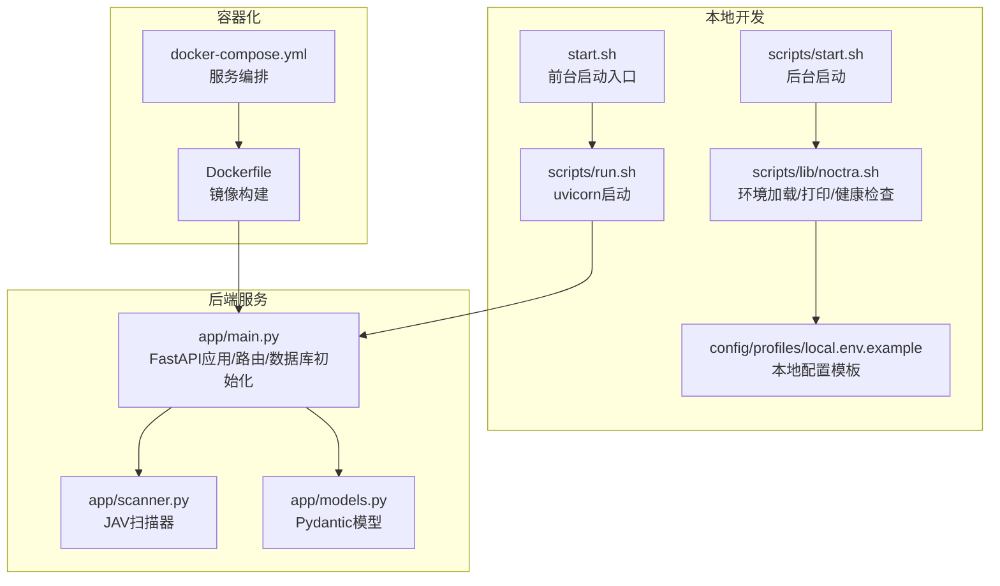
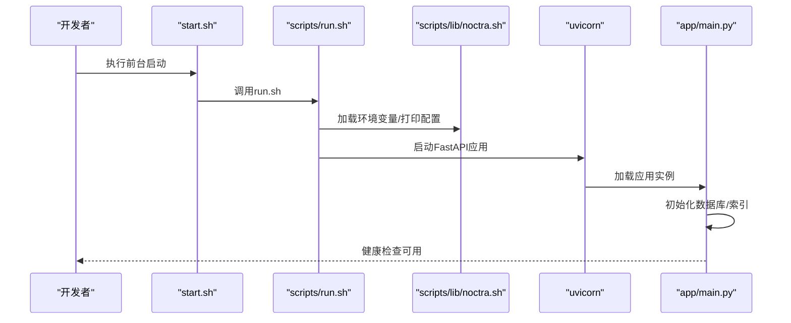
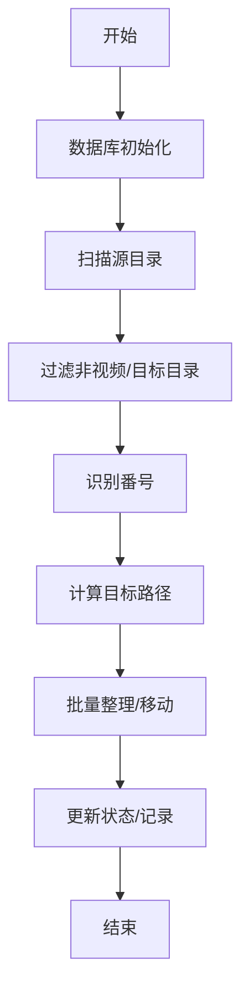
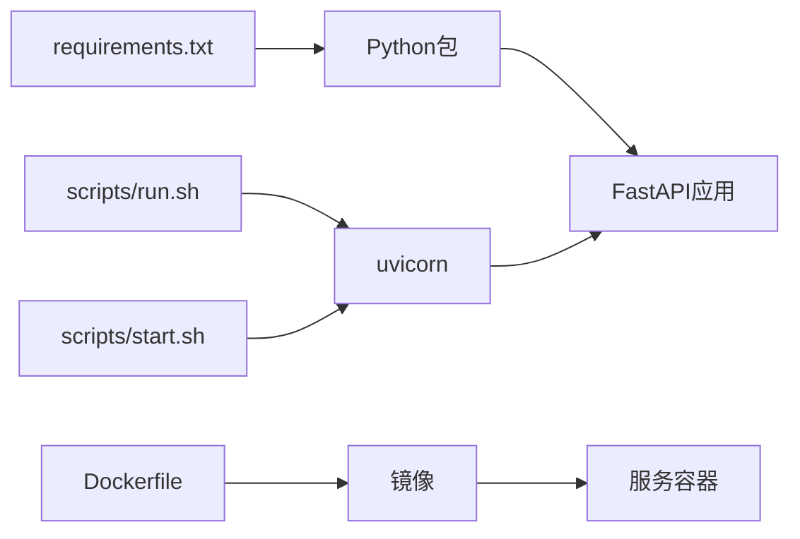

# 本地开发部署

<cite>
**本文引用的文件**
- [README.en.md](file://README.en.md)
- [requirements.txt](file://requirements.txt)
- [start.sh](file://start.sh)
- [scripts/start-local.sh](file://scripts/start-local.sh)
- [scripts/start.sh](file://scripts/start.sh)
- [scripts/run.sh](file://scripts/run.sh)
- [scripts/lib/noctra.sh](file://scripts/lib/noctra.sh)
- [config/profiles/local.env.example](file://config/profiles/local.env.example)
- [docs/local-startup.md](file://docs/local-startup.md)
- [Dockerfile](file://Dockerfile)
- [docker-compose.yml](file://docker-compose.yml)
- [app/main.py](file://app/main.py)
- [app/models.py](file://app/models.py)
- [app/scanner.py](file://app/scanner.py)
- [tests/conftest.py](file://tests/conftest.py)
</cite>

## 目录
1. [简介](#简介)
2. [项目结构](#项目结构)
3. [核心组件](#核心组件)
4. [架构总览](#架构总览)
5. [详细组件分析](#详细组件分析)
6. [依赖关系分析](#依赖关系分析)
7. [性能考虑](#性能考虑)
8. [故障排查指南](#故障排查指南)
9. [结论](#结论)
10. [附录](#附录)

## 简介
本指南面向在本地或NAS环境下进行Noctra开发与调试的工程师，覆盖从Python环境搭建、虚拟环境与依赖安装，到本地启动脚本使用、环境变量配置、健康检查与日志输出，再到IDE集成、代码格式化与开发工具链建议，以及常见问题排查与性能调试技巧。Noctra后端基于FastAPI + SQLite，前端为无构建的静态页面，整体以脚本驱动的本地/容器化启动方式为主。

## 项目结构
仓库采用按职责分层的组织方式：
- app：后端FastAPI应用与业务逻辑（扫描、整理、刮削等）
- scripts：本地/容器启动、停止、状态查询与辅助脚本
- config/profiles：本地/NAS配置示例
- docs：运行时、部署与设计文档
- tests：单元与集成测试
- 静态资源：static/ 下的HTML/CSS/JS
- Docker相关：Dockerfile、docker-compose.yml

图表来源
- [start.sh:1-8](file://start.sh#L1-L8)
- [scripts/start.sh:1-42](file://scripts/start.sh#L1-L42)
- [scripts/run.sh:1-21](file://scripts/run.sh#L1-L21)
- [scripts/lib/noctra.sh:1-148](file://scripts/lib/noctra.sh#L1-L148)
- [config/profiles/local.env.example:1-23](file://config/profiles/local.env.example#L1-L23)
- [app/main.py:1-1384](file://app/main.py#L1-L1384)
- [app/scanner.py:1-161](file://app/scanner.py#L1-L161)
- [app/models.py:1-216](file://app/models.py#L1-L216)
- [Dockerfile:1-31](file://Dockerfile#L1-L31)
- [docker-compose.yml:1-28](file://docker-compose.yml#L1-L28)

章节来源
- [README.en.md:58-72](file://README.en.md#L58-L72)
- [docs/local-startup.md:1-99](file://docs/local-startup.md#L1-L99)

## 核心组件
- FastAPI后端与路由：负责扫描、整理、历史、刮削等API，挂载静态资源，启动时初始化SQLite表结构。
- 扫描器：递归扫描源目录，识别番号，过滤非视频与目标目录，返回候选集。
- 模型定义：使用Pydantic定义请求/响应模型，确保接口契约清晰。
- 启动脚本体系：提供前台/后台启动、健康检查、进程管理与日志输出。

章节来源
- [app/main.py:58-130](file://app/main.py#L58-L130)
- [app/scanner.py:67-125](file://app/scanner.py#L67-L125)
- [app/models.py:7-216](file://app/models.py#L7-L216)
- [scripts/start.sh:14-41](file://scripts/start.sh#L14-L41)
- [scripts/run.sh:20](file://scripts/run.sh#L20)

## 架构总览
本地开发采用“脚本驱动 + uvicorn + FastAPI + SQLite”的轻量方案；容器化通过Dockerfile与docker-compose实现端口映射、卷挂载与环境变量注入。

图表来源
- [start.sh:7](file://start.sh#L7)
- [scripts/run.sh:9-20](file://scripts/run.sh#L9-L20)
- [scripts/lib/noctra.sh:13-96](file://scripts/lib/noctra.sh#L13-L96)
- [app/main.py:127-130](file://app/main.py#L127-L130)

## 详细组件分析

### Python环境与虚拟环境
- 使用标准库venv创建虚拟环境，并安装requirements.txt中的依赖。
- 脚本会自动检测仓库根下的.virtenv/venv可执行Python，优先使用本地Python二进制。
- 若未指定Python二进制，将回退到系统python3。

章节来源
- [README.en.md:22-24](file://README.en.md#L22-L24)
- [requirements.txt:1-12](file://requirements.txt#L1-L12)
- [scripts/lib/noctra.sh:64-72](file://scripts/lib/noctra.sh#L64-L72)

### 本地启动脚本与工作流
- 前台启动：./start.sh，适合调试；内部调用scripts/run.sh。
- 后台启动：NOCTRA_PROFILE=local ./scripts/start.sh，守护进程方式运行，写入PID文件，输出server.log。
- 健康检查：/api/health用于确认服务就绪与当前配置。
- 状态查看：./scripts/status.sh显示当前profile、源/目标/数据库路径、进程状态与健康URL。
- 停止服务：./scripts/stop.sh，清理PID文件并尝试优雅/强制终止。

章节来源
- [docs/local-startup.md:7-18](file://docs/local-startup.md#L7-L18)
- [docs/local-startup.md:44-64](file://docs/local-startup.md#L44-L64)
- [scripts/start.sh:14-41](file://scripts/start.sh#L14-L41)
- [scripts/run.sh:16-17](file://scripts/run.sh#L16-L17)

### 环境变量与配置文件
- 本地配置模板：config/profiles/local.env.example，包含绑定主机、端口、源/目标/数据/数据库路径等默认值。
- 环境加载：scripts/lib/noctra.sh负责加载profile文件、设置默认值、创建必要目录、导出SOURCE_DIR/DIST_DIR/DB_PATH等。
- 可选LLM相关变量：如启用外部LLM辅助元数据提取时可配置相关参数。
- Docker环境变量：docker-compose.yml中通过环境变量注入，支持代理与LLM参数。

章节来源
- [config/profiles/local.env.example:1-23](file://config/profiles/local.env.example#L1-L23)
- [scripts/lib/noctra.sh:13-73](file://scripts/lib/noctra.sh#L13-L73)
- [docker-compose.yml:16-27](file://docker-compose.yml#L16-L27)

### 开发服务器启动与健康检查
- uvicorn启动：scripts/run.sh直接调用uvicorn启动app.main:app，绑定host/port。
- 健康检查：scripts/start.sh等待健康端点可用，超时则打印最近日志并退出。
- 日志输出：后台启动将标准输出/错误重定向至logs/server.log。

章节来源
- [scripts/run.sh:20](file://scripts/run.sh#L20)
- [scripts/start.sh:32-41](file://scripts/start.sh#L32-L41)
- [scripts/lib/noctra.sh:27](file://scripts/lib/noctra.sh#L27)

### 热重载与调试配置
- 本地推荐使用前台启动（./start.sh）以便在代码变更时快速重启与观察日志。
- 如需容器内热重载，可在Dockerfile基础上调整开发模式（例如挂载源码目录），但仓库默认以生产模式运行uvicorn。
- 建议在IDE中直接运行uvicorn（参考scripts/run.sh的参数）以获得更好的断点与堆栈跟踪体验。

章节来源
- [docs/local-startup.md:95-96](file://docs/local-startup.md#L95-L96)
- [scripts/run.sh:20](file://scripts/run.sh#L20)

### IDE集成、代码格式化与工具链
- 代码风格：使用Pydantic模型定义API契约，建议配合类型检查工具（如mypy）与格式化工具（如black/ ruff）统一风格。
- 测试隔离：tests/conftest.py通过模块替换屏蔽第三方依赖导入，便于API级测试稳定运行。
- 前端：静态资源位于static/，无需构建即可访问；建议在IDE中开启Live Server或类似插件以提升前端调试效率。

章节来源
- [app/models.py:7-216](file://app/models.py#L7-L216)
- [tests/conftest.py:1-20](file://tests/conftest.py#L1-L20)

### 数据库与扫描/整理流程
- 数据库初始化：app/main.py在startup事件中创建files表与刮削相关列，确保向后兼容。
- 扫描：app/scanner.py递归遍历源目录，过滤dist子树与非视频文件，识别番号并返回候选集。
- 整理：根据识别结果计算目标路径，批量移动文件并更新状态。

图表来源
- [app/main.py:78-125](file://app/main.py#L78-L125)
- [app/scanner.py:67-125](file://app/scanner.py#L67-L125)

章节来源
- [app/main.py:78-125](file://app/main.py#L78-L125)
- [app/scanner.py:67-125](file://app/scanner.py#L67-L125)

### 刮削与日志
- 刮削模型：app/models.py定义了刮削相关的请求/响应与日志条目结构。
- 日志解析：app/main.py提供解析刮削日志的辅助函数，支持JSON结构与校验。
- 输出目录与制品：根据目标路径解析NFO/海报等制品文件，支持排序与查找。

章节来源
- [app/models.py:106-216](file://app/models.py#L106-L216)
- [app/main.py:242-398](file://app/main.py#L242-L398)

## 依赖关系分析
- 后端依赖：FastAPI、uvicorn、pydantic、aiosqlite、BeautifulSoup4、lxml、aiohttp、aiofiles、Pillow等。
- 启动脚本依赖：bash环境、curl（健康检查）、setsid/nohup（后台守护）。
- 容器化：Dockerfile基于python:3.11-slim，复制requirements.txt并安装依赖，暴露8000端口。

图表来源
- [requirements.txt:1-12](file://requirements.txt#L1-L12)
- [scripts/run.sh:20](file://scripts/run.sh#L20)
- [scripts/start.sh:25-29](file://scripts/start.sh#L25-L29)
- [Dockerfile:1-31](file://Dockerfile#L1-L31)

章节来源
- [requirements.txt:1-12](file://requirements.txt#L1-L12)
- [Dockerfile:1-31](file://Dockerfile#L1-L31)

## 性能考虑
- 扫描性能：递归扫描源目录，建议将源/目标目录置于本地SSD，避免跨盘/网络存储导致I/O瓶颈。
- 数据库：SQLite在小规模场景表现良好，若并发较高可考虑迁移至更健壮的数据库。
- 并发与I/O：整理阶段使用异步I/O与线程池（如move_file）降低阻塞，建议合理设置系统ulimit与磁盘队列深度。
- 前端：静态资源无需构建，直接访问，减少开发时的编译开销。

## 故障排查指南
- 服务未启动
  - 检查健康端点：curl http://127.0.0.1:4020/api/health
  - 查看日志：tail -f logs/server.log
  - 确认端口占用与防火墙策略
- 配置不生效
  - 确认是否正确加载local.env（./scripts/status.sh可验证）
  - 检查NOCTRA_PROFILE与NOCTRA_PROFILE_FILE路径
- 扫描不到文件
  - 确认SOURCE_DIR存在且包含视频文件
  - 排查should_skip逻辑（dist子树会被跳过）
- 整理失败
  - 检查目标路径权限与磁盘空间
  - 关注状态机：pending/duplicate/target_exists/failed等
- 测试失败
  - tests/conftest.py已屏蔽部分第三方依赖导入，确保测试环境稳定

章节来源
- [scripts/start.sh:32-41](file://scripts/start.sh#L32-L41)
- [scripts/lib/noctra.sh:75-96](file://scripts/lib/noctra.sh#L75-L96)
- [app/scanner.py:21-31](file://app/scanner.py#L21-L31)
- [tests/conftest.py:1-20](file://tests/conftest.py#L1-L20)

## 结论
通过脚本化的本地启动流程与清晰的环境变量体系，Noctra能够在本地快速迭代与调试。结合前台启动、健康检查与日志输出，开发者可以高效定位问题并优化性能。建议在IDE中直接运行uvicorn以获得最佳调试体验，并将自定义配置放入local.env以避免污染脚本与代码。

## 附录
- 快速开始
  - 创建虚拟环境并安装依赖
  - 前台启动：./start.sh
  - 健康检查：curl http://127.0.0.1:4020/api/health
- 常用命令
  - 后台启动：NOCTRA_PROFILE=local ./scripts/start.sh
  - 查看状态：./scripts/status.sh
  - 停止服务：./scripts/stop.sh
- 容器化参考
  - Dockerfile与docker-compose.yml可用于本地或NAS部署

章节来源
- [README.en.md:16-25](file://README.en.md#L16-L25)
- [docs/local-startup.md:44-64](file://docs/local-startup.md#L44-L64)
- [Dockerfile:1-31](file://Dockerfile#L1-L31)
- [docker-compose.yml:1-28](file://docker-compose.yml#L1-L28)