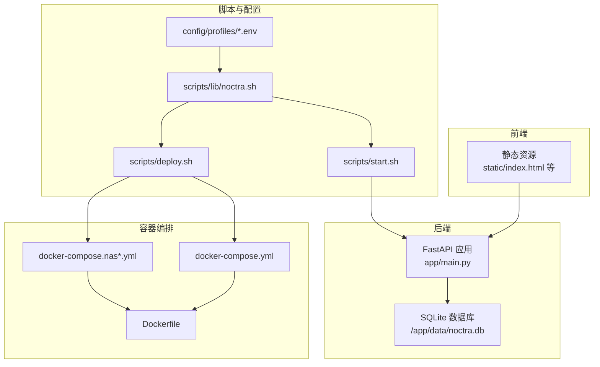
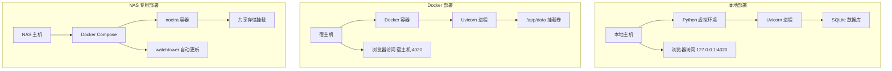
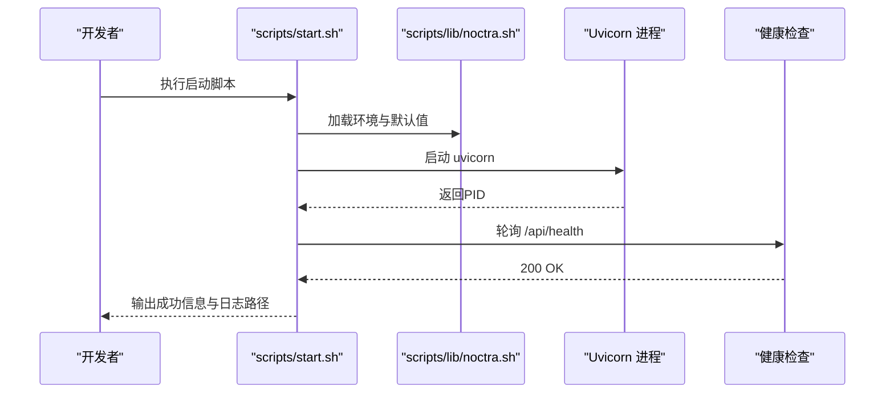
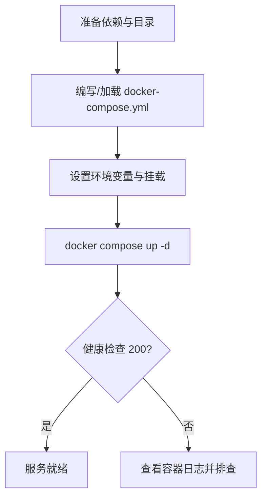
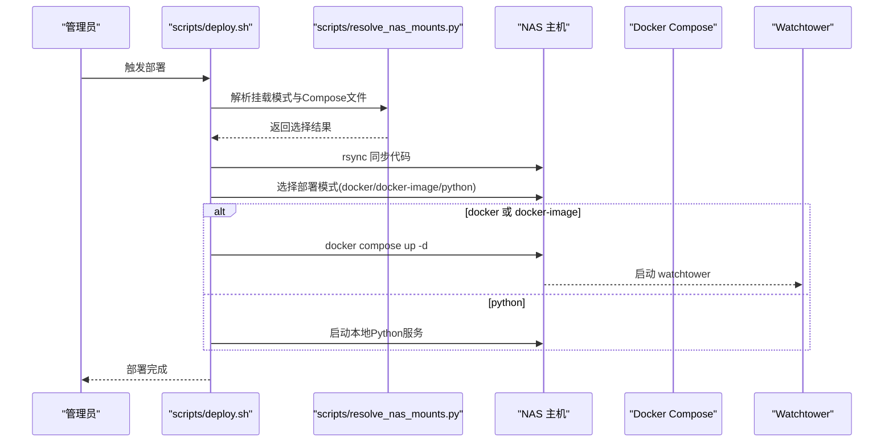
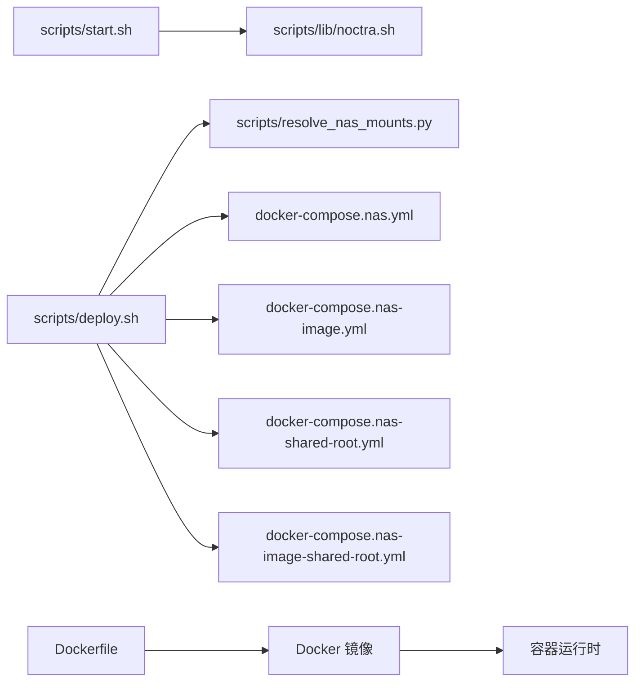

# 部署指南

<cite>
**本文引用的文件**
- [README.en.md](file://README.en.md)
- [Dockerfile](file://Dockerfile)
- [docker-compose.yml](file://docker-compose.yml)
- [requirements.txt](file://requirements.txt)
- [scripts/deploy.sh](file://scripts/deploy.sh)
- [scripts/start.sh](file://scripts/start.sh)
- [scripts/start-local.sh](file://scripts/start-local.sh)
- [scripts/start-noctra-nas.sh](file://scripts/start-noctra-nas.sh)
- [scripts/lib/noctra.sh](file://scripts/lib/noctra.sh)
- [scripts/resolve_nas_mounts.py](file://scripts/resolve_nas_mounts.py)
- [config/profiles/local.env.example](file://config/profiles/local.env.example)
- [config/profiles/nas.env.example](file://config/profiles/nas.env.example)
- [docker-compose.nas.yml](file://docker-compose.nas.yml)
- [docker-compose.nas-image.yml](file://docker-compose.nas-image.yml)
- [docker-compose.nas-shared-root.yml](file://docker-compose.nas-shared-root.yml)
- [docker-compose.nas-image-shared-root.yml](file://docker-compose.nas-image-shared-root.yml)
</cite>

## 目录
1. [简介](#简介)
2. [项目结构](#项目结构)
3. [核心组件](#核心组件)
4. [架构总览](#架构总览)
5. [详细组件分析](#详细组件分析)
6. [依赖关系分析](#依赖关系分析)
7. [性能考虑](#性能考虑)
8. [故障排除指南](#故障排除指南)
9. [结论](#结论)
10. [附录](#附录)

## 简介
本指南面向Noctra的三种部署方式：本地运行、Docker容器化部署与NAS专用部署。内容覆盖环境准备、依赖安装、服务配置与启动验证，并对各部署方式的优缺点与适用场景进行对比。同时提供监控、日志管理、维护操作、故障排除、性能调优与安全加固的最佳实践。

## 项目结构
- 后端为FastAPI + SQLite，前端为无构建的静态页面（Alpine.js + 原生JS模块）。
- 配置通过环境变量与多份docker-compose文件支持多种NAS挂载模式。
- 提供脚本用于本地启动、远程部署与NAS挂载解析。

图表来源
- [docker-compose.yml:1-28](file://docker-compose.yml#L1-L28)
- [docker-compose.nas.yml:1-33](file://docker-compose.nas.yml#L1-L33)
- [docker-compose.nas-image.yml:1-51](file://docker-compose.nas-image.yml#L1-L51)
- [Dockerfile:1-31](file://Dockerfile#L1-L31)
- [scripts/start.sh:1-42](file://scripts/start.sh#L1-L42)
- [scripts/deploy.sh:1-106](file://scripts/deploy.sh#L1-L106)
- [scripts/lib/noctra.sh:1-148](file://scripts/lib/noctra.sh#L1-L148)
- [config/profiles/local.env.example:1-23](file://config/profiles/local.env.example#L1-L23)
- [config/profiles/nas.env.example:1-44](file://config/profiles/nas.env.example#L1-L44)

章节来源
- [README.en.md:58-72](file://README.en.md#L58-L72)

## 核心组件
- 后端入口与服务
  - Uvicorn作为ASGI服务器启动FastAPI应用，默认监听0.0.0.0:8000。
  - 健康检查端点用于启动验证。
- 前端静态资源
  - 无构建的单页应用，通过本地或容器内路径提供。
- 配置系统
  - 通过环境变量与多份compose文件实现不同部署场景的参数化。
- 脚本工具
  - 启动脚本负责守护进程化启动、健康检查与日志输出。
  - 部署脚本支持远程部署、镜像拉取与Compose选择。
  - NAS挂载解析脚本根据源/目标目录与请求模式自动选择合适的Compose文件与挂载策略。

章节来源
- [Dockerfile:26-31](file://Dockerfile#L26-L31)
- [scripts/start.sh:25-42](file://scripts/start.sh#L25-L42)
- [scripts/deploy.sh:69-102](file://scripts/deploy.sh#L69-L102)
- [scripts/resolve_nas_mounts.py:15-43](file://scripts/resolve_nas_mounts.py#L15-L43)

## 架构总览
下图展示三种部署方式的总体架构与交互：

图表来源
- [README.en.md:18-47](file://README.en.md#L18-L47)
- [docker-compose.yml:1-28](file://docker-compose.yml#L1-L28)
- [docker-compose.nas-image.yml:1-51](file://docker-compose.nas-image.yml#L1-L51)
- [scripts/start.sh:25-42](file://scripts/start.sh#L25-L42)

## 详细组件分析

### 本地部署（Local）
- 环境准备
  - 准备Python 3.11+与虚拟环境。
  - 安装依赖：使用提供的依赖清单安装后端所需包。
- 服务配置
  - 使用本地配置文件覆盖默认值（如绑定地址、端口、源/目标目录、数据库路径等）。
- 启动与验证
  - 通过启动脚本以守护进程方式启动Uvicorn。
  - 访问健康检查端点确认服务可用。
- 日志与维护
  - 日志输出到指定目录；可使用tail实时查看。
  - 支持停止旧进程并重启，便于升级。

图表来源
- [scripts/start.sh:13-42](file://scripts/start.sh#L13-L42)
- [scripts/lib/noctra.sh:13-96](file://scripts/lib/noctra.sh#L13-L96)

章节来源
- [README.en.md:18-33](file://README.en.md#L18-L33)
- [scripts/start-local.sh:1-9](file://scripts/start-local.sh#L1-L9)
- [config/profiles/local.env.example:1-23](file://config/profiles/local.env.example#L1-L23)

### Docker 容器化部署
- 环境准备
  - 安装Docker与Docker Compose。
  - 准备源目录、目标目录与数据目录的挂载路径。
- 服务配置
  - 使用通用compose文件定义端口映射、卷挂载与环境变量。
  - 可通过环境变量控制代理、LLM开关与模型参数。
- 启动与验证
  - 通过Compose启动容器，映射端口至宿主机。
  - 访问健康检查端点确认服务可用。
- 优势
  - 隔离性好、依赖统一、便于迁移。
- 劣势
  - 需要Docker生态支持。

图表来源
- [docker-compose.yml:1-28](file://docker-compose.yml#L1-L28)
- [Dockerfile:1-31](file://Dockerfile#L1-L31)

章节来源
- [README.en.md:34-47](file://README.en.md#L34-L47)
- [docker-compose.yml:1-28](file://docker-compose.yml#L1-L28)
- [requirements.txt:1-12](file://requirements.txt#L1-L12)

### NAS 专用部署（含多种挂载模式）
- 场景说明
  - 适用于NAS直连媒体目录或共享根路径的部署。
  - 支持三种模式：按目录分别挂载、按共享根挂载、以及镜像拉取模式。
- 环境准备
  - 在NAS上准备SSH访问与Docker环境。
  - 准备源/目标目录与数据目录的NAS路径。
- 服务配置
  - 使用NAS专用Compose文件，支持CPU/内存限制与代理。
  - 可选集成watchtower实现自动更新。
- 启动与验证
  - 通过部署脚本完成远程同步、选择挂载模式与Compose文件，并启动服务。
  - 访问健康检查端点确认服务可用。
- 优势
  - 与NAS存储深度整合，适合长期归档与批量处理。
- 劣势
  - 对NAS系统与网络稳定性有要求。

图表来源
- [scripts/deploy.sh:1-106](file://scripts/deploy.sh#L1-L106)
- [scripts/resolve_nas_mounts.py:15-43](file://scripts/resolve_nas_mounts.py#L15-L43)
- [docker-compose.nas.yml:1-33](file://docker-compose.nas.yml#L1-L33)
- [docker-compose.nas-image.yml:1-51](file://docker-compose.nas-image.yml#L1-L51)

章节来源
- [README.en.md:14](file://README.en.md#L14)
- [scripts/deploy.sh:1-106](file://scripts/deploy.sh#L1-L106)
- [scripts/resolve_nas_mounts.py:15-43](file://scripts/resolve_nas_mounts.py#L15-L43)
- [config/profiles/nas.env.example:1-44](file://config/profiles/nas.env.example#L1-L44)

## 依赖关系分析
- 组件耦合
  - 启动脚本依赖配置库加载环境变量与默认值。
  - 部署脚本依赖NAS挂载解析脚本与Compose文件集合。
  - Docker镜像构建依赖依赖清单与Dockerfile。
- 外部依赖
  - Python运行时、FastAPI、Uvicorn、SQLite、第三方爬虫与图像处理库。
  - Docker与Docker Compose运行时。
- 接口契约
  - 健康检查端点用于启动验证。
  - 环境变量用于控制行为（如代理、LLM、时区等）。

图表来源
- [scripts/start.sh:1-42](file://scripts/start.sh#L1-L42)
- [scripts/lib/noctra.sh:1-148](file://scripts/lib/noctra.sh#L1-L148)
- [scripts/deploy.sh:1-106](file://scripts/deploy.sh#L1-L106)
- [scripts/resolve_nas_mounts.py:1-43](file://scripts/resolve_nas_mounts.py#L1-L43)
- [Dockerfile:1-31](file://Dockerfile#L1-L31)
- [docker-compose.nas.yml:1-33](file://docker-compose.nas.yml#L1-L33)
- [docker-compose.nas-image.yml:1-51](file://docker-compose.nas-image.yml#L1-L51)
- [docker-compose.nas-shared-root.yml:1-35](file://docker-compose.nas-shared-root.yml#L1-L35)
- [docker-compose.nas-image-shared-root.yml:1-53](file://docker-compose.nas-image-shared-root.yml#L1-L53)

章节来源
- [requirements.txt:1-12](file://requirements.txt#L1-L12)
- [Dockerfile:1-31](file://Dockerfile#L1-L31)

## 性能考虑
- 资源限制
  - 在NAS专用Compose中设置了CPU与内存上限，避免资源争用。
- I/O优化
  - 将数据库置于NAS数据盘，减少跨盘移动带来的延迟。
- 爬虫与并发
  - 合理设置并发与重试策略，避免对目标站点造成过大压力。
- 缓存与代理
  - 通过代理环境变量提升网络稳定性与访问速度。
- 前端静态资源
  - 保持无构建，减少启动与打包开销。

章节来源
- [docker-compose.nas.yml:28-33](file://docker-compose.nas.yml#L28-L33)
- [docker-compose.nas-image.yml:26-31](file://docker-compose.nas-image.yml#L26-L31)
- [config/profiles/nas.env.example:28-44](file://config/profiles/nas.env.example#L28-L44)

## 故障排除指南
- 启动失败
  - 查看启动脚本生成的日志文件，定位错误。
  - 确认健康检查端点可达，逐步排查网络与权限问题。
- 权限与挂载
  - 确保容器或进程对源/目标目录与数据目录具有读写权限。
  - 在NAS部署中，确认挂载模式与Compose文件匹配实际存储布局。
- 代理与网络
  - 如需代理，请在环境变量中正确配置HTTP/HTTPS代理。
- 升级与回滚
  - 使用watchtower自动更新时，关注容器标签与清理策略。
  - 回滚可通过切换镜像版本或重新部署历史Compose文件。

章节来源
- [scripts/start.sh:32-42](file://scripts/start.sh#L32-L42)
- [scripts/lib/noctra.sh:120-148](file://scripts/lib/noctra.sh#L120-L148)
- [docker-compose.nas-image.yml:32-53](file://docker-compose.nas-image.yml#L32-L53)

## 结论
- 本地部署适合开发与测试，快速迭代与调试成本低。
- Docker部署适合需要隔离与可移植性的场景，便于标准化运维。
- NAS专用部署适合大规模媒体整理与长期归档，与NAS存储深度整合。
- 建议结合监控、日志与定期维护，确保系统稳定与性能。

## 附录

### 环境准备与依赖安装
- 本地运行
  - 准备Python虚拟环境并安装依赖清单中的包。
- Docker运行
  - 安装Docker与Docker Compose，准备挂载目录。
- NAS部署
  - 准备NAS SSH访问、Docker环境与共享存储路径。

章节来源
- [requirements.txt:1-12](file://requirements.txt#L1-L12)
- [README.en.md:18-47](file://README.en.md#L18-L47)

### 服务配置要点
- 本地配置
  - 绑定地址、端口、源/目标目录、数据库路径、可选LLM参数。
- Docker配置
  - 端口映射、卷挂载、环境变量（代理、LLM、时区）。
- NAS配置
  - 挂载模式（按目录/共享根）、Compose文件选择、watchtower调度。

章节来源
- [config/profiles/local.env.example:1-23](file://config/profiles/local.env.example#L1-L23)
- [config/profiles/nas.env.example:1-44](file://config/profiles/nas.env.example#L1-L44)
- [docker-compose.yml:1-28](file://docker-compose.yml#L1-L28)
- [docker-compose.nas.yml:1-33](file://docker-compose.nas.yml#L1-L33)
- [docker-compose.nas-image.yml:1-51](file://docker-compose.nas-image.yml#L1-L51)

### 启动与验证流程
- 本地
  - 启动脚本守护进程化启动，健康检查通过后输出日志路径。
- Docker
  - Compose启动容器，映射端口，健康检查通过。
- NAS
  - 部署脚本完成同步与选择模式，启动服务并验证。

章节来源
- [scripts/start.sh:13-42](file://scripts/start.sh#L13-L42)
- [scripts/deploy.sh:49-102](file://scripts/deploy.sh#L49-L102)
- [README.en.md:16-25](file://README.en.md#L16-L25)

### 监控、日志与维护
- 日志
  - 启动脚本将标准输出与错误输出重定向至日志文件，支持实时查看。
- 监控
  - 健康检查端点用于存活探测；可结合外部监控系统。
- 维护
  - 定期备份数据库与配置；必要时清理缓存与临时文件。

章节来源
- [scripts/start.sh:25-42](file://scripts/start.sh#L25-L42)
- [scripts/lib/noctra.sh:75-96](file://scripts/lib/noctra.sh#L75-L96)

### 安全加固建议
- 网络
  - 仅在受信任网络内暴露端口；必要时启用反向代理与TLS。
- 权限
  - 最小权限原则：仅授予容器或进程必要的读写权限。
- 更新
  - 使用watchtower自动更新时，关注镜像来源与签名；或手动拉取最新镜像后重启。
- 代理与隐私
  - 明确代理配置，避免敏感流量泄露；合理设置LLM访问策略。

章节来源
- [docker-compose.nas-image.yml:32-53](file://docker-compose.nas-image.yml#L32-L53)
- [config/profiles/nas.env.example:28-44](file://config/profiles/nas.env.example#L28-L44)