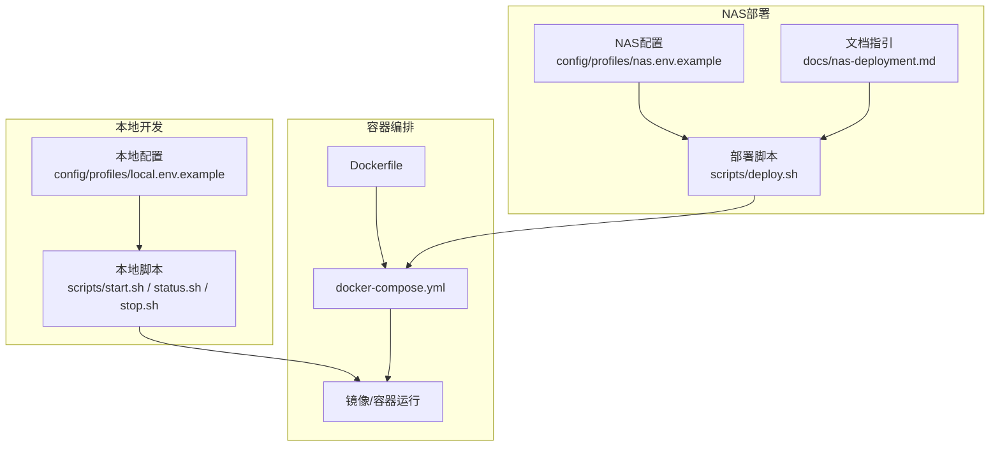
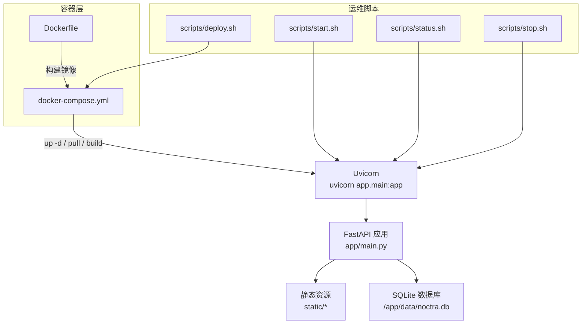
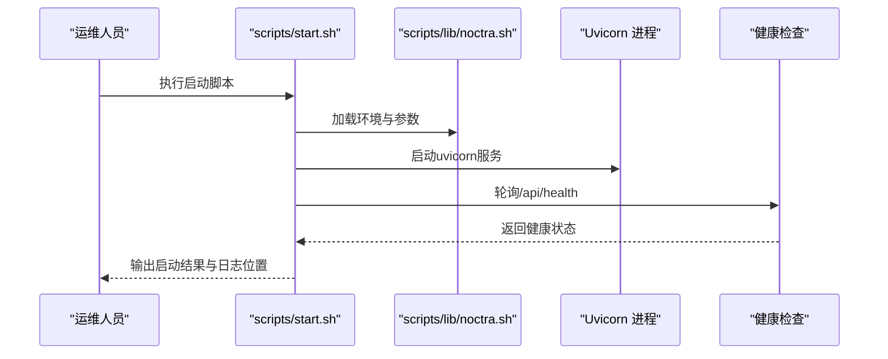
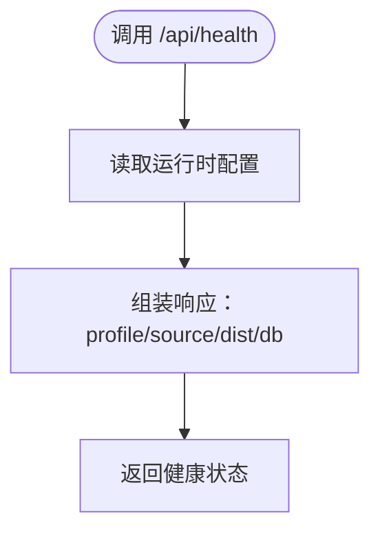
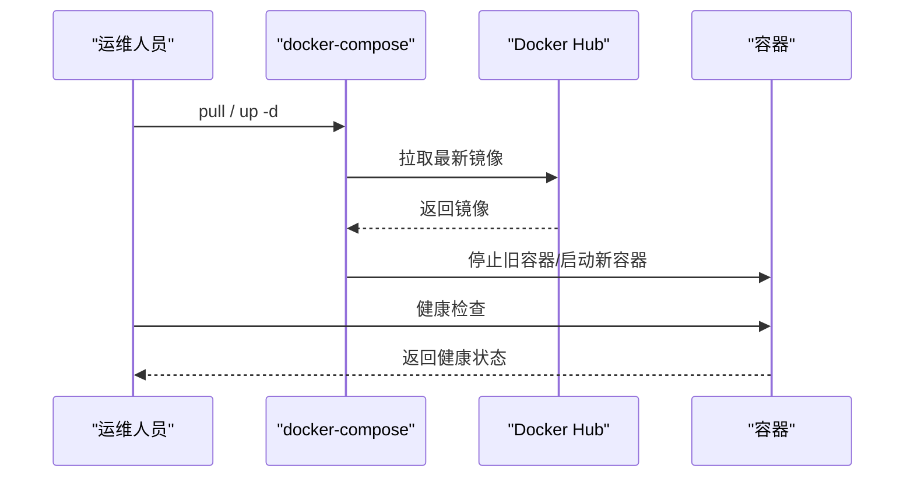
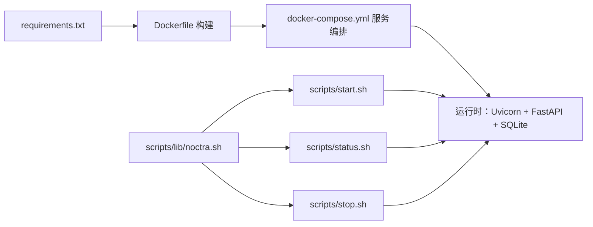

# 部署运维管理

<cite>
**本文引用的文件**
- [README.en.md](file://README.en.md)
- [Dockerfile](file://Dockerfile)
- [docker-compose.yml](file://docker-compose.yml)
- [scripts/deploy.sh](file://scripts/deploy.sh)
- [scripts/start.sh](file://scripts/start.sh)
- [scripts/stop.sh](file://scripts/stop.sh)
- [scripts/status.sh](file://scripts/status.sh)
- [scripts/lib/noctra.sh](file://scripts/lib/noctra.sh)
- [config/profiles/local.env.example](file://config/profiles/local.env.example)
- [config/profiles/nas.env.example](file://config/profiles/nas.env.example)
- [docs/nas-deployment.md](file://docs/nas-deployment.md)
- [docs/local-startup.md](file://docs/local-startup.md)
- [docs/runtime-workflow.md](file://docs/runtime-workflow.md)
- [app/main.py](file://app/main.py)
- [requirements.txt](file://requirements.txt)
</cite>

## 目录
1. [简介](#简介)
2. [项目结构](#项目结构)
3. [核心组件](#核心组件)
4. [架构总览](#架构总览)
5. [详细组件分析](#详细组件分析)
6. [依赖关系分析](#依赖关系分析)
7. [性能与资源监控](#性能与资源监控)
8. [故障排查指南](#故障排查指南)
9. [结论](#结论)
10. [附录](#附录)

## 简介
本指南面向Noctra在本地与NAS环境的部署与运维管理，覆盖服务生命周期（启动、停止、状态检查）、监控与健康检查、日志分析、部署更新与版本回滚、配置变更、备份恢复、数据迁移与灾难恢复、安全加固与访问控制，以及常见问题的快速解决与预防措施。内容基于仓库中的脚本、配置与文档，确保可操作性与可追溯性。

## 项目结构
Noctra采用前后端分离的轻量架构：FastAPI后端 + 静态前端资源；容器化部署通过Docker与docker-compose实现；运维脚本集中在scripts目录，配置通过profiles目录的环境文件按档位加载。

图表来源
- [scripts/start.sh:1-42](file://scripts/start.sh#L1-L42)
- [scripts/status.sh:1-29](file://scripts/status.sh#L1-L29)
- [scripts/stop.sh:1-19](file://scripts/stop.sh#L1-L19)
- [Dockerfile:1-31](file://Dockerfile#L1-L31)
- [docker-compose.yml:1-28](file://docker-compose.yml#L1-L28)
- [scripts/deploy.sh:1-106](file://scripts/deploy.sh#L1-L106)
- [config/profiles/local.env.example:1-23](file://config/profiles/local.env.example#L1-L23)
- [config/profiles/nas.env.example:1-44](file://config/profiles/nas.env.example#L1-L44)
- [docs/nas-deployment.md:1-125](file://docs/nas-deployment.md#L1-L125)

章节来源
- [README.en.md: 58-72:58-72](file://README.en.md#L58-L72)
- [docker-compose.yml: 1-28:1-28](file://docker-compose.yml#L1-L28)
- [Dockerfile: 1-31:1-31](file://Dockerfile#L1-L31)
- [scripts/lib/noctra.sh: 13-73:13-73](file://scripts/lib/noctra.sh#L13-L73)

## 核心组件
- 运维脚本与工具
  - 启动/停止/状态检查：scripts/start.sh、scripts/stop.sh、scripts/status.sh
  - 部署脚本：scripts/deploy.sh（支持远程同步、选择部署模式）
  - 通用环境加载与参数解析：scripts/lib/noctra.sh
- 配置体系
  - 本地配置：config/profiles/local.env.example
  - NAS配置：config/profiles/nas.env.example
  - 运行时工作流与档案：docs/runtime-workflow.md
- 容器与镜像
  - Dockerfile定义基础镜像、依赖安装、暴露端口与启动命令
  - docker-compose.yml定义服务、端口映射、卷挂载与环境变量
- 文档与指引
  - docs/nas-deployment.md：NAS部署、代理、健康检查与Watchtower自动更新
  - docs/local-startup.md：本地启动、健康检查与调试建议
  - README.en.md：快速启动、典型工作流与仓库布局

章节来源
- [scripts/start.sh: 1-42:1-42](file://scripts/start.sh#L1-L42)
- [scripts/stop.sh: 1-19:1-19](file://scripts/stop.sh#L1-L19)
- [scripts/status.sh: 1-29:1-29](file://scripts/status.sh#L1-L29)
- [scripts/deploy.sh: 1-106:1-106](file://scripts/deploy.sh#L1-L106)
- [scripts/lib/noctra.sh: 13-73:13-73](file://scripts/lib/noctra.sh#L13-L73)
- [config/profiles/local.env.example: 1-23:1-23](file://config/profiles/local.env.example#L1-L23)
- [config/profiles/nas.env.example: 1-44:1-44](file://config/profiles/nas.env.example#L1-L44)
- [docs/nas-deployment.md: 1-125:1-125](file://docs/nas-deployment.md#L1-L125)
- [docs/local-startup.md: 1-99:1-99](file://docs/local-startup.md#L1-L99)
- [docs/runtime-workflow.md: 1-67:1-67](file://docs/runtime-workflow.md#L1-L67)
- [Dockerfile: 1-31:1-31](file://Dockerfile#L1-L31)
- [docker-compose.yml: 1-28:1-28](file://docker-compose.yml#L1-L28)

## 架构总览
Noctra的运行时由Uvicorn承载的FastAPI服务组成，SQLite作为本地存储；前端为静态资源。容器化部署通过docker-compose编排，支持多种挂载策略与部署模式；NAS场景可通过deploy.sh进行远程同步与启动。

图表来源
- [app/main.py: 58-130:58-130](file://app/main.py#L58-L130)
- [Dockerfile: 29-31:29-31](file://Dockerfile#L29-L31)
- [docker-compose.yml: 10-27:10-27](file://docker-compose.yml#L10-L27)
- [scripts/start.sh: 25-31:25-31](file://scripts/start.sh#L25-L31)
- [scripts/status.sh: 24-28:24-28](file://scripts/status.sh#L24-L28)
- [scripts/stop.sh: 11-18:11-18](file://scripts/stop.sh#L11-L18)
- [scripts/deploy.sh: 81-102:81-102](file://scripts/deploy.sh#L81-L102)

## 详细组件分析

### 服务生命周期管理
- 启动
  - 本地：./start.sh（前台）或 NOCTRA_PROFILE=local ./scripts/start.sh（后台）
  - NAS：./scripts/deploy.sh nas（远程同步代码与配置后在NAS侧启动）
- 停止
  - scripts/stop.sh 停止后台进程并清理PID文件
- 状态检查
  - scripts/status.sh 输出配置与健康状态（curl健康检查URL）

图表来源
- [scripts/start.sh: 9-31:9-31](file://scripts/start.sh#L9-L31)
- [scripts/lib/noctra.sh: 13-73:13-73](file://scripts/lib/noctra.sh#L13-L73)
- [scripts/status.sh: 24-28:24-28](file://scripts/status.sh#L24-L28)

章节来源
- [scripts/start.sh: 14-41:14-41](file://scripts/start.sh#L14-L41)
- [scripts/stop.sh: 11-18:11-18](file://scripts/stop.sh#L11-L18)
- [scripts/status.sh: 17-28:17-28](file://scripts/status.sh#L17-L28)
- [scripts/lib/noctra.sh: 111-129:111-129](file://scripts/lib/noctra.sh#L111-L129)

### 监控与健康检查
- 健康检查端点：/api/health，返回当前profile、source_dir、dist_dir、db_path等
- 本地健康检查示例：curl http://127.0.0.1:4020/api/health
- NAS健康检查示例：curl http://127.0.0.1:8888/api/health（需按实际端口调整）

图表来源
- [docs/local-startup.md: 58-64:58-64](file://docs/local-startup.md#L58-L64)
- [docs/nas-deployment.md: 113-124:113-124](file://docs/nas-deployment.md#L113-L124)
- [app/main.py: 127-130:127-130](file://app/main.py#L127-L130)

章节来源
- [docs/local-startup.md: 58-64:58-64](file://docs/local-startup.md#L58-L64)
- [docs/nas-deployment.md: 113-124:113-124](file://docs/nas-deployment.md#L113-L124)
- [app/main.py: 127-130:127-130](file://app/main.py#L127-L130)

### 日志分析
- 本地日志：scripts/start.sh 将输出重定向至 logs/server.log
- 建议：启动后使用 tail -f logs/server.log 实时观察
- 错误定位：启动失败时脚本会打印最后20行日志

章节来源
- [scripts/start.sh: 26-40:26-40](file://scripts/start.sh#L26-L40)

### 部署更新与版本回滚
- 镜像拉取与更新
  - docker-image模式：先pull再up -d，适合NAS直接拉取官方镜像
  - docker模式：up -d --build，适合需要在NAS侧构建的场景
- 自动更新（Watchtower）
  - NAS部署文档中提供Watchtower轮询镜像更新的配置与调度
- 版本回滚
  - 通过指定具体镜像标签进行回滚（如 acyua/noctra:vX.Y.Z）
  - 回滚后重启容器并验证健康检查

图表来源
- [docs/nas-deployment.md: 60-82:60-82](file://docs/nas-deployment.md#L60-L82)
- [scripts/deploy.sh: 82-95:82-95](file://scripts/deploy.sh#L82-L95)

章节来源
- [docs/nas-deployment.md: 14-23:14-23](file://docs/nas-deployment.md#L14-L23)
- [docs/nas-deployment.md: 60-82:60-82](file://docs/nas-deployment.md#L60-L82)
- [scripts/deploy.sh: 69-102:69-102](file://scripts/deploy.sh#L69-L102)

### 配置变更流程
- 本地配置
  - 复制 local.env.example 为 local.env，按需修改SOURCE_DIR/DIST_DIR/DB_PATH/PORT等
  - 通过 NOCTRA_PROFILE 指定使用哪个profile文件
- NAS配置
  - 复制 nas.env.example 为 nas.env，设置NAS专用路径与部署参数
  - 通过 ./scripts/deploy.sh nas 完成远程同步与启动
- 变更生效
  - 本地：scripts/start.sh 会加载最新配置并启动服务
  - NAS：deploy.sh 在远端执行相同流程

章节来源
- [docs/runtime-workflow.md: 9-29:9-29](file://docs/runtime-workflow.md#L9-L29)
- [docs/local-startup.md: 66-91:66-91](file://docs/local-startup.md#L66-L91)
- [config/profiles/local.env.example: 1-23:1-23](file://config/profiles/local.env.example#L1-L23)
- [config/profiles/nas.env.example: 1-44:1-44](file://config/profiles/nas.env.example#L1-L44)
- [scripts/deploy.sh: 44-61:44-61](file://scripts/deploy.sh#L44-L61)

### 备份恢复、数据迁移与灾难恢复
- 备份
  - 备份SQLite数据库文件 noctra.db 至安全位置
- 恢复
  - 停止服务后替换数据库文件，重启容器
- 迁移
  - 通过卷挂载将历史数据迁移到新的NAS路径或容器内
- 灾难恢复
  - 使用相同镜像与配置快速重建容器
  - 通过健康检查与UI验证服务可用性

章节来源
- [docs/nas-deployment.md: 268-285:268-285](file://docs/nas-deployment.md#L268-L285)

### 安全加固与访问控制
- 访问控制
  - 限制容器端口映射范围，仅开放必要端口
  - 使用反向代理或防火墙策略控制外部访问
- 凭据管理
  - 将敏感信息置于环境变量或外部密钥管理（不建议硬编码于仓库）
- 代理与网络
  - NAS Docker守护进程代理配置需与服务代理一致
- 最小权限
  - 卷挂载使用最小必要权限，避免过度授权

章节来源
- [docs/nas-deployment.md: 83-112:83-112](file://docs/nas-deployment.md#L83-L112)

## 依赖关系分析
- 运行时依赖
  - FastAPI、Uvicorn、aiosqlite、BeautifulSoup4、lxml、aiohttp、Pillow等
- 容器与编排
  - Dockerfile定义基础镜像与启动命令
  - docker-compose.yml定义服务、端口、卷与环境变量
- 运维脚本
  - scripts/lib/noctra.sh 提供环境加载、健康检查等待、进程停止等通用能力
  - scripts/start.sh/status.sh/stop.sh 与之配合完成生命周期管理

图表来源
- [requirements.txt: 1-12:1-12](file://requirements.txt#L1-L12)
- [Dockerfile: 12-18:12-18](file://Dockerfile#L12-L18)
- [docker-compose.yml: 10-27:10-27](file://docker-compose.yml#L10-L27)
- [scripts/lib/noctra.sh: 13-73:13-73](file://scripts/lib/noctra.sh#L13-L73)
- [scripts/start.sh: 25-31:25-31](file://scripts/start.sh#L25-L31)

章节来源
- [requirements.txt: 1-12:1-12](file://requirements.txt#L1-L12)
- [Dockerfile: 12-18:12-18](file://Dockerfile#L12-L18)
- [docker-compose.yml: 10-27:10-27](file://docker-compose.yml#L10-L27)
- [scripts/lib/noctra.sh: 13-73:13-73](file://scripts/lib/noctra.sh#L13-L73)

## 性能与资源监控
- 容器资源
  - 使用docker stats或平台自带监控查看CPU/内存/IO
- 应用层面
  - 通过 /api/health 与日志观察服务可用性
  - 关注扫描与整理任务的并发与磁盘IO表现
- 网络与代理
  - NAS需正确配置Docker守护进程代理，避免镜像拉取失败
- 端口与负载
  - 合理规划端口映射，避免冲突

章节来源
- [docs/nas-deployment.md: 113-124:113-124](file://docs/nas-deployment.md#L113-L124)

## 故障排查指南
- 无法访问Web界面
  - 检查端口映射与防火墙
  - 使用 curl http://<host>:<port>/api/health 验证健康
- 容器无法启动
  - 查看 docker-compose logs noctra
  - 检查卷挂载路径是否存在与权限是否足够
- 扫描不到文件
  - 确认挂载路径与目录权限
  - 确认SOURCE_DIR/DIST_DIR配置正确
- 启动失败
  - 查看 logs/server.log 最后20行
  - 确认依赖安装与端口占用情况

章节来源
- [docs/nas-deployment.md: 167-194:167-194](file://docs/nas-deployment.md#L167-L194)
- [scripts/start.sh: 37-40:37-40](file://scripts/start.sh#L37-L40)

## 结论
通过统一的脚本与配置体系，Noctra实现了在本地与NAS环境的一致化运维体验。结合健康检查、日志与容器监控，可有效保障服务稳定性；借助Watchtower与明确的部署更新流程，可实现平滑升级与快速回滚；完善的备份与灾难恢复策略则为数据安全提供保障。

## 附录
- 快速参考
  - 本地启动：./start.sh 或 NOCTRA_PROFILE=local ./scripts/start.sh
  - 本地状态：./scripts/status.sh
  - 本地停止：./scripts/stop.sh
  - NAS部署：./scripts/deploy.sh nas
  - 健康检查：curl http://<host>:<port>/api/health

章节来源
- [docs/local-startup.md: 58-64:58-64](file://docs/local-startup.md#L58-L64)
- [docs/nas-deployment.md: 113-124:113-124](file://docs/nas-deployment.md#L113-L124)
- [scripts/start.sh: 24-35:24-35](file://scripts/start.sh#L24-L35)