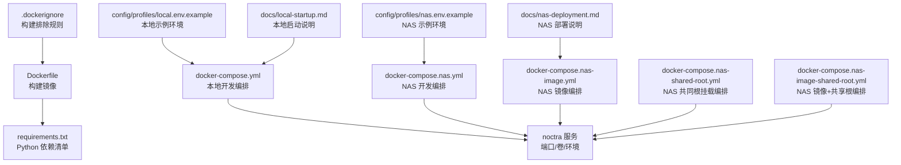
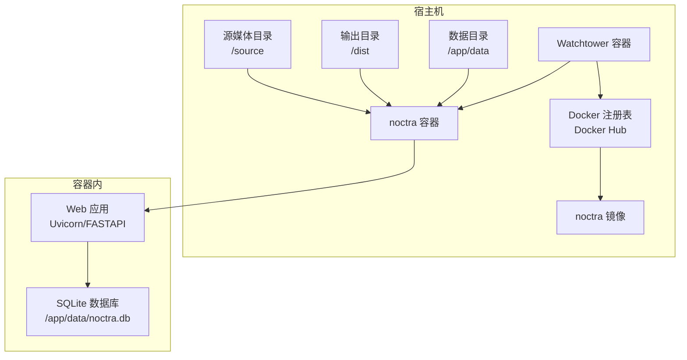
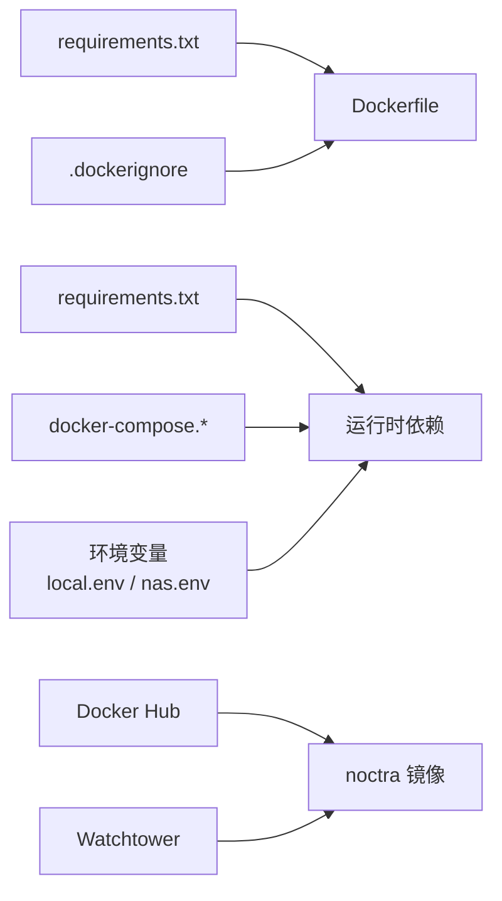

# Docker配置

<cite>
**本文引用的文件**
- [Dockerfile](file://Dockerfile)
- [.dockerignore](file://.dockerignore)
- [docker-compose.yml](file://docker-compose.yml)
- [docker-compose.nas.yml](file://docker-compose.nas.yml)
- [docker-compose.nas-image.yml](file://docker-compose.nas-image.yml)
- [docker-compose.nas-shared-root.yml](file://docker-compose.nas-shared-root.yml)
- [docker-compose.nas-image-shared-root.yml](file://docker-compose.nas-image-shared-root.yml)
- [config/profiles/local.env.example](file://config/profiles/local.env.example)
- [config/profiles/nas.env.example](file://config/profiles/nas.env.example)
- [docs/nas-deployment.md](file://docs/nas-deployment.md)
- [docs/local-startup.md](file://docs/local-startup.md)
- [scripts/start.sh](file://scripts/start.sh)
- [scripts/start-local.sh](file://scripts/start-local.sh)
- [scripts/start-noctra-nas.sh](file://scripts/start-noctra-nas.sh)
- [scripts/stop.sh](file://scripts/stop.sh)
- [scripts/stop-noctra-nas.sh](file://scripts/stop-noctra-nas.sh)
- [requirements.txt](file://requirements.txt)
</cite>

## 目录
1. [简介](#简介)
2. [项目结构](#项目结构)
3. [核心组件](#核心组件)
4. [架构总览](#架构总览)
5. [详细组件分析](#详细组件分析)
6. [依赖关系分析](#依赖关系分析)
7. [性能考虑](#性能考虑)
8. [故障排查指南](#故障排查指南)
9. [结论](#结论)
10. [附录](#附录)

## 简介
本文件系统性梳理 Noctra 的 Docker 容器化配置与部署方案，覆盖以下主题：
- Dockerfile 构建流程、镜像标签与多阶段构建建议
- docker-compose 配置（含本地开发与 NAS 部署的多套 compose 方案）
- 环境变量、端口映射、卷挂载与启动参数
- 容器监控、日志管理与性能调优最佳实践

## 项目结构
Noctra 的 Docker 相关文件集中在根目录，配合配置示例与部署文档，形成“构建—运行—监控”的闭环。

图示来源
- [Dockerfile:1-31](file://Dockerfile#L1-L31)
- [.dockerignore:1-19](file://.dockerignore#L1-L19)
- [docker-compose.yml:1-28](file://docker-compose.yml#L1-L28)
- [docker-compose.nas.yml:1-33](file://docker-compose.nas.yml#L1-L33)
- [docker-compose.nas-image.yml:1-51](file://docker-compose.nas-image.yml#L1-L51)
- [docker-compose.nas-shared-root.yml:1-35](file://docker-compose.nas-shared-root.yml#L1-L35)
- [docker-compose.nas-image-shared-root.yml:1-53](file://docker-compose.nas-image-shared-root.yml#L1-L53)
- [config/profiles/local.env.example:1-23](file://config/profiles/local.env.example#L1-L23)
- [config/profiles/nas.env.example:1-44](file://config/profiles/nas.env.example#L1-L44)
- [docs/nas-deployment.md:1-125](file://docs/nas-deployment.md#L1-L125)
- [docs/local-startup.md:1-99](file://docs/local-startup.md#L1-L99)

章节来源
- [Dockerfile:1-31](file://Dockerfile#L1-L31)
- [.dockerignore:1-19](file://.dockerignore#L1-L19)
- [docker-compose.yml:1-28](file://docker-compose.yml#L1-L28)
- [docker-compose.nas.yml:1-33](file://docker-compose.nas.yml#L1-L33)
- [docker-compose.nas-image.yml:1-51](file://docker-compose.nas-image.yml#L1-L51)
- [docker-compose.nas-shared-root.yml:1-35](file://docker-compose.nas-shared-root.yml#L1-L35)
- [docker-compose.nas-image-shared-root.yml:1-53](file://docker-compose.nas-image-shared-root.yml#L1-L53)
- [config/profiles/local.env.example:1-23](file://config/profiles/local.env.example#L1-L23)
- [config/profiles/nas.env.example:1-44](file://config/profiles/nas.env.example#L1-L44)
- [docs/nas-deployment.md:1-125](file://docs/nas-deployment.md#L1-L125)
- [docs/local-startup.md:1-99](file://docs/local-startup.md#L1-L99)

## 核心组件
- Dockerfile：定义基础镜像、安装依赖、复制代码、创建数据目录、暴露端口与启动命令。
- docker-compose.*：提供本地开发与多种 NAS 部署模式的编排模板。
- 环境变量：通过 compose 的 environment 或外部 .env 文件注入，控制运行行为（如 LLM、代理、端口等）。
- .dockerignore：排除不必要的构建上下文文件，减少镜像体积与构建时间。
- requirements.txt：明确 Python 依赖版本，确保镜像一致性。

章节来源
- [Dockerfile:1-31](file://Dockerfile#L1-L31)
- [docker-compose.yml:1-28](file://docker-compose.yml#L1-L28)
- [docker-compose.nas.yml:1-33](file://docker-compose.nas.yml#L1-L33)
- [docker-compose.nas-image.yml:1-51](file://docker-compose.nas-image.yml#L1-L51)
- [docker-compose.nas-shared-root.yml:1-35](file://docker-compose.nas-shared-root.yml#L1-L35)
- [docker-compose.nas-image-shared-root.yml:1-53](file://docker-compose.nas-image-shared-root.yml#L1-L53)
- [.dockerignore:1-19](file://.dockerignore#L1-L19)
- [requirements.txt:1-12](file://requirements.txt#L1-L12)

## 架构总览
下图展示 Noctra 的容器化运行架构：容器内运行 Web 服务，通过卷挂载连接宿主的源媒体库、输出目录与数据库目录；NAS 场景可选镜像拉取与 Watchtower 自动更新。

图示来源
- [docker-compose.yml:10-15](file://docker-compose.yml#L10-L15)
- [docker-compose.nas.yml:10-15](file://docker-compose.nas.yml#L10-L15)
- [docker-compose.nas-image.yml:3-4](file://docker-compose.nas-image.yml#L3-L4)
- [docker-compose.nas-image.yml:10-13](file://docker-compose.nas-image.yml#L10-L13)
- [docker-compose.nas-image.yml:32-52](file://docker-compose.nas-image.yml#L32-L52)
- [docker-compose.nas-shared-root.yml:10-14](file://docker-compose.nas-shared-root.yml#L10-L14)
- [docker-compose.nas-image-shared-root.yml:3-4](file://docker-compose.nas-image-shared-root.yml#L3-L4)
- [docker-compose.nas-image-shared-root.yml:10-12](file://docker-compose.nas-image-shared-root.yml#L10-L12)
- [docker-compose.nas-image-shared-root.yml:34-53](file://docker-compose.nas-image-shared-root.yml#L34-L53)

## 详细组件分析

### Dockerfile 构建流程与多阶段优化建议
- 基础镜像与构建参数
  - 使用可配置的基础镜像参数，便于在不同环境切换镜像源或架构。
  - 支持通过构建参数传入自定义索引与可信主机，用于企业内网或镜像加速。
- 依赖安装
  - 条件判断安装路径，当提供索引参数时使用该索引安装，否则使用默认索引。
  - 关闭缓存以减小镜像体积。
- 应用复制与数据目录
  - 将应用代码复制至镜像工作目录，并创建数据目录。
- 端口与启动
  - 暴露服务端口并在容器入口以 Uvicorn 启动应用。

多阶段构建优化建议（概念性说明）
- 阶段一：使用完整 Python 镜像安装依赖并构建产物。
- 阶段二：使用 slim 基础镜像仅复制运行时所需文件，进一步缩小镜像体积。
- 阶段三：可引入只读文件系统、非 root 用户、最小权限卷挂载等安全加固。

章节来源
- [Dockerfile:1-31](file://Dockerfile#L1-L31)

### docker-compose 配置对比与用途
- 通用字段
  - build：指定构建上下文与构建参数（基础镜像、pip 索引、可信主机）。
  - container_name：容器名固定，便于管理。
  - ports：将容器端口映射到宿主端口，默认 8000 映射到可配置宿主端口。
  - volumes：挂载源目录、输出目录与数据目录；NAS 场景支持共享根挂载。
  - environment：注入运行时环境变量，包括代理、LLM、配置档等。
  - restart：默认 unless-stopped，提升稳定性。
- 本地开发（docker-compose.yml）
  - 适合本地快速迭代，卷挂载指向本地目录，便于热更新与调试。
- NAS 开发（docker-compose.nas.yml）
  - 与本地类似，但默认 profile 指向 NAS 配置档，并限制 CPU 与内存资源。
- NAS 镜像（docker-compose.nas-image.yml）
  - 直接使用预构建镜像，支持 Watchtower 自动更新；镜像与 Watchtower 服务共存。
- NAS 共享根挂载（docker-compose.nas-shared-root.yml）
  - 将宿主媒体根目录直接绑定到容器，简化路径映射，适合统一管理。
- NAS 镜像+共享根（docker-compose.nas-image-shared-root.yml）
  - 结合镜像拉取与共享根挂载，同时启用 Watchtower。

章节来源
- [docker-compose.yml:1-28](file://docker-compose.yml#L1-L28)
- [docker-compose.nas.yml:1-33](file://docker-compose.nas.yml#L1-L33)
- [docker-compose.nas-image.yml:1-51](file://docker-compose.nas-image.yml#L1-L51)
- [docker-compose.nas-shared-root.yml:1-35](file://docker-compose.nas-shared-root.yml#L1-L35)
- [docker-compose.nas-image-shared-root.yml:1-53](file://docker-compose.nas-image-shared-root.yml#L1-L53)

### 环境变量与配置示例
- 本地配置示例（local.env.example）
  - 绑定主机、健康检查主机、端口、源/输出/数据目录、可选 LLM 参数。
- NAS 配置示例（nas.env.example）
  - 绑定主机、端口、NAS 媒体路径、数据目录、远程部署目标、镜像与拉取策略、代理、Watchtower 参数、镜像源与索引参数。
- 运行时变量（compose 中的 environment）
  - 包括 profile、代理（HTTP/HTTPS/ALL）、LLM 开关与模型参数、API Key 等。

章节来源
- [config/profiles/local.env.example:1-23](file://config/profiles/local.env.example#L1-L23)
- [config/profiles/nas.env.example:1-44](file://config/profiles/nas.env.example#L1-L44)
- [docker-compose.yml:16-27](file://docker-compose.yml#L16-L27)
- [docker-compose.nas.yml:16-27](file://docker-compose.nas.yml#L16-L27)
- [docker-compose.nas-image.yml:14-24](file://docker-compose.nas-image.yml#L14-L24)
- [docker-compose.nas-shared-root.yml:15-29](file://docker-compose.nas-shared-root.yml#L15-L29)
- [docker-compose.nas-image-shared-root.yml:13-27](file://docker-compose.nas-image-shared-root.yml#L13-L27)

### 启动参数、端口映射与卷挂载
- 端口映射
  - 容器内服务监听 8000，宿主端口默认 4020，可通过环境变量覆盖。
- 卷挂载
  - 本地开发：将源目录、输出目录与数据目录挂载到容器对应路径。
  - NAS 共享根：将宿主媒体根目录绑定到容器相同路径，简化映射。
- 启动参数
  - 容器入口通过 Uvicorn 启动，监听 0.0.0.0:8000；可通过环境变量调整绑定主机与端口。

章节来源
- [Dockerfile:26-31](file://Dockerfile#L26-L31)
- [docker-compose.yml:10-15](file://docker-compose.yml#L10-L15)
- [docker-compose.nas.yml:10-15](file://docker-compose.nas.yml#L10-L15)
- [docker-compose.nas-shared-root.yml:10-14](file://docker-compose.nas-shared-root.yml#L10-L14)
- [docker-compose.nas-image-shared-root.yml:10-12](file://docker-compose.nas-image-shared-root.yml#L10-L12)

### 容器监控与自动更新（NAS 镜像模式）
- Watchtower
  - 在 NAS 镜像编排中，noctra 服务可被打标签以被 Watchtower 监控。
  - Watchtower 容器通过监听 Docker Socket 自动检查镜像更新并重启目标容器。
  - 可配置调度周期、清理策略与代理参数。

章节来源
- [docker-compose.nas-image.yml:6-7](file://docker-compose.nas-image.yml#L6-L7)
- [docker-compose.nas-image.yml:32-52](file://docker-compose.nas-image.yml#L32-L52)
- [docker-compose.nas-image-shared-root.yml:6-7](file://docker-compose.nas-image-shared-root.yml#L6-L7)
- [docker-compose.nas-image-shared-root.yml:34-53](file://docker-compose.nas-image-shared-root.yml#L34-L53)
- [docs/nas-deployment.md:60-82](file://docs/nas-deployment.md#L60-L82)

### 本地开发与 NAS 部署脚本联动
- 本地启动脚本
  - start.sh：后台启动并等待健康检查，失败时输出最近日志。
  - start-local.sh：设置本地 profile 后委托 start.sh。
  - stop.sh：停止本地进程。
- NAS 启停脚本
  - start-noctra-nas.sh / stop-noctra-nas.sh：设置 NAS profile 后委托对应脚本。
- 文档指引
  - 本地启动指南与健康检查方法。
  - NAS 部署指南与 Watchtower 配置要点。

章节来源
- [scripts/start.sh:1-42](file://scripts/start.sh#L1-L42)
- [scripts/start-local.sh:1-9](file://scripts/start-local.sh#L1-L9)
- [scripts/start-noctra-nas.sh:1-9](file://scripts/start-noctra-nas.sh#L1-L9)
- [scripts/stop.sh:1-19](file://scripts/stop.sh#L1-L19)
- [scripts/stop-noctra-nas.sh:1-9](file://scripts/stop-noctra-nas.sh#L1-L9)
- [docs/local-startup.md:1-99](file://docs/local-startup.md#L1-L99)
- [docs/nas-deployment.md:1-125](file://docs/nas-deployment.md#L1-L125)

## 依赖关系分析
- 构建依赖
  - requirements.txt 决定镜像中的 Python 依赖集合，影响镜像大小与启动时间。
  - .dockerignore 控制构建上下文，避免无关文件进入镜像层。
- 运行依赖
  - compose 文件定义卷挂载与环境变量，决定容器内路径与运行参数。
  - NAS 镜像模式依赖 Docker 注册表与 Watchtower 的自动更新能力。

图示来源
- [requirements.txt:1-12](file://requirements.txt#L1-L12)
- [Dockerfile:12-18](file://Dockerfile#L12-L18)
- [.dockerignore:1-19](file://.dockerignore#L1-L19)
- [docker-compose.yml:16-27](file://docker-compose.yml#L16-L27)
- [docker-compose.nas-image.yml:3-4](file://docker-compose.nas-image.yml#L3-L4)
- [docker-compose.nas-image.yml:32-52](file://docker-compose.nas-image.yml#L32-L52)

章节来源
- [requirements.txt:1-12](file://requirements.txt#L1-L12)
- [Dockerfile:12-18](file://Dockerfile#L12-L18)
- [.dockerignore:1-19](file://.dockerignore#L1-L19)
- [docker-compose.yml:16-27](file://docker-compose.yml#L16-L27)
- [docker-compose.nas-image.yml:3-4](file://docker-compose.nas-image.yml#L3-L4)
- [docker-compose.nas-image.yml:32-52](file://docker-compose.nas-image.yml#L32-L52)

## 性能考虑
- 镜像体积与构建时间
  - 使用 .dockerignore 排除日志、缓存与数据目录，避免无谓文件进入构建上下文。
  - 在 Dockerfile 中关闭 pip 缓存，减少层大小。
- 运行时资源
  - NAS 编排默认限制 CPU 与内存，避免资源争用。
- I/O 与挂载
  - 共享根挂载可减少跨盘复制成本，提高重命名与组织效率。
- 网络与代理
  - 通过环境变量为应用与 Watchtower 设置代理，确保镜像拉取与网络访问稳定。

章节来源
- [.dockerignore:1-19](file://.dockerignore#L1-L19)
- [Dockerfile:12-18](file://Dockerfile#L12-L18)
- [docker-compose.nas.yml:28-33](file://docker-compose.nas.yml#L28-L33)
- [docker-compose.nas-shared-root.yml:30-35](file://docker-compose.nas-shared-root.yml#L30-L35)
- [docker-compose.nas-image.yml:14-24](file://docker-compose.nas-image.yml#L14-L24)
- [docker-compose.nas-image-shared-root.yml:13-27](file://docker-compose.nas-image-shared-root.yml#L13-L27)
- [docs/nas-deployment.md:83-112](file://docs/nas-deployment.md#L83-L112)

## 故障排查指南
- 健康检查
  - 本地与 NAS 部署均提供健康检查端点，先验证服务状态。
- 日志定位
  - 本地启动脚本在启动失败时输出最近日志；容器日志可通过 Docker 日志查看。
- 代理问题（NAS）
  - 镜像拉取需在 Docker daemon 层面配置代理，而非仅在 shell 前缀设置。
- 卷挂载问题
  - 确认宿主路径存在且权限正确；共享根挂载需保证路径包含源与目标目录。
- Watchtower 更新
  - 检查 Watchtower 容器日志与调度配置，确认镜像标签与拉取策略。

章节来源
- [docs/local-startup.md:58-64](file://docs/local-startup.md#L58-L64)
- [scripts/start.sh:32-41](file://scripts/start.sh#L32-L41)
- [docs/nas-deployment.md:113-125](file://docs/nas-deployment.md#L113-L125)
- [docker-compose.nas-image.yml:32-52](file://docker-compose.nas-image.yml#L32-L52)
- [docker-compose.nas-image-shared-root.yml:34-53](file://docker-compose.nas-image-shared-root.yml#L34-L53)

## 结论
Noctra 的 Docker 配置提供了从本地开发到 NAS 生产部署的完整路径：通过多套 compose 模板满足不同挂载与更新需求，结合环境变量实现灵活配置；配合 Watchtower 可实现镜像自动更新。建议在生产环境采用镜像模式并启用资源限制与代理配置，同时通过健康检查与日志机制保障可观测性。

## 附录
- 快速对照表
  - 本地开发：使用 docker-compose.yml，卷挂载指向本地目录，端口默认 4020。
  - NAS 开发：使用 docker-compose.nas.yml，限制资源，适合调试。
  - NAS 镜像：使用 docker-compose.nas-image.yml，启用 Watchtower，镜像拉取策略可配。
  - NAS 共享根：使用 docker-compose.nas-shared-root.yml 或其镜像变体，简化路径映射。
  - 环境变量：参考 local.env.example 与 nas.env.example，按需覆盖默认值。
- 参考脚本
  - 本地：start.sh、start-local.sh、stop.sh
  - NAS：start-noctra-nas.sh、stop-noctra-nas.sh